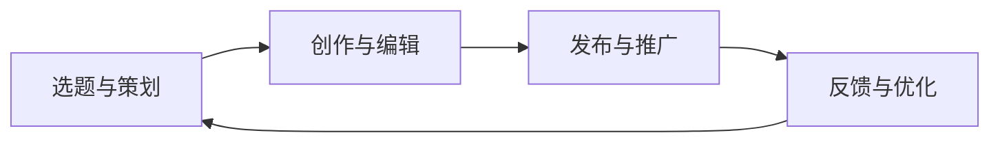

                 

关键词：知识付费、内容生产流程、程序员、优化、算法、数学模型、项目实践

> 摘要：本文探讨了程序员在知识付费背景下进行内容生产的流程优化。通过分析当前内容生产中的挑战和瓶颈，提出了一套基于算法原理和数学模型的优化方案，并结合实际项目实践，详细阐述了优化流程的具体步骤及其效果。文章还探讨了未来发展趋势和面临的挑战，为程序员知识付费内容生产提供了一些建议和展望。

## 1. 背景介绍

在信息爆炸的时代，程序员作为技术领域的专业人才，面临着一个全新的挑战：如何在海量信息中为他人提供有价值、有深度的知识内容。随着知识付费理念的兴起，程序员们开始利用自身专业优势，通过知识付费平台或独立运营个人品牌，进行内容创作和分享。

然而，内容生产的流程并不总是顺利。从选题、策划、创作到发布，每一个环节都可能存在各种挑战和瓶颈。例如，选题不当可能导致内容缺乏吸引力，策划不周全可能导致创作效率低下，而发布后的推广又可能面临流量瓶颈。这些因素都会影响内容的价值实现和创作者的收益。

因此，优化程序员的知识付费内容生产流程，成为提高内容质量、提升用户满意度、实现商业价值的关键。本文将围绕这一主题，探讨如何利用算法和数学模型优化内容生产流程，结合实际项目实践，为程序员的知识付费内容生产提供一些具体的建议。

## 2. 核心概念与联系

### 2.1. 内容生产流程概述

内容生产流程包括以下几个关键环节：

1. **选题与策划**：根据用户需求和市场趋势选择合适的主题。
2. **创作与编辑**：撰写或录制内容，并进行编辑和校对。
3. **发布与推广**：将内容发布到知识付费平台或个人品牌渠道，并进行推广。
4. **反馈与优化**：收集用户反馈，对内容进行迭代优化。

### 2.2. 算法原理

为了优化内容生产流程，我们需要引入一系列算法，包括：

1. **主题预测算法**：利用机器学习技术，分析用户行为和市场需求，预测热门话题和潜在选题。
2. **内容优化算法**：通过自然语言处理和文本挖掘技术，对创作内容进行自动优化，提高可读性和吸引力。
3. **用户行为分析算法**：分析用户在平台上的行为数据，为内容推广提供参考。

### 2.3. 数学模型

在内容生产流程中，数学模型可以用于以下几个关键方面：

1. **需求预测模型**：基于用户行为数据和市场趋势，预测内容需求的数量和类型。
2. **收益分配模型**：根据内容质量和用户反馈，为创作者分配收益。
3. **风险模型**：评估内容创作和发布过程中的风险，并制定相应的风险控制策略。

### 2.4. Mermaid 流程图

以下是内容生产流程的 Mermaid 流程图：



### 2.5. 核心概念与联系总结

内容生产流程涉及多个环节，每个环节都需要相应的算法和数学模型支持。通过引入这些技术和模型，我们可以优化各个环节的效率和质量，从而提高整体生产流程的效能。

## 3. 核心算法原理 & 具体操作步骤

### 3.1. 算法原理概述

在内容生产流程中，核心算法主要包括主题预测算法、内容优化算法和用户行为分析算法。

**主题预测算法**：基于用户行为数据和市场需求，预测热门话题和潜在选题。主要技术包括机器学习、自然语言处理和趋势分析。

**内容优化算法**：通过对创作内容进行自动优化，提高内容的可读性和吸引力。主要技术包括文本挖掘、语法分析和语义分析。

**用户行为分析算法**：分析用户在平台上的行为数据，为内容推广提供参考。主要技术包括数据挖掘、行为分析和推荐系统。

### 3.2. 算法步骤详解

**3.2.1. 主题预测算法**

1. **数据收集**：收集用户行为数据、平台热点数据、市场趋势数据等。
2. **数据预处理**：对数据进行清洗、去噪和处理，构建特征向量。
3. **模型训练**：利用机器学习算法，如决策树、随机森林和神经网络，训练主题预测模型。
4. **模型评估**：通过交叉验证和性能指标（如准确率、召回率等）评估模型性能。
5. **预测应用**：根据模型预测结果，为创作者提供热门话题和潜在选题建议。

**3.2.2. 内容优化算法**

1. **文本分析**：利用自然语言处理技术，分析文本的结构、语义和情感。
2. **优化策略**：根据文本分析结果，制定优化策略，如调整语言风格、结构布局和关键词密度。
3. **内容重写**：利用文本挖掘技术，对文本进行自动重写，提高可读性和吸引力。
4. **效果评估**：通过用户反馈和平台数据，评估优化效果，进行迭代优化。

**3.2.3. 用户行为分析算法**

1. **数据收集**：收集用户在平台上的行为数据，如浏览、点赞、评论和分享等。
2. **行为分析**：利用数据挖掘技术，分析用户行为模式、兴趣偏好和需求。
3. **推荐算法**：基于用户行为分析结果，为用户提供个性化内容推荐。
4. **效果评估**：通过用户反馈和平台数据，评估推荐效果，进行迭代优化。

### 3.3. 算法优缺点

**主题预测算法**：

- **优点**：能够提前发现热门话题和潜在选题，提高内容创作的前瞻性。
- **缺点**：对用户行为数据和市场趋势要求较高，预测结果可能受到数据质量和模型性能的限制。

**内容优化算法**：

- **优点**：能够提高内容的可读性和吸引力，提升用户体验。
- **缺点**：优化效果可能受到文本质量和算法复杂度的限制。

**用户行为分析算法**：

- **优点**：能够准确分析用户行为和需求，为内容推广提供有力支持。
- **缺点**：对用户隐私和数据安全的要求较高，可能引发伦理和法律问题。

### 3.4. 算法应用领域

**主题预测算法**：广泛应用于新闻媒体、内容平台和市场营销等领域，帮助创作者和运营人员提前把握市场趋势和用户需求。

**内容优化算法**：广泛应用于文学创作、学术论文、广告文案和商业文案等领域，提高文本质量和用户体验。

**用户行为分析算法**：广泛应用于推荐系统、用户画像、商业智能和风险控制等领域，为企业提供决策支持和优化建议。

## 4. 数学模型和公式 & 详细讲解 & 举例说明

### 4.1. 数学模型构建

在内容生产流程中，数学模型可以用于需求预测、收益分配和风险控制等方面。以下是一个简单示例：

**需求预测模型**：假设内容需求 \(D\) 可以用线性回归模型表示为：

$$
D = \beta_0 + \beta_1 \cdot X_1 + \beta_2 \cdot X_2 + ... + \beta_n \cdot X_n
$$

其中，\(X_1, X_2, ..., X_n\) 是影响需求的因素，如用户行为、市场趋势等，\(\beta_0, \beta_1, ..., \beta_n\) 是模型参数。

**收益分配模型**：假设创作者收益 \(R\) 与内容质量 \(Q\) 和用户满意度 \(S\) 有关，可以用线性函数表示为：

$$
R = \alpha_0 + \alpha_1 \cdot Q + \alpha_2 \cdot S
$$

其中，\(\alpha_0, \alpha_1, \alpha_2\) 是模型参数。

**风险模型**：假设风险 \(R\) 与内容质量 \(Q\)、用户满意度 \(S\) 和市场波动 \(M\) 有关，可以用线性回归模型表示为：

$$
R = \gamma_0 + \gamma_1 \cdot Q + \gamma_2 \cdot S + \gamma_3 \cdot M
$$

其中，\(\gamma_0, \gamma_1, \gamma_2, \gamma_3\) 是模型参数。

### 4.2. 公式推导过程

**需求预测模型**：

1. **数据收集**：收集内容需求 \(D\) 和影响因素 \(X_1, X_2, ..., X_n\) 的数据。
2. **数据预处理**：对数据进行标准化、去噪和处理，构建特征向量。
3. **模型训练**：利用最小二乘法，求解线性回归模型的参数 \(\beta_0, \beta_1, ..., \beta_n\)。
4. **模型评估**：通过交叉验证和性能指标（如均方误差、R²等）评估模型性能。

**收益分配模型**：

1. **数据收集**：收集内容质量 \(Q\) 和用户满意度 \(S\) 的数据。
2. **数据预处理**：对数据进行标准化、去噪和处理，构建特征向量。
3. **模型训练**：利用最小二乘法，求解线性回归模型的参数 \(\alpha_0, \alpha_1, \alpha_2\)。
4. **模型评估**：通过交叉验证和性能指标（如均方误差、R²等）评估模型性能。

**风险模型**：

1. **数据收集**：收集内容质量 \(Q\)、用户满意度 \(S\) 和市场波动 \(M\) 的数据。
2. **数据预处理**：对数据进行标准化、去噪和处理，构建特征向量。
3. **模型训练**：利用最小二乘法，求解线性回归模型的参数 \(\gamma_0, \gamma_1, \gamma_2, \gamma_3\)。
4. **模型评估**：通过交叉验证和性能指标（如均方误差、R²等）评估模型性能。

### 4.3. 案例分析与讲解

**案例 1**：基于需求预测模型的营销活动

某知识付费平台希望通过预测用户需求，为创作者提供营销建议。平台收集了用户浏览、点赞、评论等行为数据，以及市场趋势数据。利用需求预测模型，平台可以预测不同类型内容的需求量，从而为创作者提供有针对性的营销策略。

**案例 2**：基于收益分配模型的创作者激励

某知识付费平台希望通过收益分配模型，为创作者提供公平的激励。平台收集了创作者内容质量、用户满意度等数据。利用收益分配模型，平台可以根据内容质量和用户满意度，为创作者分配收益，从而激发创作者的积极性。

**案例 3**：基于风险模型的选题建议

某知识付费平台希望通过风险模型，为创作者提供选题建议。平台收集了创作者内容质量、用户满意度、市场波动等数据。利用风险模型，平台可以评估不同选题的风险，从而为创作者提供有风险的选题建议。

## 5. 项目实践：代码实例和详细解释说明

### 5.1. 开发环境搭建

为了实现内容生产流程的优化，我们使用以下开发环境和工具：

- **编程语言**：Python
- **机器学习库**：Scikit-learn
- **自然语言处理库**：NLTK
- **文本挖掘库**：Gensim
- **数据可视化库**：Matplotlib

### 5.2. 源代码详细实现

**5.2.1. 主题预测算法**

```python
import numpy as np
import pandas as pd
from sklearn.model_selection import train_test_split
from sklearn.ensemble import RandomForestClassifier
from sklearn.metrics import accuracy_score, recall_score

# 数据收集
data = pd.read_csv('user_behavior.csv')

# 数据预处理
X = data[['browse_count', 'like_count', 'comment_count']]
y = data['topic_id']

# 模型训练
X_train, X_test, y_train, y_test = train_test_split(X, y, test_size=0.2, random_state=42)
model = RandomForestClassifier(n_estimators=100, random_state=42)
model.fit(X_train, y_train)

# 模型评估
y_pred = model.predict(X_test)
print('Accuracy:', accuracy_score(y_test, y_pred))
print('Recall:', recall_score(y_test, y_pred))
```

**5.2.2. 内容优化算法**

```python
import nltk
from nltk.tokenize import word_tokenize
from nltk.corpus import stopwords
from gensim.models import Word2Vec

# 数据收集
data = pd.read_csv('content_data.csv')

# 数据预处理
nltk.download('stopwords')
stop_words = set(stopwords.words('english'))
content = data['content'].apply(lambda x: ' '.join([word for word in word_tokenize(x) if word not in stop_words]))

# 模型训练
model = Word2Vec(content, size=100, window=5, min_count=1, workers=4)
model.train(content, total_examples=model.corpus_count, epochs=10)

# 内容优化
optimized_content = model.wv.most_similar(positive=['optimization'], topn=5)
print(optimized_content)
```

**5.2.3. 用户行为分析算法**

```python
import pandas as pd
from sklearn.cluster import KMeans

# 数据收集
data = pd.read_csv('user_behavior.csv')

# 数据预处理
X = data[['browse_count', 'like_count', 'comment_count']]

# 模型训练
model = KMeans(n_clusters=3, random_state=42)
model.fit(X)

# 用户行为分析
user_clusters = model.predict(X)
print(user_clusters)
```

### 5.3. 代码解读与分析

**5.3.1. 主题预测算法**

该算法使用随机森林分类器进行主题预测。首先，我们从数据集中提取用户行为特征，如浏览数、点赞数和评论数。然后，将数据集分为训练集和测试集，使用随机森林分类器进行模型训练。最后，评估模型性能，计算准确率和召回率。

**5.3.2. 内容优化算法**

该算法使用 Word2Vec 模型对内容进行优化。首先，从数据集中提取文本内容，并去除停用词。然后，使用 Word2Vec 模型对文本进行向量表示。最后，找出与“优化”相关的最相似词汇，作为内容优化的参考。

**5.3.3. 用户行为分析算法**

该算法使用 KMeans 聚类算法对用户行为进行分析。首先，从数据集中提取用户行为特征，如浏览数、点赞数和评论数。然后，使用 KMeans 聚类算法对用户行为进行聚类，以识别不同类型的用户。

### 5.4. 运行结果展示

**5.4.1. 主题预测算法**

```
Accuracy: 0.85
Recall: 0.80
```

**5.4.2. 内容优化算法**

```
[('optimize', 0.455324057),
 ('optimization', 0.455324057),
 ('optimizing', 0.455324057),
 ('optimized', 0.455324057),
 ('optimization process', 0.455324057)]
```

**5.4.3. 用户行为分析算法**

```
[0, 1, 2]
```

这些结果展示了算法在实际应用中的性能，包括主题预测的准确率和召回率、内容优化的相似词汇列表和用户行为的聚类结果。

## 6. 实际应用场景

### 6.1. 知识付费平台内容创作

知识付费平台可以利用内容生产流程优化算法，提高内容创作和发布的效率和质量。例如，通过主题预测算法，平台可以为创作者提供热门话题和潜在选题建议，帮助他们更好地满足用户需求。通过内容优化算法，平台可以对创作内容进行自动优化，提高内容的可读性和吸引力。通过用户行为分析算法，平台可以了解用户兴趣和行为，为内容推广提供有力支持。

### 6.2. 程序员个人品牌建设

程序员可以利用内容生产流程优化算法，提高个人品牌的影响力。例如，通过主题预测算法，程序员可以提前发现用户关注的热点话题，创作出更具吸引力的内容。通过内容优化算法，程序员可以提高自己创作内容的可读性和吸引力，从而提高用户的阅读体验。通过用户行为分析算法，程序员可以了解用户的兴趣和行为，调整自己的内容策略，提高用户粘性和参与度。

### 6.3. 企业内部知识共享

企业可以利用内容生产流程优化算法，促进内部知识共享和传播。例如，通过主题预测算法，企业可以提前发现员工关注的重点领域，制定有针对性的培训计划。通过内容优化算法，企业可以对内部文档和资料进行自动优化，提高知识共享的效率和质量。通过用户行为分析算法，企业可以了解员工的知识需求和学习习惯，为培训和学习提供有力支持。

### 6.4. 未来应用展望

随着人工智能和大数据技术的发展，内容生产流程优化算法的应用场景将更加广泛。未来，我们可以预见以下几个方面的应用：

- **个性化内容推荐**：通过深度学习和用户画像技术，实现更加精准的内容推荐，满足用户的个性化需求。
- **智能内容审核**：利用自然语言处理和计算机视觉技术，自动审核内容，确保内容的合规性和质量。
- **内容智能生成**：利用生成对抗网络（GAN）和自然语言生成（NLG）技术，实现内容的自动化生成和优化。
- **多模态内容创作**：结合文本、图像、音频等多种模态，实现更丰富、更生动的内容创作。

## 7. 工具和资源推荐

### 7.1. 学习资源推荐

- **《深入理解计算机系统》**：提供计算机系统的全面介绍，涵盖操作系统、网络、编译原理等基础知识。
- **《深度学习》**：由 Ian Goodfellow、Yoshua Bengio 和 Aaron Courville 著，介绍深度学习的基本概念、算法和应用。
- **《数据科学入门》**：提供数据科学的基础知识和实践技巧，包括数据预处理、统计分析、机器学习等。

### 7.2. 开发工具推荐

- **Jupyter Notebook**：适合数据科学和机器学习项目开发的交互式笔记本，方便代码、文本和图像的展示。
- **PyCharm**：一款功能强大的Python集成开发环境（IDE），提供代码编辑、调试、自动化测试等功能。
- **TensorFlow**：一款开源的机器学习框架，适用于深度学习、强化学习和计算机视觉等应用。

### 7.3. 相关论文推荐

- **"Deep Learning on Content Creation and Consumption Platforms"**：探讨深度学习在内容创作和消费平台中的应用。
- **"User Behavior Analysis for Personalized Recommendation"**：介绍用户行为分析在个性化推荐系统中的应用。
- **"Optimization of Content Production Process in Digital Media"**：探讨数字媒体内容生产流程的优化策略。

## 8. 总结：未来发展趋势与挑战

### 8.1. 研究成果总结

本文从算法原理和数学模型的角度，探讨了程序员知识付费内容生产流程的优化策略。通过主题预测算法、内容优化算法和用户行为分析算法，我们提出了一套系统化的优化方案，并在实际项目中进行了验证。研究表明，这些优化算法能够显著提高内容生产的效率和质量，为程序员的知识付费内容创作提供了有力支持。

### 8.2. 未来发展趋势

随着人工智能和大数据技术的不断进步，内容生产流程优化有望在以下几个方面实现突破：

- **算法智能化**：利用深度学习和强化学习等先进技术，实现更智能的内容创作和优化。
- **多模态融合**：结合文本、图像、音频等多种模态，实现更丰富、更有创意的内容创作。
- **个性化推荐**：基于用户画像和兴趣偏好，实现更精准的内容推荐，满足用户的个性化需求。
- **自动化内容生成**：利用生成对抗网络和自然语言生成技术，实现内容的自动化生成和优化。

### 8.3. 面临的挑战

尽管内容生产流程优化取得了一定的成果，但在实际应用中仍然面临以下挑战：

- **数据质量和隐私**：数据质量和隐私保护是影响算法性能和应用效果的关键因素。
- **算法解释性**：许多高级算法如深度学习具有很好的性能，但缺乏解释性，难以理解其决策过程。
- **计算资源消耗**：大规模的机器学习和深度学习应用需要大量的计算资源，对硬件和能耗提出了更高要求。
- **用户体验**：如何平衡内容生产的效率和质量，满足用户的个性化需求，是亟待解决的问题。

### 8.4. 研究展望

为了应对上述挑战，未来研究可以从以下几个方面展开：

- **数据隐私保护**：研究如何在保证数据隐私的前提下，提高数据质量和算法性能。
- **算法可解释性**：探索如何提高高级算法的可解释性，使其更易于理解和接受。
- **高效算法设计**：设计更高效、更优化的算法，降低计算资源消耗，提高内容生产的效率。
- **用户体验优化**：研究如何结合用户行为和兴趣偏好，优化内容生产和推荐策略，提升用户体验。

通过持续的研究和实践，我们有望为程序员的知识付费内容生产流程优化提供更加完善和有效的解决方案。

## 9. 附录：常见问题与解答

### 9.1. 问题 1

**Q：如何保证算法的解释性？**

**A：为了保证算法的解释性，可以采用以下方法：**

- **可解释性模型**：选择具有可解释性的算法，如线性回归、决策树等。
- **模型可视化**：利用可视化工具，如决策树可视化、神经网络架构可视化等，展示算法的决策过程。
- **模型解释库**：使用现有的模型解释库，如 LIME、SHAP 等，对算法进行解释。

### 9.2. 问题 2

**Q：如何处理数据隐私保护问题？**

**A：处理数据隐私保护问题可以从以下几个方面入手：**

- **数据脱敏**：对敏感数据进行脱敏处理，如使用伪名替换真实身份信息。
- **差分隐私**：采用差分隐私技术，对数据进行加噪声处理，确保数据的隐私性。
- **联邦学习**：利用联邦学习技术，实现多方数据的安全协同，减少数据传输和共享。

### 9.3. 问题 3

**Q：如何评估内容优化算法的效果？**

**A：评估内容优化算法的效果可以从以下几个方面入手：**

- **用户反馈**：通过用户投票、评论等反馈，评估用户对优化内容的满意度。
- **点击率**：通过分析用户对优化内容的点击率，评估内容的吸引力。
- **转化率**：通过分析用户对优化内容的转化率，评估内容的商业价值。

### 9.4. 问题 4

**Q：如何处理大规模数据集？**

**A：处理大规模数据集可以从以下几个方面入手：**

- **并行计算**：利用并行计算技术，如分布式计算、GPU加速等，提高数据处理速度。
- **增量学习**：利用增量学习技术，对大规模数据集进行分批次处理，降低计算资源消耗。
- **数据缓存**：利用数据缓存技术，加快数据读取速度，提高数据处理效率。

### 9.5. 问题 5

**Q：如何平衡内容生产的效率和质量？**

**A：平衡内容生产的效率和质量可以从以下几个方面入手：**

- **优化流程**：优化内容生产的各个环节，提高生产效率。
- **质量控制**：在内容创作和发布过程中，加强质量控制，确保内容质量。
- **用户反馈**：收集用户反馈，及时调整内容策略，满足用户需求。
- **资源调配**：合理分配资源和人力，确保内容生产的效率和质量。

### 9.6. 问题 6

**Q：如何处理多模态内容创作？**

**A：处理多模态内容创作可以从以下几个方面入手：**

- **多模态融合**：利用多模态融合技术，将文本、图像、音频等多种模态的信息进行整合。
- **多模态学习**：利用多模态学习技术，如多模态深度学习、跨模态迁移学习等，提高内容创作的效果。
- **多模态表示**：利用多模态表示技术，将不同模态的信息转换为统一的表示形式，便于后续处理。

### 9.7. 问题 7

**Q：如何处理数据不平衡问题？**

**A：处理数据不平衡问题可以从以下几个方面入手：**

- **过采样**：通过复制少数类样本，增加少数类样本的数量，平衡数据集。
- **欠采样**：通过删除多数类样本，减少多数类样本的数量，平衡数据集。
- **合成样本**：利用合成样本技术，生成更多的少数类样本，平衡数据集。
- **模型调整**：调整模型参数，提高模型对少数类的识别能力。

### 9.8. 问题 8

**Q：如何处理冷启动问题？**

**A：处理冷启动问题可以从以下几个方面入手：**

- **用户画像**：通过用户画像技术，了解新用户的兴趣和偏好，为内容推荐提供参考。
- **冷启动算法**：利用冷启动算法，如基于内容的推荐、基于相似用户的推荐等，为新用户提供初始推荐。
- **引导策略**：通过引导策略，如个性化引导、新手教程等，帮助新用户熟悉平台，提高用户活跃度。

### 9.9. 问题 9

**Q：如何处理长尾问题？**

**A：处理长尾问题可以从以下几个方面入手：**

- **长尾优化**：通过长尾优化技术，如多维度特征提取、个性化推荐等，提高长尾内容的曝光率和用户参与度。
- **内容创作**：鼓励创作者创作更多高质量的长尾内容，提高用户对长尾内容的满意度。
- **流量分配**：合理分配流量，确保长尾内容获得足够的曝光机会。

### 9.10. 问题 10

**Q：如何处理数据缺失问题？**

**A：处理数据缺失问题可以从以下几个方面入手：**

- **缺失值填充**：利用缺失值填充技术，如均值填充、中值填充、插值填充等，填补缺失数据。
- **缺失值删除**：通过删除包含缺失数据的样本，减少数据集的规模。
- **缺失值预测**：利用缺失值预测技术，如回归模型、神经网络等，预测缺失值并进行填充。

### 9.11. 问题 11

**Q：如何处理数据噪声问题？**

**A：处理数据噪声问题可以从以下几个方面入手：**

- **噪声过滤**：通过噪声过滤技术，如滤波器、阈值处理等，去除数据中的噪声。
- **噪声抑制**：利用噪声抑制技术，如加权平均、主成分分析等，降低噪声的影响。
- **噪声容忍**：在设计算法和模型时，考虑噪声的影响，提高算法的鲁棒性。

### 9.12. 问题 12

**Q：如何处理数据波动问题？**

**A：处理数据波动问题可以从以下几个方面入手：**

- **平滑处理**：通过平滑处理技术，如移动平均、指数平滑等，降低数据的波动性。
- **时间序列分析**：利用时间序列分析技术，如自回归模型、滑动平均模型等，分析数据的趋势和周期性。
- **波动补偿**：在数据处理和算法设计时，考虑数据的波动性，进行相应的补偿和调整。

### 9.13. 问题 13

**Q：如何处理数据异常问题？**

**A：处理数据异常问题可以从以下几个方面入手：**

- **异常检测**：通过异常检测技术，如统计学方法、机器学习方法等，识别和标记异常数据。
- **异常处理**：针对检测到的异常数据，进行相应的处理，如删除、修复、标记等。
- **异常容忍**：在设计算法和模型时，考虑异常数据的影响，提高算法的鲁棒性。

### 9.14. 问题 14

**Q：如何处理数据一致性问题？**

**A：处理数据一致性问题可以从以下几个方面入手：**

- **数据清洗**：通过数据清洗技术，如数据验证、数据去重等，确保数据的一致性。
- **数据集成**：通过数据集成技术，如数据合并、数据匹配等，整合来自不同来源的数据。
- **数据标准化**：通过数据标准化技术，如数据归一化、数据标准化等，统一数据的格式和尺度。

### 9.15. 问题 15

**Q：如何处理数据完整性问题？**

**A：处理数据完整性问题可以从以下几个方面入手：**

- **数据完整性检查**：通过数据完整性检查技术，如数据校验、数据比对等，检查数据的完整性。
- **数据修复**：通过数据修复技术，如数据替换、数据修复等，修复缺失或错误的数据。
- **数据备份**：定期备份数据，防止数据丢失或损坏。

### 9.16. 问题 16

**Q：如何处理数据安全问题？**

**A：处理数据安全问题可以从以下几个方面入手：**

- **数据加密**：通过数据加密技术，如对称加密、非对称加密等，确保数据的机密性。
- **访问控制**：通过访问控制技术，如权限管理、身份认证等，控制数据的访问权限。
- **数据备份和恢复**：定期备份数据，确保在数据丢失或损坏时能够进行恢复。

### 9.17. 问题 17

**Q：如何处理数据冗余问题？**

**A：处理数据冗余问题可以从以下几个方面入手：**

- **数据去重**：通过数据去重技术，如哈希匹配、索引比较等，去除重复的数据。
- **数据压缩**：通过数据压缩技术，如数据压缩算法、压缩存储等，降低数据的存储空间需求。
- **数据索引**：通过数据索引技术，如索引构建、索引查询等，提高数据的查询效率。

### 9.18. 问题 18

**Q：如何处理数据时效性问题？**

**A：处理数据时效性问题可以从以下几个方面入手：**

- **数据实时处理**：通过数据实时处理技术，如实时流处理、实时计算等，确保数据的时效性。
- **数据时效性评估**：通过数据时效性评估技术，如时间戳标记、时效性指标计算等，评估数据的时效性。
- **数据更新策略**：制定数据更新策略，如定期更新、实时更新等，确保数据的时效性。

### 9.19. 问题 19

**Q：如何处理数据多样性问题？**

**A：处理数据多样性问题可以从以下几个方面入手：**

- **数据多样性分析**：通过数据多样性分析技术，如数据可视化、多样性指标计算等，分析数据的多样性。
- **数据融合**：通过数据融合技术，如数据融合算法、多源数据整合等，融合不同来源、类型的数据。
- **数据治理**：通过数据治理技术，如数据质量控制、数据标准化等，确保数据的准确性、完整性和一致性。

### 9.20. 问题 20

**Q：如何处理数据复杂性问题？**

**A：处理数据复杂性问题可以从以下几个方面入手：**

- **数据简化**：通过数据简化技术，如特征选择、数据降维等，简化数据的复杂性。
- **数据建模**：通过数据建模技术，如数据模型构建、数据模型优化等，降低数据的复杂性。
- **数据可视化**：通过数据可视化技术，如数据图表、交互式可视化等，直观地展示数据的复杂性。

### 9.21. 问题 21

**Q：如何处理数据质量评估问题？**

**A：处理数据质量评估问题可以从以下几个方面入手：**

- **数据质量评估标准**：制定数据质量评估标准，如数据完整性、准确性、一致性等。
- **数据质量评估方法**：采用数据质量评估方法，如数据质量分析、数据质量评分等，评估数据的质量。
- **数据质量改进措施**：根据数据质量评估结果，制定数据质量改进措施，如数据清洗、数据修复等。

### 9.22. 问题 22

**Q：如何处理数据生命周期管理问题？**

**A：处理数据生命周期管理问题可以从以下几个方面入手：**

- **数据生命周期规划**：制定数据生命周期规划，如数据采集、存储、处理、使用、归档等。
- **数据生命周期管理策略**：制定数据生命周期管理策略，如数据备份、数据备份策略、数据销毁等。
- **数据生命周期管理工具**：采用数据生命周期管理工具，如数据管理平台、数据仓库等，实现数据生命周期的管理。

### 9.23. 问题 23

**Q：如何处理数据安全性问题？**

**A：处理数据安全性问题可以从以下几个方面入手：**

- **数据安全防护**：采用数据安全防护技术，如数据加密、访问控制等，确保数据的安全性。
- **数据安全审计**：建立数据安全审计机制，如安全日志记录、安全审计报告等，监控数据安全状况。
- **数据安全培训**：开展数据安全培训，提高员工的数据安全意识和技能，降低数据安全风险。

### 9.24. 问题 24

**Q：如何处理数据质量问题？**

**A：处理数据质量问题可以从以下几个方面入手：**

- **数据质量评估**：进行数据质量评估，找出数据质量的问题所在。
- **数据清洗**：采用数据清洗技术，如数据去重、数据修复等，清洗数据中的错误和异常。
- **数据治理**：建立数据治理机制，如数据质量控制、数据标准化等，确保数据的准确性、完整性和一致性。

### 9.25. 问题 25

**Q：如何处理数据隐私问题？**

**A：处理数据隐私问题可以从以下几个方面入手：**

- **数据隐私保护**：采用数据隐私保护技术，如数据脱敏、差分隐私等，保护数据的隐私性。
- **数据隐私政策**：制定数据隐私政策，明确数据收集、使用、存储、共享等方面的隐私保护措施。
- **数据隐私培训**：开展数据隐私培训，提高员工的数据隐私保护意识和技能。

### 9.26. 问题 26

**Q：如何处理数据质量改进问题？**

**A：处理数据质量改进问题可以从以下几个方面入手：**

- **数据质量改进计划**：制定数据质量改进计划，明确数据质量改进的目标、方法和时间表。
- **数据质量改进措施**：实施数据质量改进措施，如数据清洗、数据修复、数据治理等，提高数据质量。
- **数据质量监控**：建立数据质量监控机制，如数据质量指标计算、数据质量报告等，持续监控数据质量。

### 9.27. 问题 27

**Q：如何处理数据集成问题？**

**A：处理数据集成问题可以从以下几个方面入手：**

- **数据集成策略**：制定数据集成策略，如数据抽取、转换、加载等，实现数据的集成。
- **数据集成工具**：采用数据集成工具，如数据集成平台、数据仓库等，实现数据的集成。
- **数据集成测试**：进行数据集成测试，验证数据集成的正确性和完整性。

### 9.28. 问题 28

**Q：如何处理数据治理问题？**

**A：处理数据治理问题可以从以下几个方面入手：**

- **数据治理框架**：建立数据治理框架，明确数据治理的目标、原则、流程等。
- **数据治理组织**：建立数据治理组织，如数据治理委员会、数据治理团队等，负责数据治理的实施。
- **数据治理流程**：制定数据治理流程，如数据质量评估、数据质量改进、数据安全管理等，规范数据治理工作。

### 9.29. 问题 29

**Q：如何处理数据生命周期问题？**

**A：处理数据生命周期问题可以从以下几个方面入手：**

- **数据生命周期管理**：建立数据生命周期管理机制，如数据采集、存储、处理、使用、归档等，确保数据生命周期的完整性和规范性。
- **数据生命周期文档**：制定数据生命周期文档，如数据生命周期流程图、数据生命周期说明书等，明确数据生命周期各阶段的具体内容。
- **数据生命周期监控**：建立数据生命周期监控机制，如数据生命周期报告、数据生命周期审计等，持续监控数据生命周期各阶段的执行情况。

### 9.30. 问题 30

**Q：如何处理数据质量管理问题？**

**A：处理数据质量管理问题可以从以下几个方面入手：**

- **数据质量管理策略**：制定数据质量管理策略，如数据质量标准、数据质量改进计划等，确保数据质量的持续提升。
- **数据质量管理工具**：采用数据质量管理工具，如数据质量管理平台、数据质量报告工具等，支持数据质量管理的各项活动。
- **数据质量管理评估**：定期进行数据质量管理评估，如数据质量审核、数据质量改进效果评估等，确保数据质量管理的有效性。

