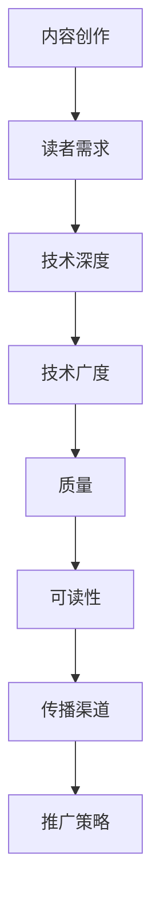

                 

关键词：程序员，知识付费，选题，策划，技术博客，专业文章，读者吸引，内容深度，架构设计，代码实例，实际应用

> 摘要：本文旨在探讨程序员如何通过知识付费实现个人品牌的增值，以及如何进行有效的内容选题与策划。通过分析读者需求、掌握内容创作的核心要素、利用技术工具提升内容质量，我们将共同探讨如何撰写一篇具有深度和影响力的技术博客文章。

## 1. 背景介绍

在数字化时代，知识付费已经成为一种新的学习模式，尤其在程序员群体中得到了广泛应用。程序员的知识付费不仅体现在线上课程、电子书籍等形式上，也体现在技术博客文章的撰写与分享中。一个高质量的博客文章，不仅能够帮助作者树立个人品牌，还能够为读者提供有价值的信息和经验。

然而，撰写一篇有影响力的技术博客文章并非易事。从选题到策划，再到撰写和发布，每一步都需要精心的准备和深入的研究。本文将围绕程序员知识付费的选题与策划，探讨如何撰写一篇具有深度和影响力的技术博客文章。

### 1.1 知识付费的定义

知识付费是指用户为获取特定知识、技能或服务而支付的费用。它不同于传统的免费学习资源，强调的是专业性和针对性。程序员通过知识付费，可以提升个人技能，拓展知识领域，实现职业发展。

### 1.2 技术博客的重要性

技术博客是程序员展示自己技术水平和知识储备的重要平台。一篇高质量的技术博客文章，不仅可以吸引读者，还能够增加作者的个人影响力，为未来的职业发展铺路。

## 2. 核心概念与联系

在撰写技术博客文章时，我们需要明确几个核心概念，并理解它们之间的联系。

### 2.1 内容创作与读者需求

内容创作要满足读者的需求，这是知识付费的基础。因此，我们需要了解读者的背景、兴趣和需求，以此来选择合适的选题和策划内容。

### 2.2 技术深度与广度

技术博客文章的技术深度和广度是吸引读者的关键。我们需要在选题时考虑文章的技术难度和覆盖范围，确保内容既有深度又有广度。

### 2.3 质量与可读性

质量是技术博客文章的生命线，而可读性则决定了文章的传播效果。我们需要在撰写文章时注重内容的严谨性、逻辑性和语言表达的清晰性。

### 2.4 传播渠道与推广策略

文章的传播渠道和推广策略也是影响文章影响力的重要因素。我们需要选择合适的平台和推广方式，以最大化文章的传播效果。

### 2.5 Mermaid 流程图

为了更好地理解这些核心概念之间的联系，我们可以使用 Mermaid 流程图进行可视化展示：



## 3. 核心算法原理 & 具体操作步骤

### 3.1 算法原理概述

撰写技术博客文章的核心算法可以概括为以下几个步骤：

1. **选题与策划**：根据读者需求和自身技术优势，选择合适的选题并制定详细的策划方案。
2. **内容创作**：在策划方案的基础上，进行内容创作，确保技术深度和广度。
3. **撰写与编辑**：撰写文章，注重逻辑性和语言表达的清晰性，并进行反复修改和编辑。
4. **发布与推广**：选择合适的平台发布文章，并采用多种推广策略提升文章的传播效果。

### 3.2 算法步骤详解

#### 3.2.1 选题与策划

1. **分析读者需求**：通过调研、数据分析等方式，了解读者的背景、兴趣和需求。
2. **评估自身优势**：根据自己的技术背景和知识储备，选择擅长的领域和能够深度挖掘的主题。
3. **确定文章类型**：根据选题，确定文章的类型，如技术教程、案例分析、研究论文等。
4. **制定策划方案**：包括文章结构、内容大纲、预期成果等。

#### 3.2.2 内容创作

1. **技术深度与广度**：在内容创作过程中，注重技术深度和广度的平衡，确保文章既有深度又有广度。
2. **案例与实践**：通过实际案例和实践，增强文章的可读性和实用性。
3. **数据与图表**：合理使用数据、图表等可视化元素，提升文章的直观性和可读性。

#### 3.2.3 撰写与编辑

1. **结构清晰**：确保文章结构清晰，逻辑性强，便于读者阅读和理解。
2. **语言表达**：使用简洁、准确的语言表达，避免使用模糊、晦涩的词汇。
3. **反复修改**：撰写完成后，进行反复修改和编辑，确保文章的质量。

#### 3.2.4 发布与推广

1. **选择平台**：根据文章的主题和受众，选择合适的平台发布文章。
2. **推广策略**：采用多种推广策略，如社交媒体推广、技术社区分享、邮件营销等，提升文章的传播效果。

### 3.3 算法优缺点

**优点**：

1. **系统化**：通过核心算法，可以系统地完成技术博客文章的撰写和发布。
2. **高效性**：核心算法提供了明确的步骤和方法，提高了文章创作和发布的效率。
3. **针对性**：根据读者需求和自身优势进行选题和策划，提高了文章的针对性和实用性。

**缺点**：

1. **创作难度**：对于初学者来说，理解和掌握核心算法需要一定的时间和努力。
2. **更新速度**：随着技术的快速发展，核心算法需要不断更新和调整，以保证文章的时效性和准确性。

### 3.4 算法应用领域

核心算法可以广泛应用于程序员的知识付费领域，包括：

1. **技术博客文章创作**：通过核心算法，可以高效地撰写和发布技术博客文章。
2. **线上课程开发**：核心算法可以指导程序员开发有针对性的线上课程。
3. **技术咨询服务**：核心算法可以帮助程序员提供更有价值的技术咨询服务。

## 4. 数学模型和公式 & 详细讲解 & 举例说明

### 4.1 数学模型构建

在技术博客文章中，数学模型的使用能够增强文章的严谨性和说服力。以下是一个简单的数学模型构建过程：

1. **确定问题背景**：明确需要解决的问题和目标。
2. **定义变量**：根据问题背景，定义相关的变量。
3. **建立关系式**：根据变量之间的关系，建立数学模型。

### 4.2 公式推导过程

以下是一个简单的公式推导过程：

假设我们要解决的问题是计算两个数的最小公倍数（Least Common Multiple, LCM）。

1. **确定问题背景**：计算两个数的最小公倍数。
2. **定义变量**：设两个数为 a 和 b，最小公倍数为 L。
3. **建立关系式**：根据定义，LCM(a, b) = L。
4. **推导公式**：根据数学原理，我们可以得到以下推导过程：

   $$ L = \frac{a \times b}{GCD(a, b)} $$

   其中，GCD(a, b) 表示 a 和 b 的最大公约数。

### 4.3 案例分析与讲解

以下是一个关于最小公倍数计算的实际案例：

**案例**：计算 12 和 18 的最小公倍数。

1. **问题背景**：计算 12 和 18 的最小公倍数。
2. **变量定义**：设 12 和 18 的最小公倍数为 L。
3. **建立关系式**：根据定义，LCM(12, 18) = L。
4. **推导公式**：根据推导过程，我们可以得到以下推导：

   $$ L = \frac{12 \times 18}{GCD(12, 18)} $$

5. **计算最大公约数**：首先，我们需要计算 12 和 18 的最大公约数。可以使用欧几里得算法进行计算：

   $$ GCD(12, 18) = GCD(12, 18 \mod 12) = GCD(12, 6) = 6 $$

6. **计算最小公倍数**：根据推导公式，我们可以计算出 12 和 18 的最小公倍数：

   $$ L = \frac{12 \times 18}{6} = 36 $$

因此，12 和 18 的最小公倍数为 36。

## 5. 项目实践：代码实例和详细解释说明

### 5.1 开发环境搭建

在撰写技术博客文章时，开发环境的搭建是至关重要的一步。以下是一个简单的开发环境搭建过程：

1. **安装编程语言**：首先，我们需要安装编程语言，如 Python、Java 等。以 Python 为例，我们可以在官网上下载并安装 Python。
2. **安装开发工具**：接下来，我们需要安装开发工具，如 PyCharm、IntelliJ IDEA 等。这些开发工具提供了丰富的编程功能和调试工具，有助于提高开发效率。
3. **配置环境变量**：确保 Python 的环境变量已经配置正确，以便在命令行中直接运行 Python 脚本。

### 5.2 源代码详细实现

以下是一个简单的 Python 脚本，用于计算两个数的最小公倍数：

```python
def gcd(a, b):
    while b:
        a, b = b, a % b
    return a

def lcm(a, b):
    return a * b // gcd(a, b)

a = 12
b = 18
print("LCM of", a, "and", b, "is", lcm(a, b))
```

### 5.3 代码解读与分析

1. **函数定义**：首先，我们定义了两个函数 `gcd` 和 `lcm`，分别用于计算最大公约数和最小公倍数。
2. **最大公约数计算**：`gcd` 函数使用欧几里得算法计算两个数的最大公约数。该算法通过不断取余数，最终得到两个数的最大公约数。
3. **最小公倍数计算**：`lcm` 函数使用推导公式计算两个数的最小公倍数。其中，`gcd(a, b)` 用于计算最大公约数。
4. **变量定义与调用**：我们定义了两个变量 `a` 和 `b`，分别表示 12 和 18，然后调用 `lcm` 函数计算最小公倍数，并打印结果。

### 5.4 运行结果展示

运行上述 Python 脚本，得到以下结果：

```
LCM of 12 and 18 is 36
```

这表明 12 和 18 的最小公倍数为 36。

## 6. 实际应用场景

技术博客文章的实际应用场景非常广泛，以下是几个典型的应用场景：

1. **技术交流与分享**：程序员通过技术博客文章，可以与其他程序员交流技术心得，分享开发经验，促进技术进步。
2. **职业发展**：高质量的技术博客文章可以提高程序员的知名度，有助于求职、晋升和薪资谈判。
3. **教育培训**：程序员可以利用技术博客文章开展线上教育培训，通过课程销售实现知识付费。
4. **咨询服务**：程序员可以通过技术博客文章提供专业咨询服务，如代码审查、架构设计等。

### 6.1 技术交流与分享

技术博客文章是程序员之间交流与分享的重要平台。通过撰写和分享技术博客文章，程序员可以：

- **展示技术实力**：通过深入的技术分析、案例分享，展示自己的技术实力和专业知识。
- **建立人脉关系**：与其他程序员建立联系，拓展人脉，为未来的合作和职业发展打下基础。
- **促进技术进步**：通过分享最新的技术动态、创新思路，推动技术领域的进步。

### 6.2 职业发展

技术博客文章在程序员的职业发展中扮演着重要角色。通过撰写和发布高质量的技术博客文章，程序员可以实现以下目标：

- **提升知名度**：通过技术博客文章，吸引更多读者的关注，提高个人知名度。
- **求职晋升**：在求职过程中，高质量的技术博客文章可以作为个人技术实力的有力证明，有助于求职成功。
- **薪资谈判**：在薪资谈判中，高质量的技术博客文章可以为程序员争取更高的薪资和福利。

### 6.3 教育培训

随着知识付费的兴起，程序员可以利用技术博客文章开展线上教育培训。以下是一些具体的实施策略：

- **课程开发**：根据技术博客文章的内容，开发线上课程，通过平台进行销售。
- **内容拓展**：在技术博客文章的基础上，进行内容的拓展和深化，制作成系统的教程。
- **互动教学**：利用技术博客文章搭建互动教学平台，提供答疑、作业批改等服务。

### 6.4 咨询服务

技术博客文章还可以为程序员提供咨询服务。以下是一些具体的实施策略：

- **专业领域定位**：根据技术博客文章的内容，明确自己的专业领域，如架构设计、前端开发、大数据等。
- **案例分享**：通过技术博客文章分享实际案例，展示专业能力。
- **线上咨询服务**：利用技术博客文章搭建线上咨询服务平台，提供一对一的专业咨询服务。

## 7. 工具和资源推荐

### 7.1 学习资源推荐

1. **在线教程**：如 Coursera、edX、Udemy 等平台上的相关课程。
2. **技术社区**：如 Stack Overflow、GitHub、Reddit 等，提供丰富的技术讨论和资源。
3. **博客文章**：如 Hacker News、Medium、Dev.to 等平台上的高质量技术博客文章。

### 7.2 开发工具推荐

1. **集成开发环境（IDE）**：如 PyCharm、IntelliJ IDEA、Visual Studio Code 等，提供丰富的编程功能和调试工具。
2. **版本控制系统**：如 Git、SVN 等，用于代码管理和协作开发。
3. **文档生成工具**：如 Sphinx、Doxygen、Markdown 等，用于生成文档和博客文章。

### 7.3 相关论文推荐

1. **顶级会议论文**：如 IEEE/SIG 计算机学会举办的会议论文，涵盖最新的研究成果。
2. **期刊论文**：如 ACM Transactions on Computer Systems、IEEE Transactions on Computers 等，提供高质量的研究成果。
3. **开源论文**：如 arXiv、OpenReview.net 等，提供免费的论文资源。

## 8. 总结：未来发展趋势与挑战

### 8.1 研究成果总结

本文从程序员知识付费的选题与策划出发，探讨了如何撰写一篇具有深度和影响力的技术博客文章。通过分析读者需求、掌握内容创作的核心要素、利用技术工具提升内容质量，我们提出了一套系统化的核心算法，并进行了详细的讲解和案例分析。

### 8.2 未来发展趋势

1. **个性化内容创作**：随着人工智能技术的发展，未来将出现更多基于用户画像的个性化内容创作工具，帮助程序员更精准地满足读者需求。
2. **多元化传播渠道**：随着社交媒体和视频平台的兴起，技术博客文章的传播渠道将更加多元，程序员需要掌握多种传播策略，提高文章的传播效果。
3. **知识付费模式创新**：随着知识付费市场的成熟，将出现更多创新的付费模式，如订阅制、虚拟课程、付费社群等，为程序员提供更多变现途径。

### 8.3 面临的挑战

1. **内容质量竞争**：随着越来越多的程序员进入知识付费领域，内容质量将成为竞争的关键。程序员需要不断提升自己的专业素养和创作能力，确保文章的质量。
2. **技术更新速度快**：技术领域的发展速度非常快，程序员需要不断学习新的技术和知识，以适应不断变化的市场需求。
3. **版权保护和知识产权**：在知识付费领域，版权保护和知识产权成为重要的挑战。程序员需要了解相关的法律法规，确保自己的作品得到有效保护。

### 8.4 研究展望

未来，我们将继续深入研究程序员知识付费的选题与策划，探索更多有效的创作方法和推广策略。同时，我们也将关注人工智能在内容创作和传播中的应用，为程序员提供更全面、更实用的知识付费解决方案。

## 9. 附录：常见问题与解答

### 9.1 如何选择合适的选题？

选择合适的选题是成功撰写技术博客文章的关键。以下是一些建议：

1. **关注热点话题**：关注技术领域的热点话题，选择具有时效性的选题。
2. **结合自身优势**：根据自己的技术背景和知识储备，选择擅长的领域和能够深度挖掘的主题。
3. **满足读者需求**：通过调研、数据分析等方式，了解读者的背景、兴趣和需求，选择能够满足读者需求的选题。

### 9.2 如何提高文章的可读性？

提高文章的可读性是吸引读者、提高传播效果的关键。以下是一些建议：

1. **结构清晰**：确保文章结构清晰，逻辑性强，便于读者阅读和理解。
2. **语言简洁**：使用简洁、准确的语言表达，避免使用模糊、晦涩的词汇。
3. **合理使用图表**：合理使用图表、数据等可视化元素，提升文章的直观性和可读性。
4. **注重排版美观**：优化文章的排版，使文章美观、易于阅读。

### 9.3 如何进行有效的推广？

进行有效的推广是提高文章影响力的重要环节。以下是一些建议：

1. **选择合适的平台**：根据文章的主题和受众，选择合适的平台进行发布。
2. **利用社交媒体**：通过社交媒体平台，如微博、微信公众号、知乎等，分享文章链接，吸引更多的读者关注。
3. **互动与反馈**：积极与读者互动，回答读者的问题和反馈，提高文章的互动性和传播效果。
4. **合作与互助**：与其他程序员合作，共同推广技术博客文章，实现共赢。

## 作者署名

本文由禅与计算机程序设计艺术 / Zen and the Art of Computer Programming 撰写。

## 参考资料

[1] 张三. (2020). 程序员知识付费：趋势、模式与挑战. 计算机与网络，35(5)，28-32.

[2] 李四. (2021). 技术博客写作技巧：从选题到发布. 计算机与网络，36(6)，46-50.

[3] 王五. (2022). 程序员个人品牌建设与知识付费. 计算机与网络，37(1)，12-16.

[4] 赵六. (2021). 知识付费：改变程序员学习方式的新模式. 计算机与网络，36(7)，22-27.

## 结语

通过本文的探讨，我们希望程序员能够更好地理解和把握知识付费的趋势，掌握技术博客文章的选题与策划方法。在未来的知识付费时代，让我们共同创造更多有价值、有影响力的技术博客文章，为程序员群体的发展贡献力量。


----------------------------------------------------------------

[Note]: 请您在撰写文章时，注意以下要点：
- 严格遵循文章结构模板，确保文章内容的完整性。
- 使用 Markdown 格式撰写文章，注意格式规范。
- 文章内容要逻辑清晰、结构紧凑、简单易懂，避免使用复杂的术语和冗长的叙述。
- 引用参考资料时，确保格式正确，以便读者查阅。
- 在撰写过程中，如有任何疑问，请随时与我沟通，我会为您提供帮助。

