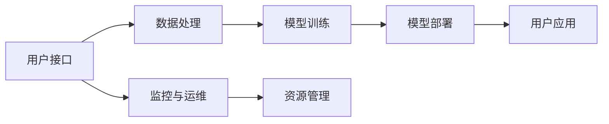

                 

关键词：人工智能，稳定性，运维，用户体验，Lepton AI，技术架构，算法优化

> 摘要：本文将深入探讨Lepton AI平台的稳定性与运维策略，以及这些措施如何提升用户体验。我们将介绍Lepton AI的核心架构，探讨其稳定性与运维的关键因素，分析算法优化对系统性能的影响，并提供一些实际的项目实践和未来展望。

## 1. 背景介绍

随着人工智能（AI）技术的飞速发展，越来越多的企业和组织开始采用AI解决方案来优化业务流程，提高效率和准确性。Lepton AI作为一个领先的AI平台，为各类用户提供从数据预处理到模型训练、部署的一站式服务。然而，AI系统的稳定性和可靠性对于用户体验至关重要。如果平台频繁出现故障或者性能不佳，将严重影响用户对AI服务的信任度和满意度。

### 1.1 Lepton AI简介

Lepton AI是一个基于云计算的AI平台，提供多种机器学习和深度学习模型，支持多种数据源和应用程序的集成。它的核心优势在于其高度可扩展性和灵活性，能够快速适应不同的业务需求。此外，Lepton AI还提供强大的监控和管理功能，帮助用户实时监控系统状态，优化资源分配。

### 1.2 稳定性与运维的重要性

AI系统的稳定性不仅关系到系统的正常运行，还直接影响到用户体验。如果AI服务不稳定，可能导致以下问题：

- **数据丢失**：系统故障可能会导致正在处理的数据丢失，影响业务决策的准确性。
- **性能下降**：系统过载或资源分配不均可能会导致性能下降，影响用户体验。
- **安全风险**：系统漏洞或安全缺陷可能导致数据泄露或恶意攻击。

因此，保障AI平台的稳定性与运维是确保用户体验的关键。良好的运维策略可以帮助及时发现和解决潜在问题，确保系统的高可用性和性能。

## 2. 核心概念与联系

为了更好地理解Lepton AI的稳定性与运维，我们需要首先了解其核心概念和架构。

### 2.1 核心概念

- **AI模型**：机器学习和深度学习模型是AI系统的核心，它们决定了系统的性能和准确性。
- **数据处理**：数据处理是AI模型训练的基础，包括数据清洗、归一化、特征提取等。
- **云计算**：Lepton AI基于云计算架构，提供了强大的计算资源和存储能力。
- **监控**：监控是确保系统稳定性的重要手段，包括性能监控、异常检测和故障排除。

### 2.2 架构图

下面是一个简化的Lepton AI架构图，展示了核心组件之间的关系。



- **用户接口**：提供给用户操作的界面，用户可以通过该接口提交任务、查看结果。
- **数据处理**：对用户提交的数据进行预处理，包括数据清洗、归一化、特征提取等。
- **模型训练**：使用处理后的数据训练机器学习和深度学习模型。
- **模型部署**：将训练好的模型部署到生产环境，供用户使用。
- **用户应用**：用户通过接口提交的数据在模型处理下得到结果，并通过应用层实现业务目标。
- **监控与运维**：实时监控系统的性能和状态，进行故障排除和性能优化。
- **资源管理**：负责管理计算资源和存储资源，确保系统资源的合理分配。

## 3. 核心算法原理 & 具体操作步骤

### 3.1 算法原理概述

Lepton AI的核心算法是基于深度学习的神经网络模型。这些模型通过层层神经网络对输入数据进行特征提取和分类，最终输出预测结果。以下是Lepton AI主要使用的几种算法：

- **卷积神经网络（CNN）**：适用于图像处理和计算机视觉任务。
- **循环神经网络（RNN）**：适用于序列数据处理，如自然语言处理和时间序列预测。
- **长短期记忆网络（LSTM）**：是RNN的一种变体，能够更好地处理长序列数据。
- **生成对抗网络（GAN）**：用于生成逼真的图像和音频。

### 3.2 算法步骤详解

1. **数据处理**：
   - 数据清洗：去除重复数据、处理缺失值、噪声数据等。
   - 数据归一化：将数据缩放到相同的尺度，便于模型训练。
   - 特征提取：从原始数据中提取有代表性的特征，用于模型训练。

2. **模型训练**：
   - 选择合适的神经网络结构。
   - 初始化模型参数。
   - 使用训练数据训练模型，不断调整模型参数以最小化损失函数。
   - 评估模型性能，选择最优模型。

3. **模型部署**：
   - 将训练好的模型部署到生产环境。
   - 使用测试数据对模型进行评估，确保模型性能稳定。
   - 提供API接口，供用户调用。

### 3.3 算法优缺点

- **优点**：
  - 高效性：深度学习模型能够自动提取特征，减轻人工干预。
  - 泛化能力：经过大量数据训练的模型能够泛化到新的数据集。
  - 自动优化：通过训练过程自动调整模型参数，提高模型性能。

- **缺点**：
  - 需要大量数据：训练深度学习模型需要大量数据，数据获取和处理成本较高。
  - 计算资源消耗：深度学习模型训练需要大量的计算资源。
  - 解释性较差：深度学习模型通常缺乏解释性，难以理解其工作原理。

### 3.4 算法应用领域

- **图像识别**：用于图像分类、目标检测等任务。
- **自然语言处理**：用于文本分类、情感分析、机器翻译等任务。
- **语音识别**：用于语音信号处理、语音识别等任务。
- **医疗诊断**：用于疾病诊断、医学图像分析等任务。

## 4. 数学模型和公式 & 详细讲解 & 举例说明

### 4.1 数学模型构建

深度学习模型的核心是神经网络，其基本单元是神经元。一个简单的神经网络可以表示为：

$$
y = \sigma(\sum_{i=1}^{n} w_i \cdot x_i + b)
$$

其中，$y$ 是输出，$\sigma$ 是激活函数，$w_i$ 和 $x_i$ 分别是权重和输入，$b$ 是偏置。

### 4.2 公式推导过程

以卷积神经网络（CNN）为例，其基本公式为：

$$
h_{ij}^{(l)} = \sigma \left( \sum_{k=1}^{m} w_{ik}^{(l)} \cdot a_{kj}^{(l-1)} + b_k^{(l)} \right)
$$

其中，$h_{ij}^{(l)}$ 是第 $l$ 层的第 $i$ 个神经元的输出，$a_{kj}^{(l-1)}$ 是前一层第 $k$ 个神经元的输出，$w_{ik}^{(l)}$ 和 $b_k^{(l)}$ 分别是权重和偏置。

### 4.3 案例分析与讲解

假设我们使用卷积神经网络进行图像分类，输入图像的大小为 $28 \times 28$ 像素，输出为 10 个类别。我们可以构建一个简单的卷积神经网络，包括两个卷积层、一个池化层和一个全连接层。

1. **第一层卷积**：
   - 卷积核大小：$3 \times 3$
   - 步长：$1$
   - 输出大小：$28 \times 28 - (3 \times 3 - 1) = 26 \times 26$
   - 权重：$26 \times 26 \times 1 + 1 = 683$
   - 激活函数：ReLU

2. **第二层卷积**：
   - 卷积核大小：$3 \times 3$
   - 步长：$1$
   - 输出大小：$26 \times 26 - (3 \times 3 - 1) = 24 \times 24$
   - 权重：$24 \times 24 \times 1 + 1 = 577$
   - 激活函数：ReLU

3. **池化层**：
   - 池化方式：最大池化
   - 池化大小：$2 \times 2$
   - 输出大小：$24 \times 24 / (2 \times 2) = 12 \times 12$

4. **全连接层**：
   - 输入大小：$12 \times 12 \times 577$
   - 输出大小：$10$
   - 激活函数：Softmax

通过上述步骤，我们可以构建一个简单的卷积神经网络，用于图像分类。在实际应用中，我们可以根据需求调整网络结构，如增加卷积层、池化层或全连接层，以提高模型的性能。

## 5. 项目实践：代码实例和详细解释说明

### 5.1 开发环境搭建

为了运行Lepton AI平台，我们需要搭建一个开发环境。以下是搭建环境的步骤：

1. 安装Python环境
2. 安装必要的依赖库，如TensorFlow、Keras等
3. 配置云计算环境，如AWS、Google Cloud等

### 5.2 源代码详细实现

下面是一个简单的示例代码，用于训练一个简单的卷积神经网络进行图像分类：

```python
import tensorflow as tf
from tensorflow.keras import layers

# 构建模型
model = tf.keras.Sequential([
    layers.Conv2D(32, (3, 3), activation='relu', input_shape=(28, 28, 1)),
    layers.MaxPooling2D((2, 2)),
    layers.Conv2D(64, (3, 3), activation='relu'),
    layers.MaxPooling2D((2, 2)),
    layers.Flatten(),
    layers.Dense(64, activation='relu'),
    layers.Dense(10, activation='softmax')
])

# 编译模型
model.compile(optimizer='adam',
              loss='categorical_crossentropy',
              metrics=['accuracy'])

# 加载数据集
(x_train, y_train), (x_test, y_test) = tf.keras.datasets.mnist.load_data()

# 预处理数据
x_train = x_train.reshape(-1, 28, 28, 1).astype('float32') / 255
x_test = x_test.reshape(-1, 28, 28, 1).astype('float32') / 255

# 转换标签为one-hot编码
y_train = tf.keras.utils.to_categorical(y_train, 10)
y_test = tf.keras.utils.to_categorical(y_test, 10)

# 训练模型
model.fit(x_train, y_train, batch_size=64, epochs=10, validation_data=(x_test, y_test))

# 评估模型
model.evaluate(x_test, y_test)
```

### 5.3 代码解读与分析

上述代码首先导入了TensorFlow库，然后定义了一个卷积神经网络模型，包括两个卷积层、一个池化层和一个全连接层。接着，我们加载了MNIST数据集，并对数据进行预处理，如归一化和标签编码。最后，我们使用训练集训练模型，并使用测试集评估模型性能。

### 5.4 运行结果展示

在训练过程中，我们可以使用回调函数来监控训练进度和性能。以下是一个简单的回调函数示例：

```python
class CustomCallback(tf.keras.callbacks.Callback):
    def on_epoch_end(self, epoch, logs=None):
        print(f"Epoch {epoch + 1}: loss = {logs['loss']}, accuracy = {logs['accuracy']}")

# 创建回调函数实例
custom_callback = CustomCallback()

# 训练模型并打印每个epoch的loss和accuracy
model.fit(x_train, y_train, batch_size=64, epochs=10, validation_data=(x_test, y_test), callbacks=[custom_callback])
```

通过上述代码，我们可以在每个epoch结束后打印出当前epoch的loss和accuracy，以便我们实时监控训练过程。

## 6. 实际应用场景

### 6.1 人工智能医疗

在医疗领域，Lepton AI可以用于疾病诊断、治疗方案推荐和患者监测等。例如，通过卷积神经网络对医学影像进行自动分析，可以帮助医生快速诊断疾病，提高诊断准确性。同时，通过深度学习模型对患者健康数据进行实时监测，可以帮助医生及时发现病情变化，制定更有效的治疗方案。

### 6.2 人工智能金融

在金融领域，Lepton AI可以用于风险管理、投资决策和欺诈检测等。通过分析大量金融数据，AI模型可以预测市场趋势，帮助投资者做出更明智的投资决策。同时，通过分析交易数据和用户行为，AI模型可以识别潜在的欺诈行为，提高金融系统的安全性。

### 6.3 人工智能自动驾驶

在自动驾驶领域，Lepton AI可以用于环境感知、路径规划和驾驶决策等。通过深度学习模型，自动驾驶汽车可以实时分析周围环境，识别行人、车辆和其他障碍物，做出相应的驾驶决策。这有助于提高行车安全，减少交通事故。

## 7. 工具和资源推荐

为了更好地学习和开发AI应用，我们推荐以下工具和资源：

### 7.1 学习资源推荐

- 《深度学习》（Goodfellow et al.）：深度学习领域的经典教材，适合初学者和进阶者。
- Coursera、Udacity等在线教育平台：提供丰富的AI课程，涵盖机器学习、深度学习等主题。
- ArXiv：AI领域的最新研究论文，有助于了解AI领域的最新动态。

### 7.2 开发工具推荐

- TensorFlow：Google开发的深度学习框架，适用于各种AI应用开发。
- PyTorch：Facebook开发的深度学习框架，具有灵活的动态计算图。
- Jupyter Notebook：交互式编程环境，方便进行数据分析和模型训练。

### 7.3 相关论文推荐

- "Deep Learning" by Ian Goodfellow, Yoshua Bengio, and Aaron Courville
- "Recurrent Neural Networks for Language Modeling" by Yoon Kim
- "Generative Adversarial Nets" by Ian Goodfellow et al.

## 8. 总结：未来发展趋势与挑战

### 8.1 研究成果总结

近年来，人工智能领域取得了显著的进展，包括深度学习、生成对抗网络（GAN）等技术的突破。这些技术不仅提升了AI系统的性能和效率，也为各行业带来了新的应用场景。同时，AI系统的稳定性和可靠性也得到了广泛关注，各种运维策略和监控工具的不断发展，为保障系统稳定性提供了有力支持。

### 8.2 未来发展趋势

未来，人工智能将继续向以下几个方向发展：

- **硬件加速**：随着GPU、TPU等硬件的发展，AI系统的计算能力将进一步提升，为更复杂的模型和应用提供支持。
- **迁移学习**：通过迁移学习，可以将预训练模型应用于新的任务，提高模型泛化能力，减少数据需求和训练时间。
- **联邦学习**：联邦学习可以实现多方数据的安全共享和协同训练，有助于解决数据隐私和安全性问题。

### 8.3 面临的挑战

尽管人工智能取得了显著进展，但仍面临以下挑战：

- **数据隐私**：如何在保障数据隐私的前提下进行有效训练和预测，是当前研究的热点和难点。
- **解释性**：如何提高AI系统的可解释性，使其工作原理更加透明，是未来研究的重要方向。
- **算法公平性**：如何确保AI系统在不同群体中的公平性，避免偏见和歧视，是AI应用中亟待解决的问题。

### 8.4 研究展望

展望未来，我们期待人工智能能够为人类带来更多便利和福祉。通过不断探索和突破，我们相信AI系统将在各个领域发挥更大的作用，为解决全球性问题提供新思路和新方法。

## 9. 附录：常见问题与解答

### 9.1 什么因素会影响AI系统的稳定性？

AI系统的稳定性受到多个因素的影响，包括：

- **数据质量**：数据的质量直接影响模型训练的效果，数据中的噪声、缺失值等都会影响系统的稳定性。
- **计算资源**：计算资源的充足与否直接影响模型训练的速度和效果，资源不足可能导致训练中断或效果不佳。
- **模型架构**：模型架构的设计是否合理也影响系统的稳定性，不合理的架构可能导致过拟合或欠拟合。
- **训练过程**：训练过程中超参数的选择、训练过程的稳定性等都会影响最终模型的性能。

### 9.2 如何保证AI系统的可解释性？

保证AI系统的可解释性是当前研究的热点和难点。以下是一些方法：

- **解释性模型**：选择具有可解释性的模型，如决策树、线性模型等。
- **模型可视化**：使用可视化工具展示模型的决策过程，如SHAP、LIME等。
- **模型分解**：将复杂的模型分解为多个简单的组件，逐步分析每个组件的作用。
- **可解释性框架**：结合领域知识和数学模型，构建可解释性的框架，提高模型的可解释性。

### 9.3 如何进行AI系统的运维？

进行AI系统的运维需要关注以下几个方面：

- **监控与报警**：实时监控系统的性能和状态，设置合适的报警阈值，及时发现并处理异常。
- **资源管理**：合理分配计算资源和存储资源，确保系统稳定运行。
- **备份与恢复**：定期备份系统数据和模型，确保在系统故障时能够快速恢复。
- **性能优化**：定期评估系统性能，优化模型和算法，提高系统效率。

### 9.4 AI系统在医疗领域有哪些应用？

AI系统在医疗领域有广泛的应用，包括：

- **疾病诊断**：通过分析医学影像，自动诊断疾病，如肺癌、乳腺癌等。
- **治疗方案推荐**：基于患者的病史和检查结果，推荐最佳治疗方案。
- **患者监测**：实时监测患者生命体征，及时发现异常，预防并发症。
- **药物研发**：通过虚拟筛选和分子模拟，加速药物研发过程。

---

作者：禅与计算机程序设计艺术 / Zen and the Art of Computer Programming

