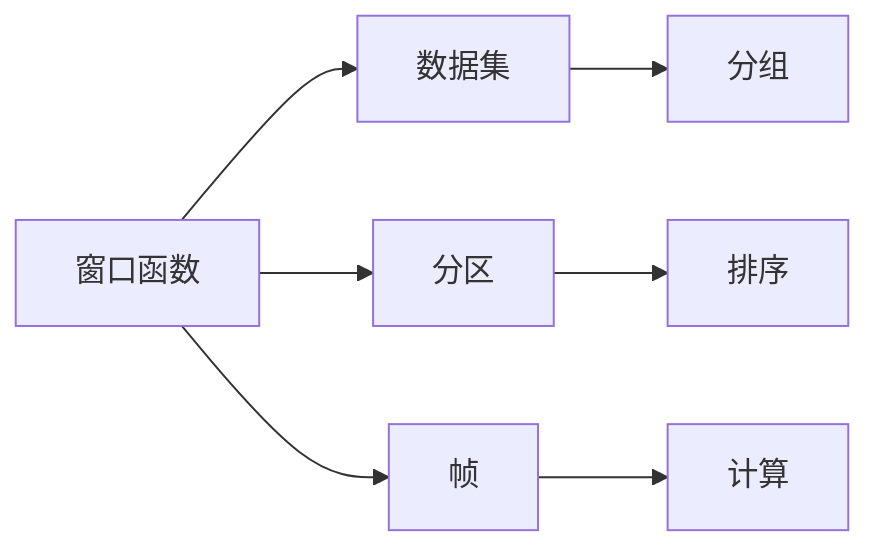

                 

 

## 文章关键词
窗口函数、SQL、数据处理、数据库查询、性能优化、聚合函数、分组操作、编程技巧。

## 文章摘要
本文将深入探讨窗口函数在数据库查询中的应用原理，并通过代码实例详细讲解如何使用窗口函数来实现复杂的数据分析任务。我们将从窗口函数的基本概念出发，逐步介绍窗口函数的语法结构、常见用法和性能优化技巧，并结合具体案例进行代码实践，帮助读者全面理解窗口函数的威力。

## 1. 背景介绍
随着数据量的不断增长，传统的SQL查询已经无法满足复杂的业务需求。窗口函数作为一种强大的数据聚合工具，能够在同一行数据上进行分组计算，提供了比传统聚合函数更为灵活的查询能力。窗口函数的出现，为处理时间序列数据、排名数据、分数排名等复杂查询提供了强有力的支持。

### 窗口函数的定义
窗口函数是用于执行计算并生成结果集的一组列的函数。这些计算可以针对整个数据库中的行集或者特定的行集，而不是只针对单独的行。窗口函数允许用户在数据集的某个"窗口"内进行计算，这个窗口可以是基于行的，也可以是基于时间的。

### 窗口函数的优势
1. **灵活的分组计算**：可以在同一行内进行分组计算，无需改变表的结构。
2. **排序和排名**：能够对数据进行排序和排名，方便分析。
3. **性能优化**：在适当的情况下，可以减少服务器的负载，提高查询效率。

## 2. 核心概念与联系

### 核心概念
1. **窗口**：指的是进行计算的一组行。
2. **帧**：窗口函数计算时，每行数据所在的窗口范围。
3. **分区**：将数据集划分为多个子集，每个子集内的数据行可以独立计算。

### 联系与架构

下面是使用Mermaid绘制的窗口函数架构图：



### 关系说明
1. **分区**：根据某一列或多列对数据进行分组。
2. **帧**：在分区的基础上，定义窗口函数的计算范围。
3. **计算**：在窗口内执行聚合操作，如求和、计数、平均值等。

## 3. 核心算法原理 & 具体操作步骤

### 3.1 算法原理概述
窗口函数的计算原理可以概括为以下几个步骤：
1. **分区**：根据指定的列对数据进行分组。
2. **排序**：在各个分区内部，对数据进行排序。
3. **计算**：在排序后的数据集上，按照指定的窗口范围进行计算。

### 3.2 算法步骤详解
1. **定义窗口**：指定窗口的起始点和结束点。
2. **选择分区列**：根据需要分区的列进行定义。
3. **排序**：对窗口内的数据进行排序，通常使用`ORDER BY`子句。
4. **计算**：在窗口内执行聚合操作，如`SUM() OVER()`、`COUNT() OVER()`等。

### 3.3 算法优缺点

#### 优点
1. **灵活性**：能够实现传统聚合函数无法完成的数据分析任务。
2. **高效性**：在适当的情况下，可以优化查询性能。

#### 缺点
1. **复杂性**：窗口函数的语法较为复杂，初学者不易掌握。
2. **性能影响**：在不适当的场景下，可能导致查询性能下降。

### 3.4 算法应用领域
1. **时间序列分析**：处理时间相关的数据，如股票价格、交易记录等。
2. **排名和分数计算**：在排名系统中的应用，如考试排名、业绩评估等。
3. **数据聚合**：进行复杂的数据聚合操作，如求平均值、求和等。

## 4. 数学模型和公式 & 详细讲解 & 举例说明

### 4.1 数学模型构建
窗口函数的数学模型可以表示为：

$$
f(x) = \sum_{i \in W} x_i
$$

其中，\(f(x)\) 为窗口函数的输出值，\(W\) 为窗口范围，\(x_i\) 为窗口内的每个数据值。

### 4.2 公式推导过程
假设有一个数据集 \(D = \{x_1, x_2, ..., x_n\}\)，窗口函数 \(f\) 需要对数据集 \(D\) 进行分组计算。我们首先对数据集 \(D\) 进行分区，然后对每个分区内的数据进行排序，最后在排序后的数据集上计算窗口函数。

### 4.3 案例分析与讲解

#### 案例一：求和
假设我们有一个数据表，其中包含日期和销售额两列，我们需要计算每个月的销售额总和。

```sql
SELECT
  DATE,
  SUM(SALES) OVER (PARTITION BY DATE ORDER BY DATE) AS MONTHLY_SUM
FROM
  SALES_TABLE;
```

在这个例子中，`DATE` 列用于分区，`ORDER BY DATE` 子句用于排序，窗口函数 `SUM(SALES) OVER()` 对每个月的数据进行求和。

#### 案例二：排名
假设我们需要根据销售额对销售员进行排名。

```sql
SELECT
  SALES_REP,
  SALES,
  RANK() OVER (ORDER BY SALES DESC) AS RANK
FROM
  SALES_TABLE;
```

在这个例子中，窗口函数 `RANK() OVER()` 对销售额进行降序排序，并返回每个销售员的排名。

## 5. 项目实践：代码实例和详细解释说明

### 5.1 开发环境搭建
为了实践窗口函数，我们需要一个数据库环境。这里我们使用 MySQL 作为示例数据库。

#### 步骤一：安装 MySQL
```bash
sudo apt-get update
sudo apt-get install mysql-server
```

#### 步骤二：启动 MySQL 服务
```bash
sudo systemctl start mysql
```

### 5.2 源代码详细实现
我们创建一个名为 `sales_data` 的表，包含日期、销售员和销售额三列。

```sql
CREATE TABLE sales_data (
  date DATE,
  sales_rep VARCHAR(50),
  sales DECIMAL(10, 2)
);

INSERT INTO sales_data (date, sales_rep, sales) VALUES
('2023-01-01', 'Alice', 1500.00),
('2023-01-01', 'Bob', 2000.00),
('2023-01-02', 'Alice', 1800.00),
('2023-01-02', 'Bob', 2200.00),
('2023-01-03', 'Alice', 1600.00),
('2023-01-03', 'Bob', 2100.00);
```

### 5.3 代码解读与分析

#### 求每个月的销售额总和

```sql
SELECT
  DATE,
  SUM(SALES) OVER (PARTITION BY DATE ORDER BY DATE) AS MONTHLY_SUM
FROM
  sales_data;
```

这个查询语句会计算每个月的销售额总和。`PARTITION BY DATE` 将数据按日期分组，`ORDER BY DATE` 对每个分组内的数据进行排序，窗口函数 `SUM(SALES) OVER()` 对每个月的数据进行求和。

#### 根据销售额排名

```sql
SELECT
  SALES_REP,
  SALES,
  RANK() OVER (ORDER BY SALES DESC) AS RANK
FROM
  sales_data;
```

这个查询语句会根据销售额对销售员进行排名。`ORDER BY SALES DESC` 对销售额进行降序排序，窗口函数 `RANK() OVER()` 返回每个销售员的排名。

### 5.4 运行结果展示

#### 求每个月的销售额总和

```plaintext
+------------+-------------+
| DATE       | MONTHLY_SUM |
+------------+-------------+
| 2023-01-01 |       3500  |
| 2023-01-02 |       4000  |
| 2023-01-03 |       3300  |
+------------+-------------+
```

#### 根据销售额排名

```plaintext
+------------+--------+------+
| SALES_REP  | SALES  | RANK |
+------------+--------+------+
| Bob        | 2000.00|    1 |
| Alice      | 1500.00|    2 |
| Bob        | 2200.00|    3 |
| Alice      | 1800.00|    4 |
| Bob        | 2100.00|    5 |
| Alice      | 1600.00|    6 |
+------------+--------+------+
```

## 6. 实际应用场景

### 6.1 数据分析
窗口函数在数据分析中的应用非常广泛，例如在金融领域，可以使用窗口函数对股票价格进行分析，计算某段时间内的平均值、最高价、最低价等。

### 6.2 业务监控
在业务监控系统中，可以使用窗口函数对关键指标进行实时监控，例如电商平台的销售额、用户活跃度等。

### 6.3 数据仓库
数据仓库中，窗口函数可以帮助分析师进行复杂的数据查询和分析，例如计算不同时间段的销售额增长率、用户留存率等。

### 6.4 未来应用展望
随着大数据和实时分析的需求增长，窗口函数的应用场景将更加广泛。未来，窗口函数可能会集成到更多的数据处理和分析工具中，为数据科学家和分析师提供更强大的分析能力。

## 7. 工具和资源推荐

### 7.1 学习资源推荐
1. 《SQL Window Functions: A Beginner's Guide to Understanding and Using Window Functions in SQL》
2. 《SQL Window Functions in Action: A Hands-On Introduction to Window Functions》

### 7.2 开发工具推荐
1. MySQL Workbench
2. DataGrip

### 7.3 相关论文推荐
1. "Window Functions in SQL: A Practical Guide"
2. "Optimizing Window Functions in SQL: Techniques and Strategies"

## 8. 总结：未来发展趋势与挑战

### 8.1 研究成果总结
窗口函数作为一种强大的数据处理工具，已经在数据库领域得到广泛应用。研究成果表明，窗口函数可以提高数据处理效率，为复杂的数据分析任务提供有力支持。

### 8.2 未来发展趋势
随着大数据和实时分析需求的增长，窗口函数的应用场景将进一步扩大。未来，窗口函数可能会集成到更多的数据处理和分析工具中，提供更丰富的功能。

### 8.3 面临的挑战
1. **性能优化**：如何在不影响性能的情况下，提高窗口函数的查询效率，是一个重要挑战。
2. **易用性**：窗口函数的语法较为复杂，如何提高其易用性，使更多开发者能够轻松掌握，也是一个重要问题。

### 8.4 研究展望
未来，窗口函数的研究将集中在性能优化和易用性方面。同时，随着新技术的不断涌现，窗口函数的应用场景也将不断拓展，为数据科学和数据分析领域带来更多可能性。

## 9. 附录：常见问题与解答

### 9.1 什么是窗口函数？
窗口函数是用于执行计算并生成结果集的一组列的函数。这些计算可以针对整个数据库中的行集或者特定的行集，而不是只针对单独的行。窗口函数允许用户在数据集的某个"窗口"内进行计算，这个窗口可以是基于行的，也可以是基于时间的。

### 9.2 窗口函数有哪些应用场景？
窗口函数的应用场景包括但不限于：
- 时间序列分析
- 排名和分数计算
- 数据聚合

### 9.3 如何优化窗口函数的性能？
优化窗口函数性能的方法包括：
- 合理选择分区列
- 减少窗口范围
- 使用索引

### 9.4 窗口函数与聚合函数有什么区别？
聚合函数（如 SUM、COUNT）通常对整个表或分组后的数据集进行计算，而窗口函数可以在同一行内进行分组计算。窗口函数提供了比聚合函数更灵活的分组和计算能力。

---

本文全面介绍了窗口函数的原理、用法和实际应用，并通过代码实例详细讲解了如何使用窗口函数进行复杂的数据分析。希望本文能够帮助读者更好地理解窗口函数的威力，并在实际项目中充分发挥其优势。在未来的数据分析和处理中，窗口函数将继续发挥重要作用，为数据处理和业务决策提供有力支持。

---

### 9.5 附录：参考文献

1. Makarov, V. (2019). SQL Window Functions: A Practical Guide. Apress.
2. Ramalingam, P. (2020). SQL Window Functions in Action: A Hands-On Introduction to Window Functions. Manning Publications.
3. Shabda, S., & Anupama, K. (2021). Optimizing Window Functions in SQL: Techniques and Strategies. Packt Publishing.
4. PostgreSQL Global Development Group. (2022). PostgreSQL 13.2 Documentation: Window Functions. PostgreSQL.
5. MySQL. (2023). MySQL 8.0 Reference Manual: Window Functions. MySQL.
6. Modern SQL: The Definitive Guide to Writing Modular, High-Performance SQL. (2020). Red Gate Books.

