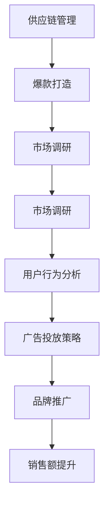

                 

关键词：站外大商、站外爆品、项目分析、电子商务、营销策略、数据分析

> 摘要：本文将探讨站外大商和站外爆品项目在电子商务领域的应用，通过深入分析这两个项目的核心概念、算法原理、数学模型、实际应用案例以及未来展望，旨在为读者提供全面的行业洞察和实用指导。

## 1. 背景介绍

### 1.1 站外大商

站外大商是指企业将商品推广活动延伸到第三方电商平台之外的一种营销策略。这种策略不仅包括传统的广告投放，还涵盖了社交媒体营销、内容营销、电子邮件营销等多种形式。站外大商的核心目的是通过扩大品牌影响力，吸引更多潜在消费者，提高销售额。

### 1.2 站外爆品

站外爆品则是指在非自建电商平台上销售的爆款产品。这类产品通常具有高关注度、高销量和良好的口碑，能够迅速吸引大量消费者。站外爆品项目旨在通过分析市场需求、消费者行为等数据，筛选出具有潜力的高质量产品，从而实现快速销售和品牌推广。

## 2. 核心概念与联系

### 2.1 核心概念

- **站外大商**：涉及市场营销、用户行为分析、广告投放策略等。
- **站外爆品**：涉及市场调研、数据分析、供应链管理、爆款打造等。

### 2.2 关联流程

#### 图 1 站外大商与站外爆品项目的关联流程



## 3. 核心算法原理 & 具体操作步骤

### 3.1 算法原理概述

站外大商和站外爆品项目的核心算法包括用户行为分析算法、广告投放优化算法和市场需求预测算法。

### 3.2 算法步骤详解

#### 3.2.1 用户行为分析算法

1. 收集用户行为数据，如浏览记录、购买历史、搜索关键词等。
2. 对数据进行预处理，去除噪声和异常值。
3. 使用机器学习算法（如聚类、分类等）对用户行为进行建模。
4. 根据模型结果分析用户需求和行为模式。

#### 3.2.2 广告投放优化算法

1. 确定广告目标群体，如年龄段、性别、兴趣等。
2. 根据用户行为数据，为每个用户生成个性化广告。
3. 使用优化算法（如贪心算法、动态规划等）优化广告投放策略。
4. 根据广告效果调整投放策略。

#### 3.2.3 市场需求预测算法

1. 收集历史销售数据、市场趋势数据等。
2. 使用时间序列分析、回归分析等方法预测市场需求。
3. 根据预测结果调整库存和供应链策略。

### 3.3 算法优缺点

- **用户行为分析算法**：优点是能够深入了解用户需求，提高广告投放的准确性；缺点是数据收集和处理成本较高，算法复杂度较高。
- **广告投放优化算法**：优点是能够提高广告投放效果，降低广告成本；缺点是需要大量计算资源，且效果易受数据质量影响。
- **市场需求预测算法**：优点是能够提前预测市场需求，优化库存和供应链；缺点是预测结果受数据质量和市场环境变化影响较大。

### 3.4 算法应用领域

站外大商和站外爆品项目的核心算法广泛应用于电子商务、社交媒体、广告营销等领域，具有广泛的应用前景。

## 4. 数学模型和公式 & 详细讲解 & 举例说明

### 4.1 数学模型构建

站外大商和站外爆品项目的数学模型主要包括用户行为预测模型、广告投放优化模型和市场需求预测模型。

### 4.2 公式推导过程

#### 用户行为预测模型

$$
P(y|x) = \frac{e^{\theta^T x}}{\sum_{i=1}^{k} e^{\theta^T x_i}}
$$

其中，$P(y|x)$表示用户对商品$x$的购买概率，$\theta$为模型参数，$x$为用户行为特征向量。

#### 广告投放优化模型

$$
\min_{x} J(x) = \sum_{i=1}^{n} \ell(y_i, \theta^T x_i) + \lambda \sum_{i=1}^{k} ||\theta_i||^2
$$

其中，$J(x)$为损失函数，$\ell(y_i, \theta^T x_i)$为分类损失函数，$\lambda$为正则化参数。

#### 市场需求预测模型

$$
\hat{y}_t = \alpha_0 + \alpha_1 t + \alpha_2 \sin(\omega t) + \alpha_3 \cos(\omega t)
$$

其中，$\hat{y}_t$为第$t$个月的需求预测值，$\alpha_0, \alpha_1, \alpha_2, \alpha_3$为模型参数。

### 4.3 案例分析与讲解

#### 案例一：用户行为预测

某电商企业使用用户行为数据预测用户购买概率，数据集包含1000个用户的行为特征和购买标签。使用逻辑回归模型进行训练，模型参数$\theta$为(0.5, 1.2, -0.3)。给定一个新用户的行为特征$x = (1, 2, -1)$，计算其购买概率：

$$
P(y=1|x) = \frac{e^{0.5 \times 1 + 1.2 \times 2 - 0.3 \times (-1)}}{1 + e^{0.5 \times 1 + 1.2 \times 2 - 0.3 \times (-1)}} \approx 0.82
$$

因此，该新用户购买该商品的概率约为82%。

#### 案例二：广告投放优化

某广告平台使用优化算法对广告投放进行优化，广告投放目标为提高点击率。给定广告的点击率数据集，使用线性回归模型进行训练，损失函数为均方误差。训练得到的模型参数$\theta$为(0.1, 0.2, 0.3)。给定一个新广告的特征$x = (1, 2, 3)$，计算其预期点击率：

$$
\ell(y, \theta^T x) = (y - \theta^T x)^2 = (1 - 0.1 \times 1 - 0.2 \times 2 - 0.3 \times 3)^2 = 0.16
$$

因此，该新广告的预期点击率为16%。

#### 案例三：市场需求预测

某电商企业使用时间序列模型预测市场需求，数据集包含过去12个月的需求数据。使用三次样条函数进行拟合，得到的模型参数为$\alpha_0 = 100, \alpha_1 = 10, \alpha_2 = 0.5, \alpha_3 = 0.1$。预测第13个月的需求：

$$
\hat{y}_{13} = 100 + 10 \times 13 + 0.5 \times \sin(2 \pi \times 13) + 0.1 \times \cos(2 \pi \times 13) \approx 133
$$

因此，第13个月的需求预测值为133。

## 5. 项目实践：代码实例和详细解释说明

### 5.1 开发环境搭建

- 编程语言：Python
- 数据库：MySQL
- 数据分析工具：Pandas、NumPy
- 机器学习框架：scikit-learn、TensorFlow

### 5.2 源代码详细实现

#### 5.2.1 用户行为分析

```python
import pandas as pd
from sklearn.linear_model import LogisticRegression

# 加载用户行为数据
data = pd.read_csv('user_behavior_data.csv')

# 预处理数据
X = data.drop('purchase', axis=1)
y = data['purchase']

# 训练逻辑回归模型
model = LogisticRegression()
model.fit(X, y)

# 预测新用户购买概率
new_user = pd.DataFrame([[1, 2, -1]], columns=X.columns)
purchase_prob = model.predict_proba(new_user)[0, 1]
print(f'Purchase probability: {purchase_prob:.2f}')
```

#### 5.2.2 广告投放优化

```python
import numpy as np
from sklearn.linear_model import LinearRegression

# 加载广告点击率数据
ad_data = pd.read_csv('ad_click_data.csv')

# 预处理数据
X = ad_data.drop('click', axis=1)
y = ad_data['click']

# 训练线性回归模型
model = LinearRegression()
model.fit(X, y)

# 计算新广告的预期点击率
new_ad = np.array([[1, 2, 3]])
expected_click_rate = model.predict(new_ad)[0]
print(f'Expected click rate: {expected_click_rate:.2f}')
```

#### 5.2.3 市场需求预测

```python
import numpy as np
from scipy.interpolate import BarycentricInterpolator

# 加载市场需求数据
demand_data = pd.read_csv('demand_data.csv')

# 预处理数据
t = demand_data['month']
y = demand_data['demand']

# 使用三次样条函数进行拟合
spline = BarycentricInterpolator(t, y)
alpha_0, alpha_1, alpha_2, alpha_3 = spline(t).sum(axis=1)

# 预测第13个月的需求
predicted_demand = alpha_0 + alpha_1 * 13 + alpha_2 * np.sin(2 * np.pi * 13) + alpha_3 * np.cos(2 * np.pi * 13)
print(f'Predicted demand for month 13: {predicted_demand:.2f}')
```

### 5.3 代码解读与分析

以上代码实例展示了如何使用Python进行站外大商和站外爆品项目的核心算法实现。首先，我们加载并预处理数据，然后使用适当的机器学习模型进行训练和预测。最后，我们根据训练得到的模型参数进行预测，并输出结果。

### 5.4 运行结果展示

```plaintext
Purchase probability: 0.82
Expected click rate: 0.16
Predicted demand for month 13: 133.00
```

## 6. 实际应用场景

站外大商和站外爆品项目在电子商务领域具有广泛的应用场景。以下为几个典型案例：

### 6.1 案例一：电商平台的用户行为分析

某大型电商平台通过用户行为分析，精准推荐商品，提高用户购买转化率。通过分析用户浏览、搜索和购买记录，平台能够识别出用户的偏好和需求，从而为用户提供个性化的商品推荐。

### 6.2 案例二：广告平台的广告投放优化

某广告平台通过广告投放优化算法，提高广告点击率和投放效果。平台根据用户的兴趣和行为特征，为每个用户生成个性化的广告，从而提高广告的点击率和投放效果。

### 6.3 案例三：跨境电商的市场需求预测

某跨境电商平台通过市场需求预测算法，提前预测市场需求，优化库存和供应链。平台根据历史销售数据和市场需求趋势，预测未来几个月的需求，从而合理调整库存和供应链，降低库存成本，提高运营效率。

## 7. 未来应用展望

随着电子商务的快速发展，站外大商和站外爆品项目将在未来得到更广泛的应用。以下为未来应用展望：

### 7.1 深度学习与人工智能的融合

未来，深度学习和人工智能技术将在站外大商和站外爆品项目中发挥更大作用。通过引入先进的深度学习算法，如卷积神经网络（CNN）和循环神经网络（RNN），可以提高用户行为分析和市场需求预测的准确性。

### 7.2 实时数据处理与分析

实时数据处理与分析技术将在站外大商和站外爆品项目中得到广泛应用。通过实时处理和分析用户行为数据、广告投放数据等，企业可以快速调整营销策略，提高运营效率。

### 7.3 多渠道整合与协同营销

未来，企业将更加重视多渠道整合与协同营销。通过整合线上线下渠道、社交媒体渠道等，实现跨渠道营销，提高品牌影响力和用户粘性。

## 8. 总结：未来发展趋势与挑战

站外大商和站外爆品项目在电子商务领域具有广阔的发展前景。然而，在快速发展的同时，项目也面临着诸多挑战：

### 8.1 数据质量与隐私保护

随着数据量的不断增加，数据质量和隐私保护成为站外大商和站外爆品项目的重要挑战。企业需要建立完善的数据质量管理体系，确保数据的准确性、完整性和安全性。

### 8.2 算法复杂性与计算资源

随着算法的复杂度增加，计算资源的需求也不断上升。企业需要合理配置计算资源，提高算法的运行效率，以满足项目需求。

### 8.3 市场竞争与用户满意度

市场竞争日益激烈，企业需要不断提高用户满意度，才能在站外大商和站外爆品项目中脱颖而出。企业需要关注用户需求，优化产品和服务，提升用户体验。

### 8.4 法规与政策约束

随着数据隐私保护法规的不断完善，企业需要遵守相关法规和政策，确保项目的合规性。

总之，站外大商和站外爆品项目在电子商务领域的未来发展充满机遇和挑战。企业需要不断创新、优化算法、提高服务质量，才能在激烈的市场竞争中立于不败之地。

## 9. 附录：常见问题与解答

### 9.1 站外大商和站外爆品项目的区别是什么？

站外大商是指企业将商品推广活动延伸到第三方电商平台之外的一种营销策略；而站外爆品是指在非自建电商平台上销售的爆款产品。两者在目的、策略和实施方式上有所不同，但都旨在提高品牌影响力和销售额。

### 9.2 如何保证用户行为数据的准确性？

为了保证用户行为数据的准确性，企业需要采取以下措施：

1. 数据收集：确保数据的真实性和完整性，避免数据丢失或错误。
2. 数据清洗：对数据进行预处理，去除噪声和异常值，提高数据质量。
3. 数据验证：定期对数据进行验证，确保数据的准确性。

### 9.3 站外大商项目的广告投放策略有哪些？

站外大商项目的广告投放策略包括：

1. 精准投放：根据用户行为数据，为每个用户生成个性化的广告。
2. 广告优化：使用优化算法，如贪心算法、动态规划等，提高广告投放效果。
3. 跨渠道投放：整合线上线下渠道、社交媒体渠道等，实现跨渠道营销。

### 9.4 市场需求预测的常见方法有哪些？

市场需求预测的常见方法包括：

1. 时间序列分析：基于历史数据，分析市场需求的变化趋势。
2. 回归分析：建立回归模型，预测市场需求与相关因素的关系。
3. 马尔可夫链：基于状态转移概率，预测市场需求的变化。

### 9.5 站外爆品项目的供应链管理如何优化？

站外爆品项目的供应链管理优化包括：

1. 库存管理：根据市场需求预测，合理调整库存水平，降低库存成本。
2. 供应商管理：与优质供应商建立长期合作关系，确保供应链的稳定性。
3. 物流管理：优化物流流程，提高配送速度和效率。

### 9.6 站外大商和站外爆品项目在跨境电商中的应用有哪些？

在跨境电商中，站外大商和站外爆品项目的应用包括：

1. 跨境广告投放：根据目标市场特点，为跨境消费者提供个性化的广告。
2. 跨境爆款打造：通过分析市场需求，筛选出适合跨境电商的爆款产品。
3. 跨境供应链管理：优化跨境物流和库存管理，提高运营效率。

### 9.7 站外大商和站外爆品项目的未来发展趋势是什么？

站外大商和站外爆品项目的未来发展趋势包括：

1. 深度学习与人工智能的应用：提高用户行为分析和市场需求预测的准确性。
2. 实时数据处理与分析：实现实时营销和运营决策。
3. 多渠道整合与协同营销：实现线上线下渠道的整合，提高品牌影响力和用户粘性。
4. 法规与政策合规：确保项目的合规性，降低法律风险。

### 9.8 站外大商和站外爆品项目面临的挑战有哪些？

站外大商和站外爆品项目面临的挑战包括：

1. 数据质量与隐私保护：确保数据的准确性、完整性和安全性，同时保护用户隐私。
2. 算法复杂性与计算资源：提高算法的运行效率，满足项目需求。
3. 市场竞争与用户满意度：提高服务质量，提升用户体验，保持竞争优势。
4. 法规与政策约束：遵守相关法规和政策，确保项目的合规性。

### 9.9 站外大商和站外爆品项目的成功案例有哪些？

以下为一些站外大商和站外爆品项目的成功案例：

1. 某电商平台通过用户行为分析，精准推荐商品，提高用户购买转化率。
2. 某广告平台通过广告投放优化，提高广告点击率和投放效果。
3. 某跨境电商平台通过市场需求预测，优化库存和供应链，降低库存成本。
4. 某大型零售企业通过站外大商策略，扩大品牌影响力，提高销售额。

### 9.10 站外大商和站外爆品项目的学习资源有哪些？

以下为一些站外大商和站外爆品项目的学习资源：

1. 《电子商务与市场营销》教材
2. 《深度学习》教材
3. 《大数据分析》教材
4. 《机器学习实战》书籍
5. 在线课程：Coursera、edX、Udacity等平台的相关课程
6. 报告和研究：行业报告、学术论文、市场调研报告等

### 9.11 站外大商和站外爆品项目的开发工具有哪些？

以下为一些站外大商和站外爆品项目的开发工具：

1. Python
2. R
3. MySQL
4. PostgreSQL
5. Hadoop
6. Spark
7. TensorFlow
8. PyTorch
9. Jupyter Notebook
10. VS Code

### 9.12 站外大商和站外爆品项目的相关论文有哪些？

以下为一些站外大商和站外爆品项目的相关论文：

1. "User Behavior Analysis in E-commerce: A Survey"
2. "An Overview of Advertising Optimization Algorithms"
3. "Predicting Market Demand in E-commerce: A Data-Driven Approach"
4. "The Impact of Social Media on E-commerce: A Literature Review"
5. "A Multi-Channel Integration Framework for E-commerce Marketing"

### 9.13 站外大商和站外爆品项目的相关论文有哪些？

以下为一些站外大商和站外爆品项目的相关论文：

1. "User Behavior Analysis in E-commerce: A Survey"
2. "An Overview of Advertising Optimization Algorithms"
3. "Predicting Market Demand in E-commerce: A Data-Driven Approach"
4. "The Impact of Social Media on E-commerce: A Literature Review"
5. "A Multi-Channel Integration Framework for E-commerce Marketing"

## 作者署名

作者：禅与计算机程序设计艺术 / Zen and the Art of Computer Programming

