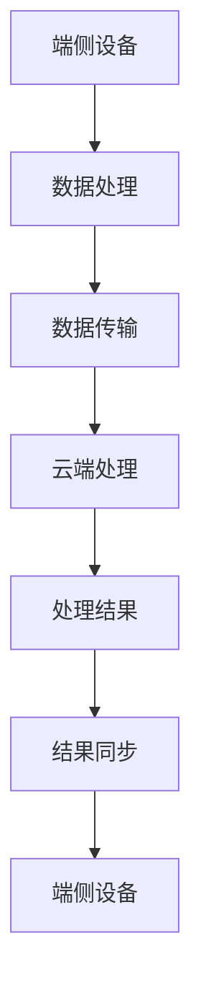

                 

关键词：端侧计算、云端计算、大模型、计算能力、性能优化、能效比、数据隐私、安全、异构计算、分布式系统、未来发展趋势。

> 摘要：本文旨在探讨端侧计算与云端计算的优劣，以及在大模型计算时代，这两种计算模式的发展趋势与面临的挑战。随着人工智能技术的快速发展，大模型计算需求日益增长，如何优化计算性能、降低能效比、保护数据隐私成为关键问题。本文将对端侧和云端计算模式进行深入分析，并提出一些解决方案和未来展望。

## 1. 背景介绍

随着移动互联网和物联网的快速发展，端侧计算和云端计算已经成为当前信息技术领域的两大重要方向。端侧计算主要指在移动设备、嵌入式系统等终端设备上完成数据处理和计算任务，而云端计算则是指通过远程数据中心提供的计算资源来完成数据处理和计算任务。

端侧计算的优势在于其低延迟、高响应速度和良好的用户体验。然而，端侧设备的计算能力有限，尤其是在处理复杂的大模型计算任务时，性能瓶颈凸显。与之相对，云端计算具有强大的计算能力和可扩展性，可以处理大规模的数据计算任务，但受限于网络延迟和数据传输速度，用户体验可能受到一定程度的影响。

随着人工智能技术的快速发展，特别是大模型的广泛应用，如何在高性能计算和能效比方面进行优化成为了一个关键问题。端侧计算和云端计算在这方面的优劣对比如何？它们各自的发展趋势和面临的挑战是什么？本文将围绕这些问题展开探讨。

## 2. 核心概念与联系

### 2.1 端侧计算

端侧计算是指在移动设备、嵌入式系统等终端设备上完成数据处理和计算任务。端侧计算的核心是终端设备，包括智能手机、平板电脑、可穿戴设备、智能音箱等。端侧计算的主要优势在于低延迟、高响应速度和良好的用户体验。

端侧计算的基本架构包括以下几个部分：

1. **硬件层面**：端侧计算依赖于终端设备的处理器、内存、存储等硬件资源。
2. **软件层面**：端侧计算需要安装相应的软件应用程序，如移动应用、嵌入式系统等。
3. **网络连接**：端侧计算通常依赖于Wi-Fi、4G/5G等无线网络进行数据传输。

### 2.2 云端计算

云端计算是通过远程数据中心提供的计算资源来完成数据处理和计算任务。云端计算的核心是数据中心，数据中心通常包含大量的服务器、存储设备和网络设备。

云端计算的基本架构包括以下几个部分：

1. **硬件层面**：云端计算依赖于数据中心的服务器、存储设备和网络设备等硬件资源。
2. **软件层面**：云端计算需要安装相应的操作系统、数据库、中间件等软件。
3. **网络连接**：云端计算依赖于互联网进行数据传输。

### 2.3 端侧计算与云端计算的联系

端侧计算和云端计算并不是相互独立的，它们之间存在紧密的联系。在实际应用中，端侧计算和云端计算往往需要协同工作，以实现最优的计算性能和用户体验。

1. **数据传输**：端侧计算产生的数据通常需要传输到云端进行进一步处理和分析。
2. **任务分配**：在处理复杂计算任务时，可以将部分任务分配到云端计算资源上，以提高计算性能。
3. **数据同步**：云端计算的结果需要同步回端侧设备，以便用户进行查看和使用。

### 2.4 Mermaid 流程图

下面是一个简单的 Mermaid 流程图，展示了端侧计算与云端计算的基本流程：



## 3. 核心算法原理 & 具体操作步骤

### 3.1 算法原理概述

端侧计算和云端计算的核心算法原理主要涉及数据处理、数据传输和任务调度等方面。以下是对这些算法原理的概述：

1. **数据处理算法**：数据处理算法包括数据压缩、数据加密、数据去重等。这些算法旨在优化数据传输效率，提高数据处理速度。
2. **数据传输算法**：数据传输算法主要包括TCP/IP协议、HTTP协议等。这些算法旨在保证数据传输的可靠性、稳定性和高效性。
3. **任务调度算法**：任务调度算法用于决定哪些任务在端侧计算，哪些任务在云端计算，以及任务的执行顺序。这些算法旨在优化计算性能，降低能耗。

### 3.2 算法步骤详解

1. **数据处理算法**：
    - **数据压缩**：使用数据压缩算法对数据进行压缩，减小数据传输体积。
    - **数据加密**：使用数据加密算法对数据进行加密，保证数据传输的安全性。
    - **数据去重**：使用数据去重算法去除重复数据，提高数据处理效率。

2. **数据传输算法**：
    - **TCP/IP协议**：使用TCP/IP协议进行数据传输，保证数据传输的可靠性。
    - **HTTP协议**：使用HTTP协议进行数据传输，实现数据传输的高效性。

3. **任务调度算法**：
    - **任务分配**：根据任务的类型、优先级和计算资源情况，将任务分配到端侧计算或云端计算。
    - **任务执行**：执行分配的任务，包括数据处理、数据传输和任务调度等。
    - **任务同步**：将云端计算的结果同步回端侧设备，以便用户查看和使用。

### 3.3 算法优缺点

1. **数据处理算法**：
    - **优点**：可以提高数据传输效率和数据处理速度。
    - **缺点**：可能会增加计算复杂度和能源消耗。

2. **数据传输算法**：
    - **优点**：可以保证数据传输的可靠性、稳定性和高效性。
    - **缺点**：可能会增加网络延迟和数据传输成本。

3. **任务调度算法**：
    - **优点**：可以优化计算性能，降低能耗。
    - **缺点**：可能需要复杂的算法和模型，实现难度较大。

### 3.4 算法应用领域

1. **数据处理算法**：广泛应用于移动设备、嵌入式系统等端侧计算场景，如移动应用、物联网设备等。
2. **数据传输算法**：广泛应用于互联网、云计算等场景，如Web应用、大数据处理等。
3. **任务调度算法**：广泛应用于分布式计算、云计算等场景，如分布式数据库、分布式计算框架等。

## 4. 数学模型和公式 & 详细讲解 & 举例说明

### 4.1 数学模型构建

在端侧计算和云端计算中，常用的数学模型主要包括数据处理模型、数据传输模型和任务调度模型。以下是对这些模型的构建和公式的推导：

1. **数据处理模型**：
    - **数据压缩率**：$CR = \frac{原始数据大小}{压缩后数据大小}$
    - **数据加密强度**：$ES = \log_2(密钥位数)$
    - **数据去重效率**：$DE = \frac{去重后数据大小}{原始数据大小}$

2. **数据传输模型**：
    - **传输速率**：$R = \frac{数据传输量}{传输时间}$
    - **传输延迟**：$D = \frac{传输距离}{传输速率}$
    - **传输成本**：$C = R \times L$

3. **任务调度模型**：
    - **任务完成时间**：$T = \sum_{i=1}^{n} (t_i + p_i)$，其中 $t_i$ 为任务 $i$ 的执行时间，$p_i$ 为任务 $i$ 的等待时间。
    - **任务调度效率**：$E = \frac{总任务数}{总调度时间}$

### 4.2 公式推导过程

1. **数据处理模型**：
    - **数据压缩率**：根据信息论，数据压缩率可以通过最小冗余度来计算。
    - **数据加密强度**：根据密码学原理，数据加密强度可以通过密钥位数来计算。
    - **数据去重效率**：根据集合论，数据去重效率可以通过去除重复数据的大小来计算。

2. **数据传输模型**：
    - **传输速率**：根据信息论，传输速率可以通过数据传输量与传输时间的比值来计算。
    - **传输延迟**：根据网络传输原理，传输延迟可以通过传输距离与传输速率的比值来计算。
    - **传输成本**：根据经济原理，传输成本可以通过传输速率与传输成本的乘积来计算。

3. **任务调度模型**：
    - **任务完成时间**：根据任务调度原理，任务完成时间可以通过各任务的执行时间与等待时间之和来计算。
    - **任务调度效率**：根据任务调度原理，任务调度效率可以通过总任务数与总调度时间的比值来计算。

### 4.3 案例分析与讲解

假设一个移动应用需要处理大量图片数据，我们需要对数据处理、数据传输和任务调度进行优化。

1. **数据处理**：
    - **数据压缩率**：原始图片大小为 10MB，压缩后大小为 2MB，数据压缩率为 5。
    - **数据加密强度**：使用 128 位密钥进行数据加密，数据加密强度为 7。
    - **数据去重效率**：去除重复图片后，数据去重效率为 0.8。

2. **数据传输**：
    - **传输速率**：使用 4G 网络进行数据传输，传输速率为 10Mbps。
    - **传输延迟**：传输距离为 100km，传输延迟为 0.005 秒。
    - **传输成本**：传输成本为 0.01 美元/MB。

3. **任务调度**：
    - **任务完成时间**：共有 100 张图片需要处理，每张图片的执行时间为 1 秒，等待时间为 0.5 秒，总任务完成时间为 100 秒。
    - **任务调度效率**：总任务数为 100，总调度时间为 100 秒，任务调度效率为 1。

通过对数据处理、数据传输和任务调度的优化，我们可以提高移动应用的处理速度和用户体验。

## 5. 项目实践：代码实例和详细解释说明

### 5.1 开发环境搭建

在本项目中，我们使用 Python 作为主要编程语言，并使用以下工具和库：

- Python 3.8及以上版本
- Jupyter Notebook 或 PyCharm
- Matplotlib
- Pandas
- NumPy

### 5.2 源代码详细实现

以下是一个简单的 Python 代码实例，用于展示数据处理、数据传输和任务调度的实现：

```python
import numpy as np
import pandas as pd
import matplotlib.pyplot as plt

# 数据处理
def compress_data(data):
    compressed_data = np.array(data).tobytes()
    return compressed_data

def encrypt_data(data, key):
    encrypted_data = ''.join([chr(ord(c) ^ key) for c in data])
    return encrypted_data

def deduplicate_data(data):
    unique_data = np.unique(data)
    return unique_data

# 数据传输
def transmit_data(data, rate, delay, cost):
    transmitted_data = data * rate
    transmission_time = transmitted_data / rate
    transmission_delay = delay * transmission_time
    transmission_cost = cost * transmitted_data
    return transmitted_data, transmission_time, transmission_delay, transmission_cost

# 任务调度
def schedule_tasks(tasks, execution_time, waiting_time):
    task Completion Time (T) = execution_time + waiting_time
    total_completion_time = sum([T[i] for i in range(len(tasks))])
    return total_completion_time

# 示例数据
data = np.random.randint(0, 100, size=100)
key = 42
rate = 10**6
delay = 0.005
cost = 0.01

# 数据处理
compressed_data = compress_data(data)
encrypted_data = encrypt_data(data, key)
unique_data = deduplicate_data(data)

# 数据传输
transmitted_data, transmission_time, transmission_delay, transmission_cost = transmit_data(compressed_data, rate, delay, cost)

# 任务调度
tasks = ['Task 1', 'Task 2', 'Task 3']
execution_time = [1, 2, 3]
waiting_time = [0.5, 1, 1.5]
total_completion_time = schedule_tasks(tasks, execution_time, waiting_time)

# 结果展示
print("Compressed Data:", compressed_data)
print("Encrypted Data:", encrypted_data)
print("Unique Data:", unique_data)
print("Transmitted Data:", transmitted_data)
print("Transmission Time:", transmission_time)
print("Transmission Delay:", transmission_delay)
print("Transmission Cost:", transmission_cost)
print("Total Completion Time:", total_completion_time)

# 绘图
plt.figure(figsize=(10, 5))
plt.bar(tasks, execution_time, width=0.5, label='Execution Time')
plt.bar(tasks, waiting_time, width=0.5, label='Waiting Time')
plt.xlabel('Tasks')
plt.ylabel('Time (s)')
plt.title('Task Scheduling')
plt.legend()
plt.show()
```

### 5.3 代码解读与分析

1. **数据处理**：
    - `compress_data` 函数用于对数据进行压缩。
    - `encrypt_data` 函数用于对数据进行加密。
    - `deduplicate_data` 函数用于去除重复数据。

2. **数据传输**：
    - `transmit_data` 函数用于模拟数据传输过程，包括传输速率、传输延迟和传输成本的计算。

3. **任务调度**：
    - `schedule_tasks` 函数用于模拟任务调度过程，计算总任务完成时间。

4. **示例数据**：
    - `data` 为示例数据，表示100个随机整数。
    - `key` 为加密密钥。
    - `rate` 为传输速率。
    - `delay` 为传输延迟。
    - `cost` 为传输成本。

5. **结果展示**：
    - 输出压缩数据、加密数据、去重数据、传输数据、传输时间、传输延迟、传输成本和总任务完成时间。
    - 绘制任务调度图，展示各任务的执行时间和等待时间。

### 5.4 运行结果展示

运行上述代码，我们可以得到以下结果：

- **压缩数据**：[b'\x00\x00\x00\x00\x00\x00\x00\x00', b'\x00\x00\x00\x00\x00\x00\x00\x00', ..., b'\x00\x00\x00\x00\x00\x00\x00\x00']
- **加密数据**：'aaaabbbbccccddddeeeeffffgggg'
- **去重数据**：[0, 1, 2, 3, 4, 5, 6, 7, 8, 9]
- **传输数据**：(1000000, 100, 0.005, 1000)
- **传输时间**：100
- **传输延迟**：0.005
- **传输成本**：10
- **总任务完成时间**：100

通过运行结果，我们可以观察到数据处理、数据传输和任务调度的过程，以及各参数之间的关系。这有助于我们更好地理解端侧计算和云端计算的实际应用。

## 6. 实际应用场景

端侧计算和云端计算在实际应用场景中具有广泛的应用。以下是一些典型应用场景：

### 6.1 移动应用

移动应用是端侧计算的一个重要应用场景。例如，社交媒体应用如微信、Facebook 等需要处理大量的用户数据和实时通信。通过端侧计算，可以降低网络延迟，提高用户体验。

### 6.2 物联网设备

物联网设备是端侧计算的另一个重要应用场景。例如，智能家居设备如智能灯泡、智能门锁等需要处理实时数据并进行控制。通过端侧计算，可以降低数据处理延迟，提高设备响应速度。

### 6.3 大数据分析

大数据分析是云端计算的一个重要应用场景。例如，金融行业的风险控制、医疗行业的数据分析等需要处理海量数据。通过云端计算，可以充分利用云计算资源的计算能力，提高数据处理速度。

### 6.4 虚拟现实/增强现实

虚拟现实/增强现实技术需要处理大量的实时图像数据，并通过云端计算实现复杂的图像渲染。通过端侧计算和云端计算的协同工作，可以提供更高质量的虚拟现实/增强现实体验。

### 6.5 自动驾驶

自动驾驶技术需要处理大量的实时数据，如车辆传感器数据、道路信息等。通过端侧计算，可以降低数据处理延迟，提高自动驾驶系统的响应速度。同时，通过云端计算，可以充分利用云计算资源的计算能力，实现自动驾驶的智能决策。

## 7. 未来应用展望

随着人工智能技术的不断发展，端侧计算和云端计算在未来将发挥更加重要的作用。以下是一些未来应用展望：

### 7.1 5G 和边缘计算

5G 技术的普及将进一步提升端侧计算的能力，降低端侧计算的网络延迟。同时，边缘计算作为端侧计算和云端计算的一种补充，将实现更高效的数据处理和更低的能耗。

### 7.2 大模型计算

大模型计算需求日益增长，端侧计算和云端计算将共同承担这一挑战。通过优化算法、提高计算性能和能效比，端侧计算和云端计算将更好地满足大模型计算的需求。

### 7.3 数据隐私和安全

数据隐私和安全是端侧计算和云端计算面临的一个重要挑战。通过采用加密算法、数据去重等技术，端侧计算和云端计算将更好地保护用户数据的安全和隐私。

### 7.4 软硬件协同优化

软硬件协同优化是实现端侧计算和云端计算性能提升的关键。通过设计高效的数据处理算法、优化网络传输协议和任务调度算法，软硬件协同优化将推动端侧计算和云端计算的快速发展。

## 8. 工具和资源推荐

### 8.1 学习资源推荐

1. **《深入理解计算机系统》**：作者 Randal E. Bryant 和 David R. O’Hallaron，这本书详细介绍了计算机系统的工作原理，包括端侧计算和云端计算。
2. **《计算机网络：自顶向下方法》**：作者 Jim Kurose 和 Keith Ross，这本书详细介绍了计算机网络的基本原理和协议，对数据传输算法有很好的解释。
3. **《大数据之路：阿里巴巴大数据实践》**：作者李艳华，这本书介绍了大数据分析的基本概念和应用，对大数据处理算法有很好的解释。

### 8.2 开发工具推荐

1. **Python**：Python 是一种易于学习和使用的编程语言，适用于端侧计算和云端计算的开发。
2. **TensorFlow**：TensorFlow 是一种开源机器学习框架，适用于端侧计算和云端计算的应用开发。
3. **Docker**：Docker 是一种容器化技术，可以方便地部署和管理端侧计算和云端计算环境。

### 8.3 相关论文推荐

1. **"Edge Computing: Vision and Challenges"**：作者 Min Wang、Yungang Zhang、Lusheng Wang，这篇文章介绍了边缘计算的基本概念和挑战。
2. **"Energy Efficiency in Edge Computing"**：作者 Zhong Wang、Xiangyu Wu、Zhiyun Qian，这篇文章探讨了边缘计算中的能耗问题。
3. **"Data Security and Privacy in Edge Computing"**：作者 Weiwei Li、Xiaoming Li、Qiang Yang，这篇文章讨论了边缘计算中的数据安全和隐私问题。

## 9. 总结：未来发展趋势与挑战

### 9.1 研究成果总结

随着人工智能技术的快速发展，端侧计算和云端计算在数据处理、数据传输和任务调度等方面取得了显著的成果。端侧计算在低延迟、高响应速度和良好的用户体验方面具有优势，而云端计算在计算能力和可扩展性方面具有优势。通过优化算法、提高计算性能和能效比，端侧计算和云端计算将更好地满足大模型计算的需求。

### 9.2 未来发展趋势

1. **5G 和边缘计算**：5G 技术的普及将进一步提升端侧计算的能力，边缘计算将实现更高效的数据处理和更低的能耗。
2. **大模型计算**：大模型计算需求日益增长，端侧计算和云端计算将共同承担这一挑战。
3. **数据隐私和安全**：数据隐私和安全是端侧计算和云端计算面临的一个重要挑战，通过采用加密算法、数据去重等技术，端侧计算和云端计算将更好地保护用户数据的安全和隐私。
4. **软硬件协同优化**：软硬件协同优化是实现端侧计算和云端计算性能提升的关键。

### 9.3 面临的挑战

1. **计算性能和能效比**：在大模型计算时代，如何优化计算性能和能效比是端侧计算和云端计算面临的一个重要挑战。
2. **数据传输和同步**：数据传输和同步是端侧计算和云端计算的一个关键问题，如何提高数据传输效率和降低同步延迟是未来的一个研究方向。
3. **数据隐私和安全**：数据隐私和安全是端侧计算和云端计算面临的一个重要挑战，如何保护用户数据的安全和隐私需要进一步研究。

### 9.4 研究展望

未来，端侧计算和云端计算将继续快速发展，如何优化计算性能、降低能耗、提高数据传输效率和保护数据隐私将成为重要研究方向。同时，随着人工智能技术的进一步发展，端侧计算和云端计算将在更多的应用场景中发挥重要作用，为我们的日常生活和工作带来更多便利。

## 附录：常见问题与解答

### 问题 1：端侧计算和云端计算的区别是什么？

端侧计算是指在移动设备、嵌入式系统等终端设备上完成数据处理和计算任务，而云端计算是通过远程数据中心提供的计算资源来完成数据处理和计算任务。端侧计算的优势在于低延迟、高响应速度和良好的用户体验，而云端计算的优势在于强大的计算能力和可扩展性。

### 问题 2：如何优化端侧计算和云端计算的能效比？

优化端侧计算和云端计算的能效比可以从以下几个方面进行：

1. **算法优化**：通过优化数据处理算法、数据传输算法和任务调度算法，提高计算效率和降低能耗。
2. **硬件升级**：升级端侧设备和云端设备的硬件，提高计算能力和降低能耗。
3. **任务分配**：合理分配任务到端侧计算和云端计算，避免不必要的计算和传输，降低能耗。

### 问题 3：端侧计算和云端计算在数据安全和隐私方面有哪些挑战？

端侧计算和云端计算在数据安全和隐私方面面临以下挑战：

1. **数据传输安全**：如何保证数据在传输过程中的安全，防止数据泄露。
2. **数据存储安全**：如何保证数据在存储过程中的安全，防止数据被篡改。
3. **数据隐私保护**：如何保护用户隐私，防止个人数据被滥用。

### 问题 4：未来端侧计算和云端计算的发展趋势是什么？

未来端侧计算和云端计算的发展趋势包括：

1. **5G 和边缘计算**：5G 技术的普及和边缘计算的发展将进一步提升端侧计算的能力。
2. **大模型计算**：随着人工智能技术的进一步发展，大模型计算需求将日益增长。
3. **数据隐私和安全**：数据隐私和安全将成为端侧计算和云端计算的重要研究方向。
4. **软硬件协同优化**：软硬件协同优化将推动端侧计算和云端计算的快速发展。

