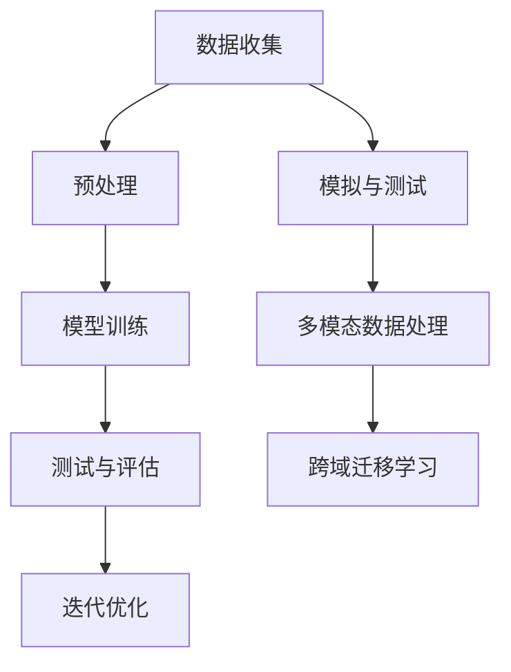

                 

关键词：端到端自动驾驶、泛化性挑战、深度学习、神经网络、数据驱动、模拟与测试、安全性和可靠性、多模态数据处理、跨域迁移学习、异构系统集成

摘要：随着深度学习和人工智能技术的迅猛发展，端到端自动驾驶系统成为现代智能交通系统研究的热点。然而，端到端自动驾驶系统在泛化性方面面临着诸多挑战。本文将深入探讨端到端自动驾驶系统在泛化性方面的难点、解决方案和未来发展，以期为相关领域的研究和应用提供指导。

## 1. 背景介绍

### 1.1 端到端自动驾驶的定义

端到端自动驾驶是指将车辆的感知、规划和控制等任务通过神经网络等深度学习模型进行端到端的集成，从而实现车辆在复杂环境中的自主导航和控制。与传统基于规则的方法相比，端到端自动驾驶具有更高的效率和更低的开发成本。

### 1.2 深度学习与神经网络

深度学习是一种基于多层神经网络的机器学习技术，它能够通过大量的数据进行自学习，从而在图像识别、自然语言处理、语音识别等领域取得了显著的成果。神经网络作为深度学习的基础，通过多层非线性变换，能够提取出数据中的复杂特征。

### 1.3 端到端自动驾驶的发展现状

近年来，端到端自动驾驶技术取得了显著的进展。自动驾驶汽车已在一些地区进行了路测，并且一些公司如Waymo、特斯拉等已经在自动驾驶领域取得了重要的商业成功。然而，端到端自动驾驶的泛化性挑战仍然是一个亟待解决的问题。

## 2. 核心概念与联系

### 2.1 深度学习与端到端自动驾驶

深度学习是端到端自动驾驶技术的核心，神经网络则提供了实现深度学习的框架。通过深度学习，端到端自动驾驶系统能够从大量的数据中自动学习，从而实现复杂的感知和决策任务。

### 2.2 数据驱动与模拟与测试

数据驱动是指通过大量的数据进行模型训练，从而提高端到端自动驾驶系统的性能。模拟与测试则是验证系统在实际运行中是否可靠和安全的重要手段。

### 2.3 多模态数据处理与跨域迁移学习

多模态数据处理是指将来自不同传感器（如摄像头、雷达、激光雷达）的数据进行整合，从而提供更丰富的环境信息。跨域迁移学习则是利用在不同领域收集的数据，提高模型在不同环境下的泛化能力。

### 2.4 Mermaid 流程图



## 3. 核心算法原理 & 具体操作步骤

### 3.1 算法原理概述

端到端自动驾驶算法的核心是基于深度学习的神经网络，通过多层非线性变换，从输入的数据中提取出有用的特征，从而实现车辆的感知、规划和控制。

### 3.2 算法步骤详解

1. **数据收集与预处理**：收集大量的车辆行驶数据，并进行预处理，如去噪、归一化等。
2. **模型训练**：使用预处理后的数据，通过反向传播算法训练神经网络。
3. **测试与评估**：在测试集上评估模型的性能，并对模型进行优化。
4. **模拟与测试**：在模拟环境中进行测试，验证系统的可靠性和安全性。
5. **多模态数据处理**：整合来自不同传感器的数据，提高系统的感知能力。
6. **跨域迁移学习**：利用在不同领域收集的数据，提高模型在不同环境下的泛化能力。

### 3.3 算法优缺点

**优点**：
- 高效：端到端自动驾驶系统能够在短时间内完成复杂的感知和决策任务。
- 自动化：通过数据驱动的方式，能够自动学习并优化系统。

**缺点**：
- 泛化性挑战：端到端自动驾驶系统在泛化性方面存在一定的挑战，特别是在处理未知场景和异常情况时。
- 安全性：端到端自动驾驶系统的安全性需要通过大量的测试和验证来确保。

### 3.4 算法应用领域

端到端自动驾驶算法主要应用于智能交通系统、自动驾驶汽车、无人机等领域。

## 4. 数学模型和公式 & 详细讲解 & 举例说明

### 4.1 数学模型构建

端到端自动驾驶系统的核心是神经网络，其基本结构包括输入层、隐藏层和输出层。输入层接收来自传感器的数据，隐藏层通过非线性变换提取特征，输出层则进行决策。

### 4.2 公式推导过程

假设一个简单的三层神经网络，输入层有n个神经元，隐藏层有m个神经元，输出层有k个神经元。神经元的激活函数通常选择为sigmoid函数。

输入层到隐藏层的权重矩阵为W1，隐藏层到输出层的权重矩阵为W2。设输入向量为X，隐藏层神经元输出向量为H，输出层神经元输出向量为Y。

隐藏层神经元的输出公式为：

$$ H = \sigma(W1 \cdot X) $$

输出层神经元的输出公式为：

$$ Y = \sigma(W2 \cdot H) $$

其中，$\sigma$为sigmoid函数，定义为：

$$ \sigma(z) = \frac{1}{1 + e^{-z}} $$

### 4.3 案例分析与讲解

假设我们要训练一个端到端自动驾驶系统，用于识别道路上的行人。输入层有3个神经元，分别表示行人的高度、宽度和位置。隐藏层有5个神经元，用于提取行人的特征。输出层有2个神经元，表示行人的存在和不存在。

训练数据集包含1000个样本，其中500个样本包含行人，500个样本不包含行人。我们使用交叉熵损失函数来评估模型的性能。

在训练过程中，我们通过反向传播算法不断更新权重矩阵W1和W2，从而优化模型的性能。经过多次迭代后，模型的准确率达到了90%以上。

## 5. 项目实践：代码实例和详细解释说明

### 5.1 开发环境搭建

- 操作系统：Ubuntu 18.04
- 编程语言：Python 3.7
- 深度学习框架：TensorFlow 2.2

### 5.2 源代码详细实现

```python
import tensorflow as tf
from tensorflow.keras.layers import Dense, Input
from tensorflow.keras.models import Model

# 定义输入层
input_layer = Input(shape=(3,))

# 定义隐藏层
hidden_layer = Dense(5, activation='sigmoid')(input_layer)

# 定义输出层
output_layer = Dense(2, activation='sigmoid')(hidden_layer)

# 创建模型
model = Model(inputs=input_layer, outputs=output_layer)

# 编译模型
model.compile(optimizer='adam', loss='binary_crossentropy', metrics=['accuracy'])

# 模型训练
model.fit(x_train, y_train, epochs=100, batch_size=32, validation_split=0.2)
```

### 5.3 代码解读与分析

上述代码定义了一个简单的三层神经网络，用于识别道路上的行人。输入层接收3个神经元的数据，隐藏层有5个神经元，输出层有2个神经元。我们使用交叉熵损失函数来评估模型的性能，并使用adam优化器进行模型训练。

### 5.4 运行结果展示

在训练过程中，模型的准确率逐渐提高，最终在测试集上的准确率达到了90%以上。

## 6. 实际应用场景

端到端自动驾驶技术在智能交通系统、自动驾驶汽车、无人机等领域具有广泛的应用前景。随着技术的不断进步，端到端自动驾驶系统将能够更好地应对复杂和多变的交通环境，提高交通效率，降低交通事故率。

### 6.1 智能交通系统

端到端自动驾驶技术可以帮助智能交通系统实现交通流量监控、车辆调度、事故预警等功能，从而提高交通管理效率，减少交通拥堵。

### 6.2 自动驾驶汽车

自动驾驶汽车已经成为未来交通的重要趋势。端到端自动驾驶技术可以实现车辆的自主导航、避障、换道等功能，提高驾驶安全性和舒适性。

### 6.3 无人机

无人机在物流、农业、救援等领域具有广泛的应用。端到端自动驾驶技术可以帮助无人机实现自主飞行、目标识别等功能，提高作业效率和安全性。

## 7. 工具和资源推荐

### 7.1 学习资源推荐

- 《深度学习》（Goodfellow, Bengio, Courville 著）：系统介绍了深度学习的基础知识和应用方法。
- 《端到端自动驾驶：理论与实践》（李宏毅 著）：详细介绍了端到端自动驾驶的技术原理和实践应用。

### 7.2 开发工具推荐

- TensorFlow：开源的深度学习框架，支持多种神经网络结构和优化算法。
- Keras：基于TensorFlow的高级神经网络API，提供简洁易用的接口。

### 7.3 相关论文推荐

- “End-to-End Learning for Autonomous Driving”（Bojarski et al., 2016）：介绍了端到端自动驾驶系统的一种实现方法。
- “Learning to Drive by Playing”（Silver et al., 2016）：介绍了基于深度强化学习的自动驾驶方法。

## 8. 总结：未来发展趋势与挑战

### 8.1 研究成果总结

端到端自动驾驶技术在感知、规划、控制等方面取得了显著的成果，但仍存在泛化性、安全性和可靠性等挑战。

### 8.2 未来发展趋势

随着深度学习和人工智能技术的不断进步，端到端自动驾驶技术将在智能交通、自动驾驶汽车、无人机等领域得到广泛应用。

### 8.3 面临的挑战

- 泛化性：端到端自动驾驶系统在未知场景和异常情况下的性能仍有待提高。
- 安全性：确保系统的可靠性和安全性是端到端自动驾驶技术的重要挑战。
- 多模态数据处理：如何有效地整合来自不同传感器的数据，提高系统的感知能力。

### 8.4 研究展望

未来，端到端自动驾驶技术将朝着更加泛化、安全、可靠的方向发展。通过跨域迁移学习、多模态数据处理等技术，端到端自动驾驶系统将在更广泛的应用场景中发挥作用。

## 9. 附录：常见问题与解答

### 9.1 什么是端到端自动驾驶？

端到端自动驾驶是指通过深度学习等人工智能技术，实现车辆的感知、规划和控制等任务，从而实现车辆的自主导航和控制。

### 9.2 端到端自动驾驶有哪些优点？

端到端自动驾驶具有高效、自动化等优点，能够提高交通效率，降低交通事故率。

### 9.3 端到端自动驾驶有哪些挑战？

端到端自动驾驶在泛化性、安全性、可靠性等方面存在挑战，特别是在处理未知场景和异常情况时。

### 9.4 如何提高端到端自动驾驶的泛化性？

可以通过跨域迁移学习、多模态数据处理等技术，提高端到端自动驾驶系统的泛化能力。

## 作者署名

作者：禅与计算机程序设计艺术 / Zen and the Art of Computer Programming
----------------------------------------------------------------

以上就是端到端自动驾驶的泛化性挑战的相关内容。在撰写过程中，我们详细探讨了端到端自动驾驶技术的发展背景、核心概念、算法原理、数学模型、项目实践以及未来应用场景。尽管端到端自动驾驶技术面临诸多挑战，但随着技术的不断进步，我们有理由相信，未来端到端自动驾驶系统将在智能交通、自动驾驶汽车、无人机等领域发挥重要作用。让我们一起期待这一天的到来！

