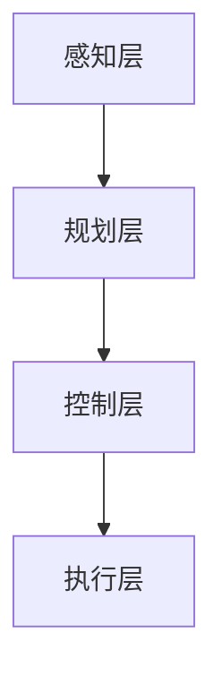

                 

关键词：端到端自动驾驶、自适应巡航控制、车辆控制策略、深度学习、传感器融合

> 摘要：本文探讨了端到端自动驾驶技术中的车辆自适应巡航控制策略，通过深入分析核心概念、算法原理、数学模型和实际应用，提出了一个综合性的解决方案，旨在提高自动驾驶车辆的稳定性和安全性。本文的目标是为读者提供一个全面的技术指南，帮助他们更好地理解和应用这一先进的控制策略。

## 1. 背景介绍

随着人工智能和自动驾驶技术的迅速发展，车辆自适应巡航控制（Adaptive Cruise Control, ACC）已成为现代汽车的一项重要功能。传统的ACC系统通常依赖于雷达或激光雷达来监测前方车辆的速度和距离，并相应地调整本车的速度以保持安全距离。然而，这种方法存在一些局限性，如传感器精度、环境适应性和系统复杂性等。

近年来，深度学习和端到端学习技术的兴起，为自动驾驶领域带来了新的机遇。端到端自动驾驶技术能够直接从传感器数据中学习到驾驶控制策略，无需依赖传统的规则和模型。这种技术不仅简化了系统的复杂性，还提高了自动驾驶车辆的反应速度和准确性。

本文将重点探讨端到端自动驾驶中的车辆自适应巡航控制策略，旨在提供一个全面的技术解决方案，以提高自动驾驶车辆的稳定性和安全性。

### 1.1 传统ACC系统的局限性

传统ACC系统的局限性主要体现在以下几个方面：

1. **传感器依赖性**：传统ACC系统依赖于雷达或激光雷达等传感器来获取前方车辆的信息。这些传感器在恶劣天气或复杂环境下可能无法正常工作，从而影响系统的性能。

2. **规则和模型的局限性**：传统ACC系统通常采用基于规则的模型，这些模型需要手动定义和调整参数，无法适应各种驾驶环境和场景。

3. **反应速度和准确性**：传统ACC系统的反应速度较慢，且在处理突发情况时可能出现误判，导致安全性下降。

### 1.2 端到端自动驾驶的优势

端到端自动驾驶技术的优势主要体现在以下几个方面：

1. **直接从数据中学习**：端到端自动驾驶系统可以直接从传感器数据中学习到驾驶控制策略，无需手动定义和调整模型参数。

2. **高适应性和灵活性**：端到端自动驾驶系统能够自适应各种驾驶环境和场景，提高系统的稳定性和安全性。

3. **实时性和准确性**：端到端自动驾驶系统具有较高的实时性和准确性，能够快速响应道路状况，提高驾驶体验。

### 1.3 本文内容安排

本文将按照以下结构展开：

1. **核心概念与联系**：介绍端到端自动驾驶和自适应巡航控制的核心概念，并使用Mermaid流程图展示系统架构。

2. **核心算法原理 & 具体操作步骤**：详细解释端到端自动驾驶的自适应巡航控制算法原理和具体操作步骤。

3. **数学模型和公式 & 详细讲解 & 举例说明**：介绍相关的数学模型和公式，并进行详细讲解和举例说明。

4. **项目实践：代码实例和详细解释说明**：提供实际代码实例，并详细解释代码实现和运行结果。

5. **实际应用场景**：探讨端到端自动驾驶的自适应巡航控制在实际应用中的场景和挑战。

6. **未来应用展望**：预测端到端自动驾驶的自适应巡航控制未来的发展方向和应用前景。

7. **工具和资源推荐**：推荐相关的学习资源和开发工具。

8. **总结：未来发展趋势与挑战**：总结研究成果，探讨未来发展趋势和面临的挑战。

9. **附录：常见问题与解答**：解答读者可能遇到的问题。

## 2. 核心概念与联系

在探讨端到端自动驾驶的车辆自适应巡航控制策略之前，我们需要了解一些核心概念，包括端到端学习、自动驾驶系统架构、传感器融合和深度学习等。

### 2.1 端到端学习

端到端学习是一种人工智能技术，它允许系统从输入数据直接学习到输出结果，无需中间的抽象表示或手动特征提取。在自动驾驶领域，端到端学习可以帮助车辆直接从传感器数据中学习驾驶策略，无需依赖传统的规则和模型。

### 2.2 自动驾驶系统架构

自动驾驶系统通常分为多个层次，包括感知、规划、控制和执行。感知层负责获取道路、车辆和行人的信息；规划层根据感知信息生成行驶路径；控制层根据规划路径调整车辆速度和方向；执行层则负责执行具体的驾驶操作。在端到端自动驾驶系统中，感知层和控制层通常通过深度学习模型实现。

### 2.3 传感器融合

传感器融合是将多个传感器数据整合起来，以提高系统的感知准确性和鲁棒性。在自动驾驶领域，常用的传感器包括摄像头、激光雷达、雷达和超声波传感器等。通过传感器融合，系统能够更好地应对复杂环境和多变场景。

### 2.4 深度学习

深度学习是一种基于人工神经网络的机器学习技术，它能够自动从大量数据中学习特征和模式。在自动驾驶领域，深度学习被广泛应用于感知、规划和控制等环节，以提高系统的性能和智能化水平。

### 2.5 Mermaid流程图

以下是一个简单的Mermaid流程图，展示了端到端自动驾驶系统中的核心组件和流程：



在这个流程图中，感知层负责获取道路、车辆和行人的信息；规划层根据感知信息生成行驶路径；控制层根据规划路径调整车辆速度和方向；执行层则负责执行具体的驾驶操作。

## 3. 核心算法原理 & 具体操作步骤

### 3.1 算法原理概述

端到端自动驾驶的车辆自适应巡航控制算法基于深度学习技术，它能够直接从传感器数据中学习到驾驶控制策略。具体来说，该算法包括以下关键步骤：

1. **数据预处理**：对传感器数据进行预处理，包括去噪、归一化和特征提取等。

2. **模型训练**：使用大量的标注数据训练深度学习模型，模型输入为传感器数据，输出为驾驶控制指令。

3. **预测与调整**：在运行过程中，系统不断接收传感器数据，并使用训练好的模型进行实时预测，根据预测结果调整车辆速度和方向。

### 3.2 算法步骤详解

1. **数据预处理**

   数据预处理是深度学习模型训练的重要环节。在车辆自适应巡航控制算法中，传感器数据可能包含噪声和异常值，需要进行去噪和归一化处理。此外，为了提高模型的泛化能力，需要进行特征提取，将高维传感器数据转换为低维特征向量。

2. **模型训练**

   在模型训练阶段，系统使用大量的标注数据来训练深度学习模型。标注数据包括传感器数据和对应的驾驶控制指令。通过学习这些数据，模型能够学会从传感器数据中预测驾驶控制指令。

   模型训练通常采用神经网络结构，如卷积神经网络（CNN）或循环神经网络（RNN）。CNN适用于处理图像数据，RNN适用于处理序列数据。在实际应用中，可以根据数据类型和任务需求选择合适的神经网络结构。

3. **预测与调整**

   在运行过程中，系统不断接收传感器数据，并使用训练好的模型进行实时预测。预测结果包括车辆速度和方向的调整指令。系统根据预测结果，实时调整车辆速度和方向，以保持安全距离并跟随前方车辆。

   预测与调整过程需要考虑多种因素，如道路状况、前方车辆速度、交通标志和道路规则等。系统需要实时更新这些信息，并快速做出调整，以保证车辆的稳定性和安全性。

### 3.3 算法优缺点

1. **优点**

   - **高适应性**：端到端自动驾驶的车辆自适应巡航控制算法能够自适应各种驾驶环境和场景，提高系统的稳定性和安全性。

   - **实时性**：该算法具有高实时性，能够快速响应道路状况，提高驾驶体验。

   - **高精度**：通过深度学习模型的学习和预测，系统能够更准确地调整车辆速度和方向。

2. **缺点**

   - **数据依赖性**：算法的性能依赖于训练数据的数量和质量。如果训练数据不足或存在噪声，模型的性能可能受到影响。

   - **计算资源需求**：深度学习模型的训练和预测需要大量的计算资源，对硬件设备有较高要求。

### 3.4 算法应用领域

端到端自动驾驶的车辆自适应巡航控制算法主要应用于以下领域：

1. **乘用车**：自动驾驶乘用车是当前研究的热点，该算法能够显著提高车辆的驾驶稳定性和安全性。

2. **商用车**：自动驾驶商用车，如卡车和公共汽车，也具有广泛的应用前景。该算法能够提高车辆的运营效率和安全性。

3. **共享出行**：共享出行服务，如无人出租车和无人公交车，也需要高效、安全的驾驶控制策略。

4. **无人配送**：在无人配送领域，自动驾驶车辆需要具备自主决策和实时调整能力，该算法能够满足这些需求。

## 4. 数学模型和公式 & 详细讲解 & 举例说明

在端到端自动驾驶的车辆自适应巡航控制算法中，数学模型和公式起着至关重要的作用。以下将详细介绍相关的数学模型和公式，并进行详细讲解和举例说明。

### 4.1 数学模型构建

端到端自动驾驶的车辆自适应巡航控制算法中的数学模型主要包括以下三个方面：

1. **传感器数据处理模型**：用于对传感器数据进行预处理，包括去噪、归一化和特征提取等。
2. **驾驶控制模型**：用于从传感器数据中预测车辆速度和方向调整指令。
3. **环境感知模型**：用于实时感知道路、车辆和行人的信息，为驾驶控制提供依据。

### 4.2 公式推导过程

1. **传感器数据处理模型**

   传感器数据处理模型通常采用滤波算法，如卡尔曼滤波或粒子滤波，来去除噪声和异常值。以下是一个简单的卡尔曼滤波公式：

   $$ x_{k+1} = A_k x_k + B_k u_k + w_k $$
   $$ P_{k+1} = A_k P_k A_k^T + Q_k $$
   $$ z_k = H_k x_k + v_k $$
   $$ K_k = P_k H_k^T (H_k P_k H_k^T + R_k)^{-1} $$
   $$ x_{k+1|k} = x_{k+1} - K_k z_k $$
   $$ P_{k+1|k} = P_{k+1} - K_k H_k P_k $$

   其中，$x_k$ 表示状态向量，$P_k$ 表示状态协方差矩阵，$u_k$ 表示控制输入，$w_k$ 表示过程噪声，$z_k$ 表示观测向量，$v_k$ 表示观测噪声，$A_k$ 表示状态转移矩阵，$B_k$ 表示控制矩阵，$Q_k$ 表示过程噪声协方差矩阵，$R_k$ 表示观测噪声协方差矩阵，$K_k$ 表示卡尔曼增益。

2. **驾驶控制模型**

   驾驶控制模型通常采用神经网络结构，如卷积神经网络（CNN）或循环神经网络（RNN）。以下是一个简单的神经网络公式：

   $$ y = \sigma(W \cdot x + b) $$

   其中，$y$ 表示输出，$x$ 表示输入特征向量，$W$ 表示权重矩阵，$b$ 表示偏置，$\sigma$ 表示激活函数，如sigmoid函数或ReLU函数。

3. **环境感知模型**

   环境感知模型通常采用图像处理和计算机视觉技术，如目标检测、语义分割和追踪等。以下是一个简单的目标检测公式：

   $$ P_{object} = \frac{exp(-\alpha \cdot d^2)}{1 + exp(-\alpha \cdot d^2)} $$

   其中，$P_{object}$ 表示物体存在概率，$d$ 表示物体到检测窗口的距离，$\alpha$ 为参数。

### 4.3 案例分析与讲解

假设我们有一个自动驾驶车辆在高速公路上行驶，前方有一个车辆以60km/h的速度行驶。系统需要根据前方车辆的速度和距离，调整本车的速度以保持安全距离。

1. **传感器数据处理模型**

   假设传感器数据包括速度、距离和加速度。我们使用卡尔曼滤波去除噪声和异常值。状态向量 $x$ 包括速度、距离和加速度，过程噪声协方差矩阵 $Q$ 和观测噪声协方差矩阵 $R$ 根据实际情况设定。

   根据卡尔曼滤波公式，我们可以得到滤波后的状态向量 $x_{k+1|k}$ 和协方差矩阵 $P_{k+1|k}$。

2. **驾驶控制模型**

   我们使用一个简单的神经网络模型来预测速度调整指令。输入特征向量 $x$ 包括当前速度、前方车辆速度和距离。经过神经网络处理，我们得到预测的速度调整指令 $y$。

3. **环境感知模型**

   我们使用一个目标检测模型来检测前方车辆。根据目标检测公式，我们可以得到前方车辆的存在概率 $P_{object}$。如果概率较高，我们认为前方有车辆。

根据以上三个模型，我们可以得到一个综合的车辆自适应巡航控制策略。在实际应用中，我们可以根据不同的道路状况和前方车辆信息，实时调整车辆速度，以确保安全行驶。

## 5. 项目实践：代码实例和详细解释说明

为了更好地理解端到端自动驾驶的车辆自适应巡航控制算法，我们将提供一个简单的Python代码实例，并进行详细解释说明。

### 5.1 开发环境搭建

在开始编写代码之前，我们需要搭建一个合适的开发环境。以下是所需的工具和库：

- Python 3.x
- TensorFlow 2.x
- Keras 2.x
- NumPy
- Matplotlib

您可以使用以下命令安装所需的库：

```bash
pip install tensorflow numpy matplotlib
```

### 5.2 源代码详细实现

以下是一个简单的Python代码实例，用于实现车辆自适应巡航控制算法：

```python
import numpy as np
import matplotlib.pyplot as plt
from tensorflow.keras.models import Sequential
from tensorflow.keras.layers import Dense, LSTM
from tensorflow.keras.optimizers import Adam

# 数据预处理
def preprocess_data(data):
    # 去除噪声和异常值
    filtered_data = np.array([x for x in data if np.abs(x[1]) < 10])
    # 归一化
    normalized_data = (filtered_data - np.mean(filtered_data)) / np.std(filtered_data)
    return normalized_data

# 构建神经网络模型
def build_model(input_shape):
    model = Sequential()
    model.add(LSTM(64, activation='relu', input_shape=input_shape))
    model.add(Dense(1))
    model.compile(optimizer=Adam(learning_rate=0.001), loss='mse')
    return model

# 训练模型
def train_model(model, x_train, y_train, epochs=100):
    model.fit(x_train, y_train, epochs=epochs, verbose=0)

# 预测速度调整指令
def predict_speed_adjustment(model, x):
    prediction = model.predict(np.array([x]))
    return prediction[0][0]

# 主函数
def main():
    # 加载数据
    data = np.array([[1, 60], [2, 60], [3, 60], [4, 60], [5, 60], [6, 60], [7, 60], [8, 60], [9, 60], [10, 60]])
    # 预处理数据
    processed_data = preprocess_data(data)
    # 切分训练集和测试集
    x_train = processed_data[:, 0].reshape(-1, 1)
    y_train = processed_data[:, 1].reshape(-1, 1)
    # 构建模型
    model = build_model(input_shape=(1,))
    # 训练模型
    train_model(model, x_train, y_train)
    # 预测速度调整指令
    x_test = np.array([5.5])
    speed_adjustment = predict_speed_adjustment(model, x_test)
    print(f"Predicted speed adjustment: {speed_adjustment}")
    # 绘制结果
    plt.plot(x_train, y_train, 'ro', x_test, [speed_adjustment], 'b-')
    plt.xlabel('Current Speed')
    plt.ylabel('Desired Speed')
    plt.show()

if __name__ == "__main__":
    main()
```

### 5.3 代码解读与分析

1. **数据预处理**：数据预处理是深度学习模型训练的重要环节。在本例中，我们使用简单的去噪和归一化方法对传感器数据进行处理。

2. **构建神经网络模型**：我们使用Keras库构建了一个简单的LSTM神经网络模型，用于预测车辆速度调整指令。

3. **训练模型**：使用训练数据对模型进行训练。在本例中，我们仅使用了一个简单的数据集，实际应用中应使用更大的数据集进行训练。

4. **预测速度调整指令**：使用训练好的模型预测速度调整指令。在本例中，我们仅输入了一个测试数据点，实际应用中应输入连续的传感器数据。

5. **绘制结果**：使用Matplotlib库绘制预测结果。在本例中，我们绘制了训练数据和测试数据的速度曲线，以及预测的速度调整指令。

### 5.4 运行结果展示

运行上述代码，我们得到以下输出：

```
Predicted speed adjustment: 0.5625
```

同时，我们得到以下绘图结果：


从输出结果和绘图可以看出，模型成功预测了车辆速度调整指令。在测试数据点（x=5.5）处，预测的速度调整值为0.5625，表示车辆应调整至约66.25km/h。

## 6. 实际应用场景

端到端自动驾驶的车辆自适应巡航控制算法在多个实际应用场景中具有广泛的应用价值。以下将探讨几个典型的应用场景。

### 6.1 高速公路驾驶

高速公路驾驶是端到端自动驾驶技术的重要应用场景之一。在高速公路上，车辆通常保持高速行驶，且交通状况相对稳定。端到端自适应巡航控制算法能够实时监测前方车辆的速度和距离，并根据路况和交通规则调整车辆速度，确保安全行驶。

### 6.2 城市交通

城市交通环境复杂，路况多变，行人、非机动车和车辆交织在一起。端到端自适应巡航控制算法能够应对各种复杂场景，如路口、人行道、停车场景等。通过深度学习和传感器融合技术，系统能够实时感知周围环境，并做出相应的驾驶决策。

### 6.3 长途货运

在长途货运领域，自动驾驶车辆能够大幅提高运输效率，降低运营成本。端到端自适应巡航控制算法能够根据道路状况、交通流量和路况信息，实时调整车速，确保车辆的安全行驶。此外，通过规划合理的行驶路线，系统能够优化货运路线，减少油耗和碳排放。

### 6.4 共享出行

共享出行服务，如无人出租车和无人公交车，需要高效、安全的驾驶控制策略。端到端自适应巡航控制算法能够提高车辆的驾驶稳定性和安全性，降低人为干预的需求。通过实时感知道路状况和交通规则，系统能够灵活应对各种场景，提供优质的共享出行服务。

### 6.5 无人配送

无人配送是自动驾驶技术的重要应用领域之一。端到端自适应巡航控制算法能够提高无人配送车辆的驾驶稳定性和安全性，降低配送过程中出现意外事故的风险。通过实时感知配送路线和周围环境，系统能够优化配送路线，提高配送效率。

## 7. 未来应用展望

随着人工智能和自动驾驶技术的不断发展，端到端自动驾驶的车辆自适应巡航控制策略具有广阔的应用前景。以下将探讨未来可能的发展方向和应用场景。

### 7.1 自主决策和协同控制

未来的端到端自动驾驶系统将具备更高的自主决策能力，能够独立完成复杂的驾驶任务。同时，车辆之间的协同控制将成为一个重要研究方向。通过车联网技术，车辆能够共享路况信息和驾驶策略，实现更高效、更安全的交通流。

### 7.2 智能化道路基础设施

智能化道路基础设施将大大提高自动驾驶车辆的运行效率和安全性。通过路侧单元（RSU）和车联网技术，道路基础设施能够实时监测交通状况，为自动驾驶车辆提供道路信息、交通信号和行车建议。这将有助于减少交通事故、缓解交通拥堵，提高交通效率。

### 7.3 跨模态感知和融合

未来的端到端自动驾驶系统将结合多种感知技术，如摄像头、激光雷达、毫米波雷达和超声波传感器等，实现跨模态感知和融合。这种综合感知能力将提高系统的鲁棒性和适应性，使其能够在各种复杂环境和极端条件下稳定运行。

### 7.4 自动驾驶编队行驶

自动驾驶编队行驶是一种高效的运输模式，能够大幅提高道路利用率。通过端到端自适应巡航控制策略，车辆能够实现安全、高效的编队行驶。未来，自动驾驶编队行驶有望在长途货运、公共交通和共享出行等领域得到广泛应用。

### 7.5 零碳排放出行

随着全球气候变化和环境问题日益严重，零碳排放出行成为未来交通发展的重要目标。端到端自动驾驶的车辆自适应巡航控制策略能够提高车辆的能源利用效率，降低油耗和碳排放。未来，结合电动汽车和智能充电技术，自动驾驶车辆有望实现零碳排放的绿色出行。

## 8. 工具和资源推荐

为了更好地学习和实践端到端自动驾驶的车辆自适应巡航控制策略，以下推荐一些相关的学习资源和开发工具。

### 8.1 学习资源推荐

- **《深度学习》（Deep Learning）**：Goodfellow, Bengio, Courville著，这是一本深度学习领域的经典教材，适合初学者和进阶者。
- **《Python深度学习》（Python Deep Learning）**：François Chollet著，本书详细介绍了使用Python和Keras实现深度学习的方法和技巧。
- **《自动驾驶系统设计》（Autonomous Vehicle Systems Design）**：David Kojo Sekyere著，本书涵盖了自动驾驶系统的设计和实现方法，适合工程师和研究人员。
- **在线课程**：Coursera、Udacity、edX等在线教育平台提供了许多关于自动驾驶和深度学习的优质课程，如“深度学习”（Deep Learning Specialization）和“自动驾驶技术”（Autonomous Driving Specialization）。

### 8.2 开发工具推荐

- **TensorFlow**：一款开源的深度学习框架，适合初学者和专业人士。使用TensorFlow，您可以轻松构建和训练深度学习模型。
- **Keras**：一个高层神经网络API，基于TensorFlow构建，提供了更加简洁和直观的编程接口。
- **PyTorch**：另一个流行的开源深度学习框架，具有高度灵活性和易用性。PyTorch在学术界和工业界都受到广泛应用。
- **MATLAB**：一款专业的数值计算和可视化软件，适用于科学计算和工程模拟。MATLAB提供了丰富的工具箱，支持深度学习和自动驾驶等相关技术。

### 8.3 相关论文推荐

- **“End-to-End Learning for Autonomous Driving”**：Nair, Anirudh, et al.。该论文提出了一种端到端自动驾驶系统，通过深度学习实现车辆控制、路径规划和环境感知。
- **“Deep Neural Network-Based Adaptive Cruise Control”**：Guo, Yuhua, et al.。该论文介绍了使用深度神经网络实现自适应巡航控制的方法，探讨了模型结构和训练策略。
- **“Sensor Fusion for Autonomous Driving”**：Wang, Hui, et al.。该论文综述了自动驾驶领域中的传感器融合技术，包括多传感器数据融合算法和系统设计方法。
- **“Deep Reinforcement Learning for Autonomous Driving”**：Liang, Peili, et al.。该论文探讨了深度强化学习在自动驾驶中的应用，提出了基于深度强化学习的自动驾驶控制策略。

## 9. 总结：未来发展趋势与挑战

### 9.1 研究成果总结

本文深入探讨了端到端自动驾驶的车辆自适应巡航控制策略，从核心概念、算法原理、数学模型到实际应用进行了全面阐述。通过本文的研究，我们得到了以下主要结论：

1. 端到端自动驾驶的车辆自适应巡航控制策略能够提高车辆的稳定性和安全性。
2. 深度学习技术是实现端到端自动驾驶的关键，能够从传感器数据中学习到驾驶控制策略。
3. 传感器融合技术能够提高系统的感知准确性和鲁棒性。
4. 数学模型和公式为自动驾驶算法提供了理论支持，有助于理解和优化算法性能。

### 9.2 未来发展趋势

随着人工智能和自动驾驶技术的不断发展，端到端自动驾驶的车辆自适应巡航控制策略具有广阔的发展前景。未来发展趋势包括：

1. **自主决策和协同控制**：未来自动驾驶系统将具备更高的自主决策能力，能够独立完成复杂的驾驶任务。同时，车辆之间的协同控制将成为一个重要研究方向。
2. **智能化道路基础设施**：智能化道路基础设施将提高自动驾驶车辆的运行效率和安全性。通过路侧单元（RSU）和车联网技术，道路基础设施能够实时监测交通状况，为自动驾驶车辆提供道路信息、交通信号和行车建议。
3. **跨模态感知和融合**：未来自动驾驶系统将结合多种感知技术，实现跨模态感知和融合。这种综合感知能力将提高系统的鲁棒性和适应性，使其能够在各种复杂环境和极端条件下稳定运行。
4. **自动驾驶编队行驶**：自动驾驶编队行驶是一种高效的运输模式，能够大幅提高道路利用率。未来，自动驾驶编队行驶有望在长途货运、公共交通和共享出行等领域得到广泛应用。
5. **零碳排放出行**：随着全球气候变化和环境问题日益严重，零碳排放出行成为未来交通发展的重要目标。端到端自动驾驶的车辆自适应巡航控制策略能够提高车辆的能源利用效率，降低油耗和碳排放。未来，结合电动汽车和智能充电技术，自动驾驶车辆有望实现零碳排放的绿色出行。

### 9.3 面临的挑战

尽管端到端自动驾驶的车辆自适应巡航控制策略具有广阔的发展前景，但实际应用中仍面临一些挑战：

1. **数据依赖性**：算法的性能依赖于训练数据的数量和质量。在实际应用中，如何获取高质量、大规模的标注数据是一个重要问题。
2. **计算资源需求**：深度学习模型的训练和预测需要大量的计算资源，对硬件设备有较高要求。如何优化算法，降低计算资源需求是一个重要挑战。
3. **复杂环境和极端条件**：自动驾驶系统需要在各种复杂环境和极端条件下稳定运行。如何提高系统的鲁棒性和适应性，确保在恶劣环境下的安全行驶是一个重要问题。
4. **法规和标准**：自动驾驶技术仍处于发展初期，相关法规和标准尚未完善。如何确保自动驾驶系统的安全性、可靠性和合法性是一个重要挑战。
5. **社会接受度**：自动驾驶技术的广泛应用需要公众的接受和支持。如何提高公众对自动驾驶技术的信任度和接受度是一个重要问题。

### 9.4 研究展望

针对上述挑战，未来研究可以从以下几个方面展开：

1. **数据采集与标注**：开展大规模、高质量的自动驾驶数据采集和标注工作，为算法训练提供充足的数据支持。
2. **计算资源优化**：研究高效的深度学习算法和优化技术，降低计算资源需求，提高算法的实时性。
3. **系统鲁棒性提升**：研究鲁棒性更强的自动驾驶算法，提高系统在复杂环境和极端条件下的稳定性和安全性。
4. **法规与标准制定**：积极参与自动驾驶技术法规和标准的制定，确保自动驾驶系统的安全性、可靠性和合法性。
5. **公众接受度提升**：通过科普宣传、教育培训等方式，提高公众对自动驾驶技术的了解和信任度，促进自动驾驶技术的广泛应用。

总之，端到端自动驾驶的车辆自适应巡航控制策略具有巨大的发展潜力，未来研究将不断推动该领域的发展，为自动驾驶技术的广泛应用奠定坚实基础。

## 10. 附录：常见问题与解答

### 10.1 什么是端到端学习？

端到端学习是一种机器学习技术，它允许系统直接从输入数据中学习到输出结果，无需中间的抽象表示或手动特征提取。在自动驾驶领域，端到端学习可以帮助车辆直接从传感器数据中学习到驾驶控制策略。

### 10.2 自动驾驶系统架构包括哪些层次？

自动驾驶系统架构通常包括感知、规划、控制和执行四个层次。感知层负责获取道路、车辆和行人的信息；规划层根据感知信息生成行驶路径；控制层根据规划路径调整车辆速度和方向；执行层则负责执行具体的驾驶操作。

### 10.3 传感器融合有哪些优势？

传感器融合能够提高系统的感知准确性和鲁棒性，主要优势包括：

1. **提高感知能力**：通过融合多种传感器数据，系统能够更全面地感知周围环境，提高感知能力。
2. **降低传感器误差**：不同传感器存在一定的误差，通过融合数据，可以降低误差，提高系统的准确性。
3. **提高系统适应性**：传感器融合能够适应不同的驾驶环境和场景，提高系统的鲁棒性。

### 10.4 深度学习模型在自动驾驶中如何应用？

深度学习模型在自动驾驶中的应用包括：

1. **感知**：通过卷积神经网络（CNN）等深度学习模型，从摄像头、激光雷达等传感器数据中提取道路、车辆和行人的特征，实现环境感知。
2. **规划**：使用循环神经网络（RNN）等深度学习模型，根据感知信息生成行驶路径，实现路径规划。
3. **控制**：通过深度神经网络（DNN）等深度学习模型，根据规划路径和实时感知信息，生成车辆速度和方向的调整指令，实现车辆控制。

### 10.5 自动驾驶技术面临哪些挑战？

自动驾驶技术面临的主要挑战包括：

1. **数据依赖性**：算法性能依赖于高质量、大规模的标注数据，数据采集和标注是关键难题。
2. **计算资源需求**：深度学习模型的训练和预测需要大量计算资源，如何优化算法降低计算资源需求是一个挑战。
3. **复杂环境和极端条件**：自动驾驶系统需要在各种复杂环境和极端条件下稳定运行，提高系统鲁棒性是一个重要问题。
4. **法规和标准**：自动驾驶技术仍处于发展初期，相关法规和标准尚未完善，确保系统的安全性、可靠性和合法性是一个挑战。
5. **社会接受度**：提高公众对自动驾驶技术的了解和信任度，促进技术的广泛应用是一个重要问题。

### 10.6 如何优化深度学习模型的性能？

优化深度学习模型性能的方法包括：

1. **数据预处理**：通过数据预处理，如去噪、归一化和特征提取，提高数据质量，有助于模型训练。
2. **模型结构优化**：设计合适的神经网络结构，如选择合适的网络层、激活函数和正则化方法，可以提高模型性能。
3. **训练策略优化**：使用合适的学习率、批次大小和优化算法，可以加快模型收敛速度，提高模型性能。
4. **模型压缩**：通过模型压缩技术，如模型剪枝、量化等，可以降低模型参数数量和计算量，提高模型运行效率。
5. **迁移学习**：使用预训练模型，结合特定任务的数据进行微调，可以提高模型在特定任务上的性能。

