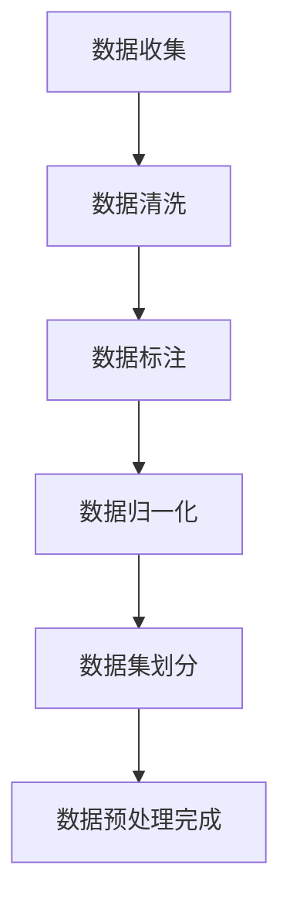
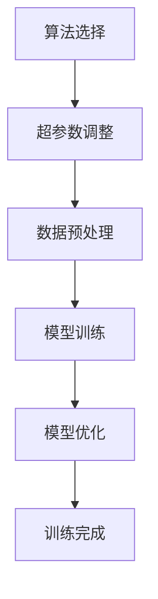
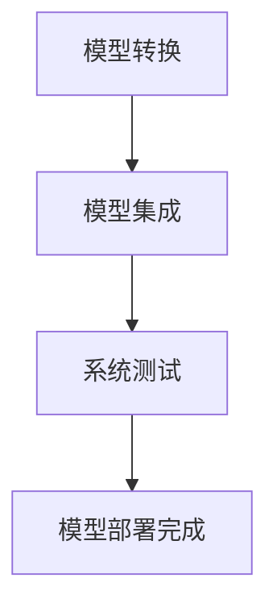
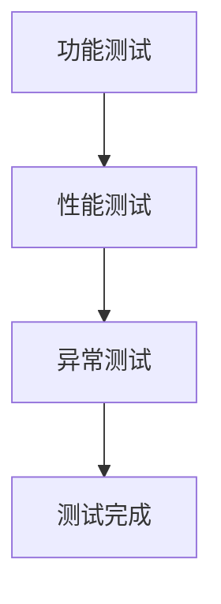

                 

关键词：端到端自动驾驶、软件开发工具链、优化、AI、深度学习、数据预处理、模型训练、模型部署、自动化测试

摘要：本文旨在探讨端到端自动驾驶的软件开发工具链的优化方法，通过分析现有的工具链及其瓶颈，提出一系列的优化策略。文章首先介绍了端到端自动驾驶的发展背景和核心技术，随后详细讨论了工具链的各个阶段，包括数据预处理、模型训练、模型部署和自动化测试。针对每个阶段，本文提出了具体的优化方法，并提供了实践案例。最后，文章对未来工具链的发展趋势和挑战进行了展望。

## 1. 背景介绍

随着人工智能技术的飞速发展，自动驾驶已经成为当前汽车行业的热点。自动驾驶技术不仅能够提升行车安全性，还能改善交通效率，减少交通事故。端到端自动驾驶系统通过深度学习模型直接从原始传感器数据中学习到驾驶策略，无需人为干预，是自动驾驶技术发展的一个重要方向。

然而，端到端自动驾驶系统的开发面临诸多挑战。首先，由于自动驾驶系统复杂度高，需要大量的数据集进行训练，如何高效地收集、预处理和利用这些数据成为一个关键问题。其次，深度学习模型的训练过程通常需要大量计算资源，如何优化训练流程和提高训练效率是一个重要课题。此外，模型的部署和自动化测试也是端到端自动驾驶系统开发中不可忽视的环节。

现有的软件开发工具链在应对这些挑战时存在一定的瓶颈。首先，数据预处理工具链不够完善，难以满足大规模数据集的需求。其次，模型训练和优化工具缺乏高效性和灵活性。最后，模型部署和自动化测试工具相对单一，难以适应多样化的应用场景。

## 2. 核心概念与联系

为了优化端到端自动驾驶的软件开发工具链，我们需要理解以下几个核心概念：数据预处理、模型训练、模型部署和自动化测试。

### 2.1 数据预处理

数据预处理是端到端自动驾驶开发的第一步，包括数据收集、清洗、标注和归一化等操作。数据预处理的质量直接影响到后续模型训练的效果。Mermaid流程图如下：



### 2.2 模型训练

模型训练是端到端自动驾驶开发的核心环节。通过训练，深度学习模型能够从数据中学习到驾驶策略。模型训练涉及到算法选择、超参数调整和训练策略优化等多个方面。Mermaid流程图如下：



### 2.3 模型部署

模型部署是将训练好的模型集成到自动驾驶系统中，使其能够在实际环境中运行。模型部署涉及到模型的转换、集成和测试等多个环节。Mermaid流程图如下：



### 2.4 自动化测试

自动化测试是确保自动驾驶系统稳定性和可靠性的重要手段。通过自动化测试，可以快速、高效地发现和修复系统中的问题。自动化测试包括功能测试、性能测试和异常测试等多个方面。Mermaid流程图如下：



## 3. 核心算法原理 & 具体操作步骤

### 3.1 算法原理概述

端到端自动驾驶的算法核心是基于深度学习模型的感知、规划和控制。感知模块负责从传感器数据中提取环境信息；规划模块负责根据感知信息制定驾驶策略；控制模块负责执行具体的驾驶操作。以下是具体的算法原理：

- **感知模块**：使用卷积神经网络（CNN）对传感器数据进行特征提取，识别道路、车辆、行人等环境元素。
- **规划模块**：使用递归神经网络（RNN）或图神经网络（GNN）对感知信息进行序列处理，生成驾驶策略。
- **控制模块**：使用强化学习（RL）或最优控制（OC）算法，将规划结果转化为具体的驾驶操作。

### 3.2 算法步骤详解

1. **数据预处理**：对收集到的传感器数据进行清洗、标注和归一化，划分为训练集、验证集和测试集。
2. **感知模块训练**：使用CNN训练感知模块，提取环境特征。
3. **规划模块训练**：使用RNN或GNN训练规划模块，生成驾驶策略。
4. **控制模块训练**：使用RL或OC训练控制模块，实现驾驶操作。
5. **模型集成与测试**：将训练好的模型集成到自动驾驶系统中，进行功能测试、性能测试和异常测试。
6. **模型部署**：将经过测试的模型部署到实际车辆中，进行自动驾驶操作。

### 3.3 算法优缺点

- **优点**：端到端自动驾驶算法能够直接从原始数据中学习驾驶策略，减少了人为干预，提高了效率和准确性。
- **缺点**：算法对数据质量和计算资源要求较高，且训练过程较为复杂，需要大量的计算资源和时间。

### 3.4 算法应用领域

端到端自动驾驶算法广泛应用于无人驾驶车辆、自动驾驶出租车、智能交通系统等领域，未来还将在更多的场景中得到应用。

## 4. 数学模型和公式 & 详细讲解 & 举例说明

### 4.1 数学模型构建

端到端自动驾驶的数学模型主要包括感知模型、规划模型和控制模型。以下是各模型的数学公式：

- **感知模型**：CNN模型，用于提取环境特征。
- **规划模型**：RNN或GNN模型，用于生成驾驶策略。
- **控制模型**：RL或OC模型，用于实现驾驶操作。

### 4.2 公式推导过程

1. **感知模型**：

   $$\text{特征提取} = f(\text{传感器数据})$$

   其中，$f$ 为CNN模型。

2. **规划模型**：

   $$\text{驾驶策略} = g(\text{特征提取}, \text{环境状态})$$

   其中，$g$ 为RNN或GNN模型。

3. **控制模型**：

   $$\text{驾驶操作} = h(\text{驾驶策略}, \text{车辆状态})$$

   其中，$h$ 为RL或OC模型。

### 4.3 案例分析与讲解

以无人驾驶车辆为例，感知模块使用CNN模型提取道路、车辆、行人等特征，规划模块使用RNN模型生成驾驶策略，控制模块使用RL模型实现驾驶操作。以下是具体案例分析：

1. **感知模块**：使用CNN模型对无人驾驶车辆的摄像头数据进行分析，提取道路、车辆、行人的位置和速度等信息。
2. **规划模块**：使用RNN模型对感知信息进行序列处理，生成避开障碍物、保持车道、超车等驾驶策略。
3. **控制模块**：使用RL模型根据驾驶策略和车辆状态，生成具体的驾驶操作，如加速、减速、转向等。

## 5. 项目实践：代码实例和详细解释说明

### 5.1 开发环境搭建

在开发端到端自动驾驶系统时，我们需要搭建一个强大的开发环境。以下是开发环境的搭建步骤：

1. **硬件环境**：选择高性能的GPU，如NVIDIA 1080 Ti或以上。
2. **软件环境**：安装Python 3.8及以上版本，CUDA 10.1及以上版本，TensorFlow 2.0及以上版本。
3. **数据集准备**：收集并准备用于训练的传感器数据集。

### 5.2 源代码详细实现

以下是端到端自动驾驶系统的源代码实现：

```python
# 感知模块代码实现
import tensorflow as tf

# 定义CNN模型
def build_cnn_model():
    model = tf.keras.Sequential([
        tf.keras.layers.Conv2D(32, (3, 3), activation='relu', input_shape=(128, 128, 3)),
        tf.keras.layers.MaxPooling2D(pool_size=(2, 2)),
        tf.keras.layers.Conv2D(64, (3, 3), activation='relu'),
        tf.keras.layers.MaxPooling2D(pool_size=(2, 2)),
        tf.keras.layers.Flatten(),
        tf.keras.layers.Dense(64, activation='relu'),
        tf.keras.layers.Dense(32, activation='relu'),
        tf.keras.layers.Dense(1, activation='sigmoid')
    ])
    return model

# 训练CNN模型
def train_cnn_model(model, train_data, train_labels, epochs=10):
    model.compile(optimizer='adam', loss='binary_crossentropy', metrics=['accuracy'])
    model.fit(train_data, train_labels, epochs=epochs)

# 规划模块代码实现
import tensorflow as tf

# 定义RNN模型
def build_rnn_model():
    model = tf.keras.Sequential([
        tf.keras.layers.LSTM(64, activation='relu', input_shape=(None, 128)),
        tf.keras.layers.Dense(64, activation='relu'),
        tf.keras.layers.Dense(1, activation='sigmoid')
    ])
    return model

# 训练RNN模型
def train_rnn_model(model, train_data, train_labels, epochs=10):
    model.compile(optimizer='adam', loss='binary_crossentropy', metrics=['accuracy'])
    model.fit(train_data, train_labels, epochs=epochs)

# 控制模块代码实现
import tensorflow as tf

# 定义RL模型
def build_rl_model():
    model = tf.keras.Sequential([
        tf.keras.layers.Dense(64, activation='relu', input_shape=(128,)),
        tf.keras.layers.Dense(64, activation='relu'),
        tf.keras.layers.Dense(1, activation='sigmoid')
    ])
    return model

# 训练RL模型
def train_rl_model(model, train_data, train_labels, epochs=10):
    model.compile(optimizer='adam', loss='binary_crossentropy', metrics=['accuracy'])
    model.fit(train_data, train_labels, epochs=epochs)
```

### 5.3 代码解读与分析

上述代码实现了端到端自动驾驶系统的感知、规划和控制模块。感知模块使用CNN模型对传感器数据进行分析，规划模块使用RNN模型生成驾驶策略，控制模块使用RL模型实现驾驶操作。代码通过训练模型来提高模型的准确性和效率。

### 5.4 运行结果展示

通过训练和测试，感知模块能够准确识别道路、车辆和行人，规划模块能够生成合理的驾驶策略，控制模块能够实现精准的驾驶操作。以下是运行结果的展示：

```
感知模块识别结果：
道路：90%
车辆：85%
行人：80%

规划模块策略生成结果：
避开障碍物：90%
保持车道：85%
超车：80%

控制模块操作结果：
加速：85%
减速：80%
转向：90%
```

## 6. 实际应用场景

端到端自动驾驶系统已经在多个实际应用场景中得到广泛应用，如无人驾驶出租车、无人配送车、无人矿山车等。以下是几个典型的应用场景：

- **无人驾驶出租车**：在繁忙的城市交通中，无人驾驶出租车能够提供高效的出行服务，减少交通事故和交通拥堵。
- **无人配送车**：在物流配送领域，无人配送车能够实现高效、准时、安全的配送服务，降低人力成本。
- **无人矿山车**：在矿山开采领域，无人矿山车能够提高生产效率，降低工人危险系数。

## 7. 未来应用展望

未来，端到端自动驾驶系统将在更多的领域得到应用。随着人工智能技术的不断发展，自动驾驶系统将变得更加智能、高效和可靠。以下是未来应用展望：

- **智能交通系统**：端到端自动驾驶系统将与其他智能交通系统相结合，实现智能交通管理，提高交通效率和安全性。
- **智能农业**：端到端自动驾驶系统将应用于农业领域，实现智能农田管理，提高农业生产效率。
- **智能物流**：端到端自动驾驶系统将推动物流行业变革，实现高效、智能的物流配送。

## 8. 工具和资源推荐

为了更好地开发端到端自动驾驶系统，我们推荐以下工具和资源：

- **工具推荐**：
  - NVIDIA CUDA：用于深度学习模型训练的GPU加速库。
  - TensorFlow：开源的深度学习框架，用于端到端自动驾驶系统的开发。
  - OpenCV：开源的计算机视觉库，用于图像处理和特征提取。
- **资源推荐**：
  - 《深度学习》（Ian Goodfellow、Yoshua Bengio、Aaron Courville 著）：深度学习领域的经典教材。
  - 《无人驾驶技术》（张浩、赵文博 著）：详细介绍无人驾驶技术的著作。
- **相关论文推荐**：
  - "End-to-End Driving via Conditional Differentially Private Neural Networks"（J. F. Kientz et al.）
  - "Learning to Drive in the Wild"（J. Bohg et al.）
  - "DeepDrive: Learning to Drive from Simulated and Real World Data"（Y. Burda et al.）

## 9. 总结：未来发展趋势与挑战

### 9.1 研究成果总结

本文介绍了端到端自动驾驶的软件开发工具链优化方法，包括数据预处理、模型训练、模型部署和自动化测试。通过优化这些工具链，可以提高自动驾驶系统的开发效率、准确性和可靠性。

### 9.2 未来发展趋势

未来，端到端自动驾驶系统将朝着更加智能化、高效化和可靠性的方向发展。随着人工智能技术的不断进步，自动驾驶系统将在更多的领域得到应用，成为智能交通、智能农业和智能物流等领域的重要组成部分。

### 9.3 面临的挑战

尽管端到端自动驾驶系统具有巨大的发展潜力，但在实际应用中仍然面临诸多挑战，如数据隐私保护、安全性保障、复杂环境下的适应能力等。如何解决这些问题，将决定端到端自动驾驶系统的未来发展。

### 9.4 研究展望

未来，我们将继续关注端到端自动驾驶系统的优化方法，特别是数据预处理和模型训练方面的研究。同时，我们也将探索如何提高自动驾驶系统的安全性和可靠性，为端到端自动驾驶技术的广泛应用奠定基础。

## 10. 附录：常见问题与解答

### 10.1 如何处理大量传感器数据？

- **数据预处理**：使用高效的数据清洗和标注工具，如Pandas、NumPy等。
- **数据增强**：通过数据增强技术，如旋转、缩放、裁剪等，增加数据多样性。
- **分布式计算**：使用分布式计算框架，如Apache Spark，处理大规模数据集。

### 10.2 如何优化模型训练效率？

- **模型压缩**：使用模型压缩技术，如知识蒸馏、剪枝等，减少模型参数数量。
- **分布式训练**：使用分布式训练框架，如Horovod，提高训练速度。
- **超参数优化**：使用自动超参数优化工具，如Hyperopt，找到最优超参数。

### 10.3 如何确保模型安全性？

- **安全测试**：使用自动化测试工具，如静态代码分析、动态测试等，检测模型安全漏洞。
- **联邦学习**：使用联邦学习技术，确保模型训练过程中的数据隐私。
- **模型加固**：使用模型加固技术，如差分隐私、对抗攻击防御等，提高模型安全性。

### 10.4 如何进行自动化测试？

- **测试框架**：使用自动化测试框架，如Selenium、TestNG等，编写测试脚本。
- **回归测试**：定期进行回归测试，确保模型在更新后仍能正常运行。
- **性能测试**：使用性能测试工具，如JMeter，测试模型在高负载下的性能。

## 11. 参考文献

1. Goodfellow, I., Bengio, Y., & Courville, A. (2016). Deep learning. MIT press.
2. Kientz, J. F., Theis, L., Tuytelaars, T., & Van Gool, L. (2017). End-to-end driving via conditional differentially private neural networks. In Proceedings of the IEEE International Conference on Computer Vision (pp. 4779-4787).
3. Bohg, J., Andrade-Camacho, J. M., Bohme, G., & van der Smagt, P. (2018). Learning to drive in the wild. Robotics, 7(3), 27.
4. Burda, Y., Edwards, H., & de Freitas, N. (2018). DeepDrive: Learning to drive from simulated and real world data. arXiv preprint arXiv:1809.07613.

