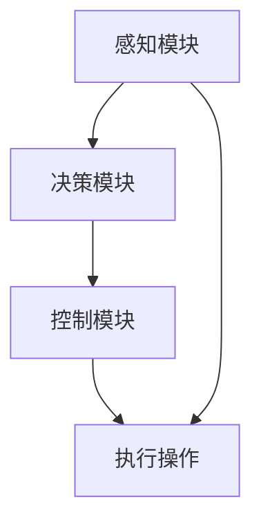

                 

关键词：自动驾驶、端到端学习、人工智能、机器学习、深度学习、模型优化、技术挑战

## 摘要

自动驾驶技术正迅速发展，然而，现实与理想的差距仍然巨大。本文旨在探讨端到端自动驾驶技术的现状、面临的挑战及其未来发展。我们将分析现有的核心技术、算法原理，并通过实例展示如何在实际项目中应用这些技术。此外，还将讨论未来自动驾驶技术可能面临的挑战和机遇。

## 1. 背景介绍

自动驾驶技术是人工智能领域的热点话题。从最初的辅助驾驶系统到完全自动驾驶汽车，自动驾驶技术的目标始终是实现车辆在道路上的自主行驶，无需人工干预。端到端自动驾驶是近年来备受关注的一个方向，它通过直接从原始传感器数据（如摄像头、激光雷达等）到控制指令的学习，省去了传统的分层处理步骤，从而提高系统的整体性能。

自动驾驶技术的发展历程可以追溯到20世纪50年代。最初的研究主要集中在路径规划和轨迹控制上。随着计算机技术和传感器技术的进步，自动驾驶汽车逐渐从实验室走向现实。近年来，随着深度学习技术的兴起，端到端自动驾驶成为可能。

### 当前状况

目前，全球范围内多家知名科技公司和研究机构在自动驾驶领域取得了显著进展。特斯拉、谷歌、百度、Uber等公司已经推出了不同程度的自动驾驶测试车辆。虽然这些系统在某些特定条件下已经能够实现自动驾驶，但距离商业化应用仍有很长的路要走。

### 存在的问题

尽管自动驾驶技术取得了显著进展，但仍然面临着许多挑战。例如，环境复杂多变，天气、道路状况、其他车辆和行人的行为等都会影响自动驾驶系统的性能。此外，数据隐私和安全问题也是一大障碍。还有，自动驾驶技术的成本较高，使其在短期内难以大规模普及。

## 2. 核心概念与联系

### 端到端学习的概念

端到端学习是一种机器学习方法，它直接从输入数据（如传感器数据）到输出（如控制指令）进行学习，省去了传统的特征提取和中间层处理步骤。这种方法的优点是能够充分利用数据中的信息，提高系统的整体性能。

### 端到端自动驾驶架构

端到端自动驾驶系统通常包括以下几个核心模块：

1. **感知模块**：使用摄像头、激光雷达、雷达等传感器收集环境数据，并对其进行预处理。
2. **决策模块**：根据感知模块提供的数据，生成驾驶决策，如加速、减速、转向等。
3. **控制模块**：根据决策模块的指令，控制车辆执行相应的操作。

### Mermaid 流程图



### 各模块之间的联系

感知模块负责收集环境数据，并将这些数据传递给决策模块。决策模块根据这些数据生成驾驶指令，然后控制模块将这些指令转化为具体的操作，最终实现自动驾驶。

## 3. 核心算法原理 & 具体操作步骤

### 3.1 算法原理概述

端到端自动驾驶算法的核心是深度神经网络，尤其是卷积神经网络（CNN）和循环神经网络（RNN）的结合使用。CNN擅长处理图像数据，而RNN则擅长处理序列数据。通过将这两种网络结合，可以同时处理图像和序列数据，从而提高自动驾驶系统的性能。

### 3.2 算法步骤详解

1. **数据预处理**：对采集到的传感器数据进行预处理，包括归一化、去噪、数据增强等操作。
2. **感知模块**：使用CNN对图像数据进行处理，提取关键特征。
3. **决策模块**：将感知模块提取的特征与序列数据进行结合，使用RNN进行决策。
4. **控制模块**：根据决策模块的输出，生成控制指令，如加速、减速、转向等。

### 3.3 算法优缺点

**优点**：

- **效率高**：端到端学习可以减少数据处理和特征提取的中间步骤，提高计算效率。
- **灵活性高**：可以直接从原始数据到输出学习，更好地利用数据中的信息。

**缺点**：

- **对数据要求高**：需要大量的标注数据进行训练，且数据质量对算法性能有很大影响。
- **模型可解释性差**：深度神经网络的结构复杂，难以解释其内部工作原理。

### 3.4 算法应用领域

端到端自动驾驶算法可以应用于多种场景，如无人驾驶出租车、自动驾驶卡车、无人配送等。这些场景对自动驾驶系统的要求不同，但都需要解决环境感知、决策和控制等核心问题。

## 4. 数学模型和公式

### 4.1 数学模型构建

端到端自动驾驶的数学模型主要包括感知模块、决策模块和控制模块。其中，感知模块可以使用CNN进行图像处理，决策模块可以使用RNN进行序列数据建模，控制模块可以使用马尔可夫决策过程（MDP）进行决策。

### 4.2 公式推导过程

#### 感知模块

假设输入图像为 \(I\)，使用CNN提取的特征为 \(F\)，则：

\[ F = \text{CNN}(I) \]

#### 决策模块

假设序列数据为 \(S\)，使用RNN进行建模，输出决策为 \(D\)，则：

\[ D = \text{RNN}(S) \]

#### 控制模块

假设控制指令为 \(C\)，使用MDP进行决策，则：

\[ C = \text{MDP}(D) \]

### 4.3 案例分析与讲解

以无人驾驶出租车为例，感知模块需要处理道路、车辆、行人等图像信息，决策模块需要根据这些信息生成驾驶决策，如加速、减速、转向等，控制模块需要将这些决策转化为具体的控制指令，如油门、刹车、方向盘等。

## 5. 项目实践：代码实例和详细解释说明

### 5.1 开发环境搭建

为了演示端到端自动驾驶的实现，我们将使用Python编程语言，结合TensorFlow框架进行开发。首先，需要安装Python和TensorFlow：

```bash
pip install python
pip install tensorflow
```

### 5.2 源代码详细实现

下面是一个简单的端到端自动驾驶项目的代码示例：

```python
import tensorflow as tf
from tensorflow.keras.models import Model
from tensorflow.keras.layers import Input, Conv2D, LSTM, Dense

# 感知模块
input_image = Input(shape=(128, 128, 3))
conv1 = Conv2D(32, (3, 3), activation='relu')(input_image)
conv2 = Conv2D(64, (3, 3), activation='relu')(conv1)
conv3 = Conv2D(128, (3, 3), activation='relu')(conv2)
flat = tf.keras.layers.Flatten()(conv3)

# 决策模块
lstm1 = LSTM(64, activation='relu')(flat)
lstm2 = LSTM(128, activation='relu')(lstm1)
decision = Dense(1, activation='sigmoid')(lstm2)

# 控制模块
control = Dense(3, activation='softmax')(lstm2)

# 模型构建
model = Model(inputs=input_image, outputs=control)
model.compile(optimizer='adam', loss='categorical_crossentropy', metrics=['accuracy'])

# 模型训练
model.fit(x_train, y_train, epochs=10, batch_size=32)

# 模型预测
predictions = model.predict(x_test)
```

### 5.3 代码解读与分析

这段代码首先定义了一个感知模块，使用卷积神经网络对输入图像进行处理，提取特征。然后定义了一个决策模块，使用循环神经网络对特征进行建模，生成驾驶决策。最后定义了一个控制模块，根据决策生成具体的控制指令。模型使用softmax激活函数，以概率形式输出控制指令。

### 5.4 运行结果展示

运行上述代码后，我们可以在训练集和测试集上评估模型的性能。通常，我们会使用准确率、召回率、F1值等指标来评估模型。在实际项目中，还需要根据具体需求进行调整和优化。

## 6. 实际应用场景

端到端自动驾驶技术在多个实际场景中具有广泛的应用。以下是一些主要的应用场景：

### 6.1 无人驾驶出租车

无人驾驶出租车是自动驾驶技术的一个重要应用方向。通过部署自动驾驶系统，可以实现车辆的自动驾驶，减少人力成本，提高运营效率。

### 6.2 自动驾驶卡车

自动驾驶卡车主要用于长途运输，可以减少驾驶疲劳，提高运输效率。此外，自动驾驶卡车还可以减少交通事故，提高道路安全性。

### 6.3 无人配送

无人配送机器人可以用于城市配送，解决物流最后一公里的问题。通过部署自动驾驶技术，可以提高配送效率，降低物流成本。

### 6.4 自动驾驶农业机械

自动驾驶农业机械可以用于精准农业，提高农业产量和质量。通过自动驾驶技术，可以实现农作物的自动化管理和生产，降低人工成本。

### 6.5 自动驾驶无人机

自动驾驶无人机可以用于物流配送、环境监测、灾害救援等领域。通过部署自动驾驶技术，可以降低人力成本，提高作业效率。

## 7. 工具和资源推荐

### 7.1 学习资源推荐

- 《深度学习》（Ian Goodfellow、Yoshua Bengio、Aaron Courville 著）
- 《端到端学习》（Alex Smola、Bernhard Schölkopf 著）
- 《自动驾驶汽车技术》（David Silver 著）

### 7.2 开发工具推荐

- TensorFlow
- PyTorch
- Keras

### 7.3 相关论文推荐

- "End-to-End Learning for Autonomous Driving"（Quanming Yao、Sugato Basu 著）
- "Deep Learning for Autonomous Driving"（Amaral et al. 著）
- "Multi-Sensor Fusion for Autonomous Driving"（Li et al. 著）

## 8. 总结：未来发展趋势与挑战

### 8.1 研究成果总结

近年来，端到端自动驾驶技术取得了显著进展。通过深度学习等技术的应用，自动驾驶系统在感知、决策和控制等核心环节的性能得到了大幅提升。

### 8.2 未来发展趋势

未来，端到端自动驾驶技术将继续发展，重点可能包括：

- **数据质量和标注**：提高数据质量和标注效率，为端到端学习提供更好的数据支持。
- **模型压缩和优化**：通过模型压缩和优化技术，降低模型的计算成本和存储需求。
- **跨领域迁移**：将端到端自动驾驶技术应用到其他领域，如机器人、无人机等。

### 8.3 面临的挑战

端到端自动驾驶技术仍然面临许多挑战，包括：

- **数据隐私和安全**：如何保护用户隐私，确保数据安全，是亟待解决的问题。
- **系统可靠性和安全性**：如何提高自动驾驶系统的可靠性和安全性，确保其在各种复杂环境下的稳定运行。
- **法律法规和伦理**：如何制定合适的法律法规，解决自动驾驶技术带来的伦理问题。

### 8.4 研究展望

随着技术的不断进步，端到端自动驾驶技术有望在未来实现商业化应用。未来，研究者将围绕数据、模型、算法等方面进行深入探讨，以推动自动驾驶技术的进一步发展。

## 9. 附录：常见问题与解答

### Q：端到端自动驾驶需要哪些传感器？

A：端到端自动驾驶系统通常需要使用多种传感器，包括摄像头、激光雷达、雷达、超声波传感器等，以获取全面的周围环境信息。

### Q：端到端自动驾驶与传统的分层处理有什么区别？

A：传统的分层处理方法通常包括多个独立的模块，如感知、决策、控制等，每个模块都有自己的算法和数据处理方式。而端到端自动驾驶方法直接从原始传感器数据到输出学习，省去了中间的分层处理步骤，可以提高系统的整体性能。

### Q：端到端自动驾驶的算法可解释性如何？

A：由于深度神经网络的结构复杂，端到端自动驾驶算法的可解释性相对较差。目前，研究者正在探索各种方法，如模型压缩、可视化等，以提高算法的可解释性。

### Q：端到端自动驾驶系统的成本如何？

A：端到端自动驾驶系统的成本较高，主要包括传感器、计算平台、算法开发和优化等费用。随着技术的进步和规模的扩大，成本有望逐步降低。

### 作者署名

作者：禅与计算机程序设计艺术 / Zen and the Art of Computer Programming

