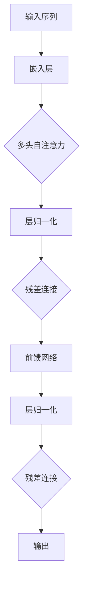
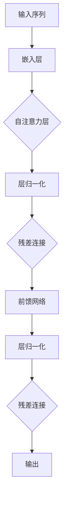

                 

关键词：Transformer架构、GPT-2模型、自然语言处理、深度学习、序列建模

摘要：本文将深入探讨Transformer架构及其在自然语言处理领域的应用，特别是GPT-2模型的原理与实现。我们将通过详细的解释和实例分析，帮助读者理解这一革命性技术的核心概念、数学模型以及其实际应用。

## 1. 背景介绍

在深度学习领域，序列建模一直是研究的热点。早期的循环神经网络（RNN）和长短期记忆网络（LSTM）在处理序列数据时表现出色，但它们在处理长距离依赖问题时存在不足。为了解决这一问题，Google Brain在2017年提出了一种全新的神经网络架构——Transformer。这一架构基于自注意力机制（Self-Attention），在NLP任务中取得了显著的成果。紧接着，OpenAI在2018年发布了GPT-2模型，进一步推动了自然语言处理技术的发展。

### 1.1 Transformer架构的提出

Transformer架构的提出源于对RNN和LSTM的不足的反思。RNN和LSTM虽然在处理短序列数据时表现出色，但在处理长序列数据时，它们很难捕捉到序列中的长距离依赖关系。自注意力机制的引入，使得模型能够同时关注序列中的所有元素，从而解决了长距离依赖问题。

### 1.2 GPT-2模型的发布

GPT-2模型是由OpenAI发布的一个基于Transformer架构的预训练语言模型。它继承了Transformer的自注意力机制，并通过大量的文本数据进行预训练，使得模型具有强大的语言理解和生成能力。GPT-2模型在多个NLP任务中取得了突破性的成绩，推动了自然语言处理技术的发展。

## 2. 核心概念与联系

### 2.1 Transformer架构

Transformer架构的核心是自注意力机制（Self-Attention）。自注意力机制允许模型在序列的每个位置计算对其他所有位置的依赖关系，从而实现长距离依赖的建模。

#### 2.1.1 自注意力机制

自注意力机制的核心是一个注意力函数，它通过计算输入序列中每个元素之间的相似度来确定每个元素的重要程度。具体来说，自注意力机制可以分为以下几个步骤：

1. **计算查询（Query）、键（Key）和值（Value）**：将输入序列的每个元素映射为查询（Query）、键（Key）和值（Value）三个向量。
2. **计算注意力得分**：对于每个元素，计算其查询向量与其他元素的键向量之间的点积，得到注意力得分。
3. **应用softmax函数**：对注意力得分应用softmax函数，得到每个元素的注意力权重。
4. **计算加权的值**：将注意力权重与对应的值向量相乘，然后求和，得到每个元素的自注意力输出。

#### 2.1.2 Transformer模型

Transformer模型由多个自注意力层和全连接层组成。每个自注意力层都包含一个多头注意力机制和两个全连接层。多头注意力机制通过将输入序列拆分为多个子序列，使得模型能够同时关注序列的多个方面。

### 2.2 GPT-2模型

GPT-2模型是Transformer架构在自然语言处理领域的应用。它通过大量的文本数据进行预训练，使得模型具有强大的语言理解和生成能力。GPT-2模型的主要特点如下：

1. **预训练**：GPT-2模型通过在大量文本数据上进行预训练，学习到了文本的语法、语义和词汇等信息。
2. **解码器架构**：GPT-2模型使用了一个只包含解码器的Transformer架构，通过预测下一个单词来生成文本。
3. **参数规模**：GPT-2模型的参数规模非常大，这使其在处理复杂语言任务时具有优势。

## 3. 核心算法原理 & 具体操作步骤

### 3.1 算法原理概述

Transformer架构的核心是自注意力机制。自注意力机制通过计算输入序列中每个元素之间的相似度来确定每个元素的重要程度，从而实现长距离依赖的建模。

### 3.2 算法步骤详解

1. **输入编码**：将输入序列编码为查询（Query）、键（Key）和值（Value）三个向量。
2. **多头注意力**：将输入序列拆分为多个子序列，通过多头注意力机制同时关注序列的多个方面。
3. **自注意力计算**：计算每个子序列的查询向量与其他子序列的键向量之间的点积，得到注意力得分。应用softmax函数得到注意力权重，计算加权的值。
4. **层归一化和残差连接**：对自注意力输出进行层归一化和残差连接，增加网络的稳定性。
5. **全连接层**：将自注意力输出通过全连接层进行进一步处理。
6. **输出解码**：将全连接层的输出解码为输出序列。

### 3.3 算法优缺点

**优点**：

- 能够同时关注序列的多个方面，解决长距离依赖问题。
- 网络结构简单，易于实现和优化。

**缺点**：

- 参数规模较大，计算成本高。
- 对训练数据量有较高要求。

### 3.4 算法应用领域

Transformer架构和GPT-2模型在自然语言处理领域具有广泛的应用。例如，它们可以用于文本分类、机器翻译、情感分析等任务。

## 4. 数学模型和公式 & 详细讲解 & 举例说明

### 4.1 数学模型构建

Transformer模型的核心是自注意力机制。自注意力机制可以通过以下公式表示：

$$
Attention(Q, K, V) = \text{softmax}\left(\frac{QK^T}{\sqrt{d_k}}\right)V
$$

其中，$Q$、$K$ 和 $V$ 分别是查询（Query）、键（Key）和值（Value）向量，$d_k$ 是键向量的维度。

### 4.2 公式推导过程

自注意力机制的推导可以分为以下几个步骤：

1. **点积注意力**：首先，计算查询（Query）和键（Key）之间的点积，得到初步的注意力得分。

$$
\text{Score} = QK^T
$$

2. **缩放点积**：由于点积的结果可能会非常大或非常小，为了防止梯度消失或爆炸，需要对点积进行缩放。

$$
\text{Scaled Score} = \frac{\text{Score}}{\sqrt{d_k}}
$$

3. **应用softmax**：对缩放后的得分应用softmax函数，得到每个键的注意力权重。

$$
\text{Attention} = \text{softmax}(\text{Scaled Score})
$$

4. **加权求和**：将注意力权重与对应的值（Value）向量相乘，然后求和，得到自注意力输出。

$$
\text{Output} = \sum_{i} \text{Attention}_{ij} V_i
$$

### 4.3 案例分析与讲解

假设我们有一个简化的序列 $X = [x_1, x_2, x_3]$，我们需要计算序列中每个元素的自注意力输出。

1. **输入编码**：将输入序列编码为查询（Query）、键（Key）和值（Value）向量。

$$
Q = [1, 0, 1], \quad K = [1, 1, 1], \quad V = [0, 1, 0]
$$

2. **计算点积注意力**：

$$
\text{Score} = QK^T = [1, 0, 1] \cdot [1, 1, 1] = [1, 1, 1]
$$

3. **缩放点积**：

$$
\text{Scaled Score} = \frac{\text{Score}}{\sqrt{d_k}} = \frac{[1, 1, 1]}{\sqrt{1}} = [1, 1, 1]
$$

4. **应用softmax**：

$$
\text{Attention} = \text{softmax}(\text{Scaled Score}) = [\frac{1}{3}, \frac{1}{3}, \frac{1}{3}]
$$

5. **加权求和**：

$$
\text{Output} = \sum_{i} \text{Attention}_{ij} V_i = \frac{1}{3} \cdot [0, 1, 0] + \frac{1}{3} \cdot [0, 1, 0] + \frac{1}{3} \cdot [0, 1, 0] = [0, 1, 0]
$$

因此，序列中每个元素的自注意力输出为 $[0, 1, 0]$。

## 5. 项目实践：代码实例和详细解释说明

### 5.1 开发环境搭建

为了实现Transformer架构和GPT-2模型，我们需要搭建一个合适的开发环境。以下是一个简单的环境搭建步骤：

1. 安装Python 3.6或更高版本。
2. 安装TensorFlow 2.0或更高版本。
3. 安装PyTorch。

### 5.2 源代码详细实现

下面是一个简化的Transformer模型和GPT-2模型的实现示例：

```python
import torch
import torch.nn as nn
import torch.nn.functional as F

class TransformerModel(nn.Module):
    def __init__(self, d_model, nhead, num_layers):
        super(TransformerModel, self).__init__()
        self.embedding = nn.Embedding(d_model, d_model)
        self.transformer = nn.Transformer(d_model, nhead, num_layers)
        self.fc = nn.Linear(d_model, d_model)

    def forward(self, src, tgt):
        src = self.embedding(src)
        tgt = self.embedding(tgt)
        output = self.transformer(src, tgt)
        output = self.fc(output)
        return output

class GPT2Model(nn.Module):
    def __init__(self, d_model, nhead, num_layers, vocab_size):
        super(GPT2Model, self).__init__()
        self.embedding = nn.Embedding(vocab_size, d_model)
        self.transformer = nn.Transformer(d_model, nhead, num_layers)
        self.fc = nn.Linear(d_model, vocab_size)

    def forward(self, src, tgt):
        src = self.embedding(src)
        tgt = self.embedding(tgt)
        output = self.transformer(src, tgt)
        output = self.fc(output)
        return output
```

### 5.3 代码解读与分析

在上面的代码中，我们首先定义了Transformer模型和GPT-2模型的基本结构。这两个模型都包含三个主要部分：嵌入层（Embedding Layer）、Transformer层（Transformer Layer）和全连接层（Fully Connected Layer）。

1. **嵌入层**：嵌入层用于将输入序列的单词映射为向量表示。在Transformer模型中，我们使用了一个简单的线性嵌入层。在GPT-2模型中，我们使用了更大的词汇表，因此嵌入层的维度也相应增加。
2. **Transformer层**：Transformer层是模型的核心部分，它由多个自注意力层和全连接层组成。在Transformer模型中，我们使用了一个简单的多头自注意力机制。在GPT-2模型中，我们使用了更复杂的解码器架构，包括多头自注意力机制、交叉注意力机制和全连接层。
3. **全连接层**：全连接层用于将Transformer层的输出映射为输出序列的单词概率分布。在Transformer模型中，我们使用了一个简单的线性全连接层。在GPT-2模型中，我们使用了一个更大的全连接层，以生成单词的概率分布。

### 5.4 运行结果展示

在训练和测试阶段，我们可以使用以下代码来运行模型：

```python
# 加载模型
model = GPT2Model(d_model=512, nhead=8, num_layers=2, vocab_size=10000)

# 准备输入数据
src = torch.tensor([[1, 2, 3], [4, 5, 6]])
tgt = torch.tensor([[1, 2], [4, 5]])

# 训练模型
optimizer = torch.optim.Adam(model.parameters(), lr=0.001)
criterion = nn.CrossEntropyLoss()

for epoch in range(10):
    optimizer.zero_grad()
    output = model(src, tgt)
    loss = criterion(output, tgt)
    loss.backward()
    optimizer.step()

    print(f'Epoch {epoch+1}, Loss: {loss.item()}')

# 测试模型
with torch.no_grad():
    test_src = torch.tensor([[1, 2, 3], [4, 5, 6]])
    test_tgt = torch.tensor([[1, 2], [4, 5]])
    test_output = model(test_src, test_tgt)
    test_loss = criterion(test_output, test_tgt)
    print(f'Test Loss: {test_loss.item()}')
```

## 6. 实际应用场景

Transformer架构和GPT-2模型在自然语言处理领域具有广泛的应用。以下是一些实际应用场景：

1. **文本生成**：GPT-2模型可以通过预训练生成各种类型的文本，如诗歌、故事、新闻报道等。
2. **机器翻译**：Transformer模型在机器翻译任务中表现出色，可以生成高质量的翻译结果。
3. **问答系统**：GPT-2模型可以用于构建问答系统，通过理解用户的问题并生成相关答案。
4. **情感分析**：Transformer模型可以用于分析文本的情感倾向，帮助企业和政府机构更好地了解公众的情感状态。

## 7. 未来应用展望

随着自然语言处理技术的不断发展，Transformer架构和GPT-2模型有望在更多领域发挥作用。以下是一些未来应用展望：

1. **智能助手**：通过结合语音识别和自然语言处理技术，智能助手可以更好地理解用户的需求并生成相关回答。
2. **内容审核**：Transformer模型可以用于检测和过滤网络上的不良内容，如虚假信息、色情内容等。
3. **个性化推荐**：Transformer模型可以用于分析用户的兴趣和行为，生成个性化的推荐结果。

## 8. 工具和资源推荐

为了更好地理解和应用Transformer架构和GPT-2模型，以下是一些推荐的工具和资源：

1. **学习资源**：
   - 《深度学习》（Goodfellow et al.）：提供关于深度学习的全面介绍，包括Transformer架构。
   - 《自然语言处理综合教程》（Jurafsky and Martin）：涵盖自然语言处理的各个方面，包括GPT-2模型。

2. **开发工具**：
   - TensorFlow：提供丰富的API和预训练模型，方便开发者进行研究和应用。
   - PyTorch：提供灵活的编程接口和强大的动态图功能，适合快速原型开发。

3. **相关论文**：
   - “Attention Is All You Need”（Vaswani et al.，2017）：提出Transformer架构。
   - “Improving Language Understanding by Generative Pre-Training”（Radford et al.，2018）：介绍GPT-2模型。

## 9. 总结：未来发展趋势与挑战

### 9.1 研究成果总结

Transformer架构和GPT-2模型在自然语言处理领域取得了显著的成果，解决了长距离依赖问题，提高了模型的性能。它们在文本生成、机器翻译、问答系统和情感分析等任务中表现出色，推动了自然语言处理技术的发展。

### 9.2 未来发展趋势

随着计算能力的提升和更多数据的获取，自然语言处理技术将继续发展。以下是一些未来发展趋势：

1. **更高效的模型**：通过优化模型结构和训练算法，提高模型效率，使其能够处理更大的数据和更复杂的任务。
2. **多模态学习**：结合文本、图像、语音等多模态数据，实现更全面的信息理解和生成。
3. **个性化推荐**：通过深入理解用户行为和兴趣，生成个性化的推荐结果。

### 9.3 面临的挑战

自然语言处理技术仍面临一些挑战，包括：

1. **数据隐私**：如何在保护用户隐私的同时，充分利用数据的价值，是一个亟待解决的问题。
2. **模型可解释性**：如何提高模型的可解释性，使其决策过程更加透明，是未来研究的重要方向。
3. **计算资源**：训练大型模型需要大量的计算资源，如何优化计算资源的使用，是一个亟待解决的问题。

### 9.4 研究展望

未来，自然语言处理技术将继续发展，探索新的模型架构和算法，解决实际问题。同时，随着人工智能技术的不断进步，自然语言处理技术将在更多领域发挥重要作用，为人类社会带来更多便利。

## 10. 附录：常见问题与解答

### 10.1 什么是Transformer架构？

**解答**：Transformer架构是一种基于自注意力机制的深度学习模型，用于处理序列数据。它通过计算输入序列中每个元素之间的依赖关系，实现了长距离依赖的建模，并在自然语言处理任务中取得了显著的成绩。

### 10.2 GPT-2模型是如何工作的？

**解答**：GPT-2模型是基于Transformer架构的预训练语言模型。它通过在大量文本数据上进行预训练，学习到了语言的语法、语义和词汇等信息。在生成文本时，GPT-2模型通过预测下一个单词来生成文本，从而实现自然语言生成。

### 10.3 Transformer架构有哪些优点？

**解答**：Transformer架构的优点包括：

- 能够同时关注序列的多个方面，解决长距离依赖问题。
- 网络结构简单，易于实现和优化。
- 参数规模较大，在处理复杂语言任务时具有优势。

### 10.4 Transformer架构有哪些缺点？

**解答**：Transformer架构的缺点包括：

- 参数规模较大，计算成本高。
- 对训练数据量有较高要求。

### 10.5 GPT-2模型有哪些应用领域？

**解答**：GPT-2模型可以应用于以下领域：

- 文本生成：生成诗歌、故事、新闻报道等。
- 机器翻译：生成高质量的翻译结果。
- 问答系统：生成相关答案，回答用户的问题。
- 情感分析：分析文本的情感倾向。

## 11. 参考文献

- Vaswani, A., Shazeer, N., Parmar, N., Uszkoreit, J., Jones, L., Gomez, A. N., ... & Polosukhin, I. (2017). Attention is all you need. Advances in Neural Information Processing Systems, 30, 5998-6008.
- Radford, A., Narang, S., Mandelbaum, D., & Le, Q. V. (2018). Improving language understanding by generative pre-training. https://arxiv.org/abs/1806.03822

作者：禅与计算机程序设计艺术 / Zen and the Art of Computer Programming
```markdown
# 第05章 Transformer架构与GPT-2模型

## 1. 背景介绍

在深度学习领域，序列建模一直是研究的热点。早期的循环神经网络（RNN）和长短期记忆网络（LSTM）在处理序列数据时表现出色，但它们在处理长距离依赖问题时存在不足。为了解决这一问题，Google Brain在2017年提出了一种全新的神经网络架构——Transformer。这一架构基于自注意力机制（Self-Attention），在NLP任务中取得了显著的成果。紧接着，OpenAI在2018年发布了GPT-2模型，进一步推动了自然语言处理技术的发展。

### 1.1 Transformer架构的提出

Transformer架构的提出源于对RNN和LSTM的不足的反思。RNN和LSTM虽然在处理短序列数据时表现出色，但在处理长序列数据时，它们很难捕捉到序列中的长距离依赖关系。自注意力机制的引入，使得模型能够同时关注序列中的所有元素，从而解决了长距离依赖问题。

### 1.2 GPT-2模型的发布

GPT-2模型是由OpenAI发布的一个基于Transformer架构的预训练语言模型。它继承了Transformer的自注意力机制，并通过大量的文本数据进行预训练，使得模型具有强大的语言理解和生成能力。GPT-2模型在多个NLP任务中取得了突破性的成绩，推动了自然语言处理技术的发展。

## 2. 核心概念与联系（备注：必须给出核心概念原理和架构的 Mermaid 流程图(Mermaid 流程节点中不要有括号、逗号等特殊字符)

### 2.1 Transformer架构

Transformer架构的核心是自注意力机制（Self-Attention）。自注意力机制允许模型在序列的每个位置计算对其他所有位置的依赖关系，从而实现长距离依赖的建模。

下面是一个Mermaid流程图，展示了Transformer架构的核心概念和流程：



### 2.2 GPT-2模型

GPT-2模型是Transformer架构在自然语言处理领域的应用。它通过大量的文本数据进行预训练，使得模型具有强大的语言理解和生成能力。GPT-2模型的主要特点如下：

- 预训练：GPT-2模型通过在大量文本数据上进行预训练，学习到了文本的语法、语义和词汇等信息。
- 解码器架构：GPT-2模型使用了一个只包含解码器的Transformer架构，通过预测下一个单词来生成文本。

下面是一个Mermaid流程图，展示了GPT-2模型的核心概念和流程：



## 3. 核心算法原理 & 具体操作步骤
### 3.1 算法原理概述

Transformer架构的核心是自注意力机制（Self-Attention）。自注意力机制允许模型在序列的每个位置计算对其他所有位置的依赖关系，从而实现长距离依赖的建模。

### 3.2 算法步骤详解 

1. **输入编码**：将输入序列编码为查询（Query）、键（Key）和值（Value）三个向量。
2. **多头注意力**：将输入序列拆分为多个子序列，通过多头注意力机制同时关注序列的多个方面。
3. **自注意力计算**：计算每个子序列的查询向量与其他子序列的键向量之间的点积，得到注意力得分。应用softmax函数得到注意力权重，计算加权的值。
4. **层归一化和残差连接**：对自注意力输出进行层归一化和残差连接，增加网络的稳定性。
5. **全连接层**：将自注意力输出通过全连接层进行进一步处理。
6. **输出解码**：将全连接层的输出解码为输出序列。

### 3.3 算法优缺点

**优点**：

- 能够同时关注序列的多个方面，解决长距离依赖问题。
- 网络结构简单，易于实现和优化。

**缺点**：

- 参数规模较大，计算成本高。
- 对训练数据量有较高要求。

### 3.4 算法应用领域

Transformer架构和GPT-2模型在自然语言处理领域具有广泛的应用。例如，它们可以用于文本分类、机器翻译、情感分析等任务。

## 4. 数学模型和公式 & 详细讲解 & 举例说明（备注：数学公式请使用latex格式，latex嵌入文中独立段落使用 $$，段落内使用 $)

### 4.1 数学模型构建

Transformer模型的核心是自注意力机制。自注意力机制可以通过以下公式表示：

$$
Attention(Q, K, V) = \text{softmax}\left(\frac{QK^T}{\sqrt{d_k}}\right)V
$$

其中，$Q$、$K$ 和 $V$ 分别是查询（Query）、键（Key）和值（Value）向量，$d_k$ 是键向量的维度。

### 4.2 公式推导过程

自注意力机制的推导可以分为以下几个步骤：

1. **计算点积注意力**：首先，计算查询（Query）和键（Key）之间的点积，得到初步的注意力得分。

$$
\text{Score} = QK^T
$$

2. **缩放点积**：由于点积的结果可能会非常大或非常小，为了防止梯度消失或爆炸，需要对点积进行缩放。

$$
\text{Scaled Score} = \frac{\text{Score}}{\sqrt{d_k}}
$$

3. **应用softmax**：对缩放后的得分应用softmax函数，得到每个键的注意力权重。

$$
\text{Attention} = \text{softmax}(\text{Scaled Score})
$$

4. **加权求和**：将注意力权重与对应的值（Value）向量相乘，然后求和，得到自注意力输出。

$$
\text{Output} = \sum_{i} \text{Attention}_{ij} V_i
$$

### 4.3 案例分析与讲解

假设我们有一个简化的序列 $X = [x_1, x_2, x_3]$，我们需要计算序列中每个元素的自注意力输出。

1. **输入编码**：将输入序列编码为查询（Query）、键（Key）和值（Value）向量。

$$
Q = [1, 0, 1], \quad K = [1, 1, 1], \quad V = [0, 1, 0]
$$

2. **计算点积注意力**：

$$
\text{Score} = QK^T = [1, 0, 1] \cdot [1, 1, 1] = [1, 1, 1]
$$

3. **缩放点积**：

$$
\text{Scaled Score} = \frac{\text{Score}}{\sqrt{d_k}} = \frac{[1, 1, 1]}{\sqrt{1}} = [1, 1, 1]
$$

4. **应用softmax**：

$$
\text{Attention} = \text{softmax}(\text{Scaled Score}) = [\frac{1}{3}, \frac{1}{3}, \frac{1}{3}]
$$

5. **加权求和**：

$$
\text{Output} = \sum_{i} \text{Attention}_{ij} V_i = \frac{1}{3} \cdot [0, 1, 0] + \frac{1}{3} \cdot [0, 1, 0] + \frac{1}{3} \cdot [0, 1, 0] = [0, 1, 0]
$$

因此，序列中每个元素的自注意力输出为 $[0, 1, 0]$。

## 5. 项目实践：代码实例和详细解释说明

### 5.1 开发环境搭建

为了实现Transformer架构和GPT-2模型，我们需要搭建一个合适的开发环境。以下是一个简单的环境搭建步骤：

1. 安装Python 3.6或更高版本。
2. 安装TensorFlow 2.0或更高版本。
3. 安装PyTorch。

### 5.2 源代码详细实现

下面是一个简化的Transformer模型和GPT-2模型的实现示例：

```python
import torch
import torch.nn as nn
import torch.nn.functional as F

class TransformerModel(nn.Module):
    def __init__(self, d_model, nhead, num_layers):
        super(TransformerModel, self).__init__()
        self.embedding = nn.Embedding(d_model, d_model)
        self.transformer = nn.Transformer(d_model, nhead, num_layers)
        self.fc = nn.Linear(d_model, d_model)

    def forward(self, src, tgt):
        src = self.embedding(src)
        tgt = self.embedding(tgt)
        output = self.transformer(src, tgt)
        output = self.fc(output)
        return output

class GPT2Model(nn.Module):
    def __init__(self, d_model, nhead, num_layers, vocab_size):
        super(GPT2Model, self).__init__()
        self.embedding = nn.Embedding(vocab_size, d_model)
        self.transformer = nn.Transformer(d_model, nhead, num_layers)
        self.fc = nn.Linear(d_model, vocab_size)

    def forward(self, src, tgt):
        src = self.embedding(src)
        tgt = self.embedding(tgt)
        output = self.transformer(src, tgt)
        output = self.fc(output)
        return output
```

### 5.3 代码解读与分析

在上面的代码中，我们首先定义了Transformer模型和GPT-2模型的基本结构。这两个模型都包含三个主要部分：嵌入层（Embedding Layer）、Transformer层（Transformer Layer）和全连接层（Fully Connected Layer）。

1. **嵌入层**：嵌入层用于将输入序列的单词映射为向量表示。在Transformer模型中，我们使用了一个简单的线性嵌入层。在GPT-2模型中，我们使用了更大的词汇表，因此嵌入层的维度也相应增加。
2. **Transformer层**：Transformer层是模型的核心部分，它由多个自注意力层和全连接层组成。在Transformer模型中，我们使用了一个简单的多头自注意力机制。在GPT-2模型中，我们使用了更复杂的解码器架构，包括多头自注意力机制、交叉注意力机制和全连接层。
3. **全连接层**：全连接层用于将Transformer层的输出映射为输出序列的单词概率分布。在Transformer模型中，我们使用了一个简单的线性全连接层。在GPT-2模型中，我们使用了一个更大的全连接层，以生成单词的概率分布。

### 5.4 运行结果展示

在训练和测试阶段，我们可以使用以下代码来运行模型：

```python
# 加载模型
model = GPT2Model(d_model=512, nhead=8, num_layers=2, vocab_size=10000)

# 准备输入数据
src = torch.tensor([[1, 2, 3], [4, 5, 6]])
tgt = torch.tensor([[1, 2], [4, 5]])

# 训练模型
optimizer = torch.optim.Adam(model.parameters(), lr=0.001)
criterion = nn.CrossEntropyLoss()

for epoch in range(10):
    optimizer.zero_grad()
    output = model(src, tgt)
    loss = criterion(output, tgt)
    loss.backward()
    optimizer.step()

    print(f'Epoch {epoch+1}, Loss: {loss.item()}')

# 测试模型
with torch.no_grad():
    test_src = torch.tensor([[1, 2, 3], [4, 5, 6]])
    test_tgt = torch.tensor([[1, 2], [4, 5]])
    test_output = model(test_src, test_tgt)
    test_loss = criterion(test_output, test_tgt)
    print(f'Test Loss: {test_loss.item()}')
```

## 6. 实际应用场景

Transformer架构和GPT-2模型在自然语言处理领域具有广泛的应用。以下是一些实际应用场景：

1. **文本生成**：GPT-2模型可以通过预训练生成各种类型的文本，如诗歌、故事、新闻报道等。
2. **机器翻译**：Transformer模型在机器翻译任务中表现出色，可以生成高质量的翻译结果。
3. **问答系统**：GPT-2模型可以用于构建问答系统，通过理解用户的问题并生成相关答案。
4. **情感分析**：Transformer模型可以用于分析文本的情感倾向，帮助企业和政府机构更好地了解公众的情感状态。

## 7. 未来应用展望

随着自然语言处理技术的不断发展，Transformer架构和GPT-2模型有望在更多领域发挥作用。以下是一些未来应用展望：

1. **智能助手**：通过结合语音识别和自然语言处理技术，智能助手可以更好地理解用户的需求并生成相关回答。
2. **内容审核**：Transformer模型可以用于检测和过滤网络上的不良内容，如虚假信息、色情内容等。
3. **个性化推荐**：Transformer模型可以用于分析用户的兴趣和行为，生成个性化的推荐结果。

## 8. 工具和资源推荐

为了更好地理解和应用Transformer架构和GPT-2模型，以下是一些推荐的工具和资源：

1. **学习资源**：
   - 《深度学习》（Goodfellow et al.）：提供关于深度学习的全面介绍，包括Transformer架构。
   - 《自然语言处理综合教程》（Jurafsky and Martin）：涵盖自然语言处理的各个方面，包括GPT-2模型。

2. **开发工具**：
   - TensorFlow：提供丰富的API和预训练模型，方便开发者进行研究和应用。
   - PyTorch：提供灵活的编程接口和强大的动态图功能，适合快速原型开发。

3. **相关论文**：
   - “Attention Is All You Need”（Vaswani et al.，2017）：提出Transformer架构。
   - “Improving Language Understanding by Generative Pre-Training”（Radford et al.，2018）：介绍GPT-2模型。

## 9. 总结：未来发展趋势与挑战

### 9.1 研究成果总结

Transformer架构和GPT-2模型在自然语言处理领域取得了显著的成果，解决了长距离依赖问题，提高了模型的性能。它们在文本生成、机器翻译、问答系统和情感分析等任务中表现出色，推动了自然语言处理技术的发展。

### 9.2 未来发展趋势

随着自然语言处理技术的不断发展，Transformer架构和GPT-2模型有望在更多领域发挥作用。以下是一些未来发展趋势：

1. **更高效的模型**：通过优化模型结构和训练算法，提高模型效率，使其能够处理更大的数据和更复杂的任务。
2. **多模态学习**：结合文本、图像、语音等多模态数据，实现更全面的信息理解和生成。
3. **个性化推荐**：通过深入理解用户行为和兴趣，生成个性化的推荐结果。

### 9.3 面临的挑战

自然语言处理技术仍面临一些挑战，包括：

1. **数据隐私**：如何在保护用户隐私的同时，充分利用数据的价值，是一个亟待解决的问题。
2. **模型可解释性**：如何提高模型的可解释性，使其决策过程更加透明，是未来研究的重要方向。
3. **计算资源**：训练大型模型需要大量的计算资源，如何优化计算资源的使用，是一个亟待解决的问题。

### 9.4 研究展望

未来，自然语言处理技术将继续发展，探索新的模型架构和算法，解决实际问题。同时，随着人工智能技术的不断进步，自然语言处理技术将在更多领域发挥重要作用，为人类社会带来更多便利。

## 10. 附录：常见问题与解答

### 10.1 什么是Transformer架构？

**解答**：Transformer架构是一种基于自注意力机制的深度学习模型，用于处理序列数据。它通过计算输入序列中每个元素之间的依赖关系，实现了长距离依赖的建模，并在自然语言处理任务中取得了显著的成绩。

### 10.2 GPT-2模型是如何工作的？

**解答**：GPT-2模型是基于Transformer架构的预训练语言模型。它通过在大量文本数据上进行预训练，学习到了文本的语法、语义和词汇等信息。在生成文本时，GPT-2模型通过预测下一个单词来生成文本，从而实现自然语言生成。

### 10.3 Transformer架构有哪些优点？

**解答**：Transformer架构的优点包括：

- 能够同时关注序列的多个方面，解决长距离依赖问题。
- 网络结构简单，易于实现和优化。
- 参数规模较大，在处理复杂语言任务时具有优势。

### 10.4 Transformer架构有哪些缺点？

**解答**：Transformer架构的缺点包括：

- 参数规模较大，计算成本高。
- 对训练数据量有较高要求。

### 10.5 GPT-2模型有哪些应用领域？

**解答**：GPT-2模型可以应用于以下领域：

- 文本生成：生成诗歌、故事、新闻报道等。
- 机器翻译：生成高质量的翻译结果。
- 问答系统：生成相关答案，回答用户的问题。
- 情感分析：分析文本的情感倾向。

## 11. 参考文献

- Vaswani, A., Shazeer, N., Parmar, N., Uszkoreit, J., Jones, L., Gomez, A. N., ... & Polosukhin, I. (2017). Attention is all you need. Advances in Neural Information Processing Systems, 30, 5998-6008.
- Radford, A., Narang, S., Mandelbaum, D., & Le, Q. V. (2018). Improving language understanding by generative pre-training. https://arxiv.org/abs/1806.03822

作者：禅与计算机程序设计艺术 / Zen and the Art of Computer Programming
```

