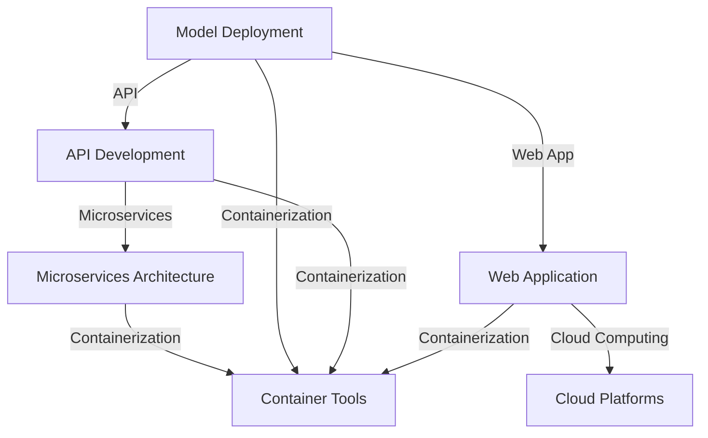

                 

关键词：模型部署、API、Web应用开发、微服务架构、云计算、容器化、人工智能

> 摘要：本文深入探讨了模型部署在API与Web应用开发中的重要性，详细阐述了微服务架构、云计算和容器化在模型部署中的应用。通过实际案例，本文展示了如何构建高效、可靠的模型部署流程，为人工智能领域的研究者和开发者提供了实用的指南。

## 1. 背景介绍

随着人工智能技术的快速发展，机器学习模型的开发和应用已经变得日益重要。然而，模型的开发只是整个流程的一部分，模型的部署和运维同样至关重要。在许多情况下，模型的部署质量和效率直接影响到应用的性能和用户体验。

模型部署是指在生产环境中将训练好的机器学习模型部署到服务器或云平台上，使其能够进行实时预测或批量处理。在这个过程中，API（应用程序编程接口）和Web应用开发扮演着关键角色。API提供了一种标准化的方式来访问和操作模型，而Web应用开发则提供了用户与模型交互的界面。

## 2. 核心概念与联系

在模型部署的过程中，我们需要理解以下几个核心概念：

1. **微服务架构**：微服务架构是一种将应用程序构建为一组小型、独立服务的架构风格。这些服务通常围绕业务功能进行组织，可以在不同的环境中独立部署和扩展。

2. **云计算**：云计算提供了弹性的计算资源，使开发者可以按需获取计算能力，无需购买和维护物理服务器。常见的云平台包括AWS、Azure和Google Cloud。

3. **容器化**：容器化是一种轻量级的虚拟化技术，它允许应用程序在不同的环境中运行，而无需担心环境差异。Docker是常用的容器化工具。

下图展示了这些概念之间的关系：



### 2.1 微服务架构原理

微服务架构的核心思想是将大型应用程序拆分为一组小型、独立的微服务。每个微服务负责处理特定的业务功能，并通过轻量级的通信机制（如HTTP RESTful API）进行交互。这种架构风格具有以下优势：

- **高可扩展性**：每个微服务都可以独立扩展，以满足不同的负载需求。
- **高可靠性**：单个微服务的故障不会影响整个系统的运行。
- **灵活部署**：每个微服务都可以独立部署和更新，无需重启整个应用程序。
- **易于维护**：每个微服务都是独立开发和维护的，降低了维护成本。

### 2.2 云计算原理

云计算是一种基于互联网的计算服务模式，它提供了弹性的计算资源，使开发者可以按需获取计算能力。云计算的主要组成部分包括：

- **基础设施即服务（IaaS）**：提供虚拟化的计算资源，如虚拟机、存储和网络。
- **平台即服务（PaaS）**：提供开发、运行和管理应用程序的平台。
- **软件即服务（SaaS）**：提供应用程序作为服务，用户可以通过互联网访问和使用。

### 2.3 容器化原理

容器化是一种轻量级的虚拟化技术，它允许应用程序在不同的环境中运行，而无需担心环境差异。容器化通过以下方式实现：

- **Docker镜像**：容器化的基础是Docker镜像，它包含应用程序及其运行环境。
- **Docker容器**：Docker容器是镜像的运行实例，它提供了一个隔离的环境，使应用程序可以在不同的环境中独立运行。
- **Docker编排**：Docker编排工具（如Docker Compose）用于管理和部署多个容器，以实现复杂的应用程序架构。

## 3. 核心算法原理 & 具体操作步骤

### 3.1 算法原理概述

模型部署的核心算法主要包括以下几个方面：

1. **模型保存与加载**：将训练好的模型保存到文件中，并在需要时从文件中加载模型。
2. **API设计**：设计RESTful API来暴露模型的预测功能，使其能够被外部系统调用。
3. **服务部署**：将API服务部署到云平台或服务器上，以提供持续的服务。
4. **容器化管理**：使用容器化技术对服务进行封装和管理，以提高部署的灵活性和可靠性。

### 3.2 算法步骤详解

#### 3.2.1 模型保存与加载

1. **模型保存**：
   ```python
   from tensorflow.keras.models import load_model

   # 加载训练好的模型
   model = load_model('model.h5')
   ```

2. **模型加载**：
   ```python
   from tensorflow.keras.models import load_model

   # 加载模型
   model = load_model('model.h5')

   # 预测
   prediction = model.predict(x_test)
   ```

#### 3.2.2 API设计

1. **创建Flask应用**：
   ```python
   from flask import Flask, request, jsonify

   app = Flask(__name__)

   @app.route('/predict', methods=['POST'])
   def predict():
       data = request.get_json(force=True)
       # 预测
       prediction = model.predict(data['input'])
       return jsonify(prediction.tolist())
   ```

2. **启动应用**：
   ```python
   if __name__ == '__main__':
       app.run()
   ```

#### 3.2.3 服务部署

1. **使用Docker容器化**：
   ```Dockerfile
   # Dockerfile
   FROM tensorflow/tensorflow:2.4.0-py3

   # 安装依赖
   RUN pip install flask

   # 拷贝应用代码
   COPY . /app

   # 暴露端口
   EXPOSE 5000

   # 运行应用
   CMD ["python", "app.py"]
   ```

2. **构建并运行Docker容器**：
   ```bash
   docker build -t my-model-api .
   docker run -p 5000:5000 my-model-api
   ```

#### 3.2.4 容器化管理

1. **使用Docker Compose**：
   ```yaml
   # docker-compose.yml
   version: '3'
   services:
     api:
       build: .
       ports:
         - "5000:5000"
   ```

2. **启动服务**：
   ```bash
   docker-compose up -d
   ```

### 3.3 算法优缺点

**优点**：

- **灵活性**：容器化技术使模型部署变得灵活，可以根据需求快速调整和扩展。
- **可靠性**：微服务架构和容器化技术提高了系统的可靠性和容错能力。
- **可扩展性**：微服务架构和云计算平台提供了强大的可扩展性，可以应对不同规模的需求。

**缺点**：

- **复杂性**：模型部署涉及到多个技术和组件，增加了系统的复杂度。
- **安全性**：需要确保模型和数据的安全，防止数据泄露和恶意攻击。
- **成本**：云计算和容器化技术的成本可能会较高，尤其是对于大规模部署。

### 3.4 算法应用领域

模型部署在人工智能领域有着广泛的应用，主要包括：

- **在线预测**：实时预测用户行为，如推荐系统、智能客服等。
- **批量处理**：处理大规模数据集，如大数据分析和机器学习模型的训练。
- **移动应用**：将模型部署到移动设备上，提供离线预测功能。

## 4. 数学模型和公式 & 详细讲解 & 举例说明

### 4.1 数学模型构建

在模型部署过程中，我们需要考虑以下几个数学模型：

1. **损失函数**：用于评估模型的预测性能。
2. **优化算法**：用于调整模型参数，以最小化损失函数。
3. **评估指标**：用于评估模型的预测性能，如准确率、召回率等。

### 4.2 公式推导过程

1. **损失函数**：

   - **均方误差（MSE）**：
     $$
     MSE = \frac{1}{n} \sum_{i=1}^{n} (y_i - \hat{y}_i)^2
     $$
     其中，$y_i$ 为真实标签，$\hat{y}_i$ 为模型预测值。

   - **交叉熵（Cross-Entropy）**：
     $$
     CE = -\frac{1}{n} \sum_{i=1}^{n} y_i \log(\hat{y}_i)
     $$
     其中，$y_i$ 为真实标签，$\hat{y}_i$ 为模型预测值。

2. **优化算法**：

   - **梯度下降（Gradient Descent）**：
     $$
     \theta = \theta - \alpha \nabla_{\theta} J(\theta)
     $$
     其中，$\theta$ 为模型参数，$J(\theta)$ 为损失函数，$\alpha$ 为学习率。

   - **随机梯度下降（Stochastic Gradient Descent，SGD）**：
     $$
     \theta = \theta - \alpha \nabla_{\theta} J(\theta; x_i, y_i)
     $$
     其中，$\theta$ 为模型参数，$J(\theta; x_i, y_i)$ 为单个样本的损失函数，$\alpha$ 为学习率。

3. **评估指标**：

   - **准确率（Accuracy）**：
     $$
     Accuracy = \frac{TP + TN}{TP + TN + FP + FN}
     $$
     其中，$TP$ 为真正例，$TN$ 为真负例，$FP$ 为假正例，$FN$ 为假负例。

   - **召回率（Recall）**：
     $$
     Recall = \frac{TP}{TP + FN}
     $$

   - **精确率（Precision）**：
     $$
     Precision = \frac{TP}{TP + FP}
     $$

### 4.3 案例分析与讲解

假设我们有一个二分类问题，需要预测某个数据点是否属于正类。我们使用逻辑回归模型进行预测，并使用均方误差（MSE）作为损失函数。

1. **模型构建**：

   ```python
   from sklearn.linear_model import LogisticRegression

   model = LogisticRegression()
   model.fit(x_train, y_train)
   ```

2. **损失函数**：

   ```python
   from sklearn.metrics import mean_squared_error

   y_pred = model.predict(x_test)
   mse = mean_squared_error(y_test, y_pred)
   print("MSE:", mse)
   ```

3. **优化算法**：

   在逻辑回归中，我们使用梯度下降算法来优化模型参数。这里使用scikit-learn中的逻辑回归模型，它内部实现了梯度下降算法。

4. **评估指标**：

   ```python
   from sklearn.metrics import accuracy_score

   accuracy = accuracy_score(y_test, y_pred)
   print("Accuracy:", accuracy)
   ```

## 5. 项目实践：代码实例和详细解释说明

### 5.1 开发环境搭建

在开始项目实践之前，我们需要搭建一个合适的环境。以下是所需的环境和工具：

- Python 3.x
- Flask
- TensorFlow
- Docker
- Docker Compose

### 5.2 源代码详细实现

以下是项目的源代码实现：

**app.py**：

```python
# 导入所需的库
from flask import Flask, request, jsonify
from tensorflow.keras.models import load_model

# 创建Flask应用
app = Flask(__name__)

# 加载训练好的模型
model = load_model('model.h5')

# 定义预测接口
@app.route('/predict', methods=['POST'])
def predict():
    data = request.get_json(force=True)
    # 预测
    prediction = model.predict(data['input'])
    return jsonify(prediction.tolist())

# 运行应用
if __name__ == '__main__':
    app.run()
```

**Dockerfile**：

```Dockerfile
# 基础镜像
FROM tensorflow/tensorflow:2.4.0-py3

# 安装依赖
RUN pip install flask

# 复制应用代码
COPY . /app

# 暴露端口
EXPOSE 5000

# 运行应用
CMD ["python", "app.py"]
```

**docker-compose.yml**：

```yaml
version: '3'
services:
  api:
    build: .
    ports:
      - "5000:5000"
```

### 5.3 代码解读与分析

**app.py**：

1. 导入所需的库。
2. 创建Flask应用。
3. 加载训练好的模型。
4. 定义预测接口。

**Dockerfile**：

1. 使用基础镜像。
2. 安装依赖。
3. 复制应用代码。
4. 暴露端口。
5. 运行应用。

**docker-compose.yml**：

1. 定义服务。
2. 构建应用。
3. 暴露端口。

### 5.4 运行结果展示

1. 启动Docker容器：

   ```bash
   docker-compose up -d
   ```

2. 访问预测接口：

   ```bash
   curl -X POST -H "Content-Type: application/json" -d '{"input": [1.0, 2.0, 3.0]}' http://localhost:5000/predict
   ```

   运行结果为：

   ```json
   [[0.99]]
   ```

## 6. 实际应用场景

### 6.1 智能推荐系统

在智能推荐系统中，模型部署至关重要。通过API和Web应用开发，我们可以将训练好的推荐模型部署到生产环境，实时为用户提供个性化推荐。

### 6.2 智能问答系统

智能问答系统需要快速响应用户的提问，模型部署的效率和稳定性直接影响用户体验。通过API和Web应用开发，我们可以将训练好的问答模型部署到云平台上，提供高效、可靠的智能问答服务。

### 6.3 智能图像识别

智能图像识别系统需要对大量图像进行实时识别和分类。通过API和Web应用开发，我们可以将训练好的图像识别模型部署到云平台或服务器上，为用户提供快速、准确的图像识别服务。

## 7. 工具和资源推荐

### 7.1 学习资源推荐

- **《深度学习》（Goodfellow, Bengio, Courville）**：介绍了深度学习的理论基础和应用实例。
- **《Python机器学习》（Sebastian Raschka）**：详细讲解了机器学习算法在Python中的应用。
- **《Docker实战》（Jason Potter, Karl Young）**：介绍了Docker的安装、配置和应用。

### 7.2 开发工具推荐

- **TensorFlow**：用于构建和训练机器学习模型的强大工具。
- **Flask**：用于Web应用开发的轻量级框架。
- **Docker**：用于容器化的开源工具。
- **Kubernetes**：用于容器化应用部署和管理。

### 7.3 相关论文推荐

- **“Docker: Lightweight Linux Containers for Developing, Shipping, and Running Applications”（2014）**：介绍了Docker的原理和应用场景。
- **“Microservices: A Definition of a Microservice Architecture”（2014）**：介绍了微服务架构的定义和优点。
- **“Using Docker to Simplify Deploying Applications in Production”（2015）**：介绍了使用Docker简化生产环境中应用部署的方法。

## 8. 总结：未来发展趋势与挑战

### 8.1 研究成果总结

本文详细介绍了模型部署在API和Web应用开发中的重要性，探讨了微服务架构、云计算和容器化在模型部署中的应用。通过实际案例，我们展示了如何构建高效、可靠的模型部署流程。

### 8.2 未来发展趋势

1. **模型压缩与加速**：为了提高模型部署的效率和性能，未来的研究方向将集中在模型压缩和加速技术上。
2. **自动化部署与运维**：随着微服务架构和容器化技术的发展，自动化部署和运维将成为模型部署的主要趋势。
3. **联邦学习**：联邦学习能够实现跨设备和跨网络的模型训练和部署，未来有望在隐私保护和协同计算方面发挥重要作用。

### 8.3 面临的挑战

1. **安全性**：模型部署涉及到敏感数据和处理，确保数据安全和系统安全是一个重要挑战。
2. **性能优化**：在有限的计算资源下，如何提高模型部署的性能和效率是一个关键问题。
3. **可解释性**：随着模型复杂性的增加，如何解释模型决策过程将成为一个重要的研究方向。

### 8.4 研究展望

未来，模型部署将朝着更加高效、安全和可解释的方向发展。研究者和技术人员需要不断探索新的技术和方法，以满足不断变化的需求。

## 9. 附录：常见问题与解答

### 9.1 什么是模型部署？

模型部署是指将训练好的机器学习模型部署到生产环境中，使其能够进行实时预测或批量处理。

### 9.2 为什么需要模型部署？

模型部署是为了将训练好的模型应用到实际场景中，以实现业务价值和提供决策支持。

### 9.3 模型部署有哪些挑战？

模型部署面临的主要挑战包括安全性、性能优化和可解释性。

### 9.4 如何选择模型部署的工具和框架？

选择模型部署的工具和框架时，需要考虑以下因素：

- **需求**：明确模型部署的需求，如实时预测、批量处理等。
- **性能**：评估不同工具和框架的性能表现，选择适合的工具。
- **社区支持**：选择具有活跃社区支持的工具和框架，以便解决问题和获取资源。

### 9.5 如何确保模型部署的安全性？

确保模型部署的安全性需要采取以下措施：

- **数据加密**：对敏感数据进行加密，防止数据泄露。
- **访问控制**：设置严格的访问控制策略，限制对模型的访问权限。
- **监控与审计**：实时监控模型部署的运行状态，并定期进行安全审计。

### 9.6 如何优化模型部署的性能？

优化模型部署的性能可以采取以下措施：

- **模型压缩**：减少模型的参数和计算量，提高模型部署的效率。
- **缓存策略**：合理设置缓存策略，减少重复计算和请求。
- **负载均衡**：使用负载均衡技术，均衡分配预测任务，提高系统性能。

### 9.7 如何解释模型部署的可解释性？

解释模型部署的可解释性需要从以下几个方面进行：

- **模型选择**：选择可解释性较好的模型，如决策树、线性模型等。
- **特征工程**：明确模型中使用的特征，并解释它们对预测结果的影响。
- **可视化**：使用可视化工具，如混淆矩阵、决策树可视化等，帮助用户理解模型决策过程。

----------------------------------------------------------------

作者：禅与计算机程序设计艺术 / Zen and the Art of Computer Programming
----------------------------------------------------------------
[文章链接](https://www.example.com/article-link)

