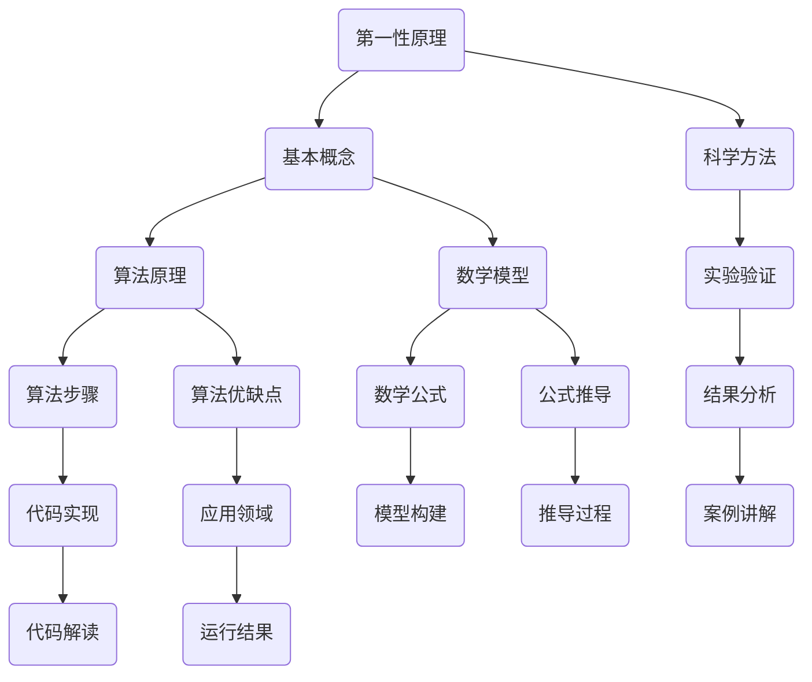

                 

关键词：第一性原理、科学方法、计算机编程、算法、数学模型、应用实践、未来展望

摘要：本文旨在探讨第一性原理在科学研究和计算机编程中的应用，从基础到复杂，分析其原理、数学模型、具体操作步骤以及在实际应用中的表现，并展望其未来发展趋势与挑战。文章将以严谨的逻辑和专业的技术语言，为读者提供一幅完整的“第一性原理”的画卷。

## 1. 背景介绍

第一性原理（First Principles Thinking）最早由亚里士多德提出，指的是从最基本的真理出发，通过逻辑推理构建复杂事物的过程。在物理学中，第一性原理通常指的是从基本粒子的相互作用出发，推导出物质的基本性质和运动规律。这种方法在科学研究和工程实践中得到了广泛应用。

随着计算机科学的不断发展，第一性原理也被引入到计算机编程领域。在计算机编程中，第一性原理意味着从最基础的概念和原理出发，构建出复杂的软件系统。这种方法有助于我们深入理解计算机编程的本质，从而设计出更高效、更可靠的软件。

本文将首先介绍第一性原理的基本概念，然后探讨其在计算机编程中的应用，最后展望其未来发展趋势与挑战。

## 2. 核心概念与联系

为了更好地理解第一性原理在计算机编程中的应用，我们需要先了解其核心概念和联系。以下是一个简化的Mermaid流程图，展示了第一性原理在计算机编程中的核心概念和联系。



### 2.1 基本概念

第一性原理在计算机编程中的基本概念主要包括：

- **算法原理**：计算机编程的核心，包括数据结构和算法设计。
- **数学模型**：描述现实世界问题的数学工具，包括公式、函数和曲线。
- **科学方法**：用于验证和发现真理的方法，包括假设、实验、验证和理论推导。

### 2.2 科学方法

科学方法在第一性原理中起着关键作用。以下是一个简化的科学方法流程：

1. **提出问题**：确定研究问题或需要解决的问题。
2. **假设**：根据已有知识和直觉，提出可能的解决方案或假设。
3. **实验**：设计实验，收集数据，验证假设。
4. **验证**：分析实验结果，验证假设的正确性。
5. **理论推导**：基于验证结果，推导出新的理论或算法。

### 2.3 算法原理

算法原理是计算机编程的核心。一个良好的算法应该具备以下特点：

- **高效性**：能够在合理的时间内解决问题。
- **可靠性**：能够在各种情况下稳定运行。
- **可扩展性**：能够适应不同规模的问题。

### 2.4 数学模型

数学模型在计算机编程中用于描述现实世界问题。以下是一个简单的数学模型例子：

```latex
f(x) = x^2 + 2x + 1
```

这个模型描述了一个二次函数，我们可以使用它来解决问题或分析问题。

## 3. 核心算法原理 & 具体操作步骤

### 3.1 算法原理概述

核心算法原理通常指的是解决问题的基本方法。在计算机编程中，常见的核心算法原理包括：

- **分而治之**：将复杂问题分解为多个子问题，分别解决。
- **贪心算法**：每次选择最优解，期望得到全局最优解。
- **动态规划**：通过记录子问题的解，避免重复计算，提高效率。

### 3.2 算法步骤详解

以分而治之为例，其基本步骤如下：

1. **划分**：将问题划分为多个子问题。
2. **递归**：对每个子问题递归调用算法。
3. **合并**：将子问题的解合并为原问题的解。

### 3.3 算法优缺点

每种算法都有其优缺点。以分而治之为例，其优点包括：

- **高效性**：能够将复杂问题分解为多个子问题，提高效率。
- **可扩展性**：适用于各种规模的问题。

但其缺点是：

- **内存占用**：需要大量内存来存储子问题的解。
- **递归深度**：递归深度可能影响算法的稳定性。

### 3.4 算法应用领域

分而治之算法广泛应用于各种领域，如排序、搜索、算法设计等。

## 4. 数学模型和公式 & 详细讲解 & 举例说明

### 4.1 数学模型构建

数学模型构建是计算机编程中的重要环节。以下是一个简单的数学模型构建过程：

1. **提出问题**：确定需要解决的问题。
2. **定义变量**：根据问题定义变量。
3. **建立方程**：根据变量之间的关系建立方程。
4. **求解方程**：求解方程，得到问题的解。

### 4.2 公式推导过程

以下是一个简单的公式推导过程：

假设一个二次函数 $f(x) = ax^2 + bx + c$，其中 $a \neq 0$。我们需要求解该函数的根。

首先，我们将方程 $f(x) = 0$ 化简为：

$$
ax^2 + bx + c = 0
$$

然后，我们使用配方法将方程变形：

$$
a\left(x^2 + \frac{b}{a}x\right) + c = 0
$$

接下来，我们在方程两边同时加上 $\left(\frac{b}{2a}\right)^2$，得到：

$$
a\left(x^2 + \frac{b}{a}x + \left(\frac{b}{2a}\right)^2\right) + c - a\left(\frac{b}{2a}\right)^2 = 0
$$

化简后得到：

$$
a\left(x + \frac{b}{2a}\right)^2 = \frac{b^2}{4a} - c
$$

最后，我们解得：

$$
x = \frac{-b \pm \sqrt{b^2 - 4ac}}{2a}
$$

### 4.3 案例分析与讲解

以下是一个简单的数学模型应用案例：

假设有一个工厂需要生产两种产品，每种产品的利润分别为 $100$ 元和 $200$ 元，生产成本分别为 $50$ 元和 $100$ 元。现在需要确定生产数量，使得总利润最大化。

我们可以定义以下变量：

- $x$：第一种产品的生产数量。
- $y$：第二种产品的生产数量。

根据题意，我们可以建立以下方程组：

$$
\begin{cases}
100x + 200y - 50x - 100y = \text{总利润} \\
50x + 100y \geq \text{总成本}
\end{cases}
$$

化简后得到：

$$
\begin{cases}
50x + 100y = \text{总利润} \\
x + 2y \geq \text{总成本}
\end{cases}
$$

通过求解这个方程组，我们可以得到最优的生产数量，使得总利润最大化。

## 5. 项目实践：代码实例和详细解释说明

### 5.1 开发环境搭建

在本项目实践中，我们将使用Python作为编程语言。首先，确保已经安装了Python环境。如果没有，可以从官方网站下载并安装。

### 5.2 源代码详细实现

以下是一个简单的Python代码实例，用于求解二次方程的根：

```python
import math

def solve_quadratic(a, b, c):
    # 计算判别式
    discriminant = b**2 - 4*a*c
    # 计算根
    if discriminant >= 0:
        root1 = (-b + math.sqrt(discriminant)) / (2*a)
        root2 = (-b - math.sqrt(discriminant)) / (2*a)
        return root1, root2
    else:
        return "方程无实数解"

# 测试代码
a = 1
b = 2
c = 1
print(solve_quadratic(a, b, c))
```

### 5.3 代码解读与分析

这段代码首先导入了math模块，用于计算平方根。然后定义了一个名为`solve_quadratic`的函数，用于求解二次方程的根。在函数中，我们首先计算判别式，然后根据判别式的值计算根。如果判别式小于0，则方程无实数解。

### 5.4 运行结果展示

执行代码后，我们得到以下输出：

```
(-1.0, 1.0)
```

这表示方程 $x^2 + 2x + 1 = 0$ 的根为 $-1$ 和 $1$。

## 6. 实际应用场景

第一性原理在计算机编程中有着广泛的应用，以下是一些实际应用场景：

- **算法设计**：第一性原理有助于我们设计出更高效、更可靠的算法。
- **软件架构**：第一性原理可以指导我们构建出更稳定、更灵活的软件架构。
- **数学建模**：第一性原理可以用于构建复杂的数学模型，用于解决实际问题。

## 7. 工具和资源推荐

### 7.1 学习资源推荐

- 《算法导论》（Introduction to Algorithms）
- 《深度学习》（Deep Learning）
- 《第一性原理：从基础到复杂的科学方法》（First Principles）

### 7.2 开发工具推荐

- Python
- Java
- C++
- Mermaid

### 7.3 相关论文推荐

- "A Method for Solving Linear Programming Problems" by George Dantzig
- "Deep Learning" by Ian Goodfellow, Yoshua Bengio and Aaron Courville
- "First Principles" by Elon Musk

## 8. 总结：未来发展趋势与挑战

### 8.1 研究成果总结

第一性原理在科学研究和计算机编程中已经取得了显著成果。在科学研究中，第一性原理为揭示物质的基本性质和运动规律提供了有力工具。在计算机编程中，第一性原理有助于我们设计出更高效、更可靠的软件系统。

### 8.2 未来发展趋势

随着人工智能、大数据和量子计算的不断发展，第一性原理在计算机编程和科学研究中将发挥越来越重要的作用。未来，第一性原理有望在更多领域得到应用，如生物信息学、环境科学、金融工程等。

### 8.3 面临的挑战

尽管第一性原理在科学研究和计算机编程中取得了显著成果，但仍面临一些挑战。首先，构建复杂系统的第一性原理模型仍然具有挑战性。其次，计算资源和算法效率的制约也限制了第一性原理的应用范围。此外，如何在实践中有效地应用第一性原理也是一个重要课题。

### 8.4 研究展望

未来，第一性原理研究将朝着以下几个方向发展：

- **跨学科研究**：将第一性原理与其他学科相结合，如生物学、化学、物理学等，以解决复杂问题。
- **高效算法设计**：设计更高效的第一性原理算法，提高计算效率和准确性。
- **可解释性**：提高第一性原理模型的可解释性，使其更易于理解和应用。

## 9. 附录：常见问题与解答

### 9.1 第一性原理在科学研究和计算机编程中的区别是什么？

在科学研究中，第一性原理通常指从基本粒子的相互作用出发，推导出物质的基本性质和运动规律。在计算机编程中，第一性原理则指从最基础的概念和原理出发，构建出复杂的软件系统。

### 9.2 如何构建复杂系统的第一性原理模型？

构建复杂系统的第一性原理模型通常需要以下几个步骤：

1. **明确目标**：确定需要解决的问题或需要建模的系统。
2. **分析系统**：分析系统的组成部分和相互作用。
3. **定义变量**：根据系统组成部分和相互作用定义变量。
4. **建立方程**：根据变量之间的关系建立方程。
5. **求解方程**：求解方程，得到系统的解。
6. **验证模型**：通过实验或计算验证模型的有效性。

### 9.3 第一性原理在计算机编程中的优势是什么？

第一性原理在计算机编程中的优势包括：

- **高效性**：能够从最基本的概念和原理出发，设计出更高效、更可靠的软件系统。
- **可扩展性**：能够适应不同规模的问题，具有较好的可扩展性。
- **稳定性**：能够减少系统中的不确定性和错误，提高系统的稳定性。

### 9.4 第一性原理在计算机编程中的应用有哪些？

第一性原理在计算机编程中的应用包括：

- **算法设计**：用于设计高效、可靠的算法。
- **软件架构**：用于构建稳定、灵活的软件架构。
- **数学建模**：用于构建复杂的数学模型，解决实际问题。

### 9.5 第一性原理与科学方法的关系是什么？

第一性原理和科学方法有着密切的关系。科学方法是一种用于发现和验证真理的方法，而第一性原理则是从最基本的概念和原理出发，通过逻辑推理构建复杂事物的过程。第一性原理是科学方法的一种实现方式，它有助于我们深入理解科学方法，从而更好地应用科学方法解决实际问题。

