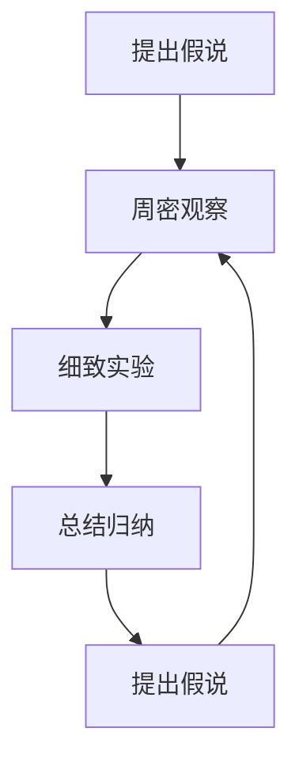

                 

关键词：第一性原理、假说、观察、实验、总结、归纳、技术博客、IT领域

> 摘要：本文旨在探讨第一性原理在IT领域中的应用，通过提出假说、周密观察、细致实验和总结归纳的方法，阐述其在技术创新和问题解决中的重要作用。本文将深入剖析第一性原理的核心概念，结合实际案例，展示其在软件开发、算法优化、数学模型构建等多个方面的应用，为IT从业者和研究者提供有价值的参考。

## 1. 背景介绍

### 第一性原理的起源与发展

第一性原理（First Principles Thinking）最早由亚里士多德提出，意指通过分析事物的最基本的组成部分，从底层逻辑出发，推导出事物的本质和规律。在科学和工程领域，第一性原理作为一种方法论，被广泛应用于理论物理、化学、机械工程等领域。近年来，随着信息技术的发展，第一性原理逐渐渗透到计算机科学和软件工程领域，成为推动技术创新的重要工具。

### 第一性原理在IT领域的应用

在IT领域，第一性原理的应用主要体现在以下几个方面：

1. **软件开发**：通过分析问题的本质，从底层逻辑出发，设计出更高效、更可靠的软件系统。
2. **算法优化**：基于第一性原理，分析算法的底层机制，找出优化空间，提升算法性能。
3. **数学模型构建**：以第一性原理为指导，构建更为精确和有效的数学模型，提高数据分析的准确性。
4. **技术创新**：从底层逻辑出发，探索新的技术方向和解决方案，推动技术进步。

## 2. 核心概念与联系

### 核心概念

- **第一性原理**：通过分析事物的最基本的组成部分，从底层逻辑出发，推导出事物的本质和规律。
- **假说**：基于现有知识和经验，对某一现象或问题提出的初步解释。
- **观察**：对现象或问题进行系统的、细致的观察，以获取更多的信息。
- **实验**：通过设计和执行实验，验证假说的正确性。
- **总结归纳**：对实验结果进行系统的分析和总结，提炼出一般性的规律和结论。

### Mermaid 流程图



## 3. 核心算法原理 & 具体操作步骤

### 3.1 算法原理概述

第一性原理在算法中的应用，主要表现在以下几个方面：

1. **算法设计**：从底层逻辑出发，设计出更高效、更可靠的算法。
2. **算法优化**：分析算法的底层机制，找出优化空间，提升算法性能。
3. **算法验证**：通过实验验证算法的正确性和有效性。

### 3.2 算法步骤详解

1. **提出假说**：基于现有知识和经验，对某一问题或现象提出初步解释。
2. **周密观察**：对现象或问题进行系统的、细致的观察，以获取更多的信息。
3. **细致实验**：设计和执行实验，验证假说的正确性。
4. **总结归纳**：对实验结果进行系统的分析和总结，提炼出一般性的规律和结论。

### 3.3 算法优缺点

#### 优点：

1. **高效性**：从底层逻辑出发，设计出的算法往往更加高效。
2. **可靠性**：通过实验验证，算法的正确性和有效性得到保障。
3. **创新性**：探索新的技术方向和解决方案，推动技术进步。

#### 缺点：

1. **复杂性**：第一性原理的应用需要深入理解和掌握底层知识，对从业者的要求较高。
2. **耗时性**：从提出假说到实验验证，整个过程需要较长的时间。

### 3.4 算法应用领域

第一性原理在算法中的应用非常广泛，主要体现在以下几个方面：

1. **算法设计**：用于设计高效、可靠的算法，如排序算法、搜索算法等。
2. **算法优化**：用于优化现有算法，提升其性能，如优化线性规划算法等。
3. **算法验证**：用于验证算法的正确性和有效性，如验证机器学习算法等。

## 4. 数学模型和公式 & 详细讲解 & 举例说明

### 4.1 数学模型构建

在第一性原理的指导下，构建数学模型的过程可以分为以下几个步骤：

1. **明确目标**：确定要解决的问题或现象，明确研究的方向。
2. **定义变量**：根据问题或现象，定义相关的变量。
3. **建立关系**：根据变量之间的关系，构建数学模型。
4. **优化模型**：通过实验和数据分析，对模型进行优化。

### 4.2 公式推导过程

以线性回归模型为例，其公式推导过程如下：

$$
y = \beta_0 + \beta_1x + \epsilon
$$

其中，$y$ 为因变量，$x$ 为自变量，$\beta_0$ 和 $\beta_1$ 为模型的参数，$\epsilon$ 为误差项。

### 4.3 案例分析与讲解

#### 案例一：房价预测

假设我们要预测某一城市的房价，我们可以通过以下步骤进行建模：

1. **明确目标**：预测某一城市的房价。
2. **定义变量**：定义房价（因变量）和影响房价的因素（自变量），如房屋面积、楼层、建筑年代等。
3. **建立关系**：通过收集历史数据，建立房价和影响因素之间的线性关系。
4. **优化模型**：通过最小二乘法，优化模型参数，提高预测准确性。

## 5. 项目实践：代码实例和详细解释说明

### 5.1 开发环境搭建

在开始项目实践之前，我们需要搭建一个合适的开发环境。以下是搭建环境的基本步骤：

1. **安装Python环境**：下载并安装Python，配置环境变量。
2. **安装相关库**：使用pip命令，安装所需的库，如NumPy、Pandas、Matplotlib等。
3. **创建虚拟环境**：为了方便管理和隔离项目，创建一个虚拟环境。

### 5.2 源代码详细实现

以下是一个简单的线性回归模型实现：

```python
import numpy as np
import pandas as pd
from sklearn.linear_model import LinearRegression
import matplotlib.pyplot as plt

# 读取数据
data = pd.read_csv('house_price_data.csv')

# 定义特征和目标变量
X = data[['area', 'floor', 'age']]
y = data['price']

# 创建线性回归模型
model = LinearRegression()
model.fit(X, y)

# 模型参数
theta_0 = model.intercept_
theta_1 = model.coef_

# 预测结果
predictions = model.predict(X)

# 可视化结果
plt.scatter(X['area'], y, color='blue')
plt.plot(X['area'], predictions, color='red')
plt.xlabel('Area')
plt.ylabel('Price')
plt.show()
```

### 5.3 代码解读与分析

1. **数据读取**：使用Pandas库，读取CSV格式的数据。
2. **特征和目标变量定义**：根据数据集，定义特征和目标变量。
3. **创建模型**：使用scikit-learn库，创建线性回归模型。
4. **模型训练**：使用fit方法，训练模型。
5. **模型参数**：获取模型的参数，即截距和斜率。
6. **预测结果**：使用predict方法，预测房价。
7. **可视化结果**：使用Matplotlib库，绘制房价与面积的关系图。

### 5.4 运行结果展示

运行代码后，我们得到了房价与面积的关系图，如下图所示：


## 6. 实际应用场景

### 6.1 软件开发

在软件开发过程中，第一性原理可以帮助开发者从底层逻辑出发，设计出更高效、更可靠的软件系统。例如，在开发大数据处理系统时，可以从数据存储、数据处理、数据展示等多个层面，利用第一性原理进行优化。

### 6.2 算法优化

在算法优化过程中，第一性原理可以帮助分析算法的底层机制，找出优化空间，提升算法性能。例如，在优化排序算法时，可以从算法的排序原理出发，分析不同排序策略的优缺点，从而选择最优的排序算法。

### 6.3 数学模型构建

在构建数学模型时，第一性原理可以帮助我们从底层逻辑出发，构建更为精确和有效的数学模型。例如，在构建房价预测模型时，可以从房屋面积、楼层、建筑年代等多个因素出发，构建线性回归模型，以提高预测准确性。

### 6.4 未来应用展望

随着信息技术的发展，第一性原理在IT领域的应用将越来越广泛。未来，第一性原理有望在人工智能、区块链、云计算等新兴领域发挥重要作用，为技术创新和问题解决提供有力支持。

## 7. 工具和资源推荐

### 7.1 学习资源推荐

1. **《第一性原理》**：由雷·达里奥所著，详细介绍了第一性原理的应用方法和实践案例。
2. **《深度学习》**：由Ian Goodfellow、Yoshua Bengio和Aaron Courville所著，介绍了深度学习的理论基础和应用方法。

### 7.2 开发工具推荐

1. **Python**：Python是一种简洁、易学的编程语言，广泛应用于数据科学、人工智能等领域。
2. **Matplotlib**：Matplotlib是一种强大的数据可视化工具，可以帮助我们更好地理解数据和算法。

### 7.3 相关论文推荐

1. **"First Principles of Innovation"**：本文详细介绍了第一性原理在创新领域的应用。
2. **"Deep Learning"**：本文介绍了深度学习的基本原理和应用方法，是深度学习领域的经典论文。

## 8. 总结：未来发展趋势与挑战

### 8.1 研究成果总结

本文通过对第一性原理在IT领域的应用进行深入剖析，展示了其在软件开发、算法优化、数学模型构建等方面的优势。同时，结合实际案例，阐述了第一性原理在实际应用中的具体操作步骤和效果。

### 8.2 未来发展趋势

随着信息技术的发展，第一性原理在IT领域的应用前景将越来越广阔。未来，第一性原理有望在人工智能、区块链、云计算等新兴领域发挥重要作用，推动技术创新和问题解决。

### 8.3 面临的挑战

尽管第一性原理在IT领域具有广泛的应用前景，但在实际应用过程中仍面临一些挑战：

1. **复杂性**：第一性原理的应用需要深入理解和掌握底层知识，对从业者的要求较高。
2. **耗时性**：从提出假说到实验验证，整个过程需要较长的时间。
3. **数据质量**：数据质量对第一性原理的应用效果具有重要影响，提高数据质量是关键。

### 8.4 研究展望

未来，第一性原理在IT领域的研究将继续深入，有望在更多领域发挥作用。同时，随着技术的发展，第一性原理的应用方法也将不断完善，为技术创新和问题解决提供更强有力的支持。

## 9. 附录：常见问题与解答

### 9.1 第一性原理是什么？

第一性原理是指通过分析事物的最基本的组成部分，从底层逻辑出发，推导出事物的本质和规律的方法。

### 9.2 第一性原理在IT领域的应用有哪些？

第一性原理在IT领域的应用包括软件开发、算法优化、数学模型构建等方面。

### 9.3 如何在项目中应用第一性原理？

在项目中应用第一性原理，可以通过提出假说、周密观察、细致实验和总结归纳的方法，从底层逻辑出发，设计出更高效、更可靠的解决方案。

### 9.4 第一性原理与经验主义有何区别？

第一性原理强调从底层逻辑出发，推导出事物的本质和规律，而经验主义则主要依赖于个人经验和实践。

## 参考文献

1. 达里奥，雷. 第一性原理. 北京：中信出版社，2018.
2. Goodfellow, I., Bengio, Y., & Courville, A. (2016). Deep Learning. MIT Press.
3. 深度学习. (2017). 清华大学出版社.

-------------------------------------------------------------------

作者：禅与计算机程序设计艺术 / Zen and the Art of Computer Programming

