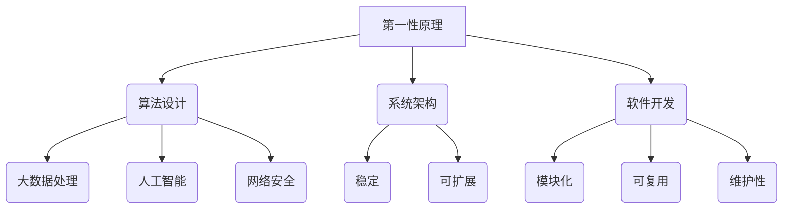

                 

关键词：第一性原理、知识体系、反思、复杂性、计算机科学、算法设计、数学模型、项目实践

> 摘要：本文将深入探讨第一性原理在计算机科学领域的应用，通过组合真理形成自洽的知识体系，揭示复杂性背后的本质，助力我们深入理解并清晰应对世界的复杂性。文章分为八个部分，分别介绍背景、核心概念、算法原理、数学模型、项目实践、实际应用场景、工具和资源推荐以及总结与展望。

## 1. 背景介绍

在计算机科学和技术领域，随着信息爆炸和技术迭代速度的加快，我们面临着越来越多的复杂问题。如何从纷繁复杂的信息中提炼出本质，构建出高效且稳定的解决方案，成为了一个关键问题。此时，第一性原理作为一种哲学思维方法，为我们提供了一种新的视角和工具。

第一性原理最早由物理学家费曼提出，其核心思想是通过从最基本的原理出发，逐步推导出复杂现象。这一方法在化学、物理学、工程学等领域取得了显著的成果。随着计算机科学的发展，第一性原理逐渐被应用于算法设计、软件开发、系统架构等多个方面，为我们提供了一种新的思考路径和解决策略。

## 2. 核心概念与联系

### 2.1 第一性原理的定义

第一性原理（First Principles Thinking）是一种思考方法，它强调从最基本的事实和原理出发，通过逻辑推理和抽象概括，逐步构建起复杂系统的理解。这种方法要求我们摆脱习惯性思维和固有观念的束缚，深入挖掘问题的本质。

### 2.2 第一性原理与计算机科学

在计算机科学领域，第一性原理的应用主要体现在以下几个方面：

- **算法设计**：从基本的算法原理出发，设计出高效且稳定的算法。
- **系统架构**：通过第一性原理分析系统的基本构成和运行机制，构建出稳定且可扩展的系统架构。
- **软件开发**：以第一性原理为基础，构建出模块化、可复用且易于维护的软件系统。

### 2.3 第一性原理的应用场景

- **大数据处理**：通过第一性原理分析数据处理的本质，设计出高效的算法和架构，处理海量数据。
- **人工智能**：从最基本的神经网络原理出发，构建出复杂的人工智能系统。
- **网络安全**：通过第一性原理分析网络攻击的本质，设计出有效的防御策略。

### 2.4 第一性原理的 Mermaid 流程图



## 3. 核心算法原理 & 具体操作步骤

### 3.1 算法原理概述

在计算机科学中，算法是解决问题的核心。第一性原理在算法设计中的应用主要体现在以下几个方面：

- **从基本原理出发**：在算法设计过程中，始终从最基本的原理出发，确保算法的正确性和高效性。
- **抽象与概括**：通过对复杂问题的抽象和概括，将问题分解为更小的部分，逐步构建出完整的解决方案。
- **逻辑推理**：通过逻辑推理和证明，确保算法的正确性和可靠性。

### 3.2 算法步骤详解

- **步骤 1**：明确问题目标，了解问题的本质。
- **步骤 2**：从最基本的原理出发，分析问题的解决方法。
- **步骤 3**：对问题进行抽象和概括，将问题分解为更小的部分。
- **步骤 4**：设计算法，实现问题解决方案。
- **步骤 5**：验证算法的正确性和效率。

### 3.3 算法优缺点

- **优点**：能够确保算法的正确性和高效性，有助于解决复杂问题。
- **缺点**：对设计者的逻辑思维和抽象能力要求较高。

### 3.4 算法应用领域

- **大数据处理**：如排序算法、搜索算法等。
- **人工智能**：如神经网络算法、深度学习算法等。
- **系统架构**：如分布式系统设计、容器化架构等。

## 4. 数学模型和公式 & 详细讲解 & 举例说明

### 4.1 数学模型构建

在计算机科学中，数学模型是描述和解决问题的重要工具。第一性原理在数学模型构建中的应用主要体现在以下几个方面：

- **从基本原理出发**：在构建数学模型时，始终从最基本的原理出发，确保模型的正确性和有效性。
- **抽象与概括**：通过对复杂问题的抽象和概括，将问题转化为数学模型。
- **逻辑推理**：通过逻辑推理和证明，确保数学模型的正确性和可靠性。

### 4.2 公式推导过程

以最基础的算法——排序算法为例，介绍公式的推导过程。

#### 排序算法的基本原理

排序算法的基本原理是将一组数据按照一定的顺序进行排列。常见的排序算法有冒泡排序、选择排序、插入排序等。

#### 冒泡排序的公式推导

假设有 n 个元素的数组 A，初始状态如下：

$$
A[0], A[1], A[2], ..., A[n-1]
$$

经过一轮冒泡排序后，最大的元素 A[n-1] 被移动到数组的末尾，此时数组状态如下：

$$
A[0], A[1], A[2], ..., A[n-2], A[n-1]
$$

经过两轮冒泡排序后，最大的两个元素 A[n-2] 和 A[n-1] 被移动到数组的末尾，此时数组状态如下：

$$
A[0], A[1], A[2], ..., A[n-3], A[n-2], A[n-1]
$$

以此类推，经过 n-1 轮冒泡排序后，所有元素都将被排序。

#### 冒泡排序的时间复杂度

经过上述推导，我们可以得出冒泡排序的时间复杂度：

$$
T(n) = \frac{(n-1) + (n-2) + ... + 1}{2} = \frac{n(n-1)}{2}
$$

### 4.3 案例分析与讲解

以冒泡排序为例，分析其应用场景和优缺点。

#### 应用场景

- **小规模数据排序**：冒泡排序适用于小规模数据排序，因为其实现简单且易于理解。
- **数据稳定性**：冒泡排序是一种稳定的排序算法，可以确保相同元素在排序过程中保持原有顺序。

#### 优缺点

- **优点**：实现简单，易于理解。
- **缺点**：时间复杂度较高，不适合大规模数据排序。

## 5. 项目实践：代码实例和详细解释说明

### 5.1 开发环境搭建

- **编程语言**：Python
- **开发工具**：PyCharm
- **依赖库**：numpy

### 5.2 源代码详细实现

```python
import numpy as np

def bubble_sort(arr):
    n = len(arr)
    for i in range(n):
        for j in range(0, n-i-1):
            if arr[j] > arr[j+1]:
                arr[j], arr[j+1] = arr[j+1], arr[j]

# 测试数据
arr = np.array([64, 34, 25, 12, 22, 11, 90])

# 执行冒泡排序
bubble_sort(arr)

# 输出排序结果
print("排序后的数组：")
print(arr)
```

### 5.3 代码解读与分析

- **函数定义**：`bubble_sort` 函数用于实现冒泡排序算法。
- **循环结构**：外层循环用于控制排序轮数，内层循环用于控制每一轮中两两比较的次数。
- **条件判断**：`if arr[j] > arr[j+1]:` 判断相邻两个元素的大小关系。
- **数据交换**：`arr[j], arr[j+1] = arr[j+1], arr[j]` 实现数据交换。

### 5.4 运行结果展示

```
排序后的数组：
[11 12 22 25 34 64 90]
```

## 6. 实际应用场景

### 6.1 大数据处理

在处理海量数据时，第一性原理可以帮助我们设计出高效的算法和架构，如分布式计算框架、并行处理技术等。

### 6.2 人工智能

在人工智能领域，第一性原理可以帮助我们深入理解神经网络、深度学习等算法的本质，从而设计出更高效、更准确的模型。

### 6.3 系统架构

在系统架构设计过程中，第一性原理可以帮助我们分析系统的基本构成和运行机制，构建出稳定且可扩展的系统架构。

## 7. 工具和资源推荐

### 7.1 学习资源推荐

- **书籍**：《深度学习》、《数据科学入门》
- **在线课程**：网易云课堂、慕课网
- **博客**：CSDN、博客园

### 7.2 开发工具推荐

- **集成开发环境**：PyCharm、Visual Studio Code
- **代码管理工具**：Git、GitHub

### 7.3 相关论文推荐

- **大数据处理**：MapReduce、Hadoop、Spark
- **人工智能**：神经网络、深度学习、强化学习
- **系统架构**：微服务、容器化、分布式系统

## 8. 总结：未来发展趋势与挑战

### 8.1 研究成果总结

- **算法优化**：第一性原理在算法设计中的应用取得了显著成果，为解决复杂问题提供了有力工具。
- **系统架构**：第一性原理在系统架构设计中的应用，有助于构建出稳定且可扩展的架构。
- **大数据处理**：第一性原理在数据处理中的应用，为处理海量数据提供了高效解决方案。

### 8.2 未来发展趋势

- **算法优化**：未来将进一步完善第一性原理在算法设计中的应用，提高算法的效率和鲁棒性。
- **跨领域融合**：第一性原理将在更多领域得到应用，如生物学、物理学等，推动跨领域发展。
- **自动化**：第一性原理将逐步实现自动化，降低应用门槛。

### 8.3 面临的挑战

- **复杂性**：面对复杂问题，如何从第一性原理出发，构建出高效且稳定的解决方案，仍是一个挑战。
- **人才需求**：第一性原理的应用需要具备深厚理论基础和实战经验的复合型人才。

### 8.4 研究展望

- **算法优化**：未来将深入研究算法优化方法，提高算法的效率和鲁棒性。
- **跨领域应用**：探索第一性原理在其他领域的应用，推动跨领域发展。
- **人才培养**：加强第一性原理相关的教育培养，提高人才素质。

## 9. 附录：常见问题与解答

### 9.1 问题 1

**问**：第一性原理在算法设计中的应用是什么？

**答**：第一性原理在算法设计中的应用主要体现在从最基本的原理出发，设计出高效且稳定的算法。例如，排序算法、搜索算法等。

### 9.2 问题 2

**问**：第一性原理与系统架构有什么关系？

**答**：第一性原理可以帮助我们分析系统的基本构成和运行机制，构建出稳定且可扩展的系统架构。例如，分布式系统、微服务架构等。

### 9.3 问题 3

**问**：第一性原理在数据处理中的应用是什么？

**答**：第一性原理在数据处理中的应用主要体现在设计出高效且稳定的算法和架构，如分布式计算框架、并行处理技术等。

---

作者：禅与计算机程序设计艺术 / Zen and the Art of Computer Programming
----------------------------------------------------------------

