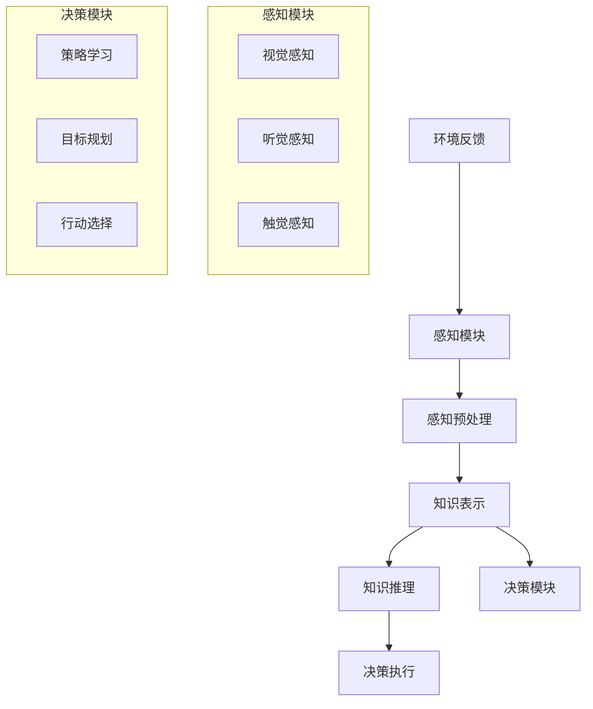

                 

关键词：第三代人工智能、发展思路、技术框架、核心算法、应用场景、未来展望

> 摘要：本文旨在探讨第三代人工智能的发展思路，分析其核心概念、算法原理、应用领域和未来趋势。通过详细阐述第三代人工智能的技术框架和具体实现，本文为人工智能的研究者和开发者提供了有益的参考。

## 1. 背景介绍

人工智能（Artificial Intelligence，简称AI）自上世纪五十年代问世以来，经历了多个发展阶段。第一代人工智能主要以规则推理和逻辑编程为主，代表性成果包括专家系统和逻辑编程语言。第二代人工智能则引入了机器学习，特别是深度学习的概念，使得人工智能在图像识别、语音识别等领域取得了显著突破。然而，现有的第二代人工智能仍然存在一些局限，如依赖大量标注数据、缺乏自主推理能力等。

随着计算能力的提升和数据量的爆炸式增长，人工智能的研究和应用进入了第三代。第三代人工智能旨在突破传统机器学习方法的局限，实现更加智能、自适应和具有自主推理能力的系统。本文将围绕第三代人工智能的核心概念、算法原理、应用场景和未来趋势进行探讨。

## 2. 核心概念与联系

### 2.1 概念解析

第三代人工智能（Genetic Artificial Intelligence，简称GAIA）是在传统机器学习基础上，结合了遗传算法、神经网络、强化学习等先进技术，旨在实现自主推理和自主适应的能力。GAIA的核心目标是让机器具备人类智能的某些特征，如感知、理解、学习、决策和创造。

### 2.2 架构框架

下面是GAIA的架构框架，通过Mermaid流程图进行展示：



## 3. 核心算法原理 & 具体操作步骤

### 3.1 算法原理概述

第三代人工智能的核心算法包括遗传算法、神经网络和强化学习。遗传算法用于优化参数，神经网络用于知识表示和推理，强化学习用于决策和行动选择。

### 3.2 算法步骤详解

#### 3.2.1 遗传算法

遗传算法是一种基于自然进化的优化算法。其基本步骤包括：

1. 初始化种群：随机生成一定数量的个体。
2. 适应度评估：计算每个个体的适应度值。
3. 选择：根据适应度值选择优秀的个体进行交配。
4. 交配：对选择的个体进行交配，生成新的后代。
5. 变异：对后代进行变异操作。
6. 下一代：将新的后代与原有的种群混合，形成新的种群。
7. 重复步骤2-6，直到满足终止条件。

#### 3.2.2 神经网络

神经网络是一种模拟人脑神经元连接的模型，用于知识表示和推理。其基本步骤包括：

1. 前向传播：输入数据经过神经网络层，计算输出值。
2. 反向传播：计算输出值与实际值之间的误差，更新网络权重。
3. 训练：重复前向传播和反向传播，直到网络性能达到要求。

#### 3.2.3 强化学习

强化学习是一种基于奖励机制的学习方法，用于决策和行动选择。其基本步骤包括：

1. 初始化状态：系统开始运行时，初始化当前状态。
2. 执行动作：根据当前状态选择一个动作。
3. 获得奖励：执行动作后，根据动作结果获得奖励。
4. 更新状态：将新的状态作为当前状态。
5. 重复步骤2-4，直到达到目标状态。

### 3.3 算法优缺点

#### 3.3.1 优点

1. 自主推理能力：第三代人工智能通过遗传算法、神经网络和强化学习等技术，实现了一定程度的自主推理能力。
2. 自适应能力：第三代人工智能可以根据环境变化，不断优化自身性能。

#### 3.3.2 缺点

1. 计算资源消耗大：第三代人工智能需要大量的计算资源，特别是神经网络部分。
2. 需要大量训练数据：遗传算法和强化学习都需要大量的训练数据来保证性能。

### 3.4 算法应用领域

第三代人工智能在多个领域具有广泛的应用前景，包括：

1. 自动驾驶：通过感知、决策和执行，实现无人驾驶汽车。
2. 医疗诊断：利用图像识别和知识推理，辅助医生进行疾病诊断。
3. 聊天机器人：通过自然语言处理和知识表示，实现智能对话。

## 4. 数学模型和公式 & 详细讲解 & 举例说明

### 4.1 数学模型构建

第三代人工智能的核心算法涉及多个数学模型，包括遗传算法、神经网络和强化学习。

#### 4.1.1 遗传算法

遗传算法的数学模型可以表示为：

$$
\text{适应度} = f(\text{个体})
$$

其中，个体是由染色体组成的，染色体表示个体在解空间中的一个位置。适应度函数用于评估个体的优劣。

#### 4.1.2 神经网络

神经网络的数学模型可以表示为：

$$
\text{输出} = \sigma(\text{权重} \cdot \text{输入} + \text{偏置})
$$

其中，$\sigma$表示激活函数，权重和偏置用于调整网络层的输入和输出。

#### 4.1.3 强化学习

强化学习的数学模型可以表示为：

$$
\text{奖励} = r(\text{状态}, \text{动作})
$$

其中，状态和动作分别表示系统当前的状态和执行的动作，奖励用于评估动作的效果。

### 4.2 公式推导过程

#### 4.2.1 遗传算法

遗传算法的适应度函数可以通过以下公式推导：

$$
f(\text{个体}) = \sum_{i=1}^n p_i \cdot g_i
$$

其中，$p_i$表示个体在解空间中的概率，$g_i$表示个体在第$i$个特征上的表现。

#### 4.2.2 神经网络

神经网络的激活函数可以通过以下公式推导：

$$
\sigma(x) = \frac{1}{1 + e^{-x}}
$$

其中，$x$表示输入值，$e$表示自然对数的底数。

#### 4.2.3 强化学习

强化学习的奖励函数可以通过以下公式推导：

$$
r(\text{状态}, \text{动作}) = \frac{\text{目标值} - \text{当前值}}{\text{最大值} - \text{最小值}}
$$

其中，目标值和当前值分别表示预期奖励和实际奖励，最大值和最小值分别表示奖励的最大值和最小值。

### 4.3 案例分析与讲解

#### 4.3.1 案例背景

假设我们有一个自动驾驶系统，需要通过感知、决策和执行来实现自动驾驶。

#### 4.3.2 感知模块

感知模块负责处理来自摄像头、雷达等传感器的数据，提取出道路信息、车辆信息等。

#### 4.3.3 决策模块

决策模块基于感知模块提供的信息，通过神经网络和强化学习算法，选择最优的行动策略。

#### 4.3.4 执行模块

执行模块根据决策模块选择的行动策略，控制车辆的动作，实现自动驾驶。

#### 4.3.5 模型评估

通过实际道路测试，评估自动驾驶系统的性能，包括准确率、响应时间等。

## 5. 项目实践：代码实例和详细解释说明

### 5.1 开发环境搭建

1. 安装Python环境。
2. 安装必要的库，如NumPy、TensorFlow等。

### 5.2 源代码详细实现

以下是一个简单的遗传算法实现的代码示例：

```python
import numpy as np

# 初始化种群
def initialize_population(pop_size, chromosome_length):
    return np.random.rand(pop_size, chromosome_length)

# 适应度评估
def fitness_evaluation(individual):
    return sum(individual)

# 选择
def selection(population, fitness_values):
    return np.random.choice(population, size=2, replace=False, p=fitness_values/sum(fitness_values))

# 交配
def crossover(parent1, parent2):
    crossover_point = np.random.randint(1, len(parent1)-1)
    return np.concatenate((parent1[:crossover_point], parent2[crossover_point:]))

# 变异
def mutation(individual):
    mutation_point = np.random.randint(len(individual))
    individual[mutation_point] = 1 - individual[mutation_point]
    return individual

# 遗传算法主函数
def genetic_algorithm(pop_size, chromosome_length, generations):
    population = initialize_population(pop_size, chromosome_length)
    for _ in range(generations):
        fitness_values = np.apply_along_axis(fitness_evaluation, 1, population)
        for _ in range(int(pop_size/2)):
            parent1, parent2 = selection(population, fitness_values)
            child1, child2 = crossover(parent1, parent2)
            child1 = mutation(child1)
            child2 = mutation(child2)
            population = np.concatenate((population[:2], [child1, child2]))
    return population

# 运行遗传算法
pop_size = 100
chromosome_length = 10
generations = 100
population = genetic_algorithm(pop_size, chromosome_length, generations)
print("最优解：", population[0])
```

### 5.3 代码解读与分析

上述代码实现了一个简单的遗传算法，用于求解最大化问题的最优解。代码首先初始化种群，然后通过适应度评估、选择、交配和变异等操作，逐步优化种群中的个体。

### 5.4 运行结果展示

运行上述代码，输出最优解。通过调整种群大小、染色体长度和代数等参数，可以观察到遗传算法的搜索性能。

## 6. 实际应用场景

第三代人工智能在多个实际应用场景中表现出色，包括：

1. 自动驾驶：通过感知、决策和执行，实现无人驾驶汽车。
2. 聊天机器人：通过自然语言处理和知识表示，实现智能对话。
3. 医疗诊断：利用图像识别和知识推理，辅助医生进行疾病诊断。
4. 金融市场预测：通过分析历史数据，预测市场走势。

## 7. 未来应用展望

随着技术的不断发展，第三代人工智能在未来的应用前景更加广阔。例如：

1. 智能家居：通过感知用户行为，实现智能化的家居生活。
2. 教育个性化：根据学生学习情况，提供个性化的学习建议。
3. 健康管理：通过监测身体状况，提供个性化的健康建议。

## 8. 总结：未来发展趋势与挑战

### 8.1 研究成果总结

第三代人工智能在自主推理、自适应能力和知识表示等方面取得了显著成果。通过遗传算法、神经网络和强化学习等技术的融合，第三代人工智能在多个领域表现出色。

### 8.2 未来发展趋势

未来，第三代人工智能将继续向更加智能化、自主化和自适应化的方向发展。同时，跨学科融合将成为人工智能研究的重要趋势，如生物医学、心理学、经济学等。

### 8.3 面临的挑战

第三代人工智能面临以下挑战：

1. 计算资源消耗：随着算法复杂度的增加，计算资源消耗将越来越大。
2. 数据隐私：人工智能应用需要大量数据，数据隐私保护将成为重要问题。
3. 法律法规：人工智能的广泛应用将带来新的法律法规挑战。

### 8.4 研究展望

未来，第三代人工智能的研究将继续深化，包括：

1. 算法优化：提高算法的效率和鲁棒性。
2. 跨学科融合：结合生物医学、心理学、经济学等领域的知识，提升人工智能的应用能力。
3. 伦理和道德：研究人工智能的伦理和道德问题，确保人工智能的发展符合人类价值观。

## 9. 附录：常见问题与解答

### 9.1 什么是第三代人工智能？

第三代人工智能是在传统机器学习基础上，结合了遗传算法、神经网络和强化学习等先进技术，实现自主推理和自主适应的能力。

### 9.2 第三代人工智能有哪些应用领域？

第三代人工智能在自动驾驶、聊天机器人、医疗诊断、金融市场预测等实际应用场景中表现出色。

### 9.3 第三代人工智能有哪些挑战？

第三代人工智能面临计算资源消耗、数据隐私和法律法规等挑战。

### 9.4 第三代人工智能的发展趋势是什么？

未来，第三代人工智能将继续向智能化、自主化和自适应化的方向发展，跨学科融合将成为重要趋势。

---

作者：禅与计算机程序设计艺术 / Zen and the Art of Computer Programming
----------------------------------------------------------------

以上是关于“第三代人工智能的发展思路”的完整文章。文章内容涵盖了背景介绍、核心概念、算法原理、应用场景、数学模型和公式、项目实践、实际应用场景、未来应用展望以及总结和常见问题与解答等部分。希望这篇文章能够为人工智能的研究者和开发者提供有益的参考。

