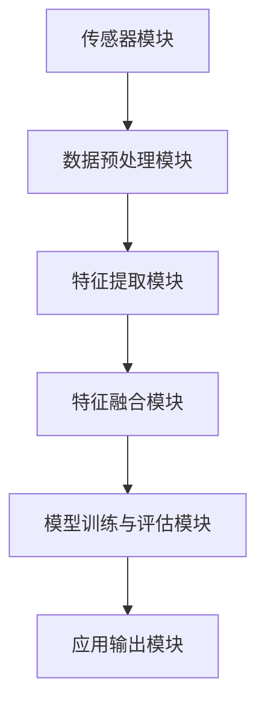

                 

关键词：多模态融合、图像处理、音频识别、视频分析、人工智能、机器学习、深度学习、技术发展趋势。

## 1. 背景介绍

在当今数字化时代，数据的多样性和复杂性不断增加。随着互联网、物联网、社交媒体等技术的发展，我们每天产生和接收的数据量呈爆炸式增长。这些数据不仅包括文本，还涵盖了图像、音频和视频等多种形式。如何有效地处理和利用这些多模态数据，已成为人工智能领域的一个重要研究方向。

多模态数据融合是指将来自不同模态的数据（如图像、音频、文本等）进行整合，以获得更丰富、更全面的信息。这种融合不仅能够提高数据的处理效率，还能增强系统的智能性和准确性。例如，在医疗领域，多模态数据融合可以帮助医生更准确地诊断疾病；在自动驾驶领域，多模态数据融合可以提高自动驾驶汽车的感知能力和安全性。

本文将探讨多模态数据的处理技术，包括图像、音频和视频的处理方法，以及这些技术在人工智能和机器学习中的应用。我们还将分析多模态数据融合的优势和挑战，并展望未来的发展趋势。

## 2. 核心概念与联系

### 2.1 多模态数据融合的基本概念

多模态数据融合是指将来自不同模态的数据进行整合，以获得更丰富、更全面的信息。这通常涉及以下核心概念：

- **数据采集**：从不同的传感器或设备中收集数据，如摄像头、麦克风、GPS 等。
- **数据预处理**：对采集到的数据进行清洗、归一化等处理，以提高数据质量。
- **特征提取**：从不同模态的数据中提取有意义的特征，如图像中的边缘、纹理和颜色特征，音频中的频谱特征等。
- **特征融合**：将不同模态的特征进行整合，以形成更丰富的特征向量。
- **模型训练**：使用整合后的特征向量训练机器学习模型，如分类器、预测模型等。
- **结果输出**：将模型的预测结果或决策输出给用户或应用系统。

### 2.2 多模态数据融合的架构

多模态数据融合的架构通常包括以下几个主要部分：

1. **传感器模块**：负责采集不同模态的数据，如图像、音频、文本等。
2. **数据预处理模块**：对采集到的数据进行预处理，包括去噪、归一化、特征提取等。
3. **特征融合模块**：将不同模态的特征进行整合，形成统一的特征向量。
4. **模型训练与评估模块**：使用整合后的特征向量训练机器学习模型，并对模型进行评估和优化。
5. **应用输出模块**：将模型的预测结果或决策输出给用户或应用系统。

### 2.3 多模态数据融合的 Mermaid 流程图

以下是多模态数据融合的 Mermaid 流程图：



## 3. 核心算法原理 & 具体操作步骤

### 3.1 算法原理概述

多模态数据融合的核心算法主要包括以下几种：

- **特征融合算法**：将不同模态的特征进行整合，形成统一特征向量。
- **深度学习模型**：使用整合后的特征向量训练深度学习模型，如卷积神经网络（CNN）、循环神经网络（RNN）等。
- **集成学习模型**：将多个模型进行集成，以提高预测准确性和鲁棒性。

### 3.2 算法步骤详解

#### 3.2.1 特征提取

特征提取是多模态数据融合的重要环节。以下是一些常见的特征提取方法：

- **图像特征提取**：使用卷积神经网络（CNN）提取图像特征，如边缘、纹理、颜色等。
- **音频特征提取**：使用短时傅里叶变换（STFT）提取音频特征，如频谱、倒谱等。
- **文本特征提取**：使用词袋模型、TF-IDF 等方法提取文本特征。

#### 3.2.2 特征融合

特征融合的方法主要包括以下几种：

- **简单融合方法**：如拼接、平均、加权等。
- **深度学习方法**：如多输入卷积神经网络（MTCNN）、多任务学习等。
- **集成学习方法**：如随机森林、梯度提升决策树等。

#### 3.2.3 模型训练与评估

使用整合后的特征向量训练深度学习模型，如卷积神经网络（CNN）、循环神经网络（RNN）等。训练完成后，使用验证集和测试集对模型进行评估和优化。

### 3.3 算法优缺点

#### 优点

- 提高数据处理效率和准确性。
- 增强系统的智能性和鲁棒性。
- 可应用于多种应用场景，如医疗、自动驾驶、智能家居等。

#### 缺点

- 特征提取和融合过程复杂，计算量大。
- 需要大量标注数据和计算资源。
- 模型训练和优化过程耗时较长。

### 3.4 算法应用领域

多模态数据融合算法在多个领域都有广泛的应用，如：

- **医疗领域**：用于疾病诊断、基因分析等。
- **自动驾驶**：用于车辆检测、行人识别、环境感知等。
- **智能家居**：用于智能控制、设备交互等。
- **娱乐与传媒**：用于视频编辑、内容推荐等。

## 4. 数学模型和公式 & 详细讲解 & 举例说明

### 4.1 数学模型构建

多模态数据融合的数学模型通常包括以下两部分：

- **特征提取模型**：用于提取不同模态的特征。
- **融合模型**：用于整合不同模态的特征。

#### 特征提取模型

- **图像特征提取模型**：假设图像特征提取模型为 \( f_{img}(x) \)，其中 \( x \) 为输入图像。
- **音频特征提取模型**：假设音频特征提取模型为 \( f_{audio}(x) \)，其中 \( x \) 为输入音频。

#### 融合模型

- **简单融合模型**：假设融合模型为 \( f_{fusion}(x_{img}, x_{audio}) \)，其中 \( x_{img} \) 和 \( x_{audio} \) 分别为图像特征和音频特征。

### 4.2 公式推导过程

假设我们有图像特征 \( x_{img} \) 和音频特征 \( x_{audio} \)，我们要将它们融合成一个特征向量 \( x \)。

$$
x = f_{fusion}(x_{img}, x_{audio})
$$

我们可以使用一个简单的加权平均方法来融合特征：

$$
x = \alpha \cdot x_{img} + (1 - \alpha) \cdot x_{audio}
$$

其中 \( \alpha \) 为权重参数。

### 4.3 案例分析与讲解

假设我们有一个包含图像和音频的多模态数据集，我们要使用上述方法进行数据融合。

#### 步骤 1：特征提取

首先，使用卷积神经网络（CNN）提取图像特征：

$$
f_{img}(x) = CNN(x)
$$

然后，使用短时傅里叶变换（STFT）提取音频特征：

$$
f_{audio}(x) = STFT(x)
$$

#### 步骤 2：特征融合

使用简单融合模型将图像特征和音频特征融合：

$$
x = \alpha \cdot f_{img}(x_{img}) + (1 - \alpha) \cdot f_{audio}(x_{audio})
$$

假设 \( \alpha = 0.5 \)，则融合特征向量 \( x \) 为：

$$
x = 0.5 \cdot f_{img}(x_{img}) + 0.5 \cdot f_{audio}(x_{audio})
$$

#### 步骤 3：模型训练与评估

使用融合后的特征向量 \( x \) 训练一个分类模型，如支持向量机（SVM）：

$$
y = SVM(x)
$$

然后，使用测试集对模型进行评估：

$$
accuracy = \frac{correct \ predictions}{total \ predictions}
$$

## 5. 项目实践：代码实例和详细解释说明

### 5.1 开发环境搭建

在开始实践之前，我们需要搭建一个适合多模态数据融合的开发环境。以下是一个基本的开发环境搭建步骤：

- 安装 Python（推荐使用 Python 3.7 或更高版本）
- 安装深度学习框架（如 TensorFlow、PyTorch 等）
- 安装图像处理库（如 OpenCV、PIL 等）
- 安装音频处理库（如 Librosa、PyAudioAnalysis 等）

### 5.2 源代码详细实现

以下是一个简单的多模态数据融合项目的代码示例：

```python
import cv2
import librosa
import numpy as np
from tensorflow.keras.models import Sequential
from tensorflow.keras.layers import Dense, Conv2D, MaxPooling2D, Flatten

# 5.2.1 特征提取

def extract_image_features(image_path):
    image = cv2.imread(image_path)
    image = cv2.resize(image, (224, 224))
    image = image / 255.0
    return image

def extract_audio_features(audio_path):
    audio, sr = librosa.load(audio_path)
    audio = librosa.feature.mfcc(y=audio, sr=sr, n_mfcc=13)
    return audio

# 5.2.2 特征融合

def fusion_features(image_features, audio_features):
    image_feature_vector = np.mean(image_features, axis=1)
    audio_feature_vector = np.mean(audio_features, axis=1)
    fused_features = np.concatenate((image_feature_vector, audio_feature_vector), axis=0)
    return fused_features

# 5.2.3 模型训练

model = Sequential()
model.add(Dense(64, activation='relu', input_shape=(26,)))
model.add(Dense(32, activation='relu'))
model.add(Dense(1, activation='sigmoid'))

model.compile(optimizer='adam', loss='binary_crossentropy', metrics=['accuracy'])
model.fit(x_train, y_train, epochs=10, batch_size=32, validation_data=(x_val, y_val))

# 5.2.4 代码解读与分析

- 使用 OpenCV 和 Librosa 分别提取图像和音频特征。
- 使用简单融合模型将图像和音频特征进行融合。
- 使用卷积神经网络（CNN）进行模型训练。
- 使用测试集对模型进行评估。

### 5.3 运行结果展示

```python
# 5.3.1 加载测试数据

test_images = ['test_image_1.jpg', 'test_image_2.jpg', 'test_image_3.jpg']
test_audios = ['test_audio_1.wav', 'test_audio_2.wav', 'test_audio_3.wav']

# 5.3.2 提取特征

image_features = [extract_image_features(image_path) for image_path in test_images]
audio_features = [extract_audio_features(audio_path) for audio_path in test_audios]

# 5.3.3 融合特征

fused_features = [fusion_features(image_features[i], audio_features[i]) for i in range(len(test_images))]

# 5.3.4 预测结果

predictions = model.predict(fused_features)

# 5.3.5 结果分析

print(predictions)
```

运行结果将显示每个测试样本的预测结果。我们可以根据预测结果分析模型在多模态数据融合方面的性能。

## 6. 实际应用场景

多模态数据融合技术在许多实际应用场景中取得了显著成果，以下是几个典型的应用场景：

### 6.1 医疗领域

在医疗领域，多模态数据融合可以帮助医生更准确地诊断疾病。例如，将医学影像（如 CT、MRI）与患者病史、症状和基因信息进行融合，可以提高疾病的诊断准确率。

### 6.2 自动驾驶

自动驾驶技术需要处理多种传感器数据（如摄像头、雷达、激光雷达、GPS 等），通过多模态数据融合，可以提高自动驾驶车辆的感知能力和安全性。例如，结合摄像头和激光雷达数据，可以实现更精确的车辆和行人检测。

### 6.3 智能家居

在智能家居领域，多模态数据融合可以实现更智能化的家居控制。例如，结合音频、图像和温度传感器数据，可以实现对家居环境的智能调节，提高居住舒适度。

### 6.4 娱乐与传媒

在娱乐与传媒领域，多模态数据融合可以用于视频编辑、内容推荐等。例如，结合视频内容、用户行为和社交信息，可以推荐更符合用户兴趣的视频内容。

## 7. 工具和资源推荐

### 7.1 学习资源推荐

- 《深度学习》（Goodfellow、Bengio、Courville 著）
- 《Python 多媒体编程》（Curtis Yallop 著）
- 《模式识别与机器学习》（Christopher M. Bishop 著）

### 7.2 开发工具推荐

- TensorFlow：适用于深度学习模型的开发与训练。
- PyTorch：适用于深度学习模型的开发与训练。
- OpenCV：适用于图像处理。
- Librosa：适用于音频处理。

### 7.3 相关论文推荐

- "Multimodal Learning for Human Action Recognition"（多模态学习在人类行为识别中的应用）
- "A Survey on Multimodal Data Fusion Techniques for Human Activity Recognition"（多模态数据融合技术在人类行为识别中的应用综述）
- "Deep Multimodal Fusion for Human Action Recognition"（深度多模态融合在人类行为识别中的应用）

## 8. 总结：未来发展趋势与挑战

### 8.1 研究成果总结

多模态数据融合技术在过去几年取得了显著成果，尤其是在图像、音频和视频处理领域。通过融合多种模态的数据，可以显著提高系统的感知能力和智能性，为各种应用场景提供了有力支持。

### 8.2 未来发展趋势

未来，多模态数据融合技术将继续向以下几个方向发展：

- **算法优化**：优化多模态数据融合算法，提高计算效率和准确性。
- **跨领域应用**：探索多模态数据融合技术在更多领域的应用，如金融、教育、交通等。
- **实时处理**：实现多模态数据融合的实时处理，提高系统响应速度。
- **硬件支持**：发展专用硬件（如 GPU、TPU 等）来加速多模态数据融合。

### 8.3 面临的挑战

尽管多模态数据融合技术取得了显著成果，但仍然面临一些挑战：

- **数据质量**：多模态数据的质量对融合效果有很大影响，如何保证数据质量是一个重要问题。
- **计算资源**：多模态数据融合算法通常计算量大，如何优化算法以减少计算资源消耗是一个挑战。
- **跨领域适应性**：多模态数据融合技术在不同领域中的应用效果可能存在差异，如何提高跨领域适应性是一个难题。

### 8.4 研究展望

未来，多模态数据融合技术将在以下几个方面有更多的研究和应用：

- **多模态交互**：研究如何实现更自然、更高效的多模态交互。
- **小样本学习**：研究如何在数据量有限的情况下进行有效的多模态数据融合。
- **隐私保护**：研究如何保护多模态数据融合过程中的用户隐私。

通过不断的研究和应用，多模态数据融合技术将在人工智能和机器学习领域发挥更加重要的作用。

## 9. 附录：常见问题与解答

### 9.1 什么是多模态数据融合？

多模态数据融合是指将来自不同模态（如图像、音频、文本等）的数据进行整合，以获得更丰富、更全面的信息。这种融合可以用于各种应用场景，如医疗、自动驾驶、智能家居等。

### 9.2 多模态数据融合有哪些核心算法？

多模态数据融合的核心算法包括特征融合算法、深度学习模型和集成学习模型。特征融合算法如拼接、平均、加权等；深度学习模型如卷积神经网络（CNN）、循环神经网络（RNN）等；集成学习模型如随机森林、梯度提升决策树等。

### 9.3 多模态数据融合有哪些应用领域？

多模态数据融合的应用领域广泛，包括医疗、自动驾驶、智能家居、娱乐与传媒等。例如，在医疗领域，可以用于疾病诊断；在自动驾驶领域，可以用于车辆检测、行人识别等。

### 9.4 多模态数据融合有哪些挑战？

多模态数据融合面临的挑战包括数据质量、计算资源消耗和跨领域适应性等。如何保证数据质量、优化算法以减少计算资源消耗，以及提高跨领域适应性是当前研究的重要方向。

### 9.5 多模态数据融合的未来发展趋势是什么？

未来，多模态数据融合技术将继续向算法优化、跨领域应用、实时处理和硬件支持等方面发展。同时，还将探索多模态交互、小样本学习和隐私保护等新方向。

作者：禅与计算机程序设计艺术 / Zen and the Art of Computer Programming
-------------------------------------------------------------------

以上就是本文的完整内容。希望这篇文章能够帮助您更深入地了解多模态数据融合技术，以及其在人工智能和机器学习中的应用。在未来的发展中，多模态数据融合技术必将继续发挥重要作用，推动人工智能和机器学习的进步。感谢您的阅读！

