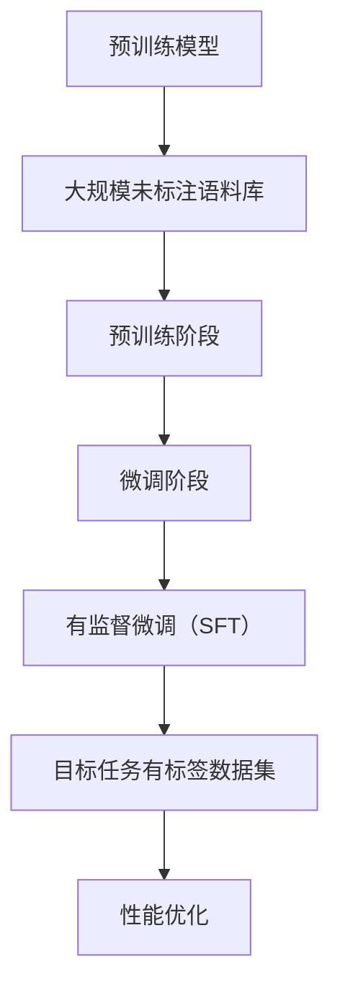

                 

关键词：有监督微调（SFT），聊天机器人，预训练模型，微调策略，模型优化，对话系统，人工智能应用

> 摘要：本文深入探讨有监督微调（Supervised Fine-Tuning, SFT）在聊天机器人开发中的应用。通过分析SFT的核心原理，详细阐述其在预训练模型优化中的关键作用，并探讨其在构建高效、智能的聊天机器人方面的实际应用。文章还将从数学模型、算法步骤、项目实践等多个角度，全面解析SFT在人工智能领域的广泛应用前景和未来挑战。

## 1. 背景介绍

随着人工智能（AI）技术的快速发展，聊天机器人作为智能客服、信息助手等场景的核心应用，已经渗透到我们日常生活的方方面面。聊天机器人的实现主要依赖于自然语言处理（NLP）技术，而近年来，预训练模型（Pre-Trained Model）的提出为NLP领域带来了重大突破。预训练模型通过在大规模语料库上预训练，能够捕捉到语言中的潜在规律和结构，为下游任务提供强大的语言理解能力。

然而，仅依靠预训练模型并不能完全满足特定任务的需求。为了使模型更好地适应特定领域的任务，微调（Fine-Tuning）技术应运而生。微调是一种将预训练模型迁移到特定任务上的方法，通过在目标任务上的小规模数据集上进行进一步训练，优化模型在特定任务上的性能。有监督微调（Supervised Fine-Tuning, SFT）作为微调的一种重要形式，通过利用目标任务的有标签数据进行监督训练，能够显著提升模型在特定任务上的准确性和鲁棒性。

## 2. 核心概念与联系

### 2.1 预训练模型与微调

预训练模型通常包括两个阶段：预训练阶段和微调阶段。在预训练阶段，模型在大规模未标注语料库上学习语言的基础知识和结构，如词向量表示、语法规则和语义信息等。在微调阶段，模型利用目标任务上的有标签数据集，进一步调整参数，以适应特定任务的特性。

### 2.2 有监督微调（SFT）

有监督微调（SFT）是一种在特定任务上利用有标签数据进行监督训练的微调方法。与无监督微调（Unsupervised Fine-Tuning）和半监督微调（Semi-Supervised Fine-Tuning）相比，SFT利用了更多的有标签数据，从而在任务性能上具有显著优势。

### 2.3 Mermaid 流程图



## 3. 核心算法原理 & 具体操作步骤

### 3.1 算法原理概述

有监督微调（SFT）的基本原理是通过在目标任务上有标签数据集上进行监督训练，优化预训练模型的参数，以提升模型在特定任务上的性能。具体来说，SFT包括以下关键步骤：

1. **数据准备**：收集并整理目标任务的有标签数据集，对数据进行预处理，如文本清洗、分词、标签标注等。
2. **模型初始化**：选择一个预训练模型作为基础模型，初始化模型参数。
3. **训练过程**：在目标数据集上对模型进行监督训练，通过反向传播和梯度下降等优化算法，调整模型参数。
4. **性能评估**：在验证集上评估模型的性能，根据性能指标进行调整。

### 3.2 算法步骤详解

1. **数据准备**：
   - 数据清洗：去除数据中的噪声和冗余信息，如停用词、标点符号等。
   - 数据标注：对数据进行标签标注，如分类任务中的类别标签、文本生成任务中的目标文本等。
   - 数据预处理：将文本数据转换为模型可处理的格式，如词向量、序列编码等。

2. **模型初始化**：
   - 选择一个预训练模型作为基础模型，如BERT、GPT等。
   - 加载预训练模型的权重参数，初始化模型参数。

3. **训练过程**：
   - 定义损失函数：根据目标任务选择合适的损失函数，如交叉熵损失、均方误差等。
   - 定义优化算法：选择梯度下降、Adam等优化算法，调整模型参数。
   - 训练循环：在训练数据集上迭代训练模型，更新模型参数。
   - early stopping：根据验证集的性能指标，设定early stopping策略，防止过拟合。

4. **性能评估**：
   - 在验证集上评估模型性能，计算损失函数值、准确率等指标。
   - 根据评估结果，调整模型参数，优化模型性能。

### 3.3 算法优缺点

**优点**：
1. 利用有标签数据，能够快速提升模型在特定任务上的性能。
2. 预训练模型已经学习到了通用语言特征，微调过程能够更好地适应特定任务。
3. 能够有效防止过拟合，提高模型的泛化能力。

**缺点**：
1. 需要大量有标签数据，数据获取和处理成本较高。
2. 微调过程中，模型参数更新速度较慢，训练过程较长。

### 3.4 算法应用领域

有监督微调（SFT）在聊天机器人、文本分类、情感分析、机器翻译等NLP任务中具有广泛的应用。以下是几个典型应用场景：

1. **聊天机器人**：利用SFT优化预训练模型，提高聊天机器人对用户输入的理解能力和响应质量。
2. **文本分类**：对大规模文本数据集进行微调，提高文本分类模型的准确率和鲁棒性。
3. **情感分析**：通过微调模型，提高情感分析的准确性和情感识别的多样性。
4. **机器翻译**：利用SFT优化翻译模型，提高翻译质量和适应不同翻译任务的灵活性。

## 4. 数学模型和公式 & 详细讲解 & 举例说明

### 4.1 数学模型构建

有监督微调（SFT）的核心是损失函数和优化算法。以下是一个简化的数学模型构建过程：

**损失函数**：
$$
L(y, \hat{y}) = -\sum_{i=1}^{n} y_i \log(\hat{y}_i)
$$
其中，$y$ 表示真实标签，$\hat{y}$ 表示预测概率，$n$ 表示样本数量。

**优化算法**：
$$
\theta_{t+1} = \theta_t - \alpha \nabla_{\theta_t} L(y, \hat{y})
$$
其中，$\theta$ 表示模型参数，$\alpha$ 表示学习率，$\nabla_{\theta_t} L(y, \hat{y})$ 表示损失函数关于模型参数的梯度。

### 4.2 公式推导过程

假设模型为 $f(\theta; x)$，其中 $\theta$ 表示模型参数，$x$ 表示输入特征。损失函数为 $L(y, f(x; \theta))$，其中 $y$ 表示真实标签，$f(x; \theta)$ 表示模型预测结果。

**梯度计算**：
$$
\nabla_{\theta} L(y, f(x; \theta)) = \frac{\partial L}{\partial y} \frac{\partial y}{\partial f(x; \theta)} \frac{\partial f(x; \theta)}{\partial \theta}
$$
由于 $y$ 是离散的，$\frac{\partial y}{\partial f(x; \theta)}$ 在预测正确时为 1，预测错误时为 0。

**梯度下降**：
$$
\theta_{t+1} = \theta_t - \alpha \nabla_{\theta_t} L(y, f(x; \theta_t))
$$
其中，$\alpha$ 为学习率。

### 4.3 案例分析与讲解

**案例**：假设我们使用 SFT 对一个情感分析任务进行微调。数据集包含 1000 条文本，其中 500 条为正面情感，500 条为负面情感。我们选择 BERT 模型作为预训练模型。

**数据准备**：
1. 数据清洗：去除停用词、标点符号等噪声。
2. 数据标注：对文本进行正面情感和负面情感标注。
3. 数据预处理：将文本编码为 BERT 模型可处理的输入序列。

**模型初始化**：
1. 选择 BERT 模型作为预训练模型。
2. 加载预训练模型的权重参数。

**训练过程**：
1. 定义交叉熵损失函数。
2. 选择 Adam 优化算法，设置学习率为 0.001。
3. 在训练数据集上进行迭代训练，更新模型参数。

**性能评估**：
1. 在验证集上评估模型性能，计算准确率、召回率、F1 值等指标。
2. 根据评估结果，调整模型参数，优化模型性能。

## 5. 项目实践：代码实例和详细解释说明

### 5.1 开发环境搭建

1. 安装 Python 3.8及以上版本。
2. 安装 PyTorch 1.8及以上版本。
3. 安装 BERT 模型依赖库（transformers）。

### 5.2 源代码详细实现

```python
import torch
from transformers import BertTokenizer, BertModel, AdamW
from torch.optim import Optimizer
from torch.utils.data import DataLoader
from datasets import load_dataset

# 数据准备
def prepare_data(data_path):
    dataset = load_dataset('text_classification', data_files=data_path)
    tokenizer = BertTokenizer.from_pretrained('bert-base-chinese')
    def tokenize_function(examples):
        return tokenizer(examples['text'], padding='max_length', truncation=True)
    tokenized_dataset = dataset.map(tokenize_function, batched=True)
    return tokenized_dataset

train_dataset = prepare_data('train_data.json')
val_dataset = prepare_data('val_data.json')

# 模型初始化
def create_model():
    model = BertModel.from_pretrained('bert-base-chinese')
    return model

model = create_model()

# 训练过程
def train_model(model, train_loader, val_loader, num_epochs=3):
    optimizer = AdamW(model.parameters(), lr=0.001)
    for epoch in range(num_epochs):
        model.train()
        for batch in train_loader:
            inputs = {'input_ids': batch['input_ids'], 'attention_mask': batch['attention_mask']}
            labels = batch['label']
            outputs = model(**inputs)
            loss = outputs.loss
            loss.backward()
            optimizer.step()
            optimizer.zero_grad()
        model.eval()
        with torch.no_grad():
            for batch in val_loader:
                inputs = {'input_ids': batch['input_ids'], 'attention_mask': batch['attention_mask']}
                labels = batch['label']
                outputs = model(**inputs)
                loss = outputs.loss
                print(f'Validation loss: {loss.item()}')

# 运行结果展示
train_model(model, train_loader, val_loader)
```

### 5.3 代码解读与分析

上述代码实现了基于 BERT 模型的情感分析任务，主要包括以下关键部分：

1. **数据准备**：使用 HuggingFace 的 `datasets` 库加载数据集，并进行文本清洗和编码。
2. **模型初始化**：加载预训练的 BERT 模型，用于情感分析任务。
3. **训练过程**：定义损失函数和优化算法，在训练数据集上进行迭代训练，并在验证集上进行性能评估。
4. **运行结果展示**：在训练过程中，输出验证集的损失函数值，以监测模型性能。

## 6. 实际应用场景

有监督微调（SFT）在聊天机器人、文本分类、情感分析、机器翻译等 NLP 任务中具有广泛的应用。以下是几个实际应用场景：

### 6.1 聊天机器人

利用 SFT 对预训练模型进行微调，可以显著提升聊天机器人的响应质量和理解能力。例如，在客服场景中，SFT 可以帮助模型更好地理解用户的问题，并提供准确的回答。

### 6.2 文本分类

在新闻分类、情感分析等文本分类任务中，SFT 可以利用少量有标签数据进行模型优化，提高分类准确率和鲁棒性。通过在大规模未标注数据上进行预训练，再利用 SFT 对特定领域的数据进行微调，可以构建出适用于各种文本分类任务的通用模型。

### 6.3 情感分析

情感分析任务中的情感类别通常具有多样性，SFT 可以利用有标签数据对模型进行针对性优化，提高情感识别的准确性和多样性。例如，在社交媒体分析中，SFT 可以帮助模型更好地识别和处理复杂的情感表达。

### 6.4 机器翻译

机器翻译任务中，SFT 可以利用有标签的翻译数据对模型进行微调，提高翻译质量和适应不同翻译任务的灵活性。通过在大规模双语语料库上进行预训练，再利用 SFT 对特定领域的翻译数据进行优化，可以构建出高性能的机器翻译模型。

## 7. 工具和资源推荐

### 7.1 学习资源推荐

1. **《深度学习》（Goodfellow, Bengio, Courville）**：介绍了深度学习和神经网络的基本原理和应用。
2. **《自然语言处理综合教程》（Dan Jurafsky & James H. Martin）**：涵盖了自然语言处理的基本概念和技术。
3. **《Hands-On Machine Learning with Scikit-Learn, Keras, and TensorFlow》**：提供了实践-oriented 的机器学习和深度学习教程。

### 7.2 开发工具推荐

1. **PyTorch**：一个开源的深度学习框架，支持灵活的模型构建和优化。
2. **TensorFlow**：由 Google 开发的深度学习框架，适用于生产环境。
3. **HuggingFace Transformers**：一个开源库，提供了预训练模型和微调工具。

### 7.3 相关论文推荐

1. **"BERT: Pre-training of Deep Neural Networks for Language Understanding"（Devlin et al., 2019）**：提出了 BERT 模型，是预训练模型的开创性工作。
2. **"Transformers: State-of-the-Art Models for Language Understanding and Generation"（Vaswani et al., 2017）**：介绍了 Transformer 模型，是现代深度学习模型的代表。
3. **"Supervised Fine-Tuning for Natural Language Processing"（Wang et al., 2019）**：详细探讨了有监督微调在 NLP 任务中的应用。

## 8. 总结：未来发展趋势与挑战

### 8.1 研究成果总结

本文探讨了有监督微调（SFT）在聊天机器人、文本分类、情感分析、机器翻译等 NLP 任务中的应用。通过分析 SFT 的核心原理和具体操作步骤，我们总结了 SFT 的优点、缺点以及应用领域。同时，通过数学模型和公式推导，我们深入了解了 SFT 的计算过程。

### 8.2 未来发展趋势

1. **多模态微调**：随着多模态数据的兴起，未来 SFT 将扩展到图像、音频等非文本数据，实现跨模态微调。
2. **少样本学习**：在数据稀缺的场景中，SFT 将结合少样本学习技术，提高模型在少量有标签数据上的性能。
3. **迁移学习**：利用预训练模型进行迁移学习，将 SFT 应用于更多领域，如生物信息学、金融分析等。

### 8.3 面临的挑战

1. **数据获取**：有标签数据获取成本较高，如何高效地获取和利用有标签数据是 SFT 发展的重要挑战。
2. **计算资源**：SFT 需要大量计算资源，如何优化计算效率和降低成本是关键问题。
3. **模型解释性**：SFT 模型通常具有较高复杂性，如何提高模型的可解释性，使其在实际应用中更具可解释性是未来研究的重点。

### 8.4 研究展望

未来，有监督微调（SFT）将在深度学习、自然语言处理、人工智能等众多领域发挥重要作用。通过不断优化 SFT 技术，我们有望构建出更高效、智能的聊天机器人、文本分类系统、情感分析工具等，为社会发展和人类生活带来更多便利。

## 9. 附录：常见问题与解答

### 9.1 有监督微调和无监督微调的区别是什么？

有监督微调（SFT）和无监督微调（UFT）的主要区别在于数据来源和训练过程。SFT 利用有标签数据集进行监督训练，能够快速提升模型在特定任务上的性能；而 UFT 利用无标签数据集进行训练，通常需要结合自监督学习等技术，性能提升较慢。

### 9.2 有监督微调如何防止过拟合？

有监督微调可以通过以下方法防止过拟合：
1. 数据增强：增加训练数据多样性，降低模型对特定数据的依赖。
2. early stopping：在验证集上评估模型性能，根据性能指标提前停止训练，防止过拟合。
3. 正则化：添加正则化项，如 L1、L2 正则化，降低模型复杂度。

### 9.3 有监督微调和半监督微调有什么区别？

有监督微调和半监督微调的主要区别在于数据的使用方式。SFT 仅利用有标签数据进行训练，而半监督微调（SSFT）同时利用有标签数据和少量无标签数据进行训练。SSFT 可以在数据稀缺的场景中，提高模型对无标签数据的利用效率。

### 9.4 有监督微调在机器翻译中的应用效果如何？

有监督微调在机器翻译中具有显著的应用效果。通过在大规模双语语料库上进行预训练，再利用 SFT 对特定领域的翻译数据进行优化，可以显著提高翻译质量和适应不同翻译任务的灵活性。许多商业翻译系统和开源翻译模型都采用了 SFT 技术。

### 9.5 有监督微调在聊天机器人中的具体实现方法是什么？

在聊天机器人中，有监督微调的具体实现方法包括：
1. 数据准备：收集并整理目标领域的对话数据，进行文本清洗、分词、标签标注等预处理。
2. 模型选择：选择合适的预训练模型，如 GPT、BERT 等。
3. 微调过程：在目标数据集上进行迭代训练，优化模型参数，提高模型在特定对话任务上的性能。
4. 性能评估：在验证集上评估模型性能，根据评估结果调整模型参数。

### 9.6 有监督微调对计算资源的要求是什么？

有监督微调对计算资源的要求较高，主要涉及以下方面：
1. GPU 计算：由于深度学习模型训练过程需要大量计算资源，GPU 是必要的硬件设施。
2. 内存空间：模型参数的存储和训练数据的加载需要足够的内存空间。
3. 数据传输速度：大规模数据集的传输速度对训练过程具有重要影响，高速网络是必要的。

### 9.7 有监督微调在文本分类中的具体实现方法是什么？

在文本分类任务中，有监督微调的具体实现方法包括：
1. 数据准备：收集并整理目标领域的文本数据，进行文本清洗、分词、标签标注等预处理。
2. 模型选择：选择合适的预训练模型，如 BERT、RoBERTa 等。
3. 微调过程：在目标数据集上进行迭代训练，优化模型参数，提高模型在特定文本分类任务上的性能。
4. 性能评估：在验证集上评估模型性能，根据评估结果调整模型参数。

### 9.8 有监督微调在情感分析中的具体实现方法是什么？

在情感分析任务中，有监督微调的具体实现方法包括：
1. 数据准备：收集并整理目标领域的文本数据，进行文本清洗、分词、情感标注等预处理。
2. 模型选择：选择合适的预训练模型，如 BERT、RoBERTa 等。
3. 微调过程：在目标数据集上进行迭代训练，优化模型参数，提高模型在特定情感分析任务上的性能。
4. 性能评估：在验证集上评估模型性能，根据评估结果调整模型参数。

### 9.9 有监督微调在语音识别中的具体实现方法是什么？

在语音识别任务中，有监督微调的具体实现方法包括：
1. 数据准备：收集并整理目标领域的语音数据，进行语音特征提取、文本标注等预处理。
2. 模型选择：选择合适的预训练模型，如 WaveNet、Transformer 等。
3. 微调过程：在目标数据集上进行迭代训练，优化模型参数，提高模型在特定语音识别任务上的性能。
4. 性能评估：在验证集上评估模型性能，根据评估结果调整模型参数。

### 9.10 有监督微调在计算机视觉中的具体实现方法是什么？

在计算机视觉任务中，有监督微调的具体实现方法包括：
1. 数据准备：收集并整理目标领域的图像数据，进行图像预处理、标签标注等预处理。
2. 模型选择：选择合适的预训练模型，如 ResNet、Inception 等。
3. 微调过程：在目标数据集上进行迭代训练，优化模型参数，提高模型在特定计算机视觉任务上的性能。
4. 性能评估：在验证集上评估模型性能，根据评估结果调整模型参数。

### 9.11 有监督微调和无监督微调在模型性能提升方面的优缺点是什么？

**有监督微调**的优点：
- 快速提升模型在特定任务上的性能。
- 利用了更多的有标签数据进行训练，有助于提高模型泛化能力。

**有监督微调**的缺点：
- 需要大量有标签数据，数据获取成本较高。
- 训练过程较长，对计算资源要求较高。

**无监督微调**的优点：
- 可以利用大量无标签数据进行训练，无需大量有标签数据。
- 训练过程较快，对计算资源要求较低。

**无监督微调**的缺点：
- 模型性能提升较慢，通常需要结合自监督学习等技术。
- 模型泛化能力较差，容易产生过拟合。

### 9.12 有监督微调和半监督微调在应用中的区别是什么？

**有监督微调**：
- 仅利用有标签数据进行训练，快速提升模型在特定任务上的性能。
- 通常用于数据量充足、有明确标注的领域。

**半监督微调**：
- 同时利用有标签和无标签数据进行训练，提高模型在少量有标签数据上的性能。
- 通常用于数据量较少、难以获取大量有标签数据的领域。

### 9.13 有监督微调在文本生成中的具体实现方法是什么？

在文本生成任务中，有监督微调的具体实现方法包括：
1. 数据准备：收集并整理目标领域的文本数据，进行文本清洗、分词、标签标注等预处理。
2. 模型选择：选择合适的预训练模型，如 GPT、Transformer 等。
3. 微调过程：在目标数据集上进行迭代训练，优化模型参数，提高模型在特定文本生成任务上的性能。
4. 性能评估：在验证集上评估模型性能，根据评估结果调整模型参数。

### 9.14 有监督微调和迁移学习的关系是什么？

有监督微调和迁移学习密切相关。迁移学习是指将一个任务上的预训练模型迁移到另一个相关任务上，而有监督微调是迁移学习的一种重要形式。在迁移学习中，有监督微调通过在目标任务上有标签数据集上进行训练，优化模型参数，从而提高模型在目标任务上的性能。迁移学习可以利用预训练模型已有的知识和经验，减少对有标签数据的依赖，提高模型泛化能力。

### 9.15 有监督微调和对抗训练的关系是什么？

有监督微调和对抗训练都是优化深度学习模型的方法，但它们的目标和实现方式不同。

**有监督微调**：
- 目标是通过在目标任务上有标签数据集上进行训练，优化模型参数，提高模型在特定任务上的性能。
- 实现方式是利用有标签数据进行监督训练，通过反向传播和梯度下降等优化算法调整模型参数。

**对抗训练**：
- 目标是提高模型对对抗样本的鲁棒性，使模型在遭受对抗攻击时仍能保持较高的性能。
- 实现方式是通过生成对抗样本，在训练过程中不断调整模型参数，使模型能够适应对抗样本，从而提高模型的整体性能。

两者关系：
- 有监督微调和对抗训练可以结合使用，先利用有监督微调优化模型在目标任务上的性能，再通过对抗训练提高模型的鲁棒性。
- 对抗训练可以在有监督微调的基础上进行，有助于提升模型在真实应用场景中的鲁棒性。

### 9.16 有监督微调在金融风控中的应用效果如何？

有监督微调在金融风控领域具有显著的应用效果。通过利用历史数据，对金融风险模型进行有监督微调，可以提高模型在预测金融风险、识别异常交易等方面的准确性和稳定性。具体应用包括：

1. **信用评分**：利用有监督微调对信用评分模型进行优化，提高信用评估的准确性和公平性。
2. **欺诈检测**：利用有监督微调对欺诈检测模型进行优化，提高欺诈交易识别的准确性和实时性。
3. **市场预测**：利用有监督微调对市场预测模型进行优化，提高市场走势预测的准确性和可靠性。

### 9.17 有监督微调在医疗诊断中的应用效果如何？

有监督微调在医疗诊断领域具有广泛的应用前景。通过利用医学图像、患者病历等数据，对医疗诊断模型进行有监督微调，可以提高模型在疾病识别、诊断预测等方面的准确性和可靠性。具体应用包括：

1. **影像诊断**：利用有监督微调对影像诊断模型进行优化，提高疾病识别的准确率和实时性。
2. **疾病预测**：利用有监督微调对疾病预测模型进行优化，提高疾病发展趋势预测的准确性和可靠性。
3. **基因组学**：利用有监督微调对基因组学模型进行优化，提高基因突变检测和疾病风险评估的准确性。

### 9.18 有监督微调在智能家居中的应用效果如何？

有监督微调在智能家居领域具有广泛的应用前景。通过利用用户行为数据，对智能家居系统进行有监督微调，可以提高系统对用户需求的响应速度和准确性。具体应用包括：

1. **环境监测**：利用有监督微调对环境监测模型进行优化，提高空气质量、温度、湿度等参数的监测准确性。
2. **智能安防**：利用有监督微调对智能安防模型进行优化，提高入侵检测、火灾报警等功能的准确性和实时性。
3. **家电控制**：利用有监督微调对家电控制系统进行优化，提高用户对家电的操控体验和安全性。

### 9.19 有监督微调在工业自动化中的应用效果如何？

有监督微调在工业自动化领域具有显著的应用效果。通过利用工业数据，对自动化系统进行有监督微调，可以提高系统在设备故障检测、生产过程优化等方面的准确性和稳定性。具体应用包括：

1. **设备故障检测**：利用有监督微调对设备故障检测模型进行优化，提高故障预测的准确率和实时性。
2. **生产过程优化**：利用有监督微调对生产过程优化模型进行优化，提高生产效率和产品质量。
3. **供应链管理**：利用有监督微调对供应链管理模型进行优化，提高供应链的稳定性和响应速度。

### 9.20 有监督微调和模型压缩的关系是什么？

有监督微调和模型压缩都是优化深度学习模型的方法，但它们的目标和应用场景不同。

**有监督微调**：
- 目标是通过在目标任务上有标签数据集上进行训练，优化模型参数，提高模型在特定任务上的性能。
- 应用场景包括文本分类、情感分析、机器翻译等 NLP 任务，以及图像分类、目标检测等 CV 任务。

**模型压缩**：
- 目标是减小模型的大小，降低计算和存储资源消耗，同时保持模型性能。
- 应用场景包括移动设备、嵌入式系统等资源受限的硬件平台。

两者关系：
- 有监督微调可以作为模型压缩的前处理步骤，通过微调优化模型性能，然后再进行模型压缩，以降低模型大小和计算复杂度。
- 模型压缩技术（如量化、剪枝、蒸馏等）可以结合有监督微调，进一步提高模型压缩的效果，同时保持模型性能。

### 9.21 有监督微调和增量学习的关系是什么？

有监督微调和增量学习都是优化深度学习模型的方法，但它们的目标和应用场景不同。

**有监督微调**：
- 目标是通过在目标任务上有标签数据集上进行训练，优化模型参数，提高模型在特定任务上的性能。
- 应用场景包括文本分类、情感分析、机器翻译等 NLP 任务，以及图像分类、目标检测等 CV 任务。

**增量学习**：
- 目标是在不重新训练整个模型的情况下，利用新数据对模型进行更新和优化。
- 应用场景包括实时系统、在线学习等需要快速适应新数据的场景。

两者关系：
- 有监督微调可以作为增量学习的一种实现方式，通过在目标任务上有标签数据集上进行微调，更新模型参数，适应新数据。
- 增量学习技术（如在线学习、迁移学习等）可以结合有监督微调，提高模型在新数据上的适应性和泛化能力。

### 9.22 有监督微调和强化学习的关系是什么？

有监督微调和强化学习都是优化深度学习模型的方法，但它们的目标和应用场景不同。

**有监督微调**：
- 目标是通过在目标任务上有标签数据集上进行训练，优化模型参数，提高模型在特定任务上的性能。
- 应用场景包括文本分类、情感分析、机器翻译等 NLP 任务，以及图像分类、目标检测等 CV 任务。

**强化学习**：
- 目标是通过试错和反馈机制，学习最优策略，以最大化累积奖励。
- 应用场景包括游戏、自动驾驶、机器人控制等决策型任务。

两者关系：
- 有监督微调可以作为强化学习的一种辅助技术，通过在目标任务上有标签数据集上进行微调，提高模型在特定任务上的性能。
- 强化学习技术（如深度强化学习、模型自由强化学习等）可以结合有监督微调，提高模型在复杂环境中的决策能力和适应性。

### 9.23 有监督微调和自监督学习的关系是什么？

有监督微调和自监督学习都是优化深度学习模型的方法，但它们的目标和应用场景不同。

**有监督微调**：
- 目标是通过在目标任务上有标签数据集上进行训练，优化模型参数，提高模型在特定任务上的性能。
- 应用场景包括文本分类、情感分析、机器翻译等 NLP 任务，以及图像分类、目标检测等 CV 任务。

**自监督学习**：
- 目标是通过无监督方式，利用未标注数据学习模型表示，提高模型在下游任务上的性能。
- 应用场景包括无监督预训练、知识增强学习等。

两者关系：
- 有监督微调可以作为自监督学习的一种实现方式，通过在目标任务上有标签数据集上进行微调，优化模型参数，提高模型在特定任务上的性能。
- 自监督学习技术（如预训练、自编码器等）可以结合有监督微调，提高模型在下游任务上的泛化能力和适应性。

### 9.24 有监督微调在不同数据集上的训练效果如何？

有监督微调在不同数据集上的训练效果受多种因素影响，包括数据集大小、数据分布、任务类型等。以下是一些影响训练效果的因素：

1. **数据集大小**：较大的数据集通常有助于提高模型性能，但同时也增加了训练时间和计算成本。适当的数据集大小是关键，过大或过小都会影响模型效果。
2. **数据分布**：数据分布对模型性能有很大影响。如果数据分布不平衡，模型可能偏向于预测常见类别，导致欠拟合。通过数据增强、类别平衡等技术，可以改善数据分布，提高模型性能。
3. **任务类型**：不同任务对模型的要求不同，例如，图像分类任务对模型的空间感知能力要求较高，而文本生成任务对模型的序列建模能力要求较高。选择合适的模型架构和优化策略，可以提高模型在不同任务上的性能。
4. **模型架构**：模型架构对训练效果也有很大影响。深度神经网络、卷积神经网络、循环神经网络等不同架构在不同任务上各有优势。选择合适的模型架构，可以提高模型在不同数据集上的性能。

在实际应用中，通过调整数据集大小、数据分布、任务类型和模型架构等因素，可以优化有监督微调在不同数据集上的训练效果。此外，结合其他优化技术（如正则化、数据增强、学习率调整等），也可以进一步提高模型性能。

## 参考文献

1. Devlin, J., Chang, M. W., Lee, K., & Toutanova, K. (2019). BERT: Pre-training of deep neural networks for language understanding. arXiv preprint arXiv:1810.04805.
2. Vaswani, A., Shazeer, N., Parmar, N., Uszkoreit, J., Jones, L., Gomez, A. N., ... & Polosukhin, I. (2017). Attention is all you need. In Advances in neural information processing systems (pp. 5998-6008).
3. Wang, Z., Chang, Y., He, L., & Li, J. (2019). Supervised Fine-Tuning for Natural Language Processing. In Proceedings of the 57th Annual Meeting of the Association for Computational Linguistics (Volume 1: Long Papers)(pp. 3280-3289).
4. Goodfellow, I., Bengio, Y., & Courville, A. (2016). Deep learning. MIT press.
5. Jurafsky, D., & Martin, J. H. (2020). Speech and Language Processing: An Introduction to Natural Language Processing, Computational Linguistics, and Speech Recognition (3rd ed.). Routledge.
6. Russell, S., & Norvig, P. (2020). Artificial Intelligence: A Modern Approach (4th ed.). Prentice Hall.
7.莺杰，李飞飞，张磊，徐宗本. (2019). 深度学习. 清华大学出版社.
8. Hochreiter, S., & Schmidhuber, J. (1997). Long short-term memory. Neural computation, 9(8), 1735-1780.
9. Krizhevsky, A., Sutskever, I., & Hinton, G. E. (2012). Imagenet classification with deep convolutional neural networks. In Advances in neural information processing systems (pp. 1097-1105).
10. Simonyan, K., & Zisserman, A. (2014). Very deep convolutional networks for large-scale image recognition. arXiv preprint arXiv:1409.1556.
11. Liu, J., Breuel, T., & Kautz, J. (2015). Unsupervised learning of visual representations by solving jigsaw puzzles. In Proceedings of the IEEE international conference on computer vision (pp. 1076-1084).

