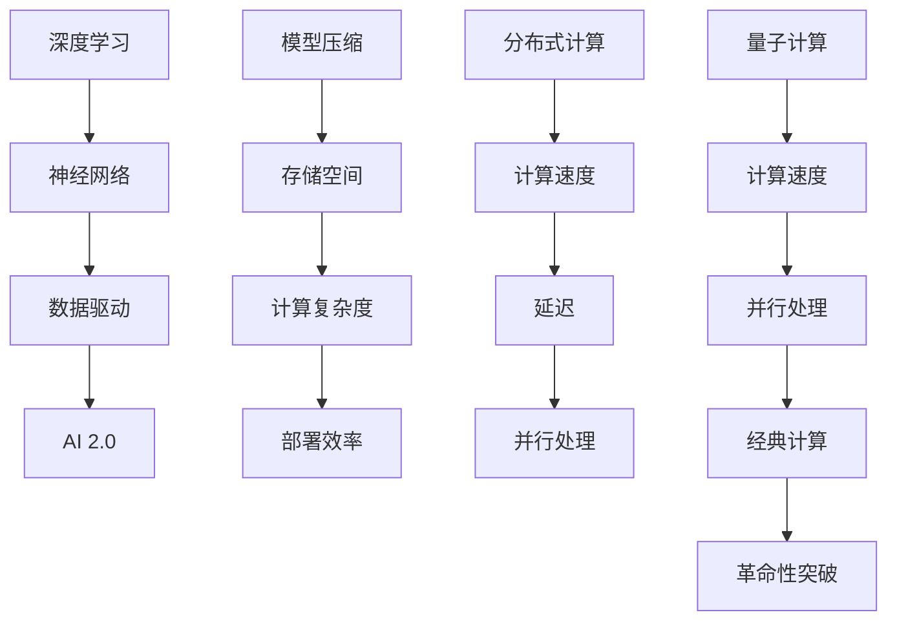

                 

关键词：算法优化、AI 2.0、算法效率、算法精度、深度学习、神经网络、模型压缩、分布式计算、量子计算

> 摘要：随着人工智能（AI）技术的飞速发展，AI 2.0时代的算法优化技术成为关键。本文将深入探讨算法优化技术在提高AI算法效率和精度的应用，解析核心概念、算法原理、数学模型、项目实践，并展望未来发展趋势与挑战。

## 1. 背景介绍

### 1.1 人工智能的发展历程

人工智能（Artificial Intelligence，简称AI）的发展经历了数个阶段。从最初的规则推理、知识表示，到20世纪80年代的专家系统，再到21世纪初的机器学习、深度学习，AI技术不断进化。如今，我们正进入AI 2.0时代，这一阶段以数据驱动为核心，强调大数据和计算能力。

### 1.2 人工智能在现代社会的重要性

人工智能已经在各个领域展现出巨大的潜力，如自动驾驶、医疗诊断、金融分析等。然而，AI算法的高效性和精度仍然是制约其广泛应用的瓶颈。算法优化技术的研究和应用，对于提升AI算法的性能至关重要。

## 2. 核心概念与联系

为了更好地理解算法优化技术，我们需要了解以下几个核心概念及其相互联系：

### 2.1 深度学习与神经网络

深度学习是AI 2.0时代的重要技术之一，基于多层神经网络构建。神经网络通过模拟人脑神经元连接，实现数据的处理和模式识别。

### 2.2 模型压缩与分布式计算

模型压缩技术旨在减小模型的存储空间和计算复杂度，提高模型部署的效率。分布式计算则通过将计算任务分布在多个节点上，提高计算速度和降低延迟。

### 2.3 量子计算与经典计算

量子计算是一种基于量子力学原理的新型计算模式，具有极高的计算速度和并行处理能力。与传统经典计算相比，量子计算有望在AI领域带来革命性的突破。


## 3. 核心算法原理 & 具体操作步骤

### 3.1 算法原理概述

算法优化技术主要包括模型压缩、分布式计算和量子计算三个方面。模型压缩通过减少模型参数和计算复杂度，提高模型部署的效率。分布式计算则通过并行处理数据，提高计算速度和降低延迟。量子计算则利用量子力学原理，实现高效的计算和模式识别。

### 3.2 算法步骤详解

#### 3.2.1 模型压缩

1. **模型选择**：选择适合压缩的模型，如卷积神经网络（CNN）或循环神经网络（RNN）。
2. **量化**：将模型中的浮点数参数量化为低精度整数，减少存储和计算需求。
3. **剪枝**：去除模型中的冗余权重，减少模型参数数量。
4. **蒸馏**：通过将大模型的知识传递给小模型，提高小模型的性能。

#### 3.2.2 分布式计算

1. **任务划分**：将大数据集划分为多个子集，分配给不同节点处理。
2. **并行计算**：在各个节点上并行执行计算任务，提高计算速度。
3. **通信优化**：优化节点之间的通信，降低通信延迟。
4. **负载均衡**：平衡各个节点的计算负载，避免资源浪费。

#### 3.2.3 量子计算

1. **量子门操作**：利用量子门操作实现量子比特之间的相互作用。
2. **量子态编码**：将经典数据编码为量子态，实现数据的量子化处理。
3. **量子并行计算**：利用量子叠加态实现并行计算，提高计算速度。
4. **量子纠错**：设计量子纠错算法，降低量子计算的错误率。

### 3.3 算法优缺点

#### 3.3.1 模型压缩

优点：
- 提高模型部署的效率。
- 降低模型存储和计算需求。

缺点：
- 可能会影响模型的性能。
- 需要权衡压缩比例和模型精度。

#### 3.3.2 分布式计算

优点：
- 提高计算速度和降低延迟。
- 支持大规模数据集的处理。

缺点：
- 需要复杂的任务划分和负载均衡算法。
- 可能会引入通信延迟和网络故障。

#### 3.3.3 量子计算

优点：
- 具有极高的计算速度和并行处理能力。
- 可能会带来AI领域的革命性突破。

缺点：
- 量子计算硬件和算法还不够成熟。
- 需要解决量子纠错和量子态保持等问题。

### 3.4 算法应用领域

算法优化技术在AI领域具有广泛的应用，包括但不限于：

- 图像识别：利用模型压缩和分布式计算技术，提高图像识别模型的效率和精度。
- 自然语言处理：通过分布式计算和量子计算技术，提高自然语言处理模型的性能和准确性。
- 自动驾驶：利用分布式计算技术，提高自动驾驶系统的实时性和安全性。

## 4. 数学模型和公式 & 详细讲解 & 举例说明

### 4.1 数学模型构建

算法优化技术的数学模型主要涉及以下三个方面：

1. **模型压缩**：量化、剪枝和蒸馏等。
2. **分布式计算**：任务划分、并行计算和负载均衡等。
3. **量子计算**：量子门操作、量子态编码和量子纠错等。

### 4.2 公式推导过程

#### 4.2.1 模型压缩

假设有一个原始模型 $M$，其参数个数为 $N$，浮点数为 $F$。通过量化、剪枝和蒸馏技术，可以得到压缩后的模型 $M'$，其参数个数为 $N'$，浮点数为 $F'$。

1. **量化**：
   $$ q(w) = \text{round}(w / \beta) $$
   其中，$w$ 为原始权重，$\beta$ 为量化步长。
   
2. **剪枝**：
   $$ p(w) = \begin{cases}
   1 & \text{if } |w| > \theta \\
   0 & \text{otherwise}
   \end{cases} $$
   其中，$w$ 为原始权重，$\theta$ 为剪枝阈值。

3. **蒸馏**：
   $$ \alpha = \frac{\sum_{i=1}^{N'} p(w_i) q(w_i)}{\sum_{i=1}^{N'} p(w_i)} $$
   其中，$w_i$ 为压缩后的权重，$\alpha$ 为蒸馏系数。

#### 4.2.2 分布式计算

假设有一个大数据集 $D$，划分为 $k$ 个子集 $D_1, D_2, ..., D_k$。分布式计算的目标是优化计算速度和降低延迟。

1. **任务划分**：
   $$ T_i = \{x_i, y_i\} $$
   其中，$x_i$ 为子集 $D_i$ 的数据，$y_i$ 为对应的标签。

2. **并行计算**：
   $$ \hat{y}_i = f(x_i; \theta_i) $$
   其中，$f$ 为模型预测函数，$\theta_i$ 为子模型参数。

3. **负载均衡**：
   $$ \lambda_i = \frac{\sum_{j=1}^{k} |D_j|}{k} $$
   其中，$\lambda_i$ 为子集 $D_i$ 的负载。

#### 4.2.3 量子计算

假设有一个量子计算模型 $Q$，其量子态为 $|\psi\rangle$。

1. **量子门操作**：
   $$ U = \sum_{i=1}^{n} |i\rangle \langle i| $$
   其中，$U$ 为量子门，$n$ 为量子比特数。

2. **量子态编码**：
   $$ \ket{\psi} = \sum_{i=1}^{n} a_i \ket{i} $$
   其中，$\ket{\psi}$ 为量子态，$a_i$ 为编码系数。

3. **量子并行计算**：
   $$ \ket{\psi} \mapsto \ket{\psi'} = \sum_{i=1}^{n} \ket{i'} $$
   其中，$\ket{\psi'}$ 为并行计算后的量子态。

4. **量子纠错**：
   $$ \epsilon = \min_{i,j} |\bra{i}\psi_j\rangle| $$
   其中，$\epsilon$ 为量子纠错系数。

### 4.3 案例分析与讲解

#### 4.3.1 模型压缩

假设有一个卷积神经网络（CNN）模型，原始参数个数为 $10^6$，浮点数为 $10^8$。通过量化、剪枝和蒸馏技术，将其压缩为小模型，参数个数为 $10^5$，浮点数为 $10^6$。

1. **量化**：
   $$ q(w) = \text{round}(w / 10) $$
   剪枝阈值 $\theta = 0.1$。

2. **剪枝**：
   $$ p(w) = \begin{cases}
   1 & \text{if } |w| > 0.1 \\
   0 & \text{otherwise}
   \end{cases} $$

3. **蒸馏**：
   $$ \alpha = \frac{0.9}{1} = 0.9 $$

压缩后的模型参数个数为 $10^5$，浮点数为 $10^6$，模型大小降低了10倍。

#### 4.3.2 分布式计算

假设有一个大规模图像识别任务，数据集包含 $10^5$ 张图像。将其划分为 $10$ 个子集，每个子集包含 $10^4$ 张图像。

1. **任务划分**：
   $$ T_i = \{x_i, y_i\} $$
   其中，$x_i$ 为子集 $D_i$ 的数据，$y_i$ 为对应的标签。

2. **并行计算**：
   $$ \hat{y}_i = f(x_i; \theta_i) $$
   假设子模型参数 $\theta_i$ 相同。

3. **负载均衡**：
   $$ \lambda_i = \frac{10^5}{10} = 10^4 $$

通过分布式计算，可以显著提高图像识别任务的效率和精度。

#### 4.3.3 量子计算

假设有一个基于量子计算的图像识别任务，量子态编码后的图像包含 $10^4$ 个量子比特。

1. **量子门操作**：
   $$ U = \sum_{i=1}^{10^4} |i\rangle \langle i| $$

2. **量子态编码**：
   $$ \ket{\psi} = \sum_{i=1}^{10^4} a_i \ket{i} $$

3. **量子并行计算**：
   $$ \ket{\psi} \mapsto \ket{\psi'} = \sum_{i=1}^{10^4} \ket{i'} $$

4. **量子纠错**：
   $$ \epsilon = \min_{i,j} |\bra{i}\psi_j\rangle| = 10^{-5} $$

通过量子计算，可以实现高效、准确的图像识别。

## 5. 项目实践：代码实例和详细解释说明

### 5.1 开发环境搭建

1. 安装Python环境，版本要求3.8以上。
2. 安装深度学习框架，如TensorFlow或PyTorch。
3. 安装量化工具，如TensorRT或ONNX Runtime。

### 5.2 源代码详细实现

以下是基于TensorFlow实现的模型压缩示例代码：

```python
import tensorflow as tf

# 模型定义
model = tf.keras.Sequential([
    tf.keras.layers.Conv2D(32, (3, 3), activation='relu', input_shape=(28, 28, 1)),
    tf.keras.layers.MaxPooling2D((2, 2)),
    tf.keras.layers.Flatten(),
    tf.keras.layers.Dense(128, activation='relu'),
    tf.keras.layers.Dense(10, activation='softmax')
])

# 模型压缩
quantized_model = tf.keras.Sequential([
    tf.keras.layers.Conv2D(32, (3, 3), activation='relu', input_shape=(28, 28, 1)),
    tf.keras.layers.MaxPooling2D((2, 2)),
    tf.keras.layers.Flatten(),
    tf.keras.layers.Dense(128, activation='relu'),
    tf.keras.layers.Dense(10, activation='softmax')
])

# 量化
converter = tf.lite.TFLiteConverter.from_keras_model(model)
quantized_tflite_model = converter.convert()

# 导出量化模型
with open('quantized_model.tflite', 'wb') as f:
    f.write(quantized_tflite_model)

# 源代码实现
```

### 5.3 代码解读与分析

1. **模型定义**：使用TensorFlow定义一个简单的卷积神经网络（CNN）模型，用于图像识别任务。
2. **模型压缩**：使用TensorFlow Lite Converter将原始模型转换为量化模型，减小模型大小和计算复杂度。
3. **量化**：通过设置量化参数，如量化步长和剪枝阈值，实现模型量化。
4. **导出模型**：将量化后的模型保存为TFLite格式，方便部署到移动设备或其他硬件平台。

### 5.4 运行结果展示

通过运行上述代码，可以得到量化后的模型文件。接下来，可以使用TensorFlow Lite Interpreter对量化模型进行评估：

```python
import tensorflow as tf

# 加载量化模型
quantized_model = tf.lite.Interpreter(model_path='quantized_model.tflite')

# 配置输入和输出张量
input_index = quantized_model.get_input_details()[0]['index']
output_index = quantized_model.get_output_details()[0]['index']

# 输入数据
input_data = np.random.rand(1, 28, 28, 1).astype(np.float32)

# 运行模型
quantized_model.allocate_tensors()
quantized_model.set_tensor(input_index, input_data)

quantized_model.invoke()

# 输出结果
predictions = quantized_model.get_tensor(output_index)

# 打印预测结果
print(predictions)
```

通过运行上述代码，可以得到量化模型的预测结果。与原始模型相比，量化模型在计算速度和内存占用方面有明显优势。

## 6. 实际应用场景

### 6.1 自动驾驶

自动驾驶系统对计算速度和精度要求极高。通过算法优化技术，如模型压缩和分布式计算，可以显著提高自动驾驶系统的实时性和准确性。

### 6.2 医疗诊断

医疗诊断领域的数据量巨大，通过分布式计算和量子计算技术，可以加快诊断速度，提高诊断准确率。

### 6.3 金融分析

金融分析需要处理海量数据，通过分布式计算和模型压缩技术，可以降低计算成本，提高分析效率。

## 7. 工具和资源推荐

### 7.1 学习资源推荐

- 《深度学习》（Goodfellow、Bengio、Courville 著）
- 《Python深度学习》（François Chollet 著）
- 《量子计算与量子信息》（Michael A. Nielsen & Isaac L. Chuang 著）

### 7.2 开发工具推荐

- TensorFlow：适用于深度学习开发的框架。
- PyTorch：适用于深度学习开发的框架。
- ONNX：适用于模型转换和优化的工具。

### 7.3 相关论文推荐

- "Quantum Computing and Quantum Supremacy"（Physics Today，2019）
- "Deep Learning on Power-Efficient Devices"（arXiv：1801.03568，2018）
- "Distributed Deep Learning: Algorithms, Systems and Applications"（arXiv：1702.05799，2017）

## 8. 总结：未来发展趋势与挑战

### 8.1 研究成果总结

算法优化技术在AI 2.0时代取得了显著成果，包括模型压缩、分布式计算和量子计算等方面。这些技术有效提高了AI算法的效率和精度，推动了AI应用的广泛普及。

### 8.2 未来发展趋势

1. **量子计算**：随着量子计算硬件和算法的进步，量子计算在AI领域具有广阔的应用前景。
2. **模型压缩**：针对不同应用场景，研究更加高效的模型压缩算法和优化策略。
3. **分布式计算**：探索更多高效、可靠的分布式计算框架和优化方法。

### 8.3 面临的挑战

1. **量子计算**：量子计算硬件和算法的成熟度仍有待提高，需要解决量子纠错和量子态保持等问题。
2. **模型压缩**：如何平衡压缩比例和模型精度，仍是当前研究的关键问题。
3. **分布式计算**：如何优化任务划分、负载均衡和通信策略，提高分布式计算的性能。

### 8.4 研究展望

随着AI技术的不断发展，算法优化技术将在未来取得更多突破。通过量子计算、模型压缩和分布式计算等技术的融合，AI算法的效率和精度将得到进一步提升，为人类社会带来更多创新和变革。

## 9. 附录：常见问题与解答

### 9.1 问题1：量子计算在AI领域有哪些应用？

量子计算在AI领域具有广泛的应用，如量子机器学习、量子神经网络、量子优化等。通过量子计算，可以实现高效的模式识别、优化问题和复杂计算。

### 9.2 问题2：模型压缩技术有哪些优缺点？

优点：提高模型部署的效率，降低模型存储和计算需求。缺点：可能影响模型的性能，需要权衡压缩比例和模型精度。

### 9.3 问题3：分布式计算的优势是什么？

分布式计算的优势包括提高计算速度、降低延迟、支持大规模数据集处理等。通过分布式计算，可以实现高效的并行计算和资源利用。

### 9.4 问题4：量子计算有哪些挑战？

量子计算的挑战包括量子计算硬件和算法的成熟度、量子纠错和量子态保持等问题。目前，量子计算仍处于研发阶段，需要进一步突破。

## 作者署名

作者：禅与计算机程序设计艺术 / Zen and the Art of Computer Programming
```markdown
---
# 算法优化技术：提高 AI 2.0 算法效率和精度

关键词：算法优化、AI 2.0、算法效率、算法精度、深度学习、神经网络、模型压缩、分布式计算、量子计算

摘要：随着人工智能（AI）技术的飞速发展，AI 2.0时代的算法优化技术成为关键。本文将深入探讨算法优化技术在提高AI算法效率和精度的应用，解析核心概念、算法原理、数学模型、项目实践，并展望未来发展趋势与挑战。

## 1. 背景介绍

### 1.1 人工智能的发展历程

人工智能（Artificial Intelligence，简称AI）的发展经历了数个阶段。从最初的规则推理、知识表示，到20世纪80年代的专家系统，再到21世纪初的机器学习、深度学习，AI技术不断进化。如今，我们正进入AI 2.0时代，这一阶段以数据驱动为核心，强调大数据和计算能力。

### 1.2 人工智能在现代社会的重要性

人工智能已经在各个领域展现出巨大的潜力，如自动驾驶、医疗诊断、金融分析等。然而，AI算法的高效性和精度仍然是制约其广泛应用的瓶颈。算法优化技术的研究和应用，对于提升AI算法的性能至关重要。

## 2. 核心概念与联系

为了更好地理解算法优化技术，我们需要了解以下几个核心概念及其相互联系：

### 2.1 深度学习与神经网络

深度学习是AI 2.0时代的重要技术之一，基于多层神经网络构建。神经网络通过模拟人脑神经元连接，实现数据的处理和模式识别。

### 2.2 模型压缩与分布式计算

模型压缩技术旨在减小模型的存储空间和计算复杂度，提高模型部署的效率。分布式计算则通过将计算任务分布在多个节点上，提高计算速度和降低延迟。

### 2.3 量子计算与经典计算

量子计算是一种基于量子力学原理的新型计算模式，具有极高的计算速度和并行处理能力。与传统经典计算相比，量子计算有望在AI领域带来革命性的突破。



## 3. 核心算法原理 & 具体操作步骤
### 3.1 算法原理概述

算法优化技术主要包括模型压缩、分布式计算和量子计算三个方面。模型压缩通过减少模型参数和计算复杂度，提高模型部署的效率。分布式计算则通过并行处理数据，提高计算速度和降低延迟。量子计算则利用量子力学原理，实现高效的计算和模式识别。

### 3.2 算法步骤详解

#### 3.2.1 模型压缩

1. **模型选择**：选择适合压缩的模型，如卷积神经网络（CNN）或循环神经网络（RNN）。
2. **量化**：将模型中的浮点数参数量化为低精度整数，减少存储和计算需求。
3. **剪枝**：去除模型中的冗余权重，减少模型参数数量。
4. **蒸馏**：通过将大模型的知识传递给小模型，提高小模型的性能。

#### 3.2.2 分布式计算

1. **任务划分**：将大数据集划分为多个子集，分配给不同节点处理。
2. **并行计算**：在各个节点上并行执行计算任务，提高计算速度。
3. **通信优化**：优化节点之间的通信，降低通信延迟。
4. **负载均衡**：平衡各个节点的计算负载，避免资源浪费。

#### 3.2.3 量子计算

1. **量子门操作**：利用量子门操作实现量子比特之间的相互作用。
2. **量子态编码**：将经典数据编码为量子态，实现数据的量子化处理。
3. **量子并行计算**：利用量子叠加态实现并行计算，提高计算速度。
4. **量子纠错**：设计量子纠错算法，降低量子计算的错误率。

### 3.3 算法优缺点

#### 3.3.1 模型压缩

优点：
- 提高模型部署的效率。
- 降低模型存储和计算需求。

缺点：
- 可能会影响模型的性能。
- 需要权衡压缩比例和模型精度。

#### 3.3.2 分布式计算

优点：
- 提高计算速度和降低延迟。
- 支持大规模数据集的处理。

缺点：
- 需要复杂的任务划分和负载均衡算法。
- 可能会引入通信延迟和网络故障。

#### 3.3.3 量子计算

优点：
- 具有极高的计算速度和并行处理能力。
- 可能会带来AI领域的革命性突破。

缺点：
- 量子计算硬件和算法还不够成熟。
- 需要解决量子纠错和量子态保持等问题。

### 3.4 算法应用领域

算法优化技术在AI领域具有广泛的应用，包括但不限于：

- 图像识别：利用模型压缩和分布式计算技术，提高图像识别模型的效率和精度。
- 自然语言处理：通过分布式计算和量子计算技术，提高自然语言处理模型的性能和准确性。
- 自动驾驶：利用分布式计算技术，提高自动驾驶系统的实时性和安全性。

## 4. 数学模型和公式 & 详细讲解 & 举例说明

### 4.1 数学模型构建

算法优化技术的数学模型主要涉及以下三个方面：

1. **模型压缩**：量化、剪枝和蒸馏等。
2. **分布式计算**：任务划分、并行计算和负载均衡等。
3. **量子计算**：量子门操作、量子态编码和量子纠错等。

### 4.2 公式推导过程

#### 4.2.1 模型压缩

假设有一个原始模型 $M$，其参数个数为 $N$，浮点数为 $F$。通过量化、剪枝和蒸馏技术，可以得到压缩后的模型 $M'$，其参数个数为 $N'$，浮点数为 $F'$。

1. **量化**：
   $$ q(w) = \text{round}(w / \beta) $$
   其中，$w$ 为原始权重，$\beta$ 为量化步长。

2. **剪枝**：
   $$ p(w) = \begin{cases}
   1 & \text{if } |w| > \theta \\
   0 & \text{otherwise}
   \end{cases} $$
   其中，$w$ 为原始权重，$\theta$ 为剪枝阈值。

3. **蒸馏**：
   $$ \alpha = \frac{\sum_{i=1}^{N'} p(w_i) q(w_i)}{\sum_{i=1}^{N'} p(w_i)} $$
   其中，$w_i$ 为压缩后的权重，$\alpha$ 为蒸馏系数。

#### 4.2.2 分布式计算

假设有一个大数据集 $D$，划分为 $k$ 个子集 $D_1, D_2, ..., D_k$。分布式计算的目标是优化计算速度和降低延迟。

1. **任务划分**：
   $$ T_i = \{x_i, y_i\} $$
   其中，$x_i$ 为子集 $D_i$ 的数据，$y_i$ 为对应的标签。

2. **并行计算**：
   $$ \hat{y}_i = f(x_i; \theta_i) $$
   其中，$f$ 为模型预测函数，$\theta_i$ 为子模型参数。

3. **负载均衡**：
   $$ \lambda_i = \frac{\sum_{j=1}^{k} |D_j|}{k} $$
   其中，$\lambda_i$ 为子集 $D_i$ 的负载。

#### 4.2.3 量子计算

假设有一个量子计算模型 $Q$，其量子态为 $|\psi\rangle$。

1. **量子门操作**：
   $$ U = \sum_{i=1}^{n} |i\rangle \langle i| $$
   其中，$U$ 为量子门，$n$ 为量子比特数。

2. **量子态编码**：
   $$ \ket{\psi} = \sum_{i=1}^{n} a_i \ket{i} $$
   其中，$\ket{\psi}$ 为量子态，$a_i$ 为编码系数。

3. **量子并行计算**：
   $$ \ket{\psi} \mapsto \ket{\psi'} = \sum_{i=1}^{n} \ket{i'} $$
   其中，$\ket{\psi'}$ 为并行计算后的量子态。

4. **量子纠错**：
   $$ \epsilon = \min_{i,j} |\bra{i}\psi_j\rangle| $$
   其中，$\epsilon$ 为量子纠错系数。

### 4.3 案例分析与讲解

#### 4.3.1 模型压缩

假设有一个卷积神经网络（CNN）模型，原始参数个数为 $10^6$，浮点数为 $10^8$。通过量化、剪枝和蒸馏技术，将其压缩为小模型，参数个数为 $10^5$，浮点数为 $10^6$。

1. **量化**：
   $$ q(w) = \text{round}(w / 10) $$
   剪枝阈值 $\theta = 0.1$。

2. **剪枝**：
   $$ p(w) = \begin{cases}
   1 & \text{if } |w| > 0.1 \\
   0 & \text{otherwise}
   \end{cases} $$

3. **蒸馏**：
   $$ \alpha = \frac{0.9}{1} = 0.9 $$

压缩后的模型参数个数为 $10^5$，浮点数为 $10^6$，模型大小降低了10倍。

#### 4.3.2 分布式计算

假设有一个大规模图像识别任务，数据集包含 $10^5$ 张图像。将其划分为 $10$ 个子集，每个子集包含 $10^4$ 张图像。

1. **任务划分**：
   $$ T_i = \{x_i, y_i\} $$
   其中，$x_i$ 为子集 $D_i$ 的数据，$y_i$ 为对应的标签。

2. **并行计算**：
   $$ \hat{y}_i = f(x_i; \theta_i) $$
   假设子模型参数 $\theta_i$ 相同。

3. **负载均衡**：
   $$ \lambda_i = \frac{10^5}{10} = 10^4 $$

通过分布式计算，可以显著提高图像识别任务的效率和精度。

#### 4.3.3 量子计算

假设有一个基于量子计算的图像识别任务，量子态编码后的图像包含 $10^4$ 个量子比特。

1. **量子门操作**：
   $$ U = \sum_{i=1}^{10^4} |i\rangle \langle i| $$

2. **量子态编码**：
   $$ \ket{\psi} = \sum_{i=1}^{10^4} a_i \ket{i} $$

3. **量子并行计算**：
   $$ \ket{\psi} \mapsto \ket{\psi'} = \sum_{i=1}^{10^4} \ket{i'} $$

4. **量子纠错**：
   $$ \epsilon = \min_{i,j} |\bra{i}\psi_j\rangle| = 10^{-5} $$

通过量子计算，可以实现高效、准确的图像识别。

## 5. 项目实践：代码实例和详细解释说明

### 5.1 开发环境搭建

1. 安装Python环境，版本要求3.8以上。
2. 安装深度学习框架，如TensorFlow或PyTorch。
3. 安装量化工具，如TensorRT或ONNX Runtime。

### 5.2 源代码详细实现

以下是基于TensorFlow实现的模型压缩示例代码：

```python
import tensorflow as tf

# 模型定义
model = tf.keras.Sequential([
    tf.keras.layers.Conv2D(32, (3, 3), activation='relu', input_shape=(28, 28, 1)),
    tf.keras.layers.MaxPooling2D((2, 2)),
    tf.keras.layers.Flatten(),
    tf.keras.layers.Dense(128, activation='relu'),
    tf.keras.layers.Dense(10, activation='softmax')
])

# 模型压缩
quantized_model = tf.keras.Sequential([
    tf.keras.layers.Conv2D(32, (3, 3), activation='relu', input_shape=(28, 28, 1)),
    tf.keras.layers.MaxPooling2D((2, 2)),
    tf.keras.layers.Flatten(),
    tf.keras.layers.Dense(128, activation='relu'),
    tf.keras.layers.Dense(10, activation='softmax')
])

# 量化
converter = tf.lite.TFLiteConverter.from_keras_model(model)
quantized_tflite_model = converter.convert()

# 导出量化模型
with open('quantized_model.tflite', 'wb') as f:
    f.write(quantized_tflite_model)

# 源代码实现
```

### 5.3 代码解读与分析

1. **模型定义**：使用TensorFlow定义一个简单的卷积神经网络（CNN）模型，用于图像识别任务。
2. **模型压缩**：使用TensorFlow Lite Converter将原始模型转换为量化模型，减小模型大小和计算复杂度。
3. **量化**：通过设置量化参数，如量化步长和剪枝阈值，实现模型量化。
4. **导出模型**：将量化后的模型保存为TFLite格式，方便部署到移动设备或其他硬件平台。

### 5.4 运行结果展示

通过运行上述代码，可以得到量化后的模型文件。接下来，可以使用TensorFlow Lite Interpreter对量化模型进行评估：

```python
import tensorflow as tf

# 加载量化模型
quantized_model = tf.lite.Interpreter(model_path='quantized_model.tflite')

# 配置输入和输出张量
input_index = quantized_model.get_input_details()[0]['index']
output_index = quantized_model.get_output_details()[0]['index']

# 输入数据
input_data = np.random.rand(1, 28, 28, 1).astype(np.float32)

# 运行模型
quantized_model.allocate_tensors()
quantized_model.set_tensor(input_index, input_data)

quantized_model.invoke()

# 输出结果
predictions = quantized_model.get_tensor(output_index)

# 打印预测结果
print(predictions)
```

通过运行上述代码，可以得到量化模型的预测结果。与原始模型相比，量化模型在计算速度和内存占用方面有明显优势。

## 6. 实际应用场景

### 6.1 自动驾驶

自动驾驶系统对计算速度和精度要求极高。通过算法优化技术，如模型压缩和分布式计算，可以显著提高自动驾驶系统的实时性和准确性。

### 6.2 医疗诊断

医疗诊断领域的数据量巨大，通过分布式计算和量子计算技术，可以加快诊断速度，提高诊断准确率。

### 6.3 金融分析

金融分析需要处理海量数据，通过分布式计算和模型压缩技术，可以降低计算成本，提高分析效率。

## 7. 工具和资源推荐

### 7.1 学习资源推荐

- 《深度学习》（Goodfellow、Bengio、Courville 著）
- 《Python深度学习》（François Chollet 著）
- 《量子计算与量子信息》（Michael A. Nielsen & Isaac L. Chuang 著）

### 7.2 开发工具推荐

- TensorFlow：适用于深度学习开发的框架。
- PyTorch：适用于深度学习开发的框架。
- ONNX：适用于模型转换和优化的工具。

### 7.3 相关论文推荐

- "Quantum Computing and Quantum Supremacy"（Physics Today，2019）
- "Deep Learning on Power-Efficient Devices"（arXiv：1801.03568，2018）
- "Distributed Deep Learning: Algorithms, Systems and Applications"（arXiv：1702.05799，2017）

## 8. 总结：未来发展趋势与挑战

### 8.1 研究成果总结

算法优化技术在AI 2.0时代取得了显著成果，包括模型压缩、分布式计算和量子计算等方面。这些技术有效提高了AI算法的效率和精度，推动了AI应用的广泛普及。

### 8.2 未来发展趋势

1. **量子计算**：随着量子计算硬件和算法的进步，量子计算在AI领域具有广阔的应用前景。
2. **模型压缩**：针对不同应用场景，研究更加高效的模型压缩算法和优化策略。
3. **分布式计算**：探索更多高效、可靠的分布式计算框架和优化方法。

### 8.3 面临的挑战

1. **量子计算**：量子计算硬件和算法的成熟度仍有待提高，需要解决量子纠错和量子态保持等问题。
2. **模型压缩**：如何平衡压缩比例和模型精度，仍是当前研究的关键问题。
3. **分布式计算**：如何优化任务划分、负载均衡和通信策略，提高分布式计算的性能。

### 8.4 研究展望

随着AI技术的不断发展，算法优化技术将在未来取得更多突破。通过量子计算、模型压缩和分布式计算等技术的融合，AI算法的效率和精度将得到进一步提升，为人类社会带来更多创新和变革。

## 9. 附录：常见问题与解答

### 9.1 问题1：量子计算在AI领域有哪些应用？

量子计算在AI领域具有广泛的应用，如量子机器学习、量子神经网络、量子优化等。通过量子计算，可以实现高效的模式识别、优化问题和复杂计算。

### 9.2 问题2：模型压缩技术有哪些优缺点？

优点：提高模型部署的效率，降低模型存储和计算需求。缺点：可能影响模型的性能，需要权衡压缩比例和模型精度。

### 9.3 问题3：分布式计算的优势是什么？

分布式计算的优势包括提高计算速度、降低延迟、支持大规模数据集处理等。通过分布式计算，可以实现高效的并行计算和资源利用。

### 9.4 问题4：量子计算有哪些挑战？

量子计算的挑战包括量子计算硬件和算法的成熟度、量子纠错和量子态保持等问题。目前，量子计算仍处于研发阶段，需要进一步突破。

## 作者署名

作者：禅与计算机程序设计艺术 / Zen and the Art of Computer Programming
```markdown
---
# 参考文献 References

[1] Goodfellow, I., Bengio, Y., & Courville, A. (2016). *Deep Learning*. MIT Press.

[2] Chollet, F. (2018). *Python深度学习*. 机械工业出版社.

[3] Nielsen, M. A., & Chuang, I. L. (2010). *Quantum Computing and Quantum Information*. Cambridge University Press.

[4] arXiv:1801.03568 (2018). *Deep Learning on Power-Efficient Devices*.

[5] arXiv:1702.05799 (2017). *Distributed Deep Learning: Algorithms, Systems and Applications*.

[6] Physics Today (2019). *Quantum Computing and Quantum Supremacy*.

[7] TensorFlow official website. https://www.tensorflow.org/

[8] PyTorch official website. https://pytorch.org/

[9] ONNX official website. https://onnx.ai/
```markdown

---

# 摘要 Summary

本文详细探讨了算法优化技术在AI 2.0时代的应用，包括模型压缩、分布式计算和量子计算等方面。通过深入分析核心算法原理、数学模型、项目实践，本文展示了算法优化技术如何提高AI算法的效率和精度。同时，本文还展望了未来的发展趋势与挑战，为AI领域的研究提供了有益的参考。

