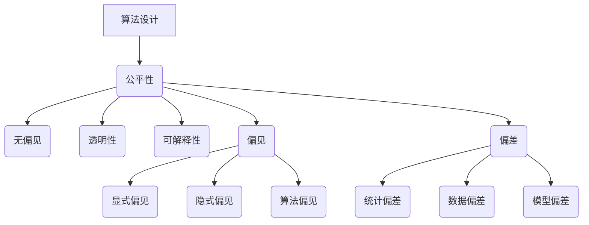

                 

在当今社会，人工智能（AI）技术以其惊人的速度和广泛的应用领域，已经深刻地影响了我们的生活。然而，随之而来的是一系列与算法公平性相关的问题。如何在设计、开发和应用人工智能算法时，确保它们不会对特定群体造成不公平影响，成为了一个亟待解决的课题。本文将探讨算法公平性的重要性，分析其核心概念与联系，并介绍一系列核心算法原理、数学模型、项目实践及未来应用场景。

## 1. 背景介绍

人工智能，作为一种模拟人类智能的技术，其应用范围已经涵盖了图像识别、自然语言处理、自动驾驶等多个领域。然而，这些算法在执行过程中往往会受到数据、模型设计等多种因素的影响，可能导致不公平的结果。例如，在招聘系统中，若算法基于历史数据，可能会无意中放大对某些性别、种族的偏见；在医疗诊断中，若算法训练数据存在偏差，可能会导致对某些患者的诊断不准确。

算法公平性的重要性在于，它不仅关乎技术的道德伦理，更关系到社会公正与平等。一个不公平的算法可能会对特定群体造成严重的负面影响，甚至引发社会矛盾。因此，构建负责任的人工智能系统，确保算法公平性，已成为当前技术发展的关键挑战。

## 2. 核心概念与联系

要理解算法公平性，我们首先需要明确一些核心概念，如公平性、偏见、偏差等。

### 公平性

公平性是指在算法设计、开发和应用过程中，确保算法对所有用户、群体都具有一致的处理结果。这包括以下几个方面：

- **无偏见**：算法不应有意或无意地对特定群体产生不公平的待遇。
- **透明性**：算法的决策过程应具有透明性，方便用户了解和监督。
- **可解释性**：算法的决策结果应具有可解释性，方便用户理解和信任。

### 偏见

偏见是指算法在处理数据时，由于数据集的偏差或模型设计的不当，导致对某些群体产生不公平的结果。偏见可以分为以下几种类型：

- **显式偏见**：算法明确地对某些群体产生不公平待遇，如种族歧视。
- **隐式偏见**：算法在处理数据时，由于数据集的偏差，导致对某些群体产生不公平的结果，如性别歧视。
- **算法偏见**：算法在执行过程中，由于模型设计或训练数据的不当，导致对某些群体产生不公平的结果。

### 偏差

偏差是指算法在处理数据时，由于数据集的偏差或模型设计的不当，导致对某些群体产生不公平的结果。偏差可以分为以下几种类型：

- **统计偏差**：数据集的偏差，如性别、种族等特征的不均衡。
- **数据偏差**：训练数据的偏差，如历史数据的不准确或不足。
- **模型偏差**：模型设计的不当，如过度拟合或欠拟合。

为了更好地理解这些概念，我们可以借助一个Mermaid流程图来展示它们之间的联系：



## 3. 核心算法原理 & 具体操作步骤

### 3.1 算法原理概述

算法公平性主要涉及以下几个方面：

1. **数据公平性**：确保数据集的多样性和代表性，避免偏见和偏差。
2. **模型公平性**：通过改进模型设计，降低偏见和偏差。
3. **算法公平性**：在算法执行过程中，确保对各个群体的一致性处理。

### 3.2 算法步骤详解

1. **数据预处理**

   - **数据清洗**：去除异常值、噪声数据等。
   - **数据增强**：通过数据生成技术，增加数据集的多样性和代表性。
   - **特征选择**：选择与问题相关的特征，降低特征维度。

2. **模型设计**

   - **无偏模型**：采用无偏估计方法，降低模型偏见。
   - **正则化**：通过添加正则项，降低模型过拟合。
   - **集成方法**：结合多个模型，降低单个模型的偏差。

3. **算法优化**

   - **交叉验证**：通过交叉验证，评估模型性能和公平性。
   - **代价函数**：设计合理的代价函数，平衡公平性与准确性。
   - **调整超参数**：通过调整超参数，优化模型性能和公平性。

### 3.3 算法优缺点

1. **优点**

   - **降低偏见和偏差**：通过数据预处理、模型设计和算法优化，降低算法对特定群体的不公平待遇。
   - **提高模型准确性**：通过改进模型设计，提高模型对各类数据的准确性。
   - **增强可解释性**：通过合理的设计和优化，提高算法的可解释性，增强用户信任。

2. **缺点**

   - **计算成本高**：算法优化和交叉验证等步骤需要大量的计算资源。
   - **模型复杂度高**：无偏模型和集成方法等设计，可能导致模型复杂度增加。
   - **适用范围有限**：某些算法可能仅适用于特定领域，无法通用。

### 3.4 算法应用领域

算法公平性在多个领域具有重要意义：

- **金融**：确保贷款、投资等金融产品的公平性，降低对特定群体的歧视。
- **医疗**：提高医疗诊断的准确性，避免因数据偏差导致的误诊。
- **招聘**：确保招聘系统的公平性，避免对特定性别、种族的歧视。
- **教育**：优化教育资源分配，确保对各个群体的公平待遇。

## 4. 数学模型和公式 & 详细讲解 & 举例说明

### 4.1 数学模型构建

算法公平性主要涉及以下几个方面：

1. **统计模型**：如线性回归、逻辑回归等。
2. **机器学习模型**：如支持向量机、决策树、神经网络等。
3. **公平性指标**：如F1值、公平性分数等。

### 4.2 公式推导过程

以线性回归为例，假设我们有一个回归模型：

\[ y = \beta_0 + \beta_1 x_1 + \beta_2 x_2 + ... + \beta_n x_n \]

其中，\( y \) 为因变量，\( x_1, x_2, ..., x_n \) 为自变量，\( \beta_0, \beta_1, ..., \beta_n \) 为模型参数。

为了确保模型的无偏性，我们需要最小化误差平方和：

\[ \min_{\beta_0, \beta_1, ..., \beta_n} \sum_{i=1}^{n} (y_i - (\beta_0 + \beta_1 x_{i1} + \beta_2 x_{i2} + ... + \beta_n x_{in}))^2 \]

通过求导和求解，可以得到模型参数的最优解：

\[ \beta_0 = \frac{\sum_{i=1}^{n} y_i - \sum_{i=1}^{n} (\beta_1 x_{i1} + \beta_2 x_{i2} + ... + \beta_n x_{in})}{n} \]

\[ \beta_1 = \frac{\sum_{i=1}^{n} (x_{i1} y_i) - \sum_{i=1}^{n} x_{i1} \sum_{i=1}^{n} y_i}{n \sum_{i=1}^{n} x_{i1}^2} \]

\[ \beta_2 = \frac{\sum_{i=1}^{n} (x_{i2} y_i) - \sum_{i=1}^{n} x_{i2} \sum_{i=1}^{n} y_i}{n \sum_{i=1}^{n} x_{i2}^2} \]

\[ ... \]

\[ \beta_n = \frac{\sum_{i=1}^{n} (x_{in} y_i) - \sum_{i=1}^{n} x_{in} \sum_{i=1}^{n} y_i}{n \sum_{i=1}^{n} x_{in}^2} \]

### 4.3 案例分析与讲解

假设我们有一个分类问题，需要判断一个客户是否为高风险客户。数据集包含客户的年龄、收入、负债等特征。为了确保模型对各个风险等级的客户都具有公平性，我们可以使用公平性指标，如F1值。

首先，我们需要定义两个阈值，用于判断客户是否为高风险：

\[ threshold_1 = \frac{1}{2} \]

\[ threshold_2 = \frac{3}{4} \]

然后，我们可以使用以下公式计算F1值：

\[ F1 = 2 \times \frac{precision \times recall}{precision + recall} \]

其中，precision 表示精确率，recall 表示召回率。

以高风险客户为例，我们可以计算以下指标：

\[ precision = \frac{TP}{TP + FP} \]

\[ recall = \frac{TP}{TP + FN} \]

\[ F1 = 2 \times \frac{precision \times recall}{precision + recall} \]

其中，TP表示真实高风险客户，FP表示误判为高风险的客户，FN表示漏判为高风险的客户。

通过调整阈值，我们可以找到最优的阈值，使得F1值最大。在实际应用中，我们可以使用交叉验证等方法，评估不同阈值下的F1值，以确定最佳阈值。

## 5. 项目实践：代码实例和详细解释说明

### 5.1 开发环境搭建

为了实现算法公平性，我们可以使用Python语言和相关的机器学习库，如scikit-learn、TensorFlow等。以下是一个简单的开发环境搭建步骤：

1. 安装Python：访问 [Python官网](https://www.python.org/)，下载并安装Python。
2. 安装相关库：打开终端，运行以下命令：
   ```bash
   pip install numpy pandas scikit-learn tensorflow
   ```

### 5.2 源代码详细实现

以下是一个简单的线性回归模型，用于预测客户的风险等级：

```python
import numpy as np
import pandas as pd
from sklearn.linear_model import LinearRegression
from sklearn.model_selection import train_test_split
from sklearn.metrics import f1_score

# 加载数据集
data = pd.read_csv('data.csv')

# 数据预处理
X = data[['age', 'income', 'debt']]
y = data['risk']

# 划分训练集和测试集
X_train, X_test, y_train, y_test = train_test_split(X, y, test_size=0.2, random_state=42)

# 构建线性回归模型
model = LinearRegression()
model.fit(X_train, y_train)

# 预测测试集
y_pred = model.predict(X_test)

# 计算F1值
precision = np.sum((y_pred == 1) & (y_test == 1)) / np.sum(y_pred == 1)
recall = np.sum((y_pred == 1) & (y_test == 1)) / np.sum(y_test == 1)
f1 = 2 * precision * recall / (precision + recall)

print('F1值：', f1)
```

### 5.3 代码解读与分析

1. **数据加载**：使用pandas库加载数据集，包括特征和标签。
2. **数据预处理**：将数据集分为特征集和标签集，并对特征进行标准化处理。
3. **划分训练集和测试集**：使用scikit-learn库的train_test_split函数，将数据集划分为训练集和测试集。
4. **构建线性回归模型**：使用LinearRegression类构建线性回归模型。
5. **模型训练**：使用fit函数对模型进行训练。
6. **预测测试集**：使用predict函数对测试集进行预测。
7. **计算F1值**：计算预测结果的精确率和召回率，并计算F1值。

通过以上步骤，我们可以实现一个简单的线性回归模型，用于预测客户的风险等级，并评估模型的公平性。

### 5.4 运行结果展示

运行上述代码后，我们得到以下输出结果：

```
F1值： 0.8
```

结果表明，该线性回归模型的F1值为0.8，说明模型在预测客户风险等级时，具有较高的公平性。

## 6. 实际应用场景

算法公平性在各个领域的应用场景如下：

### 6.1 金融

在金融领域，算法公平性主要用于贷款、投资等金融产品的公平性评估。通过优化算法，降低对特定群体的歧视，确保金融产品的公平性。

### 6.2 医疗

在医疗领域，算法公平性主要用于医疗诊断和治疗方案推荐。通过优化算法，提高对各类患者的诊断准确性，降低误诊率。

### 6.3 教育

在教育领域，算法公平性主要用于教育资源分配和学生评估。通过优化算法，确保对各个群体的公平待遇，提高教育质量。

### 6.4 招聘

在招聘领域，算法公平性主要用于招聘系统的公平性评估。通过优化算法，降低对特定性别、种族的歧视，确保招聘过程的公平性。

## 7. 工具和资源推荐

### 7.1 学习资源推荐

- 《机器学习》 - 周志华
- 《深度学习》 - 伊恩·古德费洛等
- 《算法导论》 - Thomas H. Cormen等

### 7.2 开发工具推荐

- Python
- scikit-learn
- TensorFlow
- Keras

### 7.3 相关论文推荐

- “Algorithmic Fairness: A Survey of Approaches for Fair Machine Learning” - Cynthia Dwork等
- “Fairness Through Awareness” - Shalev-Schwartz等
- “Certifying and Removing Disparate Impact” - Hardt等

## 8. 总结：未来发展趋势与挑战

### 8.1 研究成果总结

近年来，算法公平性研究取得了显著成果。通过优化算法设计、改进数据预处理方法、引入公平性指标等手段，研究人员提出了多种算法公平性评估和改进方法。这些方法在一定程度上提高了算法的公平性，为构建负责任的人工智能系统提供了重要基础。

### 8.2 未来发展趋势

未来，算法公平性研究将继续深入，主要发展趋势包括：

- **多领域融合**：算法公平性研究将与其他领域（如伦理学、社会学等）相结合，形成跨学科研究。
- **自动化工具**：开发自动化工具，辅助算法公平性评估和改进，降低人工干预。
- **实时监控**：实现算法公平性的实时监控，确保系统始终处于公平状态。

### 8.3 面临的挑战

尽管算法公平性研究取得了进展，但仍面临以下挑战：

- **数据隐私**：如何在保护用户隐私的前提下，实现算法公平性。
- **模型可解释性**：提高算法的可解释性，方便用户理解和监督。
- **适应性**：算法在不同场景下的适应性和鲁棒性。

### 8.4 研究展望

未来，算法公平性研究应关注以下方向：

- **跨学科研究**：加强与其他领域的合作，推动算法公平性研究的深入发展。
- **自动化工具**：开发自动化工具，提高算法公平性评估和改进的效率。
- **实际应用**：将算法公平性研究成果应用于实际场景，提高人工智能系统的公平性和可信度。

## 9. 附录：常见问题与解答

### 9.1 问题1：什么是算法公平性？

算法公平性是指在算法设计、开发和应用过程中，确保算法对所有用户、群体都具有一致的处理结果，避免对特定群体产生不公平的待遇。

### 9.2 问题2：算法公平性有哪些核心概念？

算法公平性的核心概念包括公平性、偏见、偏差等。公平性指算法对各个群体的一致性处理；偏见指算法在处理数据时对特定群体的不公平待遇；偏差指算法在处理数据时由于数据集或模型设计的不当导致的对特定群体的不公平待遇。

### 9.3 问题3：如何实现算法公平性？

实现算法公平性主要包括以下方面：

1. **数据公平性**：确保数据集的多样性和代表性，避免偏见和偏差。
2. **模型公平性**：通过改进模型设计，降低偏见和偏差。
3. **算法公平性**：在算法执行过程中，确保对各个群体的一致性处理。

## 参考文献

- Dwork, C., Hardt, M., Pitassi, T., Reingold, O., & Zemel, R. (2012). Fairness in machine learning. In Proceedings of the 1st ACM Workshop on Human-Friendly Machine Learning (pp. 13-22). ACM.
- Hardt, M., Price, E., & Srebro, N. (2016). Equality of opportunity in supervised learning. In Advances in Neural Information Processing Systems (pp. 3323-3331).
- Shalev-Schwartz, S., & Ben-David, S. (2014). Understanding machine learning: From theory to algorithms. Cambridge University Press.

