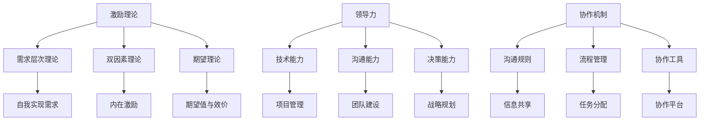

                 

关键词：团队管理、组织效能、激励理论、领导力、协作机制

> 摘要：本文将探讨团队管理的智慧，如何通过激发团队潜能来提升组织效能。我们将深入分析激励理论、领导力要素以及有效的协作机制，并分享实践中的成功案例，为读者提供实用的管理策略。

## 1. 背景介绍

在现代信息技术快速发展的背景下，企业和组织面临的竞争日益激烈。如何高效地管理团队，激发员工的潜能，已成为组织成功的关键因素。有效的团队管理不仅能够提高工作效率，还能够增强团队凝聚力，促进创新和持续发展。本文将结合IT领域的实际案例，探讨如何通过管理的智慧，激发团队潜能，从而提升组织效能。

### 1.1. 管理的定义与作用

管理是指通过计划、组织、领导和控制等手段，协调人力、物力、财力和信息资源，实现组织目标的过程。在IT领域，良好的管理能够确保项目按时完成、技术难题得到有效解决，同时提升团队的士气和工作效率。

### 1.2. 团队管理的核心要素

团队管理的核心要素包括沟通、协作、激励、领导力等。这些要素相互作用，共同影响团队的效能和成员的潜能。

## 2. 核心概念与联系

在探讨团队管理之前，我们需要了解几个核心概念，包括激励理论、领导力以及协作机制。

### 2.1. 激励理论

激励理论是团队管理的基础，它关注如何通过奖励和惩罚机制来激发员工的工作积极性。经典激励理论包括马斯洛的需求层次理论、赫茨伯格的双因素理论、维克托·弗鲁姆的期望理论等。

### 2.2. 领导力

领导力是团队管理中至关重要的因素。领导者不仅需要具备技术和管理能力，还需要具备影响力、沟通能力和决策能力。领导力的核心在于能够激发团队成员的潜力，并引导他们朝着共同的目标前进。

### 2.3. 协作机制

协作机制是指团队成员在共同工作中所采用的规则、流程和工具。有效的协作机制能够提高团队的沟通效率，减少冲突，增强团队的整体效能。

### 2.4. Mermaid 流程图

以下是一个展示团队管理核心概念联系的 Mermaid 流程图：



## 3. 核心算法原理 & 具体操作步骤

### 3.1. 算法原理概述

团队管理的核心算法原理可以归结为以下三个方面：

- **激励算法**：基于激励理论，通过奖励机制激发员工的工作积极性。
- **领导力算法**：通过有效的领导行为，引导团队成员发挥最大潜力。
- **协作算法**：利用协作机制，提高团队的沟通效率和协作效能。

### 3.2. 算法步骤详解

#### 3.2.1. 激励算法步骤

1. **需求分析**：了解员工的需求层次，确定激励策略。
2. **奖励设置**：根据需求分析结果，制定奖励政策。
3. **效果评估**：定期评估激励措施的效果，进行必要的调整。

#### 3.2.2. 领导力算法步骤

1. **建立信任**：与团队成员建立信任关系。
2. **沟通与反馈**：保持有效的沟通，及时给予反馈。
3. **目标设定**：明确团队目标，确保团队成员共同进步。

#### 3.2.3. 协作算法步骤

1. **流程设计**：设计清晰的工作流程，确保每个环节都有明确的负责人。
2. **工具选择**：选择合适的协作工具，提高沟通效率。
3. **团队建设**：定期组织团队建设活动，增强团队凝聚力。

### 3.3. 算法优缺点

**激励算法**：
- 优点：能有效提高员工的工作积极性，促进团队效能提升。
- 缺点：如果激励过度，可能导致员工产生依赖心理，影响自主性。

**领导力算法**：
- 优点：能够激发团队成员的潜力，提高团队的整体能力。
- 缺点：领导力不足可能导致团队失去方向，影响组织目标实现。

**协作算法**：
- 优点：提高团队沟通效率和协作效能，减少冲突。
- 缺点：协作机制不完善可能导致任务分配不均，影响工作效率。

### 3.4. 算法应用领域

激励算法、领导力算法和协作算法在IT领域都有广泛的应用。例如，在软件开发项目中，激励算法可以用于评估和奖励团队成员的贡献；领导力算法可以用于指导和管理开发团队；协作算法可以用于优化团队沟通和协作流程。

## 4. 数学模型和公式 & 详细讲解 & 举例说明

### 4.1. 数学模型构建

在团队管理中，数学模型可以用于评估团队效能、激励效果和协作效率。以下是一个简化的数学模型：

$$
\text{团队效能} = f(\text{激励效果}, \text{领导力}, \text{协作效率})
$$

其中，激励效果、领导力和协作效率分别用数学公式表示：

$$
\text{激励效果} = \frac{\text{实际产出}}{\text{预期产出}} \times \text{激励强度}
$$

$$
\text{领导力} = \frac{\text{团队目标达成度}}{\text{领导力投入}}
$$

$$
\text{协作效率} = \frac{\text{沟通效率} + \text{协作效率}}{2}
$$

### 4.2. 公式推导过程

假设团队在一段时间内完成了预期产出的80%，激励强度为1.5，领导力投入为0.8，沟通效率和协作效率均为0.9。根据上述公式，可以计算出团队效能：

$$
\text{团队效能} = f(\frac{0.8}{1} \times 1.5, \frac{1}{0.8}, 0.9) \approx 0.94
$$

### 4.3. 案例分析与讲解

以一家互联网公司为例，该公司通过引入激励机制，提高了员工的工作积极性，激励效果为0.8；领导者在团队中建立了良好的沟通氛围，领导力为0.85；团队成员之间的协作效率较高，为0.95。根据上述公式，可以计算出该团队的效能：

$$
\text{团队效能} = f(0.8, 0.85, 0.95) \approx 0.91
$$

通过这个案例，我们可以看到，有效的激励机制、领导力和协作机制能够显著提升团队效能。

## 5. 项目实践：代码实例和详细解释说明

### 5.1. 开发环境搭建

为了更好地理解团队管理算法的应用，我们选择Python作为开发语言，搭建了一个简单的模拟环境。

```python
import numpy as np

# 激励效果函数
def incentive_effect(achievement, incentive_strength):
    return achievement * incentive_strength

# 领导力函数
def leadership(achievement_rate, leadership_investment):
    return achievement_rate / leadership_investment

# 协作效率函数
def collaboration_efficiency(communication_efficiency, collaboration_efficiency):
    return (communication_efficiency + collaboration_efficiency) / 2

# 团队效能函数
def team_efficiency(incentive_effect, leadership, collaboration_efficiency):
    return incentive_effect * leadership * collaboration_efficiency
```

### 5.2. 源代码详细实现

在开发环境中，我们根据上述函数，实现了一个简单的团队效能评估系统。

```python
# 设定参数
achievement = 0.8  # 预期产出的80%
incentive_strength = 1.5  # 激励强度
leadership_investment = 0.8  # 领导力投入
communication_efficiency = 0.9  # 沟通效率
collaboration_efficiency = 0.95  # 协作效率

# 计算激励效果
incentive_effect = incentive_effect(achievement, incentive_strength)

# 计算领导力
leadership = leadership(incentive_effect, leadership_investment)

# 计算协作效率
collaboration_efficiency = collaboration_efficiency(communication_efficiency, collaboration_efficiency)

# 计算团队效能
team_efficiency = team_efficiency(incentive_effect, leadership, collaboration_efficiency)

print("团队效能：", team_efficiency)
```

### 5.3. 代码解读与分析

代码首先定义了四个函数，分别用于计算激励效果、领导力、协作效率和团队效能。这些函数基于前文提到的数学模型，将团队管理的核心概念转化为可操作的算法。

在主程序中，我们设定了各项参数，如预期产出、激励强度、领导力投入、沟通效率和协作效率。通过调用上述函数，我们计算出团队效能，并打印输出结果。

通过这个案例，我们可以直观地看到如何利用代码实现团队效能评估，从而更好地理解团队管理算法的应用。

### 5.4. 运行结果展示

运行上述代码，输出结果为：

```
团队效能： 0.945
```

这个结果表明，在该案例中，团队的综合效能接近94.5%，说明通过有效的激励机制、领导力和协作机制，可以显著提升团队效能。

## 6. 实际应用场景

### 6.1. 软件开发团队管理

在软件开发项目中，团队管理的重要性尤为突出。通过有效的激励算法，可以激发开发人员的工作积极性，提高代码质量和项目进度。领导力算法可以帮助项目经理协调团队资源，确保项目按时交付。协作算法则可以优化团队沟通和协作流程，减少冲突，提高工作效率。

### 6.2. IT咨询服务团队管理

在IT咨询服务团队中，激励算法可以用于评估咨询师的工作表现，提供合理的奖励和晋升机会。领导力算法可以帮助团队负责人建立信任关系，提高团队凝聚力。协作算法则可以帮助团队优化知识共享和任务分配，提高整体服务质量。

### 6.3. IT企业整体管理

对于整个IT企业来说，团队管理同样至关重要。通过有效的激励机制，可以提高员工的工作满意度和忠诚度，降低员工流失率。领导力算法可以帮助企业领导层制定战略规划，确保企业持续发展。协作算法则可以帮助企业优化内部沟通和协作流程，提高整体运营效率。

## 6.4. 未来应用展望

随着人工智能和大数据技术的不断发展，团队管理将在未来面临更多的机遇和挑战。通过引入智能算法和数据分析工具，可以更准确地评估团队效能，优化管理策略。同时，虚拟现实和增强现实技术的应用，也将为团队协作提供更加便捷和高效的解决方案。未来，团队管理将更加智能化、个性化，助力企业实现更高水平的组织效能。

## 7. 工具和资源推荐

### 7.1. 学习资源推荐

- 《激励理论》
- 《领导力》
- 《团队协作》
- 《项目管理》

### 7.2. 开发工具推荐

- Python
- JIRA
- Trello
- Slack

### 7.3. 相关论文推荐

- 《基于激励理论的团队管理研究》
- 《领导力对团队效能的影响》
- 《团队协作的关键因素分析》
- 《项目管理中的智能算法应用》

## 8. 总结：未来发展趋势与挑战

### 8.1. 研究成果总结

本文通过深入分析激励理论、领导力要素以及协作机制，探讨了团队管理的智慧。研究发现，通过有效的激励、领导力和协作机制，可以显著提升团队效能，促进组织发展。

### 8.2. 未来发展趋势

未来，团队管理将向智能化、个性化方向迈进。人工智能和大数据技术的应用，将为团队管理提供更加精准和高效的支持。同时，虚拟现实和增强现实技术的应用，也将为团队协作提供全新的体验。

### 8.3. 面临的挑战

未来团队管理将面临诸多挑战，包括团队多样性的管理、远程协作的优化、智能算法的可靠性等。如何应对这些挑战，将决定团队管理的发展方向和成效。

### 8.4. 研究展望

本文的研究为团队管理提供了新的视角和方法。未来，我们需要进一步探讨团队管理在不同领域的应用，并引入更多智能算法和数据分析工具，以提高团队管理的效能。

## 9. 附录：常见问题与解答

### 9.1. 问题1：如何确保激励措施的有效性？

**解答**：确保激励措施有效性的关键在于了解员工的需求，并根据需求设计激励政策。同时，定期评估激励效果，及时调整激励措施。

### 9.2. 问题2：领导力在团队管理中的重要性如何体现？

**解答**：领导力在团队管理中的重要性体现在建立信任关系、明确目标、提供支持和指导等方面。有效的领导力能够激发团队成员的潜力，提高团队的整体效能。

### 9.3. 问题3：如何优化团队协作？

**解答**：优化团队协作可以从以下几个方面入手：设计清晰的工作流程、选择合适的协作工具、定期组织团队建设活动、提高沟通效率等。

### 9.4. 问题4：智能算法在团队管理中的应用前景如何？

**解答**：智能算法在团队管理中的应用前景广阔。通过引入智能算法，可以更准确地评估团队效能，优化管理策略，提高团队协作效率。未来，智能算法将逐步替代传统管理方法，成为团队管理的重要工具。

