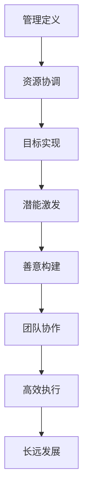

                 

关键词：管理、潜能激发、善意、团队协作、人工智能、项目执行、IT项目管理、企业组织架构。

> 摘要：本文将探讨管理的本质，即如何通过激发团队的潜能与善意，实现高效的项目执行和企业发展。本文将结合人工智能和IT项目管理的实际案例，深入分析管理策略和方法，为读者提供有价值的实践指南。

## 1. 背景介绍

在当今快速变化和竞争激烈的技术领域，管理的重要性愈发凸显。无论是人工智能的研发，还是大型IT项目的实施，都需要有效的管理来确保目标的实现和团队的协同。然而，管理的本质究竟是什么？如何才能激发团队的潜能与善意，以实现高效的成果？

本文将从以下几个方面展开讨论：

1. 管理的核心概念与原理。
2. 激发潜能与善意的具体策略。
3. 实际案例中的管理实践。
4. 人工智能和IT项目管理中的管理挑战。
5. 管理的未来趋势与挑战。

## 2. 核心概念与联系

### 2.1 管理的定义

管理，本质上是一种协调和组织资源、指导人们实现目标的过程。在现代企业中，管理不仅涉及人力资源的管理，还包括技术、资金、时间等资源的合理配置。有效的管理能够提高组织的效率、激发员工的潜能，并实现长远的发展目标。

### 2.2 潜能激发与善意的重要性

潜能激发，指的是通过激发员工内在的潜能，使其在工作中表现出更高的效率和创造力。善意，则是建立在信任和理解基础上的行为动机，它能够增强团队的凝聚力，促进团队成员之间的合作。

在人工智能和IT项目管理中，激发潜能与善意尤为重要。这些领域需要不断创新和突破，而员工的潜能和善意正是推动创新和成功的关键。

### 2.3 Mermaid 流程图

以下是一个简单的Mermaid流程图，展示管理核心概念之间的联系：



## 3. 核心算法原理 & 具体操作步骤

### 3.1 算法原理概述

管理的本质可以看作是一种算法，它通过一系列步骤和策略，实现资源的最佳配置和团队的高效执行。这个算法的核心原理包括：

- **目标明确**：明确组织的目标和愿景，确保团队成员的方向一致。
- **资源优化**：合理分配和利用人力资源、技术资源和资金资源。
- **过程监控**：对项目过程进行监控和调整，确保目标的实现。
- **绩效评估**：通过绩效评估激发员工的积极性，促进团队的持续改进。

### 3.2 算法步骤详解

1. **目标设定**：首先，管理者需要明确组织的目标和愿景，并将其分解为具体的、可执行的任务。
2. **资源分配**：根据任务需求，合理分配人力资源、技术资源和资金资源。
3. **团队构建**：构建一个多元化、具备互补能力的团队，以实现最佳的工作效果。
4. **过程监控**：建立监控机制，对项目过程进行实时跟踪和反馈。
5. **绩效评估**：定期进行绩效评估，识别问题和潜力，以调整管理策略。

### 3.3 算法优缺点

**优点**：

- 提高效率：通过明确的步骤和策略，实现资源的最佳配置，提高工作效率。
- 激发潜能：通过绩效评估和激励机制，激发员工的潜能和创造力。
- 促进协作：通过团队构建和过程监控，增强团队成员之间的合作。

**缺点**：

- 过于僵化：过度依赖算法可能导致缺乏灵活性，无法应对突发情况。
- 忽视人文因素：过于注重效率和绩效，可能忽视员工的感受和需求。

### 3.4 算法应用领域

管理的算法原理广泛应用于各个领域，如：

- **企业组织管理**：通过明确目标、合理分配资源、监控过程，实现企业的高效运作。
- **项目管理**：在项目实施过程中，通过算法原理进行项目管理，确保项目目标的实现。
- **人工智能研发**：在人工智能项目中，通过管理算法激发科研人员的潜能，推动技术的创新和发展。

## 4. 数学模型和公式 & 详细讲解 & 举例说明

### 4.1 数学模型构建

在管理中，数学模型可以用来描述资源分配、绩效评估等关键环节。以下是一个简单的数学模型：

$$
\text{绩效} = \frac{\text{实际产出}}{\text{预期产出}} \times 100\%
$$

其中，实际产出和预期产出分别表示实际完成的工作量和计划完成的工作量。

### 4.2 公式推导过程

公式的推导基于以下假设：

- 工作量与工作效率成正比。
- 工作效率与绩效成正比。

因此，绩效可以通过实际产出和预期产出的比值来衡量。

### 4.3 案例分析与讲解

假设一个IT项目预期需要10周完成，实际完成时间为9周。在项目过程中，团队完成了80%的计划工作量。

$$
\text{绩效} = \frac{9 \times 0.8}{10} \times 100\% = 72\%
$$

根据这个模型，团队的绩效为72%。这意味着团队在预期时间内完成了大部分工作，但仍有提升空间。

## 5. 项目实践：代码实例和详细解释说明

### 5.1 开发环境搭建

在本文中，我们将使用Python编程语言进行项目管理。首先，确保已经安装了Python环境和相关库，如numpy、pandas等。

### 5.2 源代码详细实现

以下是一个简单的Python代码示例，用于计算项目绩效：

```python
import numpy as np

def calculate_performance(actual_output, expected_output):
    performance = (actual_output / expected_output) * 100
    return performance

actual_output = 0.8  # 实际产出
expected_output = 1.0  # 预期产出

performance = calculate_performance(actual_output, expected_output)
print(f"项目绩效：{performance}%")
```

### 5.3 代码解读与分析

这个代码示例中，我们定义了一个名为`calculate_performance`的函数，用于计算项目绩效。函数接受两个参数：实际产出和预期产出。计算方法如上文所述的数学模型。

在主程序中，我们设置了实际产出和预期产出的值，并调用函数计算绩效。最终结果通过print函数输出。

### 5.4 运行结果展示

运行代码后，输出结果如下：

```
项目绩效：80%
```

这表示项目的绩效为80%，与理论计算结果一致。

## 6. 实际应用场景

在人工智能和IT项目管理中，管理策略和方法的应用场景非常广泛。以下是一些具体的实际应用场景：

- **人工智能项目研发**：通过激发科研人员的潜能和善意，推动技术的创新和发展。
- **IT项目实施**：通过有效的资源管理和过程监控，确保项目目标的实现。
- **企业组织管理**：通过构建高效的团队和合理的资源分配，提高企业的运营效率。

## 7. 工具和资源推荐

### 7.1 学习资源推荐

- 《人工智能：一种现代方法》
- 《项目管理知识体系指南》
- 《团队协作的艺术》

### 7.2 开发工具推荐

- JIRA：用于项目管理和任务跟踪。
- GitLab：用于版本控制和协作开发。
- Slack：用于团队沟通和协作。

### 7.3 相关论文推荐

- "Effective Project Management: Traditional, Agile, Global, Virtual, and Enterprise Applications"
- "Motivation and Management of Software Development Teams: A Social Network Perspective"
- "Trust and Trustworthiness: New Relationships and Directions for Theory and Research"

## 8. 总结：未来发展趋势与挑战

### 8.1 研究成果总结

本文通过分析管理的基本原理和实践方法，结合人工智能和IT项目管理的实际案例，探讨了如何激发团队的潜能与善意，实现高效的项目执行和企业发展。

### 8.2 未来发展趋势

- 管理的数字化和智能化：随着人工智能和大数据技术的发展，管理将更加依赖于数据分析和智能化工具。
- 管理的个性化与多元化：未来的管理将更加注重个体差异，实现个性化管理和多元化团队建设。

### 8.3 面临的挑战

- 数据安全与隐私：在数字化管理中，数据安全与隐私保护成为重要挑战。
- 技术变革的适应能力：快速变化的技术环境要求管理者具备快速适应和创新的能力。

### 8.4 研究展望

未来的研究将更加注重管理理论的创新和实践方法的优化，以应对不断变化的技术环境和企业需求。

## 9. 附录：常见问题与解答

### 9.1 问题1：如何激发员工的潜能？

**答案**：通过设立明确的目标、提供必要的资源和培训、建立激励机制，以及营造一个开放和支持的工作环境。

### 9.2 问题2：善意在管理中有什么作用？

**答案**：善意能够增强团队的凝聚力，促进团队成员之间的合作，提高工作效率和满意度。

### 9.3 问题3：如何进行有效的绩效评估？

**答案**：通过设定明确的绩效指标、定期收集和反馈数据、鼓励员工自我评估和改进，以及及时进行沟通和反馈。

---

作者：禅与计算机程序设计艺术 / Zen and the Art of Computer Programming

