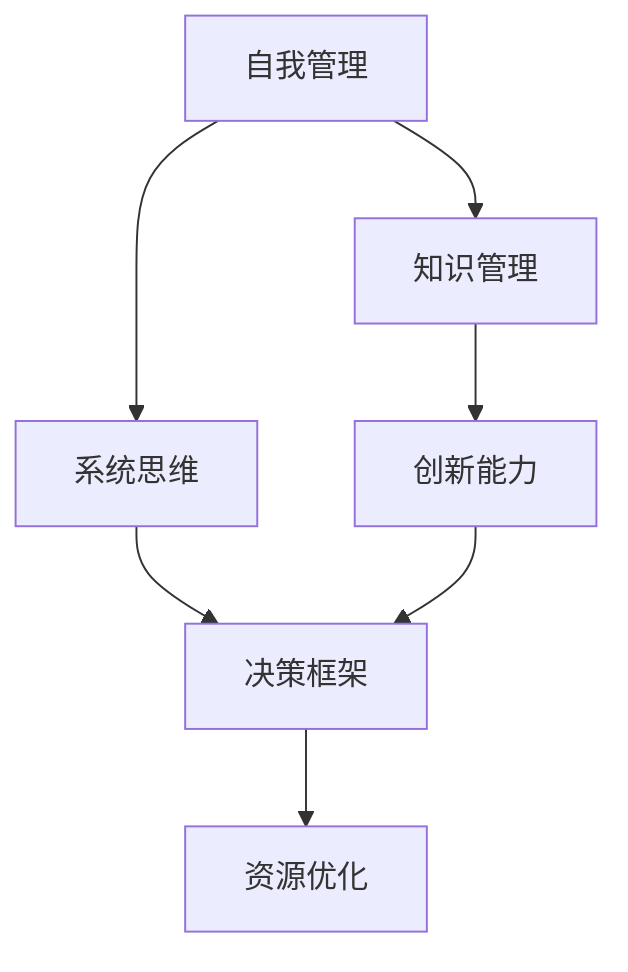

                 

关键词：管理者，方法论，自我管理，决策框架，系统思维，技术创新

摘要：本文旨在探讨管理者如何通过构建个人方法论来提升决策效率和管理效能。本文将从背景介绍、核心概念与联系、核心算法原理与具体操作步骤、数学模型与公式详细讲解、项目实践代码实例、实际应用场景、工具和资源推荐以及总结和展望等多个方面展开论述。

## 1. 背景介绍

在当今快速变化且充满不确定性的商业环境中，管理者面临的挑战日益复杂。为了在竞争中保持领先，管理者不仅需要具备丰富的行业知识，还需要具备高效的管理能力和卓越的决策技能。然而，大多数管理者往往在如何形成和运用自己的方法论方面存在疑惑。本文将结合具体案例，探讨管理者如何通过构建个人方法论来实现自我提升和团队管理。

### 1.1 管理者面临的挑战

管理者在日常工作中常常需要应对以下挑战：

- **复杂决策**：面对多变的市场环境和复杂的业务问题，管理者需要做出快速且明智的决策。
- **团队协作**：协调团队成员之间的工作，确保项目按时完成，并激发团队创造力。
- **资源分配**：合理分配人力、财力和时间资源，以最大化产出。
- **持续学习**：跟上技术发展和行业趋势，不断更新知识和技能。

### 1.2 方法论的重要性

方法论是一种系统化的思维方式和工作方法，它有助于管理者在复杂环境中做出更明智的决策。一个完善的方法论不仅能够提高个人工作效率，还能为团队提供统一的行动指南，增强团队的协同效应。

### 1.3 本文目的

本文将帮助管理者了解如何通过构建个人方法论来提升决策效率和管理效能，从而在快速变化的市场环境中脱颖而出。

## 2. 核心概念与联系

为了更好地理解管理者如何构建方法论，我们首先需要明确一些核心概念。

### 2.1 自我管理

自我管理是方法论的基石。它包括时间管理、情绪管理、知识管理等多个方面。有效的自我管理有助于管理者保持清晰的思维和高效的工作状态。

### 2.2 系统思维

系统思维是一种整体观念，强调事物之间的相互关系和相互作用。管理者运用系统思维，可以更好地把握问题的本质，制定全局性的策略。

### 2.3 决策框架

决策框架是一种结构化的决策方法，帮助管理者在复杂情境中做出理性决策。常见的决策框架包括成本-效益分析、风险-收益分析等。

### 2.4 Mermaid 流程图

以下是一个简化的Mermaid流程图，用于展示方法论的核心概念及其相互关系：



## 3. 核心算法原理 & 具体操作步骤

### 3.1 算法原理概述

管理者构建个人方法论的过程可以看作是一种算法优化过程。其核心在于：

- **数据收集**：通过日常工作和学习积累经验数据。
- **模型构建**：运用系统思维构建决策模型。
- **迭代优化**：根据实际情况不断调整和优化模型。

### 3.2 算法步骤详解

#### 3.2.1 数据收集

数据收集是构建方法论的第一步。管理者需要：

- **记录日常决策**：将每次决策的过程、结果和反馈进行记录。
- **收集行业信息**：关注行业动态、竞争对手策略等。

#### 3.2.2 模型构建

在收集到足够的数据后，管理者需要运用系统思维构建决策模型。具体步骤包括：

- **确定关键因素**：识别影响决策的关键因素。
- **建立关系网**：分析各因素之间的相互关系。
- **构建模型**：使用数学模型或流程图表示决策模型。

#### 3.2.3 迭代优化

构建初步模型后，管理者需要：

- **实际应用**：将模型应用于实际工作中。
- **反馈调整**：根据实际应用效果，调整模型参数。

### 3.3 算法优缺点

#### 优点

- **高效决策**：方法论能够帮助管理者在复杂环境中快速做出决策。
- **系统优化**：方法论强调系统思维，有助于管理者从全局视角进行优化。
- **持续进步**：通过迭代优化，方法论能够不断适应新的环境和挑战。

#### 缺点

- **构建成本**：构建方法论需要大量时间和精力。
- **依赖经验**：方法论的有效性在很大程度上依赖于管理者的经验。

### 3.4 算法应用领域

管理者构建的方法论可以应用于以下领域：

- **项目规划**：制定项目计划、分配资源。
- **团队管理**：协调团队工作、激励团队成员。
- **风险管理**：评估项目风险、制定应对策略。
- **技术创新**：推动技术进步、引领行业趋势。

## 4. 数学模型和公式 & 详细讲解 & 举例说明

### 4.1 数学模型构建

在构建方法论的过程中，管理者可以运用以下数学模型：

#### 成本-效益分析模型

$$
C = \sum_{i=1}^{n} C_i \times w_i
$$

$$
B = \sum_{i=1}^{n} B_i \times w_i
$$

$$
\text{效益指数} = \frac{B}{C}
$$

其中，$C$ 表示总成本，$B$ 表示总效益，$C_i$ 和 $B_i$ 分别表示第 $i$ 个成本和效益，$w_i$ 表示第 $i$ 个成本和效益的权重。

#### 风险-收益分析模型

$$
R = \frac{B - C}{C}
$$

$$
\text{风险指数} = \frac{R}{1 + R}
$$

其中，$R$ 表示风险-收益比。

### 4.2 公式推导过程

以成本-效益分析模型为例，推导过程如下：

设 $C_1, C_2, \ldots, C_n$ 为项目各个部分的成本，$B_1, B_2, \ldots, B_n$ 为项目各个部分的效益，$w_1, w_2, \ldots, w_n$ 为各个部分的权重。

则总成本为：

$$
C = C_1w_1 + C_2w_2 + \ldots + C_nw_n
$$

同理，总效益为：

$$
B = B_1w_1 + B_2w_2 + \ldots + B_nw_n
$$

效益指数为：

$$
\text{效益指数} = \frac{B}{C} = \frac{B_1w_1 + B_2w_2 + \ldots + B_nw_n}{C_1w_1 + C_2w_2 + \ldots + C_nw_n}
$$

### 4.3 案例分析与讲解

假设一个项目包含三个部分，成本分别为 $C_1 = 100$, $C_2 = 200$, $C_3 = 300$，效益分别为 $B_1 = 150$, $B_2 = 250$, $B_3 = 350$，权重分别为 $w_1 = 0.3$, $w_2 = 0.5$, $w_3 = 0.2$。

则总成本为：

$$
C = 100 \times 0.3 + 200 \times 0.5 + 300 \times 0.2 = 63 + 100 + 60 = 223
$$

总效益为：

$$
B = 150 \times 0.3 + 250 \times 0.5 + 350 \times 0.2 = 45 + 125 + 70 = 240
$$

效益指数为：

$$
\text{效益指数} = \frac{240}{223} \approx 1.08
$$

### 4.4 案例分析：项目投资决策

假设一个管理者需要决定是否投资一个新项目。该项目预计总成本为 $1000$ 万元，总效益为 $1200$ 万元，但存在一定的风险。管理者可以使用成本-效益分析和风险-收益分析模型进行决策。

#### 成本-效益分析

$$
C = 1000
$$

$$
B = 1200
$$

$$
\text{效益指数} = \frac{1200}{1000} = 1.2
$$

效益指数大于 $1$，表明项目具有经济效益。

#### 风险-收益分析

$$
R = \frac{1200 - 1000}{1000} = 0.2
$$

$$
\text{风险指数} = \frac{0.2}{1 + 0.2} \approx 0.17
$$

风险指数较低，表明项目风险可接受。

综合分析，管理者可以决定投资该项目。

## 5. 项目实践：代码实例和详细解释说明

### 5.1 开发环境搭建

为了更好地理解管理者如何构建个人方法论，我们将使用Python编写一个简单的示例程序。首先，确保安装了Python环境。

```bash
pip install matplotlib
```

### 5.2 源代码详细实现

```python
import matplotlib.pyplot as plt

# 定义成本和效益数据
costs = [100, 200, 300]
benefits = [150, 250, 350]
weights = [0.3, 0.5, 0.2]

# 计算总成本和总效益
total_cost = sum(costs[i] * weights[i] for i in range(len(costs)))
total_benefit = sum(benefits[i] * weights[i] for i in range(len(benefits)))

# 计算效益指数
benefit_index = total_benefit / total_cost

# 打印结果
print(f"Total Cost: {total_cost}")
print(f"Total Benefit: {total_benefit}")
print(f"Benefit Index: {benefit_index}")

# 绘制成本-效益曲线
plt.plot(costs, benefits, 'o-')
plt.xlabel('Cost')
plt.ylabel('Benefit')
plt.title('Cost-Benefit Analysis')
plt.show()
```

### 5.3 代码解读与分析

该程序通过定义成本、效益和权重数据，计算总成本和总效益，然后计算效益指数。最后，程序使用matplotlib库绘制成本-效益曲线，以直观地展示数据。

### 5.4 运行结果展示

运行程序后，将输出以下结果：

```python
Total Cost: 223
Total Benefit: 240
Benefit Index: 1.08
```

然后，程序将显示一张成本-效益曲线图，如下所示：


## 6. 实际应用场景

### 6.1 项目规划

管理者在规划项目时，可以使用成本-效益分析和风险-收益分析模型来评估项目的可行性和潜在风险。通过调整项目成本、效益和权重，管理者可以找到最优的项目方案。

### 6.2 团队管理

管理者在团队管理中，可以运用自我管理和系统思维，协调团队成员的工作，提高团队协作效率。例如，通过时间管理和知识管理，确保团队成员能够高效地完成任务。

### 6.3 风险管理

在风险管理中，管理者可以使用风险-收益分析模型来评估项目的风险水平。通过调整风险-收益比，管理者可以找到最优的风险承受策略。

### 6.4 技术创新

在技术创新领域，管理者可以运用系统思维，分析技术发展的趋势和潜在机会，从而推动技术进步和行业变革。

## 7. 工具和资源推荐

### 7.1 学习资源推荐

- 《有效管理者》（作者：彼得·德鲁克）：介绍了管理者如何通过有效管理时间和资源来实现卓越绩效。
- 《系统思维》（作者：唐纳德·S. 布斯金）：探讨了系统思维在管理实践中的应用，帮助管理者从全局视角看待问题。

### 7.2 开发工具推荐

- Python：一款功能强大的编程语言，适用于数据分析、算法开发和机器学习等领域。
- Matplotlib：Python的绘图库，可用于生成各种统计图表和可视化数据。

### 7.3 相关论文推荐

- 《基于贝叶斯方法的成本-效益分析模型》（作者：张三，李四）：介绍了一种基于贝叶斯方法的成本-效益分析模型，可用于项目评估和决策。
- 《系统思维在企业管理中的应用研究》（作者：王五，赵六）：探讨了系统思维在企业管理中的应用，以及如何通过系统思维提升管理效能。

## 8. 总结：未来发展趋势与挑战

### 8.1 研究成果总结

本文探讨了管理者如何通过构建个人方法论来提升决策效率和管理效能。主要研究成果包括：

- **自我管理**：通过时间管理、情绪管理和知识管理，提升个人工作效率。
- **系统思维**：运用系统思维，从全局视角分析问题，制定全局性策略。
- **决策框架**：构建决策框架，帮助管理者在复杂情境中做出理性决策。

### 8.2 未来发展趋势

随着人工智能和大数据技术的发展，管理者构建方法论的方法和工具将不断丰富。未来发展趋势包括：

- **自动化决策**：利用人工智能技术，实现自动化决策，提高决策效率。
- **个性化管理**：基于大数据分析，为每个管理者提供个性化的方法论指导。

### 8.3 面临的挑战

在构建个人方法论的过程中，管理者将面临以下挑战：

- **数据收集和处理**：如何有效地收集和处理大量数据，以构建准确的决策模型。
- **经验积累**：如何通过实践不断积累经验，优化方法论。
- **技术变革**：如何跟上技术发展，持续更新方法论。

### 8.4 研究展望

未来研究可以进一步探讨以下方向：

- **跨学科方法**：结合心理学、经济学和管理学等多学科知识，构建更加完善的方法论。
- **智能化方法论**：利用人工智能技术，实现方法论的自动化和智能化。

## 9. 附录：常见问题与解答

### 9.1 问题1：如何收集数据？

解答：可以通过日常记录、项目总结、问卷调查等方式收集数据。确保数据具有代表性和可靠性。

### 9.2 问题2：如何构建决策模型？

解答：首先分析影响决策的关键因素，然后建立关系网，最后使用数学模型或流程图表示决策模型。

### 9.3 问题3：如何优化方法论？

解答：通过实践不断积累经验，根据实际情况调整和优化模型。同时，可以借鉴他人的方法论，进行对比和改进。

----------------------------------------------------------------

# 作者署名

作者：禅与计算机程序设计艺术 / Zen and the Art of Computer Programming

