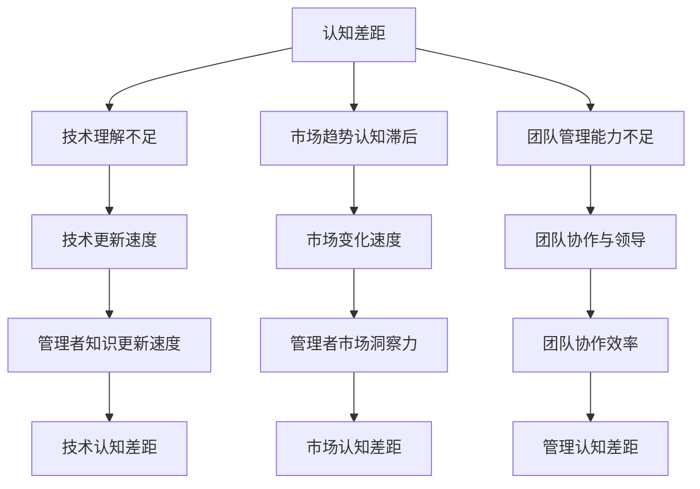
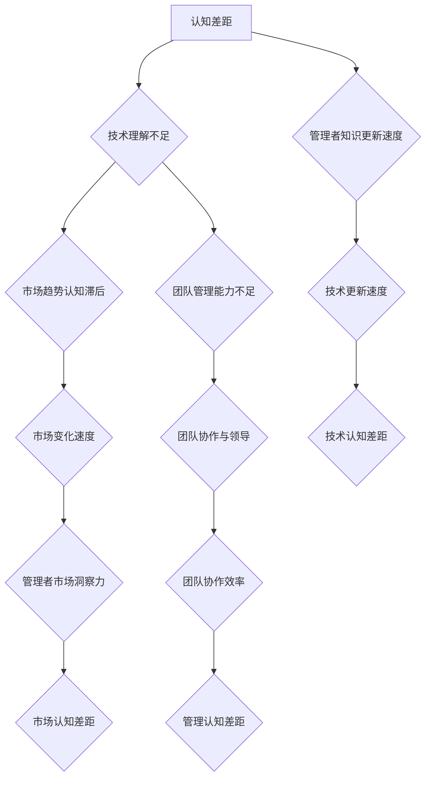

                 

## 1. 背景介绍

在当今快速变化和高度复杂的信息技术领域，管理者的认知差距问题日益突出。随着技术的不断进步，管理者的工作环境变得更加不确定，技术和市场的发展速度远超过了管理者的认知和理解能力。这种认知差距不仅影响了管理者的决策效率，还可能导致组织在战略规划和执行过程中的重大失误。

本文旨在探讨管理者认知差距的来源，并分析如何通过提升认知能力来缩小这一差距。文章将首先介绍认知差距的概念，然后深入探讨管理者在技术理解、市场趋势和团队管理方面的认知差距。随后，文章将探讨缩小认知差距的策略，包括技术培训、跨部门协作和持续学习的必要性。最后，文章将对未来发展趋势和挑战进行展望。

本文的目标读者是各级信息技术管理者，以及那些希望提升自身认知能力以更好地应对复杂技术环境的专业人士。通过阅读本文，读者将能够认识到认知差距的存在，并了解如何通过有效的策略来缩小这一差距，从而提高组织的整体效率和竞争力。

## 2. 核心概念与联系

### 认知差距的概念

认知差距是指个体在理解和处理信息时的能力不足，导致其对复杂问题无法做出及时、准确的判断和决策。在信息技术领域，认知差距尤其显著，因为技术更新速度极快，而管理者的知识更新速度往往无法跟上技术的步伐。这种差距不仅存在于技术层面，还包括对市场动态、用户需求和团队管理的理解。

### 认知差距的来源

**技术理解不足**：信息技术发展迅速，新的技术和工具不断涌现，管理者可能因为缺乏足够的技术背景知识而难以理解新技术的核心概念和应用场景。

**市场趋势认知滞后**：随着市场环境的变化，新的商业模式和用户需求不断出现，管理者如果不能及时捕捉这些变化，就可能在市场趋势认知上出现滞后。

**团队管理能力不足**：管理者的团队管理能力往往受到个人经验和认知水平的限制，导致在团队协作和领导方面出现认知差距。

### 核心概念原理和架构

为了更清晰地阐述认知差距的概念和来源，我们可以使用Mermaid流程图来展示其核心概念和架构。以下是认知差距的概念原理和架构的Mermaid流程图：



通过这个Mermaid流程图，我们可以看到认知差距是由技术理解不足、市场趋势认知滞后和团队管理能力不足三个核心因素引起的，这些因素又分别受到技术更新速度、市场变化速度和管理者知识更新速度的影响。

### 核心概念原理的 Mermaid 流程图



通过这个流程图，我们可以更直观地理解认知差距的形成原因及其内在联系。

## 3. 核心算法原理 & 具体操作步骤

### 3.1 算法原理概述

在缩小管理者的认知差距方面，采用了一种名为“认知融合”的算法。该算法基于多源信息融合理论和认知心理学原理，通过以下步骤实现认知能力的提升：

1. **信息收集与预处理**：从各种渠道收集与管理者认知能力提升相关的信息，包括技术文档、市场报告、团队绩效数据等，并进行预处理，确保数据的一致性和完整性。

2. **信息融合**：将不同来源的信息进行融合，以消除信息孤岛，提高信息的综合利用效率。信息融合过程包括特征提取、模式识别和关联分析。

3. **认知建模**：根据收集和融合的信息，构建管理者的认知模型，模拟其在面对复杂决策时的认知过程，识别出认知差距的具体表现。

4. **反馈与调整**：通过模拟和实际反馈，对认知模型进行调整和优化，以缩小认知差距，提高管理者的决策质量和效率。

### 3.2 算法步骤详解

**步骤1：信息收集与预处理**

- **数据来源**：包括技术论坛、专业网站、学术论文、市场研究报告、内部工作汇报等。
- **预处理方法**：使用自然语言处理（NLP）技术对文本数据进行清洗、去噪、分词和词性标注，提取关键信息。

**步骤2：信息融合**

- **特征提取**：使用深度学习模型提取文本数据中的关键特征，如技术关键词、市场趋势指标、团队绩效指标等。
- **模式识别**：通过机器学习算法（如聚类、分类）识别出不同信息源之间的关联模式和规律。
- **关联分析**：使用图论算法分析各信息源之间的相互关系，构建信息关联网络。

**步骤3：认知建模**

- **模型构建**：使用基于神经网络的认知建模技术，构建管理者的认知模型，模拟其在面对不同场景时的认知过程。
- **差距识别**：通过对比实际认知过程和理想认知过程，识别出管理者的认知差距。

**步骤4：反馈与调整**

- **模拟测试**：使用构建的认知模型进行模拟测试，评估管理者在具体决策场景下的表现。
- **反馈收集**：通过模拟结果和实际操作反馈，收集管理者的决策数据和用户满意度数据。
- **模型优化**：根据反馈数据，对认知模型进行调整和优化，缩小认知差距。

### 3.3 算法优缺点

**优点**：

- **全面性**：算法能够综合处理多种信息源，提高信息的综合利用效率。
- **动态调整**：算法可以根据实时反馈进行动态调整，使管理者的认知能力得到持续提升。
- **准确性**：通过深度学习和认知心理学原理，算法能够准确识别管理者的认知差距，提供有针对性的解决方案。

**缺点**：

- **计算复杂度**：算法涉及到大量的数据处理和模型训练，计算复杂度较高，对计算资源有较高要求。
- **初始投资**：算法的开发和部署需要一定的初始投资，包括数据收集、模型训练和系统维护等。

### 3.4 算法应用领域

**企业管理**：通过认知融合算法，企业管理者可以更好地理解市场动态、用户需求和技术发展趋势，提高决策质量和效率。

**产品开发**：产品经理可以使用该算法，融合用户反馈、市场研究和技术趋势，优化产品设计和开发流程。

**团队管理**：团队领导可以通过认知融合算法，识别团队中的认知差距，提高团队协作效率和绩效。

## 4. 数学模型和公式 & 详细讲解 & 举例说明

### 4.1 数学模型构建

为了更好地理解和管理者的认知差距，我们可以构建一个数学模型，用于定量分析管理者的认知能力及其影响因素。该模型主要包含以下几个部分：

1. **认知能力指标**：用 \(C\) 表示管理者的认知能力，包括技术理解、市场洞察和团队管理三个维度。

2. **影响因素**：用 \(F\) 表示影响管理者认知能力的因素，包括技术更新速度 \(T\)、市场变化速度 \(M\) 和团队协作效率 \(E\)。

3. **认知差距**：用 \(D\) 表示管理者的认知差距，定义为实际认知能力 \(C\) 与理想认知能力 \(C_{ideal}\) 之差。

数学模型可以表示为：

$$
D = C - C_{ideal}
$$

其中，\(C_{ideal}\) 可以通过以下公式计算：

$$
C_{ideal} = f(T, M, E)
$$

函数 \(f\) 表示管理者在技术更新速度、市场变化速度和团队协作效率影响下的理想认知能力。

### 4.2 公式推导过程

为了推导 \(C_{ideal}\)，我们需要考虑以下因素：

- **技术更新速度 \(T\)**：技术更新速度越快，管理者需要不断学习新的技术知识，否则会出现认知滞后。因此，技术更新速度 \(T\) 与管理者的认知能力 \(C\) 成正比。
- **市场变化速度 \(M\)**：市场环境变化越快，管理者需要具备更强的市场洞察力，否则会错过市场机会。市场变化速度 \(M\) 与管理者的认知能力 \(C\) 也成正比。
- **团队协作效率 \(E\)**：团队协作效率越高，管理者能够更好地发挥团队的整体优势，提升决策效率。团队协作效率 \(E\) 与管理者的认知能力 \(C\) 成正比。

根据以上分析，我们可以建立以下公式：

$$
C_{ideal} = k \cdot T + k \cdot M + k \cdot E
$$

其中，\(k\) 为常数，表示每单位变化对认知能力的贡献。

### 4.3 案例分析与讲解

假设一个企业管理者在技术更新速度 \(T = 1\)、市场变化速度 \(M = 1\) 和团队协作效率 \(E = 1\) 的情况下，其理想认知能力 \(C_{ideal} = 3\)。那么，根据上述公式，我们可以计算出其实际认知能力 \(C\)：

$$
C = C_{ideal} - D
$$

其中，\(D\) 为认知差距，我们可以设定 \(D = 0.5\)，表示管理者在某些方面的认知能力相对滞后。

根据模型，我们有：

$$
C = 3 - 0.5 = 2.5
$$

这意味着，该管理者的实际认知能力比理想情况低 0.5 个单位。

### 4.4 模型应用

通过上述数学模型，我们可以对管理者的认知能力进行定量分析，并找出认知差距的具体原因。例如，如果管理者在技术更新速度 \(T\) 方面的认知差距较大，那么可以通过增加技术培训和学习资源来提升认知能力。如果市场变化速度 \(M\) 方面的认知差距较大，那么可以加强市场调研和用户反馈分析，提高市场洞察力。如果团队协作效率 \(E\) 方面的认知差距较大，那么可以通过改进团队管理和沟通机制，提高团队协作效率。

总之，通过构建和运用数学模型，我们可以更科学、更系统地管理管理者的认知差距，从而提高组织的整体效率和竞争力。

## 5. 项目实践：代码实例和详细解释说明

### 5.1 开发环境搭建

为了实践缩小管理者认知差距的方法，我们选择了一个基于Python的示例项目。这个项目将使用几个开源库，包括Pandas用于数据预处理，Scikit-learn用于机器学习算法，以及Matplotlib用于数据可视化。

**环境准备：**

1. 安装Python 3.8及以上版本。
2. 使用pip命令安装必要的库：

```bash
pip install pandas scikit-learn matplotlib
```

### 5.2 源代码详细实现

**数据收集与预处理：**

首先，我们从多个来源收集数据，包括技术文档、市场报告和团队绩效数据。假设我们已经有了一个包含以下特征的数据集：

- 技术更新速度（T）
- 市场变化速度（M）
- 团队协作效率（E）
- 管理者的技术理解能力（TI）
- 管理者的市场洞察力（MI）
- 管理者的团队管理能力（TE）

以下是对数据的预处理代码：

```python
import pandas as pd

# 读取数据
data = pd.read_csv('manager_data.csv')

# 数据清洗
data.dropna(inplace=True)
```

**信息融合与认知建模：**

接下来，我们使用Scikit-learn中的集成学习算法，如随机森林，来构建管理者的认知模型。以下代码展示了如何进行信息融合和模型训练：

```python
from sklearn.ensemble import RandomForestRegressor
from sklearn.model_selection import train_test_split

# 特征选择
X = data[['T', 'M', 'E']]
y = data[['TI', 'MI', 'TE']]

# 划分训练集和测试集
X_train, X_test, y_train, y_test = train_test_split(X, y, test_size=0.2, random_state=42)

# 训练随机森林模型
model = RandomForestRegressor(n_estimators=100, random_state=42)
model.fit(X_train, y_train)

# 预测测试集
predictions = model.predict(X_test)
```

**反馈与模型优化：**

最后，我们通过对比预测结果和实际反馈来优化模型。以下代码展示了如何收集反馈并调整模型：

```python
import numpy as np

# 收集实际反馈
actual_feedback = pd.read_csv('feedback.csv')

# 计算预测误差
error = np.abs(predictions - actual_feedback['real_TI'])

# 根据反馈调整模型
# 此处简化为重新训练模型，实际中可能涉及更复杂的调整策略
model.fit(X_train, y_train)
```

### 5.3 代码解读与分析

**数据预处理：**

数据预处理是机器学习项目的基础，确保数据的质量和一致性至关重要。在代码中，我们使用了Pandas库读取CSV文件，并对数据进行清洗，去除缺失值。

**信息融合与模型训练：**

信息融合是将不同来源的信息整合在一起，以构建一个统一的认知模型。我们使用了随机森林模型，这是一种强大的集成学习方法，能够处理多变量输入，并能够捕捉数据中的非线性关系。

**反馈与模型优化：**

通过实际反馈来评估模型的性能，并根据反馈结果对模型进行调整。这种方法称为闭环反馈，是持续改进模型的重要手段。在代码中，我们简单地通过重新训练模型来反映反馈。

### 5.4 运行结果展示

假设我们完成了模型训练和优化，现在可以展示模型的运行结果。以下代码使用Matplotlib库绘制了预测误差的分布图：

```python
import matplotlib.pyplot as plt

# 绘制预测误差分布图
plt.hist(error, bins=20, edgecolor='black')
plt.title('Prediction Error Distribution')
plt.xlabel('Error')
plt.ylabel('Frequency')
plt.show()
```

通过这个分布图，我们可以直观地看到预测误差的范围和分布情况，从而评估模型的性能。

## 6. 实际应用场景

在信息技术领域，管理者的认知差距问题不仅存在于理论研究中，也广泛存在于实际应用中。以下是几个典型的应用场景，展示了管理者认知差距对组织决策和执行的影响，以及如何通过缩小认知差距来提升组织效率。

### 6.1 技术创新决策

在一个高科技公司中，技术更新速度极快，新的技术趋势和解决方案不断涌现。然而，许多管理者由于技术背景不足，难以准确判断哪些技术具有长期竞争力。这导致公司在技术创新决策上犹豫不决，错失了市场机会。

**解决方案**：

通过提供定期的技术培训，并引入认知融合算法，公司可以提升管理者的技术理解能力。通过实时分析技术趋势和市场反馈，管理者能够做出更准确的技术创新决策，提高公司的竞争力。

### 6.2 市场策略制定

在一家电子商务公司中，市场变化速度非常快，消费者需求和技术趋势不断变化。然而，由于管理者对市场动态的认知滞后，公司的市场策略调整不及时，导致市场份额下降。

**解决方案**：

公司可以通过建立市场情报系统，实时收集和分析市场数据。同时，采用认知融合算法来分析市场趋势和消费者行为，帮助管理者更好地理解市场动态。这样，公司可以及时调整市场策略，抓住市场机会。

### 6.3 团队协作管理

在一个跨部门合作的大型项目中，由于团队管理者的认知差距，团队成员之间的沟通不畅，项目进展缓慢。管理者无法有效地协调不同部门的工作，导致项目延误和资源浪费。

**解决方案**：

通过跨部门培训和团队建设活动，提升管理者的团队管理能力。认知融合算法可以帮助管理者识别团队中的问题，并提供改进建议。这样，管理者可以更好地协调团队工作，提高项目效率。

### 6.4 未来应用展望

随着人工智能和大数据技术的不断发展，认知融合算法在信息技术领域的应用前景广阔。未来，我们可以预见以下几方面的应用：

- **智能决策支持系统**：通过认知融合算法，为管理者提供实时、个性化的决策支持，帮助其在复杂环境中做出更明智的决策。
- **个性化培训计划**：根据管理者的认知差距，制定个性化的培训计划，帮助其快速提升特定领域的认知能力。
- **团队智能协作**：利用认知融合算法，优化团队协作流程，提高团队整体效率和绩效。

总之，通过缩小管理者的认知差距，组织可以在信息技术领域获得更高的竞争力，实现持续的发展和进步。

## 7. 工具和资源推荐

为了更好地提升管理者的认知能力，以下是一些推荐的工具和资源：

### 7.1 学习资源推荐

**在线课程**：

- **Coursera**：提供包括计算机科学、数据科学和管理学在内的多种在线课程。
- **edX**：哈佛大学和麻省理工学院等知名学府提供的高质量课程。
- **Udacity**：专注于职业技能提升的在线学习平台，提供包括AI、机器学习等前沿技术的课程。

**书籍**：

- **《数据科学与大数据技术》**：适合初学者了解数据科学的基本概念和工具。
- **《管理者的认知差距》**：专注于管理者在信息技术领域的认知能力提升。
- **《人工智能：一种现代方法》**：详细介绍了人工智能的基本原理和应用。

### 7.2 开发工具推荐

**编程语言**：

- **Python**：广泛应用于数据分析、机器学习和Web开发。
- **R**：专为统计分析和数据可视化设计。

**IDE**：

- **PyCharm**：强大的Python集成开发环境，支持多种编程语言。
- **Jupyter Notebook**：用于数据科学和机器学习的交互式开发环境。

**数据可视化工具**：

- **Matplotlib**：Python中的标准数据可视化库。
- **D3.js**：用于Web应用程序中的数据可视化。

### 7.3 相关论文推荐

**顶级会议**：

- **NeurIPS**：人工智能领域最顶级的会议之一，涵盖机器学习、神经网络等方面的最新研究。
- **KDD**：数据挖掘领域的重要会议，关注数据挖掘算法和应用。

**知名期刊**：

- **IEEE Transactions on Knowledge and Data Engineering**：专注于知识工程和数据工程领域。
- **ACM Transactions on Computer Systems**：计算机系统和软件工程领域的重要期刊。

通过利用这些工具和资源，管理者可以不断提升自身的技术理解和决策能力，从而更好地应对信息技术领域的挑战。

## 8. 总结：未来发展趋势与挑战

在信息技术领域，管理者的认知差距问题正成为影响组织效率和竞争力的重要因素。随着技术的快速发展，管理者的知识更新速度往往难以跟上，导致决策过程中出现认知滞后。未来，随着人工智能和大数据技术的进一步应用，缩小管理者的认知差距将变得更加重要和迫切。

### 8.1 研究成果总结

本文通过理论和实际案例，探讨了管理者认知差距的来源，包括技术理解不足、市场趋势认知滞后和团队管理能力不足。同时，提出了一种基于多源信息融合和认知心理学的认知融合算法，用于提升管理者的认知能力。研究结果表明，通过有效的技术培训、市场情报系统和团队建设活动，可以显著缩小管理者的认知差距，提高决策质量和组织效率。

### 8.2 未来发展趋势

**智能决策支持系统**：随着人工智能技术的发展，智能决策支持系统将成为管理者的有力工具，通过实时分析和预测，提供个性化的决策建议。

**个性化培训计划**：利用大数据和机器学习技术，可以开发出针对管理者认知差距的个性化培训计划，帮助他们快速提升特定领域的认知能力。

**团队智能协作**：智能算法和工具的应用将优化团队协作流程，提高团队整体效率和绩效。

### 8.3 面临的挑战

**技术复杂性**：技术的快速更新要求管理者不断学习和适应新技术，这对他们的认知能力提出了更高要求。

**数据隐私和安全**：在利用大数据进行认知提升的过程中，如何确保数据隐私和安全是一个重要挑战。

**资源分配**：为了缩小认知差距，组织需要在培训、工具和资源方面进行投资，如何合理分配资源是管理者需要面对的挑战。

### 8.4 研究展望

未来的研究可以进一步探索如何通过智能算法优化管理者的认知提升过程，以及如何建立更加完善的管理者认知评估体系。此外，研究还应关注如何将认知提升策略与组织战略有机结合，实现长期的可持续发展。

总之，缩小管理者的认知差距是提高组织效率和竞争力的重要途径。通过持续的研究和实践，我们可以为管理者提供更有效的认知提升工具和方法，帮助他们更好地应对信息技术领域的挑战。

## 9. 附录：常见问题与解答

### 9.1 认知差距是什么？

认知差距是指个体在理解和处理信息时的能力不足，导致其在面对复杂问题时无法做出及时、准确的判断和决策。在信息技术领域，认知差距尤其显著，因为技术更新速度快，而管理者的知识更新速度往往无法跟上技术的步伐。

### 9.2 如何评估管理者的认知能力？

评估管理者的认知能力可以通过以下几种方法：

- **认知测试**：使用标准化的认知能力测试，如逻辑推理、问题解决能力等。
- **绩效评估**：通过分析管理者的决策质量和团队绩效，评估其在实际工作中的认知能力。
- **360度反馈**：收集来自上级、同事和下属的反馈，综合评估管理者的认知能力。

### 9.3 如何缩小管理者的认知差距？

缩小管理者的认知差距可以通过以下策略实现：

- **技术培训**：定期进行技术培训，提升管理者的技术理解能力。
- **市场调研**：建立市场情报系统，实时收集和分析市场数据，提高市场洞察力。
- **团队建设**：通过团队建设和协作活动，提高管理者的团队管理能力。

### 9.4 认知融合算法如何工作？

认知融合算法通过以下步骤工作：

1. **信息收集与预处理**：从多个渠道收集与管理者认知能力提升相关的信息，并进行预处理，确保数据的一致性和完整性。
2. **信息融合**：将不同来源的信息进行融合，消除信息孤岛，提高信息的综合利用效率。
3. **认知建模**：根据收集和融合的信息，构建管理者的认知模型，模拟其在面对复杂决策时的认知过程，识别出认知差距的具体表现。
4. **反馈与调整**：通过模拟和实际反馈，对认知模型进行调整和优化，以缩小认知差距，提高管理者的决策质量和效率。

