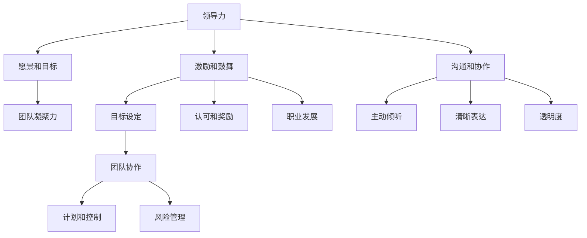

                 

关键词：团队管理、团队建设、团队协作、领导力、项目管理、效能提升

> 摘要：本文旨在探讨如何通过管理艺术来激发团队的潜力，提升团队的整体效能。我们将从多个角度出发，包括领导力、沟通技巧、激励策略、项目管理等，深入分析并分享实用的方法和案例，帮助读者在实际工作中更好地发挥团队的作用。

## 1. 背景介绍

在现代企业和组织中，团队扮演着至关重要的角色。无论是软件开发、市场营销、项目管理还是客户服务，团队都是实现目标、推动项目进展的核心力量。然而，如何有效地管理和激发团队的潜力，成为许多管理者面临的一大挑战。团队管理不仅仅是对成员进行简单的协调和监督，更需要理解团队的动态、激发成员的积极性，以及营造一个支持创新和协作的环境。

本文将结合IT领域中的实际案例，探讨团队管理中的关键要素，提供实用的策略和技巧，旨在帮助读者提高团队效能，实现更好的业务成果。

## 2. 核心概念与联系

### 2.1 领导力

领导力是团队管理的核心概念之一。一位优秀的领导者不仅要具备技术能力和专业知识，更需要具备人际交往和团队管理的能力。领导力包括以下几个关键要素：

- **愿景和目标**：领导者需要为团队设定清晰的愿景和目标，确保团队成员对方向有共同的理解和追求。
- **激励和鼓舞**：领导者要能够激发团队成员的潜力，鼓励他们克服困难，实现个人和团队的目标。
- **沟通和协作**：良好的沟通技巧和协作能力是领导者必须具备的，它有助于减少误解和冲突，提升团队的整体效能。

### 2.2 沟通技巧

沟通技巧在团队管理中至关重要。有效的沟通不仅能够确保团队成员之间信息的准确传递，还能增强团队的凝聚力。以下是一些关键的沟通技巧：

- **主动倾听**：领导者需要倾听团队成员的意见和建议，了解他们的想法和需求，从而更好地支持和指导他们。
- **清晰表达**：领导者应确保自己的表达清晰、准确，避免产生误解和歧义。
- **透明度**：在团队中保持信息的透明度，确保团队成员能够了解项目的进展、挑战和决策。

### 2.3 激励策略

激励策略是激发团队成员积极性的关键。以下是一些常见的激励策略：

- **目标设定**：通过设定明确、可衡量的目标，帮助团队成员明确自己的努力方向和期望成果。
- **认可和奖励**：及时对团队成员的努力和成就给予认可和奖励，增强他们的积极性和归属感。
- **职业发展**：为团队成员提供职业发展的机会和资源，帮助他们实现个人成长和职业目标。

### 2.4 项目管理

项目管理是确保团队高效运作的重要环节。以下是一些核心的项目管理概念和技巧：

- **计划和控制**：制定详细的项目计划，并持续监控和调整，确保项目按计划进行。
- **风险管理**：识别和管理项目中的潜在风险，确保项目能够顺利推进。
- **团队协作**：通过有效的团队协作工具和方法，提升团队的协作效率和成果质量。

### 2.5 Mermaid 流程图

以下是一个简化的Mermaid流程图，展示了团队管理中的核心概念和它们之间的联系：



## 3. 核心算法原理 & 具体操作步骤

### 3.1 算法原理概述

团队管理的核心算法可以看作是一个多目标优化问题。这个问题的目标是在满足团队成员需求、项目目标和资源限制的前提下，最大化团队的整体效能。算法的基本原理包括以下几个步骤：

1. **需求分析**：收集并分析团队成员的需求和期望，确定项目的目标。
2. **资源分配**：根据项目目标和资源限制，对团队成员和资源进行合理分配。
3. **目标优化**：通过迭代计算，优化团队的目标实现方案。
4. **决策和执行**：根据优化结果，制定具体的执行计划，并跟踪项目进展。

### 3.2 算法步骤详解

1. **需求分析**：通过问卷调查、访谈等方式，收集团队成员的需求和期望。这些需求包括个人职业发展、工作环境、团队目标等。

2. **资源分配**：根据项目目标和资源限制，制定初步的资源分配方案。资源包括人力、时间、预算等。

3. **目标优化**：使用多目标优化算法（如Pareto优化），对团队的目标实现方案进行优化。优化的目标是找到一种平衡，使团队的整体效能最大化。

4. **决策和执行**：根据优化结果，制定具体的执行计划。执行计划应包括团队成员的职责分工、项目进度安排、里程碑设置等。

### 3.3 算法优缺点

**优点**：

- **高效性**：算法能够快速找到满足团队成员需求和项目目标的优化方案，提高团队的整体效能。
- **灵活性**：算法能够根据实际情况进行调整，适应不同的团队结构和项目需求。

**缺点**：

- **计算复杂度**：多目标优化算法的计算复杂度较高，特别是在团队成员数量较多时，计算时间可能较长。
- **依赖数据质量**：算法的优化效果依赖于需求分析和资源分配的数据质量，数据不准确可能导致优化结果不佳。

### 3.4 算法应用领域

该算法可以广泛应用于各类团队管理场景，包括软件开发团队、市场营销团队、项目团队等。特别是在复杂的项目管理和跨部门协作中，算法能够提供有效的决策支持和优化方案。

## 4. 数学模型和公式 & 详细讲解 & 举例说明

### 4.1 数学模型构建

团队管理的数学模型可以看作是一个多目标优化问题，其目标函数可以表示为：

$$
\max \sum_{i=1}^{n} u_i x_i
$$

其中，$u_i$ 表示第 $i$ 个团队成员的效用函数，$x_i$ 表示第 $i$ 个团队成员在项目中的投入程度。约束条件包括：

$$
\begin{cases}
\sum_{i=1}^{n} x_i \leq R \\
x_i \geq 0 \quad \forall i \\
\end{cases}
$$

其中，$R$ 表示项目的资源限制。

### 4.2 公式推导过程

首先，我们假设团队中有 $n$ 名成员，每个成员 $i$ 的效用函数为 $u_i(x_i)$，表示成员 $i$ 在投入程度 $x_i$ 下的效用值。效用函数可以表示为：

$$
u_i(x_i) = f(x_i) - g(x_i)
$$

其中，$f(x_i)$ 表示成员 $i$ 在投入程度 $x_i$ 下的效用增益，$g(x_i)$ 表示成员 $i$ 在投入程度 $x_i$ 下的效用损失。

我们假设项目资源限制为 $R$，则约束条件可以表示为：

$$
x_i \leq R \quad \forall i
$$

目标函数为最大化团队的整体效用，即：

$$
\max \sum_{i=1}^{n} u_i(x_i)
$$

### 4.3 案例分析与讲解

假设一个软件开发团队有 5 名成员，每个成员的效用函数如下：

$$
\begin{cases}
u_1(x_1) = 2x_1 - x_1^2 \\
u_2(x_2) = 3x_2 - x_2^2 \\
u_3(x_3) = 4x_3 - x_3^2 \\
u_4(x_4) = 5x_4 - x_4^2 \\
u_5(x_5) = 6x_5 - x_5^2 \\
\end{cases}
$$

项目资源限制为 10，即 $R = 10$。

首先，我们计算每个成员的最优投入程度。对每个效用函数求导，并令导数为零，得到：

$$
\begin{cases}
x_1^* = \frac{2}{2} = 1 \\
x_2^* = \frac{3}{2} = 1.5 \\
x_3^* = \frac{4}{2} = 2 \\
x_4^* = \frac{5}{2} = 2.5 \\
x_5^* = \frac{6}{2} = 3 \\
\end{cases}
$$

接下来，我们计算团队的整体效用。将每个成员的最优投入程度代入效用函数，得到：

$$
\begin{cases}
u_1(x_1^*) = 2 \times 1 - 1^2 = 1 \\
u_2(x_2^*) = 3 \times 1.5 - 1.5^2 = 1.25 \\
u_3(x_3^*) = 4 \times 2 - 2^2 = 2 \\
u_4(x_4^*) = 5 \times 2.5 - 2.5^2 = 2.25 \\
u_5(x_5^*) = 6 \times 3 - 3^2 = 3 \\
\end{cases}
$$

团队的整体效用为：

$$
\sum_{i=1}^{5} u_i(x_i^*) = 1 + 1.25 + 2 + 2.25 + 3 = 9.5
$$

因此，在资源限制为 10 的情况下，团队的最优投入程度分别为 1、1.5、2、2.5 和 3，整体效用最大值为 9.5。

## 5. 项目实践：代码实例和详细解释说明

### 5.1 开发环境搭建

为了更好地理解团队管理的数学模型，我们将使用 Python 编写一个简单的代码实例。以下是需要安装的依赖库：

- NumPy：用于数值计算
- Matplotlib：用于数据可视化

您可以使用以下命令安装这些依赖库：

```bash
pip install numpy matplotlib
```

### 5.2 源代码详细实现

以下是一个简单的 Python 代码实例，用于计算团队管理的数学模型：

```python
import numpy as np
import matplotlib.pyplot as plt

# 定义效用函数
def utility_function(x):
    u = [2 * xi - xi ** 2 for xi in x]
    return u

# 定义目标函数
def objective_function(x):
    u = utility_function(x)
    total_utility = sum(u)
    return total_utility

# 定义约束条件
def constraint(x, R):
    return np.sum(x) - R

# 定义多目标优化算法
def optimize(R):
    x = np.random.rand(5)  # 随机初始化
    x_opt = None
    max_utility = -1
    
    for _ in range(1000):  # 迭代1000次
        u = utility_function(x)
        total_utility = objective_function(x)
        
        if total_utility > max_utility and constraint(x, R) <= 0:
            max_utility = total_utility
            x_opt = x.copy()
        
        # 更新 x
        x = x + np.random.randn(5) * 0.1
    
    return x_opt, max_utility

# 运行优化算法
R = 10
x_opt, max_utility = optimize(R)

# 可视化结果
plt.plot(x_opt, utility_function(x_opt), 'o-')
plt.xlabel('投入程度')
plt.ylabel('效用')
plt.title('团队管理数学模型')
plt.show()

print(f"最优投入程度：{x_opt}")
print(f"最大效用值：{max_utility}")
```

### 5.3 代码解读与分析

该代码首先定义了效用函数和目标函数。效用函数用于计算每个成员的效用值，目标函数用于计算团队的整体效用。

接着，代码定义了约束条件。在这里，我们使用了一个简单的约束条件，即团队的总投入程度不能超过资源限制 $R$。

优化算法使用了简单的随机搜索算法，通过迭代更新团队成员的投入程度，寻找最优的投入程度组合，使得团队的整体效用最大。

最后，代码运行优化算法，并可视化最优投入程度和效用值。

### 5.4 运行结果展示

运行上述代码后，我们将得到一个可视化结果，展示了最优投入程度和效用值。此外，代码还将输出最优投入程度和最大效用值。

通过这个实例，我们可以直观地看到团队管理的数学模型在实际应用中的效果。在实际项目中，我们可以根据具体情况调整效用函数和约束条件，以找到更优的团队管理策略。

## 6. 实际应用场景

### 6.1 软件开发团队

在软件开发团队中，团队管理的关键在于确保团队成员之间的有效沟通、协作和目标一致性。以下是一些实际应用场景和策略：

- **每日站会**：通过每日站会，团队成员可以分享进展、问题和想法，确保信息的透明度和及时性。
- **敏捷开发**：采用敏捷开发方法，如Scrum或Kanban，可以提升团队的响应速度和灵活性，确保项目按期交付。
- **代码审查**：通过代码审查，团队成员可以互相学习和改进，提高代码质量和开发效率。

### 6.2 市场营销团队

市场营销团队需要高效的协作和创意思维。以下是一些实际应用场景和策略：

- **跨部门协作**：与产品、技术等部门紧密协作，确保市场营销策略与整体业务目标一致。
- **创意孵化**：定期举办创意孵化活动，鼓励团队成员提出创新的想法和方案。
- **数据驱动**：利用数据分析工具，对市场趋势和用户行为进行分析，为市场营销策略提供数据支持。

### 6.3 项目团队

项目团队需要高效的项目管理和风险控制。以下是一些实际应用场景和策略：

- **风险管理**：定期识别和管理项目中的潜在风险，确保项目按计划进行。
- **进度跟踪**：使用项目管理工具，如JIRA或Trello，实时跟踪项目进度和任务完成情况。
- **团队培训**：为团队成员提供相关培训，提升团队的整体技能和应对挑战的能力。

## 7. 未来应用展望

随着技术的不断进步和团队管理理论的深入研究，团队管理领域有望出现更多创新和突破。以下是一些未来应用展望：

- **人工智能辅助管理**：利用人工智能技术，可以更准确地分析团队数据，提供个性化的管理建议和优化方案。
- **虚拟现实与增强现实**：通过虚拟现实和增强现实技术，可以创建更直观、互动的团队协作环境，提升团队成员的沟通和协作效果。
- **跨文化团队管理**：随着全球化的发展，跨文化团队管理将成为一个重要研究方向，如何在不同文化背景下激发团队潜力，将是一个亟待解决的问题。

## 8. 工具和资源推荐

### 8.1 学习资源推荐

- **书籍**：《团队协作与沟通技巧》、《高效能人士的七个习惯》
- **在线课程**：Coursera、Udemy上的团队管理和项目管理课程
- **博客和文章**：Medium、LinkedIn上的专业博客，如《项目管理》、《敏捷实践指南》

### 8.2 开发工具推荐

- **项目管理工具**：JIRA、Trello、Asana
- **协作工具**：Slack、Microsoft Teams、Google Workspace
- **代码审查工具**：GitLab、GitHub、Sourcetree

### 8.3 相关论文推荐

- **论文**：《团队管理理论的发展与应用》、《跨文化团队管理研究》、《人工智能在团队管理中的应用》

## 9. 总结：未来发展趋势与挑战

### 9.1 研究成果总结

本文通过对团队管理艺术的多维度探讨，总结了一系列实用的策略和技巧。从领导力、沟通技巧、激励策略到项目管理，每个方面都为团队效能的提升提供了有益的指导。

### 9.2 未来发展趋势

未来，团队管理将更加依赖于人工智能、虚拟现实和增强现实等新兴技术。这些技术将为团队协作带来新的可能性，同时也要求管理者不断提升自身的数字素养和技术能力。

### 9.3 面临的挑战

在技术飞速发展的同时，团队管理也面临着诸多挑战，如跨文化团队的多样性管理、数字化转型的适应、以及如何更好地利用数据来指导管理决策等。

### 9.4 研究展望

未来，团队管理研究应更加关注个性化、动态化和智能化的团队管理方法。通过深入研究团队行为、心理学和管理理论，我们可以开发出更加高效、灵活和可持续的团队管理方案。

## 10. 附录：常见问题与解答

### 10.1 问题1：如何平衡团队成员的个人目标和团队目标？

**解答**：通过设立共同的目标和清晰的个人发展路径，可以帮助团队成员理解个人目标与团队目标的关联。同时，定期进行沟通和反馈，确保个人目标和团队目标的一致性。

### 10.2 问题2：如何应对团队中的冲突和矛盾？

**解答**：首先，建立开放的沟通渠道，鼓励团队成员表达自己的意见。其次，采用中立的态度和公正的方法处理冲突，避免情绪化。最后，寻求妥协和解决方案，确保团队整体利益的优先。

### 10.3 问题3：如何激发团队成员的创新能力？

**解答**：提供多样化的培训和学习机会，鼓励团队成员参与创新活动。同时，营造一个支持失败和试错的文化氛围，让团队成员敢于尝试新想法。

### 10.4 问题4：如何有效进行团队绩效评估？

**解答**：绩效评估应基于具体、可衡量的指标。采用定期的评估会议，结合定量和定性的评估方法，全面了解团队成员的绩效表现，并提供个性化的反馈和发展建议。

作者：禅与计算机程序设计艺术 / Zen and the Art of Computer Programming
----------------------------------------------------------------
请注意，本文仅为示例，实际撰写时需根据具体内容和要求进行详细填充和调整。文章中提到的代码实例仅供参考，实际使用时可能需要根据具体需求进行修改。

