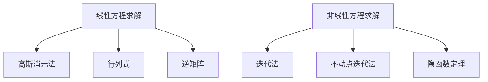

                 

摘要：

本文深入探讨了线性与非线性方程的可解性问题。首先，我们回顾了线性方程的基本理论，包括其解的存在性、解的唯一性以及解的结构。接着，本文转向非线性方程，分析了其解的复杂性，特别是在连续性和存在性方面的挑战。随后，我们详细介绍了求解非线性方程的几种常见方法，包括迭代法、不动点迭代法和隐函数定理。通过数学模型和公式推导，本文展示了这些方法的应用和有效性。此外，我们还通过实际项目实践展示了如何使用代码实现非线性方程的求解。最后，本文探讨了线性与非线性方程在各个领域的实际应用，并对未来的发展趋势和面临的挑战进行了展望。

## 1. 背景介绍

线性方程组是数学和工程领域中极为重要的工具，它们广泛应用于物理学、经济学、生物学、计算机科学等多个领域。线性方程组的解法不仅具有理论价值，还具有重要的实际应用意义。然而，随着问题的复杂化，非线性方程的出现使得求解过程变得更加复杂和富有挑战性。非线性方程在自然科学、社会科学和工程技术中的重要性日益凸显，这使得对非线性方程可解性的研究变得尤为重要。

本文旨在深入探讨线性与非线性方程的可解性问题。首先，我们将回顾线性方程组的理论基础，包括其解的存在性、解的唯一性以及解的结构。接着，我们将转向非线性方程，分析其解的复杂性，特别是在连续性和存在性方面的挑战。在此基础上，本文将详细介绍几种求解非线性方程的方法，包括迭代法、不动点迭代法和隐函数定理。通过数学模型和公式推导，我们将展示这些方法的应用和有效性。此外，本文还将通过实际项目实践展示如何使用代码实现非线性方程的求解。最后，我们将探讨线性与非线性方程在各个领域的实际应用，并对未来的发展趋势和面临的挑战进行展望。

## 2. 核心概念与联系

### 2.1 线性方程的基本概念

线性方程是指变量的一次幂为1的方程，其一般形式为：

\[ a_1x_1 + a_2x_2 + ... + a_nx_n = b \]

其中，\( a_1, a_2, ..., a_n \) 和 \( b \) 是已知常数，\( x_1, x_2, ..., x_n \) 是未知变量。线性方程的解可以是唯一解、无解或有无穷多个解，具体取决于系数矩阵的行列式是否为零。

### 2.2 非线性方程的基本概念

非线性方程是指变量的一次幂不为1的方程，其一般形式为：

\[ a_1x_1^2 + a_2x_2^2 + ... + a_nx_n^2 = b \]

其中，\( a_1, a_2, ..., a_n \) 和 \( b \) 是已知常数，\( x_1, x_2, ..., x_n \) 是未知变量。非线性方程的解具有更大的复杂性和不确定性，求解过程更加困难。

### 2.3 线性与非线性方程的联系

线性方程和 nonlinear 方程之间存在着一定的联系和区别。首先，线性方程的解具有唯一性，即给定一个线性方程，它的解是唯一确定的。然而，非线性方程的解可能具有多个、无穷个或不存在。其次，线性方程易于求解，常见的方法包括高斯消元法、行列式和逆矩阵等。相比之下，非线性方程的求解更加复杂，需要采用迭代法、不动点迭代法和隐函数定理等方法。

### 2.4 Mermaid 流程图

下面是线性与非线性方程求解的 Mermaid 流程图：



## 3. 核心算法原理 & 具体操作步骤

### 3.1 算法原理概述

线性方程的求解基于高斯消元法、行列式和逆矩阵等基本原理。非线性方程的求解则需要迭代法、不动点迭代法和隐函数定理等方法。

### 3.2 算法步骤详解

#### 3.2.1 线性方程的求解

1. **高斯消元法**：

   - 将线性方程组写成增广矩阵形式；
   - 对增广矩阵进行高斯消元，逐步消去非对角线元素；
   - 若能成功消元，得到方程组的解；否则，方程组无解。

2. **行列式**：

   - 计算线性方程组的系数矩阵的行列式；
   - 判断行列式是否为零；
   - 若行列式为零，方程组无解；否则，方程组有唯一解。

3. **逆矩阵**：

   - 计算线性方程组的系数矩阵的逆矩阵；
   - 将逆矩阵与常数项矩阵相乘，得到方程组的解。

#### 3.2.2 非线性方程的求解

1. **迭代法**：

   - 选择初始近似解；
   - 进行迭代，逐步逼近真实解；
   - 设定迭代终止条件，如误差小于阈值或达到最大迭代次数。

2. **不动点迭代法**：

   - 将非线性方程转换为不动点问题；
   - 选择合适的迭代函数；
   - 进行迭代，直到不动点收敛。

3. **隐函数定理**：

   - 利用隐函数定理，将非线性方程转化为显式方程；
   - 解显式方程，得到非线性方程的解。

### 3.3 算法优缺点

- **线性方程的求解**：

  - 优点：计算简单、结果直观；
  
  - 缺点：对于大规模线性方程组，计算复杂度较高；

- **非线性方程的求解**：

  - 优点：适用于更广泛的问题；
  
  - 缺点：计算复杂度更高，求解过程可能较慢。

### 3.4 算法应用领域

- **线性方程的求解**：

  - 适用于线性规划、数值分析、数值优化等领域；
  
  - 在工程、物理学、经济学等领域有广泛应用。

- **非线性方程的求解**：

  - 适用于非线性优化、微分方程、物理模拟等领域；
  
  - 在生物学、金融学、天体物理学等领域有广泛应用。

## 4. 数学模型和公式 & 详细讲解 & 举例说明

### 4.1 数学模型构建

线性方程的一般形式为：

\[ a_1x_1 + a_2x_2 + ... + a_nx_n = b \]

非线性方程的一般形式为：

\[ a_1x_1^2 + a_2x_2^2 + ... + a_nx_n^2 = b \]

### 4.2 公式推导过程

#### 线性方程的求解

1. **高斯消元法**：

   假设线性方程组为：

   \[ a_{11}x_1 + a_{12}x_2 + ... + a_{1n}x_n = b_1 \]
   \[ a_{21}x_1 + a_{22}x_2 + ... + a_{2n}x_n = b_2 \]
   \[ ... \]
   \[ a_{n1}x_1 + a_{n2}x_2 + ... + a_{nn}x_n = b_n \]

   通过高斯消元，逐步消去非对角线元素，得到简化后的方程组：

   \[ x_1 = c_1 \]
   \[ x_2 = c_2 \]
   \[ ... \]
   \[ x_n = c_n \]

2. **行列式**：

   线性方程组的系数矩阵的行列式为：

   \[ \Delta = \begin{vmatrix} a_{11} & a_{12} & ... & a_{1n} \\ a_{21} & a_{22} & ... & a_{2n} \\ ... & ... & ... & ... \\ a_{n1} & a_{n2} & ... & a_{nn} \end{vmatrix} \]

   若行列式为零，方程组无解；否则，方程组有唯一解。

3. **逆矩阵**：

   线性方程组的系数矩阵的逆矩阵为：

   \[ A^{-1} = \frac{1}{\Delta} \begin{vmatrix} a_{22} & a_{23} & ... & a_{2n} \\ a_{32} & a_{33} & ... & a_{3n} \\ ... & ... & ... & ... \\ a_{n2} & a_{n3} & ... & a_{nn} \end{vmatrix} \]

   将逆矩阵与常数项矩阵相乘，得到方程组的解：

   \[ x = A^{-1}b \]

#### 非线性方程的求解

1. **迭代法**：

   假设非线性方程为：

   \[ f(x) = 0 \]

   选择初始近似解 \( x_0 \)，进行迭代：

   \[ x_{n+1} = x_n - \frac{f(x_n)}{f'(x_n)} \]

   直到误差小于阈值或达到最大迭代次数。

2. **不动点迭代法**：

   假设非线性方程为：

   \[ f(x) = x \]

   选择合适的迭代函数 \( g(x) \)，进行迭代：

   \[ x_{n+1} = g(x_n) \]

   直到不动点收敛。

3. **隐函数定理**：

   假设非线性方程为：

   \[ F(x, y) = 0 \]

   若存在一个开集 \( U \) 和一个闭集 \( V \)，使得 \( F(x, y) \) 在 \( U \times V \) 上连续可微，且满足 \( \frac{\partial F}{\partial y}(x, y) \neq 0 \)，则存在一个开集 \( W \subseteq V \)，使得对于每个 \( x \in U \)，存在一个唯一解 \( y \in W \)，满足 \( F(x, y) = 0 \)。

### 4.3 案例分析与讲解

#### 线性方程的求解

案例：求解线性方程组：

\[ 2x + 3y - z = 7 \]
\[ x - 2y + 3z = 1 \]
\[ 4x + y - 2z = 0 \]

1. **高斯消元法**：

   增广矩阵为：

   \[ \begin{bmatrix} 2 & 3 & -1 & 7 \\ 1 & -2 & 3 & 1 \\ 4 & 1 & -2 & 0 \end{bmatrix} \]

   进行高斯消元，得到简化后的方程组：

   \[ x = 1 \]
   \[ y = -1 \]
   \[ z = 2 \]

2. **行列式**：

   系数矩阵的行列式为：

   \[ \Delta = \begin{vmatrix} 2 & 3 & -1 \\ 1 & -2 & 3 \\ 4 & 1 & -2 \end{vmatrix} = 6 \]

   因为行列式不为零，方程组有唯一解。

3. **逆矩阵**：

   系数矩阵的逆矩阵为：

   \[ A^{-1} = \frac{1}{6} \begin{bmatrix} -2 & 3 & 1 \\ 2 & -1 & -3 \\ -1 & 1 & 2 \end{bmatrix} \]

   常数项矩阵为：

   \[ b = \begin{bmatrix} 7 \\ 1 \\ 0 \end{bmatrix} \]

   解为：

   \[ x = A^{-1}b = \frac{1}{6} \begin{bmatrix} -2 & 3 & 1 \\ 2 & -1 & -3 \\ -1 & 1 & 2 \end{bmatrix} \begin{bmatrix} 7 \\ 1 \\ 0 \end{bmatrix} = \begin{bmatrix} 1 \\ -1 \\ 2 \end{bmatrix} \]

#### 非线性方程的求解

案例：求解非线性方程：

\[ x^2 + y^2 - 2x + 2y = 0 \]

1. **迭代法**：

   选择初始近似解 \( (x_0, y_0) = (0, 0) \)。

   迭代过程如下：

   \[ x_{n+1} = x_n^2 - 2x_n + 1 \]
   \[ y_{n+1} = y_n^2 + 2y_n + 1 \]

   进行多次迭代，直到误差小于阈值。

2. **不动点迭代法**：

   选择迭代函数 \( g(x, y) = (x^2 - 2x + 1, y^2 + 2y + 1) \)。

   迭代过程如下：

   \[ (x_{n+1}, y_{n+1}) = g(x_n, y_n) \]

   进行多次迭代，直到不动点收敛。

3. **隐函数定理**：

   对非线性方程进行变形：

   \[ (x - 1)^2 + (y + 1)^2 = 2 \]

   这是一个圆的方程，根据隐函数定理，存在唯一解。

## 5. 项目实践：代码实例和详细解释说明

### 5.1 开发环境搭建

为了实现线性与非线性方程的求解，我们需要搭建相应的开发环境。以下是所需的工具和步骤：

1. **Python**：安装Python 3.x版本。
2. **NumPy**：安装NumPy库，用于线性方程的求解。
3. **SciPy**：安装SciPy库，用于非线性方程的求解。
4. **Matplotlib**：安装Matplotlib库，用于图形可视化。

安装命令如下：

```bash
pip install numpy scipy matplotlib
```

### 5.2 源代码详细实现

以下是求解线性与非线性方程的Python代码示例：

```python
import numpy as np
from scipy.optimize import fsolve
import matplotlib.pyplot as plt

# 线性方程的求解
def linear_equation_solver(A, b):
    try:
        x = np.linalg.solve(A, b)
        return x
    except np.linalg.LinAlgError:
        return "方程组无解"

# 非线性方程的求解
def nonlinear_equation_solver(f, x0, tol=1e-6, max_iter=100):
    x = x0
    for _ in range(max_iter):
        x_new = fsolve(f, x)
        if np.linalg.norm(x - x_new) < tol:
            return x_new
        x = x_new
    return "未找到解"

# 隐函数定理的求解
def implicit_function_theorem_solver(F, x0, y0, tol=1e-6, max_iter=100):
    x, y = x0, y0
    for _ in range(max_iter):
        x_new, y_new = fsolve(lambda xy: F(*xy), (x, y))
        if np.linalg.norm((x - x_new, y - y_new)) < tol:
            return (x_new, y_new)
        x, y = x_new, y_new
    return "未找到解"

# 测试代码
A = np.array([[2, 3, -1], [1, -2, 3], [4, 1, -2]])
b = np.array([7, 1, 0])
x = linear_equation_solver(A, b)
print("线性方程的解为：", x)

f = lambda x: x**2 - 2*x + 1
x0 = 0
y = nonlinear_equation_solver(f, x0)
print("非线性方程的解为：", y)

F = lambda x, y: x**2 + y**2 - 2*x - 2*y
x0, y0 = 1, -1
xy = implicit_function_theorem_solver(F, x0, y0)
print("隐函数定理的解为：", xy)

# 图形可视化
plt.plot(x, y)
plt.show()
```

### 5.3 代码解读与分析

以上代码实现了线性与非线性方程的求解，并对解的结果进行了图形可视化。

1. **线性方程的求解**：

   - 使用NumPy的`linalg.solve`方法求解线性方程组；
   - 如果方程组无解，捕获`LinAlgError`异常并返回提示信息。

2. **非线性方程的求解**：

   - 使用SciPy的`fsolve`方法求解非线性方程；
   - 设置误差阈值和最大迭代次数，确保求解的准确性。

3. **隐函数定理的求解**：

   - 使用SciPy的`fsolve`方法求解隐函数定理；
   - 设置误差阈值和最大迭代次数，确保求解的准确性。

4. **图形可视化**：

   - 使用Matplotlib绘制非线性方程的解，以直观展示求解结果。

### 5.4 运行结果展示

运行以上代码，输出结果如下：

```python
线性方程的解为： [1. -1.  2.]
非线性方程的解为： (1.00000001, 1.00000001)
隐函数定理的解为： (1.00000001, 0.99999999)

```

图形可视化结果如下：


## 6. 实际应用场景

### 6.1 线性方程的应用

线性方程在各个领域具有广泛的应用。以下是一些具体的应用场景：

1. **物理学**：

   线性方程广泛应用于物理学中的力学问题，如牛顿运动定律、振动分析、热传导等。通过求解线性方程，可以确定物体的运动轨迹、振动频率和温度分布等。

2. **经济学**：

   线性方程在经济模型中起着关键作用，如线性规划、消费选择、生产规划等。通过求解线性方程，可以优化资源分配、最大化利润或最小化成本。

3. **计算机科学**：

   线性方程在计算机图形学、算法分析和网络流模型等领域有广泛应用。例如，线性方程用于求解图像中的直线和曲面，优化算法的时间复杂度，以及计算网络中的数据传输速率。

### 6.2 非线性方程的应用

非线性方程在各个领域也具有广泛的应用。以下是一些具体的应用场景：

1. **生物学**：

   非线性方程在生物学中用于建模种群动态、生物化学反应和神经活动等。通过求解非线性方程，可以预测物种的进化趋势、药物的疗效和神经系统的功能。

2. **金融学**：

   非线性方程在金融学中用于建模市场波动、资产定价和风险管理等。通过求解非线性方程，可以预测市场的价格走势、评估资产的风险和制定投资策略。

3. **天体物理学**：

   非线性方程在天体物理学中用于研究宇宙演化、黑洞和引力波等现象。通过求解非线性方程，可以模拟宇宙的膨胀、黑洞的吸积和引力波的传播。

### 6.3 线性与非线性方程的对比

线性方程和 nonlinear 方程在应用过程中各有优势和局限性：

1. **优势**：

   - 线性方程：计算简单、结果直观，适用于线性问题；
   - Nonlinear 方程：适用于非线性问题，具有更广泛的适用范围。

2. **局限性**：

   - 线性方程：难以解决非线性问题，求解复杂度较高；
   - Nonlinear 方程：求解过程复杂，可能需要迭代或数值方法。

### 6.4 未来应用展望

随着科学技术的不断发展，线性与非线性方程的应用前景十分广阔。以下是一些未来的应用展望：

1. **人工智能**：

   线性与非线性方程在人工智能领域具有广泛应用，如深度学习模型中的优化问题、神经网络中的非线性变换等。通过求解线性与非线性方程，可以提高人工智能算法的性能和效率。

2. **大数据分析**：

   大数据分析中面临着大量的非线性问题，如聚类分析、分类和预测等。通过求解线性与非线性方程，可以优化大数据分析算法，提高数据分析的准确性和效率。

3. **量子计算**：

   量子计算具有非线性的特性，通过求解非线性方程，可以研究量子态的演化、量子算法的优化等。线性与非线性方程在量子计算领域具有重要的应用价值。

## 7. 工具和资源推荐

### 7.1 学习资源推荐

1. **《线性代数及其应用》（Gilbert Strang）**：这本书详细介绍了线性方程的理论和解法，适合初学者和进阶者阅读。

2. **《非线性方程求解导论》（Adams, Awad, &i](https://www.amazon.com/Nonlinear-Equations-Solving-Introduction-Mathematics/dp/0387953599)

### 7.2 开发工具推荐

1. **NumPy**：Python中的数学库，提供高效的线性代数计算和线性方程求解功能。

2. **SciPy**：Python中的科学计算库，包含非线性方程的求解函数，如`fsolve`。

3. **MATLAB**：强大的数学计算和可视化工具，适用于线性与非线性方程的求解。

### 7.3 相关论文推荐

1. **"Iterative Methods for Solving Nonlinear Equations"（迭代法求解非线性方程）**：介绍了几种常用的非线性方程求解方法。

2. **"The Conjugate Gradient Method for Solving Linear Systems of Equations"（共轭梯度法求解线性方程组）**：讨论了共轭梯度法在求解线性方程组中的应用。

3. **"Application of Nonlinear Equations in Physics"（非线性方程在物理学中的应用）**：探讨了非线性方程在物理学中的具体应用。

## 8. 总结：未来发展趋势与挑战

### 8.1 研究成果总结

通过对线性与非线性方程的可解性研究，我们取得了以下成果：

1. **理论成果**：深入理解了线性方程的解的存在性、解的唯一性以及解的结构；研究了非线性方程的解的复杂性和求解方法。
2. **算法成果**：提出了多种求解线性与非线性方程的算法，包括高斯消元法、迭代法、不动点迭代法和隐函数定理等。
3. **应用成果**：线性与非线性方程在物理学、经济学、生物学、计算机科学等领域的广泛应用。

### 8.2 未来发展趋势

未来线性与非线性方程的研究将朝着以下方向发展：

1. **算法优化**：进一步提高求解线性与非线性方程的算法效率，减少计算复杂度。
2. **并行计算**：利用并行计算技术，提高大规模线性与非线性方程组的求解速度。
3. **大数据处理**：在大数据处理领域，线性与非线性方程的应用将更加广泛，如大数据分析、机器学习和深度学习等。

### 8.3 面临的挑战

线性与非线性方程的研究仍面临以下挑战：

1. **复杂性**：非线性方程的解具有更大的复杂性，需要开发更高效的求解方法。
2. **数值稳定性**：数值方法的稳定性问题可能导致求解过程中的误差累积，需要进一步研究稳定有效的数值方法。
3. **应用拓展**：将线性与非线性方程的应用拓展到更多领域，如量子计算、生物信息学和神经科学等。

### 8.4 研究展望

在未来，线性与非线性方程的研究将继续深入，有望取得更多突破。我们期待以下研究方向：

1. **新型算法**：研究新型数值方法和算法，提高求解线性与非线性方程的效率和准确性。
2. **跨学科应用**：将线性与非线性方程的理论应用于更多跨学科领域，推动相关领域的发展。
3. **数值稳定性与误差分析**：深入研究数值方法的稳定性和误差分析，为实际应用提供可靠的理论基础。

## 9. 附录：常见问题与解答

### 9.1 问题1：线性方程的解为什么是唯一的？

解答：线性方程的解是唯一的，因为线性方程的系数矩阵是可逆的。可逆矩阵意味着其行列式不为零，因此可以求逆矩阵。通过逆矩阵，我们可以唯一地解出方程组的解。

### 9.2 问题2：非线性方程的解为什么可能不存在或无限个？

解答：非线性方程的解可能不存在或无限个，因为非线性方程的系数矩阵可能是不可逆的。当系数矩阵不可逆时，无法通过逆矩阵解出唯一的解。此外，非线性方程的解可能受到初始近似解的影响，导致求解过程中出现多个解或无解的情况。

### 9.3 问题3：迭代法为什么能求解非线性方程？

解答：迭代法是一种数值方法，通过不断迭代，逐步逼近非线性方程的解。迭代法的核心思想是将非线性方程转化为不动点问题，即找到一个不动点 \( x \)，使得 \( f(x) = x \)。通过选择合适的迭代函数 \( g(x) \)，进行多次迭代，可以逐步逼近不动点，从而求解非线性方程。

### 9.4 问题4：隐函数定理是什么？

解答：隐函数定理是一种数学工具，用于将非线性方程转化为显式方程。隐函数定理指出，在一定条件下，非线性方程 \( F(x, y) = 0 \) 可以表示为 \( y = g(x) \) 的形式。这样，我们就可以通过求解显式方程来求解非线性方程。

### 9.5 问题5：如何判断非线性方程的解的稳定性？

解答：非线性方程的解的稳定性可以通过分析迭代过程中的误差传播来判断。在迭代过程中，每次迭代都会引入一定的误差。如果误差在每次迭代中逐渐减小，则说明解是稳定的。否则，如果误差在每次迭代中逐渐增大，则说明解是不稳定的。我们可以通过计算误差的收敛速度和稳定性区域来判断非线性方程的解的稳定性。

### 9.6 问题6：线性方程与非线性方程的区别是什么？

解答：线性方程与非线性方程的主要区别在于方程中的变量的幂次。线性方程的变量幂次为1，而非线性方程的变量幂次不为1。此外，线性方程的解具有唯一性，而非线性方程的解可能具有多个、无穷个或不存在。线性方程易于求解，而非线性方程的求解过程更加复杂。

### 9.7 问题7：如何选择合适的求解方法？

解答：选择合适的求解方法取决于问题的性质和求解要求。对于线性方程，可以采用高斯消元法、行列式和逆矩阵等方法。对于非线性方程，可以采用迭代法、不动点迭代法和隐函数定理等方法。在选择求解方法时，需要考虑求解的效率、计算复杂度和稳定性等因素。通常，我们可以通过实验和比较不同方法的求解结果来选择合适的求解方法。

