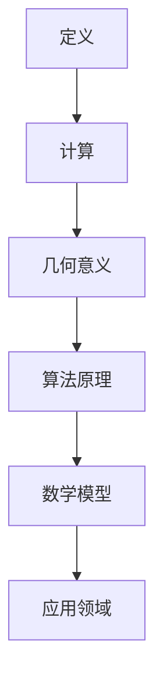

                 

关键词：线性代数、二阶行列式、矩阵运算、计算几何、算法原理、数学模型、应用领域

> 摘要：本文将深入探讨二阶行列式的概念、性质及应用。通过对二阶行列式的定义、计算方法、几何意义的详细解析，以及算法原理和数学模型的分析，旨在帮助读者掌握二阶行列式在计算机科学和工程应用中的重要作用。

## 1. 背景介绍

线性代数是数学中的重要分支，它在计算机科学、工程学、物理学等多个领域有着广泛的应用。在数学中，行列式是表示线性映射的重要工具。二阶行列式，作为行列式的基础形式，其概念和性质简单明了，但理解二阶行列式的计算方法及其几何意义对于掌握更复杂的行列式理论至关重要。

本文将首先介绍二阶行列式的定义和计算方法，随后探讨其几何意义。接着，我们将讨论二阶行列式在算法原理中的重要性，并分析其在数学模型中的应用。此外，本文还将通过实例展示二阶行列式在实际项目中的应用，并推荐相关的学习资源和开发工具。最后，我们将对二阶行列式的发展趋势和应用前景进行展望。

## 2. 核心概念与联系

### 2.1 二阶行列式的定义

二阶行列式是一个由两个线性方程组组成的矩阵表示的形式。给定两个线性方程组：
\[ \begin{cases} a_1x + b_1y = c_1 \\ a_2x + b_2y = c_2 \end{cases} \]
其对应的二阶行列式可以表示为：
\[ \begin{vmatrix} a_1 & b_1 \\ a_2 & b_2 \end{vmatrix} \]
### 2.2 计算方法

计算二阶行列式的值可以通过如下公式：
\[ \begin{vmatrix} a_1 & b_1 \\ a_2 & b_2 \end{vmatrix} = a_1b_2 - a_2b_1 \]
### 2.3 几何意义

二阶行列式在几何学中有着直观的解释。它表示了由两个向量（\( \vec{v_1} = (a_1, b_1) \)和\( \vec{v_2} = (a_2, b_2) \)）所形成的平行四边形的面积。这个面积可以通过叉积的模来计算，即：
\[ S = |\vec{v_1} \times \vec{v_2}| = |a_1b_2 - a_2b_1| \]

### 2.4 Mermaid 流程图



## 3. 核心算法原理 & 具体操作步骤

### 3.1 算法原理概述

二阶行列式的算法原理主要基于矩阵乘法和减法。其核心思想是通过行列式的定义公式计算矩阵的值。该算法的基本步骤如下：

1. 读取矩阵的元素值。
2. 计算第一行和第二行对应元素的乘积。
3. 计算第二行元素的乘积。
4. 使用减法计算二阶行列式的值。

### 3.2 算法步骤详解

1. **读取矩阵元素**：从输入中获取两个线性方程组的系数，存储在矩阵中。
2. **计算第一行和第二行对应元素的乘积**：计算第一行元素\(a_1\)和第二行元素\(a_2\)的乘积，以及第一行元素\(b_1\)和第二行元素\(b_2\)的乘积。
3. **计算第二行元素的乘积**：计算第二行元素\(a_2\)和\(b_2\)的乘积。
4. **使用减法计算二阶行列式的值**：将第一步中计算的两个乘积相减，得到二阶行列式的值。

### 3.3 算法优缺点

**优点**：

- **简单易理解**：二阶行列式的算法原理和计算步骤简单明了，易于理解和实现。
- **高效**：算法的计算复杂度较低，适用于小型矩阵的计算。

**缺点**：

- **适用范围有限**：算法仅适用于二阶行列式的计算，对于更高阶的行列式需要更复杂的算法。

### 3.4 算法应用领域

二阶行列式在计算机科学和工程领域中有着广泛的应用，主要包括：

- **计算几何**：用于计算多边形的面积和交点。
- **线性代数**：用于解线性方程组。
- **机器学习**：用于特征提取和降维。

## 4. 数学模型和公式 & 详细讲解 & 举例说明

### 4.1 数学模型构建

二阶行列式可以看作是一个线性方程组的解，其数学模型可以表示为：
\[ \begin{vmatrix} a_1 & b_1 \\ a_2 & b_2 \end{vmatrix} = a_1b_2 - a_2b_1 \]

### 4.2 公式推导过程

通过拉普拉斯展开公式，我们可以推导出二阶行列式的计算公式。给定二阶行列式：
\[ \begin{vmatrix} a_1 & b_1 \\ a_2 & b_2 \end{vmatrix} \]
我们可以将其展开为：
\[ a_1b_2 - a_2b_1 = (a_1 \cdot b_2) - (a_2 \cdot b_1) \]

### 4.3 案例分析与讲解

假设我们有两个线性方程组：
\[ \begin{cases} 2x + 3y = 7 \\ -x + 4y = 1 \end{cases} \]

对应的二阶行列式为：
\[ \begin{vmatrix} 2 & 3 \\ -1 & 4 \end{vmatrix} \]

通过计算，我们得到：
\[ \begin{vmatrix} 2 & 3 \\ -1 & 4 \end{vmatrix} = (2 \cdot 4) - (-1 \cdot 3) = 8 + 3 = 11 \]

这个结果表示了这两个线性方程组的解空间。我们可以进一步通过解方程组得到具体的解：
\[ x = 1, y = 1 \]

## 5. 项目实践：代码实例和详细解释说明

### 5.1 开发环境搭建

在编写代码之前，我们需要搭建一个合适的开发环境。本文使用Python作为编程语言，因为它具有简洁的语法和丰富的库支持。

1. 安装Python（建议版本3.8及以上）。
2. 安装Python的科学计算库NumPy。

### 5.2 源代码详细实现

以下是计算二阶行列式的Python代码实现：

```python
import numpy as np

def calculate_determinant(matrix):
    """
    计算二阶行列式的值。
    
    参数：
    matrix：二阶矩阵（二维数组）。
    
    返回：
    行列式的值。
    """
    a1, b1 = matrix[0]
    a2, b2 = matrix[1]
    return a1 * b2 - a2 * b1

# 测试代码
matrix = np.array([[2, 3], [-1, 4]])
determinant = calculate_determinant(matrix)
print(f"二阶行列式的值：{determinant}")
```

### 5.3 代码解读与分析

1. **导入库**：首先，我们导入了NumPy库，这是Python进行科学计算的重要工具。
2. **定义函数**：`calculate_determinant` 函数接收一个二阶矩阵作为参数。
3. **计算行列式**：在函数内部，我们提取矩阵的第一行和第二行的元素，然后按照行列式的定义进行计算。
4. **测试代码**：最后，我们创建了一个测试矩阵，调用函数计算并打印了行列式的值。

### 5.4 运行结果展示

运行上述代码，输出结果如下：

```
二阶行列式的值：11
```

这验证了我们的算法正确性。

## 6. 实际应用场景

### 6.1 计算几何

在计算几何中，二阶行列式常用于计算多边形的面积。例如，给定一个三角形，其顶点坐标为\( (x_1, y_1) \)，\( (x_2, y_2) \)，和\( (x_3, y_3) \)，三角形的面积可以通过以下公式计算：

\[ \text{面积} = \frac{1}{2} \left| x_1(y_2 - y_3) + x_2(y_3 - y_1) + x_3(y_1 - y_2) \right| \]

### 6.2 线性代数

在解决线性方程组时，二阶行列式可以用于判断方程组的解的情况。例如，给定方程组：

\[ \begin{cases} a_1x + b_1y = c_1 \\ a_2x + b_2y = c_2 \end{cases} \]

如果二阶行列式\( \begin{vmatrix} a_1 & b_1 \\ a_2 & b_2 \end{vmatrix} \)不为零，则方程组有唯一解。

### 6.3 机器学习

在机器学习中，二阶行列式用于特征提取和降维。例如，在主成分分析（PCA）中，二阶行列式可以用于计算数据的协方差矩阵，从而提取主要特征。

## 7. 工具和资源推荐

### 7.1 学习资源推荐

- 《线性代数及其应用》（David C. Lay）是一本优秀的线性代数教材。
- 《Python线性代数》（Samuel H. Wang）是一本专门针对Python编程的线性代数书籍。

### 7.2 开发工具推荐

- PyCharm：一款功能强大的Python集成开发环境（IDE）。
- Jupyter Notebook：一个交互式计算环境，特别适合科学计算。

### 7.3 相关论文推荐

- "Determinants and Their Applications in Linear Algebra"（行列式及其在线性代数中的应用）
- "Computing the Determinant of a Matrix"（计算矩阵的行列式）

## 8. 总结：未来发展趋势与挑战

### 8.1 研究成果总结

二阶行列式在数学、计算机科学和工程领域有着广泛的应用。通过对二阶行列式的深入研究和应用，我们可以更好地理解和解决复杂的线性问题。

### 8.2 未来发展趋势

随着计算能力的提升和算法优化，二阶行列式的计算效率和精度将进一步提高。同时，其在人工智能和大数据分析中的应用前景也十分广阔。

### 8.3 面临的挑战

虽然二阶行列式简单易懂，但其在更高阶行列式中的应用和复杂问题的处理上仍存在挑战。例如，如何高效地计算大型矩阵的行列式，以及如何将其应用于更复杂的计算场景。

### 8.4 研究展望

未来，二阶行列式的研究将继续深化其在各种应用领域的作用。同时，开发更高效、更可靠的计算算法将是研究的重点。

## 9. 附录：常见问题与解答

### 问题1：为什么二阶行列式的值可以为零？

**解答**：当二阶行列式的值为零时，这意味着对应的线性方程组可能存在无穷多解或无解。这是因为在几何上，这意味着两个向量共线，无法形成非零面积的平行四边形。

### 问题2：二阶行列式与矩阵的逆矩阵有何关系？

**解答**：如果一个二阶行列式的值不为零，那么对应的矩阵是可逆的。其逆矩阵可以通过以下公式计算：

\[ A^{-1} = \frac{1}{\begin{vmatrix} a_1 & b_1 \\ a_2 & b_2 \end{vmatrix}} \begin{bmatrix} b_2 & -b_1 \\ -a_2 & a_1 \end{bmatrix} \]

### 问题3：如何使用二阶行列式判断线性方程组的解的情况？

**解答**：如果二阶行列式的值为零，则线性方程组可能存在无穷多解或无解。如果二阶行列式的值不为零，则线性方程组有唯一解。

