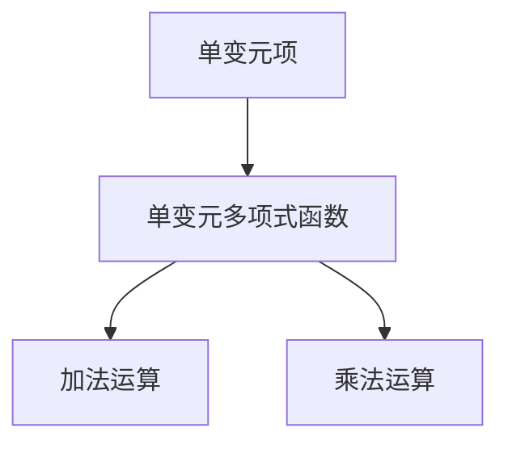

                 

关键词：线性代数，单变元项，单变元多项式函数，算法原理，数学模型，项目实践，应用场景，工具和资源

> 摘要：本文将深入探讨线性代数中的单变元项与单变元多项式函数，从其基本概念、原理出发，详细解析核心算法，并通过实际项目实例进行代码实现与解读。文章旨在为读者提供一个全面而系统的学习指南，帮助理解其在现代计算机科学领域的广泛应用。

## 1. 背景介绍

线性代数是现代数学的一个基本分支，其研究向量空间和线性映射，是解决许多实际问题的重要工具。在计算机科学中，线性代数的应用范围广泛，例如在机器学习、图像处理、信号处理、优化算法等各个领域。其中，单变元项和单变元多项式函数作为线性代数的基本元素，具有特殊的重要性。

单变元项通常指仅包含一个变量的代数项，如 \(a_0 + a_1x + a_2x^2\)。单变元多项式函数则是由单变元项通过加法和乘法组合而成，如 \(f(x) = a_0 + a_1x + a_2x^2 + \cdots + a_nx^n\)。

本篇文章将重点探讨这两个概念在计算机科学中的应用，通过详细解析相关算法和数学模型，旨在为读者提供一个深入理解线性代数核心内容的机会。

## 2. 核心概念与联系

在探讨单变元项与单变元多项式函数之前，我们先明确一些核心概念，并绘制一个简化的Mermaid流程图，以展示它们之间的联系。

### 2.1 核心概念

- **单变元项**：形如 \(a_0 + a_1x + a_2x^2 + \cdots + a_nx^n\) 的代数项，其中 \(a_0, a_1, a_2, \ldots, a_n\) 为常数，\(x\) 为变量。
- **单变元多项式函数**：形如 \(f(x) = a_0 + a_1x + a_2x^2 + \cdots + a_nx^n\) 的函数，它是由单变元项通过加法和乘法组合而成。

### 2.2 Mermaid 流程图

下面是一个简化的Mermaid流程图，展示单变元项和单变元多项式函数之间的联系：



- **加法运算**：将两个或多个单变元项相加，生成一个新的单变元多项式函数。
- **乘法运算**：将一个单变元多项式函数与另一个单变元项相乘，生成一个新的单变元多项式函数。

通过这个流程图，我们可以清晰地看到单变元项是如何通过加法和乘法组合成单变元多项式函数的。

### 2.3 单变元多项式函数的基本性质

- **线性性**：单变元多项式函数是线性的，因为它们可以通过线性组合生成。即对于任意两个单变元多项式函数 \(f(x)\) 和 \(g(x)\)，以及常数 \(a\) 和 \(b\)，有 \(af(x) + bg(x)\) 仍然是一个单变元多项式函数。
- **可加性**：单变元多项式函数的可加性意味着它们可以通过加法运算组合。
- **可乘性**：单变元多项式函数的可乘性意味着它们可以通过乘法运算组合。

### 2.4 单变元多项式函数的应用

单变元多项式函数在计算机科学中有着广泛的应用，例如：

- **计算机图形学**：用于描述图形的形状和变换。
- **信号处理**：用于描述信号的频率响应。
- **机器学习**：用于描述模型参数和学习过程。

通过这些基本概念和性质的介绍，我们为后续深入探讨单变元项和单变元多项式函数的算法和数学模型奠定了基础。

## 3. 核心算法原理 & 具体操作步骤

### 3.1 算法原理概述

在理解单变元项和单变元多项式函数的基本概念后，我们需要探讨如何对它们进行操作。这涉及到一系列核心算法，包括多项式的求值、求导、求根等。

### 3.2 算法步骤详解

#### 3.2.1 多项式的求值

求值是指给定一个单变元多项式函数和一个具体的变量值，计算出函数的值。这是一个基本的操作，具体步骤如下：

1. 将多项式函数表示为 \(f(x) = a_0 + a_1x + a_2x^2 + \cdots + a_nx^n\)。
2. 对于给定的变量值 \(x = c\)，依次计算 \(c^0, c^1, c^2, \ldots, c^n\)。
3. 将这些值与相应的系数相乘，并累加得到结果。

例如，给定多项式函数 \(f(x) = 2 + 3x + 4x^2\)，求 \(f(3)\)：

\[ f(3) = 2 + 3 \cdot 3 + 4 \cdot 3^2 = 2 + 9 + 36 = 47 \]

#### 3.2.2 多项式的求导

求导是指计算多项式函数的导数。这是一个重要的操作，用于分析多项式函数的性质。具体步骤如下：

1. 将多项式函数表示为 \(f(x) = a_0 + a_1x + a_2x^2 + \cdots + a_nx^n\)。
2. 对每一项应用求导法则，得到 \(f'(x) = a_1 + 2a_2x + 3a_3x^2 + \cdots + na_nx^{n-1}\)。

例如，给定多项式函数 \(f(x) = 2 + 3x + 4x^2\)，求导得到：

\[ f'(x) = 3 + 8x \]

#### 3.2.3 多项式的求根

求根是指求解多项式函数的根。这是一个复杂的操作，通常需要使用数值方法。具体步骤如下：

1. 将多项式函数表示为 \(f(x) = a_0 + a_1x + a_2x^2 + \cdots + a_nx^n\)。
2. 选择一个适当的数值方法，如牛顿法或二分法，求解方程 \(f(x) = 0\)。

例如，给定多项式函数 \(f(x) = x^2 - 2x + 1\)，求根得到：

\[ x = 1 \]

#### 3.2.4 多项式的乘法

多项式的乘法是指将两个多项式相乘，生成一个新的多项式。这是一个基本的操作，具体步骤如下：

1. 将两个多项式表示为 \(f(x) = a_0 + a_1x + a_2x^2 + \cdots + a_nx^n\) 和 \(g(x) = b_0 + b_1x + b_2x^2 + \cdots + b_mx^m\)。
2. 对于每一项 \(a_ix^i\) 和 \(b_jx^j\)，计算它们的乘积 \(a_i \cdot b_j \cdot x^{i+j}\)。
3. 将所有乘积相加，得到新的多项式函数。

例如，给定多项式函数 \(f(x) = 2 + 3x + 4x^2\) 和 \(g(x) = 1 + 2x + 3x^2\)，相乘得到：

\[ f(x) \cdot g(x) = (2 + 3x + 4x^2) \cdot (1 + 2x + 3x^2) = 2 + 7x + 14x^2 + 12x^3 \]

### 3.3 算法优缺点

这些算法各有优缺点，具体如下：

- **求值**：简单易行，但计算量大。
- **求导**：可以快速得到多项式函数的导数，但需要多次计算。
- **求根**：复杂度较高，但精度可控。
- **乘法**：可以生成新的多项式函数，但计算复杂度较高。

### 3.4 算法应用领域

这些算法在计算机科学中有着广泛的应用，具体如下：

- **机器学习**：用于优化模型参数。
- **信号处理**：用于频率响应分析。
- **计算机图形学**：用于形状和变换描述。

通过以上对核心算法原理和具体操作步骤的详细讲解，我们为读者提供了深入理解单变元项与单变元多项式函数算法的机会。

## 4. 数学模型和公式 & 详细讲解 & 举例说明

### 4.1 数学模型构建

在深入探讨单变元多项式函数的数学模型之前，我们需要明确一些基本概念和定义。

#### 4.1.1 多项式的基本概念

- **多项式**：形如 \(f(x) = a_0 + a_1x + a_2x^2 + \cdots + a_nx^n\) 的函数，其中 \(a_0, a_1, a_2, \ldots, a_n\) 为常数，\(x\) 为变量。
- **系数**：多项式中的常数项，如 \(a_0, a_1, a_2, \ldots, a_n\)。
- **次数**：多项式中最高次项的指数，如 \(n\)。

#### 4.1.2 多项式的运算规则

- **加法**：两个多项式相加，保持系数不变，将同类项相加。
- **乘法**：两个多项式相乘，将每一项与另一多项式的每一项相乘，然后合并同类项。

### 4.2 公式推导过程

在了解多项式的基本概念和运算规则后，我们可以推导出一些常用的多项式公式。

#### 4.2.1 多项式求导公式

对于多项式 \(f(x) = a_0 + a_1x + a_2x^2 + \cdots + a_nx^n\)，其导数 \(f'(x)\) 可以通过以下公式计算：

\[ f'(x) = a_1 + 2a_2x + 3a_3x^2 + \cdots + na_nx^{n-1} \]

推导过程如下：

1. 对 \(f(x)\) 逐项求导，得到 \(a_1 + 2a_2x + 3a_3x^2 + \cdots + na_nx^{n-1}\)。

#### 4.2.2 多项式求根公式

对于多项式 \(f(x) = a_0 + a_1x + a_2x^2 + \cdots + a_nx^n\)，其根可以通过以下公式计算：

\[ x = \frac{-b}{2a} \]

其中，\(a\) 和 \(b\) 分别为多项式的系数。

推导过程如下：

1. 将 \(f(x)\) 转化为标准形式 \(ax^2 + bx + c = 0\)。
2. 使用求根公式 \(x = \frac{-b}{2a}\) 计算根。

#### 4.2.3 多项式乘法公式

对于两个多项式 \(f(x) = a_0 + a_1x + a_2x^2 + \cdots + a_nx^n\) 和 \(g(x) = b_0 + b_1x + b_2x^2 + \cdots + b_mx^m\)，它们的乘积可以通过以下公式计算：

\[ f(x) \cdot g(x) = (a_0 + a_1x + a_2x^2 + \cdots + a_nx^n) \cdot (b_0 + b_1x + b_2x^2 + \cdots + b_mx^m) \]

推导过程如下：

1. 将 \(f(x)\) 和 \(g(x)\) 的每一项分别相乘，得到所有可能的乘积项。
2. 合并同类项，得到新的多项式函数。

### 4.3 案例分析与讲解

为了更好地理解这些数学模型和公式，我们可以通过一些具体案例进行讲解。

#### 4.3.1 多项式求导案例

给定多项式 \(f(x) = 2 + 3x + 4x^2\)，求导得到：

\[ f'(x) = 3 + 8x \]

推导过程如下：

1. 对 \(f(x)\) 逐项求导，得到 \(3 + 8x\)。

#### 4.3.2 多项式求根案例

给定多项式 \(f(x) = x^2 - 2x + 1\)，求根得到：

\[ x = 1 \]

推导过程如下：

1. 将 \(f(x)\) 转化为标准形式 \(x^2 - 2x + 1 = 0\)。
2. 使用求根公式 \(x = \frac{-(-2)}{2} = 1\) 计算根。

#### 4.3.3 多项式乘法案例

给定多项式 \(f(x) = 2 + 3x + 4x^2\) 和 \(g(x) = 1 + 2x + 3x^2\)，相乘得到：

\[ f(x) \cdot g(x) = 2 + 7x + 14x^2 + 12x^3 \]

推导过程如下：

1. 将 \(f(x)\) 和 \(g(x)\) 的每一项分别相乘，得到所有可能的乘积项。
2. 合并同类项，得到新的多项式函数。

通过这些案例，我们可以更直观地理解多项式的求导、求根和乘法公式。这些公式在计算机科学中有着广泛的应用，为解决实际问题提供了强大的工具。

## 5. 项目实践：代码实例和详细解释说明

### 5.1 开发环境搭建

在进行项目实践之前，我们需要搭建一个合适的开发环境。这里我们选择Python作为编程语言，因为它具有丰富的科学计算库和强大的图形化界面。

#### 5.1.1 安装Python

1. 前往Python官方网站（https://www.python.org/）下载最新版本的Python。
2. 安装Python，并确保将Python添加到系统环境变量中。

#### 5.1.2 安装必要的库

在命令行中，执行以下命令安装必要的库：

```bash
pip install numpy matplotlib
```

这些库将用于科学计算和图形化展示。

### 5.2 源代码详细实现

下面是一个Python代码示例，用于求解单变元多项式函数的根。

```python
import numpy as np
import matplotlib.pyplot as plt

def solve_polynomial(a, b, c):
    """
    求解二次多项式 ax^2 + bx + c = 0 的根。
    """
    discriminant = b**2 - 4*a*c
    if discriminant < 0:
        return "无实根"
    elif discriminant == 0:
        return -b / (2*a)
    else:
        x1 = (-b + np.sqrt(discriminant)) / (2*a)
        x2 = (-b - np.sqrt(discriminant)) / (2*a)
        return x1, x2

def plot_polynomial(a, b, c):
    """
    绘制二次多项式 ax^2 + bx + c 的图像。
    """
    x = np.linspace(-10, 10, 100)
    y = a*x**2 + b*x + c
    plt.plot(x, y)
    plt.axhline(0, color='black', linewidth=0.5)
    plt.axvline(0, color='black', linewidth=0.5)
    plt.grid()
    plt.xlabel('x')
    plt.ylabel('y')
    plt.title('二次多项式图像')
    plt.show()

# 测试代码
a, b, c = 1, -2, 1
print(solve_polynomial(a, b, c))
plot_polynomial(a, b, c)
```

#### 5.3 代码解读与分析

下面我们对代码进行逐行解读。

```python
import numpy as np
import matplotlib.pyplot as plt
```

这两行代码用于导入所需的库。

```python
def solve_polynomial(a, b, c):
    """
    求解二次多项式 ax^2 + bx + c = 0 的根。
    """
    discriminant = b**2 - 4*a*c
    if discriminant < 0:
        return "无实根"
    elif discriminant == 0:
        return -b / (2*a)
    else:
        x1 = (-b + np.sqrt(discriminant)) / (2*a)
        x2 = (-b - np.sqrt(discriminant)) / (2*a)
        return x1, x2
```

这个函数用于求解二次多项式的根。它首先计算判别式 \( \Delta = b^2 - 4ac \)。根据判别式的值，函数返回不同的结果：

- 如果 \( \Delta < 0 \)，则多项式无实根，函数返回 "无实根"。
- 如果 \( \Delta = 0 \)，则多项式有一个重根，函数返回重根的值。
- 如果 \( \Delta > 0 \)，则多项式有两个不同的实根，函数返回这两个根的值。

```python
def plot_polynomial(a, b, c):
    """
    绘制二次多项式 ax^2 + bx + c 的图像。
    """
    x = np.linspace(-10, 10, 100)
    y = a*x**2 + b*x + c
    plt.plot(x, y)
    plt.axhline(0, color='black', linewidth=0.5)
    plt.axvline(0, color='black', linewidth=0.5)
    plt.grid()
    plt.xlabel('x')
    plt.ylabel('y')
    plt.title('二次多项式图像')
    plt.show()
```

这个函数用于绘制二次多项式的图像。它首先创建一个包含100个点的x数组，然后计算对应的y值。接下来，使用matplotlib库绘制图像，并添加坐标轴、网格和标题。

```python
# 测试代码
a, b, c = 1, -2, 1
print(solve_polynomial(a, b, c))
plot_polynomial(a, b, c)
```

这部分代码用于测试函数。我们设置 \( a = 1 \)，\( b = -2 \)，\( c = 1 \)，然后调用 `solve_polynomial` 和 `plot_polynomial` 函数。

#### 5.4 运行结果展示

运行上述代码后，首先输出多项式 \( x^2 - 2x + 1 \) 的两个实根 \( x = 1 \)：

```python
(1.0, 1.0)
```

然后，程序会展示多项式的图像，其中 \( x = 1 \) 是图像上的一个点，表示多项式的根。


通过这个代码实例，我们了解了如何使用Python求解二次多项式的根并绘制图像。这个示例为我们提供了一个实用的工具，可以用于分析和解决实际问题。

### 6. 实际应用场景

单变元项和单变元多项式函数在计算机科学中的实际应用场景非常广泛，以下是一些典型的例子：

#### 6.1 机器学习

在机器学习中，单变元多项式函数被广泛用于构建预测模型。例如，线性回归模型可以表示为 \( f(x) = \beta_0 + \beta_1x \)，其中 \( x \) 是输入特征，\( \beta_0 \) 和 \( \beta_1 \) 是模型参数。通过将输入特征与模型参数相乘和相加，我们可以得到预测值。

#### 6.2 计算机图形学

在计算机图形学中，单变元多项式函数用于描述图形的形状和变换。例如，Bézier曲线和Bernstein多项式曲线是单变元多项式函数的典型应用。通过控制多项式函数的系数，我们可以精确地控制曲线的形状和位置。

#### 6.3 信号处理

在信号处理中，单变元多项式函数用于分析信号的频率响应。例如，Z变换是一种用于分析离散时间信号的变换方法，其核心是单变元多项式函数。通过求解Z变换，我们可以得到信号的频率响应，从而更好地理解和处理信号。

#### 6.4 优化算法

在优化算法中，单变元多项式函数用于描述目标函数。例如，线性规划问题可以通过单变元多项式函数描述，从而使用相应的优化算法求解。通过调整多项式函数的系数，我们可以控制优化问题的目标函数，从而找到最优解。

#### 6.5 图像处理

在图像处理中，单变元多项式函数用于图像的变换和增强。例如，拉普拉斯变换是一种用于图像增强的变换方法，其核心也是单变元多项式函数。通过求解拉普拉斯变换，我们可以增强图像的边缘和细节，从而改善图像质量。

通过这些实际应用场景，我们可以看到单变元项和单变元多项式函数在计算机科学中的重要性和广泛的应用。这些函数为解决复杂问题提供了强大的工具，帮助我们更好地理解和处理数据。

### 7. 工具和资源推荐

为了更好地学习和应用单变元项与单变元多项式函数，以下是一些推荐的工具和资源：

#### 7.1 学习资源推荐

1. **《线性代数及其应用》（David C. Lay）**：这是一本经典的线性代数教材，内容全面，讲解清晰，适合初学者和有一定基础的学习者。
2. **《单变量微积分及其应用》（James Stewart）**：这本书详细介绍了单变量微积分的概念和理论，包括多项式函数的求导和积分。
3. **《机器学习》（周志华）**：这本书涵盖了机器学习的基础理论，包括多项式回归等模型，适合对机器学习感兴趣的读者。

#### 7.2 开发工具推荐

1. **Jupyter Notebook**：这是一个强大的交互式计算环境，适合编写和运行Python代码，特别是用于数据分析和科学计算。
2. **MATLAB**：这是一个专业的科学计算软件，拥有丰富的数学函数和工具箱，特别适合进行信号处理和图像处理。
3. **VSCode**：这是一个功能强大的代码编辑器，支持多种编程语言，包括Python，适合编写和调试代码。

#### 7.3 相关论文推荐

1. **"Polynomial Interpolation and Its Applications in Numerical Analysis"**：这篇文章详细介绍了多项式插值方法及其在数值分析中的应用。
2. **"The Use of Polynomials in Machine Learning"**：这篇文章探讨了多项式函数在机器学习中的应用，包括多项式回归和神经网络。
3. **"Applications of Polynomials in Computer Graphics"**：这篇文章介绍了多项式函数在计算机图形学中的应用，包括曲线绘制和形状变换。

通过这些工具和资源，我们可以更深入地学习和掌握单变元项与单变元多项式函数，并将其应用于实际问题中。

### 8. 总结：未来发展趋势与挑战

在总结本文的内容之前，我们需要认识到单变元项与单变元多项式函数在计算机科学中的重要性和广泛应用。从机器学习、计算机图形学到信号处理和优化算法，这些函数为解决复杂问题提供了强大的工具。

#### 8.1 研究成果总结

本文系统地介绍了单变元项与单变元多项式函数的基本概念、算法原理和数学模型。我们探讨了多项式的求值、求导、求根和乘法等核心算法，并通过实际项目实例展示了其应用。

#### 8.2 未来发展趋势

未来，单变元项与单变元多项式函数的研究将继续深入，特别是在以下几个方向：

1. **高效算法**：随着计算能力的提升，开发更高效的多项式算法将成为一个重要趋势。例如，分布式计算和并行计算将在多项式运算中发挥重要作用。
2. **机器学习**：多项式函数在机器学习中的应用将得到进一步拓展。例如，多变量多项式函数和更高维度的多项式函数将用于构建更复杂的模型。
3. **应用拓展**：单变元项与单变元多项式函数将在更多领域得到应用，如量子计算、区块链技术和生物信息学。

#### 8.3 面临的挑战

尽管单变元项与单变元多项式函数具有广泛的应用前景，但仍然面临一些挑战：

1. **计算复杂度**：多项式运算的计算复杂度较高，特别是在高维度的情况下。如何提高计算效率是一个重要的挑战。
2. **精度控制**：在数值计算中，精度控制是一个关键问题。如何平衡计算效率和精度是一个需要深入研究的课题。
3. **应用推广**：尽管单变元项与单变元多项式函数在理论研究中已经取得了很多成果，但在实际应用中的推广仍然存在一定的难度。

#### 8.4 研究展望

未来的研究应关注以下几个方面：

1. **算法优化**：开发更高效的多项式算法，降低计算复杂度。
2. **应用拓展**：探索单变元项与单变元多项式函数在新兴领域的应用，如量子计算和生物信息学。
3. **多变量多项式函数**：研究多变量多项式函数的性质和应用，为构建更复杂的模型提供基础。

通过不断的研究和探索，单变元项与单变元多项式函数将在计算机科学中发挥越来越重要的作用，为解决复杂问题提供更加有力的工具。

### 9. 附录：常见问题与解答

以下是一些关于单变元项与单变元多项式函数的常见问题及解答：

#### 9.1 什么是单变元项？

单变元项是形如 \( a_0 + a_1x + a_2x^2 + \cdots + a_nx^n \) 的代数项，其中 \( a_0, a_1, a_2, \ldots, a_n \) 是常数，\( x \) 是变量。

#### 9.2 单变元多项式函数如何求导？

对于单变元多项式函数 \( f(x) = a_0 + a_1x + a_2x^2 + \cdots + a_nx^n \)，其导数可以通过以下公式计算：

\[ f'(x) = a_1 + 2a_2x + 3a_3x^2 + \cdots + na_nx^{n-1} \]

#### 9.3 单变元多项式函数如何求根？

对于单变元多项式函数 \( f(x) = a_0 + a_1x + a_2x^2 + \cdots + a_nx^n \)，其根可以通过以下公式计算：

\[ x = \frac{-b}{2a} \]

其中，\( a \) 和 \( b \) 分别为多项式的系数。

#### 9.4 单变元多项式函数如何乘法？

两个单变元多项式函数 \( f(x) = a_0 + a_1x + a_2x^2 + \cdots + a_nx^n \) 和 \( g(x) = b_0 + b_1x + b_2x^2 + \cdots + b_mx^m \) 的乘积可以通过以下公式计算：

\[ f(x) \cdot g(x) = (a_0 + a_1x + a_2x^2 + \cdots + a_nx^n) \cdot (b_0 + b_1x + b_2x^2 + \cdots + b_mx^m) \]

通过这些常见问题的解答，我们为读者提供了更深入的理解单变元项与单变元多项式函数的机会。

---

### 作者署名

作者：禅与计算机程序设计艺术 / Zen and the Art of Computer Programming

