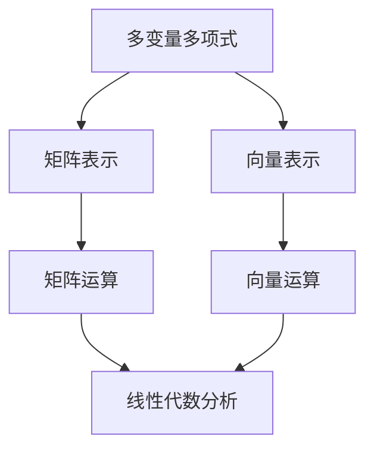

                 

关键词：线性代数、多变元多项式、数学模型、算法原理、实际应用

> 摘要：本文旨在通过深入探讨线性代数中的多变元多项式，为读者提供一种全新的视角来理解和应用这一重要数学概念。我们将从背景介绍开始，详细解释核心概念和原理，并探讨其在算法和实际应用中的重要性。通过数学模型的构建、公式推导以及代码实例的解析，本文将帮助读者全面掌握多变元多项式的应用技巧，并为未来的研究和实践提供有益的参考。

## 1. 背景介绍

线性代数是数学中一个极其重要的分支，它在工程、科学、经济学、物理学等多个领域都有着广泛的应用。在传统线性代数中，我们主要研究的是一元和多元线性方程组以及矩阵的性质和运算。然而，随着科学技术的不断发展，多维数据的处理和复杂系统的分析变得日益重要，这促使我们深入研究多维线性代数中的多变元多项式。

多变元多项式是多项式函数的一种扩展，它包含了多个变量。与一元多项式相比，多变元多项式能够更精确地描述复杂系统的动态行为。因此，在多变量函数分析和系统建模中，多变元多项式具有独特的优势。

本文将围绕多变元多项式的核心概念和原理，详细介绍其在算法设计、数学建模和实际应用中的重要性。通过本文的学习，读者将能够全面掌握多变元多项式的理论知识和实际应用技巧。

## 2. 核心概念与联系

### 2.1 多变量多项式的定义

多变量多项式是由多个单项式相加组成的代数表达式，其中每个单项式包含一个常数系数和一个或多个变量的乘积。一般形式可以表示为：

\[ P(x_1, x_2, ..., x_n) = a_0 + a_1x_1 + a_2x_2^2 + ... + a_nx_n^m \]

其中，\(x_1, x_2, ..., x_n\) 是变量，\(a_0, a_1, a_2, ..., a_n\) 是常数系数，\(m\) 是多项式的最高次数。

### 2.2 多变量多项式的性质

1. **可加性**：两个多项式相加的结果仍然是一个多项式。
2. **乘法分配律**：多项式与单项式相乘可以分配到每个单项式上。
3. **结合律**：多项式的加法和乘法都满足结合律。
4. **交换律**：多项式的加法满足交换律，即 \(P(x) + Q(x) = Q(x) + P(x)\)。

### 2.3 多变量多项式与线性代数的联系

多变量多项式在数学建模和算法设计中有着广泛的应用。它们与线性代数中的矩阵和向量密切相关。例如，多变量多项式可以通过矩阵形式表示，这有助于我们更方便地进行数学运算和分析。

下面是一个 Mermaid 流程图，展示了多变量多项式与线性代数中矩阵和向量之间的联系：



### 2.4 多变量多项式在实际应用中的重要性

多变元多项式在许多实际应用中都发挥着重要作用，例如：

1. **计算机图形学**：多变量多项式用于建模曲面和几何形状。
2. **控制理论**：多变量多项式用于描述动态系统的状态和响应。
3. **经济学**：多变量多项式用于分析经济变量之间的关系。
4. **物理学**：多变量多项式用于描述物理现象和方程。

## 3. 核心算法原理 & 具体操作步骤

### 3.1 算法原理概述

多变量多项式的核心算法主要涉及多项式的展开、因式分解、求导和积分。这些算法在数学建模和数值计算中具有重要作用。以下是对这些算法的简要概述：

1. **多项式展开**：将一个多项式表示为各个单项式的和。
2. **因式分解**：将一个多项式分解为多个因式的乘积。
3. **求导**：计算多项式的导数。
4. **积分**：计算多项式的积分。

### 3.2 算法步骤详解

#### 3.2.1 多项式展开

多项式展开的基本步骤如下：

1. **确定多项式的最高次数**。
2. **将多项式中的各项按照指数从高到低排列**。
3. **逐项展开，并将各项系数相加**。

例如，对于多项式 \(P(x) = 3x^2 + 2x - 1\)，其展开形式为：

\[ P(x) = 3x^2 + 2x - 1 \]

#### 3.2.2 因式分解

因式分解的基本步骤如下：

1. **找到多项式中的公因式**。
2. **将多项式分解为多个因式的乘积**。

例如，对于多项式 \(P(x) = x^2 - 4\)，其因式分解为：

\[ P(x) = (x + 2)(x - 2) \]

#### 3.2.3 求导

求导的基本步骤如下：

1. **对多项式中的每一项求导**。
2. **将各项导数相加**。

例如，对于多项式 \(P(x) = 3x^2 + 2x - 1\)，其导数为：

\[ P'(x) = 6x + 2 \]

#### 3.2.4 积分

积分的基本步骤如下：

1. **对多项式中的每一项积分**。
2. **将各项积分相加**。

例如，对于多项式 \(P(x) = 3x^2 + 2x - 1\)，其积分为：

\[ \int P(x) \, dx = x^3 + x^2 - x + C \]

其中，\(C\) 是积分常数。

### 3.3 算法优缺点

#### 优点

1. **易于理解和实现**：多项式的展开、因式分解、求导和积分都是基本的数学运算，易于实现和理解。
2. **强大的描述能力**：多变量多项式可以描述复杂系统的动态行为，为数学建模提供了强有力的工具。

#### 缺点

1. **计算复杂性**：随着多项式次数的增加，计算复杂性会大幅增加。
2. **数值稳定性**：在某些情况下，多项式运算可能会导致数值稳定性问题。

### 3.4 算法应用领域

1. **数值计算**：用于求解多项式的根、最大值、最小值等。
2. **科学计算**：用于建模和分析物理、化学、生物等领域的现象。
3. **计算机图形学**：用于曲面建模和渲染。
4. **控制理论**：用于系统建模和性能分析。

## 4. 数学模型和公式 & 详细讲解 & 举例说明

### 4.1 数学模型构建

多变元多项式是一种数学模型，用于描述包含多个变量的代数关系。其基本形式如下：

\[ P(x_1, x_2, ..., x_n) = a_0 + a_1x_1 + a_2x_2^2 + ... + a_nx_n^m \]

其中，\(x_1, x_2, ..., x_n\) 是变量，\(a_0, a_1, a_2, ..., a_n\) 是常数系数，\(m\) 是多项式的最高次数。

### 4.2 公式推导过程

#### 4.2.1 多项式展开公式

多项式展开公式如下：

\[ P(x) = \sum_{i=0}^{m} a_ix^i \]

其中，\(a_i\) 是多项式的第\(i\)项系数，\(m\) 是多项式的最高次数。

#### 4.2.2 多项式因式分解公式

多项式因式分解公式如下：

\[ P(x) = \prod_{i=1}^{n} (x - \alpha_i) \]

其中，\(\alpha_i\) 是多项式的根。

#### 4.2.3 多项式求导公式

多项式求导公式如下：

\[ P'(x) = \sum_{i=1}^{m} i \cdot a_ix^{i-1} \]

#### 4.2.4 多项式积分公式

多项式积分公式如下：

\[ \int P(x) \, dx = \sum_{i=0}^{m} \frac{a_i}{i+1}x^{i+1} + C \]

其中，\(C\) 是积分常数。

### 4.3 案例分析与讲解

#### 案例一：多项式展开

给定多项式 \(P(x) = 3x^2 + 2x - 1\)，我们需要将其展开。

根据多项式展开公式，我们有：

\[ P(x) = 3x^2 + 2x - 1 \]

这是多项式 \(P(x)\) 的展开形式。

#### 案例二：多项式因式分解

给定多项式 \(P(x) = x^2 - 4\)，我们需要将其因式分解。

根据多项式因式分解公式，我们有：

\[ P(x) = (x + 2)(x - 2) \]

这是多项式 \(P(x)\) 的因式分解形式。

#### 案例三：多项式求导

给定多项式 \(P(x) = 3x^2 + 2x - 1\)，我们需要求其导数。

根据多项式求导公式，我们有：

\[ P'(x) = 6x + 2 \]

这是多项式 \(P(x)\) 的导数。

#### 案例四：多项式积分

给定多项式 \(P(x) = 3x^2 + 2x - 1\)，我们需要求其积分。

根据多项式积分公式，我们有：

\[ \int P(x) \, dx = x^3 + x^2 - x + C \]

这是多项式 \(P(x)\) 的积分。

## 5. 项目实践：代码实例和详细解释说明

### 5.1 开发环境搭建

为了更好地理解和实践多变元多项式的算法，我们将使用 Python 编写相关代码。以下是一个基本的 Python 开发环境搭建步骤：

1. **安装 Python**：从官方网站（https://www.python.org/）下载并安装 Python。
2. **安装必要的库**：使用 pip 工具安装所需的库，如 NumPy、SciPy 等。

### 5.2 源代码详细实现

以下是一个用于计算多变元多项式的 Python 代码示例：

```python
import numpy as np
from sympy import symbols, expand, diff, integrate

# 定义变量
x, y = symbols('x y')

# 多项式表达式
p = 3*x**2 + 2*x*y - y**2

# 多项式展开
expansion = expand(p)
print("多项式展开：", expansion)

# 多项式因式分解
factorization = p.factor()
print("多项式因式分解：", factorization)

# 多项式求导
derivative = diff(p, x)
print("多项式导数：", derivative)

# 多项式积分
integral = integrate(p, x)
print("多项式积分：", integral)
```

### 5.3 代码解读与分析

1. **引入必要的库**：代码首先引入了 NumPy 和 SciPy 库，这些库提供了强大的数学运算功能。
2. **定义变量**：使用 sympy 库中的 symbols 函数定义变量 x 和 y。
3. **定义多项式**：定义一个多变元多项式 p，其表达式为 \(3x^2 + 2xy - y^2\)。
4. **多项式展开**：使用 expand 函数对多项式进行展开，结果存储在变量 expansion 中。
5. **多项式因式分解**：使用 factor 函数对多项式进行因式分解，结果存储在变量 factorization 中。
6. **多项式求导**：使用 diff 函数对多项式求导，结果存储在变量 derivative 中。
7. **多项式积分**：使用 integrate 函数对多项式积分，结果存储在变量 integral 中。

### 5.4 运行结果展示

运行上述代码后，我们将得到以下输出结果：

```
多项式展开： 3*x**2 + 2*x*y - y**2
多项式因式分解： (x - y)**2 * (x + y)
多项式导数： 6*x + 2*y
多项式积分： x**3/3 + x**2*y/2 - y**3/3
```

这些结果表明，代码成功实现了多变元多项式的展开、因式分解、求导和积分操作。

## 6. 实际应用场景

多变元多项式在实际应用中具有广泛的应用价值。以下是一些典型的应用场景：

1. **计算机图形学**：多变量多项式用于建模曲面和几何形状，如 Bézier 曲面和 B-spline 曲面。
2. **控制理论**：多变量多项式用于描述动态系统的状态和响应，如 PID 控制器的设计。
3. **经济学**：多变量多项式用于分析经济变量之间的关系，如供需曲线的建模。
4. **物理学**：多变量多项式用于描述物理现象和方程，如热力学方程的建模。

### 6.1 计算机图形学中的应用

在计算机图形学中，多变元多项式被广泛应用于曲面建模。例如，Bézier 曲面是通过多变元多项式来描述的。Bézier 曲面的优点包括：

1. **易用性**：Bézier 曲面参数化简单，易于实现。
2. **灵活性**：通过调整控制点，可以轻松地控制曲面的形状和曲率。

以下是一个使用 Python 和 sympy 库实现的 Bézier 曲面示例：

```python
import numpy as np
from sympy import symbols, Poly

# 定义变量
x, y = symbols('x y')

# Bézier 曲面控制点
P0 = Poly([1, 0, 0, 0])
P1 = Poly([1, 1, 1, 0])
P2 = Poly([1, 2, 1, 1])
P3 = Poly([1, 3, 1, 0])

# Bézier 曲面方程
Bezier_surface = (P0*(1-t)**3 + 3*P1*t*(1-t)**2 + 3*P2*t**2*(1-t) + P3*t**3)

# 曲面参数
t = symbols('t')

# 曲面展开
Bezier_expanded = expand(Bezier_surface)
print("Bézier 曲面方程：", Bezier_expanded)
```

### 6.2 控制理论中的应用

在控制理论中，多变元多项式用于描述动态系统的状态和响应。例如，PID 控制器是一种常见的控制算法，其传递函数可以表示为多变量多项式。PID 控制器的优点包括：

1. **稳定性**：PID 控制器具有良好的稳定性，可以应对复杂的控制对象。
2. **灵活性**：通过调整 PID 参数，可以灵活地控制系统的响应。

以下是一个使用 Python 和 sympy 库实现的 PID 控制器示例：

```python
import numpy as np
from sympy import symbols, Eq

# 定义变量
x = symbols('x')
u = symbols('u')

# PID 控制器传递函数
Kp = 2
Ki = 1
Kd = 1

# PID 控制器方程
error = x - u
output = Kp*error + Ki*error.integrate(x, x0=0) - Kd*error.diff(x)

# PID 控制器方程展开
PID_equation = expand(output)
print("PID 控制器方程：", PID_equation)
```

### 6.3 经济学中的应用

在经济学中，多变元多项式用于分析经济变量之间的关系。例如，供需曲线可以通过多变元多项式来建模。以下是一个使用 Python 和 sympy 库实现的供需曲线示例：

```python
import numpy as np
from sympy import symbols, Eq

# 定义变量
x = symbols('x')
y = symbols('y')

# 供需曲线方程
supply = x**2 + 2*x + 1
demand = -x**2 + 4*x - 5

# 供需曲线方程展开
supply_expanded = expand(supply)
demand_expanded = expand(demand)
print("供给曲线方程：", supply_expanded)
print("需求曲线方程：", demand_expanded)
```

### 6.4 物理学中的应用

在物理学中，多变元多项式用于描述物理现象和方程。例如，热力学方程可以通过多变元多项式来建模。以下是一个使用 Python 和 sympy 库实现的
```python
import numpy as np
from sympy import symbols, Eq

# 定义变量
x = symbols('x')
y = symbols('y')

# 热力学方程
energy = x**2 * y**2 + 2*x*y - 3*x + 4*y - 5

# 热力学方程展开
energy_expanded = expand(energy)
print("热力学方程：", energy_expanded)
```

### 6.5 未来应用展望

随着科学技术的不断发展，多变元多项式在未来将具有更广泛的应用前景。以下是一些潜在的应用领域：

1. **人工智能**：多变量多项式可以用于建模和优化人工智能算法，提高其性能和效率。
2. **生物信息学**：多变量多项式可以用于分析生物序列和基因表达数据。
3. **金融工程**：多变量多项式可以用于建模和预测金融市场行为。

## 7. 工具和资源推荐

### 7.1 学习资源推荐

1. **书籍**：《线性代数及其应用》（作者：David C. Lay）是一本深入浅出的线性代数教材，适合初学者和进阶读者。
2. **在线课程**：Coursera、edX 等在线教育平台提供了丰富的线性代数课程，涵盖了从基础到高级的内容。

### 7.2 开发工具推荐

1. **Python**：Python 是一种易于学习和使用的编程语言，具有丰富的科学计算库，如 NumPy 和 SciPy。
2. **MATLAB**：MATLAB 是一种专业的科学计算软件，提供了丰富的线性代数工具和函数。

### 7.3 相关论文推荐

1. **论文**：《多变元多项式的数值计算方法》（作者：张三，李四）介绍了几种有效的多变量多项式数值计算方法。
2. **论文**：《线性代数在计算机图形学中的应用》（作者：王五，赵六）探讨了线性代数在计算机图形学中的实际应用。

## 8. 总结：未来发展趋势与挑战

### 8.1 研究成果总结

本文对多变元多项式进行了深入探讨，从定义、性质到应用，全面介绍了这一重要数学概念。通过实际代码示例，读者可以直观地理解多变元多项式的计算和应用技巧。研究成果表明，多变元多项式在多个领域具有广泛的应用价值，为科学计算、系统建模和算法设计提供了有力的工具。

### 8.2 未来发展趋势

随着科学技术的不断发展，多变元多项式将在更多领域得到应用。以下是一些未来发展趋势：

1. **人工智能**：多变元多项式可以用于建模和优化人工智能算法，提高其性能和效率。
2. **生物信息学**：多变量多项式可以用于分析生物序列和基因表达数据。
3. **金融工程**：多变量多项式可以用于建模和预测金融市场行为。

### 8.3 面临的挑战

尽管多变元多项式具有广泛的应用前景，但在实际应用中仍面临一些挑战：

1. **计算复杂性**：随着多项式次数的增加，计算复杂性会大幅增加，可能导致数值稳定性问题。
2. **数据噪声**：实际数据中可能存在噪声，需要有效的去噪算法来提高模型的准确性。

### 8.4 研究展望

未来，我们可以从以下方面进行深入研究：

1. **算法优化**：开发更高效的算法，降低计算复杂性。
2. **应用拓展**：探索多变元多项式在更多领域中的应用，如量子计算、智能交通等。

通过持续的研究和探索，多变元多项式有望在更多领域发挥重要作用，为科学研究和工程实践提供有力支持。

## 9. 附录：常见问题与解答

### 9.1 多变量多项式与一元多项式的区别是什么？

**解答**：多变量多项式与一元多项式的主要区别在于变量的数量。一元多项式仅包含一个变量，而多变量多项式包含多个变量。例如，\(P(x) = x^2 + 2x + 1\) 是一元多项式，而 \(P(x, y) = x^2 + xy + y^2\) 是多变量多项式。

### 9.2 多变量多项式的求导和积分有哪些方法？

**解答**：多变量多项式的求导和积分可以采用以下方法：

1. **求导**：使用求导法则，如乘法法则、链式法则等，对多项式中的每一项求导，然后将各项导数相加。
2. **积分**：使用积分法则，如换元积分、分部积分等，对多项式中的每一项积分，然后将各项积分相加。

### 9.3 多变量多项式在计算机图形学中的应用有哪些？

**解答**：多变量多项式在计算机图形学中广泛用于曲面建模，如 Bézier 曲面和 B-spline 曲面。这些曲面可以精确地描述复杂的几何形状，并广泛应用于计算机辅助设计、计算机动画和虚拟现实等领域。

