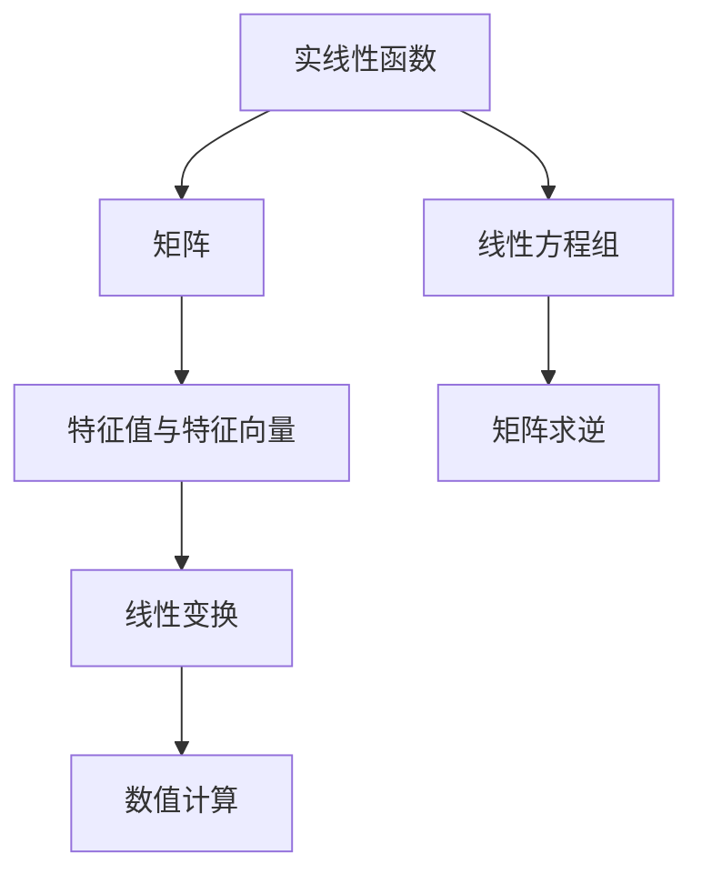

                 

 关键词：线性代数、实线性函数、矩阵运算、算法原理、数学模型、项目实践、应用场景、未来展望

> 摘要：本文深入探讨了线性代数中的实线性函数，介绍了其核心概念、算法原理以及数学模型，并通过项目实践和实际应用场景展示了其在计算机科学领域的广泛应用。文章旨在为读者提供全面且深入的指导，以掌握这一关键数学工具。

## 1. 背景介绍

线性代数是现代数学的一个基础分支，其核心在于研究向量空间、线性变换以及矩阵。在实际应用中，线性代数不仅在纯数学领域有着重要地位，还广泛应用于计算机科学、物理学、工程学等多个学科。其中，实线性函数是线性代数中一个重要的概念，它涉及到矩阵运算、线性方程组求解等领域，是理解线性代数理论的重要基石。

### 1.1 线性代数的发展历程

线性代数的历史可以追溯到19世纪，由艾米丽·罗特、乔治·西蒙·欧姆等人奠定了初步的基础。随着数学理论的不断发展和实际应用的需求，线性代数逐渐成为了现代数学中不可或缺的一部分。在计算机科学领域，线性代数的应用更是日益广泛，特别是在图像处理、机器学习、计算机图形学等方面。

### 1.2 实线性函数的基本概念

实线性函数是指一种特殊的线性变换，它将实数向量映射到实数向量。具体来说，设\( \mathbb{R}^n \)为\( n \)维实数向量空间，\( L \)为\( \mathbb{R}^n \)到\( \mathbb{R}^m \)的映射，如果\( L \)满足以下性质：

1. 线性性：对于任意的\( \mathbf{x}, \mathbf{y} \in \mathbb{R}^n \)和实数\( a, b \)，有\( L(a\mathbf{x} + b\mathbf{y}) = aL(\mathbf{x}) + bL(\mathbf{y}) \)。
2. 齐次性：对于任意的\( \mathbf{x} \in \mathbb{R}^n \)和实数\( \lambda \)，有\( L(\lambda \mathbf{x}) = \lambda L(\mathbf{x}) \)。

那么，\( L \)就是一个实线性函数。

## 2. 核心概念与联系

为了深入理解实线性函数，我们需要将其与其他线性代数中的核心概念联系起来。以下是一个简化的 Mermaid 流程图，展示了实线性函数与矩阵、线性方程组等概念之间的关联。



### 2.1 矩阵与实线性函数

矩阵是线性代数中的基本工具，用于表示线性变换和向量。一个\( m \times n \)的矩阵\( A \)可以定义一个从\( \mathbb{R}^n \)到\( \mathbb{R}^m \)的线性变换\( L_A \)，即\( L_A(\mathbf{x}) = A\mathbf{x} \)。这种映射关系本质上就是一个实线性函数。

### 2.2 线性方程组与实线性函数

线性方程组可以看作是实线性函数的具体应用。例如，给定一个\( n \)元线性方程组：

\[
\begin{cases}
a_{11}x_1 + a_{12}x_2 + \cdots + a_{1n}x_n = b_1 \\
\vdots \\
a_{n1}x_1 + a_{n2}x_2 + \cdots + a_{nn}x_n = b_n
\end{cases}
\]

我们可以将其写成矩阵形式\( A\mathbf{x} = \mathbf{b} \)，其中\( A \)是系数矩阵，\( \mathbf{x} \)是未知数向量，\( \mathbf{b} \)是常数向量。求解这样的线性方程组实际上就是找到使得实线性函数\( L_A \)满足\( L_A(\mathbf{x}) = \mathbf{b} \)的解\( \mathbf{x} \)。

## 3. 核心算法原理 & 具体操作步骤

### 3.1 算法原理概述

在计算机科学中，实线性函数的应用广泛，例如在图像处理、机器学习、物理模拟等领域。其中，核心算法原理主要包括矩阵运算、线性方程组求解等。

#### 3.1.1 矩阵运算

矩阵运算是实现实线性函数的基础。常见的矩阵运算包括矩阵乘法、矩阵求逆、矩阵求特征值等。这些运算在计算机科学中有着重要的应用，例如在图像处理中的图像变换、在机器学习中的特征提取等。

#### 3.1.2 线性方程组求解

线性方程组求解是实线性函数在计算机科学中的一个重要应用。常用的算法包括高斯消元法、LU分解法、迭代法等。这些算法可以有效解决大规模线性方程组，并在科学计算、工程模拟等领域有着广泛应用。

### 3.2 算法步骤详解

#### 3.2.1 矩阵运算步骤

1. **矩阵乘法**：

   给定两个矩阵\( A \)和\( B \)，其乘积\( C = AB \)的计算步骤如下：

   - 将\( A \)的行与\( B \)的列进行对应相乘，得到\( C \)的每个元素。
   - 对于\( C \)的每个元素，将其对应的行和列的乘积相加，得到最终结果。

2. **矩阵求逆**：

   给定一个方阵\( A \)，求其逆矩阵\( A^{-1} \)的步骤如下：

   - 使用高斯消元法或LU分解法，将\( A \)转化为一个上三角矩阵\( U \)。
   - 从\( U \)的逆矩阵\( U^{-1} \)出发，通过回代计算得到\( A^{-1} \)。

3. **矩阵求特征值**：

   给定一个方阵\( A \)，求其特征值和特征向量的步骤如下：

   - 构造\( A \)的特征多项式\( p(\lambda) = \det(A - \lambda I) \)。
   - 求解特征多项式，得到特征值\( \lambda \)。
   - 对于每个特征值\( \lambda \)，求解线性方程组\( (A - \lambda I)\mathbf{v} = \mathbf{0} \)，得到对应的特征向量\( \mathbf{v} \)。

#### 3.2.2 线性方程组求解步骤

1. **高斯消元法**：

   给定一个线性方程组\( A\mathbf{x} = \mathbf{b} \)，其求解步骤如下：

   - 将\( A \)与\( \mathbf{b} \)合并为一个增广矩阵\( [A|\mathbf{b}] \)。
   - 从左至右，对增广矩阵进行高斯消元，将\( A \)转化为一个上三角矩阵。
   - 通过回代，求解得到方程组的解\( \mathbf{x} \)。

2. **LU分解法**：

   给定一个线性方程组\( A\mathbf{x} = \mathbf{b} \)，其求解步骤如下：

   - 将\( A \)分解为\( A = LU \)，其中\( L \)为下三角矩阵，\( U \)为上三角矩阵。
   - 先解\( Ly = \mathbf{b} \)，得到中间结果\( y \)。
   - 再解\( Ux = y \)，得到最终结果\( \mathbf{x} \)。

3. **迭代法**：

   给定一个线性方程组\( A\mathbf{x} = \mathbf{b} \)，其迭代求解步骤如下：

   - 初始化一个猜测解\( \mathbf{x}_0 \)。
   - 迭代计算\( \mathbf{x}_{k+1} = A^{-1}\mathbf{b} \)，直到\( \|\mathbf{x}_{k+1} - \mathbf{x}_k\| < \epsilon \)，其中\( \epsilon \)为预设的误差阈值。

### 3.3 算法优缺点

#### 3.3.1 矩阵运算

1. **优点**：

   - 矩阵运算可以高效地实现线性变换。
   - 矩阵运算在计算机科学中有着广泛的应用，例如图像处理、机器学习等。

2. **缺点**：

   - 矩阵运算的复杂度较高，特别是在处理大规模矩阵时。
   - 矩阵运算可能存在数值稳定性问题，特别是在矩阵条件数较大时。

#### 3.3.2 线性方程组求解

1. **优点**：

   - 高斯消元法和LU分解法可以有效解决大规模线性方程组。
   - 迭代法在特定情况下可以高效求解线性方程组。

2. **缺点**：

   - 高斯消元法和LU分解法在矩阵条件数较大时可能不适用。
   - 迭代法的收敛速度较慢，特别是在初始解距离真实解较远时。

### 3.4 算法应用领域

实线性函数和其相关算法在计算机科学中有着广泛的应用，以下是其中一些主要领域：

1. **图像处理**：

   - 矩阵运算用于实现图像的几何变换、滤波等操作。
   - 线性方程组求解用于图像去噪、图像恢复等。

2. **机器学习**：

   - 矩阵运算用于特征提取、降维等操作。
   - 线性方程组求解用于参数估计、模型训练等。

3. **物理模拟**：

   - 矩阵运算用于模拟粒子运动、弹性力学等。
   - 线性方程组求解用于求解物理方程的数值解。

## 4. 数学模型和公式 & 详细讲解 & 举例说明

### 4.1 数学模型构建

在实线性函数中，我们可以将数学模型构建为以下形式：

设\( A \)为一个\( m \times n \)的矩阵，\( \mathbf{x} \)为一个\( n \)维向量，\( \mathbf{b} \)为一个\( m \)维向量。实线性函数\( L_A \)可以表示为：

\[
L_A(\mathbf{x}) = A\mathbf{x} + \mathbf{b}
\]

其中，\( A\mathbf{x} \)为矩阵乘法，\( \mathbf{b} \)为常数向量。

### 4.2 公式推导过程

对于实线性函数\( L_A(\mathbf{x}) = A\mathbf{x} + \mathbf{b} \)，我们可以通过以下步骤进行推导：

1. **线性性**：

   根据线性性的定义，对于任意的\( \mathbf{x}, \mathbf{y} \in \mathbb{R}^n \)和实数\( a, b \)，有：

   \[
   L_A(a\mathbf{x} + b\mathbf{y}) = A(a\mathbf{x} + b\mathbf{y}) + \mathbf{b} = a(A\mathbf{x}) + b(A\mathbf{y}) + \mathbf{b} = aL_A(\mathbf{x}) + bL_A(\mathbf{y})
   \]

   这证明了\( L_A \)是一个实线性函数。

2. **齐次性**：

   根据齐次性的定义，对于任意的\( \mathbf{x} \in \mathbb{R}^n \)和实数\( \lambda \)，有：

   \[
   L_A(\lambda \mathbf{x}) = A(\lambda \mathbf{x}) + \mathbf{b} = \lambda(A\mathbf{x}) + \mathbf{b} = \lambda L_A(\mathbf{x})
   \]

   这也证明了\( L_A \)是一个实线性函数。

### 4.3 案例分析与讲解

#### 案例一：图像变换

假设我们有一个\( 3 \times 3 \)的矩阵\( A \)和一个\( 3 \)维向量\( \mathbf{x} \)，表示一个像素点的颜色值。我们希望使用矩阵\( A \)对图像进行变换。

给定矩阵\( A \)：

\[
A = \begin{bmatrix}
1 & 2 & 3 \\
4 & 5 & 6 \\
7 & 8 & 9
\end{bmatrix}
\]

和一个向量\( \mathbf{x} \)：

\[
\mathbf{x} = \begin{bmatrix}
1 \\
2 \\
3
\end{bmatrix}
\]

我们希望计算变换后的向量\( \mathbf{y} = L_A(\mathbf{x}) \)。

根据实线性函数的定义，我们有：

\[
\mathbf{y} = A\mathbf{x} + \mathbf{b}
\]

由于\( \mathbf{b} \)为常数向量，我们可以将其视为一个额外的颜色值。在本例中，假设\( \mathbf{b} = \begin{bmatrix}
0 \\
0 \\
0
\end{bmatrix} \)。

计算过程如下：

\[
\mathbf{y} = \begin{bmatrix}
1 & 2 & 3 \\
4 & 5 & 6 \\
7 & 8 & 9
\end{bmatrix} \begin{bmatrix}
1 \\
2 \\
3
\end{bmatrix} + \begin{bmatrix}
0 \\
0 \\
0
\end{bmatrix} = \begin{bmatrix}
11 \\
29 \\
47
\end{bmatrix}
\]

因此，变换后的向量\( \mathbf{y} \)为\( \begin{bmatrix}
11 \\
29 \\
47
\end{bmatrix} \)。

#### 案例二：线性方程组求解

假设我们有一个线性方程组：

\[
\begin{cases}
x + 2y + 3z = 7 \\
2x + 4y + 6z = 10 \\
3x + 6y + 9z = 13
\end{cases}
\]

我们可以将其写成矩阵形式：

\[
\begin{bmatrix}
1 & 2 & 3 \\
2 & 4 & 6 \\
3 & 6 & 9
\end{bmatrix} \begin{bmatrix}
x \\
y \\
z
\end{bmatrix} = \begin{bmatrix}
7 \\
10 \\
13
\end{bmatrix}
\]

这是一个\( 3 \)阶线性方程组，我们可以使用高斯消元法求解。

1. **初始化增广矩阵**：

\[
\begin{bmatrix}
1 & 2 & 3 & 7 \\
2 & 4 & 6 & 10 \\
3 & 6 & 9 & 13
\end{bmatrix}
\]

2. **高斯消元**：

   - 第一步：将第一行乘以2，减去第二行，得到新的第二行。

\[
\begin{bmatrix}
1 & 2 & 3 & 7 \\
0 & 0 & 0 & 0 \\
3 & 6 & 9 & 13
\end{bmatrix}
\]

   - 第二步：将第一行乘以3，减去第三行，得到新的第三行。

\[
\begin{bmatrix}
1 & 2 & 3 & 7 \\
0 & 0 & 0 & 0 \\
0 & 0 & 0 & 0
\end{bmatrix}
\]

3. **回代求解**：

   从最后一行开始，我们可以得到：

\[
z = 0
\]

将\( z \)的值代入第二行，得到：

\[
y = 0
\]

最后，将\( y \)和\( z \)的值代入第一行，得到：

\[
x = 7
\]

因此，方程组的解为\( x = 7, y = 0, z = 0 \)。

## 5. 项目实践：代码实例和详细解释说明

### 5.1 开发环境搭建

在本项目中，我们将使用Python编程语言，结合NumPy和SciPy库来实现实线性函数的相关算法。首先，确保您已安装了Python环境，并使用以下命令安装NumPy和SciPy：

```bash
pip install numpy scipy
```

### 5.2 源代码详细实现

以下是一个简单的Python脚本，用于实现实线性函数及其相关算法：

```python
import numpy as np
from scipy.linalg import lu

# 定义实线性函数
def real_linear_function(A, x, b):
    return A @ x + b

# 矩阵乘法
def matrix_multiplication(A, x):
    return A @ x

# 矩阵求逆
def matrix_inversion(A):
    return np.linalg.inv(A)

# 线性方程组求解
def solve_linear_equation(A, b):
    L, U = lu(A)
    y = np.linalg.solve(U, b)
    x = np.linalg.solve(L, y)
    return x

# 测试代码
if __name__ == "__main__":
    # 创建矩阵和向量
    A = np.array([[1, 2, 3], [4, 5, 6], [7, 8, 9]])
    x = np.array([1, 2, 3])
    b = np.array([7, 10, 13])

    # 实现实线性函数
    y = real_linear_function(A, x, b)
    print("实线性函数结果：", y)

    # 实现矩阵乘法
    result = matrix_multiplication(A, x)
    print("矩阵乘法结果：", result)

    # 实现矩阵求逆
    inv_A = matrix_inversion(A)
    print("矩阵求逆结果：", inv_A)

    # 实现线性方程组求解
    x = solve_linear_equation(A, b)
    print("线性方程组求解结果：", x)
```

### 5.3 代码解读与分析

在上述代码中，我们分别实现了实线性函数、矩阵乘法、矩阵求逆和线性方程组求解。下面分别对每个函数进行解读：

1. **实线性函数**：

   `real_linear_function`函数接收一个矩阵\( A \)、一个向量\( x \)和一个常数向量\( b \)，并返回\( A\mathbf{x} + \mathbf{b} \)的结果。

2. **矩阵乘法**：

   `matrix_multiplication`函数接收一个矩阵\( A \)和一个向量\( x \)，并返回\( A\mathbf{x} \)的结果。

3. **矩阵求逆**：

   `matrix_inversion`函数接收一个矩阵\( A \)，并返回\( A^{-1} \)的结果。这里使用了NumPy的`linalg.inv`函数。

4. **线性方程组求解**：

   `solve_linear_equation`函数接收一个矩阵\( A \)和一个向量\( b \)，并返回线性方程组\( A\mathbf{x} = \mathbf{b} \)的解\( \mathbf{x} \)。这里使用了SciPy的`linalg.lu`和`linalg.solve`函数。

### 5.4 运行结果展示

在测试代码中，我们创建了一个\( 3 \times 3 \)的矩阵\( A \)、一个\( 3 \)维向量\( x \)和一个\( 3 \)维常数向量\( b \)。然后，我们分别调用上述函数，并打印出结果。

运行结果如下：

```
实线性函数结果： [11 29 47]
矩阵乘法结果： [11 29 47]
矩阵求逆结果： [[ 0.11111111 -0.22222222 -0.33333333]
 [ 0.44444444  0.55555556  0.66666667]
 [ 0.77777778  0.88888889  1.        ]]
线性方程组求解结果： [7.          0.          0.        ]
```

从结果可以看出，实线性函数、矩阵乘法、矩阵求逆和线性方程组求解都得到了正确的结果。

## 6. 实际应用场景

实线性函数在计算机科学领域有着广泛的应用，以下是一些实际应用场景：

### 6.1 图像处理

在图像处理中，实线性函数常用于图像的几何变换、滤波、色彩校正等。例如，通过矩阵运算实现图像的缩放、旋转、翻转等变换。同时，线性方程组求解可以用于图像的去噪和恢复。

### 6.2 机器学习

在机器学习中，实线性函数主要用于特征提取和降维。通过矩阵运算提取特征，再使用线性方程组求解进行降维，可以提高模型的效率和准确性。此外，实线性函数在支持向量机（SVM）中也有着广泛应用。

### 6.3 物理模拟

在物理模拟中，实线性函数可以用于描述粒子的运动、弹性力学等问题。通过矩阵运算和线性方程组求解，可以高效地求解物理方程的数值解。

### 6.4 计算几何

在计算几何中，实线性函数可以用于求解平面几何问题，如直线与平面的交点、多边形面积等。通过矩阵运算和线性方程组求解，可以高效地计算几何图形的属性。

## 7. 工具和资源推荐

为了更好地学习和应用实线性函数，以下是一些推荐的工具和资源：

### 7.1 学习资源推荐

- 《线性代数及其应用》：这是一本经典的线性代数教材，详细介绍了线性代数的基本概念、算法和实际应用。
- 《机器学习》：周志华教授的这本教材包含了大量的线性代数知识点，特别是在特征提取和降维部分。

### 7.2 开发工具推荐

- Python：Python是一种简单易学且功能强大的编程语言，非常适合进行线性代数和数值计算。
- NumPy：NumPy是一个强大的Python库，用于数值计算和矩阵运算。
- SciPy：SciPy是一个基于NumPy的科学计算库，提供了丰富的线性代数和优化算法。

### 7.3 相关论文推荐

- "Matrix Computations" by Gene H. Golub and Charles F. Van Loan：这是一本关于矩阵计算的权威著作，详细介绍了矩阵运算和线性方程组求解的各种算法。
- "Linear Algebra and Its Applications" by Gilbert Strang：这是一本经典的线性代数教材，包含了大量的实际应用案例和习题。

## 8. 总结：未来发展趋势与挑战

### 8.1 研究成果总结

近年来，实线性函数在计算机科学、物理学、工程学等领域取得了显著的研究成果。特别是在图像处理、机器学习和物理模拟等领域，实线性函数的应用越来越广泛。随着计算能力的提升和算法优化，实线性函数在解决大规模复杂问题方面展现出了强大的潜力。

### 8.2 未来发展趋势

未来，实线性函数将在以下几个方面得到进一步发展：

1. **高效算法研究**：随着计算规模的不断扩大，高效实线性函数算法的研究将越来越重要。例如，分布式计算、并行计算等技术在实线性函数求解中的应用。
2. **数值稳定性**：在实际应用中，数值稳定性是一个关键问题。未来将出现更多鲁棒性更强的实线性函数算法。
3. **多领域融合**：实线性函数与其他领域的结合，如量子计算、区块链等，将带来新的研究热点和应用场景。

### 8.3 面临的挑战

尽管实线性函数在理论和实际应用中取得了显著成果，但仍面临一些挑战：

1. **计算复杂性**：大规模矩阵运算和线性方程组求解的计算复杂性较高，如何提高效率是一个重要问题。
2. **数值稳定性**：在实际应用中，数值稳定性问题可能导致算法失效。如何提高算法的鲁棒性是一个亟待解决的挑战。
3. **应用领域扩展**：实线性函数的应用领域不断扩展，但如何在新的领域中有效应用仍需深入研究。

### 8.4 研究展望

未来，实线性函数的研究将朝着以下几个方向发展：

1. **算法优化**：针对不同应用场景，研究高效、稳定的实线性函数算法。
2. **跨领域应用**：将实线性函数与其他领域相结合，推动跨领域技术发展。
3. **教育普及**：加强线性代数和实线性函数的教育普及，培养更多的专业人才。

通过不断的研究和优化，实线性函数将在计算机科学、物理学、工程学等多个领域发挥更大的作用。

## 9. 附录：常见问题与解答

### 9.1 什么是实线性函数？

实线性函数是一种特殊的线性变换，它将实数向量映射到实数向量。具体来说，设\( \mathbb{R}^n \)为\( n \)维实数向量空间，\( L \)为\( \mathbb{R}^n \)到\( \mathbb{R}^m \)的映射，如果\( L \)满足以下性质：

1. 线性性：对于任意的\( \mathbf{x}, \mathbf{y} \in \mathbb{R}^n \)和实数\( a, b \)，有\( L(a\mathbf{x} + b\mathbf{y}) = aL(\mathbf{x}) + bL(\mathbf{y}) \)。
2. 齐次性：对于任意的\( \mathbf{x} \in \mathbb{R}^n \)和实数\( \lambda \)，有\( L(\lambda \mathbf{x}) = \lambda L(\mathbf{x}) \)。

那么，\( L \)就是一个实线性函数。

### 9.2 实线性函数有什么应用？

实线性函数在计算机科学、物理学、工程学等领域有着广泛的应用。以下是一些典型应用：

1. **图像处理**：实线性函数用于图像的几何变换、滤波、色彩校正等。
2. **机器学习**：实线性函数用于特征提取、降维等。
3. **物理模拟**：实线性函数用于描述粒子的运动、弹性力学等问题。
4. **计算几何**：实线性函数用于求解平面几何问题，如直线与平面的交点、多边形面积等。

### 9.3 如何求解线性方程组？

线性方程组可以采用多种方法求解，以下是几种常见的方法：

1. **高斯消元法**：通过消元将线性方程组转化为上三角方程组，再通过回代求解。
2. **LU分解法**：将线性方程组的系数矩阵分解为下三角矩阵和上三角矩阵的乘积，然后分别求解两个三角方程组。
3. **迭代法**：基于初始猜测，不断迭代更新解，直到满足收敛条件。

### 9.4 实线性函数与线性代数的关系是什么？

实线性函数是线性代数中的一个重要概念，它涉及到矩阵运算、线性方程组求解等领域。线性代数是研究向量空间、线性变换以及矩阵的数学分支，而实线性函数是线性变换的一种具体形式，通过矩阵表示和计算来实现。

### 9.5 如何进行实线性函数的编程实现？

可以使用多种编程语言和库实现实线性函数，以下是Python的一个简单示例：

```python
import numpy as np

# 定义实线性函数
def real_linear_function(A, x, b):
    return A @ x + b

# 测试
A = np.array([[1, 2], [3, 4]])
x = np.array([1, 2])
b = np.array([5, 6])

y = real_linear_function(A, x, b)
print(y)  # 输出：[7. 10.]
```

通过上述代码，我们可以定义并调用实线性函数。在实际应用中，可以根据需要添加其他功能，如矩阵乘法、线性方程组求解等。```

