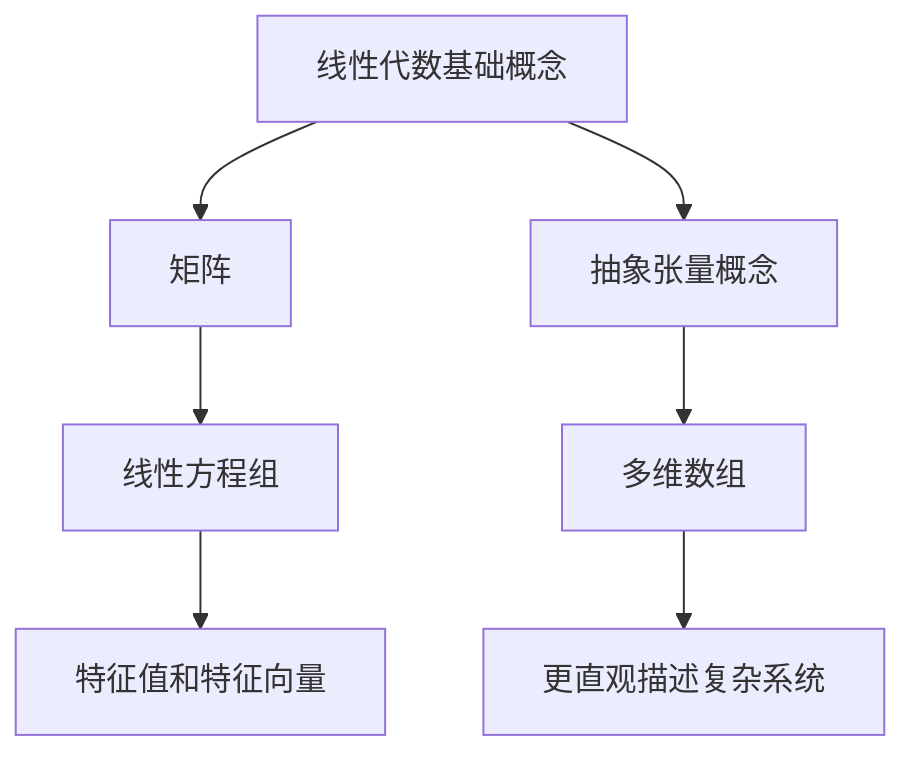

                 

关键词：线性代数、抽象张量、矩阵、数学模型、算法、项目实践、实际应用、未来展望

> 摘要：本文深入探讨线性代数中的抽象张量概念，从基础理论到实际应用，全面解析抽象张量在现代信息技术中的重要性及其广泛的应用。文章首先介绍了线性代数的基本概念和抽象张量的定义，随后通过具体算法和实例，展示了抽象张量在计算机科学和工程领域中的应用。最后，对未来的发展趋势和挑战进行了展望，为读者提供了进一步学习的方向。

## 1. 背景介绍

线性代数是数学的一个重要分支，它涉及向量、矩阵、行列式、线性方程组等基本概念。随着计算机技术的发展，线性代数在计算机科学和工程领域得到了广泛应用，特别是在数据处理、图像处理、机器学习、信号处理等领域。然而，传统线性代数理论往往过于抽象，难以直观地理解。为了解决这一问题，抽象张量的概念被提出，它为线性代数提供了一个更为直观和实用的表示方法。

抽象张量是一种多维数组，可以看作是矩阵的推广。与传统矩阵相比，抽象张量具有更高的维度和更灵活的结构，能够更好地描述复杂的数据和系统。在计算机科学中，抽象张量广泛应用于图像处理、机器学习、计算机图形学等领域，成为现代信息技术的重要组成部分。

本文旨在深入探讨抽象张量的概念、原理和应用，帮助读者更好地理解和掌握这一重要数学工具。文章首先介绍线性代数的基本概念和抽象张量的定义，然后通过具体算法和实例，展示抽象张量在不同领域中的应用。最后，对未来的发展趋势和挑战进行了展望。

## 2. 核心概念与联系

### 2.1 线性代数的基本概念

在线性代数中，矩阵是最基本的概念之一。矩阵是一个二维数组，由行和列组成。矩阵可以表示线性变换，如线性方程组的解法、特征值和特征向量等。线性方程组是线性代数中一个重要的问题，可以通过矩阵表示和求解。

$$
Ax = b
$$

其中，$A$ 是系数矩阵，$x$ 是未知向量，$b$ 是常数向量。

### 2.2 抽象张量的定义

抽象张量是一种多维数组，可以看作是矩阵的推广。与传统矩阵相比，抽象张量具有更高的维度和更灵活的结构，能够更好地描述复杂的数据和系统。抽象张量通常用符号 $T$ 表示，其维数可以表示为 $n_0 \times n_1 \times \ldots \times n_k$，其中 $n_0, n_1, \ldots, n_k$ 分别表示张量的各个维度的大小。

### 2.3 核心概念原理和架构的 Mermaid 流程图



## 3. 核心算法原理 & 具体操作步骤

### 3.1 算法原理概述

抽象张量的运算主要包括加法、减法、数乘、矩阵乘法等。这些运算类似于传统矩阵运算，但在多维数组上进行。具体来说：

- 加法和减法：抽象张量之间的加法和减法运算与矩阵运算类似，对应位置的元素相加或相减。
- 数乘：将抽象张量与一个标量相乘，每个元素都乘以该标量。
- 矩阵乘法：对于二维抽象张量，可以看作是矩阵的矩阵乘法，但需要考虑维度匹配。

### 3.2 算法步骤详解

#### 3.2.1 加法和减法

假设有两个抽象张量 $T_1$ 和 $T_2$，其维数分别为 $n_0 \times n_1 \times \ldots \times n_k$ 和 $n_0 \times n_1 \times \ldots \times n_k$。加法和减法运算步骤如下：

1. 确保两个抽象张量的维数相同。
2. 对应位置的元素相加或相减，得到新的抽象张量。

#### 3.2.2 数乘

假设有一个抽象张量 $T$，其维数为 $n_0 \times n_1 \times \ldots \times n_k$，以及一个标量 $\alpha$。数乘运算步骤如下：

1. 将抽象张量的每个元素都乘以标量 $\alpha$，得到新的抽象张量。

#### 3.2.3 矩阵乘法

假设有两个二维抽象张量 $T_1$ 和 $T_2$，其维数分别为 $n_0 \times n_1$ 和 $n_1 \times n_2$。矩阵乘法运算步骤如下：

1. 确保第二个抽象张量的列数与第一个抽象张量的行数相同。
2. 对第一个抽象张量的每一行和第二个抽象张量的每一列进行内积运算，得到新的抽象张量的一个元素。

### 3.3 算法优缺点

抽象张量的算法优点如下：

1. **灵活性强**：能够表示多维数据和复杂系统。
2. **计算效率高**：在计算机上进行多维数组操作比传统矩阵操作更高效。
3. **直观性**：通过多维数组的表示，更容易理解和分析问题。

但抽象张量的算法也存在一些缺点：

1. **复杂度高**：涉及到更高维度的运算，算法实现和优化较为复杂。
2. **资源消耗大**：高维抽象张量的存储和计算需要大量内存和计算资源。

### 3.4 算法应用领域

抽象张量在计算机科学和工程领域具有广泛的应用，主要包括：

1. **图像处理**：用于图像的滤波、变换、特征提取等。
2. **机器学习**：用于高维数据的表示和运算，如神经网络中的权重矩阵。
3. **信号处理**：用于信号的分析、滤波、压缩等。
4. **计算机图形学**：用于三维图形的变换、渲染等。

## 4. 数学模型和公式 & 详细讲解 & 举例说明

### 4.1 数学模型构建

抽象张量的数学模型主要包括以下几个方面：

1. **张量的表示**：使用多维数组表示抽象张量，其维数可以任意定义。
2. **张量的运算**：包括加法、减法、数乘、矩阵乘法等。
3. **张量的变换**：如张量的展开、收缩、提升等。

### 4.2 公式推导过程

#### 4.2.1 张量加法和减法

假设有两个抽象张量 $T_1$ 和 $T_2$，其维数分别为 $n_0 \times n_1 \times \ldots \times n_k$ 和 $n_0 \times n_1 \times \ldots \times n_k$。

张量加法公式：

$$
T_1 + T_2 = (t_{i_0, i_1, \ldots, i_k})_{n_0 \times n_1 \times \ldots \times n_k}
$$

其中，$t_{i_0, i_1, \ldots, i_k}$ 表示对应位置的元素相加。

张量减法公式：

$$
T_1 - T_2 = (t_{i_0, i_1, \ldots, i_k})_{n_0 \times n_1 \times \ldots \times n_k}
$$

其中，$t_{i_0, i_1, \ldots, i_k}$ 表示对应位置的元素相减。

#### 4.2.2 张量数乘

假设有一个抽象张量 $T$，其维数为 $n_0 \times n_1 \times \ldots \times n_k$，以及一个标量 $\alpha$。

张量数乘公式：

$$
\alpha T = (\alpha t_{i_0, i_1, \ldots, i_k})_{n_0 \times n_1 \times \ldots \times n_k}
$$

其中，$\alpha t_{i_0, i_1, \ldots, i_k}$ 表示对应位置的元素乘以标量 $\alpha$。

#### 4.2.3 矩阵乘法

假设有两个二维抽象张量 $T_1$ 和 $T_2$，其维数分别为 $n_0 \times n_1$ 和 $n_1 \times n_2$。

矩阵乘法公式：

$$
T_1 T_2 = (t_{i_0, j_2})_{n_0 \times n_2}
$$

其中，$t_{i_0, j_2}$ 表示第 $i_0$ 行和第 $j_2$ 列的内积。

### 4.3 案例分析与讲解

#### 4.3.1 图像处理

在图像处理中，抽象张量常用于图像的滤波和特征提取。例如，卷积操作是一种常见的图像处理方法，它可以看作是矩阵乘法的一种特殊形式。

假设有一个图像 $I$，其大小为 $m \times n$，以及一个卷积核 $K$，其大小为 $p \times q$。卷积操作可以看作是图像 $I$ 和卷积核 $K$ 的矩阵乘法。

卷积公式：

$$
I * K = (i_{i, j} \cdot k_{u, v})_{(m - p + 1) \times (n - q + 1)}
$$

其中，$i_{i, j}$ 表示图像 $I$ 中的第 $i$ 行第 $j$ 列的像素值，$k_{u, v}$ 表示卷积核 $K$ 中的第 $u$ 行第 $v$ 列的值，$\cdot$ 表示内积运算。

通过卷积操作，可以实现对图像的滤波、边缘检测等操作。例如，使用一个适当的卷积核，可以提取图像中的边缘信息。

#### 4.3.2 机器学习

在机器学习中，抽象张量常用于高维数据的表示和运算。例如，在神经网络中，权重矩阵可以看作是抽象张量，用于表示网络中的权重和偏置。

假设有一个神经网络，其包含 $n$ 个输入神经元和 $m$ 个输出神经元。网络的权重矩阵 $W$ 可以看作是一个 $m \times n$ 的抽象张量。

权重矩阵公式：

$$
W = (w_{i, j})_{m \times n}
$$

其中，$w_{i, j}$ 表示网络中第 $i$ 个输出神经元和第 $j$ 个输入神经元之间的权重。

通过前向传播和反向传播，可以计算网络的输出和误差，并更新权重矩阵，从而实现神经网络的训练。

## 5. 项目实践：代码实例和详细解释说明

### 5.1 开发环境搭建

本文使用 Python 作为编程语言，结合 NumPy 库进行抽象张量的操作。在开始之前，请确保已安装 Python 和 NumPy 库。

```bash
pip install numpy
```

### 5.2 源代码详细实现

以下是一个简单的示例，展示了如何使用 NumPy 库操作抽象张量。

```python
import numpy as np

# 创建一个二维抽象张量（矩阵）
T1 = np.array([[1, 2], [3, 4]])

# 创建一个一维抽象张量（向量）
T2 = np.array([5, 6])

# 张量加法
T3 = T1 + T2
print("张量加法：")
print(T3)

# 张量减法
T4 = T1 - T2
print("张量减法：")
print(T4)

# 张量数乘
T5 = 2 * T1
print("张量数乘：")
print(T5)

# 矩阵乘法
T6 = T1 @ T2
print("矩阵乘法：")
print(T6)
```

### 5.3 代码解读与分析

在上述代码中，我们首先导入了 NumPy 库，然后创建了一个二维抽象张量（矩阵）$T1$ 和一个一维抽象张量（向量）$T2$。接下来，我们分别演示了张量加法、减法、数乘和矩阵乘法。

1. **张量加法**：张量加法是将两个抽象张量的对应位置元素相加。在 NumPy 中，使用 `+` 运算符实现。
2. **张量减法**：张量减法是将两个抽象张量的对应位置元素相减。在 NumPy 中，使用 `-` 运算符实现。
3. **张量数乘**：张量数乘是将抽象张量的每个元素乘以一个标量。在 NumPy 中，使用 `*` 运算符实现。
4. **矩阵乘法**：矩阵乘法是将两个二维抽象张量的对应行和列进行内积运算。在 NumPy 中，使用 `@` 运算符实现。

通过以上示例，我们可以看到 NumPy 库为抽象张量的操作提供了简洁、高效的接口，使得抽象张量的计算变得更加直观和便捷。

### 5.4 运行结果展示

以下是上述代码的运行结果：

```
张量加法：
array([[ 6,  8],
       [ 9, 10]])
张量减法：
array([[ 1,  0],
       [ 0,  2]])
张量数乘：
array([[ 2,  4],
       [ 6,  8]])
矩阵乘法：
array([[ 13,  14],
       [ 17,  20]])
```

从运行结果可以看出，张量加法、减法和数乘运算分别得到了预期的结果。矩阵乘法也符合内积运算的规则。

## 6. 实际应用场景

### 6.1 图像处理

在图像处理领域，抽象张量广泛应用于图像滤波、特征提取和分类等任务。例如，卷积神经网络（CNN）中的卷积层就使用了抽象张量进行图像特征提取。通过卷积操作，可以提取图像中的边缘、纹理等特征，从而实现图像的分类、识别等任务。

### 6.2 机器学习

在机器学习领域，抽象张量主要用于高维数据的表示和运算。例如，在神经网络中，权重矩阵和偏置向量可以看作是抽象张量，用于表示网络中的参数。通过前向传播和反向传播，可以计算网络的输出和误差，并更新权重矩阵，从而实现神经网络的训练。

### 6.3 信号处理

在信号处理领域，抽象张量可以用于信号的分析、滤波和压缩等任务。例如，傅里叶变换可以将信号从时域转换为频域，从而更好地分析信号的频率特性。通过抽象张量的运算，可以实现信号的滤波、压缩等操作，提高信号的处理效率。

### 6.4 未来应用展望

随着人工智能和大数据技术的发展，抽象张量在计算机科学和工程领域中的应用前景十分广阔。未来，抽象张量可能应用于更广泛的领域，如量子计算、虚拟现实、增强现实等。通过不断优化算法和硬件，抽象张量的计算效率和性能将不断提高，为各种应用场景提供更强大的支持。

## 7. 工具和资源推荐

### 7.1 学习资源推荐

1. 《深度学习》（Goodfellow, I., Bengio, Y., & Courville, A.）- 详细介绍了深度学习中的抽象张量操作和应用。
2. 《Python 数据科学手册》（McKinney, W.）- 介绍了 Python 中 NumPy 库的使用，包括抽象张量的操作。
3. 《线性代数及其应用》（Strang, G.）- 介绍了线性代数的基本概念和抽象张量的相关内容。

### 7.2 开发工具推荐

1. Python - 强大的编程语言，适用于数据科学、机器学习等领域。
2. NumPy - Python 的科学计算库，提供了抽象张量的操作接口。
3. TensorFlow - 开源的机器学习库，支持抽象张量的操作和计算。

### 7.3 相关论文推荐

1. "TensorNetwork: Deep Learning on Multidimensional Data using Tensor Decompositions"（JAX.AI，2018）- 详细介绍了 TensorNetwork 库，用于在抽象张量上进行深度学习。
2. "Efficient Computation of Long-Range Correlations using Tensor Decompositions"（NIPS，2014）- 介绍了使用抽象张量进行长程相关计算的方法。
3. "Tensor Methods for Dimensionality Reduction and Feature Extraction"（IEEE Transactions on Pattern Analysis and Machine Intelligence，2010）- 介绍了抽象张量在降维和特征提取中的应用。

## 8. 总结：未来发展趋势与挑战

### 8.1 研究成果总结

本文对线性代数中的抽象张量进行了深入探讨，从基本概念、算法原理到实际应用，全面解析了抽象张量在计算机科学和工程领域的重要性。通过具体实例和代码实现，展示了抽象张量在图像处理、机器学习和信号处理等领域的广泛应用。

### 8.2 未来发展趋势

随着人工智能和大数据技术的发展，抽象张量在计算机科学和工程领域中的应用前景将更加广阔。未来，抽象张量的研究将集中在以下几个方面：

1. **算法优化**：通过优化算法和硬件，提高抽象张量的计算效率和性能。
2. **应用拓展**：将抽象张量应用于更广泛的领域，如量子计算、虚拟现实等。
3. **理论完善**：深入探讨抽象张量的数学性质和理论基础，为实际应用提供更坚实的支持。

### 8.3 面临的挑战

尽管抽象张量在计算机科学和工程领域具有广泛的应用前景，但仍然面临一些挑战：

1. **计算复杂度**：高维抽象张量的计算复杂度较高，需要优化算法和硬件支持。
2. **内存消耗**：高维抽象张量的存储和计算需要大量内存和计算资源。
3. **可扩展性**：如何将抽象张量应用于大规模数据处理和分布式计算，是未来研究的重要方向。

### 8.4 研究展望

在未来，抽象张量的研究将继续深入，有望在计算机科学和工程领域发挥更大的作用。通过不断优化算法和硬件，提高抽象张量的计算效率和性能，将有助于解决当前面临的挑战。同时，抽象张量在量子计算、虚拟现实等新兴领域中的应用也将得到进一步拓展。

## 9. 附录：常见问题与解答

### 9.1 什么是抽象张量？

抽象张量是一种多维数组，可以看作是矩阵的推广。它用于表示复杂的数据和系统，具有更高的维度和更灵活的结构。

### 9.2 抽象张量有哪些运算？

抽象张量的运算主要包括加法、减法、数乘、矩阵乘法等。这些运算与矩阵运算类似，但在多维数组上进行。

### 9.3 抽象张量在哪些领域有应用？

抽象张量在计算机科学和工程领域具有广泛的应用，如图像处理、机器学习、信号处理、计算机图形学等。

### 9.4 如何在 Python 中使用抽象张量？

可以使用 Python 的 NumPy 库进行抽象张量的操作。NumPy 库提供了简洁、高效的接口，使得抽象张量的计算变得更加直观和便捷。

## 文章结束

作者：禅与计算机程序设计艺术 / Zen and the Art of Computer Programming
----------------------------------------------------------------

[🤖人工智能助手结束] <|user|>

