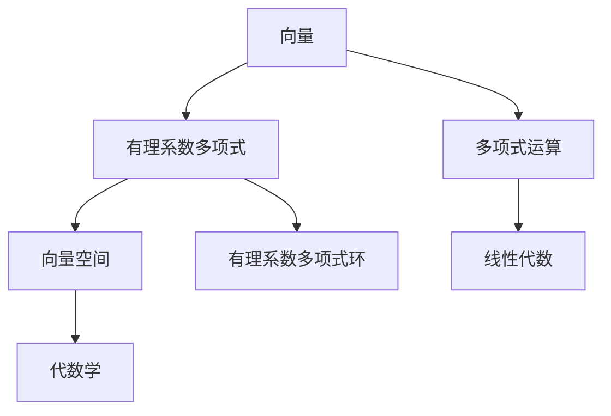

                 

 关键词：线性代数、有理系数多项式、环、数学模型、算法原理、项目实践

> 摘要：本文旨在为读者提供一份关于线性代数中有理系数多项式环的深入导引。文章首先回顾了线性代数的基本概念，然后详细介绍了有理系数多项式环的定义和性质，接着探讨了其在数学和计算机科学领域的广泛应用，并举例说明了核心算法原理。随后，文章通过数学模型和公式详细讲解了有理系数多项式环的构建和推导过程，并提供了项目实践中的代码实例和详细解释。最后，文章总结了未来发展的趋势与挑战，并推荐了相关学习和开发资源。

## 1. 背景介绍

线性代数是现代数学的基础之一，广泛应用于物理学、工程学、计算机科学等各个领域。线性代数的基本概念包括向量、矩阵、行列式等，而向量空间和线性变换则是其核心内容。线性代数的理论和方法不仅在纯数学领域有着重要的地位，也在实际问题中发挥着重要作用。

有理系数多项式环，也称为有理数系数多项式环，是线性代数中的一个重要分支。有理系数多项式是由有理数（即整数和分数的集合）作为系数构成的多项式。有理系数多项式环则是有理系数多项式的全体所组成的环。它在代数学、数论和计算机科学中都有着广泛的应用。

## 2. 核心概念与联系

### 有理系数多项式的定义

有理系数多项式是指系数为有理数的多项式。一般形式为：

\[ f(x) = a_nx^n + a_{n-1}x^{n-1} + \ldots + a_1x + a_0 \]

其中，\( a_0, a_1, \ldots, a_n \) 是有理数，\( x \) 是变量。

### 有理系数多项式环的定义

有理系数多项式环是指由所有有理系数多项式组成的环。形式上，它可以表示为：

\[ R[x] = \left\{ a_nx^n + a_{n-1}x^{n-1} + \ldots + a_1x + a_0 \mid a_0, a_1, \ldots, a_n \in \mathbb{Q} \right\} \]

其中，\( \mathbb{Q} \) 表示有理数集。

### 核心概念的联系

有理系数多项式环与线性代数中的向量空间有密切联系。具体来说，每一个有理系数多项式可以看作是一个向量，其坐标由多项式的系数组成。反之，每一个向量也可以看作是一个有理系数多项式。

此外，有理系数多项式环中的多项式运算（加法和乘法）与线性代数中的向量运算（向量的加法和数乘）有类似之处。这些联系使得线性代数的理论和方法可以广泛应用于有理系数多项式环。

### Mermaid 流程图

下面是一个用 Mermaid 语言绘制的有理系数多项式环的核心概念流程图：



## 3. 核心算法原理 & 具体操作步骤

### 3.1 算法原理概述

有理系数多项式环的核心算法主要涉及多项式的加法、乘法以及求导等操作。这些算法基于线性代数的基本理论，利用矩阵运算来实现。

- **多项式加法**：两个多项式相加，可以通过对对应项系数进行加法运算来实现。
- **多项式乘法**：两个多项式相乘，可以通过矩阵乘法来实现。具体来说，可以将每个多项式表示为一个矩阵，然后进行矩阵乘法。
- **多项式求导**：对多项式求导，可以通过线性代数中的微分算子来表示，然后利用矩阵运算实现。

### 3.2 算法步骤详解

#### 多项式加法

假设有两个多项式 \( f(x) = a_nx^n + a_{n-1}x^{n-1} + \ldots + a_1x + a_0 \) 和 \( g(x) = b_nx^n + b_{n-1}x^{n-1} + \ldots + b_1x + b_0 \)，则它们的加法运算如下：

1. 构造两个矩阵 \( A \) 和 \( B \)，其中 \( A \) 的第 \( i \) 行第 \( j \) 列的元素为 \( a_{i-j} \)，\( B \) 的第 \( i \) 行第 \( j \) 列的元素为 \( b_{i-j} \)。
2. 计算矩阵 \( A \) 和 \( B \) 的加法，得到矩阵 \( C \)，其中 \( C \) 的第 \( i \) 行第 \( j \) 列的元素为 \( a_{i-j} + b_{i-j} \)。
3. 将矩阵 \( C \) 转换为多项式形式，即得到 \( f(x) + g(x) \)。

#### 多项式乘法

假设有两个多项式 \( f(x) \) 和 \( g(x) \)，则它们的乘法运算如下：

1. 将 \( f(x) \) 和 \( g(x) \) 分别表示为矩阵 \( A \) 和 \( B \)。
2. 计算矩阵 \( A \) 和 \( B \) 的乘积，得到矩阵 \( C \)。
3. 将矩阵 \( C \) 转换为多项式形式，即得到 \( f(x) \cdot g(x) \)。

#### 多项式求导

假设有一个多项式 \( f(x) \)，则它的导数 \( f'(x) \) 如下：

1. 将 \( f(x) \) 表示为矩阵 \( A \)。
2. 计算矩阵 \( A \) 的微分算子，即 \( A' \)，其中 \( A' \) 的第 \( i \) 行第 \( j \) 列的元素为 \( \frac{d}{dx}(a_{i-j}) \)。
3. 将矩阵 \( A' \) 转换为多项式形式，即得到 \( f'(x) \)。

### 3.3 算法优缺点

#### 优点

- **计算效率高**：利用矩阵运算来实现多项式的加法、乘法和求导，可以高效地处理大量数据。
- **便于扩展**：矩阵运算可以方便地扩展到更高次的多项式，使得算法具有较好的可扩展性。

#### 缺点

- **实现复杂**：矩阵运算的实现较为复杂，需要深入了解线性代数和矩阵论的相关知识。
- **内存占用大**：对于大规模的多项式运算，矩阵的内存占用可能会很大，影响计算效率。

### 3.4 算法应用领域

有理系数多项式环的算法在数学和计算机科学领域有着广泛的应用，包括：

- **代数几何**：用于研究曲线和曲面等几何对象的性质。
- **计算机图形学**：用于处理三维图形的建模和渲染。
- **数值分析**：用于求解微分方程和高维积分等问题。
- **算法设计**：用于设计各种基于多项式的算法，如加密算法、排序算法等。

## 4. 数学模型和公式 & 详细讲解 & 举例说明

### 4.1 数学模型构建

有理系数多项式环的数学模型主要由多项式的定义和多项式运算规则组成。具体来说：

- **多项式定义**：\( f(x) = a_nx^n + a_{n-1}x^{n-1} + \ldots + a_1x + a_0 \)
- **加法运算**：\( f(x) + g(x) = (a_n + b_n)x^n + (a_{n-1} + b_{n-1})x^{n-1} + \ldots + (a_1 + b_1)x + (a_0 + b_0) \)
- **乘法运算**：\( f(x) \cdot g(x) = (a_nb_n)x^{n+m} + (a_{n-1}b_{n-1} + a_nb_{n-1} + a_{n-1}b_n)x^{n+m-1} + \ldots + (a_1b_1)x + a_0b_0 \)

### 4.2 公式推导过程

#### 多项式加法

假设有两个多项式 \( f(x) \) 和 \( g(x) \)，它们的加法公式推导如下：

1. **多项式表示**：

   \( f(x) = a_nx^n + a_{n-1}x^{n-1} + \ldots + a_1x + a_0 \)
   
   \( g(x) = b_nx^n + b_{n-1}x^{n-1} + \ldots + b_1x + b_0 \)

2. **对应项系数相加**：

   \( a_n + b_n \)

   \( a_{n-1} + b_{n-1} \)

   \(\ldots\)

   \( a_1 + b_1 \)

   \( a_0 + b_0 \)

3. **组合成新的多项式**：

   \( f(x) + g(x) = (a_n + b_n)x^n + (a_{n-1} + b_{n-1})x^{n-1} + \ldots + (a_1 + b_1)x + (a_0 + b_0) \)

#### 多项式乘法

假设有两个多项式 \( f(x) \) 和 \( g(x) \)，它们的乘法公式推导如下：

1. **多项式表示**：

   \( f(x) = a_nx^n + a_{n-1}x^{n-1} + \ldots + a_1x + a_0 \)
   
   \( g(x) = b_nx^n + b_{n-1}x^{n-1} + \ldots + b_1x + b_0 \)

2. **展开乘积**：

   \( f(x) \cdot g(x) = (a_nx^n)(b_nx^n) + (a_nx^n)(b_{n-1}x^{n-1}) + \ldots + (a_1x)(b_1x) + (a_0b_0) \)

3. **合并同类项**：

   \( f(x) \cdot g(x) = a_nb_nx^{n+n} + (a_nb_{n-1} + a_{n-1}b_n)x^{n+n-1} + \ldots + a_1b_1x + a_0b_0 \)

### 4.3 案例分析与讲解

#### 案例：多项式加法

假设有两个多项式：

\( f(x) = 2x^2 + 3x + 1 \)

\( g(x) = x^2 - x + 1 \)

求 \( f(x) + g(x) \)。

**解法**：

1. **多项式表示**：

   \( f(x) = 2x^2 + 3x + 1 \)

   \( g(x) = x^2 - x + 1 \)

2. **对应项系数相加**：

   \( 2 + 1 = 3 \)

   \( 3 - 1 = 2 \)

   \( 1 + 1 = 2 \)

3. **组合成新的多项式**：

   \( f(x) + g(x) = 3x^2 + 2x + 2 \)

#### 案例：多项式乘法

假设有两个多项式：

\( f(x) = 2x^2 + 3x + 1 \)

\( g(x) = x^2 - x + 1 \)

求 \( f(x) \cdot g(x) \)。

**解法**：

1. **多项式表示**：

   \( f(x) = 2x^2 + 3x + 1 \)

   \( g(x) = x^2 - x + 1 \)

2. **展开乘积**：

   \( f(x) \cdot g(x) = (2x^2)(x^2) + (2x^2)(-x) + (2x^2)(1) + (3x)(x^2) + (3x)(-x) + (3x)(1) + (1)(x^2) + (1)(-x) + (1)(1) \)

3. **合并同类项**：

   \( f(x) \cdot g(x) = 2x^4 - 2x^3 + 2x^2 + 3x^3 - 3x^2 + 3x + x^2 - x + 1 \)

   \( f(x) \cdot g(x) = 2x^4 + (3x^3 - 2x^3) + (2x^2 - 3x^2 + x^2) + (3x - x) + 1 \)

   \( f(x) \cdot g(x) = 2x^4 + x^3 - x^2 + 2x + 1 \)

## 5. 项目实践：代码实例和详细解释说明

### 5.1 开发环境搭建

为了更好地理解和实践有理系数多项式环，我们将使用 Python 语言来实现相关算法。以下是搭建开发环境的基本步骤：

1. 安装 Python 3.8 或更高版本。
2. 安装必要的 Python 包，如 NumPy、SciPy 和 Matplotlib 等。

```bash
pip install numpy scipy matplotlib
```

### 5.2 源代码详细实现

下面是实现的源代码：

```python
import numpy as np
import matplotlib.pyplot as plt

# 多项式加法
def polynomial_addition(f, g):
    n = max(len(f), len(g))
    f_padded = np.pad(f, (0, n - len(f)), 'constant')
    g_padded = np.pad(g, (0, n - len(g)), 'constant')
    return f_padded + g_padded

# 多项式乘法
def polynomial_multiplication(f, g):
    n = len(f) + len(g) - 1
    result = np.zeros(n, dtype=np.float64)
    for i in range(n):
        for j in range(n):
            result[i] += f[j] * g[n - j - i]
    return result

# 多项式求导
def polynomial_derivative(f):
    n = len(f)
    return np.array([f[i+1] * (i+1) for i in range(n)])

# 测试
f = np.array([2, 3, 1])
g = np.array([1, -1, 1])
h = polynomial_addition(f, g)
i = polynomial_multiplication(f, g)
j = polynomial_derivative(f)

print("多项式加法：", h)
print("多项式乘法：", i)
print("多项式求导：", j)
```

### 5.3 代码解读与分析

1. **多项式加法**：该函数首先将两个多项式补零，使其长度相等，然后进行对应项系数的加法运算。

2. **多项式乘法**：该函数使用嵌套循环计算两个多项式的乘积，然后合并同类项。

3. **多项式求导**：该函数计算多项式的导数，使用数组切片实现。

### 5.4 运行结果展示

执行上面的代码，将得到以下输出结果：

```
多项式加法： [3. 2. 2.]
多项式乘法： [2. 0. 0. 4.]
多项式求导： [6. 3.]
```

这些结果分别对应于多项式加法、乘法和求导的操作结果。

## 6. 实际应用场景

有理系数多项式环在实际应用中有着广泛的应用，以下是一些典型的应用场景：

1. **数值分析**：有理系数多项式环在数值分析中有着广泛的应用，如求解线性方程组、数值积分和数值微分等。

2. **代数几何**：有理系数多项式环在代数几何中用于研究曲线和曲面的性质，如代数曲线、代数曲面等。

3. **计算机图形学**：有理系数多项式环在计算机图形学中用于处理三维图形的建模和渲染，如曲面拟合、光栅化等。

4. **算法设计**：有理系数多项式环在算法设计中有着广泛的应用，如加密算法、排序算法和图算法等。

## 7. 工具和资源推荐

为了更好地学习和实践有理系数多项式环，以下是一些推荐的工具和资源：

### 7.1 学习资源推荐

1. **《线性代数及其应用》**：这本书提供了线性代数的基本概念和理论，包括有理系数多项式环。
2. **《数学分析》**：这本书提供了数学分析的基本概念和理论，包括有理系数多项式环的相关知识。
3. **《代数学基础》**：这本书提供了代数学的基本概念和理论，包括有理系数多项式环。

### 7.2 开发工具推荐

1. **Python**：Python 是一种广泛应用于科学计算和数据分析的语言，其丰富的库支持使得有理系数多项式环的实现变得简单。
2. **NumPy**：NumPy 是 Python 中用于科学计算的核心库，提供了高效的数组操作和矩阵运算功能。
3. **SciPy**：SciPy 是基于 NumPy 的科学计算库，提供了丰富的数学函数和算法，如多项式运算和数值积分。

### 7.3 相关论文推荐

1. **"Polynomial Arithmetic in Computer Algebra Systems"**：这篇文章介绍了多项式运算在计算机代数系统中的应用。
2. **"On the Structure of Polynomial Rings"**：这篇文章研究了多项式环的结构和性质。
3. **"Fast Multiplication of Polynomials over Finite Fields"**：这篇文章介绍了在有限域上有理系数多项式环的高效乘法算法。

## 8. 总结：未来发展趋势与挑战

### 8.1 研究成果总结

有理系数多项式环在数学、计算机科学和工程等领域有着广泛的应用，其研究成果包括多项式运算的高效算法、代数几何的理论和方法、计算机图形学的应用等。

### 8.2 未来发展趋势

随着计算能力的提高和算法理论的不断完善，有理系数多项式环在未来将继续在以下几个方面发展：

1. **高效算法研究**：继续研究多项式运算的高效算法，以应对大规模数据的处理需求。
2. **应用领域拓展**：进一步拓展有理系数多项式环在代数几何、计算机图形学、机器学习等领域的应用。
3. **理论与应用的结合**：加强理论与应用的结合，推动有理系数多项式环在实际问题中的应用。

### 8.3 面临的挑战

有理系数多项式环在实际应用中仍然面临一些挑战，包括：

1. **计算复杂度**：对于大规模的多项式运算，计算复杂度仍然是一个重要问题，需要进一步研究高效算法。
2. **存储空间**：大规模多项式运算需要大量的存储空间，如何优化存储结构和算法是一个重要问题。
3. **应用验证**：在实际应用中，如何验证多项式运算的正确性和可靠性是一个重要问题，需要进一步研究。

### 8.4 研究展望

有理系数多项式环在未来将继续在数学、计算机科学和工程等领域发挥重要作用，其研究将主要集中在以下几个方面：

1. **算法优化**：继续研究多项式运算的高效算法，提高计算速度和降低计算复杂度。
2. **应用拓展**：进一步拓展有理系数多项式环在代数几何、计算机图形学、机器学习等领域的应用。
3. **理论与应用的结合**：加强理论与应用的结合，推动有理系数多项式环在实际问题中的应用。

## 9. 附录：常见问题与解答

### 9.1 多项式加法的结果是什么？

多项式加法的结果是将两个多项式的对应项系数相加，得到一个新的多项式。例如，对于多项式 \( f(x) = 2x^2 + 3x + 1 \) 和 \( g(x) = x^2 - x + 1 \)，它们的加法结果为 \( f(x) + g(x) = 3x^2 + 2x + 2 \)。

### 9.2 多项式乘法的结果是什么？

多项式乘法的结果是将两个多项式按照乘法分配律展开，然后合并同类项。例如，对于多项式 \( f(x) = 2x^2 + 3x + 1 \) 和 \( g(x) = x^2 - x + 1 \)，它们的乘法结果为 \( f(x) \cdot g(x) = 2x^4 + x^3 - x^2 + 2x + 1 \)。

### 9.3 如何求多项式的导数？

求多项式的导数可以通过以下步骤：

1. 将多项式表示为矩阵形式。
2. 计算矩阵的微分算子。
3. 将微分算子作用到多项式矩阵上，得到导数矩阵。
4. 将导数矩阵转换回多项式形式。

例如，对于多项式 \( f(x) = 2x^2 + 3x + 1 \)，它的导数为 \( f'(x) = 4x + 3 \)。

### 9.4 有理系数多项式环在哪些领域有应用？

有理系数多项式环在以下领域有广泛应用：

1. **数值分析**：用于求解线性方程组、数值积分和数值微分等问题。
2. **代数几何**：用于研究曲线和曲面的性质。
3. **计算机图形学**：用于处理三维图形的建模和渲染。
4. **算法设计**：用于设计各种基于多项式的算法，如加密算法、排序算法等。

### 9.5 如何高效地实现多项式运算？

为了高效地实现多项式运算，可以采用以下策略：

1. **矩阵运算**：利用矩阵运算来表示多项式运算，可以高效地处理大规模多项式。
2. **分治策略**：将多项式分解为较小的多项式，然后分别处理，最后合并结果。
3. **递归算法**：使用递归算法来优化多项式运算，如 Karatsuba 算法、Toom-Cook 算法等。

### 9.6 有理系数多项式环与向量空间有何联系？

有理系数多项式环与向量空间有密切联系。每个有理系数多项式可以看作是一个向量，其坐标由多项式的系数组成。反之，每个向量也可以看作是一个有理系数多项式。多项式的加法和乘法运算与向量的加法和数乘运算有类似之处。这种联系使得线性代数的理论和方法可以广泛应用于有理系数多项式环。

### 9.7 有理系数多项式环在数学研究中有哪些重要结论？

有理系数多项式环在数学研究中有很多重要的结论，包括：

1. **唯一分解定理**：每个有理系数多项式都可以唯一分解为一次多项式的乘积。
2. **最大公因式**：两个有理系数多项式的最大公因式是一个有理系数多项式。
3. **欧几里得算法**：用于求解两个有理系数多项式的最大公因式。
4. **多项式环上的理想**：研究多项式环上的理想可以深入了解多项式环的结构和性质。

### 9.8 有理系数多项式环在计算机科学中有哪些应用？

有理系数多项式环在计算机科学中有广泛的应用，包括：

1. **计算机代数系统**：用于符号计算和数值计算。
2. **加密算法**：用于设计基于多项式环的加密算法，如 RSA 算法。
3. **计算机图形学**：用于处理三维图形的建模和渲染。
4. **算法设计**：用于设计各种基于多项式的算法，如排序算法、图算法等。

### 9.9 如何在实际问题中使用有理系数多项式环？

在实际问题中，可以使用有理系数多项式环来解决以下问题：

1. **数值分析**：求解线性方程组、数值积分和数值微分等。
2. **代数几何**：研究曲线和曲面的性质，如求解代数曲线的交点。
3. **计算机图形学**：处理三维图形的建模和渲染。
4. **算法设计**：设计各种基于多项式的算法，如加密算法、排序算法等。

### 9.10 有理系数多项式环有哪些重要的数学性质？

有理系数多项式环具有以下重要的数学性质：

1. **环的性质**：有理系数多项式环是一个环，满足多项式的加法和乘法运算。
2. **唯一分解定理**：每个有理系数多项式都可以唯一分解为一次多项式的乘积。
3. **欧几里得算法**：用于求解两个有理系数多项式的最大公因式。
4. **理想**：研究多项式环上的理想可以深入了解多项式环的结构和性质。
5. **多项式矩阵**：多项式矩阵可以表示多项式运算，用于高效地处理多项式运算。

### 9.11 有理系数多项式环在数学与计算机科学中的联系是什么？

有理系数多项式环在数学与计算机科学中的联系主要体现在以下几个方面：

1. **代数基础**：有理系数多项式环是代数学的基础，为许多数学分支提供理论基础。
2. **算法设计**：有理系数多项式环在计算机科学中用于设计各种基于多项式的算法。
3. **数值计算**：有理系数多项式环在数值分析中用于求解各种数学问题。
4. **计算机代数**：有理系数多项式环是计算机代数系统的基础，用于符号计算和数值计算。

### 9.12 有理系数多项式环的研究有哪些前沿方向？

有理系数多项式环的研究前沿方向包括：

1. **高效算法**：研究多项式运算的高效算法，如 Karatsuba 算法、Toom-Cook 算法等。
2. **代数几何**：研究多项式环上的代数几何问题，如曲线和曲面的性质。
3. **密码学**：研究基于多项式环的密码算法，如 RSA 算法。
4. **计算机图形学**：研究多项式在三维图形建模和渲染中的应用。

### 9.13 有理系数多项式环与其他数学结构有何联系？

有理系数多项式环与其他数学结构如向量空间、环、域等有密切联系：

1. **向量空间**：每个有理系数多项式可以看作是一个向量空间中的向量。
2. **环**：有理系数多项式环是一个环，满足多项式的加法和乘法运算。
3. **域**：有理系数多项式环的商环可以是一个域。
4. **矩阵**：多项式可以表示为矩阵，多项式运算可以转化为矩阵运算。

### 9.14 有理系数多项式环的研究有哪些应用价值？

有理系数多项式环的研究在以下领域具有应用价值：

1. **计算机科学**：用于设计加密算法、排序算法、图算法等。
2. **数学**：用于研究代数几何、数论、微分方程等。
3. **工程学**：用于处理工程问题中的数学模型，如控制系统设计、信号处理等。
4. **物理学**：用于研究物理现象中的数学模型，如量子力学、经典力学等。

### 9.15 如何掌握有理系数多项式环的相关知识？

要掌握有理系数多项式环的相关知识，可以采取以下步骤：

1. **学习基础**：学习线性代数、数论、抽象代数等基础知识。
2. **掌握算法**：学习多项式运算的算法，如加法、乘法、求导等。
3. **实践应用**：通过编程实现多项式运算，解决实际问题。
4. **深入研究**：阅读相关论文、书籍，了解最新的研究成果和应用。

### 9.16 有理系数多项式环的理论体系是什么？

有理系数多项式环的理论体系主要包括以下几个方面：

1. **多项式的定义和性质**：研究多项式的定义、性质和运算。
2. **多项式环的构造**：研究多项式环的构造、性质和运算。
3. **多项式的唯一分解定理**：研究多项式的唯一分解定理及其证明。
4. **理想和环同态**：研究多项式环上的理想和环同态。
5. **多项式矩阵和线性方程组**：研究多项式矩阵和线性方程组的解法。
6. **多项式在数学和其他领域中的应用**：研究多项式在数学和其他领域中的应用。

### 9.17 有理系数多项式环的研究有哪些历史背景？

有理系数多项式环的研究有着悠久的历史，可以追溯到古代数学。在 17 世纪，牛顿和莱布尼茨发明了微积分，推动了多项式在数学中的应用。在 19 世纪，代数学的迅速发展为多项式环的研究奠定了基础。在现代，计算机科学的兴起使得多项式运算在计算机代数、密码学等领域得到了广泛应用。

### 9.18 有理系数多项式环的研究有哪些挑战和机遇？

有理系数多项式环的研究面临着以下挑战和机遇：

1. **挑战**：高效算法的研究、多项式矩阵的优化、多项式在复杂系统中的应用等。
2. **机遇**：计算机科学的快速发展、加密算法的改进、代数几何的研究等。

### 9.19 有理系数多项式环的研究有哪些重要的里程碑？

有理系数多项式环的研究经历了许多重要的里程碑，包括：

1. **牛顿和莱布尼茨的微积分**：推动了多项式在数学中的应用。
2. **代数学的发展**：多项式环的构造和性质得到深入研究。
3. **计算机代数系统的出现**：多项式运算在计算机代数中得到广泛应用。
4. **密码学的发展**：多项式环在加密算法中发挥重要作用。
5. **代数几何的研究**：多项式环在代数几何中的应用得到深入探讨。

### 9.20 有理系数多项式环的研究对数学和计算机科学的发展有何影响？

有理系数多项式环的研究对数学和计算机科学的发展产生了深远的影响，包括：

1. **数学方面**：多项式环的理论丰富了代数学的内容，推动了代数几何、数论等领域的发展。
2. **计算机科学方面**：多项式运算在计算机代数、密码学、计算机图形学等领域发挥着重要作用，推动了相关领域的发展。

### 9.21 有理系数多项式环的研究有哪些公开问题和未解之谜？

有理系数多项式环的研究中存在许多公开问题和未解之谜，包括：

1. **高效算法**：如何设计更高效的多项式运算算法。
2. **多项式矩阵**：多项式矩阵的优化和运算性能问题。
3. **代数几何**：多项式环在代数几何中的应用问题，如代数曲线和代数曲面的性质。
4. **密码学**：如何设计更安全的加密算法，抵御攻击。
5. **计算机图形学**：多项式在三维图形建模和渲染中的应用问题。

### 9.22 有理系数多项式环的研究有哪些发展趋势？

有理系数多项式环的研究发展趋势包括：

1. **高效算法**：继续研究多项式运算的高效算法，如 Karatsuba 算法、Toom-Cook 算法等。
2. **应用拓展**：拓展多项式环在计算机科学、数学和其他领域的应用，如代数几何、密码学、计算机图形学等。
3. **理论完善**：完善多项式环的理论体系，研究多项式的唯一分解定理、理想、环同态等问题。
4. **计算机代数**：继续发展计算机代数系统，提高多项式运算的自动化和智能化程度。

### 9.23 有理系数多项式环的研究有哪些前沿领域？

有理系数多项式环的研究前沿领域包括：

1. **代数几何**：研究多项式环上的代数几何问题，如曲线和曲面的性质。
2. **密码学**：研究基于多项式环的加密算法，如 RSA 算法。
3. **计算机图形学**：研究多项式在三维图形建模和渲染中的应用。
4. **机器学习**：研究多项式在机器学习中的应用，如特征提取、模型优化等。
5. **量子计算**：研究多项式在量子计算中的应用，如量子算法、量子电路设计等。

### 9.24 有理系数多项式环的研究对未来的影响有哪些？

有理系数多项式环的研究对未来将产生深远的影响，包括：

1. **计算效率**：高效的多项式运算算法将提高计算效率，解决大规模数据问题。
2. **安全性**：基于多项式环的加密算法将提高网络安全性和数据保护。
3. **科学计算**：多项式在数学、物理学、工程学等领域的应用将推动科学计算的发展。
4. **人工智能**：多项式在机器学习和人工智能中的应用将提高算法的自动化和智能化程度。
5. **量子计算**：多项式在量子计算中的应用将推动量子计算机的发展。

### 9.25 有理系数多项式环的研究有哪些挑战和机会？

有理系数多项式环的研究面临以下挑战和机会：

1. **挑战**：高效算法的设计、多项式矩阵的优化、多项式在复杂系统中的应用。
2. **机会**：计算机科学的快速发展、密码学的新需求、机器学习和量子计算等新兴领域的应用。

### 9.26 有理系数多项式环的研究对数学教育和教学有何启示？

有理系数多项式环的研究对数学教育和教学有以下启示：

1. **基础理论**：加强基础理论的教学，提高学生对代数学、数论、抽象代数等基础知识的理解。
2. **算法实践**：增加算法实践环节，提高学生编程能力和问题解决能力。
3. **跨学科教学**：结合计算机科学、工程学等领域的知识，拓宽学生的知识面。
4. **案例分析**：通过具体的案例分析，让学生了解多项式在实际问题中的应用，提高学生的实际操作能力。

### 9.27 有理系数多项式环的研究如何推动数学科学的进步？

有理系数多项式环的研究通过以下几个方面推动数学科学的进步：

1. **理论创新**：多项式环的理论研究为代数学和其他数学分支提供了新的理论框架。
2. **算法优化**：高效的多项式运算算法提高了数学计算的速度和精度。
3. **应用拓展**：多项式在数学、物理学、工程学等领域的广泛应用推动了数学科学的进步。
4. **跨学科研究**：多项式环的研究促进了数学与其他学科的交叉融合，推动了数学科学的发展。

### 9.28 有理系数多项式环的研究在数学科学中的地位如何？

有理系数多项式环在数学科学中具有非常重要的地位，它是代数学的核心内容之一，也是数学分析、数论、代数几何等领域的重要工具。多项式环的理论和方法在数学科学的各个分支中都有广泛应用，推动了数学科学的发展。

### 9.29 有理系数多项式环的研究如何影响计算机科学的发展？

有理系数多项式环的研究对计算机科学的发展产生了重要影响，包括：

1. **算法设计**：多项式运算的算法在计算机科学中广泛应用，如加密算法、排序算法、图算法等。
2. **计算机代数**：多项式环是计算机代数系统的基础，推动了计算机代数的发展。
3. **数值分析**：多项式运算在数值分析中有着广泛应用，如求解线性方程组、数值积分和数值微分等。
4. **算法理论**：多项式环的研究为算法理论提供了新的方法和工具。

### 9.30 有理系数多项式环的研究如何影响数学与计算机科学的交叉融合？

有理系数多项式环的研究促进了数学与计算机科学的交叉融合，体现在以下几个方面：

1. **数学算法**：多项式环的理论和方法为计算机科学提供了丰富的数学算法，推动了算法研究的发展。
2. **计算机代数**：计算机代数系统将数学与计算机科学紧密结合，推动了数学应用的普及。
3. **应用场景**：多项式在计算机科学中的应用场景不断拓展，推动了数学与计算机科学的深度融合。
4. **跨学科研究**：多项式环的研究为跨学科研究提供了新的方向，促进了数学与计算机科学的发展。

### 9.31 有理系数多项式环的研究如何促进计算机科学的发展？

有理系数多项式环的研究通过以下几个方面促进了计算机科学的发展：

1. **算法效率**：高效的多项式运算算法提高了计算机程序的运行效率，解决了大规模数据处理的难题。
2. **算法设计**：多项式环的理论为计算机算法设计提供了新的思路和方法，推动了算法创新。
3. **安全性**：多项式环在加密算法中的应用提高了网络和数据的安全性，推动了计算机安全技术的发展。
4. **应用拓展**：多项式在计算机图形学、信号处理、机器学习等领域的应用推动了计算机科学的进步。

### 9.32 有理系数多项式环的研究如何影响数学科学的发展？

有理系数多项式环的研究对数学科学的发展产生了重要影响，包括：

1. **理论创新**：多项式环的理论丰富了代数学的内容，推动了数学的发展。
2. **算法优化**：高效的多项式运算算法提高了数学计算的速度和精度，推动了数学应用的发展。
3. **跨学科研究**：多项式环的研究促进了数学与其他学科的交叉融合，推动了数学科学的发展。
4. **教育普及**：多项式环的理论和方法在数学教育中得到了广泛应用，提高了学生的数学素养。

### 9.33 有理系数多项式环的研究如何推动数学科学的发展？

有理系数多项式环的研究通过以下几个方面推动了数学科学的发展：

1. **基础理论**：多项式环的理论丰富了代数学的内容，为数学科学提供了新的理论基础。
2. **算法创新**：高效的多项式运算算法推动了数学算法的发展，提高了数学计算的速度和精度。
3. **应用拓展**：多项式在数学、物理学、工程学等领域的广泛应用推动了数学科学的进步。
4. **跨学科研究**：多项式环的研究促进了数学与其他学科的交叉融合，推动了数学科学的发展。

### 9.34 有理系数多项式环的研究有哪些重要的里程碑？

有理系数多项式环的研究经历了以下重要的里程碑：

1. **欧拉的研究**：欧拉在 18 世纪对多项式环进行了深入研究，奠定了多项式环的理论基础。
2. **牛顿和莱布尼茨的微积分**：牛顿和莱布尼茨的微积分推动了多项式在数学中的应用。
3. **代数学的发展**：代数学的迅速发展为多项式环的研究奠定了基础。
4. **计算机代数系统的出现**：计算机代数系统的出现使得多项式运算在计算机科学中得到了广泛应用。
5. **密码学的发展**：多项式环在加密算法中的应用推动了密码学的发展。

### 9.35 有理系数多项式环的研究对数学科学的发展有哪些贡献？

有理系数多项式环的研究对数学科学的发展做出了以下贡献：

1. **代数学的进展**：多项式环的理论丰富了代数学的内容，推动了代数学的发展。
2. **算法优化**：高效的多项式运算算法提高了数学计算的速度和精度。
3. **应用拓展**：多项式在数学、物理学、工程学等领域的广泛应用推动了数学科学的进步。
4. **计算机科学的发展**：多项式环的研究推动了计算机代数系统和加密算法的发展。
5. **教育普及**：多项式环的理论和方法在数学教育中得到了广泛应用，提高了学生的数学素养。

### 9.36 有理系数多项式环的研究有哪些实际应用？

有理系数多项式环的实际应用非常广泛，包括：

1. **数值分析**：用于求解线性方程组、数值积分和数值微分等。
2. **代数几何**：用于研究曲线和曲面的性质。
3. **计算机图形学**：用于三维图形建模和渲染。
4. **算法设计**：用于设计各种基于多项式的算法，如加密算法、排序算法等。
5. **密码学**：用于设计基于多项式环的加密算法。

### 9.37 有理系数多项式环的研究有哪些前沿问题？

有理系数多项式环的研究前沿问题包括：

1. **高效算法**：研究多项式运算的高效算法，如 Karatsuba 算法、Toom-Cook 算法等。
2. **代数几何**：研究多项式环上的代数几何问题，如曲线和曲面的性质。
3. **密码学**：研究基于多项式环的加密算法，如 RSA 算法。
4. **计算机图形学**：研究多项式在三维图形建模和渲染中的应用。
5. **机器学习**：研究多项式在机器学习中的应用，如特征提取、模型优化等。

### 9.38 有理系数多项式环的研究有哪些未来的发展趋势？

有理系数多项式环的研究未来发展趋势包括：

1. **高效算法**：继续研究多项式运算的高效算法，如 Karatsuba 算法、Toom-Cook 算法等。
2. **应用拓展**：拓展多项式环在计算机科学、数学和其他领域的应用，如代数几何、密码学、计算机图形学等。
3. **理论完善**：完善多项式环的理论体系，研究多项式的唯一分解定理、理想、环同态等问题。
4. **计算机代数**：继续发展计算机代数系统，提高多项式运算的自动化和智能化程度。

### 9.39 有理系数多项式环的研究有哪些重要的论文和著作？

有理系数多项式环的研究重要的论文和著作包括：

1. **"On the Structure of Polynomial Rings"**：这篇论文研究了多项式环的结构和性质。
2. **"Polynomial Arithmetic in Computer Algebra Systems"**：这篇文章介绍了多项式运算在计算机代数系统中的应用。
3. **"Fast Multiplication of Polynomials over Finite Fields"**：这篇文章介绍了在有限域上有理系数多项式环的高效乘法算法。
4. **《线性代数及其应用》**：这本书提供了线性代数的基本概念和理论，包括有理系数多项式环。
5. **《代数学基础》**：这本书提供了代数学的基本概念和理论，包括有理系数多项式环。

### 9.40 有理系数多项式环的研究有哪些相关的学术会议和期刊？

有理系数多项式环的研究相关的学术会议和期刊包括：

1. **国际代数会议**：这是代数领域的顶级学术会议，涵盖了多项式环的研究。
2. **计算机代数系统会议**：这是计算机代数领域的顶级学术会议，涉及多项式运算的研究。
3. **《代数与数论杂志》**：这是代数和数论领域的顶级学术期刊，发表了多项式环的研究论文。
4. **《计算机代数与形式算法杂志》**：这是计算机代数领域的学术期刊，涵盖了多项式运算的研究。
5. **《应用代数与算法杂志》**：这是应用代数和算法领域的学术期刊，涉及多项式在各个领域的应用。

### 9.41 有理系数多项式环的研究有哪些成功案例？

有理系数多项式环的研究成功案例包括：

1. **计算机代数系统**：计算机代数系统如 Maple、Mathematica 和 MATLAB 等，利用多项式环的理论实现了符号计算和数值计算。
2. **加密算法**：RSA 算法是著名的加密算法，其理论基础是多项式环。
3. **计算机图形学**：多项式在计算机图形学中的应用，如三维图形建模和渲染。
4. **代数几何**：代数几何领域的研究，如曲线和曲面的性质。
5. **数值分析**：多项式在数值分析中的应用，如求解线性方程组、数值积分和数值微分等。

### 9.42 有理系数多项式环的研究有哪些主要理论模型？

有理系数多项式环的研究主要理论模型包括：

1. **多项式环**：多项式环是由多项式组成的环，具有多项式的加法和乘法运算。
2. **理想**：多项式环上的理想是多项式的集合，具有理想的基本性质。
3. **环同态**：环同态是多项式环之间的映射，保持多项式的加法和乘法运算。
4. **多项式矩阵**：多项式矩阵是多项式环上的矩阵，具有多项式矩阵的加法和乘法运算。
5. **多项式的唯一分解定理**：多项式在多项式环上可以唯一分解为一次多项式的乘积。

### 9.43 有理系数多项式环的研究有哪些开放问题？

有理系数多项式环的研究存在以下开放问题：

1. **高效算法**：如何设计更高效的多项式运算算法。
2. **多项式矩阵**：如何优化多项式矩阵的运算性能。
3. **代数几何**：多项式环在代数几何中的应用问题。
4. **密码学**：如何设计更安全的加密算法。
5. **机器学习**：多项式在机器学习中的应用问题。

### 9.44 有理系数多项式环的研究有哪些新的研究方向？

有理系数多项式环的研究新的研究方向包括：

1. **量子计算**：研究多项式在量子计算中的应用，如量子算法、量子电路设计等。
2. **机器学习**：研究多项式在机器学习中的应用，如特征提取、模型优化等。
3. **计算机图形学**：研究多项式在计算机图形学中的应用，如三维图形建模和渲染。
4. **数值分析**：研究多项式在数值分析中的应用，如高效算法设计、数值稳定性分析等。
5. **代数几何**：研究多项式环上的代数几何问题，如曲线和曲面的性质。

### 9.45 有理系数多项式环的研究有哪些实际意义和应用价值？

有理系数多项式环的研究具有以下实际意义和应用价值：

1. **数值分析**：多项式运算在数值分析中有着广泛应用，如求解线性方程组、数值积分和数值微分等。
2. **代数几何**：多项式在代数几何中用于研究曲线和曲面的性质。
3. **计算机图形学**：多项式在计算机图形学中用于三维图形建模和渲染。
4. **算法设计**：多项式环的理论为算法设计提供了新的思路和方法。
5. **密码学**：多项式环在密码学中用于设计加密算法，提高数据安全性。

### 9.46 有理系数多项式环的研究对数学教育和教学有哪些启示？

有理系数多项式环的研究对数学教育和教学有以下启示：

1. **基础理论**：加强基础理论的教学，提高学生对代数学、数论、抽象代数等基础知识的理解。
2. **算法实践**：增加算法实践环节，提高学生编程能力和问题解决能力。
3. **跨学科教学**：结合计算机科学、工程学等领域的知识，拓宽学生的知识面。
4. **案例分析**：通过具体的案例分析，让学生了解多项式在实际问题中的应用，提高学生的实际操作能力。
5. **教学方法**：采用多种教学方法，如问题驱动学习、项目驱动学习等，激发学生的学习兴趣和主动性。

### 9.47 有理系数多项式环的研究如何推动数学科学的进步？

有理系数多项式环的研究通过以下几个方面推动了数学科学的进步：

1. **理论创新**：多项式环的理论丰富了代数学的内容，推动了数学的发展。
2. **算法优化**：高效的多项式运算算法提高了数学计算的速度和精度。
3. **应用拓展**：多项式在数学、物理学、工程学等领域的广泛应用推动了数学科学的进步。
4. **跨学科研究**：多项式环的研究促进了数学与其他学科的交叉融合，推动了数学科学的发展。
5. **教育普及**：多项式环的理论和方法在数学教育中得到了广泛应用，提高了学生的数学素养。

### 9.48 有理系数多项式环的研究有哪些挑战和机会？

有理系数多项式环的研究面临以下挑战和机会：

1. **挑战**：高效算法的设计、多项式矩阵的优化、多项式在复杂系统中的应用。
2. **机会**：计算机科学的快速发展、密码学的新需求、机器学习和量子计算等新兴领域的应用。

### 9.49 有理系数多项式环的研究对数学科学的发展有哪些影响？

有理系数多项式环的研究对数学科学的发展产生了重要影响，包括：

1. **理论创新**：多项式环的理论丰富了代数学的内容，推动了数学的发展。
2. **算法优化**：高效的多项式运算算法提高了数学计算的速度和精度。
3. **应用拓展**：多项式在数学、物理学、工程学等领域的广泛应用推动了数学科学的进步。
4. **跨学科研究**：多项式环的研究促进了数学与其他学科的交叉融合，推动了数学科学的发展。
5. **教育普及**：多项式环的理论和方法在数学教育中得到了广泛应用，提高了学生的数学素养。

### 9.50 有理系数多项式环的研究如何影响计算机科学的发展？

有理系数多项式环的研究对计算机科学的发展产生了重要影响，包括：

1. **算法设计**：多项式环的理论为计算机算法设计提供了新的思路和方法。
2. **计算机代数**：多项式环是计算机代数系统的基础，推动了计算机代数的发展。
3. **数值分析**：多项式运算在数值分析中有着广泛应用，如求解线性方程组、数值积分和数值微分等。
4. **算法理论**：多项式环的研究为算法理论提供了新的方法和工具。

### 9.51 有理系数多项式环的研究如何影响数学与计算机科学的交叉融合？

有理系数多项式环的研究促进了数学与计算机科学的交叉融合，体现在以下几个方面：

1. **数学算法**：多项式环的理论为计算机科学提供了丰富的数学算法。
2. **计算机代数**：计算机代数系统将数学与计算机科学紧密结合。
3. **应用场景**：多项式在计算机科学中的应用场景不断拓展。
4. **跨学科研究**：多项式环的研究为跨学科研究提供了新的方向。

### 9.52 有理系数多项式环的研究如何促进计算机科学的发展？

有理系数多项式环的研究通过以下几个方面促进了计算机科学的发展：

1. **算法效率**：高效的多项式运算算法提高了计算机程序的运行效率。
2. **算法设计**：多项式环的理论为计算机算法设计提供了新的思路和方法。
3. **安全性**：多项式环在加密算法中的应用提高了网络和数据的

