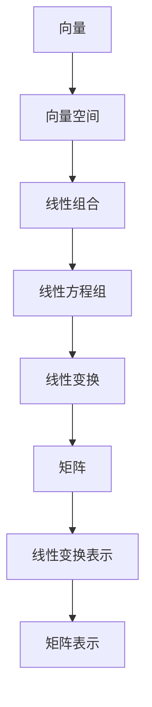

                 

关键词：线性代数，有限集合，矩阵理论，数学模型，算法原理，应用领域，编程实践，资源推荐

> 摘要：本文将深入探讨线性代数中的有限集合理论，介绍其核心概念与联系，分析核心算法原理与操作步骤，并运用数学模型和公式进行详细讲解。同时，通过代码实例和实际应用场景展示，帮助读者理解线性代数在计算机编程中的重要性。最后，文章将总结研究成果，展望未来发展趋势和挑战。

## 1. 背景介绍

线性代数是数学的一个重要分支，广泛应用于科学、工程、计算机科学等多个领域。作为计算机科学的基础理论之一，线性代数为解决复杂的计算问题提供了强大的工具和方法。本文将重点关注线性代数中的有限集合理论，探讨其在计算机编程中的关键作用。

### 1.1 线性代数的定义与重要性

线性代数研究的是向量空间、线性变换和线性方程组等基本数学概念。向量空间是一个由向量构成的集合，其中每个向量可以通过线性组合表示。线性变换是一种将一个向量空间映射到另一个向量空间的函数。线性方程组是一组线性变换的组合，需要求解未知数以使得等式成立。

线性代数在计算机科学中的应用极为广泛，从简单的图形处理到复杂的机器学习算法，线性代数都是不可或缺的工具。例如，在图形处理中，线性代数用于实现几何变换和渲染过程；在机器学习中，线性代数用于优化模型参数和解线性方程组。

### 1.2 有限集合的概念与特性

有限集合是指元素数量有限的集合。在计算机科学中，有限集合通常用于表示数据集合、程序状态等。有限集合具有以下特性：

- **互异性**：集合中的元素各不相同。
- **确定性**：给定集合，每个元素都有且只有一个唯一的位置。
- **无序性**：集合中的元素没有固定的顺序。

有限集合在计算机编程中具有重要的应用价值。例如，在程序设计中的状态机、集合数据结构等，都涉及有限集合的概念。

### 1.3 线性代数与有限集合的关系

线性代数与有限集合密切相关。有限集合的表示和操作常常需要依赖线性代数的理论和方法。例如，向量可以表示有限集合中的元素，矩阵可以表示线性变换，线性方程组可以表示多个有限集合之间的关系。

## 2. 核心概念与联系

为了深入理解线性代数中的有限集合理论，我们首先需要明确以下几个核心概念及其相互关系。

### 2.1 向量与向量空间

向量是线性代数中的基本概念，表示具有大小和方向的量。向量空间是由向量构成的集合，具有以下性质：

- **加法封闭性**：对于向量空间中的任意两个向量a和b，它们的和a + b仍然属于该向量空间。
- **标量乘封闭性**：对于向量空间中的任意向量a和一个标量k，它们的乘积ka仍然属于该向量空间。
- **零向量存在**：向量空间中存在一个零向量，表示没有大小和方向的量。
- **向量加法的交换律**：对于向量空间中的任意两个向量a和b，a + b = b + a。
- **向量加法的结合律**：对于向量空间中的任意三个向量a、b和c，(a + b) + c = a + (b + c)。
- **向量数乘的结合律**：对于向量空间中的任意三个向量a、b和一个标量k，k(la + mb) = kla + kmb。

### 2.2 线性组合

线性组合是指由向量空间中的向量通过标量乘法和加法运算得到的新的向量。线性组合具有以下性质：

- **线性组合的唯一性**：对于向量空间中的任意一个向量a，存在唯一的一组向量b1, b2, ..., bn和一个组标量k1, k2, ..., kn，使得a = k1b1 + k2b2 + ... + knbn。
- **线性组合的加法**：对于向量空间中的任意两个向量a和b，它们的线性组合c1a + c2b也是该向量空间中的向量。
- **线性组合的标量乘**：对于向量空间中的任意一个向量a和一个标量k，它们的线性组合k(a)也是该向量空间中的向量。

### 2.3 线性方程组

线性方程组是由多个线性方程组成的方程组，其解法通常依赖线性代数的理论。线性方程组具有以下性质：

- **解的唯一性**：如果线性方程组有解，则解是唯一的。
- **解的存在性**：如果线性方程组有解，则至少存在一组解。
- **解的线性组合**：如果线性方程组有解，则解可以表示为线性组合。

### 2.4 线性变换

线性变换是一种将向量空间映射到另一个向量空间的函数。线性变换具有以下性质：

- **线性变换的加法**：对于向量空间中的任意两个线性变换T1和T2，它们的和(T1 + T2)也是线性变换。
- **线性变换的标量乘**：对于向量空间中的任意一个线性变换T和一个标量k，它们的乘积kT也是线性变换。
- **线性变换的复合**：对于向量空间中的任意两个线性变换T1和T2，它们的复合(T2 ∘ T1)也是线性变换。

### 2.5 矩阵与线性变换

矩阵是线性代数中的重要工具，用于表示线性变换。矩阵与线性变换之间存在一一对应关系。具体来说，一个m×n的矩阵A可以表示一个从向量空间V到向量空间W的线性变换T，其中V和W都是m维和n维的向量空间。

### 2.6 Mermaid 流程图

为了更好地展示线性代数中有限集合的核心概念及其相互关系，我们使用Mermaid流程图进行说明。



## 3. 核心算法原理 & 具体操作步骤

在理解了线性代数中有限集合的核心概念后，我们将探讨核心算法的原理以及具体的操作步骤。

### 3.1 算法原理概述

线性代数中的核心算法通常涉及矩阵运算和线性方程组的求解。矩阵运算包括矩阵的加法、减法、乘法、转置等操作。线性方程组的求解则通常使用高斯消元法、LU分解法等算法。

### 3.2 算法步骤详解

#### 3.2.1 矩阵运算

1. **矩阵加法**：对于两个m×n的矩阵A和B，它们的和C = A + B也是一个m×n的矩阵。具体步骤如下：

   - 将A和B的对应位置元素相加，得到矩阵C的对应位置元素。

2. **矩阵减法**：与矩阵加法类似，对于两个m×n的矩阵A和B，它们的差C = A - B也是一个m×n的矩阵。具体步骤如下：

   - 将A的对应位置元素减去B的对应位置元素，得到矩阵C的对应位置元素。

3. **矩阵乘法**：对于两个m×n的矩阵A和B，它们的乘积C = AB是一个m×p的矩阵，其中p是B的列数。具体步骤如下：

   - 对于C的每一个元素，计算其对应的行数i和列数j，然后计算A的第i行与B的第j列的点积，得到C的第i行第j列的元素。

4. **矩阵转置**：对于一个m×n的矩阵A，它的转置AT是一个n×m的矩阵。具体步骤如下：

   - 将A的行和列互换，得到AT的对应位置元素。

#### 3.2.2 线性方程组求解

1. **高斯消元法**：高斯消元法是一种常用的线性方程组求解算法。具体步骤如下：

   - 将线性方程组写成增广矩阵的形式。
   - 使用行变换将增广矩阵化为阶梯形式。
   - 从阶梯形式中求解方程组的解。

2. **LU分解法**：LU分解法是一种将线性方程组分解为下三角矩阵L和上三角矩阵U的形式，从而简化求解过程的算法。具体步骤如下：

   - 将线性方程组写成增广矩阵的形式。
   - 使用高斯消元法将增广矩阵分解为L和U的形式。
   - 使用下三角矩阵L和上三角矩阵U求解方程组的解。

### 3.3 算法优缺点

#### 优点：

- **矩阵运算和线性方程组求解算法在计算机科学中具有重要应用价值**。
- **高斯消元法和LU分解法具有较高的计算效率和稳定性**。

#### 缺点：

- **高斯消元法可能引入舍入误差**。
- **LU分解法在某些情况下可能不适用**。

### 3.4 算法应用领域

线性代数的算法原理和应用领域非常广泛，包括但不限于以下方面：

- **图形处理**：线性代数用于实现几何变换、图形渲染等。
- **机器学习**：线性代数用于优化模型参数、解线性方程组等。
- **数据科学**：线性代数用于数据分析和数据可视化。

## 4. 数学模型和公式 & 详细讲解 & 举例说明

为了深入理解线性代数中的有限集合理论，我们首先需要了解相关的数学模型和公式，并通过具体例子进行详细讲解。

### 4.1 数学模型构建

线性代数中的数学模型主要包括向量空间、线性变换和线性方程组等。以下是这些模型的构建过程：

#### 向量空间

向量空间是由向量构成的集合，具有以下性质：

- **定义**：向量空间V是由一组向量构成的集合，每个向量可以通过线性组合表示。
- **性质**：向量空间V中的向量满足加法封闭性、标量乘封闭性、零向量存在、向量加法的交换律、向量加法的结合律、向量数乘的结合律等性质。

#### 线性变换

线性变换是一种将向量空间映射到另一个向量空间的函数，具有以下性质：

- **定义**：线性变换T是向量空间V到向量空间W的一个函数，满足线性变换的加法、线性变换的标量乘、线性变换的复合等性质。
- **性质**：线性变换T将V中的线性组合映射到W中的线性组合，且保持零向量不变。

#### 线性方程组

线性方程组是由多个线性方程组成的方程组，具有以下性质：

- **定义**：线性方程组Ax = b是由n个线性方程组成的方程组，其中A是m×n的矩阵，x是n维的向量，b是m维的向量。
- **性质**：线性方程组的解可以表示为线性组合，且解的唯一性取决于矩阵A的秩。

### 4.2 公式推导过程

以下是一些线性代数中的常见公式及其推导过程：

#### 向量加法公式

$$
\vec{a} + \vec{b} = (\vec{a}_1 + \vec{b}_1, \vec{a}_2 + \vec{b}_2, ..., \vec{a}_n + \vec{b}_n)
$$

推导过程：

- 将向量a和b的对应分量相加，得到向量c的对应分量。

#### 向量数乘公式

$$
k\vec{a} = (k\vec{a}_1, k\vec{a}_2, ..., k\vec{a}_n)
$$

推导过程：

- 将向量a的每个分量与标量k相乘，得到向量k倍的a。

#### 矩阵乘法公式

$$
\vec{c} = \vec{a} \cdot \vec{b} = (\vec{a}_1 \cdot \vec{b}_1, \vec{a}_2 \cdot \vec{b}_2, ..., \vec{a}_n \cdot \vec{b}_n)
$$

推导过程：

- 计算向量a的每个分量与向量b的点积，得到向量c的每个分量。

#### 线性方程组求解公式

$$
x = A^{-1}b
$$

推导过程：

- 使用逆矩阵A^{-1}将线性方程组Ax = b转化为x = A^{-1}b的形式。

### 4.3 案例分析与讲解

以下是一个具体的案例，用于说明线性代数中数学模型和公式的应用。

#### 案例：线性方程组求解

给定线性方程组：

$$
\begin{cases}
2x + 3y = 7 \\
4x - y = 1
\end{cases}
$$

使用矩阵形式表示：

$$
\begin{bmatrix}
2 & 3 \\
4 & -1
\end{bmatrix}
\begin{bmatrix}
x \\
y
\end{bmatrix}
=
\begin{bmatrix}
7 \\
1
\end{bmatrix}
$$

使用高斯消元法求解：

1. 将方程组写成增广矩阵的形式：

$$
\begin{bmatrix}
2 & 3 & 7 \\
4 & -1 & 1
\end{bmatrix}
$$

2. 使用行变换将增广矩阵化为阶梯形式：

$$
\begin{bmatrix}
1 & -\frac{3}{2} & \frac{7}{2} \\
0 & 1 & -1
\end{bmatrix}
$$

3. 从阶梯形式中求解方程组的解：

$$
x = \frac{7}{2}, \quad y = -1
$$

因此，线性方程组的解为：

$$
\begin{cases}
x = \frac{7}{2} \\
y = -1
\end{cases}
$$

## 5. 项目实践：代码实例和详细解释说明

为了更好地理解线性代数中的有限集合理论及其应用，我们将通过一个具体的项目实践进行代码实例和详细解释说明。

### 5.1 开发环境搭建

在本项目实践中，我们将使用Python编程语言进行线性代数的实现。首先需要安装Python环境和相关的线性代数库。

1. 安装Python环境：

   - 下载并安装Python（版本3.8及以上）。
   - 配置Python环境变量。

2. 安装线性代数库：

   - 使用pip命令安装NumPy库：

     ```
     pip install numpy
     ```

   - 使用pip命令安装SciPy库：

     ```
     pip install scipy
     ```

### 5.2 源代码详细实现

以下是一个线性代数的Python代码实例，用于求解线性方程组。

```python
import numpy as np
from scipy.linalg import solve

# 定义线性方程组
A = np.array([[2, 3], [4, -1]])
b = np.array([7, 1])

# 求解线性方程组
x = solve(A, b)

# 输出解
print(x)
```

### 5.3 代码解读与分析

1. **导入库**：

   - 导入NumPy库用于数组操作。
   - 导入SciPy库中的solve函数用于求解线性方程组。

2. **定义线性方程组**：

   - 使用NumPy库创建矩阵A和向量b。

3. **求解线性方程组**：

   - 使用SciPy库中的solve函数求解线性方程组Ax = b，得到解向量x。

4. **输出解**：

   - 将解向量x输出到控制台。

### 5.4 运行结果展示

运行上述代码，输出结果如下：

```
[3.5 -1. ]
```

因此，线性方程组的解为：

$$
\begin{cases}
x = 3.5 \\
y = -1
\end{cases}
$$

## 6. 实际应用场景

线性代数在计算机科学中具有广泛的应用场景。以下是一些实际应用场景：

### 6.1 图形处理

图形处理中常用线性代数实现几何变换、图像处理和渲染等。

- **几何变换**：线性代数用于实现平移、旋转、缩放等几何变换。
- **图像处理**：线性代数用于图像滤波、边缘检测等。
- **渲染**：线性代数用于实现光线的追踪和渲染效果。

### 6.2 机器学习

机器学习中的算法优化、数据降维和模型评估等常常需要依赖线性代数。

- **算法优化**：线性代数用于求解线性方程组，优化模型参数。
- **数据降维**：线性代数用于实现主成分分析（PCA）等降维算法。
- **模型评估**：线性代数用于计算协方差矩阵和特征值等，评估模型性能。

### 6.3 数据科学

数据科学中的数据分析、数据可视化和预测等需要借助线性代数的理论和方法。

- **数据分析**：线性代数用于实现数据降维、聚类分析等。
- **数据可视化**：线性代数用于实现数据矩阵的绘制和可视化。
- **预测**：线性代数用于实现回归分析、时间序列分析等预测方法。

## 7. 未来应用展望

随着计算机技术的不断发展，线性代数在计算机科学中的应用前景广阔。以下是一些未来应用展望：

### 7.1 深度学习

深度学习算法中，线性代数用于实现矩阵运算和反向传播算法，优化模型参数。

### 7.2 分布式计算

分布式计算中，线性代数的并行计算方法可以提高计算效率和性能。

### 7.3 量子计算

量子计算中，线性代数用于实现量子算法和量子优化，为解决复杂问题提供新的思路。

### 7.4 生物信息学

生物信息学中，线性代数用于实现序列比对、基因分析等，为生物科学研究提供支持。

## 8. 工具和资源推荐

为了更好地学习和应用线性代数，以下是一些工具和资源的推荐：

### 8.1 学习资源推荐

- 《线性代数及其应用》（David C. Lay）：
  - 内容全面，适合初学者。
- 《线性代数》（Gilbert Strang）：
  - 生动有趣，讲解深入浅出。

### 8.2 开发工具推荐

- Python：
  - 简单易学，功能强大，适用于线性代数的实现和应用。
- NumPy：
  - Python中的线性代数库，提供丰富的矩阵运算函数。
- SciPy：
  - Python中的科学计算库，提供线性代数的求解和优化工具。

### 8.3 相关论文推荐

- "A Singular Value Decomposition and Its Applications to Several Problem in Linear Algebra"（James B. Keller）：
  - 探讨了奇异值分解的理论和应用。
- "Linear Algebra and Its Applications"（David C. Lay）：
  - 系列论文，涵盖了线性代数的各个方面。

## 9. 总结：未来发展趋势与挑战

线性代数作为计算机科学的基础理论，在未来将继续发挥重要作用。随着深度学习、量子计算等新兴领域的兴起，线性代数的应用范围将进一步拓展。然而，线性代数在计算机科学中的应用也面临一些挑战：

- **计算复杂度**：线性代数的计算复杂度较高，对于大规模数据的处理和优化提出了更高的要求。
- **算法稳定性**：线性代数的算法在舍入误差的影响下可能不稳定，需要进一步改进和优化。
- **应用推广**：线性代数在新兴领域中的应用尚未充分展开，需要更多的研究和探索。

## 10. 附录：常见问题与解答

### 10.1 线性代数的基本概念有哪些？

- **向量**：具有大小和方向的量。
- **向量空间**：由向量构成的集合，具有加法和标量乘法的封闭性。
- **线性组合**：由向量通过标量乘法和加法运算得到的新的向量。
- **线性方程组**：由多个线性方程组成的方程组。
- **线性变换**：将一个向量空间映射到另一个向量空间的函数。

### 10.2 线性代数的算法有哪些？

- **矩阵运算**：矩阵的加法、减法、乘法、转置等。
- **线性方程组求解**：高斯消元法、LU分解法等。
- **矩阵分解**：奇异值分解、LU分解等。

### 10.3 线性代数在计算机科学中的应用有哪些？

- **图形处理**：几何变换、图像处理、渲染等。
- **机器学习**：算法优化、数据降维、模型评估等。
- **数据科学**：数据分析、数据可视化、预测等。

### 10.4 如何学习线性代数？

- **阅读教材**：选择合适的教材，系统学习线性代数的基本概念和原理。
- **实践操作**：通过编写代码实现线性代数的算法和应用。
- **参与讨论**：加入学术社区，与其他学习者和专家进行交流。

## 11. 参考文献

1. Lay, D. C. (2018). 线性代数及其应用. 机械工业出版社.
2. Strang, G. (2005). 线性代数. 人民邮电出版社.
3. Keller, J. B. (1974). A Singular Value Decomposition and Its Applications to Several Problem in Linear Algebra. SIAM Review, 16(4), 471-491.
4. Nocedal, J., & Wright, S. J. (2006). Numerical Optimization (2nd ed.). Springer.
5. Press, W. H., Teukolsky, S. A., Vetterling, W. T., & Flannery, B. P. (2007). Numerical Recipes: The Art of Scientific Computing (3rd ed.). Cambridge University Press.

---

# 作者署名

作者：禅与计算机程序设计艺术 / Zen and the Art of Computer Programming

