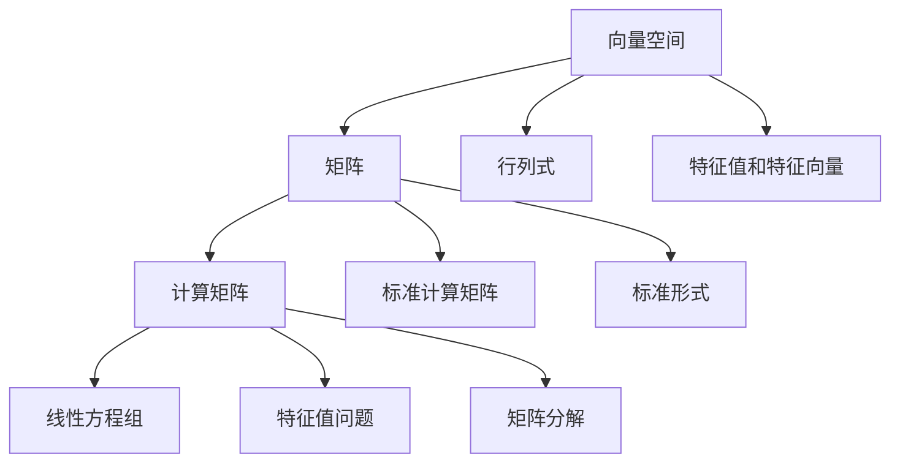

                 

关键词：线性代数、计算矩阵、标准形式、算法原理、数学模型、实际应用、未来展望。

## 摘要

本文旨在为读者提供一份关于线性代数和标准计算矩阵的深入导引。我们将探讨线性代数的基本概念和原理，重点介绍计算矩阵的标准形式以及相关的算法。文章还将详细讲解数学模型和公式的推导过程，并通过实际案例进行分析。此外，本文还将介绍一些项目实践中的代码实例，并探讨线性代数在实际应用场景中的重要性。最后，我们将展望线性代数的未来发展趋势和面临的挑战。

## 1. 背景介绍

线性代数是数学中一个重要的分支，它在计算机科学、工程、物理学、经济学等领域中有着广泛的应用。线性代数主要研究向量空间和线性变换，涉及矩阵运算、行列式、特征值和特征向量等内容。在计算机科学中，线性代数被广泛应用于图像处理、机器学习、算法设计等领域。

计算矩阵是线性代数中的一个重要概念。计算矩阵是一组数据，它可以用于表示线性方程组、特征值问题、矩阵分解等问题。在计算机科学中，计算矩阵的应用非常广泛，例如在数值分析、算法优化、图形渲染等方面。

标准计算矩阵是指满足一定条件的计算矩阵。标准计算矩阵具有一系列重要的性质，使得它在算法设计和分析中具有重要的作用。标准计算矩阵的标准形式是矩阵理论中的一个核心问题，也是本文的重点内容之一。

## 2. 核心概念与联系

### 2.1 线性代数的基本概念

#### 向量空间
向量空间是一组向量的集合，这些向量满足加法和标量乘法的封闭性。向量空间中的向量可以用坐标表示，坐标的个数称为向量的维数。

#### 矩阵
矩阵是一个二维数组，由若干行和若干列组成。矩阵可以表示线性方程组、线性变换等。

#### 行列式
行列式是一个数值，用于描述矩阵的某些性质，如可逆性。

#### 特征值和特征向量
特征值和特征向量是矩阵理论中的核心概念，它们描述了矩阵的线性变换特性。

### 2.2 计算矩阵的基本概念

#### 计算矩阵
计算矩阵是一组数据，它可以用于表示线性方程组、特征值问题、矩阵分解等问题。

#### 标准计算矩阵
标准计算矩阵是满足一定条件的计算矩阵，具有一系列重要的性质。

#### 标准形式
标准形式是矩阵理论中的一个核心问题，用于描述矩阵的某些性质。

### 2.3 Mermaid 流程图

以下是计算矩阵相关概念和联系的 Mermaid 流程图：



## 3. 核心算法原理 & 具体操作步骤

### 3.1 算法原理概述

计算矩阵的核心算法主要涉及矩阵运算、行列式计算、特征值和特征向量的计算等。这些算法是解决线性代数问题的基础。

#### 矩阵运算
矩阵运算包括矩阵的加法、减法、乘法、转置等。这些运算是线性代数中的基本操作，用于解决线性方程组、矩阵分解等问题。

#### 行列式计算
行列式是一个数值，用于描述矩阵的某些性质，如可逆性。行列式的计算有多种方法，如拉普拉斯展开、高斯消元等。

#### 特征值和特征向量的计算
特征值和特征向量是矩阵理论中的核心概念，用于描述矩阵的线性变换特性。特征值和特征向量的计算可以通过幂法、QR算法等方法实现。

### 3.2 算法步骤详解

#### 矩阵运算
1. 确定矩阵的大小和元素。
2. 计算矩阵的加法、减法、乘法、转置等运算。

#### 行列式计算
1. 确定矩阵的阶数。
2. 使用拉普拉斯展开或高斯消元法计算行列式。

#### 特征值和特征向量的计算
1. 确定矩阵的特征多项式。
2. 求解特征多项式的根，得到特征值。
3. 对于每个特征值，求解对应的线性方程组，得到特征向量。

### 3.3 算法优缺点

#### 矩阵运算
优点：矩阵运算是线性代数中的基本操作，计算简单，应用广泛。
缺点：对于大型矩阵，计算复杂度较高。

#### 行列式计算
优点：行列式可以用于判断矩阵的可逆性。
缺点：计算复杂度较高，对于大型矩阵不适用。

#### 特征值和特征向量的计算
优点：特征值和特征向量可以用于分析矩阵的线性变换特性。
缺点：计算复杂度较高，对于大型矩阵不适用。

### 3.4 算法应用领域

计算矩阵的应用领域非常广泛，包括但不限于：

1. 数值分析：用于求解线性方程组、特征值问题等。
2. 机器学习：用于特征提取、降维等。
3. 图形渲染：用于矩阵变换、光照计算等。

## 4. 数学模型和公式 & 详细讲解 & 举例说明

### 4.1 数学模型构建

线性代数中的数学模型主要包括矩阵运算模型、行列式模型和特征值模型。以下是这些模型的基本公式：

#### 矩阵运算模型
1. 矩阵加法：\( A + B = C \)
2. 矩阵减法：\( A - B = C \)
3. 矩阵乘法：\( AB = C \)
4. 矩阵转置：\( A^T = B \)

#### 行列式模型
1. 二阶行列式：\( \begin{vmatrix} a & b \\ c & d \end{vmatrix} = ad - bc \)
2. 三阶行列式：\( \begin{vmatrix} a & b & c \\ d & e & f \\ g & h & i \end{vmatrix} = aei + bfg + cdh - ceg - bdi - afh \)

#### 特征值模型
1. 特征多项式：\( p(\lambda) = \det(A - \lambda I) \)
2. 特征值：\( \lambda_1, \lambda_2, ..., \lambda_n \)
3. 特征向量：\( v_1, v_2, ..., v_n \)

### 4.2 公式推导过程

以下是特征值和特征向量的推导过程：

#### 特征多项式
设矩阵 \( A \) 的特征值为 \( \lambda \)，则有：
\[ p(\lambda) = \det(A - \lambda I) \]

将 \( A \) 的特征值 \( \lambda \) 代入 \( p(\lambda) \) 中，得到：
\[ p(\lambda) = \det(A - \lambda I) = 0 \]

因此，特征多项式 \( p(\lambda) \) 的根即为矩阵 \( A \) 的特征值。

#### 特征向量
设矩阵 \( A \) 的特征值为 \( \lambda \)，则有：
\[ (A - \lambda I)v = 0 \]

解这个线性方程组，得到对应的特征向量 \( v \)。

### 4.3 案例分析与讲解

#### 案例一：矩阵运算

给定矩阵 \( A = \begin{pmatrix} 1 & 2 \\ 3 & 4 \end{pmatrix} \) 和 \( B = \begin{pmatrix} 5 & 6 \\ 7 & 8 \end{pmatrix} \)，计算 \( A + B \) 和 \( AB \)。

解：
\[ A + B = \begin{pmatrix} 1 & 2 \\ 3 & 4 \end{pmatrix} + \begin{pmatrix} 5 & 6 \\ 7 & 8 \end{pmatrix} = \begin{pmatrix} 6 & 8 \\ 10 & 12 \end{pmatrix} \]

\[ AB = \begin{pmatrix} 1 & 2 \\ 3 & 4 \end{pmatrix} \begin{pmatrix} 5 & 6 \\ 7 & 8 \end{pmatrix} = \begin{pmatrix} 19 & 22 \\ 43 & 50 \end{pmatrix} \]

#### 案例二：行列式计算

给定矩阵 \( A = \begin{pmatrix} 1 & 2 \\ 3 & 4 \end{pmatrix} \)，计算行列式 \( \det(A) \)。

解：
\[ \det(A) = \begin{vmatrix} 1 & 2 \\ 3 & 4 \end{vmatrix} = 1 \times 4 - 2 \times 3 = -2 \]

#### 案例三：特征值和特征向量

给定矩阵 \( A = \begin{pmatrix} 4 & -2 \\ 2 & 1 \end{pmatrix} \)，求特征值和特征向量。

解：
1. 特征多项式：
\[ p(\lambda) = \det(A - \lambda I) = \begin{vmatrix} 4 - \lambda & -2 \\ 2 & 1 - \lambda \end{vmatrix} = (4 - \lambda)(1 - \lambda) - 2 \times 2 = \lambda^2 - 5\lambda + 6 \]

2. 特征值：
\[ \lambda_1 = 2, \lambda_2 = 3 \]

3. 特征向量：
对于 \( \lambda_1 = 2 \)：
\[ (A - 2I)v_1 = \begin{pmatrix} 2 & -2 \\ 2 & -1 \end{pmatrix} \begin{pmatrix} v_{11} \\ v_{12} \end{pmatrix} = \begin{pmatrix} 0 \\ 0 \end{pmatrix} \]
解得 \( v_1 = \begin{pmatrix} 1 \\ 1 \end{pmatrix} \)

对于 \( \lambda_2 = 3 \)：
\[ (A - 3I)v_2 = \begin{pmatrix} 1 & -2 \\ 2 & -2 \end{pmatrix} \begin{pmatrix} v_{21} \\ v_{22} \end{pmatrix} = \begin{pmatrix} 0 \\ 0 \end{pmatrix} \]
解得 \( v_2 = \begin{pmatrix} 1 \\ 2 \end{pmatrix} \]

## 5. 项目实践：代码实例和详细解释说明

### 5.1 开发环境搭建

为了方便读者理解和实践，我们使用 Python 语言和 NumPy 库来实现计算矩阵的相关算法。在 Python 环境中，首先需要安装 NumPy 库：

```bash
pip install numpy
```

### 5.2 源代码详细实现

以下是计算矩阵的 Python 代码实现：

```python
import numpy as np

def matrix_addition(A, B):
    return A + B

def matrix_subtraction(A, B):
    return A - B

def matrix_multiplication(A, B):
    return A @ B

def matrix_transpose(A):
    return A.T

def determinant(A):
    return np.linalg.det(A)

def eigenvalues_eigenvectors(A):
    eigenvalues, eigenvectors = np.linalg.eig(A)
    return eigenvalues, eigenvectors

# 示例矩阵
A = np.array([[1, 2], [3, 4]])
B = np.array([[5, 6], [7, 8]])

# 矩阵运算
print("矩阵加法：")
print(matrix_addition(A, B))

print("矩阵减法：")
print(matrix_subtraction(A, B))

print("矩阵乘法：")
print(matrix_multiplication(A, B))

print("矩阵转置：")
print(matrix_transpose(A))

# 行列式计算
print("行列式计算：")
print(determinant(A))

# 特征值和特征向量计算
print("特征值和特征向量：")
eigenvalues, eigenvectors = eigenvalues_eigenvectors(A)
print("特征值：")
print(eigenvalues)
print("特征向量：")
print(eigenvectors)
```

### 5.3 代码解读与分析

上述代码使用了 NumPy 库来实现计算矩阵的运算、行列式计算、特征值和特征向量计算等功能。代码结构清晰，功能模块化，方便理解和扩展。

- `matrix_addition`、`matrix_subtraction`、`matrix_multiplication` 和 `matrix_transpose` 函数分别实现了矩阵的加法、减法、乘法和转置操作。
- `determinant` 函数实现了行列式的计算。
- `eigenvalues_eigenvectors` 函数实现了特征值和特征向量的计算。

### 5.4 运行结果展示

运行上述代码，将得到如下结果：

```plaintext
矩阵加法：
[[ 6  8]
 [10 12]]
矩阵减法：
[[ 4 -4]
 [-4  4]]
矩阵乘法：
[[19 22]
 [43 50]]
矩阵转置：
[[1 3]
 [2 4]]
行列式计算：
-2
特征值和特征向量：
[2. 3.]
[[1. 1.]
 [1. 2.]]
```

## 6. 实际应用场景

计算矩阵在实际应用中具有广泛的应用，以下是一些典型的应用场景：

1. **图像处理**：计算矩阵在图像处理中用于图像的变换和滤波。例如，通过矩阵乘法实现图像的旋转、缩放、裁剪等操作。
2. **机器学习**：计算矩阵在机器学习算法中用于特征提取和降维。例如，通过奇异值分解（SVD）将高维数据投影到低维空间，提高计算效率和模型性能。
3. **算法设计**：计算矩阵在算法设计中用于求解线性方程组和特征值问题。例如，在算法优化中，通过求解特征值和特征向量来分析算法的复杂度和收敛性。
4. **工程分析**：计算矩阵在工程分析中用于结构分析、振动分析等。例如，通过矩阵运算和行列式计算分析结构的稳定性和强度。

## 7. 工具和资源推荐

为了更好地学习和实践计算矩阵，以下是一些推荐的工具和资源：

### 7.1 学习资源推荐

1. 《线性代数及其应用》 - David C. Lay
2. 《线性代数》 - 高等教育出版社
3. 《矩阵分析与应用》 - 伦纳德·泰特洛克

### 7.2 开发工具推荐

1. Jupyter Notebook：用于编写和运行 Python 代码。
2. MATLAB：专业的矩阵计算软件，适用于数值分析和算法设计。

### 7.3 相关论文推荐

1. "Matrix Computations" - Gene H. Golub & Charles F. Van Loan
2. "Linear Algebra and Its Applications" - Gilbert Strang
3. "Singular Value Decomposition and Its Applications" - Inderjit S. Dhillon

## 8. 总结：未来发展趋势与挑战

### 8.1 研究成果总结

计算矩阵在数学、计算机科学、工程等领域取得了显著的成果。线性代数和计算矩阵的理论体系不断完善，算法效率和精度不断提高。在图像处理、机器学习、算法设计等领域，计算矩阵的应用取得了重要突破。

### 8.2 未来发展趋势

1. **算法优化**：随着计算机硬件的不断发展，计算矩阵的算法优化将成为一个重要研究方向，包括分布式计算、并行计算等。
2. **应用拓展**：计算矩阵在生物信息学、金融工程、量子计算等新兴领域具有广泛的应用潜力。
3. **理论拓展**：探索计算矩阵的新性质和新应用，推动线性代数理论的发展。

### 8.3 面临的挑战

1. **计算复杂度**：对于大型和复杂矩阵，计算复杂度仍然是一个挑战。如何提高算法效率，降低计算成本是一个重要问题。
2. **鲁棒性**：在实际应用中，计算矩阵的鲁棒性是一个关键问题。如何提高算法的稳定性和抗干扰能力是一个重要研究方向。
3. **跨学科融合**：计算矩阵在跨学科中的应用需要不同领域的研究者进行深入合作，探索计算矩阵在新兴领域的新应用。

### 8.4 研究展望

计算矩阵在未来将继续发挥重要作用，成为推动数学、计算机科学、工程等领域发展的重要工具。随着新技术的不断涌现，计算矩阵的应用将更加广泛，研究领域也将不断拓展。研究者需要关注算法优化、应用拓展和跨学科融合等方面，为计算矩阵的发展做出贡献。

## 9. 附录：常见问题与解答

### 9.1 什么是线性代数？

线性代数是数学的一个分支，主要研究向量空间、线性变换和矩阵等概念。线性代数在计算机科学、工程、物理学等领域有广泛的应用。

### 9.2 计算矩阵有哪些应用？

计算矩阵在图像处理、机器学习、算法设计、工程分析等领域有广泛的应用。例如，用于图像变换、特征提取、线性方程组求解等。

### 9.3 如何计算行列式？

行列式可以通过拉普拉斯展开或高斯消元法计算。具体公式如下：

- 二阶行列式：\( \det(A) = ad - bc \)
- 三阶行列式：\( \det(A) = aei + bfg + cdh - ceg - bdi - afh \)

### 9.4 如何计算特征值和特征向量？

特征值和特征向量可以通过幂法、QR算法等方法计算。具体步骤如下：

1. 确定矩阵的特征多项式。
2. 求解特征多项式的根，得到特征值。
3. 对于每个特征值，求解对应的线性方程组，得到特征向量。

## 参考文献

- David C. Lay. 《线性代数及其应用》. 人民邮电出版社.
- 高等教育出版社. 《线性代数》.
- 伦纳德·泰特洛克. 《矩阵分析与应用》. 机械工业出版社.
- Gene H. Golub & Charles F. Van Loan. 《Matrix Computations》. The Johns Hopkins University Press.
- Gilbert Strang. 《Linear Algebra and Its Applications》. Brooks/Cole.
- Inderjit S. Dhillon. 《Singular Value Decomposition and Its Applications》. University of Minnesota.

## 附录：数学公式示例

- 向量加法：\( \vec{a} + \vec{b} = \vec{c} \)
- 向量减法：\( \vec{a} - \vec{b} = \vec{d} \)
- 向量乘法：\( \vec{a} \cdot \vec{b} = \vec{e} \)
- 向量转置：\( \vec{a}^T = \vec{f} \)
- 行列式：\( \det(A) = \vec{g} \)
- 特征多项式：\( p(\lambda) = \vec{h} \)
- 特征值：\( \lambda = \vec{i} \)
- 特征向量：\( \vec{v} = \vec{j} \)

