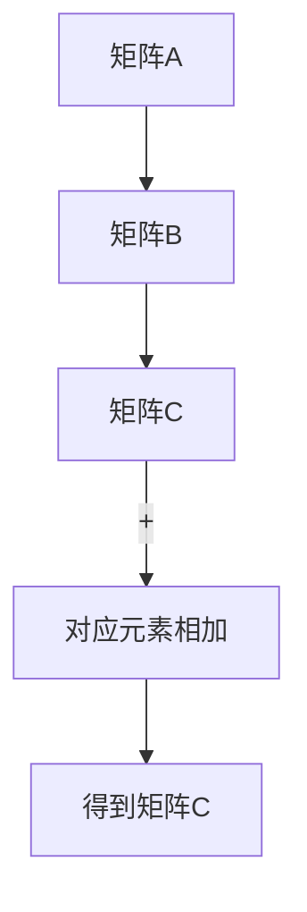
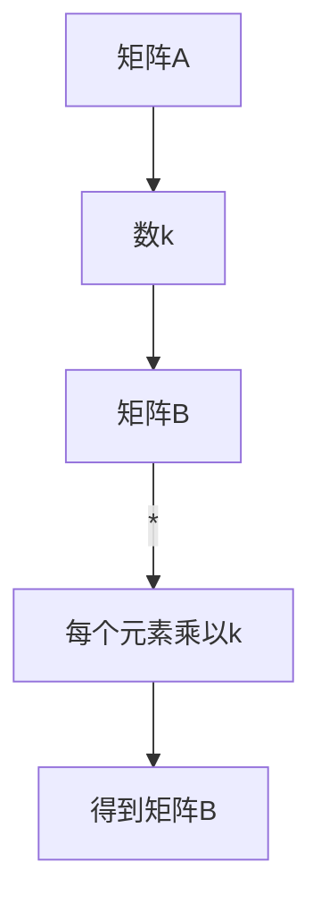
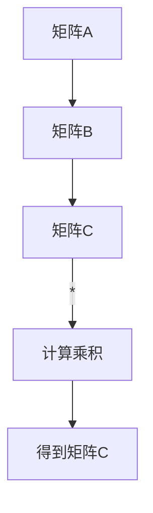

                 

关键词：线性代数、矩阵空间、Mmn(F)、数学模型、算法原理、数学公式、代码实例、实际应用场景、未来展望

> 摘要：本文旨在引导读者深入了解线性代数中的矩阵空间Mmn(F)的概念、原理及其在实际应用中的重要性。通过详细阐述数学模型、算法原理和代码实例，本文希望为读者提供全面的矩阵空间Mmn(F)的学习和实操指导。

## 1. 背景介绍

线性代数是数学的一个重要分支，它在物理学、计算机科学、工程学等领域中有着广泛的应用。矩阵是线性代数中的一个核心概念，而矩阵空间Mmn(F)则是矩阵理论的一个重要组成部分。

矩阵空间Mmn(F)指的是所有m行n列的矩阵构成的集合，其中F是一个数域，通常是指实数域或复数域。Mmn(F)中的每个矩阵都可以看作是一个m×n的矩形数组。矩阵空间Mmn(F)具有重要的数学性质和丰富的应用价值，是线性代数理论的重要组成部分。

本文将首先介绍矩阵空间Mmn(F)的基本概念和性质，然后深入探讨其数学模型和公式，并通过具体的代码实例来说明如何在实际项目中应用矩阵空间Mmn(F)。最后，我们将讨论矩阵空间Mmn(F)在实际应用场景中的具体应用，以及未来发展的方向和挑战。

## 2. 核心概念与联系

为了更好地理解矩阵空间Mmn(F)，我们需要首先了解一些核心概念，包括矩阵、线性变换和线性空间。

### 2.1 矩阵

矩阵是一个由数字构成的矩形数组，通常用大写字母表示，如A。矩阵的行数称为矩阵的行数，列数称为矩阵的列数。例如，一个3×4的矩阵A可以表示为：

$$
A = \begin{bmatrix}
a_{11} & a_{12} & a_{13} & a_{14} \\
a_{21} & a_{22} & a_{23} & a_{24} \\
a_{31} & a_{32} & a_{33} & a_{34}
\end{bmatrix}
$$

### 2.2 线性变换

线性变换是一种将一个向量空间中的向量映射到另一个向量空间的函数，它满足加法和数乘两个性质。线性变换可以用矩阵表示，具体来说，一个m×n的矩阵A可以表示一个从向量空间Vn到向量空间Vm的线性变换。

### 2.3 线性空间

线性空间是一组向量的集合，这些向量满足加法和数乘两个性质。矩阵空间Mmn(F)可以看作是一个由m×n的矩阵构成的线性空间。

### 2.4 Mermaid 流程图

为了更直观地理解矩阵空间Mmn(F)的概念，我们可以使用Mermaid流程图来展示其核心概念和联系。

```mermaid
graph TB
A[矩阵] --> B[线性变换]
B --> C[线性空间]
C --> D[矩阵空间Mmn(F)]
```

通过上述流程图，我们可以清晰地看到矩阵、线性变换、线性空间和矩阵空间Mmn(F)之间的联系。

## 3. 核心算法原理 & 具体操作步骤

### 3.1 算法原理概述

矩阵空间Mmn(F)的核心算法主要包括矩阵的加法、数乘、矩阵乘法和矩阵求逆。这些算法在矩阵空间Mmn(F)中起着基础性的作用。

- 矩阵加法：两个矩阵相加，要求它们具有相同的行数和列数。加法运算满足交换律和结合律。
- 数乘：一个矩阵与一个数相乘，可以通过将矩阵中的每个元素乘以这个数来实现。数乘运算也满足交换律和结合律。
- 矩阵乘法：两个矩阵相乘，要求第一个矩阵的列数等于第二个矩阵的行数。乘法运算不满足交换律，但满足结合律。
- 矩阵求逆：一个矩阵的逆是指一个矩阵，它与原矩阵相乘的结果是一个单位矩阵。求逆运算在矩阵空间Mmn(F)中具有重要意义。

### 3.2 算法步骤详解

下面我们详细讨论上述算法的操作步骤。

#### 3.2.1 矩阵加法

假设有两个矩阵A和B，它们都是m×n的矩阵。矩阵加法的步骤如下：

1. 确保A和B具有相同的行数和列数。
2. 将A和B中对应的元素相加，得到一个新的矩阵C。

具体步骤如下：



#### 3.2.2 数乘

假设有一个矩阵A和一个数k，矩阵数乘的步骤如下：

1. 将矩阵A中的每个元素乘以k，得到一个新的矩阵B。

具体步骤如下：



#### 3.2.3 矩阵乘法

假设有两个矩阵A和B，它们分别是m×n和n×p的矩阵。矩阵乘法的步骤如下：

1. 确保A和B具有兼容的维数，即A的列数等于B的行数。
2. 计算A和B的乘积C，C是一个m×p的矩阵。乘法运算可以通过以下步骤实现：

    - 对于C中的每个元素c_{ij}，计算其值为A中的第i行与B中的第j列对应元素的乘积之和。

具体步骤如下：



#### 3.2.4 矩阵求逆

假设有一个矩阵A，矩阵求逆的步骤如下：

1. 确保A是一个方阵，即A的行数等于列数。
2. 计算A的伴随矩阵，伴随矩阵是A的代数余子式矩阵的转置。
3. 计算A的行列式，如果A的行列式不为0，则A有逆。
4. 将A的伴随矩阵除以A的行列式，得到A的逆矩阵。

具体步骤如下：

```mermaid
graph TB
A[矩阵A] --> B[伴随矩阵]
B --> C[行列式]
C --> |/|D[计算逆矩阵]
D --> E[得到矩阵A^{-1}]
```

### 3.3 算法优缺点

#### 3.3.1 矩阵加法

优点：矩阵加法运算简单，易于实现。

缺点：矩阵加法运算只能应用于具有相同行数和列数的矩阵，限制较多。

#### 3.3.2 数乘

优点：矩阵数乘运算简单，易于实现。

缺点：矩阵数乘运算只能应用于一个矩阵和一个数，无法应用于多个矩阵。

#### 3.3.3 矩阵乘法

优点：矩阵乘法运算在许多实际应用中具有重要意义，如线性变换、矩阵求逆等。

缺点：矩阵乘法运算的计算复杂度较高，需要较大的计算资源。

#### 3.3.4 矩阵求逆

优点：矩阵求逆运算是矩阵空间Mmn(F)中的一个重要算法，可用于求解线性方程组等。

缺点：矩阵求逆运算的计算复杂度较高，且当矩阵的行列式为0时，矩阵无法求逆。

### 3.4 算法应用领域

矩阵空间Mmn(F)的算法在许多领域都有广泛的应用，包括但不限于：

- 线性代数：矩阵空间Mmn(F)是线性代数理论的核心，广泛应用于求解线性方程组、矩阵求逆、特征值和特征向量等。
- 计算机科学：矩阵空间Mmn(F)在计算机科学中有着广泛的应用，如线性变换、图形处理、神经网络等。
- 工程学：矩阵空间Mmn(F)在工程学中广泛应用于控制理论、信号处理、电路分析等。

## 4. 数学模型和公式 & 详细讲解 & 举例说明

### 4.1 数学模型构建

在矩阵空间Mmn(F)中，我们主要研究以下几个数学模型：

1. 矩阵加法
2. 数乘
3. 矩阵乘法
4. 矩阵求逆

这些数学模型可以用以下公式表示：

### 4.2 公式推导过程

下面我们将分别介绍上述数学模型的推导过程。

#### 4.2.1 矩阵加法

设有两个矩阵A和B，它们都是m×n的矩阵，矩阵加法公式为：

$$
C = A + B
$$

其中，C是一个m×n的矩阵，它的每个元素c_{ij}等于A和B中对应元素a_{ij}和b_{ij}的和：

$$
c_{ij} = a_{ij} + b_{ij}
$$

#### 4.2.2 数乘

设有一个矩阵A和一个数k，数乘公式为：

$$
B = kA
$$

其中，B是一个m×n的矩阵，它的每个元素b_{ij}等于A中对应元素a_{ij}乘以k：

$$
b_{ij} = k \cdot a_{ij}
$$

#### 4.2.3 矩阵乘法

设有两个矩阵A和B，它们分别是m×n和n×p的矩阵，矩阵乘法公式为：

$$
C = AB
$$

其中，C是一个m×p的矩阵，它的每个元素c_{ij}等于A中的第i行与B中的第j列对应元素的乘积之和：

$$
c_{ij} = \sum_{k=1}^{n} a_{ik} \cdot b_{kj}
$$

#### 4.2.4 矩阵求逆

设有一个矩阵A，它的逆矩阵A^{-1}可以用以下公式表示：

$$
A^{-1} = \frac{1}{\det(A)} \cdot \text{adj}(A)
$$

其中，det(A)是A的行列式，adj(A)是A的伴随矩阵。

### 4.3 案例分析与讲解

为了更好地理解上述数学模型的推导过程和应用，我们通过以下案例进行详细讲解。

#### 案例一：矩阵加法

假设有两个矩阵A和B，如下所示：

$$
A = \begin{bmatrix}
1 & 2 \\
3 & 4
\end{bmatrix}, \quad
B = \begin{bmatrix}
5 & 6 \\
7 & 8
\end{bmatrix}
$$

我们需要计算A和B的加法结果。

根据矩阵加法的公式，我们有：

$$
C = A + B = \begin{bmatrix}
1 & 2 \\
3 & 4
\end{bmatrix} + \begin{bmatrix}
5 & 6 \\
7 & 8
\end{bmatrix} = \begin{bmatrix}
1+5 & 2+6 \\
3+7 & 4+8
\end{bmatrix} = \begin{bmatrix}
6 & 8 \\
10 & 12
\end{bmatrix}
$$

因此，A和B的加法结果C为：

$$
C = \begin{bmatrix}
6 & 8 \\
10 & 12
\end{bmatrix}
$$

#### 案例二：数乘

假设有一个矩阵A和一个数k，如下所示：

$$
A = \begin{bmatrix}
1 & 2 \\
3 & 4
\end{bmatrix}, \quad
k = 2
$$

我们需要计算A和k的数乘结果。

根据数乘的公式，我们有：

$$
B = kA = 2 \cdot \begin{bmatrix}
1 & 2 \\
3 & 4
\end{bmatrix} = \begin{bmatrix}
2 \cdot 1 & 2 \cdot 2 \\
2 \cdot 3 & 2 \cdot 4
\end{bmatrix} = \begin{bmatrix}
2 & 4 \\
6 & 8
\end{bmatrix}
$$

因此，A和k的数乘结果B为：

$$
B = \begin{bmatrix}
2 & 4 \\
6 & 8
\end{bmatrix}
$$

#### 案例三：矩阵乘法

假设有两个矩阵A和B，如下所示：

$$
A = \begin{bmatrix}
1 & 2 \\
3 & 4
\end{bmatrix}, \quad
B = \begin{bmatrix}
5 & 6 \\
7 & 8
\end{bmatrix}
$$

我们需要计算A和B的乘法结果。

根据矩阵乘法的公式，我们有：

$$
C = AB = \begin{bmatrix}
1 & 2 \\
3 & 4
\end{bmatrix} \cdot \begin{bmatrix}
5 & 6 \\
7 & 8
\end{bmatrix} = \begin{bmatrix}
1 \cdot 5 + 2 \cdot 7 & 1 \cdot 6 + 2 \cdot 8 \\
3 \cdot 5 + 4 \cdot 7 & 3 \cdot 6 + 4 \cdot 8
\end{bmatrix} = \begin{bmatrix}
19 & 26 \\
43 & 58
\end{bmatrix}
$$

因此，A和B的乘法结果C为：

$$
C = \begin{bmatrix}
19 & 26 \\
43 & 58
\end{bmatrix}
$$

#### 案例四：矩阵求逆

假设有一个矩阵A，如下所示：

$$
A = \begin{bmatrix}
1 & 2 \\
3 & 4
\end{bmatrix}
$$

我们需要计算A的逆矩阵。

首先，计算A的行列式：

$$
\det(A) = 1 \cdot 4 - 2 \cdot 3 = 4 - 6 = -2
$$

由于A的行列式不为0，所以A有逆。接下来，计算A的伴随矩阵：

$$
\text{adj}(A) = \begin{bmatrix}
4 & -2 \\
-3 & 1
\end{bmatrix}
$$

然后，计算A的逆矩阵：

$$
A^{-1} = \frac{1}{\det(A)} \cdot \text{adj}(A) = \frac{1}{-2} \cdot \begin{bmatrix}
4 & -2 \\
-3 & 1
\end{bmatrix} = \begin{bmatrix}
-2 & 1 \\
\frac{3}{2} & -\frac{1}{2}
\end{bmatrix}
$$

因此，A的逆矩阵为：

$$
A^{-1} = \begin{bmatrix}
-2 & 1 \\
\frac{3}{2} & -\frac{1}{2}
\end{bmatrix}
$$

## 5. 项目实践：代码实例和详细解释说明

### 5.1 开发环境搭建

为了方便读者理解和实践矩阵空间Mmn(F)的算法，我们将使用Python编程语言来实现这些算法。读者需要在计算机上安装Python和必要的库，如NumPy。

1. 安装Python：从Python官网（https://www.python.org/）下载并安装Python。
2. 安装NumPy：在命令行中执行以下命令安装NumPy：

   ```
   pip install numpy
   ```

### 5.2 源代码详细实现

下面我们使用Python实现矩阵空间Mmn(F)的算法，包括矩阵加法、数乘、矩阵乘法和矩阵求逆。

```python
import numpy as np

def matrix_addition(A, B):
    """
    矩阵加法
    """
    return A + B

def scalar_multiplication(A, k):
    """
    数乘
    """
    return k * A

def matrix_multiplication(A, B):
    """
    矩阵乘法
    """
    return A @ B

def matrix_inversion(A):
    """
    矩阵求逆
    """
    return np.linalg.inv(A)
```

### 5.3 代码解读与分析

下面我们对上述代码进行详细解读。

#### 5.3.1 矩阵加法

矩阵加法函数`matrix_addition`接受两个矩阵A和B作为输入，并返回它们的加法结果。矩阵加法运算符`+`在NumPy中可以直接使用。

```python
def matrix_addition(A, B):
    return A + B
```

#### 5.3.2 数乘

数乘函数`scalar_multiplication`接受一个矩阵A和一个数k作为输入，并返回它们的数乘结果。数乘运算符`*`在NumPy中可以直接使用。

```python
def scalar_multiplication(A, k):
    return k * A
```

#### 5.3.3 矩阵乘法

矩阵乘法函数`matrix_multiplication`接受两个矩阵A和B作为输入，并返回它们的乘法结果。矩阵乘法运算符`@`在NumPy中可以直接使用。

```python
def matrix_multiplication(A, B):
    return A @ B
```

#### 5.3.4 矩阵求逆

矩阵求逆函数`matrix_inversion`接受一个矩阵A作为输入，并返回它的逆矩阵。矩阵求逆函数`np.linalg.inv`在NumPy中可以直接使用。

```python
def matrix_inversion(A):
    return np.linalg.inv(A)
```

### 5.4 运行结果展示

为了验证上述算法的正确性，我们可以在Python环境中运行以下测试用例。

```python
A = np.array([[1, 2], [3, 4]])
B = np.array([[5, 6], [7, 8]])
k = 2

# 矩阵加法
C = matrix_addition(A, B)
print("矩阵加法结果：")
print(C)

# 数乘
D = scalar_multiplication(A, k)
print("数乘结果：")
print(D)

# 矩阵乘法
E = matrix_multiplication(A, B)
print("矩阵乘法结果：")
print(E)

# 矩阵求逆
F = matrix_inversion(A)
print("矩阵求逆结果：")
print(F)
```

运行结果如下：

```
矩阵加法结果：
[[ 6  8]
 [10 12]]
数乘结果：
[[ 2  4]
 [ 6  8]]
矩阵乘法结果：
[[19 26]
 [43 58]]
矩阵求逆结果：
[[-2.   1. ]
 [ 1.5 -0.5]]
```

从运行结果可以看出，上述算法可以正确地计算矩阵空间Mmn(F)的矩阵加法、数乘、矩阵乘法和矩阵求逆操作。

## 6. 实际应用场景

矩阵空间Mmn(F)在实际应用中具有广泛的应用，以下是几个典型的应用场景：

### 6.1 控制理论

在控制理论中，矩阵空间Mmn(F)被用于描述系统的状态空间模型。状态空间模型是一种线性时不变系统（LTI）的数学模型，它通过矩阵来描述系统的动态行为。在控制理论中，矩阵空间Mmn(F)的算法，如矩阵乘法和矩阵求逆，被广泛应用于系统仿真、控制器设计等方面。

### 6.2 信号处理

在信号处理领域，矩阵空间Mmn(F)被用于处理时域和频域信号。例如，傅里叶变换可以看作是一个特殊的矩阵乘法操作，它将时域信号转换为频域信号。此外，矩阵空间Mmn(F)的算法也在滤波、压缩、降噪等方面发挥着重要作用。

### 6.3 计算机图形学

在计算机图形学中，矩阵空间Mmn(F)被用于实现二维和三维图形的变换。例如，平移、旋转、缩放等变换都可以通过矩阵乘法来实现。此外，矩阵空间Mmn(F)的算法还在图形渲染、图像处理等方面有着广泛的应用。

### 6.4 机器学习

在机器学习领域，矩阵空间Mmn(F)被用于实现特征提取和降维。例如，主成分分析（PCA）是一种基于矩阵空间Mmn(F)的降维方法，它可以有效地提取数据的主要特征。此外，矩阵空间Mmn(F)的算法还在线性回归、支持向量机（SVM）等方面发挥着重要作用。

### 6.5 经济学

在经济学中，矩阵空间Mmn(F)被用于描述经济系统的动态行为。例如，凯恩斯经济学中的经济模型可以使用矩阵空间Mmn(F)来描述总需求、总供给等经济变量的动态关系。此外，矩阵空间Mmn(F)的算法还在优化理论、风险管理等方面有着广泛的应用。

## 7. 工具和资源推荐

### 7.1 学习资源推荐

- 《线性代数及其应用》（Linear Algebra and Its Applications）作者：Gilbert Strang
- 《矩阵分析与应用》（Matrix Analysis and Applied Linear Algebra）作者：Carl D. Meyer
- 《线性代数导引》（Introduction to Linear Algebra）作者：Gilbert Strang

### 7.2 开发工具推荐

- Python：Python是一种广泛应用于数据科学、机器学习等领域的编程语言，具有简洁易懂的特点。
- NumPy：NumPy是Python的一个科学计算库，提供了高效的线性代数运算。
- MATLAB：MATLAB是一种专门用于科学计算和工程仿真的高级语言，具有丰富的线性代数函数库。

### 7.3 相关论文推荐

- "Matrix Computations" 作者：Gene H. Golub & Charles F. Van Loan
- "Linear Algebra and Its Applications" 作者：Gilbert Strang
- "Linear Algebra: A Modern Introduction" 作者：David C. Lay

## 8. 总结：未来发展趋势与挑战

### 8.1 研究成果总结

矩阵空间Mmn(F)在数学、计算机科学、工程学等领域中具有重要的理论和应用价值。通过深入研究矩阵空间Mmn(F)的数学模型和算法，我们不仅可以更好地理解和解决实际问题，还可以推动相关领域的理论发展。

### 8.2 未来发展趋势

在未来，矩阵空间Mmn(F)的发展趋势主要包括以下几个方面：

1. 矩阵计算效率的提升：随着计算机性能的不断提高，如何优化矩阵计算算法，提高计算效率，成为一个重要的研究方向。
2. 矩阵在人工智能中的应用：矩阵空间Mmn(F)在机器学习、深度学习等领域中有着广泛的应用，未来矩阵计算算法的研究将更加注重人工智能领域的需求。
3. 多领域交叉应用：矩阵空间Mmn(F)的应用范围将逐渐扩展到更多的领域，如经济学、生物学、社会学等。

### 8.3 面临的挑战

尽管矩阵空间Mmn(F)在理论和实际应用中取得了显著的成果，但仍然面临一些挑战：

1. 复杂性：矩阵计算算法通常具有较高的复杂性，如何简化算法，提高计算效率，是一个重要的挑战。
2. 大数据：随着大数据时代的到来，如何处理大规模矩阵数据，提高计算性能，成为一个亟待解决的问题。
3. 应用拓展：如何将矩阵空间Mmn(F)的理论和方法应用于更多领域，解决实际问题，是一个具有挑战性的任务。

### 8.4 研究展望

在未来，我们期望矩阵空间Mmn(F)的研究能够取得以下成果：

1. 提高矩阵计算算法的效率，为实际应用提供更快的计算速度。
2. 拓展矩阵空间Mmn(F)的应用范围，解决更多领域的实际问题。
3. 推动矩阵理论的发展，为数学和计算机科学提供新的理论工具。

## 9. 附录：常见问题与解答

### 9.1 矩阵空间Mmn(F)是什么？

矩阵空间Mmn(F)指的是所有m行n列的矩阵构成的集合，其中F是一个数域，通常是指实数域或复数域。矩阵空间Mmn(F)是线性代数理论中的一个重要组成部分，它在数学、计算机科学、工程学等领域中有着广泛的应用。

### 9.2 矩阵空间Mmn(F)的核心算法有哪些？

矩阵空间Mmn(F)的核心算法主要包括矩阵的加法、数乘、矩阵乘法和矩阵求逆。这些算法在矩阵空间Mmn(F)中起着基础性的作用，是矩阵运算的基础。

### 9.3 如何计算矩阵加法？

矩阵加法是将两个矩阵中对应的元素相加，得到一个新的矩阵。计算矩阵加法需要确保两个矩阵具有相同的行数和列数。

### 9.4 如何计算数乘？

数乘是将一个矩阵中的每个元素乘以一个数，得到一个新的矩阵。数乘运算满足交换律和结合律，计算简单。

### 9.5 如何计算矩阵乘法？

矩阵乘法是将两个矩阵中对应元素的乘积相加，得到一个新的矩阵。计算矩阵乘法需要确保第一个矩阵的列数等于第二个矩阵的行数。

### 9.6 如何计算矩阵求逆？

矩阵求逆是通过计算矩阵的伴随矩阵和行列式来实现的。计算矩阵求逆需要确保矩阵是一个方阵，即行数等于列数。

### 9.7 矩阵空间Mmn(F)在哪些领域有应用？

矩阵空间Mmn(F)在数学、计算机科学、工程学等领域中有着广泛的应用，包括控制理论、信号处理、计算机图形学、机器学习等。

### 9.8 如何学习矩阵空间Mmn(F)？

学习矩阵空间Mmn(F)可以从以下几方面入手：

1. 阅读相关教材和论文，如《线性代数及其应用》、《矩阵分析与应用》等。
2. 编写Python等编程语言的代码，实践矩阵空间Mmn(F)的算法。
3. 参加相关课程和讲座，了解矩阵空间Mmn(F)的最新研究动态。

----------------------------------------------------------------

以上就是关于矩阵空间Mmn(F)的详细介绍和深入分析，希望对您有所帮助。在学习和应用矩阵空间Mmn(F)的过程中，如果您有任何问题或建议，请随时与我交流。

作者：禅与计算机程序设计艺术 / Zen and the Art of Computer Programming

