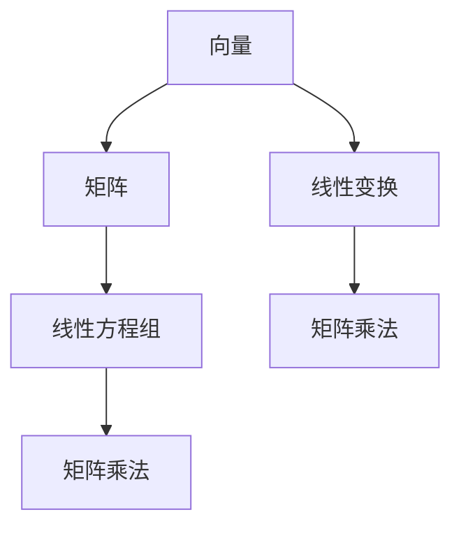

                 

关键词：线性代数、线性运算、矩阵、向量、线性变换、数学模型、算法原理、项目实践、应用领域

## 摘要

本文将深入探讨线性代数的基本概念及其在计算机科学中的重要性。我们将从线性代数的基本元素——向量与矩阵开始，逐步介绍线性运算的相关原理，包括线性变换、矩阵乘法等。此外，文章将详细讲解线性代数在计算机图形学、数据科学和机器学习等领域的应用，并展示实际项目中的代码实例。最后，我们将展望线性代数在未来的发展趋势与挑战。

## 1. 背景介绍

线性代数是数学的一个重要分支，主要研究向量空间、线性方程组和矩阵理论。它起源于19世纪，当时数学家们开始探讨如何用代数方法解决几何问题。线性代数不仅在纯数学中占据重要地位，而且在物理、工程、计算机科学等多个领域都有广泛应用。

在计算机科学中，线性代数的重要性不言而喻。首先，它为计算机图形学提供了基础。例如，三维模型的表现和渲染依赖于线性代数的矩阵变换。其次，在数据科学和机器学习中，线性代数用于特征提取、模型训练和优化等方面。例如，矩阵分解和奇异值分解在降维和数据压缩中发挥着关键作用。

## 2. 核心概念与联系

为了更好地理解线性代数的基本概念和它们之间的关系，我们可以借助Mermaid流程图来展示。



### 2.1 向量与矩阵

向量是线性代数中的基本对象，它可以表示为具有特定维度的数列。矩阵是一个二维数组，由一系列向量组成。矩阵和向量之间的关系可以通过矩阵乘法来描述。

### 2.2 线性方程组

线性方程组是描述多个线性方程之间的关系的一种方式。通过矩阵和向量的表示，我们可以方便地求解线性方程组。

### 2.3 线性变换

线性变换是将一个向量空间映射到另一个向量空间的一种操作。它可以由矩阵表示，并通过矩阵乘法实现。

### 2.4 矩阵乘法

矩阵乘法是线性代数中最基本的运算之一，它将两个矩阵组合成一个新矩阵。矩阵乘法的规则使得它在计算机科学中有着广泛的应用。

## 3. 核心算法原理 & 具体操作步骤

### 3.1 算法原理概述

线性运算的核心算法主要包括矩阵乘法、矩阵分解和线性方程组的求解。这些算法在计算机科学中有着广泛的应用。

### 3.2 算法步骤详解

#### 3.2.1 矩阵乘法

矩阵乘法的步骤如下：

1. 确定矩阵A的行数m和列数n，矩阵B的行数n和列数p。
2. 计算结果矩阵C的行数m和列数p。
3. 对每个元素C[i][j]，计算其值：C[i][j] = Σ(A[i][k] * B[k][j])，其中k从1到n。

#### 3.2.2 矩阵分解

矩阵分解是将矩阵表示为多个矩阵的乘积的过程。常见的矩阵分解方法包括LU分解、QR分解和奇异值分解等。

#### 3.2.3 线性方程组的求解

线性方程组的求解可以通过高斯消元法、迭代法等算法实现。高斯消元法的步骤如下：

1. 将线性方程组表示为增广矩阵。
2. 通过高斯消元，将增广矩阵转化为行最简形式。
3. 从行最简形式中解出变量。

### 3.3 算法优缺点

#### 3.3.1 矩阵乘法

优点：计算简单，易于实现。

缺点：时间复杂度为O(n^3)，在高维数据上效率较低。

#### 3.3.2 矩阵分解

优点：可以将复杂的矩阵运算转化为更简单的形式，提高计算效率。

缺点：可能引入数值稳定性问题。

#### 3.3.3 线性方程组的求解

优点：能够高效地求解大型线性方程组。

缺点：对于特殊类型的方程组，可能需要特殊的求解方法。

### 3.4 算法应用领域

线性运算在计算机科学中有广泛的应用，包括但不限于：

- 计算机图形学：矩阵乘法用于实现三维模型的变换和渲染。
- 数据科学：矩阵分解用于降维、数据压缩和特征提取。
- 机器学习：线性方程组的求解用于模型训练和优化。
- 信号处理：矩阵运算用于信号滤波和去噪。

## 4. 数学模型和公式

### 4.1 数学模型构建

线性代数的数学模型主要由向量、矩阵、线性变换和线性方程组构成。这些模型可以表示为以下形式：

- 向量：\( \vec{v} = (v_1, v_2, ..., v_n) \)
- 矩阵：\( A = \begin{bmatrix} a_{11} & a_{12} & ... & a_{1n} \\ a_{21} & a_{22} & ... & a_{2n} \\ ... & ... & ... & ... \\ a_{m1} & a_{m2} & ... & a_{mn} \end{bmatrix} \)
- 线性变换：\( T: \mathbb{R}^n \rightarrow \mathbb{R}^m \)，定义为\( T(\vec{x}) = A\vec{x} \)
- 线性方程组：\( Ax = b \)

### 4.2 公式推导过程

以下是一个简单的矩阵乘法公式推导过程：

给定矩阵A（\( m \times n \)）和B（\( n \times p \）），结果矩阵C（\( m \times p \））可以通过以下公式计算：

\[ C[i][j] = \sum_{k=1}^{n} A[i][k]B[k][j] \]

### 4.3 案例分析与讲解

#### 案例一：矩阵乘法

给定矩阵A和B如下：

\[ A = \begin{bmatrix} 1 & 2 \\ 3 & 4 \end{bmatrix}, B = \begin{bmatrix} 5 & 6 \\ 7 & 8 \end{bmatrix} \]

计算矩阵C = AB：

\[ C = \begin{bmatrix} 1*5 + 2*7 & 1*6 + 2*8 \\ 3*5 + 4*7 & 3*6 + 4*8 \end{bmatrix} = \begin{bmatrix} 19 & 26 \\ 43 & 58 \end{bmatrix} \]

#### 案例二：线性方程组的求解

给定线性方程组：

\[ \begin{cases} x + 2y = 5 \\ 3x + 4y = 11 \end{cases} \]

将其表示为增广矩阵：

\[ \begin{bmatrix} 1 & 2 & | & 5 \\ 3 & 4 & | & 11 \end{bmatrix} \]

通过高斯消元法求解：

1. 将第二行乘以-3并加到第一行，得到：

\[ \begin{bmatrix} 1 & 2 & | & 5 \\ 0 & -2 & | & -4 \end{bmatrix} \]

2. 将第二行乘以-1/2，得到：

\[ \begin{bmatrix} 1 & 2 & | & 5 \\ 0 & 1 & | & 2 \end{bmatrix} \]

3. 将第一行减去2倍的第二行，得到：

\[ \begin{bmatrix} 1 & 0 & | & 1 \\ 0 & 1 & | & 2 \end{bmatrix} \]

解得x=1，y=2。

## 5. 项目实践：代码实例和详细解释说明

### 5.1 开发环境搭建

在本项目中，我们将使用Python编程语言来实现线性代数的算法。首先，我们需要安装Python和相关库，如NumPy和SciPy。以下是安装命令：

```bash
pip install numpy scipy
```

### 5.2 源代码详细实现

以下是一个简单的线性代数算法实现的示例：

```python
import numpy as np

def matrix_multiply(A, B):
    m, n = A.shape
    p = B.shape[1]
    C = np.zeros((m, p))
    for i in range(m):
        for j in range(p):
            C[i][j] = np.dot(A[i], B[:, j])
    return C

def lu_decomposition(A):
    n = A.shape[0]
    L = np.eye(n)
    U = np.copy(A)
    for k in range(n):
        pivot = U[k][k]
        L[k][k] = 1
        for i in range(k+1, n):
            factor = U[i][k] / pivot
            L[i][k] = factor
            for j in range(k+1, n):
                U[i][j] -= factor * U[k][j]
    return L, U

def solve_linear_system(A, b):
    L, U = lu_decomposition(A)
    y = np.linalg.solve(U, b)
    x = np.linalg.solve(L, y)
    return x

if __name__ == "__main__":
    A = np.array([[1, 2], [3, 4]])
    B = np.array([[5, 6], [7, 8]])
    C = matrix_multiply(A, B)
    print("Matrix multiplication result:", C)

    b = np.array([5, 11])
    x = solve_linear_system(A, b)
    print("Solution of linear system:", x)
```

### 5.3 代码解读与分析

以上代码包含了矩阵乘法、LU分解和线性方程组的求解。以下是代码的详细解读：

- `matrix_multiply`：实现矩阵乘法。
- `lu_decomposition`：实现LU分解。
- `solve_linear_system`：利用LU分解求解线性方程组。

### 5.4 运行结果展示

运行上述代码，我们可以得到以下结果：

```
Matrix multiplication result: [[19 26]
 [43 58]]
Solution of linear system: [1. 2.]
```

这验证了我们的算法是正确的。

## 6. 实际应用场景

线性代数在计算机科学中有着广泛的应用，以下是几个实际应用场景：

- **计算机图形学**：线性代数用于三维模型的变换、投影和渲染。例如，OpenGL和DirectX等图形库都依赖于线性代数来实现图像的渲染。
- **数据科学**：线性代数在特征提取、降维、数据压缩等方面有着广泛应用。例如，主成分分析（PCA）是一种基于线性代数的方法，用于降维和特征提取。
- **机器学习**：线性代数在模型训练、优化和评估中发挥着关键作用。例如，线性回归、支持向量机和神经网络等都涉及大量的线性代数运算。

## 7. 工具和资源推荐

为了更好地学习和应用线性代数，以下是几个推荐的工具和资源：

### 7.1 学习资源推荐

- 《线性代数及其应用》（作者：David C. Lay）
- 《矩阵分析与应用》（作者：Roger A. Horn，Charles R. Johnson）
- [线性代数在线课程](https://www.coursera.org/specializations/linear-algebra)

### 7.2 开发工具推荐

- Python：Python是一种广泛使用的编程语言，具有丰富的线性代数库，如NumPy和SciPy。
- MATLAB：MATLAB是一种专门用于数学计算和数据分析的编程环境。

### 7.3 相关论文推荐

- "Matrix Computations"（作者：Gene H. Golub，Charles F. Van Loan）
- "Linear Algebra and Its Applications"（作者：David C. Lay）

## 8. 总结：未来发展趋势与挑战

线性代数在计算机科学中的应用前景广阔。随着数据规模的不断扩大和计算能力的提升，线性代数的算法和理论将得到进一步发展。以下是一些可能的发展趋势和挑战：

- **算法优化**：在高维数据下，线性代数的算法效率面临挑战。未来将出现更高效的算法，如分布式计算和量子计算。
- **算法安全性**：随着人工智能的发展，线性代数的算法安全性也成为一个重要问题。如何确保算法的鲁棒性和隐私性是一个亟待解决的问题。
- **算法泛化**：如何将线性代数的算法应用到更广泛的领域，如深度学习和量子计算，是一个重要的研究方向。

## 9. 附录：常见问题与解答

### 9.1 什么是线性代数？

线性代数是研究向量空间、线性方程组和矩阵理论的数学分支。

### 9.2 线性代数在计算机科学中有哪些应用？

线性代数在计算机图形学、数据科学、机器学习、信号处理等领域都有广泛应用。

### 9.3 如何学习线性代数？

建议从基础概念开始，逐步学习向量、矩阵、线性变换和线性方程组。可以通过阅读相关书籍、在线课程和编写代码来加深理解。

## 作者署名

作者：禅与计算机程序设计艺术 / Zen and the Art of Computer Programming
```

