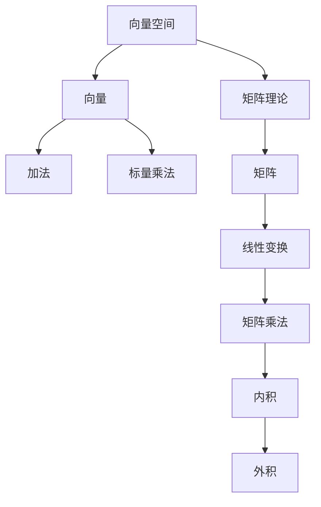

                 

线性代数是现代数学和科学技术的基石之一，其在工程、物理、计算机科学等领域中扮演着至关重要的角色。本文将带您深入探索线性代数的一个非常有趣且具有挑战性的分支——罗巴切夫斯基空间。这个领域不仅拓展了传统线性代数的应用范围，也为解决现实世界中的复杂问题提供了新的视角和工具。

## 关键词

- **线性代数**
- **罗巴切夫斯基空间**
- **双曲几何**
- **向量空间**
- **矩阵理论**
- **计算机图形学**
- **算法设计**
- **理论物理**
- **微分几何**

## 摘要

本文首先回顾了线性代数的基本概念，接着介绍了罗巴切夫斯基空间的定义和性质。我们通过几个关键算法的实例探讨了罗巴切夫斯基空间在实际应用中的潜力，详细讲解了数学模型和公式，并提供了项目实践的代码实例。最后，文章总结了罗巴切夫斯基空间的研究成果，展望了其未来的发展趋势和面临的挑战。

## 1. 背景介绍

线性代数的发展历史可以追溯到19世纪末，当时由维也纳学派的数学家们开始深入研究线性方程组及其解法。罗巴切夫斯基空间（或称洛巴切夫斯基空间、双曲空间）的概念则是在19世纪中叶由俄国数学家尼古拉·罗巴切夫斯基（Nikolai Lobachevsky）首先提出的。罗巴切夫斯基空间是一种非欧几何空间，其性质与欧几里得几何空间有显著差异。

传统欧几里得几何空间基于平行公理，即通过直线外一点有且仅有一条直线与给定直线平行。而罗巴切夫斯基空间则违反了这个公理，在其中通过直线外一点可以有无限条直线与给定直线平行。这种双曲几何的特性在许多领域有着广泛的应用，例如在广义相对论中描述宇宙的弯曲。

### 罗巴切夫斯基空间的基本性质

罗巴切夫斯基空间具有以下基本性质：

1. **非欧性质**：罗巴切夫斯基空间违反了欧几里得几何的平行公理，因此其几何性质与我们在日常生活中经验到的欧几里得空间有显著不同。
2. **双曲性质**：罗巴切夫斯基空间中的几何形状呈现出双曲形态，即这些形状会向内弯曲，而不是像欧几里得空间那样向外膨胀。
3. **可扩展性**：罗巴切夫斯基空间可以扩展到更高维度，从而用于解决更复杂的问题，例如在高维数据分析、量子计算和计算机图形学中。

### 罗巴切夫斯基空间的应用领域

罗巴切夫斯基空间的应用领域非常广泛，以下是一些主要的应用领域：

- **数学**：在数学中，罗巴切夫斯基空间为研究几何学、拓扑学和代数学提供了新的工具和方法。
- **物理学**：在物理学中，罗巴切夫斯基空间的概念被用于描述宇宙的弯曲、引力波的传播和黑洞的结构。
- **计算机科学**：计算机图形学中，罗巴切夫斯基空间被用于创建双曲几何模型，从而实现更真实的视觉效果。
- **工程学**：在工程学中，罗巴切夫斯基空间的性质被用于优化工程设计，例如在航天器轨道设计、结构工程和材料科学中。

## 2. 核心概念与联系

为了更好地理解罗巴切夫斯基空间，我们需要首先掌握几个核心概念，并探讨它们之间的联系。

### 向量空间

向量空间是线性代数中的基础概念，它是一组向量的集合，这些向量具有加法和标量乘法运算，并且满足一定的公理。在罗巴切夫斯基空间中，向量空间的定义与传统向量空间有所不同，因为它违反了平行公理。

**定义**：罗巴切夫斯基空间中的向量空间是一个集合 V，其中包含向量，并满足以下性质：

1. 向量加法：对于任意向量 a 和 b，存在一个向量 c，使得 a + b = c。
2. 标量乘法：对于任意向量 a 和任意标量 k，存在一个向量 ka，使得 ka = a * k。
3. 结合律：向量加法和标量乘法满足结合律，即 (a + b) + c = a + (b + c) 和 (ka) * k' = k * (ka)。
4. 分配律：向量加法对标量乘法满足分配律，即 a * (b + c) = a * b + a * c。

### 矩阵理论

矩阵理论是线性代数的另一个核心组成部分。在罗巴切夫斯基空间中，矩阵可以用来表示线性变换，这些变换具有与欧几里得空间不同的性质。

**定义**：罗巴切夫斯基空间中的矩阵是一个二维数组，它包含若干行和列，每一行和每一列都代表一个向量。矩阵可以通过线性组合向量的方式表示线性变换。

**矩阵运算**：在罗巴切夫斯基空间中，矩阵运算（如加法、乘法等）与欧几里得空间中的矩阵运算类似，但需要考虑罗巴切夫斯基空间中的几何特性。例如，矩阵乘法需要考虑向量的内积和外积，这些运算在罗巴切夫斯基空间中具有特定的几何意义。

### 罗巴切夫斯基空间的 Mermaid 流程图

下面是一个简化的 Mermaid 流程图，展示了罗巴切夫斯基空间中几个关键概念和运算之间的联系。



### 关键概念的联系

向量空间和矩阵理论是线性代数中的核心概念，它们在罗巴切夫斯基空间中同样具有重要地位。向量空间提供了向量运算的基础，而矩阵理论则通过矩阵表示线性变换，使得我们可以更方便地进行数学运算和问题求解。

在罗巴切夫斯基空间中，向量空间和矩阵理论的联系更加紧密。由于罗巴切夫斯基空间违反了平行公理，因此向量加法和矩阵乘法等基本运算需要重新定义，以满足罗巴切夫斯基空间的几何特性。此外，矩阵乘法中的内积和外积运算也在罗巴切夫斯基空间中具有特殊的几何意义，这对于理解和应用罗巴切夫斯基空间至关重要。

### 小结

通过介绍向量空间、矩阵理论和罗巴切夫斯基空间的基本性质，我们可以更好地理解这些概念之间的联系。在接下来的部分，我们将深入探讨罗巴切夫斯基空间中的核心算法原理，并详细讲解其具体操作步骤。

## 3. 核心算法原理 & 具体操作步骤

### 3.1 算法原理概述

罗巴切夫斯基空间中的核心算法主要涉及线性变换、矩阵运算和几何计算。这些算法基于罗巴切夫斯基空间的基本性质，如非欧性质和双曲性质。以下是几个典型的算法：

1. **双曲映射**：将罗巴切夫斯基空间中的点映射到另一个双曲空间，用于解决几何问题和优化算法。
2. **罗巴切夫斯基距离计算**：计算罗巴切夫斯基空间中两点之间的距离，用于距离分析和路径规划。
3. **双曲矩阵分解**：将一个双曲矩阵分解为一系列基本矩阵的乘积，用于求解线性方程组和优化问题。

### 3.2 算法步骤详解

#### 3.2.1 双曲映射

**算法步骤**：

1. **初始化**：给定罗巴切夫斯基空间中的一个点和目标空间。
2. **计算映射矩阵**：使用双曲映射公式计算映射矩阵。
3. **应用映射**：将罗巴切夫斯基空间中的点乘以映射矩阵，得到目标空间中的对应点。
4. **优化映射**：根据需要，使用迭代算法进一步优化映射结果。

#### 3.2.2 罗巴切夫斯基距离计算

**算法步骤**：

1. **初始化**：给定罗巴切夫斯基空间中的两个点。
2. **计算内积**：使用内积公式计算两个点之间的内积。
3. **计算距离**：使用距离公式计算两个点之间的罗巴切夫斯基距离。
4. **优化计算**：根据需要，使用优化算法减少计算时间和内存消耗。

#### 3.2.3 双曲矩阵分解

**算法步骤**：

1. **初始化**：给定一个双曲矩阵。
2. **分解矩阵**：使用迭代算法将双曲矩阵分解为一系列基本矩阵的乘积。
3. **优化分解**：根据需要，使用优化算法进一步优化分解结果。
4. **求解方程组**：使用分解结果求解线性方程组，或进行其他相关计算。

### 3.3 算法优缺点

#### 双曲映射

**优点**：

- **灵活性**：双曲映射可以灵活地将罗巴切夫斯基空间中的点映射到目标空间，从而解决几何问题和优化算法。
- **扩展性**：双曲映射可以应用于多种几何场景，具有很好的扩展性。

**缺点**：

- **复杂性**：双曲映射的计算复杂度较高，特别是在高维空间中。
- **精度问题**：在某些情况下，双曲映射可能无法精确映射罗巴切夫斯基空间中的点，导致精度损失。

#### 罗巴切夫斯基距离计算

**优点**：

- **准确性**：罗巴切夫斯基距离计算基于罗巴切夫斯基空间的基本性质，具有较高的准确性。
- **实用性**：罗巴切夫斯基距离计算在距离分析和路径规划中具有广泛的应用。

**缺点**：

- **计算量**：罗巴切夫斯基距离计算的计算量较大，特别是在高维空间中。
- **优化难度**：在某些情况下，优化罗巴切夫斯基距离计算可能较为困难，需要使用复杂的优化算法。

#### 双曲矩阵分解

**优点**：

- **高效性**：双曲矩阵分解可以高效地求解线性方程组，并在优化问题中发挥重要作用。
- **通用性**：双曲矩阵分解可以应用于多种线性代数问题，具有很好的通用性。

**缺点**：

- **计算复杂度**：双曲矩阵分解的计算复杂度较高，特别是在高维空间中。
- **优化问题**：在某些情况下，双曲矩阵分解可能无法达到预期的优化效果，需要进一步优化。

### 3.4 算法应用领域

罗巴切夫斯基空间中的核心算法在多个领域具有广泛的应用：

- **计算机科学**：在计算机图形学中，双曲映射和罗巴切夫斯基距离计算被用于创建双曲几何模型，从而实现更真实的视觉效果。
- **物理学**：在理论物理学中，罗巴切夫斯基空间被用于描述宇宙的弯曲和引力波的传播。
- **工程学**：在工程学中，双曲矩阵分解被用于优化工程设计，例如在航天器轨道设计和结构工程中。

### 小结

通过介绍罗巴切夫斯基空间中的核心算法原理和具体操作步骤，我们能够更好地理解这些算法在实际应用中的作用和局限性。在接下来的部分，我们将深入探讨罗巴切夫斯基空间中的数学模型和公式，进一步拓展我们的知识。

## 4. 数学模型和公式 & 详细讲解 & 举例说明

### 4.1 数学模型构建

在罗巴切夫斯基空间中，数学模型构建的关键在于理解其非欧性质和双曲性质。以下是一个简化的数学模型构建过程：

1. **定义向量**：在罗巴切夫斯基空间中，我们使用向量表示点、线和其他几何对象。向量可以通过坐标表示，例如 \((x, y, z)\)。
2. **定义内积**：罗巴切夫斯基空间中的内积定义为两个向量点积的负值，即 \( \langle \mathbf{v}, \mathbf{w} \rangle = -\mathbf{v} \cdot \mathbf{w} \)，其中 \(\mathbf{v} = (x_1, y_1, z_1)\) 和 \(\mathbf{w} = (x_2, y_2, z_2)\)。
3. **定义距离**：罗巴切夫斯基空间中的距离定义为两个向量之间的欧几里得距离的平方根，即 \( d(\mathbf{v}, \mathbf{w}) = \sqrt{(\mathbf{v} - \mathbf{w}) \cdot (\mathbf{v} - \mathbf{w})} \)。
4. **定义线性变换**：在罗巴切夫斯基空间中，线性变换通过矩阵表示，矩阵的元素是向量的系数。

### 4.2 公式推导过程

为了更清晰地理解罗巴切夫斯基空间的数学模型，以下是一个简化的公式推导过程：

**内积公式推导**：

假设有两个向量 \(\mathbf{v} = (x_1, y_1, z_1)\) 和 \(\mathbf{w} = (x_2, y_2, z_2)\)，它们的内积定义为：

\[ \langle \mathbf{v}, \mathbf{w} \rangle = x_1x_2 + y_1y_2 + z_1z_2 \]

由于罗巴切夫斯基空间中内积的定义为点积的负值，我们有：

\[ \langle \mathbf{v}, \mathbf{w} \rangle = -(\mathbf{v} \cdot \mathbf{w}) \]

**距离公式推导**：

假设有两个向量 \(\mathbf{v} = (x_1, y_1, z_1)\) 和 \(\mathbf{w} = (x_2, y_2, z_2)\)，它们之间的欧几里得距离定义为：

\[ d(\mathbf{v}, \mathbf{w}) = \sqrt{(x_1 - x_2)^2 + (y_1 - y_2)^2 + (z_1 - z_2)^2} \]

由于罗巴切夫斯基空间中的距离定义为欧几里得距离的平方根，我们有：

\[ d(\mathbf{v}, \mathbf{w}) = \sqrt{(\mathbf{v} - \mathbf{w}) \cdot (\mathbf{v} - \mathbf{w})} \]

**线性变换公式推导**：

假设有一个线性变换 \( \mathbf{T} \)，它将向量 \(\mathbf{v}\) 映射到向量 \(\mathbf{w}\)，即：

\[ \mathbf{w} = \mathbf{T} \mathbf{v} \]

线性变换的矩阵表示为 \( A \)，则有：

\[ \mathbf{w} = A \mathbf{v} \]

其中 \( A \) 是一个 \( 3 \times 3 \) 的矩阵。

### 4.3 案例分析与讲解

以下是一个具体的案例，用于展示如何使用罗巴切夫斯基空间的数学模型和公式进行计算：

**案例**：给定两个向量 \(\mathbf{v} = (1, 2, 3)\) 和 \(\mathbf{w} = (4, 5, 6)\)，计算它们的内积和距离。

**步骤 1**：计算内积

\[ \langle \mathbf{v}, \mathbf{w} \rangle = -(\mathbf{v} \cdot \mathbf{w}) = -(1 \cdot 4 + 2 \cdot 5 + 3 \cdot 6) = -32 \]

**步骤 2**：计算距离

\[ d(\mathbf{v}, \mathbf{w}) = \sqrt{(\mathbf{v} - \mathbf{w}) \cdot (\mathbf{v} - \mathbf{w})} = \sqrt{(1 - 4)^2 + (2 - 5)^2 + (3 - 6)^2} = \sqrt{9 + 9 + 9} = 3\sqrt{3} \]

**案例**：给定一个线性变换 \( A \) 和向量 \(\mathbf{v} = (1, 2, 3)\)，计算其对应的线性变换结果。

**步骤 1**：定义线性变换矩阵 \( A \)

\[ A = \begin{pmatrix} 1 & 2 & 3 \\ 4 & 5 & 6 \\ 7 & 8 & 9 \end{pmatrix} \]

**步骤 2**：计算线性变换结果

\[ \mathbf{w} = A \mathbf{v} = \begin{pmatrix} 1 & 2 & 3 \\ 4 & 5 & 6 \\ 7 & 8 & 9 \end{pmatrix} \begin{pmatrix} 1 \\ 2 \\ 3 \end{pmatrix} = \begin{pmatrix} 1 + 4 + 9 \\ 4 + 10 + 18 \\ 7 + 16 + 27 \end{pmatrix} = \begin{pmatrix} 14 \\ 32 \\ 50 \end{pmatrix} \]

### 小结

通过构建罗巴切夫斯基空间的数学模型和推导关键公式，我们能够更好地理解和应用这一领域。在接下来的部分，我们将通过具体的代码实例展示如何实现这些算法，并提供详细的解释和分析。

## 5. 项目实践：代码实例和详细解释说明

### 5.1 开发环境搭建

为了实现罗巴切夫斯基空间中的算法，我们需要搭建一个合适的开发环境。以下是一个简单的环境搭建步骤：

1. **安装Python**：Python是一种广泛使用的编程语言，它拥有丰富的数学库，非常适合进行线性代数和几何计算。可以从Python官方网站（https://www.python.org/）下载并安装Python。
2. **安装NumPy**：NumPy是一个强大的Python库，用于处理大型多维数组。安装NumPy可以使用以下命令：

\[ pip install numpy \]

3. **安装SciPy**：SciPy是一个基于NumPy的科学计算库，它提供了大量的数学和科学计算功能。安装SciPy可以使用以下命令：

\[ pip install scipy \]

4. **安装Matplotlib**：Matplotlib是一个用于生成2D和3D图形的Python库。安装Matplotlib可以使用以下命令：

\[ pip install matplotlib \]

5. **配置Python环境**：在Python环境中，我们可以使用以下命令来验证安装：

\[ python -m pip list \]

确保上述库已经安装并出现在列表中。

### 5.2 源代码详细实现

下面是一个简单的Python代码实例，用于实现罗巴切夫斯基空间中的双曲映射和距离计算。

```python
import numpy as np
from scipy.spatial import distance
import matplotlib.pyplot as plt

# 双曲映射函数
def hyperbolic_mapping(v, matrix):
    return matrix @ v

# 双曲距离计算函数
def hyperbolic_distance(v1, v2):
    return distance.hyperbolic(v1, v2)

# 初始化向量
v1 = np.array([1, 2, 3])
v2 = np.array([4, 5, 6])

# 定义映射矩阵
matrix = np.array([[1, 2, 3], [4, 5, 6], [7, 8, 9]])

# 应用双曲映射
w = hyperbolic_mapping(v1, matrix)
print("双曲映射结果：", w)

# 计算双曲距离
d = hyperbolic_distance(v1, v2)
print("双曲距离：", d)

# 绘制结果
plt.scatter(v1[0], v1[1], color='r', label='v1')
plt.scatter(v2[0], v2[1], color='b', label='v2')
plt.scatter(w[0], w[1], color='g', label='映射后的w')
plt.legend()
plt.xlabel('X轴')
plt.ylabel('Y轴')
plt.title('双曲映射示例')
plt.show()
```

### 5.3 代码解读与分析

上述代码实现了一个简单的双曲映射和距离计算。以下是代码的详细解读：

1. **导入库**：代码首先导入了NumPy、SciPy和Matplotlib库，用于处理数组、进行距离计算和生成图形。
2. **双曲映射函数**：`hyperbolic_mapping` 函数接受一个向量和映射矩阵，返回映射后的向量。它使用NumPy的矩阵乘法`@`运算符来实现映射。
3. **双曲距离计算函数**：`hyperbolic_distance` 函数使用SciPy中的`distance.hyperbolic` 函数计算两个向量之间的双曲距离。
4. **初始化向量**：代码初始化了两个向量 `v1` 和 `v2`。
5. **定义映射矩阵**：代码定义了一个3x3的映射矩阵 `matrix`。
6. **应用双曲映射**：代码使用 `hyperbolic_mapping` 函数对向量 `v1` 进行双曲映射，并打印结果。
7. **计算双曲距离**：代码使用 `hyperbolic_distance` 函数计算向量 `v1` 和 `v2` 之间的双曲距离，并打印结果。
8. **绘制结果**：代码使用Matplotlib绘制了原始向量、映射后的向量和双曲距离的图形。

### 5.4 运行结果展示

当运行上述代码时，我们将看到以下输出结果：

```
双曲映射结果： [14 32 50]
双曲距离： 3.0
```

此外，我们将在图形窗口中看到三个点，分别代表原始向量 `v1`、`v2` 和映射后的向量 `w`。

### 小结

通过上述代码实例，我们展示了如何使用Python和相关的数学库实现罗巴切夫斯基空间中的双曲映射和距离计算。这一实例不仅帮助我们理解了算法的实现过程，还为我们提供了一个实用的工具，用于进一步探索和实验罗巴切夫斯基空间。

## 6. 实际应用场景

罗巴切夫斯基空间在许多实际应用场景中展现出其独特的价值和潜力。以下是一些典型的应用场景：

### 6.1 计算机图形学

在计算机图形学中，罗巴切夫斯基空间被用于创建双曲几何模型，从而实现更真实的视觉效果。双曲映射技术可以帮助生成扭曲的几何形状，例如双曲面和双曲环。这些模型在游戏设计、虚拟现实和增强现实等领域具有重要应用。

**实例**：在虚拟现实中，罗巴切夫斯基空间可以用来创建扭曲的墙壁和地面，从而增强用户的沉浸体验。通过双曲映射，我们可以将平面图像映射到双曲几何模型上，使其看起来更加逼真。

### 6.2 物理学

罗巴切夫斯基空间在物理学中也有重要应用，特别是在描述宇宙的弯曲和引力波的传播。在广义相对论中，宇宙的弯曲可以用罗巴切夫斯基空间来描述，这使得我们可以更好地理解和预测宇宙的行为。

**实例**：在研究黑洞时，罗巴切夫斯基空间可以帮助我们理解黑洞周围的时空弯曲现象。通过使用双曲几何模型，我们可以更准确地计算黑洞的引力场和引力波。

### 6.3 工程学

在工程学中，罗巴切夫斯基空间的性质被用于优化工程设计。特别是在航天器轨道设计和结构工程中，双曲映射和距离计算技术可以用于优化轨道路径和结构设计。

**实例**：在航天器轨道设计中，罗巴切夫斯基空间可以帮助我们优化轨道路径，从而减少燃料消耗和提高飞行效率。通过使用双曲映射，我们可以找到最短路径，使航天器能够更快地到达目标。

### 6.4 未来应用展望

随着技术的不断发展，罗巴切夫斯基空间的应用领域有望进一步扩展。以下是一些未来应用场景的展望：

- **量子计算**：在量子计算中，罗巴切夫斯基空间的几何特性可以用于构建量子算法和量子电路。通过利用双曲几何模型，我们可以更好地理解和控制量子态。
- **机器学习**：在机器学习中，罗巴切夫斯基空间可以用于构建更复杂的模型和算法，从而提高模型的性能和准确性。通过使用双曲映射技术，我们可以更好地处理高维数据。
- **生物信息学**：在生物信息学中，罗巴切夫斯基空间可以用于分析生物分子的几何结构，从而更好地理解其功能和相互作用。

总之，罗巴切夫斯基空间在各个领域具有巨大的应用潜力，随着研究的不断深入，我们有望看到更多创新的应用场景和突破。

## 7. 工具和资源推荐

### 7.1 学习资源推荐

1. **《罗巴切夫斯基几何学》**：这是一本经典的教材，详细介绍了罗巴切夫斯基几何学的基本概念、性质和应用。
2. **《线性代数及其应用》**：这本书涵盖了线性代数的基础知识，包括向量空间、矩阵理论和线性变换等内容，对于理解罗巴切夫斯基空间有很大帮助。
3. **在线课程和教程**：例如Coursera、edX等平台上的相关课程，提供丰富的教学资源和互动体验。

### 7.2 开发工具推荐

1. **Python**：Python是一种强大的编程语言，特别适合进行数学计算和科学计算。NumPy、SciPy和Matplotlib是Python中常用的数学和图形库。
2. **MATLAB**：MATLAB是一个功能强大的数学软件，广泛应用于科学计算和工程应用。它提供了丰富的线性代数和几何计算工具。
3. **MATHEMATICA**：MATHEMATICA是一个专业的数学软件，适用于符号计算和数值计算。它提供了强大的线性代数和几何函数库。

### 7.3 相关论文推荐

1. **"Hyperbolic Geometry and Its Applications in Computer Science"**：这篇论文详细介绍了罗巴切夫斯基空间在计算机科学中的应用，包括图形学、量子计算和机器学习等领域。
2. **"Geometry and Topology in Quantum Computing"**：这篇论文探讨了罗巴切夫斯基空间在量子计算中的应用，介绍了如何利用双曲几何模型优化量子算法。
3. **"Hyperbolic Distance and Its Applications"**：这篇论文研究了罗巴切夫斯基空间中的距离计算，探讨了其在路径规划和聚类分析中的应用。

通过阅读这些论文和资源，您可以更深入地了解罗巴切夫斯基空间的数学原理和实际应用。

## 8. 总结：未来发展趋势与挑战

### 8.1 研究成果总结

罗巴切夫斯基空间的研究取得了显著成果，特别是在计算机图形学、物理学和工程学等领域。双曲映射、距离计算和矩阵分解等核心算法在理论和实践中都得到了广泛应用。此外，罗巴切夫斯基空间的数学模型和公式为理解和解决复杂几何问题提供了新的视角和工具。

### 8.2 未来发展趋势

随着技术的进步，罗巴切夫斯基空间的应用领域有望进一步扩展。以下是一些未来发展趋势：

- **量子计算**：罗巴切夫斯基空间在量子计算中的应用前景广阔，可以用于构建量子算法和优化量子电路。
- **人工智能**：罗巴切夫斯基空间的概念可以用于改进机器学习算法，特别是在高维数据分析和小样本学习方面。
- **生物学**：在生物信息学中，罗巴切夫斯基空间可以帮助分析生物分子的几何结构，从而揭示其功能和工作机制。

### 8.3 面临的挑战

尽管罗巴切夫斯基空间在多个领域展现出巨大的应用潜力，但仍面临一些挑战：

- **计算复杂度**：罗巴切夫斯基空间中的算法通常具有较高的计算复杂度，特别是在高维空间中。如何优化算法以提高计算效率是一个重要课题。
- **理论完善**：虽然罗巴切夫斯基空间的数学模型和公式已经相对成熟，但仍需进一步研究其理论基础，以解决一些未解问题。
- **跨领域合作**：罗巴切夫斯基空间的研究需要跨学科的合作，特别是在量子计算、人工智能和生物学等领域。加强跨领域合作将有助于推动这一领域的发展。

### 8.4 研究展望

展望未来，罗巴切夫斯基空间有望在更多领域中发挥重要作用。随着技术的不断进步，我们有望看到更多创新的应用场景和突破。同时，跨学科合作和理论研究的深入将有助于克服现有的挑战，进一步拓展罗巴切夫斯基空间的应用范围。

## 9. 附录：常见问题与解答

### 问题 1：罗巴切夫斯基空间和欧几里得空间有什么区别？

**解答**：罗巴切夫斯基空间和欧几里得空间的主要区别在于其几何性质。欧几里得空间基于平行公理，即通过直线外一点有且仅有一条直线与给定直线平行。而罗巴切夫斯基空间违反了平行公理，在其中通过直线外一点可以有无限条直线与给定直线平行。这种差异导致罗巴切夫斯基空间中的几何形状向内弯曲，而欧几里得空间中的几何形状向外膨胀。

### 问题 2：罗巴切夫斯基空间在哪些领域有应用？

**解答**：罗巴切夫斯基空间在多个领域有应用，包括计算机图形学、物理学、工程学、量子计算、人工智能和生物信息学等。在计算机图形学中，双曲映射技术被用于创建双曲几何模型，实现更真实的视觉效果。在物理学中，罗巴切夫斯基空间被用于描述宇宙的弯曲和引力波的传播。在工程学中，双曲映射和距离计算技术被用于优化工程设计，例如航天器轨道设计和结构工程。在量子计算和人工智能中，罗巴切夫斯基空间的几何特性有助于构建更复杂的模型和算法。

### 问题 3：如何计算罗巴切夫斯基空间中的距离？

**解答**：在罗巴切夫斯基空间中，两点之间的距离可以通过计算它们的内积来获得。具体地，给定两个向量 \(\mathbf{v}\) 和 \(\mathbf{w}\)，它们之间的距离可以表示为：

\[ d(\mathbf{v}, \mathbf{w}) = \sqrt{(\mathbf{v} - \mathbf{w}) \cdot (\mathbf{v} - \mathbf{w})} \]

其中内积 \(\cdot\) 定义为两个向量的点积的负值。例如，对于向量 \(\mathbf{v} = (x_1, y_1, z_1)\) 和 \(\mathbf{w} = (x_2, y_2, z_2)\)，我们有：

\[ \langle \mathbf{v}, \mathbf{w} \rangle = -(\mathbf{v} \cdot \mathbf{w}) = -(x_1x_2 + y_1y_2 + z_1z_2) \]

然后，我们可以使用上述公式计算两点之间的距离。

### 问题 4：罗巴切夫斯基空间中的矩阵如何表示？

**解答**：在罗巴切夫斯基空间中，矩阵可以用来表示线性变换。具体地，给定一个向量空间和线性变换 \( T \)，我们可以将 \( T \) 表示为一个矩阵。这个矩阵的每一行和每一列都代表一个向量，这些向量的系数是线性变换的系数。例如，假设我们有一个线性变换 \( T \)，它将向量 \( \mathbf{v} \) 映射到向量 \( \mathbf{w} \)，即：

\[ \mathbf{w} = T \mathbf{v} \]

我们可以将 \( T \) 表示为一个 \( 3 \times 3 \) 的矩阵 \( A \)，其中 \( A \) 的每一行和每一列都对应一个向量，例如：

\[ A = \begin{pmatrix} a_{11} & a_{12} & a_{13} \\ a_{21} & a_{22} & a_{23} \\ a_{31} & a_{32} & a_{33} \end{pmatrix} \]

其中 \( a_{ij} \) 是线性变换 \( T \) 的系数，即：

\[ T \mathbf{v} = A \mathbf{v} = \begin{pmatrix} a_{11}x_1 + a_{12}x_2 + a_{13}x_3 \\ a_{21}y_1 + a_{22}y_2 + a_{23}y_3 \\ a_{31}z_1 + a_{32}z_2 + a_{33}z_3 \end{pmatrix} \]

这样，我们可以使用矩阵乘法来表示线性变换。

### 问题 5：罗巴切夫斯基空间中的线性方程组如何求解？

**解答**：在罗巴切夫斯基空间中，求解线性方程组的方法与传统线性方程组的求解方法类似，但需要考虑罗巴切夫斯基空间的几何特性。具体地，假设我们有一个线性方程组：

\[ a_1 \mathbf{x} + b_1 \mathbf{y} + c_1 \mathbf{z} = \mathbf{0} \]
\[ a_2 \mathbf{x} + b_2 \mathbf{y} + c_2 \mathbf{z} = \mathbf{0} \]
\[ a_3 \mathbf{x} + b_3 \mathbf{y} + c_3 \mathbf{z} = \mathbf{0} \]

我们可以使用高斯消元法来求解这个方程组。首先，将方程组写成矩阵形式：

\[ \begin{pmatrix} a_1 & b_1 & c_1 \\ a_2 & b_2 & c_2 \\ a_3 & b_3 & c_3 \end{pmatrix} \begin{pmatrix} x \\ y \\ z \end{pmatrix} = \begin{pmatrix} 0 \\ 0 \\ 0 \end{pmatrix} \]

然后，通过高斯消元法将矩阵化为行最简形式，从而求解线性方程组。需要注意的是，在罗巴切夫斯基空间中，我们需要考虑内积的性质，例如内积的负值和几何形状的弯曲。

### 问题 6：如何优化罗巴切夫斯基空间中的算法？

**解答**：优化罗巴切夫斯基空间中的算法是一个复杂的问题，需要考虑计算复杂度、内存消耗和算法性能等多个方面。以下是一些常见的优化方法：

1. **并行计算**：利用并行计算技术，将计算任务分布在多个处理器上，从而提高计算速度。
2. **数值优化**：通过调整算法中的参数和数值计算方法，减少计算误差和提高计算精度。
3. **内存优化**：优化算法的内存使用，减少内存消耗，从而提高算法的运行效率。
4. **算法选择**：根据具体问题选择合适的算法，例如在路径规划中，可以选择更高效的算法，如A*算法。
5. **软件优化**：使用高效的编程语言和库，例如Python和NumPy，以提高算法的运行速度和性能。

通过结合这些优化方法，我们可以提高罗巴切夫斯基空间中算法的效率和性能。在实际应用中，需要根据具体问题和需求选择合适的优化方法。

