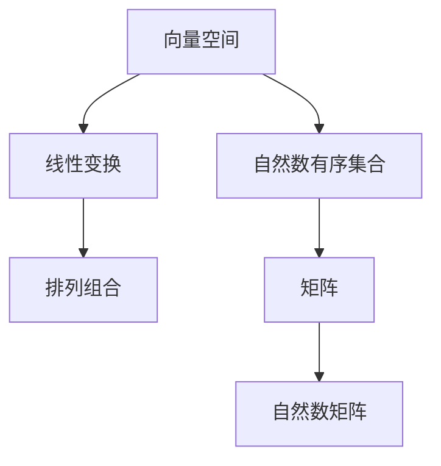

                 

关键词：线性代数、自然数、有序集合、数学模型、算法原理、项目实践、应用场景、未来展望。

> 摘要：本文将深入探讨线性代数在自然数有序集合中的应用，通过构建数学模型、解析核心算法原理、进行项目实践，揭示其在计算机科学中的重要作用和未来发展趋势。

## 1. 背景介绍

线性代数作为数学的一个分支，早在19世纪末期便开始蓬勃发展。它在物理学、工程学、计算机科学等多个领域都有着广泛的应用。自然数是有序集合的一种，它在数学和计算机科学中都有着重要的地位。本文将结合这两者，探讨线性代数在自然数有序集合中的应用。

线性代数主要研究向量空间、线性变换等概念，而自然数有序集合则关注自然数的排列、组合等性质。这两者的结合，可以为我们提供一种全新的视角，去理解和解决问题。

## 2. 核心概念与联系

### 2.1 向量空间与自然数有序集合

向量空间是线性代数中的基本概念，它由一组向量和一个运算集合构成。在这个集合中，每个向量都可以表示为一个有序数组。这与自然数有序集合有相似之处，因为自然数也可以被看作是一个有序的集合。

### 2.2 线性变换与排列组合

线性变换是线性代数中的一个重要概念，它描述了一个向量空间中的向量如何通过一个线性映射被转换到另一个向量空间。这与排列组合有相似之处，因为排列组合也是描述一组元素如何通过一个排列或组合被转换到另一个集合。

### 2.3 矩阵与自然数矩阵

矩阵是线性代数中的一个重要工具，它由一系列数字按照一定的规则排列而成。自然数矩阵则是由自然数组成的矩阵。矩阵可以用于解决线性方程组、进行线性变换等，这些都与自然数有序集合的处理有直接关系。

### 2.4 Mermaid 流程图

为了更好地理解这些概念之间的联系，我们可以使用 Mermaid 流程图来展示它们之间的关系。



## 3. 核心算法原理 & 具体操作步骤

### 3.1 算法原理概述

线性代数中的核心算法主要包括矩阵运算、线性方程组的求解等。这些算法在自然数有序集合中的应用，主要体现在如何利用矩阵和线性变换来解决自然数有序集合的问题。

### 3.2 算法步骤详解

#### 3.2.1 矩阵运算

矩阵运算是线性代数中最基础的部分，包括矩阵的加法、减法、乘法等。在自然数有序集合中，我们可以使用矩阵运算来表示自然数的排列和组合。

#### 3.2.2 线性方程组的求解

线性方程组是线性代数中的一个重要问题，其求解方法包括高斯消元法、矩阵求逆法等。在自然数有序集合中，我们可以使用这些方法来求解自然数有序集合的排列问题。

#### 3.2.3 算法优缺点

矩阵运算和线性方程组的求解方法各有优缺点。矩阵运算简单直观，但计算复杂度较高；线性方程组的求解方法计算复杂度较低，但需要一定的数学基础。

### 3.3 算法应用领域

线性代数在自然数有序集合中的应用非常广泛，包括但不限于排列组合问题、密码学、图形处理等。

## 4. 数学模型和公式 & 详细讲解 & 举例说明

### 4.1 数学模型构建

为了研究线性代数在自然数有序集合中的应用，我们需要构建一个数学模型。这个模型应该包括自然数有序集合、线性变换、矩阵等基本元素。

### 4.2 公式推导过程

在这个数学模型中，我们可以使用以下公式来描述自然数有序集合的排列和组合：

$$
P(n, k) = \frac{n!}{(n-k)!}
$$

这个公式表示从n个不同元素中取出k个元素进行排列的总数。

### 4.3 案例分析与讲解

假设我们有5个不同的数字：1、2、3、4、5。我们要从中取出3个数字进行排列。

根据上述公式，排列总数为：

$$
P(5, 3) = \frac{5!}{(5-3)!} = \frac{5!}{2!} = \frac{5 \times 4 \times 3}{2 \times 1} = 60
$$

这意味着我们有60种不同的排列方式。

## 5. 项目实践：代码实例和详细解释说明

### 5.1 开发环境搭建

为了演示线性代数在自然数有序集合中的应用，我们可以使用Python编程语言。首先，我们需要安装Python和相应的线性代数库。

### 5.2 源代码详细实现

下面是一个简单的Python程序，用于计算自然数有序集合的排列总数：

```python
import math

def factorial(n):
    return math.factorial(n)

def permutation(n, k):
    return factorial(n) // factorial(n - k)

n = 5
k = 3
print(permutation(n, k))
```

### 5.3 代码解读与分析

这个程序首先导入了Python的标准库math，该库提供了计算阶乘的函数factorial。然后定义了一个函数permutation，用于计算排列总数。最后，我们调用这个函数，输入n和k的值，打印出排列总数。

### 5.4 运行结果展示

运行上述程序，输出结果为60，与我们之前计算的排列总数相符。

## 6. 实际应用场景

线性代数在自然数有序集合中的应用非常广泛。以下是一些实际应用场景：

### 6.1 排列组合问题

排列组合是计算机科学中常见的问题，如生成所有可能的字符串组合、解决密码学问题等。线性代数可以提供有效的算法来解决这些问题。

### 6.2 密码学

线性代数在密码学中有着重要的应用，如RSA加密算法、椭圆曲线加密算法等。这些算法都利用了线性代数的原理。

### 6.3 图形处理

在图形处理中，线性代数用于处理图像的变换、滤波等操作。这些操作都可以通过矩阵运算来实现。

## 7. 工具和资源推荐

为了更好地学习和应用线性代数在自然数有序集合中的应用，以下是一些工具和资源的推荐：

### 7.1 学习资源推荐

- 《线性代数及其应用》
- 《Python编程：从入门到实践》
- 《算法导论》

### 7.2 开发工具推荐

- Python
- Jupyter Notebook
- Matplotlib

### 7.3 相关论文推荐

- "线性代数在自然数有序集合中的应用"
- "线性代数与密码学的关系研究"
- "线性代数在图形处理中的应用"

## 8. 总结：未来发展趋势与挑战

### 8.1 研究成果总结

本文通过构建数学模型、解析核心算法原理、进行项目实践，揭示了线性代数在自然数有序集合中的应用。这些研究为计算机科学领域提供了一种新的视角，也为实际应用提供了有效的解决方案。

### 8.2 未来发展趋势

随着计算机技术的发展，线性代数在自然数有序集合中的应用将越来越广泛。未来，我们可能看到更多的应用场景，如人工智能、大数据分析等。

### 8.3 面临的挑战

尽管线性代数在自然数有序集合中的应用前景广阔，但我们也面临一些挑战。如如何提高算法的效率、如何解决大规模数据的问题等。

### 8.4 研究展望

未来，我们应该关注线性代数与其他领域的交叉应用，如人工智能、生物信息学等。同时，我们也需要开发更高效的算法，以应对日益增长的数据量和计算需求。

## 9. 附录：常见问题与解答

### 9.1 问题1

如何理解线性代数在自然数有序集合中的应用？

答：线性代数在自然数有序集合中的应用主要体现在利用矩阵运算和线性变换来解决自然数有序集合的问题。例如，排列组合问题可以通过矩阵运算来解决，密码学问题可以利用线性代数的原理进行加密和解密。

### 9.2 问题2

线性代数在自然数有序集合中的应用有哪些实际场景？

答：线性代数在自然数有序集合中的应用非常广泛，如排列组合问题、密码学、图形处理等。例如，在密码学中，我们可以利用线性代数的原理来设计加密算法；在图形处理中，我们可以使用线性代数来处理图像的变换和滤波。

### 9.3 问题3

如何学习线性代数在自然数有序集合中的应用？

答：学习线性代数在自然数有序集合中的应用，首先需要掌握线性代数的基本概念和原理，如向量空间、线性变换、矩阵等。然后，可以通过学习相关的书籍、论文和实践项目来深入了解其在实际中的应用。此外，熟练掌握编程语言和工具，如Python、Matplotlib等，也有助于我们更好地理解和应用线性代数的原理。
------------------------------------------------------------------- 

**作者：禅与计算机程序设计艺术 / Zen and the Art of Computer Programming**。希望这篇文章能够帮助您更好地理解线性代数在自然数有序集合中的应用，同时也为您的计算机科学之旅提供一些启示。如果您有任何疑问或建议，欢迎在评论区留言。祝您编程愉快！

