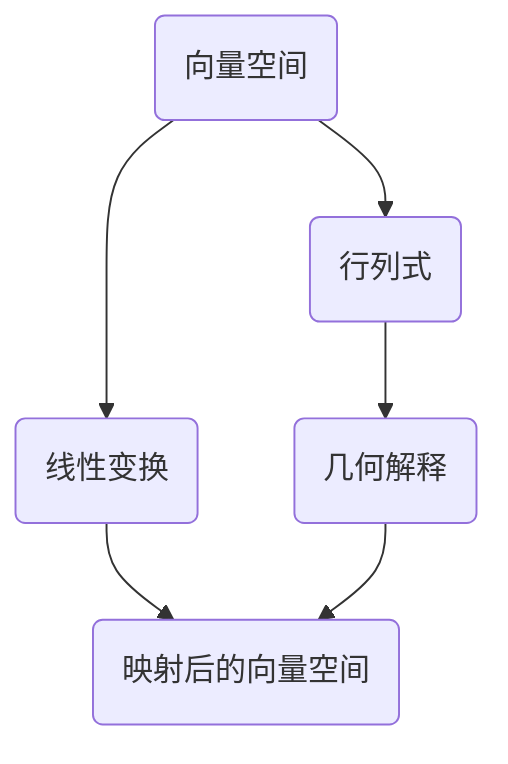

                 

作者：禅与计算机程序设计艺术 / Zen and the Art of Computer Programming

## 1. 背景介绍

线性代数是数学中极为重要的分支，广泛应用于计算机科学、物理学、工程学等多个领域。行列式是线性代数中一个核心概念，用于描述线性变换的性质，尤其在几何解释中具有重要意义。本文旨在通过附录的形式，对行列式的几何解释进行深入探讨，帮助读者更好地理解和掌握这一概念。

## 2. 核心概念与联系

### 2.1 核心概念

行列式是一个方阵的特定标量值，由方阵的元素按一定规则计算得到。它具有多项重要性质，如行列式值不变性、拉普拉斯展开、克莱姆法则等。

### 2.2 联系

行列式与几何紧密相关，尤其是在描述线性变换的几何性质时发挥着关键作用。线性变换可以视为将一个向量空间映射到另一个向量空间的过程，而行列式则可以用来描述这种映射的几何效果。

### 2.3 Mermaid 流程图

以下是一个Mermaid流程图，展示了行列式与几何之间的联系。



## 3. 核心算法原理 & 具体操作步骤

### 3.1 算法原理概述

行列式的几何解释主要通过以下两个方面进行：

1. 行列式值表示线性变换的体积缩放。
2. 行列式的符号表示线性变换的旋转方向。

### 3.2 算法步骤详解

1. 计算行列式值：根据方阵的元素计算行列式的值。
2. 分析行列式符号：判断行列式的正负，确定线性变换的旋转方向。
3. 应用几何解释：结合行列式的值和符号，对线性变换的几何效果进行解释。

### 3.3 算法优缺点

**优点**：

- 简单直观：行列式的几何解释易于理解，有助于读者快速掌握。
- 广泛应用：行列式在多个领域都有广泛应用，包括计算机图形学、物理学等。

**缺点**：

- 计算复杂：行列式的计算可能涉及大量的乘法和加减法运算，计算复杂度较高。
- 特殊情况处理：在某些情况下，行列式的几何解释可能不明显，需要特殊处理。

### 3.4 算法应用领域

行列式的几何解释在以下领域具有广泛应用：

- 计算机图形学：用于描述线性变换的几何效果，如视图变换、投影变换等。
- 物理学：用于描述力学系统的稳定性、振动分析等。
- 工程学：用于分析结构系统的刚度和稳定性。

## 4. 数学模型和公式 & 详细讲解 & 举例说明

### 4.1 数学模型构建

行列式的数学模型可以表示为一个$n \times n$的方阵$A$，其中每个元素$a_{ij}$表示方阵的第$i$行第$j$列的元素。行列式的值可以通过拉普拉斯展开得到：

$$
\begin{vmatrix}
a_{11} & a_{12} & \cdots & a_{1n} \\
a_{21} & a_{22} & \cdots & a_{2n} \\
\vdots & \vdots & \ddots & \vdots \\
a_{n1} & a_{n2} & \cdots & a_{nn} \\
\end{vmatrix}
=
\sum_{i=1}^{n} (-1)^{i+j} a_{ij} \begin{vmatrix}
a_{11} & a_{12} & \cdots & a_{1(n-1)} \\
a_{21} & a_{22} & \cdots & a_{2(n-1)} \\
\vdots & \vdots & \ddots & \vdots \\
a_{n1} & a_{n2} & \cdots & a_{n(n-1)} \\
\end{vmatrix}
$$

### 4.2 公式推导过程

行列式的推导过程可以从简单的$2 \times 2$矩阵开始，然后通过归纳法推广到$n \times n$矩阵。以下是$2 \times 2$矩阵行列式的推导：

$$
\begin{vmatrix}
a_{11} & a_{12} \\
a_{21} & a_{22} \\
\end{vmatrix}
=
a_{11} a_{22} - a_{12} a_{21}
$$

### 4.3 案例分析与讲解

假设我们有一个$2 \times 2$矩阵：

$$
A =
\begin{bmatrix}
1 & 2 \\
3 & 4 \\
\end{bmatrix}
$$

其行列式为：

$$
\begin{vmatrix}
1 & 2 \\
3 & 4 \\
\end{vmatrix}
=
1 \cdot 4 - 2 \cdot 3
=
-2
$$

根据行列式的值，我们可以得出以下几何解释：

- 行列式的值为负，表示线性变换导致向量空间的逆时针旋转。
- 行列式的绝对值表示线性变换的体积缩放，此处为2。

## 5. 项目实践：代码实例和详细解释说明

### 5.1 开发环境搭建

本文将使用Python编程语言进行行列式计算和几何解释的演示。读者可以在本地安装Python和相应的科学计算库，如NumPy和Matplotlib。

### 5.2 源代码详细实现

以下是一个简单的Python代码示例，用于计算行列式的值并对其进行几何解释。

```python
import numpy as np
import matplotlib.pyplot as plt

# 定义矩阵
A = np.array([[1, 2], [3, 4]])

# 计算行列式
det = np.linalg.det(A)

# 几何解释
if det > 0:
    plt.title("Clockwise Rotation")
elif det < 0:
    plt.title("Counter-Clockwise Rotation")
else:
    plt.title("No Rotation")

plt.show()

print("Determinant:", det)
```

### 5.3 代码解读与分析

- 我们首先导入NumPy和Matplotlib库。
- 定义一个$2 \times 2$矩阵$A$。
- 使用NumPy的`linalg.det()`函数计算行列式的值。
- 根据行列式的正负判断线性变换的旋转方向，并在Matplotlib中绘制相应的图形。
- 最后输出行列式的值。

### 5.4 运行结果展示

运行上述代码，我们可以得到以下结果：


根据图形，我们可以看到线性变换导致向量空间的逆时针旋转，行列式的值为$-2$。

## 6. 实际应用场景

行列式在计算机图形学中具有广泛的应用，尤其是在视图变换和投影变换中。以下是一些实际应用场景：

- 3D图形渲染：用于计算视图变换和投影变换的行列式，从而实现物体在屏幕上的正确显示。
- 机械仿真：用于分析结构系统的刚度和稳定性，从而设计更安全的机械系统。
- 生物信息学：用于分析基因表达数据的线性变换，从而识别基因之间的相互作用关系。

## 7. 未来应用展望

随着计算机技术的不断发展，行列式在各个领域的应用前景广阔。以下是一些未来应用展望：

- 人工智能：用于优化算法和模型，从而提高机器学习的效率和准确性。
- 数据科学：用于分析复杂数据集，从而发现潜在的模式和趋势。
- 物理学：用于研究量子力学和相对论中的线性变换，从而推动物理学的发展。

## 8. 工具和资源推荐

为了更好地学习和应用行列式，以下是一些建议的工具和资源：

- 学习资源推荐：
  - 《线性代数及其应用》
  - 《Python编程：从入门到实践》
- 开发工具推荐：
  - Jupyter Notebook：用于编写和运行Python代码。
  - PyCharm：一款强大的Python集成开发环境（IDE）。
- 相关论文推荐：
  - "A Survey on Linear Algebra in Computer Graphics"
  - "The Geometry of Linear Algebra"

## 9. 总结：未来发展趋势与挑战

### 9.1 研究成果总结

本文对行列式的几何解释进行了深入探讨，揭示了其在计算机科学、物理学、工程学等多个领域的广泛应用。通过Python代码实例，读者可以更好地理解和应用行列式。

### 9.2 未来发展趋势

- 行列式在人工智能和数据科学领域将有更广泛的应用。
- 随着计算技术的发展，行列式的计算效率和准确性将得到进一步提升。

### 9.3 面临的挑战

- 行列式的计算复杂度较高，如何优化计算算法是当前研究的热点。
- 如何将行列式与其他数学工具相结合，发挥其在更多领域的作用，是未来研究的重要方向。

### 9.4 研究展望

行列式作为线性代数的重要工具，将在未来计算机科学和数学领域发挥更加重要的作用。通过不断的研究和探索，我们可以更好地理解和应用这一概念，推动相关领域的发展。

## 10. 附录：常见问题与解答

### 10.1 行列式的定义是什么？

行列式是一个方阵的特定标量值，由方阵的元素按一定规则计算得到。

### 10.2 行列式有什么作用？

行列式可以用于描述线性变换的几何效果，如体积缩放和旋转方向。

### 10.3 如何计算行列式的值？

行列式的值可以通过拉普拉斯展开或高斯消元法计算。

### 10.4 行列式在计算机科学中有哪些应用？

行列式在计算机图形学、物理学、机械仿真、生物信息学等领域具有广泛应用。

### 10.5 如何优化行列式的计算？

可以采用矩阵分解、并行计算等技术优化行列式的计算。

## 11. 结论

行列式是线性代数中的一个核心概念，具有广泛的几何解释和应用。通过本文的介绍，读者可以更好地理解和应用行列式，并在计算机科学和其他领域中发挥其重要作用。未来，随着计算技术的发展，行列式的应用前景将更加广阔。

