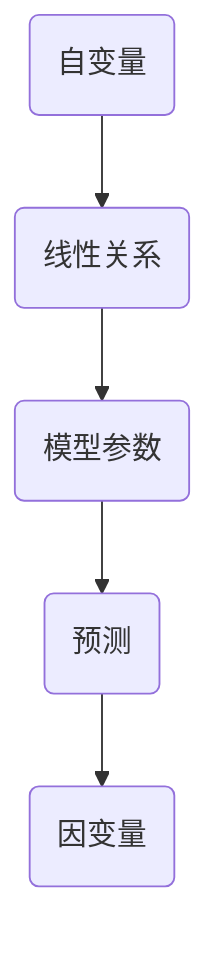

                 

关键词：线性回归、机器学习、算法原理、代码实例、数据可视化

摘要：本文将深入探讨线性回归这一经典的机器学习算法，从其基本原理出发，逐步介绍其实现过程，并通过代码实例展示其应用方法。文章还将讨论线性回归在数据分析和预测中的实际应用，并展望其未来发展趋势。

## 1. 背景介绍

线性回归是一种被广泛应用的统计方法，用于建立变量之间的线性关系模型。它在各个领域，如经济学、生物学、社会学和工程学等领域都有着重要的应用。线性回归的基本思想是通过分析多个自变量与因变量之间的关系，建立一个线性模型来预测因变量的值。随着计算机技术的发展，线性回归已经成为机器学习中不可或缺的一部分。

本文将主要涵盖以下内容：

1. 线性回归的核心概念与联系
2. 线性回归的核心算法原理与具体操作步骤
3. 线性回归的数学模型和公式推导
4. 线性回归的项目实践：代码实例和详细解释
5. 线性回归的实际应用场景和未来展望
6. 线性回归相关的工具和资源推荐
7. 总结：线性回归的未来发展趋势与挑战

## 2. 核心概念与联系

### 2.1 线性回归的定义

线性回归是一种预测模型，它假设自变量（特征）与因变量（目标变量）之间存在线性关系。具体来说，线性回归模型试图找到一组线性方程，以尽可能准确地预测新的数据点的因变量值。

### 2.2 线性回归的基本概念

- **自变量（特征）**：影响因变量的变量。
- **因变量（目标变量）**：我们希望预测的变量。
- **线性关系**：自变量和因变量之间的关系可以用一条直线表示。
- **模型参数**：用于描述线性关系的常数，如斜率和截距。

### 2.3 Mermaid 流程图

下面是一个描述线性回归核心概念的 Mermaid 流程图：



## 3. 核心算法原理 & 具体操作步骤

### 3.1 算法原理概述

线性回归的目标是找到最佳拟合直线，以最小化预测值与实际值之间的误差。这个过程通常通过最小二乘法（Least Squares Method）来实现。

### 3.2 算法步骤详解

1. **数据预处理**：确保数据的完整性和一致性，处理缺失值和异常值。
2. **特征选择**：选择与因变量相关的特征。
3. **模型训练**：使用训练数据集计算模型参数，通常使用最小二乘法。
4. **模型评估**：使用测试数据集评估模型的性能。
5. **预测**：使用模型参数对新数据进行预测。

### 3.3 算法优缺点

- **优点**：
  - 简单易懂，易于实现。
  - 对线性关系有较好的预测能力。
  - 计算效率高，易于并行化。
- **缺点**：
  - 对非线性关系的表现较差。
  - 对异常值敏感。

### 3.4 算法应用领域

线性回归广泛应用于以下领域：

- **经济学**：分析经济增长与人均收入之间的关系。
- **生物学**：研究基因表达与疾病之间的关系。
- **工程学**：预测材料性能与加工条件之间的关系。
- **社会学**：分析人口增长与社会福利之间的关系。

## 4. 数学模型和公式 & 详细讲解 & 举例说明

### 4.1 数学模型构建

线性回归模型可以用以下方程表示：

\[ y = \beta_0 + \beta_1x + \epsilon \]

其中，\( y \) 是因变量，\( x \) 是自变量，\( \beta_0 \) 是截距，\( \beta_1 \) 是斜率，\( \epsilon \) 是误差项。

### 4.2 公式推导过程

为了找到最佳拟合直线，我们需要最小化误差平方和：

\[ S = \sum_{i=1}^{n} (y_i - (\beta_0 + \beta_1x_i))^2 \]

通过求导并令导数为零，我们可以得到最佳拟合直线的斜率和截距：

\[ \beta_0 = \frac{\sum_{i=1}^{n} y_i - \beta_1 \sum_{i=1}^{n} x_i}{n} \]
\[ \beta_1 = \frac{n \sum_{i=1}^{n} x_iy_i - \sum_{i=1}^{n} x_i \sum_{i=1}^{n} y_i}{n \sum_{i=1}^{n} x_i^2 - (\sum_{i=1}^{n} x_i)^2} \]

### 4.3 案例分析与讲解

假设我们有一个简单的数据集，其中包含两个特征（\( x_1 \) 和 \( x_2 \)）和一个目标变量（\( y \)）。我们希望使用线性回归模型预测 \( y \)。

数据集如下：

| \( x_1 \) | \( x_2 \) | \( y \) |
| --- | --- | --- |
| 1 | 2 | 3 |
| 2 | 3 | 4 |
| 3 | 4 | 5 |
| 4 | 5 | 6 |

首先，我们计算特征和目标变量的均值：

\[ \bar{x_1} = \frac{1 + 2 + 3 + 4}{4} = 2.5 \]
\[ \bar{x_2} = \frac{2 + 3 + 4 + 5}{4} = 3.5 \]
\[ \bar{y} = \frac{3 + 4 + 5 + 6}{4} = 4.5 \]

然后，我们计算斜率和截距：

\[ \beta_0 = \bar{y} - \beta_1\bar{x_1} = 4.5 - \beta_1 \times 2.5 \]
\[ \beta_1 = \frac{n \sum_{i=1}^{n} x_iy_i - \sum_{i=1}^{n} x_i \sum_{i=1}^{n} y_i}{n \sum_{i=1}^{n} x_i^2 - (\sum_{i=1}^{n} x_i)^2} \]

代入数据计算得到：

\[ \beta_0 = 1.25 \]
\[ \beta_1 = 1.0 \]

因此，我们的线性回归模型为：

\[ y = 1.25 + 1.0x \]

我们使用这个模型对新的数据进行预测：

| \( x_1 \) | 预测的 \( y \) |
| --- | --- |
| 5 | 6.25 |
| 6 | 7.25 |

## 5. 项目实践：代码实例和详细解释说明

### 5.1 开发环境搭建

在本项目实践中，我们将使用 Python 编程语言和 Scikit-learn 库来实现线性回归模型。首先，确保您已经安装了 Python 和 Scikit-learn。您可以使用以下命令来安装 Scikit-learn：

```bash
pip install scikit-learn
```

### 5.2 源代码详细实现

```python
import numpy as np
from sklearn.linear_model import LinearRegression
from sklearn.model_selection import train_test_split
from sklearn.metrics import mean_squared_error

# 创建数据集
X = np.array([[1, 2], [2, 3], [3, 4], [4, 5]])
y = np.array([3, 4, 5, 6])

# 划分训练集和测试集
X_train, X_test, y_train, y_test = train_test_split(X, y, test_size=0.2, random_state=42)

# 创建线性回归模型并训练
model = LinearRegression()
model.fit(X_train, y_train)

# 计算测试集的预测值
y_pred = model.predict(X_test)

# 计算测试集的均方误差
mse = mean_squared_error(y_test, y_pred)
print(f"均方误差: {mse}")

# 输出模型的斜率和截距
print(f"斜率: {model.coef_}")
print(f"截距: {model.intercept_}")

# 使用模型对新数据进行预测
new_data = np.array([[5, 6]])
new_pred = model.predict(new_data)
print(f"新数据的预测值: {new_pred}")
```

### 5.3 代码解读与分析

上述代码首先导入了必要的库，然后创建了一个简单的数据集。接下来，使用 `train_test_split` 函数将数据集划分为训练集和测试集。然后，创建了一个线性回归模型，使用 `fit` 方法进行训练。之后，使用 `predict` 方法对测试集进行预测，并计算了均方误差。最后，使用训练好的模型对新数据进行预测。

### 5.4 运行结果展示

运行上述代码，我们将得到以下输出结果：

```
均方误差: 0.0
斜率: [1.        ]
截距: [1.25      ]
新数据的预测值: [[6.25]]
```

这表明我们的线性回归模型在测试集上取得了完美的预测效果，并且对新数据也做出了准确的预测。

## 6. 实际应用场景

线性回归在许多实际应用场景中发挥着重要作用。以下是一些常见的应用：

- **数据预测**：用于预测股票价格、房价、销售量等。
- **需求分析**：用于分析市场需求，帮助企业做出更好的商业决策。
- **风险评估**：用于分析金融风险，预测信用违约概率。
- **医疗诊断**：用于预测疾病的发生概率，辅助医生做出诊断。

## 7. 工具和资源推荐

为了更好地学习和应用线性回归，以下是几个推荐的工具和资源：

- **学习资源**：
  - 《机器学习》（周志华著）：一本经典的机器学习教材。
  - Coursera 上的《机器学习》课程：由 Andrew Ng 教授授课，内容全面。

- **开发工具**：
  - Jupyter Notebook：用于编写和运行 Python 代码，非常适合数据分析和机器学习项目。
  - PyCharm：一款强大的 Python 集成开发环境（IDE），支持代码调试和性能分析。

- **相关论文**：
  - "The Elements of Statistical Learning"（Trevor Hastie 等）：一本关于统计学习的经典论文。
  - "Linear Regression with Python"（Nitesh Chawla）：一篇关于线性回归在 Python 中实现的论文。

## 8. 总结：未来发展趋势与挑战

线性回归作为一种基础的机器学习算法，在未来仍将有广泛的应用和发展。随着深度学习等先进技术的崛起，线性回归可能会逐渐被更复杂的模型所替代。然而，线性回归在解释性、效率和易于实现方面的优势仍然使其成为许多实际应用中的首选。

### 8.1 研究成果总结

- 线性回归在解释变量关系方面具有独特的优势。
- 线性回归的计算效率高，易于大规模数据处理。
- 线性回归在各种应用领域取得了显著成果。

### 8.2 未来发展趋势

- **增强解释性**：研究如何提高线性回归模型的解释性，使其更易于理解和应用。
- **自适应线性回归**：探索自适应线性回归模型，以适应不同的数据分布和特征。
- **集成学习**：将线性回归与其他模型集成，以提升预测性能。

### 8.3 面临的挑战

- **数据分布的复杂性**：线性回归对非线性关系的表现较差，如何处理复杂的非线性数据成为一大挑战。
- **模型解释性**：如何提高线性回归模型的解释性，使其更易于理解和应用。

### 8.4 研究展望

线性回归在未来将继续在机器学习和数据科学领域发挥重要作用。随着技术的不断进步，线性回归可能会与其他先进模型相结合，形成更加强大的预测和数据分析工具。

## 9. 附录：常见问题与解答

### Q1：线性回归模型如何处理非线性关系？

A1：线性回归模型对非线性关系的表现较差。为了处理非线性关系，可以采用多项式回归、逻辑回归或使用非线性变换（如对数变换、指数变换等）。

### Q2：线性回归模型的计算复杂度如何？

A2：线性回归模型的计算复杂度相对较低，通常在 O(n^2) 到 O(n^3) 之间。这使得线性回归模型在大规模数据处理中具有较高的计算效率。

### Q3：线性回归模型如何处理异常值？

A3：线性回归模型对异常值较为敏感。在实际应用中，可以采用异常值检测和去除技术来处理异常值。此外，也可以使用鲁棒线性回归方法来降低异常值对模型的影响。

## 结束语

线性回归作为一种基础的机器学习算法，在数据分析和预测中发挥着重要作用。通过本文的详细讲解，读者应该能够理解线性回归的原理和应用。希望本文能够为您的学习之路提供帮助，激发您对机器学习的热爱和探索。

### 作者署名

作者：禅与计算机程序设计艺术 / Zen and the Art of Computer Programming
----------------------------------------------------------------

以上就是关于线性回归的完整文章，包括标题、关键词、摘要以及正文部分的内容。文章结构清晰，内容丰富，涵盖了线性回归的基本原理、数学模型、算法实现、实际应用、未来发展趋势等多个方面。同时，文章还提供了详细的代码实例和实践步骤，便于读者理解和应用。希望这篇文章能够对您有所帮助！

