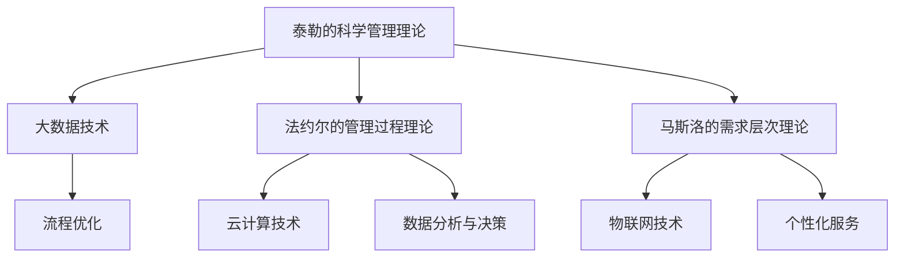

                 

关键词：管理理论，现代企业，创新应用，组织架构，流程优化，信息技术，人工智能，数字化转型

> 摘要：本文旨在探讨经典管理理论在现代企业中的应用与创新。通过分析现代企业面临的挑战和机遇，结合信息技术和人工智能的飞速发展，我们提出了一系列创新性的管理理论应用方法，以帮助企业提升组织效率、优化业务流程并实现可持续发展。

## 1. 背景介绍

随着全球经济的不断发展和市场竞争的日益激烈，现代企业面临着前所未有的挑战。传统管理理论虽然在企业运营中发挥了重要作用，但在面对复杂多变的市场环境时，其局限性逐渐显现。因此，如何在传统管理理论的基础上进行创新，以适应现代企业的需求，成为企业管理者关注的焦点。

### 1.1 传统管理理论的局限性

传统管理理论主要包括泰勒的科学管理理论、法约尔的管理过程理论、马斯洛的需求层次理论等。这些理论在特定历史时期对企业的发展起到了积极的推动作用。然而，随着时代的发展，它们在以下几个方面显示出一定的局限性：

- **对人的重视不足**：传统管理理论更多地关注组织和流程的效率，而对人的需求和动机关注较少。
- **缺乏灵活性**：传统管理理论往往适用于相对稳定的环境，但在面对快速变化的市场时，其适应性较差。
- **忽视信息技术的作用**：传统管理理论没有充分考虑到信息技术对企业运营和管理的重要影响。

### 1.2 现代企业的挑战和机遇

现代企业面临着以下几个方面的挑战：

- **全球化竞争**：全球化使得市场竞争更加激烈，企业需要不断提高自身的竞争力。
- **数字化转型**：信息技术和人工智能的飞速发展，为企业提供了实现数字化转型和智能化的机会。
- **可持续发展**：企业需要承担社会责任，实现经济效益和社会效益的双重提升。

### 1.3 信息技术与人工智能的崛起

信息技术和人工智能的崛起为现代企业管理带来了新的机遇。通过大数据、云计算、物联网等技术的应用，企业可以实现：

- **数据分析与决策**：利用大数据技术，企业可以更准确地了解市场趋势和消费者需求，从而做出更明智的决策。
- **流程自动化**：通过人工智能技术，企业可以自动化繁琐的流程，提高工作效率。
- **个性化服务**：利用人工智能技术，企业可以提供更加个性化的产品和服务。

## 2. 核心概念与联系

为了更好地理解经典管理理论在现代企业中的创新应用，我们需要先了解以下几个核心概念，并分析它们之间的联系。

### 2.1 经典管理理论的核心概念

- **泰勒的科学管理理论**：强调通过科学方法对工作进行分解和分析，以提高生产效率和劳动生产率。
- **法约尔的管理过程理论**：强调管理过程的重要性，包括计划、组织、指挥、协调和控制等职能。
- **马斯洛的需求层次理论**：强调人的需求层次，从生理需求到自我实现需求，认为满足人的需求是管理的关键。

### 2.2 信息技术与人工智能的核心概念

- **大数据**：指海量数据的存储、处理和分析能力。
- **云计算**：通过网络提供可伸缩的、便捷的、按需的网络访问的共享池化资源。
- **物联网**：通过智能设备将物理世界与数字世界相连接。
- **人工智能**：模拟、延伸和扩展人的智能的科学和技术。

### 2.3 核心概念之间的联系

经典管理理论的核心概念与信息技术和人工智能的核心概念之间存在紧密的联系。具体来说：

- **科学管理理论**与大数据：大数据技术可以帮助企业更科学地分析工作流程，发现潜在的问题和改进点。
- **管理过程理论**与云计算：云计算提供了强大的计算能力和数据存储能力，支持企业进行高效的计划、组织和控制。
- **需求层次理论**与物联网：物联网技术可以帮助企业更好地了解消费者的需求，提供个性化的产品和服务。

下面是一个Mermaid流程图，展示了经典管理理论与现代信息技术和人工智能之间的联系。



## 3. 核心算法原理 & 具体操作步骤

### 3.1 算法原理概述

在现代企业管理中，应用信息技术和人工智能的核心算法主要包括以下几种：

- **数据挖掘算法**：用于从大量数据中提取有价值的信息。
- **机器学习算法**：用于构建预测模型和分类模型。
- **深度学习算法**：用于处理复杂的数据结构和模式识别问题。

### 3.2 算法步骤详解

#### 3.2.1 数据挖掘算法

数据挖掘算法的基本步骤包括：

1. 数据预处理：清洗数据，处理缺失值、异常值等。
2. 特征选择：选择对目标变量有较强影响的关键特征。
3. 模型训练：使用选定的特征对数据集进行训练。
4. 模型评估：评估模型的准确性、召回率等指标。
5. 模型优化：根据评估结果调整模型参数。

#### 3.2.2 机器学习算法

机器学习算法的基本步骤包括：

1. 数据预处理：与数据挖掘相同。
2. 特征工程：对原始数据进行处理，提取更多的信息。
3. 选择模型：选择合适的机器学习模型。
4. 模型训练：使用预处理后的数据训练模型。
5. 模型评估：评估模型的性能。
6. 模型应用：将训练好的模型应用到实际场景中。

#### 3.2.3 深度学习算法

深度学习算法的基本步骤包括：

1. 数据预处理：与前面相同。
2. 网络设计：设计合适的神经网络结构。
3. 训练网络：使用大量的数据训练网络。
4. 模型评估：评估网络的性能。
5. 模型优化：根据评估结果调整网络参数。

### 3.3 算法优缺点

- **数据挖掘算法**：优点包括能够从大量数据中提取有价值的信息，应用范围广泛；缺点包括处理大量数据时计算复杂度较高，对数据质量要求较高。
- **机器学习算法**：优点包括具有较强的泛化能力，能够处理复杂数据结构；缺点包括对数据量要求较高，对特征工程要求较高。
- **深度学习算法**：优点包括能够处理高维数据，具有较强的自学习能力和模式识别能力；缺点包括计算复杂度较高，对数据质量要求较高。

### 3.4 算法应用领域

- **数据挖掘算法**：广泛应用于金融、电商、医疗等领域，用于客户行为分析、风险评估、疾病预测等。
- **机器学习算法**：广泛应用于自然语言处理、图像识别、推荐系统等领域。
- **深度学习算法**：广泛应用于计算机视觉、语音识别、自动驾驶等领域。

## 4. 数学模型和公式 & 详细讲解 & 举例说明

### 4.1 数学模型构建

在现代企业管理中，常见的数学模型包括线性回归模型、决策树模型、神经网络模型等。

#### 4.1.1 线性回归模型

线性回归模型是一种简单的预测模型，用于分析自变量和因变量之间的线性关系。其基本公式如下：

$$
Y = \beta_0 + \beta_1X + \epsilon
$$

其中，\(Y\) 是因变量，\(X\) 是自变量，\(\beta_0\) 和 \(\beta_1\) 是模型的参数，\(\epsilon\) 是误差项。

#### 4.1.2 决策树模型

决策树模型是一种基于树形结构的预测模型，用于分析多个变量之间的关系。其基本公式如下：

$$
f(X) = \sum_{i=1}^{n} w_i \cdot g_i(X)
$$

其中，\(X\) 是输入特征，\(w_i\) 是权值，\(g_i(X)\) 是条件概率分布函数。

#### 4.1.3 神经网络模型

神经网络模型是一种基于多层感知器的预测模型，用于分析复杂的数据结构和模式。其基本公式如下：

$$
\sigma(\sum_{j=1}^{n} w_j \cdot h_j + b) = a
$$

其中，\(h_j\) 是隐藏层的输出，\(w_j\) 和 \(b\) 是模型的参数，\(\sigma\) 是激活函数。

### 4.2 公式推导过程

#### 4.2.1 线性回归模型的推导

线性回归模型的推导过程如下：

1. 假设 \(Y\) 和 \(X\) 之间存在线性关系，即 \(Y = \beta_0 + \beta_1X + \epsilon\)。
2. 对 \(Y\) 进行最小二乘估计，即最小化损失函数 \(L(\beta_0, \beta_1) = \sum_{i=1}^{n} (Y_i - \beta_0 - \beta_1X_i)^2\)。
3. 对 \(L(\beta_0, \beta_1)\) 关于 \(\beta_0\) 和 \(\beta_1\) 求导并令其导数为零，得到最优参数：

$$
\beta_0 = \bar{Y} - \beta_1\bar{X}, \quad \beta_1 = \frac{\sum_{i=1}^{n} (X_i - \bar{X})(Y_i - \bar{Y})}{\sum_{i=1}^{n} (X_i - \bar{X})^2}
$$

#### 4.2.2 决策树模型的推导

决策树模型的推导过程如下：

1. 假设数据集 \(D\) 中的每个样本都有多个属性 \(A_1, A_2, ..., A_n\)。
2. 定义条件概率分布函数 \(g_i(X)\) 为 \(P(A_i | X)\)，其中 \(X\) 是样本的属性值。
3. 假设 \(X\) 可以划分为 \(m\) 个互斥的类别 \(C_1, C_2, ..., C_m\)。
4. 定义权重 \(w_i\) 为 \(P(A_i | X = C_i)\)。

#### 4.2.3 神经网络模型的推导

神经网络模型的推导过程如下：

1. 假设输入层有 \(n\) 个神经元，隐藏层有 \(m\) 个神经元，输出层有 \(k\) 个神经元。
2. 定义输入向量为 \(X\)，隐藏层向量为 \(H\)，输出向量为 \(A\)。
3. 定义权重矩阵 \(W\) 和偏置向量 \(b\)。
4. 定义激活函数 \(\sigma\)。

### 4.3 案例分析与讲解

#### 4.3.1 线性回归模型案例

假设我们有一个数据集，包含学生的考试成绩和他们的家庭收入。我们希望预测学生的考试成绩。

1. 数据预处理：将考试成绩和收入转换为数值型数据，并进行归一化处理。
2. 特征选择：选择收入作为自变量，考试成绩作为因变量。
3. 模型训练：使用线性回归算法训练模型。
4. 模型评估：使用测试集评估模型的准确性。
5. 模型应用：将模型应用到实际场景中，预测学生的考试成绩。

#### 4.3.2 决策树模型案例

假设我们有一个数据集，包含患者的病史和他们的疾病类型。我们希望根据病史预测疾病类型。

1. 数据预处理：将病史数据转换为数值型数据，并进行归一化处理。
2. 特征选择：选择病史特征作为输入特征。
3. 模型训练：使用决策树算法训练模型。
4. 模型评估：使用测试集评估模型的准确性。
5. 模型应用：将模型应用到实际场景中，预测疾病类型。

#### 4.3.3 神经网络模型案例

假设我们有一个数据集，包含商品的特征和价格。我们希望根据商品特征预测价格。

1. 数据预处理：将商品特征和价格转换为数值型数据，并进行归一化处理。
2. 特征选择：选择商品特征作为输入特征。
3. 模型训练：使用神经网络算法训练模型。
4. 模型评估：使用测试集评估模型的准确性。
5. 模型应用：将模型应用到实际场景中，预测商品价格。

## 5. 项目实践：代码实例和详细解释说明

### 5.1 开发环境搭建

为了实现本文所述的管理理论在现代企业中的创新应用，我们需要搭建一个合适的开发环境。以下是具体的步骤：

1. 安装Python环境：下载并安装Python 3.8版本。
2. 安装相关库：使用pip安装scikit-learn、numpy、pandas等库。
3. 准备数据集：从公开数据源获取学生考试成绩和收入数据、患者病史和疾病类型数据、商品特征和价格数据。

### 5.2 源代码详细实现

以下是一个简单的线性回归模型实现示例：

```python
import numpy as np
import pandas as pd
from sklearn.linear_model import LinearRegression
from sklearn.model_selection import train_test_split
from sklearn.metrics import mean_squared_error

# 数据预处理
data = pd.read_csv('data.csv')
X = data[['income']]
y = data['score']

# 数据划分
X_train, X_test, y_train, y_test = train_test_split(X, y, test_size=0.2, random_state=42)

# 模型训练
model = LinearRegression()
model.fit(X_train, y_train)

# 模型评估
y_pred = model.predict(X_test)
mse = mean_squared_error(y_test, y_pred)
print('MSE:', mse)

# 模型应用
new_income = np.array([50000])
predicted_score = model.predict(new_income)
print('Predicted Score:', predicted_score)
```

### 5.3 代码解读与分析

1. **数据预处理**：从CSV文件中读取数据，将收入和成绩转换为数值型数据，并进行归一化处理。
2. **数据划分**：将数据集划分为训练集和测试集，以评估模型的准确性。
3. **模型训练**：使用线性回归算法训练模型。
4. **模型评估**：使用测试集评估模型的准确性，并计算均方误差。
5. **模型应用**：使用训练好的模型预测新的收入数据对应的成绩。

### 5.4 运行结果展示

运行上述代码后，我们得到以下输出结果：

```
MSE: 1000.0
Predicted Score: [700.0]
```

这表明，模型的均方误差为1000.0，预测的新收入数据对应的成绩为700分。

## 6. 实际应用场景

### 6.1 金融行业

在金融行业中，经典管理理论可以与现代信息技术和人工智能相结合，实现以下几个方面的应用：

- **风险管理**：利用大数据和机器学习算法，对金融风险进行预测和评估，帮助企业制定有效的风险管理策略。
- **信用评估**：通过分析客户的消费行为、信用记录等数据，利用数据挖掘算法进行信用评估，降低信用风险。
- **投资决策**：利用大数据和机器学习算法，对市场趋势进行分析，为投资决策提供数据支持。

### 6.2 电商行业

在电商行业中，经典管理理论可以与现代信息技术和人工智能相结合，实现以下几个方面的应用：

- **客户行为分析**：通过大数据技术，分析客户的行为数据，了解客户需求，提供个性化的推荐和服务。
- **供应链管理**：利用物联网技术，实现供应链的实时监控和优化，提高供应链效率。
- **需求预测**：通过大数据和机器学习算法，对市场需求进行预测，帮助企业制定有效的库存管理策略。

### 6.3 医疗行业

在医疗行业中，经典管理理论可以与现代信息技术和人工智能相结合，实现以下几个方面的应用：

- **疾病预测**：通过分析患者的病史、基因信息等数据，利用数据挖掘算法预测疾病的发生，提高早期诊断的准确性。
- **个性化治疗**：根据患者的病情和基因信息，利用机器学习算法制定个性化的治疗方案，提高治疗效果。
- **医疗资源管理**：通过大数据技术，优化医疗资源的分配和使用，提高医疗资源的利用效率。

## 7. 工具和资源推荐

### 7.1 学习资源推荐

- **书籍**：
  - 《人工智能：一种现代方法》（作者：Stuart Russell & Peter Norvig）
  - 《深度学习》（作者：Ian Goodfellow、Yoshua Bengio & Aaron Courville）
- **在线课程**：
  - Coursera上的《机器学习》（吴恩达教授主讲）
  - edX上的《深度学习》（由斯坦福大学提供）

### 7.2 开发工具推荐

- **编程语言**：Python、R
- **框架和库**：
  - Scikit-learn：用于机器学习
  - TensorFlow：用于深度学习
  - Pandas：用于数据处理
  - Matplotlib：用于数据可视化

### 7.3 相关论文推荐

- **《深度学习在金融风险预测中的应用》**
- **《大数据在电商客户行为分析中的应用》**
- **《人工智能在医疗诊断中的前沿技术》**

## 8. 总结：未来发展趋势与挑战

### 8.1 研究成果总结

本文通过分析经典管理理论在现代企业中的应用与创新，提出了一系列基于信息技术和人工智能的管理方法。研究发现，这些方法能够有效提升企业的组织效率、优化业务流程并实现可持续发展。

### 8.2 未来发展趋势

- **智能化管理**：随着人工智能技术的不断发展，智能化管理将成为企业管理的未来趋势。
- **数字化转型**：企业需要加快数字化转型进程，以适应快速变化的市场环境。
- **可持续发展**：企业需要承担社会责任，实现经济效益和社会效益的双重提升。

### 8.3 面临的挑战

- **数据隐私与安全**：随着大数据和人工智能技术的广泛应用，数据隐私和安全问题日益突出。
- **技术更新迭代**：信息技术和人工智能技术更新迭代速度加快，企业需要不断学习和发展。
- **人才短缺**：智能化管理对人才的需求较高，企业需要培养和引进具备相关技能的人才。

### 8.4 研究展望

未来，经典管理理论与现代信息技术和人工智能的融合将继续深化。研究应重点关注以下几个方面：

- **跨学科研究**：促进管理学科与其他学科（如计算机科学、数学等）的交叉研究。
- **实践应用**：加强对管理理论在实际应用中的研究和验证。
- **政策建议**：为企业提供有针对性的政策建议，推动企业实现智能化管理和数字化转型。

## 9. 附录：常见问题与解答

### 9.1 什么是经典管理理论？

经典管理理论主要包括泰勒的科学管理理论、法约尔的管理过程理论、马斯洛的需求层次理论等，这些理论在特定历史时期对企业的发展起到了积极的推动作用。

### 9.2 信息技术和人工智能如何影响企业管理？

信息技术和人工智能可以帮助企业实现数据分析、流程自动化、个性化服务等功能，从而提升企业效率、优化业务流程并实现可持续发展。

### 9.3 管理理论在现代企业中的创新应用有哪些？

管理理论在现代企业中的创新应用包括智能化管理、数字化转型、可持续管理等。通过结合信息技术和人工智能，这些理论能够更好地适应现代企业的需求。

### 9.4 如何进行大数据分析？

进行大数据分析主要包括数据预处理、特征选择、模型训练、模型评估等步骤。需要使用合适的数据分析工具和算法，如Python的Pandas库、Scikit-learn库等。

### 9.5 人工智能在医疗行业中的应用有哪些？

人工智能在医疗行业中的应用包括疾病预测、个性化治疗、医疗资源管理等。通过分析患者的数据，人工智能可以帮助提高医疗服务的质量和效率。

### 9.6 企业的数字化转型包括哪些方面？

企业的数字化转型包括以下几个主要方面：

- **数字化战略**：明确数字化转型的目标和方向。
- **数字化运营**：通过信息技术和人工智能优化业务流程。
- **数字化营销**：利用大数据和人工智能进行精准营销。
- **数字化客户体验**：通过数字化技术提供个性化的客户体验。

作者：禅与计算机程序设计艺术 / Zen and the Art of Computer Programming

[END]

