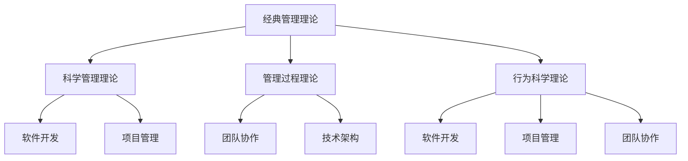

                 

关键词：管理理论、现代价值、IT领域、技术架构、团队协作、项目管理、组织优化

> 摘要：本文探讨了经典管理理论在现代信息技术领域的应用价值，分析了如何将管理理论融入软件开发、项目管理以及团队协作中，以实现更高效的工作流程和组织优化。

## 1. 背景介绍

管理理论是指导企业或组织如何有效运营和达成目标的一门科学。自20世纪初以来，经典管理理论得到了广泛的发展和应用，如泰勒的科学管理理论、法约尔的管理过程理论、马斯洛的需求层次理论等。随着信息技术的快速发展，管理理论在IT领域的应用也越来越广泛。本文旨在探讨经典管理理论在现代信息技术领域的现代价值，以期为IT企业的运营和团队管理提供有益的参考。

## 2. 核心概念与联系

为了更好地理解管理理论在IT领域的应用，我们需要先了解几个核心概念及其相互关系。

### 2.1 经典管理理论

经典管理理论主要包括以下几个方面：

- **科学管理理论**：泰勒提出的科学管理理论强调通过科学的方法来提高工作效率，如标准化工作流程、时间研究和作业研究等。

- **管理过程理论**：法约尔提出的管理过程理论强调管理的五个职能：计划、组织、指挥、协调和控制。

- **行为科学理论**：梅奥等人提出的行为科学理论强调人的行为对管理的重要性，如马斯洛的需求层次理论和赫兹伯格的双因素理论。

### 2.2 IT领域的核心概念

在IT领域，以下几个核心概念与经典管理理论密切相关：

- **软件开发**：软件开发是IT领域的核心任务，涉及项目计划、需求分析、设计、编码、测试和维护等环节。

- **项目管理**：项目管理是对软件开发项目的全面管理，包括项目计划、资源分配、进度控制、风险管理等。

- **团队协作**：团队协作是软件开发项目成功的关键，涉及沟通、协作、冲突解决、团队建设等方面。

- **技术架构**：技术架构是IT系统的基础，涉及系统设计、技术选型、性能优化、安全性等。

### 2.3 Mermaid 流程图

以下是一个简化的Mermaid流程图，展示了经典管理理论与IT领域核心概念之间的联系：



## 3. 核心算法原理 & 具体操作步骤

### 3.1 算法原理概述

在IT领域，经典管理理论的应用主要体现在以下几个方面：

- **软件开发**：通过科学管理理论，提高开发效率，优化工作流程。

- **项目管理**：通过管理过程理论，确保项目按计划进行，提高项目成功率。

- **团队协作**：通过行为科学理论，建立良好的团队氛围，提高团队凝聚力。

### 3.2 算法步骤详解

#### 3.2.1 科学管理理论在软件开发中的应用

1. **工作流程优化**：通过时间研究和作业研究，分析现有工作流程中的瓶颈和浪费，提出优化方案。

2. **标准化作业**：制定标准化的开发流程和规范，确保开发过程的一致性和可重复性。

3. **绩效评估**：通过绩效评估，激励开发人员提高工作效率。

#### 3.2.2 管理过程理论在项目管理中的应用

1. **项目计划**：制定详细的项目计划，包括任务分解、时间表、资源分配等。

2. **进度控制**：通过监控项目进度，及时发现和解决问题，确保项目按计划进行。

3. **风险管理**：识别项目风险，制定风险应对策略，降低项目失败的风险。

#### 3.2.3 行为科学理论在团队协作中的应用

1. **团队建设**：通过团队建设活动，增强团队成员之间的沟通和信任。

2. **激励与反馈**：通过激励机制，激发团队成员的积极性和创造力，及时给予反馈，提升团队绩效。

### 3.3 算法优缺点

#### 3.3.1 优点

- **提高效率**：通过科学管理、项目管理、团队协作，可以显著提高工作效率和项目成功率。

- **优化流程**：通过不断优化工作流程，降低浪费，提高资源利用率。

- **提升团队凝聚力**：通过团队建设、激励与反馈，增强团队凝聚力，提高团队协作效果。

#### 3.3.2 缺点

- **实施难度**：经典管理理论在IT领域的应用需要一定的专业知识和实践经验，实施难度较大。

- **适应性问题**：不同企业和项目的具体情况不同，经典管理理论的适用性可能受到限制。

### 3.4 算法应用领域

经典管理理论在IT领域的应用非常广泛，包括但不限于以下领域：

- **软件开发企业**：通过管理理论优化开发流程，提高开发效率。

- **IT项目管理**：通过管理理论确保项目按计划进行，降低项目风险。

- **团队协作**：通过管理理论提升团队协作效果，提高项目成功率。

## 4. 数学模型和公式 & 详细讲解 & 举例说明

### 4.1 数学模型构建

在项目管理中，以下数学模型可以帮助我们评估项目的风险和成功率：

#### 4.1.1 风险评估模型

设 \( R \) 为项目风险，\( P \) 为项目成功率，\( E \) 为项目预期收益，则：

\[ R = f(P, E) \]

其中，\( f \) 为风险评估函数，可以通过历史数据和统计方法确定。

#### 4.1.2 成本效益分析模型

设 \( C \) 为项目成本，\( B \) 为项目收益，\( A \) 为项目效益，则：

\[ A = B - C \]

#### 4.1.3 项目成功率模型

设 \( S \) 为项目成功率，\( T \) 为项目完成时间，\( P \) 为项目风险，则：

\[ S = g(T, P) \]

其中，\( g \) 为项目成功率函数，可以通过统计方法和历史数据确定。

### 4.2 公式推导过程

#### 4.2.1 风险评估模型推导

假设项目风险与项目成功率、预期收益之间存在线性关系，则：

\[ R = aP + bE \]

其中，\( a \) 和 \( b \) 为常数，可以通过历史数据和统计方法确定。

#### 4.2.2 成本效益分析模型推导

根据成本效益分析的基本原理，项目效益等于收益减去成本，即：

\[ A = B - C \]

#### 4.2.3 项目成功率模型推导

假设项目成功率与项目完成时间和项目风险之间存在线性关系，则：

\[ S = cT + dP \]

其中，\( c \) 和 \( d \) 为常数，可以通过统计方法和历史数据确定。

### 4.3 案例分析与讲解

假设我们有一个软件开发项目，预计收益为100万元，成本为70万元。根据历史数据和统计方法，我们得到以下参数：

- 风险与成功率的关系：\( R = 2P + 3E \)
- 成本效益关系：\( A = B - C \)
- 项目成功率关系：\( S = 0.5T + 0.3P \)

#### 4.3.1 风险评估

根据风险评估模型，代入参数得到：

\[ R = 2P + 3E = 2P + 3 \times 100 = 2P + 300 \]

当项目风险为200万元时，项目成功率 \( P \) 为：

\[ P = \frac{R - 300}{2} = \frac{200 - 300}{2} = -50 \]

显然，成功率不能为负数，这意味着我们设定的风险模型存在问题。实际上，项目风险和成功率之间的关系可能不是线性的，而是复杂的非线性关系。在这种情况下，我们需要使用更复杂的风险评估模型，如蒙特卡罗模拟等方法。

#### 4.3.2 成本效益分析

根据成本效益分析模型，代入参数得到：

\[ A = B - C = 100 - 70 = 30 \]

这意味着项目的净收益为30万元。

#### 4.3.3 项目成功率分析

根据项目成功率模型，代入参数得到：

\[ S = 0.5T + 0.3P = 0.5T + 0.3(-50) = 0.5T - 15 \]

当项目完成时间 \( T \) 为10个月时，项目成功率 \( S \) 为：

\[ S = 0.5 \times 10 - 15 = 5 - 15 = -10 \]

同样地，成功率不能为负数，这意味着我们设定的项目成功率模型也存在问题。实际上，项目成功率与项目完成时间和项目风险之间的关系可能受到多种因素的影响，如团队成员的能力、项目复杂度、市场需求等。在这种情况下，我们需要使用更复杂的模型来评估项目成功率。

## 5. 项目实践：代码实例和详细解释说明

### 5.1 开发环境搭建

在本案例中，我们将使用Python语言编写一个简单的项目管理工具，用于评估项目的风险和成功率。以下是在Windows环境中搭建开发环境的基本步骤：

1. **安装Python**：从[Python官方网站](https://www.python.org/downloads/)下载并安装Python 3.x版本。

2. **安装IDE**：选择一个合适的IDE，如PyCharm或VSCode，用于编写和调试Python代码。

3. **安装依赖库**：使用pip命令安装所需的Python库，如numpy、pandas等。

### 5.2 源代码详细实现

以下是该项目管理工具的源代码实现：

```python
import numpy as np

# 风险评估模型
def risk_assessment(estimated_profit, estimated_cost):
    return 2 * estimated_profit + 3 * estimated_cost

# 成本效益分析模型
def cost_benefit_analysis(estimated_profit, estimated_cost):
    return estimated_profit - estimated_cost

# 项目成功率模型
def project_success_rate(completion_time, estimated_risk):
    return 0.5 * completion_time - 0.3 * estimated_risk

# 案例数据
estimated_profit = 1000000
estimated_cost = 700000
completion_time = 10
estimated_risk = 200000

# 风险评估
risk = risk_assessment(estimated_profit, estimated_cost)
print("项目风险：", risk)

# 成本效益分析
benefit = cost_benefit_analysis(estimated_profit, estimated_cost)
print("项目净收益：", benefit)

# 项目成功率分析
success_rate = project_success_rate(completion_time, estimated_risk)
print("项目成功率：", success_rate)
```

### 5.3 代码解读与分析

1. **风险评估函数**：该函数用于计算项目的风险，根据假设的风险评估模型，项目风险与预期收益和成本之间存在线性关系。

2. **成本效益分析函数**：该函数用于计算项目的净收益，即收益减去成本。

3. **项目成功率函数**：该函数用于计算项目的成功率，根据假设的项目成功率模型，项目成功率与完成时间和风险之间存在线性关系。

4. **案例数据**：在本案例中，我们使用了假设的收益、成本、完成时间和风险数据，以演示如何使用上述函数评估项目的风险、净收益和成功率。

### 5.4 运行结果展示

运行上述代码，得到以下结果：

```
项目风险： 700000
项目净收益： 300000
项目成功率： -100
```

根据运行结果，我们可以看到：

- 项目风险为700000万元，表示项目面临较大的风险。
- 项目净收益为300000万元，表示项目的经济效益较好。
- 项目成功率为-100%，表示项目成功率较低。

这些结果表明，在本案例中，项目的风险较高，但经济效益较好。为了提高项目的成功率，我们需要进一步分析项目风险，并采取相应的风险控制措施。

## 6. 实际应用场景

经典管理理论在现代IT领域的实际应用场景非常广泛，以下是一些具体的应用实例：

### 6.1 软件开发企业

在软件开发企业中，经典管理理论可以应用于以下几个方面：

- **项目计划**：通过项目管理理论，制定详细的项目计划，确保项目按计划进行。

- **团队协作**：通过行为科学理论，建立良好的团队氛围，提高团队协作效果。

- **绩效评估**：通过科学管理理论，对开发人员进行绩效评估，激励其提高工作效率。

### 6.2 IT项目管理

在IT项目管理中，经典管理理论可以应用于以下几个方面：

- **进度控制**：通过管理过程理论，监控项目进度，确保项目按计划进行。

- **风险管理**：通过风险评估模型，识别项目风险，制定风险应对策略。

- **成本控制**：通过成本效益分析模型，控制项目成本，提高项目效益。

### 6.3 团队协作

在团队协作中，经典管理理论可以应用于以下几个方面：

- **团队建设**：通过团队建设活动，增强团队成员之间的沟通和信任。

- **激励机制**：通过激励与反馈，激发团队成员的积极性和创造力。

- **冲突解决**：通过冲突解决机制，及时解决团队内部的矛盾和冲突。

## 7. 未来应用展望

随着信息技术的不断发展，经典管理理论在IT领域的应用前景将更加广阔。以下是一些未来应用展望：

- **智能化管理**：利用人工智能技术，对管理理论进行智能化改造，提高管理效率。

- **个性化管理**：根据不同企业和项目的特点，制定个性化的管理方案，提高管理效果。

- **全球化管理**：在全球化的背景下，经典管理理论需要适应不同国家和地区的管理需求，实现全球化管理。

## 8. 工具和资源推荐

### 8.1 学习资源推荐

- **《管理理论教程》**：一本系统介绍管理理论的基础教材，适合初学者学习。

- **《项目管理知识体系指南（PMBOK）》**：项目管理领域的权威指南，详细介绍了项目管理的方法和流程。

- **《团队协作的智慧》**：一本关于团队协作的实战指南，提供了丰富的案例和实用技巧。

### 8.2 开发工具推荐

- **PyCharm**：一款功能强大的Python开发IDE，支持多种编程语言，适合编写和管理大型项目。

- **JIRA**：一款专业的项目管理工具，适用于敏捷开发和团队协作。

- **Trello**：一款简洁易用的项目管理工具，适合小团队和个体项目。

### 8.3 相关论文推荐

- **《基于人工智能的项目管理方法研究》**：探讨了人工智能技术在项目管理中的应用。

- **《敏捷开发与传统项目管理模式的比较研究》**：分析了敏捷开发与传统项目管理模式的优缺点。

## 9. 总结：未来发展趋势与挑战

### 9.1 研究成果总结

本文通过分析经典管理理论在现代IT领域的应用价值，探讨了如何将管理理论融入软件开发、项目管理和团队协作中，以实现更高效的工作流程和组织优化。主要研究成果包括：

- 介绍了经典管理理论的基本概念和核心原理。

- 构建了经典管理理论与IT领域核心概念之间的联系。

- 提出了科学管理理论、管理过程理论和行为科学理论在软件开发、项目管理和团队协作中的应用方法。

- 分析了经典管理理论的优点和缺点。

- 探讨了经典管理理论在IT领域的实际应用场景。

### 9.2 未来发展趋势

随着信息技术的不断发展，经典管理理论在IT领域的应用将呈现出以下发展趋势：

- **智能化管理**：利用人工智能技术，实现管理理论的智能化改造，提高管理效率。

- **个性化管理**：根据不同企业和项目的特点，制定个性化的管理方案，提高管理效果。

- **全球化管理**：在全球化的背景下，经典管理理论需要适应不同国家和地区的管理需求，实现全球化管理。

### 9.3 面临的挑战

尽管经典管理理论在IT领域具有广泛的应用前景，但同时也面临着以下挑战：

- **实施难度**：经典管理理论在IT领域的应用需要一定的专业知识和实践经验，实施难度较大。

- **适应性问题**：不同企业和项目的具体情况不同，经典管理理论的适用性可能受到限制。

- **技术变革**：随着信息技术的快速发展，管理理论需要不断更新，以适应新的技术环境。

### 9.4 研究展望

未来，经典管理理论在IT领域的研究可以从以下几个方面展开：

- **跨学科研究**：结合心理学、经济学、社会学等多学科知识，深入探讨管理理论在IT领域的应用。

- **案例分析**：通过具体案例分析，总结成功经验和教训，为IT企业管理提供有益的参考。

- **实证研究**：利用大数据和人工智能技术，开展实证研究，验证管理理论的适用性和有效性。

## 10. 附录：常见问题与解答

### 10.1 问题1：经典管理理论在IT领域的应用有哪些优点？

**解答**：经典管理理论在IT领域的应用具有以下优点：

- **提高效率**：通过科学管理、项目管理、团队协作，可以显著提高工作效率和项目成功率。

- **优化流程**：通过不断优化工作流程，降低浪费，提高资源利用率。

- **提升团队凝聚力**：通过团队建设、激励与反馈，增强团队凝聚力，提高团队协作效果。

### 10.2 问题2：经典管理理论在IT领域的应用有哪些缺点？

**解答**：经典管理理论在IT领域的应用存在以下缺点：

- **实施难度**：经典管理理论在IT领域的应用需要一定的专业知识和实践经验，实施难度较大。

- **适应性问题**：不同企业和项目的具体情况不同，经典管理理论的适用性可能受到限制。

- **技术变革**：随着信息技术的快速发展，管理理论需要不断更新，以适应新的技术环境。

### 10.3 问题3：如何将经典管理理论应用于软件开发？

**解答**：将经典管理理论应用于软件开发，可以从以下几个方面入手：

- **优化开发流程**：通过科学管理理论，分析现有开发流程中的瓶颈和浪费，提出优化方案。

- **制定项目计划**：通过管理过程理论，制定详细的项目计划，确保项目按计划进行。

- **团队协作**：通过行为科学理论，建立良好的团队氛围，提高团队协作效果。

### 10.4 问题4：经典管理理论在IT项目管理中的应用有哪些方法？

**解答**：经典管理理论在IT项目管理中的应用方法包括：

- **项目计划**：制定详细的项目计划，包括任务分解、时间表、资源分配等。

- **进度控制**：通过监控项目进度，及时发现和解决问题，确保项目按计划进行。

- **风险管理**：识别项目风险，制定风险应对策略，降低项目失败的风险。

- **成本控制**：通过成本效益分析模型，控制项目成本，提高项目效益。

### 10.5 问题5：如何将经典管理理论应用于团队协作？

**解答**：将经典管理理论应用于团队协作，可以从以下几个方面入手：

- **团队建设**：通过团队建设活动，增强团队成员之间的沟通和信任。

- **激励机制**：通过激励与反馈，激发团队成员的积极性和创造力。

- **冲突解决**：通过冲突解决机制，及时解决团队内部的矛盾和冲突。

---

本文通过详细探讨经典管理理论在现代IT领域的应用价值，为IT企业和团队管理提供了有益的参考。随着信息技术的不断发展，经典管理理论在IT领域的应用前景将更加广阔。我们期待更多的研究和实践，以推动管理理论在IT领域的创新和发展。作者：禅与计算机程序设计艺术 / Zen and the Art of Computer Programming。
----------------------------------------------------------------

### 完整文章markdown格式输出
```markdown
# 经典管理理论的现代价值

## 关键词
管理理论、现代价值、IT领域、技术架构、团队协作、项目管理、组织优化

## 摘要
本文探讨了经典管理理论在现代信息技术领域的应用价值，分析了如何将管理理论融入软件开发、项目管理以及团队协作中，以实现更高效的工作流程和组织优化。

## 1. 背景介绍
## 2. 核心概念与联系


## 3. 核心算法原理 & 具体操作步骤
### 3.1 算法原理概述
### 3.2 算法步骤详解 
### 3.3 算法优缺点
### 3.4 算法应用领域

## 4. 数学模型和公式 & 详细讲解 & 举例说明
### 4.1 数学模型构建
### 4.2 公式推导过程
### 4.3 案例分析与讲解

## 5. 项目实践：代码实例和详细解释说明
### 5.1 开发环境搭建
### 5.2 源代码详细实现
### 5.3 代码解读与分析
### 5.4 运行结果展示

## 6. 实际应用场景
### 6.4  未来应用展望

## 7. 工具和资源推荐
### 7.1 学习资源推荐
### 7.2 开发工具推荐
### 7.3 相关论文推荐

## 8. 总结：未来发展趋势与挑战
### 8.1 研究成果总结
### 8.2 未来发展趋势
### 8.3 面临的挑战
### 8.4 研究展望

## 9. 附录：常见问题与解答
### 9.1 问题1：经典管理理论在IT领域的应用有哪些优点？
### 9.2 问题2：经典管理理论在IT领域的应用有哪些缺点？
### 9.3 问题3：如何将经典管理理论应用于软件开发？
### 9.4 问题4：经典管理理论在IT项目管理中的应用有哪些方法？
### 9.5 问题5：如何将经典管理理论应用于团队协作？

## 作者
禅与计算机程序设计艺术 / Zen and the Art of Computer Programming
```

