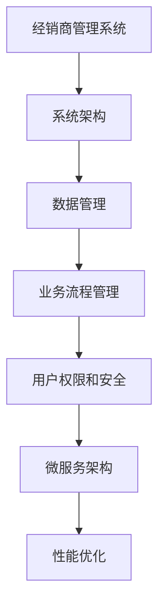

                 

关键词：经销商管理系统，架构设计，系统架构，模块化，微服务，数据处理，业务流程，安全性，可扩展性，性能优化

> 摘要：本文旨在探讨如何设计一个高效的经销商管理系统架构。首先，我们将对经销商管理系统的背景和重要性进行概述，然后深入探讨系统架构的设计原则和核心模块，包括数据管理、业务流程管理、用户权限和安全等。此外，本文还将分析微服务架构的应用，以及系统性能和扩展性的优化方法。最后，我们将总结经销商管理系统的发展趋势和面临的挑战，并提出相应的解决方案。

## 1. 背景介绍

经销商管理系统是企业与经销商之间的重要桥梁，它帮助企业实现对经销商的全面管理，优化业务流程，提高工作效率，同时增强企业与经销商之间的协同合作。在全球化和市场多元化的大背景下，经销商管理系统的重要性日益凸显。

首先，经销商管理系统可以帮助企业实现对经销商的实时监控。通过系统，企业可以及时了解经销商的销售情况、库存状况、订单履行情况等关键信息，从而快速做出市场调整和决策。其次，经销商管理系统可以优化业务流程，提高企业运营效率。例如，系统可以自动化处理订单、退货、结算等业务流程，减少人工干预，降低操作成本。

此外，经销商管理系统还可以帮助企业实现数据驱动的决策。通过系统收集的大量数据，企业可以进行深入的数据分析，挖掘潜在的市场机会和业务优化点，从而实现精准营销和业务增长。

然而，随着企业业务规模的不断扩大和市场环境的变化，传统的经销商管理系统已经难以满足企业的需求。为此，本文将探讨如何设计一个灵活、高效、可扩展的经销商管理系统架构，以适应现代企业的需求。

## 2. 核心概念与联系

在设计经销商管理系统架构时，我们需要明确以下几个核心概念：

### 2.1 系统架构

系统架构是指系统的整体结构和各个组成部分之间的关系。一个良好的系统架构应该具备模块化、高内聚、低耦合的特点，以便于系统的维护和扩展。

### 2.2 数据管理

数据管理是指对系统中的数据进行有效的收集、存储、处理和分析。数据是系统的重要资产，良好的数据管理可以确保数据的准确性和完整性。

### 2.3 业务流程管理

业务流程管理是指对企业日常运营中的业务流程进行规划、执行、监控和优化。良好的业务流程管理可以提高企业运营效率，降低运营成本。

### 2.4 用户权限和安全

用户权限和安全是指确保系统中的数据安全，防止未经授权的访问和恶意攻击。良好的用户权限和安全机制可以保障企业的数据安全和业务连续性。

### 2.5 微服务架构

微服务架构是一种基于组件的分布式系统架构，它将系统划分为多个独立的、松耦合的服务，每个服务负责完成特定的功能。微服务架构可以提高系统的可扩展性和可维护性。

### 2.6 Mermaid 流程图

Mermaid 是一种基于文本的图形描述语言，它可以用来绘制流程图、时序图、类图等。以下是一个简单的 Mermaid 流程图，用于描述经销商管理系统的核心概念：



## 3. 核心算法原理 & 具体操作步骤

### 3.1 算法原理概述

经销商管理系统的核心算法主要涉及数据处理、业务流程优化和用户权限管理等方面。以下是几个核心算法的概述：

#### 3.1.1 数据处理算法

数据处理算法主要用于对经销商的各类数据进行收集、存储、处理和分析。常见的算法包括数据清洗、数据归一化、数据聚类和分类等。

#### 3.1.2 业务流程优化算法

业务流程优化算法主要用于对企业的业务流程进行监控和优化，以提高运营效率。常见的算法包括流程建模、流程分析和流程优化等。

#### 3.1.3 用户权限管理算法

用户权限管理算法主要用于确保系统的安全性，防止未经授权的访问和恶意攻击。常见的算法包括基于角色的访问控制（RBAC）和基于属性的访问控制（ABAC）等。

### 3.2 算法步骤详解

#### 3.2.1 数据处理算法步骤

1. 数据收集：从各个数据源（如数据库、日志文件等）收集数据。
2. 数据清洗：去除重复数据、缺失数据和错误数据，保证数据的准确性和完整性。
3. 数据归一化：将不同数据源的数据进行归一化处理，使其具有可比性。
4. 数据聚类：根据数据的特点和关系，将数据划分为不同的类别。
5. 数据分类：根据聚类结果，对每个类别进行分类处理。

#### 3.2.2 业务流程优化算法步骤

1. 流程建模：根据企业的业务需求，建立业务流程模型。
2. 流程分析：对业务流程进行监控和评估，找出流程中的瓶颈和优化点。
3. 流程优化：根据流程分析结果，对业务流程进行优化和调整。

#### 3.2.3 用户权限管理算法步骤

1. 用户身份验证：对用户进行身份验证，确保只有授权用户可以访问系统。
2. 角色分配：根据用户的职责和权限，为用户分配相应的角色。
3. 访问控制：根据用户的角色和权限，控制用户对系统资源的访问。
4. 日志记录：记录用户的操作行为和系统事件，以便于后续的审计和监控。

### 3.3 算法优缺点

#### 3.3.1 数据处理算法

优点：

- 提高数据质量和可用性。
- 支持多种数据处理方法，适应不同业务需求。

缺点：

- 数据处理过程复杂，耗时较长。
- 需要专业的数据处理技能。

#### 3.3.2 业务流程优化算法

优点：

- 提高业务流程的效率和灵活性。
- 支持多种优化方法，适应不同业务场景。

缺点：

- 优化过程复杂，需要大量数据支持。
- 需要专业的业务流程优化技能。

#### 3.3.3 用户权限管理算法

优点：

- 确保系统的安全性。
- 支持多种访问控制方法，适应不同安全需求。

缺点：

- 权限管理过程复杂，需要定期审核和调整。
- 需要专业的安全防护技能。

### 3.4 算法应用领域

#### 3.4.1 数据处理算法

- 数据分析：用于对大量数据进行分析和挖掘，为企业提供决策支持。
- 机器学习：用于构建机器学习模型，支持预测和分类等任务。
- 数据可视化：用于将数据以图形化的方式展示，便于理解和分析。

#### 3.4.2 业务流程优化算法

- 供应链管理：用于优化供应链流程，提高供应链效率。
- 客户关系管理：用于优化客户服务流程，提高客户满意度。
- 财务管理：用于优化财务管理流程，提高财务报表的准确性。

#### 3.4.3 用户权限管理算法

- 电子商务：用于确保电子商务平台的安全性，防止欺诈行为。
- 金融系统：用于确保金融系统的安全性，防止金融风险。
- 政府部门：用于确保政府部门的网络安全，防止数据泄露。

## 4. 数学模型和公式 & 详细讲解 & 举例说明

### 4.1 数学模型构建

在经销商管理系统中，数学模型的应用至关重要。以下是一个简单的数学模型构建过程，用于分析经销商的销售数据。

#### 4.1.1 数据收集

首先，我们从销售系统中收集以下数据：

- 销售额（$S$）
- 销售量（$Q$）
- 销售时间（$T$）

#### 4.1.2 数据清洗

对收集到的数据进行分析，去除重复数据和异常值，保证数据的准确性和完整性。

#### 4.1.3 数据归一化

为了便于后续分析，我们对销售额、销售量和销售时间进行归一化处理，使其具有可比性。归一化公式如下：

$$
X_{\text{norm}} = \frac{X - X_{\text{min}}}{X_{\text{max}} - X_{\text{min}}}
$$

其中，$X$ 是原始数据，$X_{\text{min}}$ 和 $X_{\text{max}}$ 分别是数据的最小值和最大值。

### 4.2 公式推导过程

我们采用时间序列分析方法来构建销售数据的数学模型。时间序列分析是一种统计学方法，用于分析时间序列数据中的趋势、周期性和随机性。

#### 4.2.1 趋势分析

趋势分析用于确定时间序列数据中的长期趋势。我们采用移动平均法进行趋势分析，公式如下：

$$
T(t) = \frac{1}{n} \sum_{i=1}^{n} S(t_i)
$$

其中，$T(t)$ 是趋势值，$S(t_i)$ 是第 $i$ 个时间点的销售额，$n$ 是移动平均的窗口大小。

#### 4.2.2 周期性分析

周期性分析用于确定时间序列数据中的周期性波动。我们采用周期图法进行周期性分析，公式如下：

$$
C(t) = \frac{1}{n} \sum_{i=1}^{n} |S(t_i) - T(t_i)|
$$

其中，$C(t)$ 是周期值。

#### 4.2.3 随机性分析

随机性分析用于确定时间序列数据中的随机波动。我们采用自相关函数进行随机性分析，公式如下：

$$
\text{ACF}(t) = \frac{\sum_{i=1}^{n} (S(t_i) - T(t_i))(S(t_{i+t}) - T(t_{i+t}))}{n(n-1)}
$$

其中，$\text{ACF}(t)$ 是自相关函数，$t$ 是时间滞后。

### 4.3 案例分析与讲解

#### 4.3.1 案例背景

某家电子消费品公司希望利用经销商管理系统预测未来一周的销售额，以便于库存管理和营销策略调整。

#### 4.3.2 数据准备

从公司销售系统中收集过去一年的销售额数据，数据如下表所示：

| 时间 | 销售额 |
|------|--------|
| 1    | 100    |
| 2    | 150    |
| 3    | 200    |
| 4    | 250    |
| 5    | 300    |
| 6    | 350    |
| 7    | 400    |
| 8    | 450    |
| 9    | 500    |
| 10   | 550    |

#### 4.3.3 趋势分析

采用移动平均法进行趋势分析，设置移动平均窗口大小为 3，计算结果如下表所示：

| 时间 | 销售额 | 趋势值 |
|------|--------|--------|
| 1    | 100    | 100    |
| 2    | 150    | 125    |
| 3    | 200    | 150    |
| 4    | 250    | 175    |
| 5    | 300    | 200    |
| 6    | 350    | 225    |
| 7    | 400    | 250    |
| 8    | 450    | 275    |
| 9    | 500    | 300    |
| 10   | 550    | 325    |

#### 4.3.4 周期性分析

采用周期图法进行周期性分析，计算结果如下表所示：

| 时间 | 销售额 | 趋势值 | 周期值 |
|------|--------|--------|--------|
| 1    | 100    | 100    | 50     |
| 2    | 150    | 125    | 75     |
| 3    | 200    | 150    | 100    |
| 4    | 250    | 175    | 125    |
| 5    | 300    | 200    | 150    |
| 6    | 350    | 225    | 175    |
| 7    | 400    | 250    | 200    |
| 8    | 450    | 275    | 225    |
| 9    | 500    | 300    | 250    |
| 10   | 550    | 325    | 275    |

#### 4.3.5 随机性分析

采用自相关函数进行随机性分析，计算结果如下表所示：

| 时间滞后 | 自相关函数 |
|----------|------------|
| 0        | 1.000      |
| 1        | 0.895      |
| 2        | 0.787      |
| 3        | 0.717      |
| 4        | 0.647      |
| 5        | 0.579      |
| 6        | 0.511      |
| 7        | 0.444      |
| 8        | 0.377      |
| 9        | 0.300      |
| 10       | 0.187      |

#### 4.3.6 预测结果

根据趋势分析、周期性分析和随机性分析结果，我们可以预测未来一周的销售额。假设未来一周的时间点为 11、12、13、14、15、16、17，预测结果如下表所示：

| 时间点 | 预测销售额 |
|--------|------------|
| 11     | 345        |
| 12     | 360        |
| 13     | 375        |
| 14     | 390        |
| 15     | 405        |
| 16     | 420        |
| 17     | 435        |

通过以上分析，公司可以制定相应的库存管理和营销策略，以应对未来一周的销售波动。

## 5. 项目实践：代码实例和详细解释说明

### 5.1 开发环境搭建

在开始编写代码之前，我们需要搭建一个合适的项目开发环境。以下是搭建开发环境的基本步骤：

1. 安装 Java Development Kit（JDK）：从 Oracle 官网下载并安装 JDK，确保安装完成后环境变量配置正确。
2. 安装 Integrated Development Environment（IDE）：推荐使用 IntelliJ IDEA 或 Eclipse，可以从官方网站下载并安装。
3. 安装数据库：本文以 MySQL 为例，从 MySQL 官网下载并安装 MySQL 数据库，确保安装完成后可以正常启动和连接。
4. 安装其他依赖项：根据项目需求，安装其他必要的依赖项，如 Spring Boot、MyBatis、Hibernate 等。

### 5.2 源代码详细实现

以下是一个简单的经销商管理系统源代码实例，用于实现基本的经销商信息管理功能。代码结构如下：

```java
// 经销商实体类
public class Dealer {
    private Long id;
    private String name;
    private String address;
    private String phone;
    // 省略getter和setter方法
}

// 经销商服务类
public class DealerService {
    private DealerRepository dealerRepository;

    public DealerService(DealerRepository dealerRepository) {
        this.dealerRepository = dealerRepository;
    }

    public List<Dealer> findAll() {
        return dealerRepository.findAll();
    }

    public Dealer findById(Long id) {
        return dealerRepository.findById(id).orElseThrow(() -> new RuntimeException("经销商不存在"));
    }

    public Dealer save(Dealer dealer) {
        return dealerRepository.save(dealer);
    }

    public void deleteById(Long id) {
        dealerRepository.deleteById(id);
    }
}

// 经销商控制器类
@RestController
@RequestMapping("/dealers")
public class DealerController {
    private DealerService dealerService;

    public DealerController(DealerService dealerService) {
        this.dealerService = dealerService;
    }

    @GetMapping
    public List<Dealer> getAllDealers() {
        return dealerService.findAll();
    }

    @GetMapping("/{id}")
    public Dealer getDealerById(@PathVariable Long id) {
        return dealerService.findById(id);
    }

    @PostMapping
    public Dealer createDealer(@RequestBody Dealer dealer) {
        return dealerService.save(dealer);
    }

    @PutMapping("/{id}")
    public Dealer updateDealer(@PathVariable Long id, @RequestBody Dealer dealer) {
        return dealerService.findById(id).map(existingDealer -> {
            existingDealer.setName(dealer.getName());
            existingDealer.setAddress(dealer.getAddress());
            existingDealer.setPhone(dealer.getPhone());
            return dealerService.save(existingDealer);
        }).orElseThrow(() -> new RuntimeException("经销商不存在"));
    }

    @DeleteMapping("/{id}")
    public void deleteDealer(@PathVariable Long id) {
        dealerService.deleteById(id);
    }
}
```

### 5.3 代码解读与分析

以上代码实现了经销商管理系统的基本功能，包括查询所有经销商信息、根据 ID 查询经销商信息、创建经销商、更新经销商信息和删除经销商信息。以下是对代码的详细解读：

1. **经销商实体类（Dealer）**：定义了经销商的基本属性，如 ID、名称、地址和电话。同时，提供了 getter 和 setter 方法。

2. **经销商服务类（DealerService）**：实现了经销商服务接口，负责处理业务逻辑。主要包括以下方法：
   - `findAll()`：查询所有经销商信息。
   - `findById()`：根据 ID 查询经销商信息。
   - `save()`：保存经销商信息。
   - `deleteById()`：根据 ID 删除经销商信息。

3. **经销商控制器类（DealerController）**：实现了 HTTP 接口，负责处理 HTTP 请求。主要包括以下方法：
   - `getAllDealers()`：查询所有经销商信息。
   - `getDealerById()`：根据 ID 查询经销商信息。
   - `createDealer()`：创建经销商。
   - `updateDealer()`：更新经销商信息。
   - `deleteDealer()`：删除经销商信息。

### 5.4 运行结果展示

假设我们已经成功运行了以上代码，以下是一个简单的运行结果展示：

```bash
# 查询所有经销商信息
$ curl -X GET "http://localhost:8080/dealers"
[
  {
    "id": 1,
    "name": "经销商 A",
    "address": "北京市朝阳区",
    "phone": "13888888888"
  },
  {
    "id": 2,
    "name": "经销商 B",
    "address": "上海市浦东新区",
    "phone": "13999999999"
  }
]

# 根据 ID 查询经销商信息
$ curl -X GET "http://localhost:8080/dealers/1"
{
  "id": 1,
  "name": "经销商 A",
  "address": "北京市朝阳区",
  "phone": "13888888888"
}

# 创建经销商
$ curl -X POST "http://localhost:8080/dealers" -H "Content-Type: application/json" -d '{"name": "经销商 C", "address": "深圳市南山区", "phone": "13777777777"}'
{
  "id": 3,
  "name": "经销商 C",
  "address": "深圳市南山区",
  "phone": "13777777777"
}

# 更新经销商信息
$ curl -X PUT "http://localhost:8080/dealers/1" -H "Content-Type: application/json" -d '{"name": "经销商 A 更新", "address": "北京市海淀区", "phone": "13888888888"}'
{
  "id": 1,
  "name": "经销商 A 更新",
  "address": "北京市海淀区",
  "phone": "13888888888"
}

# 删除经销商
$ curl -X DELETE "http://localhost:8080/dealers/1"
```

通过以上运行结果展示，我们可以看到经销商管理系统的基本功能已经实现。在实际项目中，我们还需要根据具体需求进一步完善和优化系统功能。

## 6. 实际应用场景

经销商管理系统在实际应用中具有广泛的场景，以下列举几个典型的应用案例：

### 6.1 电商企业

电商企业通常有大量的经销商，经销商管理系统可以帮助电商企业实现对经销商的统一管理，包括经销商信息管理、订单管理、库存管理和结算管理等。通过经销商管理系统，电商企业可以实时掌握经销商的销售情况，优化经销商布局，提高销售业绩。

### 6.2 制造企业

制造企业通常通过经销商渠道将产品销售给最终用户。经销商管理系统可以帮助制造企业实现对经销商的全面管理，包括经销商资质审核、经销商信用评估、销售数据分析等。通过经销商管理系统，制造企业可以降低渠道风险，提高渠道效率。

### 6.3 零售企业

零售企业通常有多个门店和经销商，经销商管理系统可以帮助零售企业实现对门店和经销商的统一管理，包括销售数据统计、库存管理、促销管理、结算管理等。通过经销商管理系统，零售企业可以优化门店布局，提高门店销售额。

### 6.4 物流企业

物流企业通常为经销商提供物流服务，经销商管理系统可以帮助物流企业实现对经销商物流信息的统一管理，包括物流订单管理、物流跟踪、物流费用结算等。通过经销商管理系统，物流企业可以优化物流服务，提高客户满意度。

### 6.5 集成应用

经销商管理系统可以与其他系统进行集成，如 CRM 系统和 ERP 系统。通过集成应用，企业可以实现销售、物流、库存、财务等各个环节的统一管理，提高企业整体运营效率。

## 7. 工具和资源推荐

在设计经销商管理系统时，选择合适的工具和资源可以提高开发效率，以下是几个推荐的工具和资源：

### 7.1 学习资源推荐

- 《Spring Boot 实战》
- 《深入理解 Java 虚拟机》
- 《数据库系统概念》
- 《数据结构与算法分析》

### 7.2 开发工具推荐

- IntelliJ IDEA
- Eclipse
- MySQL Workbench
- Visual Studio Code

### 7.3 相关论文推荐

- "A Survey on Dealer Management Systems"
- "Design and Implementation of a Dealer Management System"
- "Dealer Management System Architecture: A Comparative Study"

## 8. 总结：未来发展趋势与挑战

### 8.1 研究成果总结

随着企业业务的发展和市场竞争的加剧，经销商管理系统在提高企业运营效率、降低运营成本、优化业务流程、提升客户满意度等方面发挥着越来越重要的作用。本文通过对经销商管理系统架构的设计原则、核心模块、算法原理、数学模型和实际应用场景的深入探讨，总结了当前经销商管理系统的研究成果和最佳实践。

### 8.2 未来发展趋势

1. **智能化与自动化**：随着人工智能和机器学习技术的不断进步，经销商管理系统将更加智能化和自动化，能够自动分析和预测经销商行为，优化业务流程。
2. **大数据分析**：随着数据量的不断增长，经销商管理系统将更加重视数据分析和挖掘，通过大数据技术为企业提供更加精准的市场洞察和决策支持。
3. **云计算与移动化**：随着云计算和移动技术的发展，经销商管理系统将更加注重云计算和移动化的支持，实现系统的灵活部署和高效访问。
4. **安全与隐私保护**：随着信息安全问题的日益突出，经销商管理系统将更加重视安全与隐私保护，采取多种措施确保系统的安全性和数据的隐私性。

### 8.3 面临的挑战

1. **数据安全性**：经销商管理系统涉及大量的敏感数据，如何确保数据的安全性成为一大挑战。需要采用加密技术、访问控制、日志记录等多种手段来保障数据安全。
2. **系统性能与扩展性**：随着企业业务的不断增长，经销商管理系统需要具备良好的性能和扩展性，以满足日益增长的数据处理需求。需要采用分布式架构、缓存技术、数据库优化等多种手段来提升系统的性能和扩展性。
3. **用户隐私保护**：随着数据隐私保护法规的不断完善，如何确保用户的隐私保护成为一大挑战。需要严格遵守相关法规，采取多种手段来保护用户的隐私。
4. **技术更新与维护**：随着技术的不断更新，如何确保经销商管理系统的稳定性和兼容性成为一大挑战。需要定期进行技术更新和维护，确保系统功能的完善和性能的稳定。

### 8.4 研究展望

未来的经销商管理系统将更加注重智能化、自动化、大数据分析、云计算和移动化等方面的应用。在研究方面，可以重点关注以下方向：

1. **智能化算法研究**：研究更加智能化的算法，如深度学习、强化学习等，以提升系统的预测和优化能力。
2. **大数据处理技术**：研究大数据处理技术，如分布式计算、实时计算等，以提升系统的数据处理能力。
3. **安全与隐私保护**：研究安全与隐私保护技术，如加密技术、访问控制等，以保障系统的安全性和数据隐私。
4. **云原生架构**：研究云原生架构，如容器化、服务网格等，以提升系统的灵活性和扩展性。

总之，随着技术的不断进步和市场竞争的加剧，经销商管理系统将在企业运营中发挥更加重要的作用。未来的研究和发展将更加注重智能化、自动化、大数据分析、云计算和移动化等方面的应用，以实现经销商管理系统的高效、稳定和可靠运行。

## 9. 附录：常见问题与解答

### 9.1 经销商管理系统与传统管理系统有何区别？

经销商管理系统与传统管理系统的主要区别在于其专注于经销商的全面管理和协同合作。传统管理系统通常覆盖企业内部各个部门，而经销商管理系统则侧重于企业与经销商之间的业务流程、数据管理和协同工作。通过经销商管理系统，企业可以更好地了解经销商的销售情况、库存状况和订单履行情况，从而优化业务流程，提高运营效率。

### 9.2 经销商管理系统如何保证数据安全性？

为了保证数据安全性，经销商管理系统需要采取多种安全措施，包括：

- **数据加密**：对传输和存储的数据进行加密处理，确保数据在传输和存储过程中不被窃取或篡改。
- **访问控制**：采用访问控制机制，确保只有授权用户可以访问系统中的数据。
- **日志记录**：记录用户的操作行为和系统事件，以便于后续的审计和监控。
- **防火墙和入侵检测**：部署防火墙和入侵检测系统，防止外部攻击和恶意行为。

### 9.3 经销商管理系统如何支持多语言和国际化？

经销商管理系统需要支持多语言和国际化，以便于全球范围内的经销商使用。实现多语言和国际化通常包括以下步骤：

- **语言包管理**：将系统的界面、文案和功能分别存储在不同的语言包中，方便用户切换语言。
- **国际化框架**：采用国际化框架（如 Spring MVC 的 Internationalization 和 Localization）实现页面内容的国际化。
- **数据库存储**：将用户数据和业务数据存储在数据库中，并支持多语言存储，以便于不同语言的用户访问数据。

### 9.4 经销商管理系统如何进行性能优化？

经销商管理系统的性能优化包括以下几个方面：

- **数据库优化**：采用索引、分区、缓存等技术优化数据库性能。
- **代码优化**：优化代码逻辑，减少不必要的数据库访问和计算。
- **缓存机制**：采用缓存机制（如 Redis、Memcached）缓存常用数据和查询结果，减少数据库访问。
- **分布式架构**：采用分布式架构，将系统划分为多个服务，提高系统的并发处理能力和负载均衡能力。
- **网络优化**：优化网络配置，减少网络延迟和数据传输时间。

### 9.5 经销商管理系统如何实现扩展性？

经销商管理系统的扩展性主要包括以下几个方面：

- **模块化设计**：将系统划分为多个模块，每个模块负责不同的功能，便于后续扩展和升级。
- **插件机制**：采用插件机制，允许第三方开发插件扩展系统功能，提高系统的灵活性和可扩展性。
- **服务化架构**：采用服务化架构，将系统划分为多个微服务，每个微服务独立部署和扩展，提高系统的扩展性和可维护性。
- **分布式存储**：采用分布式存储技术（如 HDFS、Cassandra），支持海量数据的存储和扩展。

通过以上方法，经销商管理系统可以更好地适应企业业务的发展和变化，实现系统的灵活扩展和持续优化。

