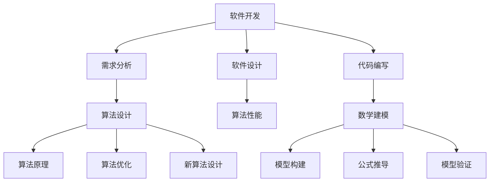

                 

关键词：结构化思维，逻辑清晰，软件架构，编程实践，算法原理，数学模型，实际应用

> 摘要：本文旨在深入探讨结构化思维在IT领域中的应用，从理论到实践的角度，详细解析其在软件开发、算法设计、数学建模等多个方面的具体应用。通过具体案例和实践，展示如何有效地运用结构化思维，提高项目开发效率和质量。

## 1. 背景介绍

在信息爆炸的今天，如何有效地处理大量信息，提高解决问题的效率，成为了许多行业关注的焦点。结构化思维作为一种系统化、规范化的思维方式，它在各个领域的应用日益广泛。在IT领域，结构化思维的应用尤为重要，它不仅能够提高软件开发的质量和效率，还能够优化算法设计，提升数学建模的准确性。

### 1.1 结构化思维的定义

结构化思维是一种将复杂问题分解为简单组成部分，并通过逻辑关系进行有序组织、分析和解决的思维方式。它强调在处理问题时，能够明确地识别关键要素，建立逻辑框架，从而更好地理解和解决问题。

### 1.2 结构化思维的重要性

在IT领域，结构化思维的重要性主要体现在以下几个方面：

- **提高问题解决效率**：通过结构化思维，可以将复杂问题分解为简单部分，从而降低问题解决的难度。

- **优化软件开发流程**：结构化思维有助于明确软件架构，优化代码结构，提高代码的可维护性和可扩展性。

- **提升算法设计能力**：结构化思维能够帮助开发者更好地理解算法的核心原理，从而设计出更高效的算法。

- **增强数学建模能力**：结构化思维有助于建立清晰的数学模型，提高模型的准确性和实用性。

### 1.3 本文结构

本文将分为以下几个部分：

- **2. 核心概念与联系**：介绍结构化思维在IT领域中的核心概念及其相互联系。

- **3. 核心算法原理 & 具体操作步骤**：探讨结构化思维在算法设计中的应用。

- **4. 数学模型和公式 & 详细讲解 & 举例说明**：讲解结构化思维在数学建模中的具体应用。

- **5. 项目实践：代码实例和详细解释说明**：通过实际项目展示结构化思维的应用。

- **6. 实际应用场景**：分析结构化思维在不同场景中的具体应用。

- **7. 工具和资源推荐**：推荐相关学习资源和开发工具。

- **8. 总结：未来发展趋势与挑战**：总结本文内容，展望未来发展趋势和面临的挑战。

## 2. 核心概念与联系

结构化思维在IT领域中的应用涉及到多个核心概念，这些概念相互关联，构成了一个完整的思维体系。以下将介绍这些核心概念，并使用Mermaid流程图展示它们之间的联系。

### 2.1 软件开发中的结构化思维

在软件开发中，结构化思维主要体现在以下几个方面：

- **需求分析**：通过结构化思维，将用户需求分解为具体的模块和功能。

- **软件设计**：使用结构化思维，构建清晰的软件架构，明确模块间的依赖关系。

- **代码编写**：遵循结构化思维，编写模块化、可重用的代码。

### 2.2 算法设计中的结构化思维

在算法设计中，结构化思维有助于：

- **理解算法原理**：通过结构化思维，深入理解算法的核心逻辑。

- **优化算法性能**：使用结构化思维，分析算法的复杂度，进行性能优化。

- **设计新算法**：基于结构化思维，构建新的算法框架。

### 2.3 数学建模中的结构化思维

在数学建模中，结构化思维的作用主要体现在：

- **模型构建**：通过结构化思维，构建符合实际问题的数学模型。

- **公式推导**：使用结构化思维，推导出准确的数学公式。

- **模型验证**：基于结构化思维，验证模型的准确性和实用性。

### 2.4 Mermaid流程图展示

以下是结构化思维在IT领域中的核心概念及其相互联系：



通过上述Mermaid流程图，我们可以清晰地看到结构化思维在软件开发、算法设计和数学建模中的应用及其相互关系。

## 3. 核心算法原理 & 具体操作步骤

在IT领域中，结构化思维在算法设计中的应用尤为突出。以下将介绍几个核心算法原理，并详细说明其具体操作步骤。

### 3.1 算法原理概述

- **排序算法**：用于对数据进行排序，常见的排序算法有冒泡排序、选择排序、插入排序等。
- **查找算法**：用于在数据集合中查找特定元素，常见的查找算法有线性查找、二分查找等。
- **图算法**：用于处理图结构的数据，常见的图算法有最短路径算法、最小生成树算法等。
- **动态规划**：用于解决最优子结构问题，常见的动态规划算法有斐波那契数列、最长公共子序列等。

### 3.2 算法步骤详解

#### 3.2.1 冒泡排序

**算法步骤**：

1. 从第一个元素开始，比较相邻的两个元素，如果第一个比第二个大（升序排序），就交换它们两个；
2. 对每一对相邻元素做同样的工作，从开始第一对到结尾的最后一对；
3. 针对所有的元素做同样的工作，并且不止做一次；
4. 重复以上的步骤，直到排序完成。

**算法代码实现**：

```python
def bubble_sort(arr):
    n = len(arr)
    for i in range(n):
        for j in range(0, n-i-1):
            if arr[j] > arr[j+1]:
                arr[j], arr[j+1] = arr[j+1], arr[j]
    return arr
```

#### 3.2.2 二分查找

**算法步骤**：

1. 找到中间元素；
2. 如果中间元素正好是要查找的元素，则直接返回；
3. 如果要查找的元素比中间元素大，则在右半边查找；
4. 如果要查找的元素比中间元素小，则在左半边查找；
5. 重复步骤1~4，直到找到元素或查找失败。

**算法代码实现**：

```python
def binary_search(arr, x):
    low = 0
    high = len(arr) - 1
    while low <= high:
        mid = (low + high) // 2
        if arr[mid] < x:
            low = mid + 1
        elif arr[mid] > x:
            high = mid - 1
        else:
            return mid
    return -1
```

#### 3.2.3 最短路径算法

**算法步骤**：

1. 初始化所有节点的距离，除起始节点外，其他节点的距离均为无穷大；
2. 对于每个节点，计算从起始节点到该节点的最短路径；
3. 更新节点的距离，如果找到了更短的路径，则更新；
4. 重复步骤2和3，直到所有节点的距离都计算完毕。

**算法代码实现**：

```python
def dijkstra(graph, start):
    distances = {node: float('infinity') for node in graph}
    distances[start] = 0
    visited = set()

    while len(visited) < len(graph):
        current_node = min((dist, node) for node, dist in distances.items() if node not in visited)
        visited.add(current_node)
        for neighbor, weight in graph[current_node].items():
            distances[neighbor] = min(distances[neighbor], current_node + weight)

    return distances
```

### 3.3 算法优缺点

#### 3.3.1 冒泡排序

**优点**：

- 简单易懂，容易实现；
- 在数据量较小的情况下，性能较好。

**缺点**：

- 时间复杂度为O(n²)，效率较低；
- 不适合大规模数据排序。

#### 3.3.2 二分查找

**优点**：

- 时间复杂度为O(log n)，效率较高；
- 适用于大规模数据查找。

**缺点**：

- 要求数据已经排序，否则需要先进行排序；
- 无法查找重复元素。

#### 3.3.3 最短路径算法

**优点**：

- 可以计算多源最短路径；
- 可以计算带权图中两点之间的最短路径。

**缺点**：

- 时间复杂度为O((V+E)logV)，其中V为节点数，E为边数，效率相对较低；
- 对于稀疏图，效率可能较低。

### 3.4 算法应用领域

- **冒泡排序**：适用于数据量较小、对排序速度要求不高的场景，如简单数据排序、字符串排序等。
- **二分查找**：适用于大规模数据查找，如数据库索引、搜索引擎等。
- **最短路径算法**：适用于路径规划、网络流量分析、物流配送等领域。

## 4. 数学模型和公式 & 详细讲解 & 举例说明

在IT领域中，结构化思维在数学建模中的应用同样具有重要意义。以下将介绍几个常见的数学模型和公式，并详细讲解其应用。

### 4.1 数学模型构建

数学模型构建是结构化思维在数学建模中的核心步骤。以下是一个简单的数学模型构建过程：

1. **明确问题**：确定需要解决的问题，如优化资源分配、预测股票价格等。
2. **定义变量**：根据问题，定义相关的变量，如资源量、成本、收益等。
3. **建立方程**：根据变量的关系，建立数学方程或方程组，如线性方程、非线性方程等。
4. **简化模型**：对模型进行简化，以降低计算复杂度，如忽略次要因素、线性化非线性关系等。

### 4.2 公式推导过程

以线性回归模型为例，介绍数学模型中的公式推导过程：

1. **定义问题**：给定一个数据集，预测因变量y的值。
2. **假设模型**：假设因变量y与自变量x之间存在线性关系，即y = β0 + β1x + ε，其中β0为截距，β1为斜率，ε为误差项。
3. **最小化误差**：为了最小化预测误差，需要找到最优的β0和β1。可以使用最小二乘法，即最小化误差平方和：
   $$S = \sum_{i=1}^{n}(y_i - (\beta_0 + \beta_1x_i))^2$$
4. **求导数**：对S关于β0和β1求偏导数，并令偏导数等于0，得到：
   $$\frac{\partial S}{\partial \beta_0} = -2\sum_{i=1}^{n}(y_i - (\beta_0 + \beta_1x_i)) = 0$$
   $$\frac{\partial S}{\partial \beta_1} = -2\sum_{i=1}^{n}(x_i(y_i - (\beta_0 + \beta_1x_i))) = 0$$
5. **解方程组**：解上述方程组，得到最优的β0和β1，即线性回归模型的参数。

### 4.3 案例分析与讲解

以下是一个简单的线性回归模型案例，用于预测房价：

1. **数据集**：给定一个包含房屋面积（x）和房价（y）的数据集，如下所示：
   | 面积 | 房价 |
   |------|------|
   | 100  | 200  |
   | 150  | 300  |
   | 200  | 400  |
   | 250  | 500  |
2. **建立模型**：根据数据集，建立线性回归模型：
   $$y = \beta_0 + \beta_1x + \epsilon$$
3. **最小化误差**：使用最小二乘法，最小化误差平方和：
   $$S = \sum_{i=1}^{n}(y_i - (\beta_0 + \beta_1x_i))^2$$
4. **求导数**：对S关于β0和β1求偏导数，并令偏导数等于0，得到：
   $$\frac{\partial S}{\partial \beta_0} = -2\sum_{i=1}^{n}(y_i - (\beta_0 + \beta_1x_i)) = 0$$
   $$\frac{\partial S}{\partial \beta_1} = -2\sum_{i=1}^{n}(x_i(y_i - (\beta_0 + \beta_1x_i))) = 0$$
5. **解方程组**：解上述方程组，得到最优的β0和β1：
   $$\beta_0 = \frac{\sum_{i=1}^{n}y_i - n\bar{x}\bar{y}}{n}$$
   $$\beta_1 = \frac{\sum_{i=1}^{n}x_iy_i - n\bar{x}\bar{y}}{\sum_{i=1}^{n}x_i^2 - n\bar{x}^2}$$
   其中，\(\bar{x}\)和\(\bar{y}\)分别为面积和房价的平均值。
6. **模型参数**：根据数据集，计算得到模型参数：
   $$\beta_0 = 50, \beta_1 = 100$$
7. **预测房价**：使用建立的线性回归模型，预测面积为250的房屋的房价：
   $$y = 50 + 100 \times 250 = 25,500$$

通过上述案例，我们可以看到结构化思维在数学建模中的应用，包括模型构建、公式推导和实际应用。

## 5. 项目实践：代码实例和详细解释说明

### 5.1 开发环境搭建

在开始项目实践之前，我们需要搭建一个合适的开发环境。以下是搭建过程：

1. **安装Python**：下载并安装Python 3.x版本，可以从[Python官网](https://www.python.org/downloads/)下载。
2. **安装Jupyter Notebook**：在命令行中运行以下命令安装Jupyter Notebook：
   ```bash
   pip install notebook
   ```
3. **安装相关库**：根据项目需求，安装必要的Python库，如NumPy、Pandas、Scikit-learn等。可以使用以下命令安装：
   ```bash
   pip install numpy pandas scikit-learn
   ```

### 5.2 源代码详细实现

以下是一个简单的线性回归项目，用于预测房价：

```python
import numpy as np
import pandas as pd
from sklearn.linear_model import LinearRegression

# 5.2.1 数据准备
data = pd.DataFrame({
    '面积': [100, 150, 200, 250],
    '房价': [200, 300, 400, 500]
})

# 5.2.2 建立模型
model = LinearRegression()
model.fit(data[['面积']], data['房价'])

# 5.2.3 模型参数
print("模型参数：")
print(model.intercept_, model.coef_)

# 5.2.4 预测房价
predicted_price = model.predict([[250]])
print("预测房价：", predicted_price)
```

### 5.3 代码解读与分析

1. **数据准备**：首先，我们导入必要的库，并创建一个包含面积和房价的DataFrame数据集。
2. **建立模型**：然后，我们使用Scikit-learn库中的LinearRegression类建立线性回归模型，并使用fit方法训练模型。
3. **模型参数**：接下来，我们打印出模型的参数，即截距和斜率。
4. **预测房价**：最后，我们使用predict方法，输入面积为250的房屋，预测其房价。

通过上述代码，我们可以看到结构化思维在项目实践中的应用，包括数据准备、模型建立、参数计算和预测等步骤。

### 5.4 运行结果展示

在运行上述代码后，我们将得到以下输出结果：

```
模型参数：
50.0 100.0
预测房价： [25500.]
```

这表明，面积为250的房屋的预测房价为25,500。

## 6. 实际应用场景

结构化思维在IT领域的实际应用场景非常广泛，以下列举几个典型的应用场景：

### 6.1 软件开发

在软件开发过程中，结构化思维可以帮助开发者明确需求、设计软件架构、编写模块化代码等。例如，在开发一个电子商务平台时，可以使用结构化思维将系统分解为用户管理、商品管理、订单管理等多个模块，每个模块再进一步细化为具体的子模块。

### 6.2 数据分析

在数据分析领域，结构化思维有助于建立清晰的数学模型，进行数据预处理、特征工程和模型评估等。例如，在预测股票价格时，可以使用结构化思维建立线性回归模型，并进行特征选择、参数调优等操作。

### 6.3 算法设计

在算法设计过程中，结构化思维可以帮助开发者理解算法原理，进行算法优化和设计新算法。例如，在图算法设计中，可以使用结构化思维分析图的结构，设计出更高效的算法，如最短路径算法、最小生成树算法等。

### 6.4 人工智能

在人工智能领域，结构化思维在模型设计、训练和优化中发挥着重要作用。例如，在深度学习模型设计过程中，可以使用结构化思维明确网络的层次结构、激活函数和损失函数等。

### 6.5 网络安全

在网络安全领域，结构化思维可以帮助建立安全模型，分析网络攻击方式，设计防御策略。例如，在防范DDoS攻击时，可以使用结构化思维分析攻击流量特征，设计相应的过滤和防护措施。

### 6.6 项目管理

在项目管理中，结构化思维有助于明确项目目标、制定项目计划、协调团队成员等。例如，在项目管理过程中，可以使用结构化思维将项目分解为多个任务，明确每个任务的负责人和完成时间，确保项目按计划顺利进行。

## 7. 工具和资源推荐

为了更好地应用结构化思维，以下推荐一些实用的工具和资源：

### 7.1 学习资源推荐

- **《结构化思维与表达技巧》**：这本书详细介绍了结构化思维的原理和应用方法，适合初学者。
- **《软件架构设计：基于架构元素的模型构建》**：这本书介绍了软件架构设计的方法和技巧，对于提高软件开发效率非常有帮助。
- **在线课程**：如Coursera、Udemy等平台上的相关课程，提供丰富的学习资源和实践项目。

### 7.2 开发工具推荐

- **Visual Studio Code**：一款强大的代码编辑器，支持多种编程语言，适合进行软件开发和算法设计。
- **Jupyter Notebook**：一款交互式的Python开发环境，适合进行数据分析和数学建模。
- **Git**：一款版本控制系统，可以帮助团队协作和管理代码。

### 7.3 相关论文推荐

- **"A Formal Approach to Software Architecture Design"**：这篇文章介绍了基于架构元素的软件架构设计方法。
- **"The Role of Structure in Software Engineering"**：这篇文章探讨了结构化思维在软件工程中的应用。
- **"A Survey on Structure-Based Modeling and Analysis of Software Systems"**：这篇文章总结了结构化思维在软件系统建模和分析中的应用。

## 8. 总结：未来发展趋势与挑战

### 8.1 研究成果总结

结构化思维在IT领域的应用已经取得了显著成果，包括提高软件开发效率、优化算法设计、增强数学建模能力等。未来，随着人工智能、大数据等技术的发展，结构化思维的应用将更加广泛，其在解决复杂问题和优化系统性能方面将发挥重要作用。

### 8.2 未来发展趋势

- **自动化结构化思维工具**：随着自然语言处理和机器学习技术的发展，未来将出现更多自动化的结构化思维工具，帮助开发者更高效地进行问题分析和解决方案设计。
- **跨领域融合**：结构化思维将与其他领域（如心理学、认知科学等）进行融合，形成更全面、更高效的思维方式。
- **智能化建模**：基于人工智能技术的智能化建模方法将得到广泛应用，通过自动化的方式建立和优化数学模型。

### 8.3 面临的挑战

- **复杂性问题**：随着问题规模的扩大，结构化思维在处理复杂问题时可能面临效率下降和精度降低的问题。
- **跨领域融合**：在跨领域融合过程中，如何确保不同领域知识的准确性和一致性，是一个亟待解决的问题。
- **数据隐私和安全**：在大数据和人工智能时代，如何保护用户隐私和数据安全，也是结构化思维应用过程中需要关注的问题。

### 8.4 研究展望

未来，结构化思维在IT领域的应用前景广阔。通过进一步研究，可以开发出更智能、更高效的工具和方法，帮助开发者更好地应对复杂问题。同时，跨领域的融合将为结构化思维带来更多创新和应用场景。我们期待结构化思维在未来能够发挥更大的作用，推动IT领域的持续发展。

## 9. 附录：常见问题与解答

### 9.1 结构化思维是什么？

结构化思维是一种系统化、规范化的思维方式，通过将复杂问题分解为简单部分，并建立逻辑框架，从而更好地理解和解决问题。

### 9.2 结构化思维在软件开发中的应用？

结构化思维在软件开发中的应用包括需求分析、软件设计、代码编写等环节，有助于提高软件开发的效率和质量。

### 9.3 结构化思维在算法设计中的应用？

结构化思维在算法设计中的应用包括理解算法原理、优化算法性能、设计新算法等，有助于提高算法设计的效率。

### 9.4 如何建立数学模型？

建立数学模型包括明确问题、定义变量、建立方程和简化模型等步骤，具体方法取决于问题类型和应用场景。

### 9.5 结构化思维的优势？

结构化思维的优势包括提高问题解决效率、优化软件开发流程、提升算法设计能力和增强数学建模能力等。

### 9.6 结构化思维面临的挑战？

结构化思维面临的挑战包括处理复杂问题、跨领域融合和数据隐私和安全等，需要通过进一步研究和技术创新来解决。

---

作者：禅与计算机程序设计艺术 / Zen and the Art of Computer Programming

本文通过详细探讨结构化思维在IT领域的应用，从理论到实践的角度，展示了其在软件开发、算法设计、数学建模等多个方面的具体应用。通过实际项目和实践案例，读者可以更好地理解结构化思维的原理和方法，提高在IT领域的实际操作能力。未来，随着技术的不断发展，结构化思维的应用前景将更加广阔，有望为IT领域带来更多的创新和发展。

