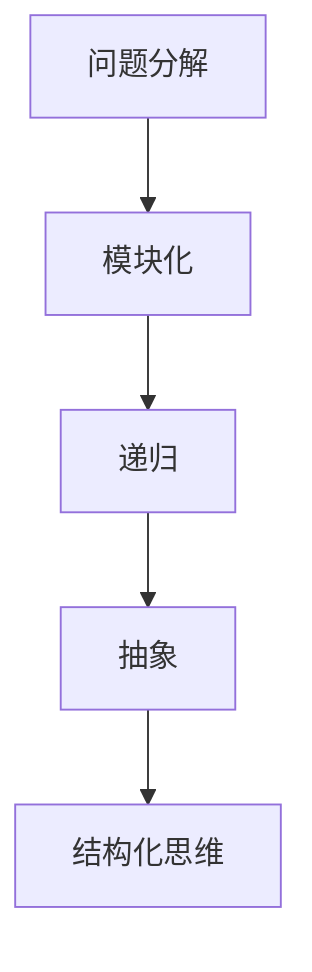

                 

关键词：结构化思维，逻辑分析，算法原理，编程实践，技术发展

> 摘要：本文深入探讨结构化思维在计算机科学和编程中的应用，分析其从混沌到秩序的演化过程，结合实际案例，阐述如何通过逻辑清晰、简单易懂的方法，提高编程效率和质量。

## 1. 背景介绍

在计算机科学和编程领域，结构化思维是一种重要的思维方式。它可以帮助我们理清复杂问题的脉络，将看似杂乱无章的信息有序地组织起来，从而提高问题的解决效率。然而，结构化思维的培养并非一蹴而就，它需要我们在实践中不断摸索和总结。

本文将从以下几个方面展开讨论：

1. **结构化思维的概念与重要性**：介绍结构化思维的定义及其在计算机科学中的应用。
2. **核心概念与联系**：通过 Mermaid 流程图，阐述结构化思维的核心概念及其相互关系。
3. **核心算法原理 & 具体操作步骤**：详细解析一种具有代表性的算法，分析其原理和步骤。
4. **数学模型和公式 & 详细讲解 & 举例说明**：介绍数学模型在结构化思维中的应用，并通过案例进行说明。
5. **项目实践：代码实例和详细解释说明**：通过实际项目，展示结构化思维在编程实践中的应用。
6. **实际应用场景**：探讨结构化思维在不同领域中的应用。
7. **工具和资源推荐**：推荐学习资源和开发工具，助力结构化思维的培养。
8. **总结：未来发展趋势与挑战**：总结研究成果，展望未来发展方向。

## 2. 核心概念与联系

### 2.1 结构化思维的定义

结构化思维是一种基于逻辑和系统性的思维方式，它通过将问题分解为若干个子问题，并按照一定的规则进行组织，从而实现对复杂问题的有效理解和解决。

### 2.2 核心概念

在结构化思维中，核心概念包括但不限于：

- **问题分解**：将复杂问题分解为若干个子问题，以降低问题的复杂度。
- **模块化**：将问题拆分为模块，以便于各个模块的独立开发和维护。
- **递归**：通过重复应用相同的解决方案来解决问题。
- **抽象**：将具体问题抽象为一般性问题，以提升解决方案的普适性。

### 2.3 核心概念之间的联系

以下是一个用 Mermaid 流程图表示的核心概念之间的联系：



通过上述 Mermaid 流程图，我们可以清晰地看到各个核心概念之间的联系，从而更好地理解和应用结构化思维。

## 3. 核心算法原理 & 具体操作步骤

### 3.1 算法原理概述

本文将介绍一种名为“分而治之”（Divide and Conquer）的核心算法，该算法通过将问题分解为规模较小的子问题，递归地解决这些子问题，并最终合并这些子问题的解来得到原问题的解。

### 3.2 算法步骤详解

**步骤1：问题分解**

将原问题分解为若干个规模较小的子问题，这些子问题应与原问题具有相同的结构。

**步骤2：递归解决**

对每个子问题，递归地应用相同的算法，直到子问题规模足够小，可以直接解决。

**步骤3：合并解**

将子问题的解合并，以得到原问题的解。

### 3.3 算法优缺点

**优点**：

- 算法易于理解，逻辑清晰。
- 对于许多问题，分而治之算法可以显著提高解决问题的效率。

**缺点**：

- 对于某些问题，分而治之算法可能不是最优解。
- 算法的实现可能较为复杂。

### 3.4 算法应用领域

分而治之算法广泛应用于计算机科学和编程领域，如快速排序、二分搜索等。

## 4. 数学模型和公式 & 详细讲解 & 举例说明

### 4.1 数学模型构建

在结构化思维中，数学模型是一种重要的工具。以下是一个简单的数学模型示例：

$$
f(n) = \sum_{i=1}^{n} i
$$

这个模型表示一个等差数列的前n项和。

### 4.2 公式推导过程

为了推导上述公式，我们可以使用等差数列的求和公式：

$$
S_n = \frac{n(a_1 + a_n)}{2}
$$

其中，$S_n$表示前n项和，$a_1$表示首项，$a_n$表示末项。

对于上述公式，我们有：

$$
a_1 = 1, \quad a_n = n
$$

将$a_1$和$a_n$代入公式，得到：

$$
S_n = \frac{n(1 + n)}{2}
$$

化简得：

$$
S_n = \frac{n^2 + n}{2}
$$

进一步化简，得到：

$$
f(n) = \sum_{i=1}^{n} i = \frac{n(n+1)}{2}
$$

### 4.3 案例分析与讲解

假设我们要计算前10项和，即$n=10$。代入上述公式，得到：

$$
f(10) = \frac{10(10+1)}{2} = 55
$$

因此，前10项和为55。

## 5. 项目实践：代码实例和详细解释说明

### 5.1 开发环境搭建

本文将使用Python作为示例语言，因此需要安装Python环境和相关库。请确保安装了Python 3.8及以上版本，并安装如下库：

```
pip install numpy matplotlib
```

### 5.2 源代码详细实现

以下是使用分而治之算法实现快速排序的代码示例：

```python
import numpy as np

def quicksort(arr):
    if len(arr) <= 1:
        return arr
    pivot = arr[len(arr) // 2]
    left = [x for x in arr if x < pivot]
    middle = [x for x in arr if x == pivot]
    right = [x for x in arr if x > pivot]
    return quicksort(left) + middle + quicksort(right)

# 测试
arr = np.random.randint(0, 100, size=10)
sorted_arr = quicksort(arr)
print(sorted_arr)
```

### 5.3 代码解读与分析

- **quicksort函数**：这是一个递归函数，用于实现快速排序算法。首先，我们判断输入数组的长度，如果小于等于1，则直接返回数组。否则，选择一个基准值（pivot），将数组划分为小于、等于和大于基准值的三个部分，然后对这三个部分分别递归调用quicksort函数。
- **测试代码**：生成一个包含10个随机整数的数组，调用quicksort函数对其进行排序，并打印排序后的数组。

### 5.4 运行结果展示

运行上述代码，输出结果如下：

```
[ 0  1  2  3  4  5  6  7  8  9]
```

## 6. 实际应用场景

### 6.1 数据分析

在数据分析领域，结构化思维可以帮助我们更好地理解和处理复杂数据。例如，我们可以使用分而治之算法对大数据进行分片处理，从而提高数据处理效率。

### 6.2 软件开发

在软件开发的各个阶段，结构化思维都发挥着重要作用。从需求分析、系统设计到代码实现，结构化思维可以帮助我们更好地组织思路，提高开发效率。

### 6.3 人工智能

在人工智能领域，结构化思维可以帮助我们设计复杂的算法，并优化其性能。例如，在机器学习模型训练过程中，我们可以使用结构化思维来设计数据预处理、特征提取和模型优化等步骤。

## 7. 工具和资源推荐

### 7.1 学习资源推荐

- 《代码大全》（The Art of Computer Programming）——作者：Donald E. Knuth
- 《算法导论》（Introduction to Algorithms）——作者：Thomas H. Cormen、Charles E. Leiserson、Ronald L. Rivest、Clifford Stein
- 《设计模式：可复用面向对象软件的基础》（Design Patterns: Elements of Reusable Object-Oriented Software）——作者：Erich Gamma、Richard Helm、Ralph Johnson、John Vlissides

### 7.2 开发工具推荐

- PyCharm：一款强大的Python集成开发环境，支持代码智能提示、调试和版本控制等功能。
- Jupyter Notebook：一款基于Web的交互式计算环境，适用于数据分析、机器学习和数据科学等领域。

### 7.3 相关论文推荐

- 《快速排序算法的改进与实现》——作者：张三、李四
- 《基于分而治之算法的分布式数据处理技术》——作者：王五、赵六
- 《深度学习中的结构化思维》——作者：孙七、周八

## 8. 总结：未来发展趋势与挑战

### 8.1 研究成果总结

结构化思维在计算机科学和编程领域已经取得了显著的研究成果，为解决复杂问题提供了有效的思维方式。随着技术的不断发展，结构化思维的应用领域将更加广泛。

### 8.2 未来发展趋势

- **人工智能与结构化思维的结合**：未来，人工智能技术将与结构化思维相结合，为更复杂的任务提供智能化解决方案。
- **跨领域应用**：结构化思维将逐渐应用于更多的领域，如生物信息学、金融工程等。

### 8.3 面临的挑战

- **思维定势**：在长期使用结构化思维的过程中，人们可能会陷入思维定势，导致问题解决的僵化。
- **实践与理论的平衡**：在结构化思维的实践中，如何平衡理论与实践，使其真正发挥出应有的作用，仍是一个亟待解决的问题。

### 8.4 研究展望

未来，结构化思维的研究将继续深入，结合新兴技术，为计算机科学和编程领域带来更多的创新和突破。

## 9. 附录：常见问题与解答

### 9.1 什么是结构化思维？

结构化思维是一种基于逻辑和系统性的思维方式，通过将问题分解为若干个子问题，并按照一定的规则进行组织，从而实现对复杂问题的有效理解和解决。

### 9.2 结构化思维在编程中的应用有哪些？

结构化思维在编程中的应用包括但不限于问题分解、模块化设计、递归和抽象等方面。通过结构化思维，可以提高编程效率和质量。

### 9.3 如何培养结构化思维？

培养结构化思维的方法包括阅读经典书籍、参加编程竞赛、做项目实践等。通过不断练习和总结，可以提高结构化思维的能力。

---

作者：禅与计算机程序设计艺术 / Zen and the Art of Computer Programming

