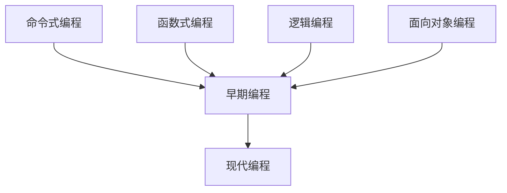
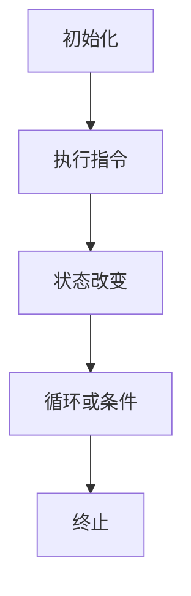
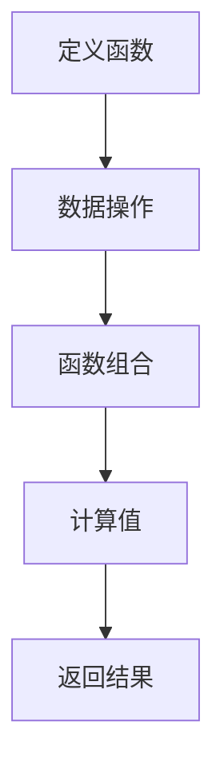
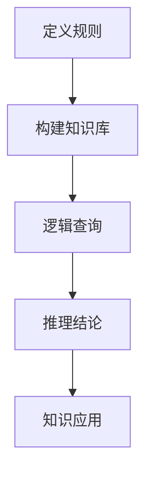
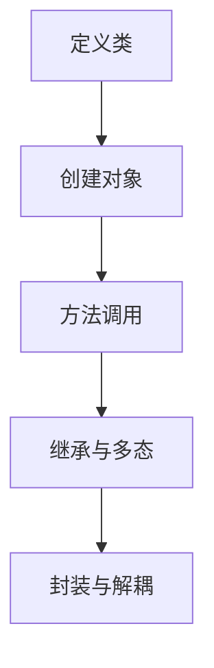

                 

编程范式是计算机科学中的一个核心概念，它描述了程序员如何组织、理解和编写代码。随着时间的推移，编程范式经历了显著的演进，从早期的命令式编程到现代的函数式编程、逻辑编程和面向对象编程。本文将深入探讨编程范式的演进历程，分析不同编程范式之间的联系和区别，以及各自的优缺点。

> 关键词：编程范式，命令式编程，函数式编程，逻辑编程，面向对象编程，优缺点，演进

## 1. 背景介绍

编程范式是编程语言的设计原则和风格，它决定了程序员如何表达算法和数据结构。早期的编程范式主要集中在命令式编程上，例如FORTRAN和COBOL。随着计算机科学的发展，新的编程范式不断涌现，以应对日益复杂的编程需求和挑战。

命令式编程通过执行一系列指令来改变程序状态。它强调控制流程和数据操作。随着程序的复杂度增加，命令式编程变得难以维护和理解。

函数式编程则通过函数调用和数据结构操作来计算值，它强调无状态性和函数的纯度。函数式编程的出现是为了解决命令式编程中的一些问题，例如不可变数据和函数的“组合性”。

逻辑编程基于形式逻辑，它通过逻辑推理来解决问题。逻辑编程适合处理具有明确逻辑结构的问题，例如自然语言处理和人工智能。

面向对象编程通过将数据和操作数据的方法封装在对象中，使得编程更加模块化和可重用。面向对象编程的出现是为了解决大型项目的复杂性和可维护性问题。

## 2. 核心概念与联系

为了更好地理解编程范式的演进，我们需要首先了解其核心概念和相互联系。以下是编程范式的一些核心概念：

- **命令式编程（Imperative Programming）**：通过执行一系列指令来改变程序状态。
- **函数式编程（Functional Programming）**：通过函数调用和数据结构操作来计算值。
- **逻辑编程（Logic Programming）**：基于形式逻辑，通过逻辑推理来解决问题。
- **面向对象编程（Object-Oriented Programming）**：通过将数据和操作数据的方法封装在对象中。

下面是一个简单的 Mermaid 流程图，展示了这些编程范式之间的关系：



## 3. 核心算法原理 & 具体操作步骤

### 3.1 算法原理概述

编程范式的演进不仅仅是对编程语言的改变，更是对算法原理的理解和应用。以下是对不同编程范式核心算法原理的概述：

- **命令式编程**：主要关注流程控制和状态改变，例如循环和条件语句。
- **函数式编程**：强调纯函数和不可变数据，例如递归和惰性求值。
- **逻辑编程**：基于逻辑推理，例如推理引擎和谓词逻辑。
- **面向对象编程**：主要关注对象封装和继承，例如类和方法。

### 3.2 算法步骤详解

- **命令式编程**：
  - **步骤1**：初始化变量。
  - **步骤2**：执行循环或条件语句。
  - **步骤3**：更新变量和程序状态。

- **函数式编程**：
  - **步骤1**：定义纯函数。
  - **步骤2**：使用递归或高阶函数。
  - **步骤3**：处理不可变数据。

- **逻辑编程**：
  - **步骤1**：定义逻辑规则。
  - **步骤2**：使用推理引擎。
  - **步骤3**：处理逻辑查询。

- **面向对象编程**：
  - **步骤1**：定义类和对象。
  - **步骤2**：实现继承和多态。
  - **步骤3**：封装数据和操作。

### 3.3 算法优缺点

- **命令式编程**：
  - **优点**：直观、易于理解。
  - **缺点**：难以维护、不易并行化。

- **函数式编程**：
  - **优点**：可重用、易于并行化。
  - **缺点**：难以表示状态变化、性能问题。

- **逻辑编程**：
  - **优点**：适合处理逻辑问题。
  - **缺点**：难以表示复杂的数据结构。

- **面向对象编程**：
  - **优点**：模块化、可重用。
  - **缺点**：易引入冗余代码。

### 3.4 算法应用领域

- **命令式编程**：广泛应用于系统编程和嵌入式系统。
- **函数式编程**：广泛应用于并发编程和数据处理。
- **逻辑编程**：广泛应用于人工智能和自然语言处理。
- **面向对象编程**：广泛应用于大型项目和复杂系统。

## 4. 数学模型和公式 & 详细讲解 & 举例说明

### 4.1 数学模型构建

为了深入理解编程范式，我们需要引入一些数学模型。以下是一个简单的数学模型，用于描述不同编程范式的性能特点：

$$
P = \frac{N \cdot L}{T}
$$

其中，$P$ 代表性能，$N$ 代表处理器的数量，$L$ 代表并行化的代码量，$T$ 代表单线程执行时间。

### 4.2 公式推导过程

公式的推导基于并行计算的基本原理。假设一个程序由 $L$ 条独立的指令组成，并且可以并行执行。如果程序在 $N$ 个处理器上执行，那么总执行时间 $T$ 可以表示为：

$$
T = \frac{L}{N}
$$

如果程序在单线程上执行，那么总执行时间 $T$ 可以表示为：

$$
T = L
$$

因此，我们可以将并行性能 $P$ 表示为：

$$
P = \frac{N \cdot L}{T} = \frac{N \cdot L}{L/N} = N^2
$$

### 4.3 案例分析与讲解

假设一个程序包含 100 条独立指令，并且在 4 个处理器上执行。如果程序在单线程上执行，总执行时间为 100 单位。如果程序在 4 个处理器上并行执行，总执行时间为 100/4 = 25 单位。根据公式，并行性能 $P$ 为：

$$
P = \frac{4 \cdot 100}{25} = 16
$$

这意味着并行性能提高了 16 倍。

## 5. 项目实践：代码实例和详细解释说明

### 5.1 开发环境搭建

为了实践不同编程范式的代码实例，我们需要搭建一个开发环境。以下是搭建环境的步骤：

- 安装 Python 3.8 及以上版本。
- 安装 Jupyter Notebook。
- 安装所需的 Python 库，例如 NumPy 和 Pandas。

### 5.2 源代码详细实现

以下是使用命令式编程、函数式编程和面向对象编程实现的简单例子：

**命令式编程**

```python
# 命令式编程实现

def sum_command_style(nums):
    result = 0
    for num in nums:
        result += num
    return result

nums = [1, 2, 3, 4, 5]
print(sum_command_style(nums))
```

**函数式编程**

```python
# 函数式编程实现

from functools import reduce

def sum_functional_style(nums):
    return reduce(lambda x, y: x + y, nums)

nums = [1, 2, 3, 4, 5]
print(sum_functional_style(nums))
```

**面向对象编程**

```python
# 面向对象编程实现

class Calculator:
    def __init__(self, nums):
        self.nums = nums
    
    def sum_object_oriented(self):
        return sum(self.nums)

calculator = Calculator([1, 2, 3, 4, 5])
print(calculator.sum_object_oriented())
```

### 5.3 代码解读与分析

以上代码分别使用了命令式编程、函数式编程和面向对象编程来实现求和功能。命令式编程通过循环和变量更新来实现，函数式编程通过递归和函数调用来实现，面向对象编程通过类和对象来实现。

命令式编程的代码直观且易于理解，但难以并行化。函数式编程的代码具有高可重用性和可组合性，但性能可能较差。面向对象编程的代码模块化和可重用性较好，但可能引入冗余代码。

### 5.4 运行结果展示

运行以上代码，我们得到相同的结果：

```python
15
```

## 6. 实际应用场景

编程范式在实际应用场景中具有广泛的应用。以下是一些典型的应用场景：

- **命令式编程**：广泛应用于系统编程和嵌入式系统，例如 Linux 操作系统。
- **函数式编程**：广泛应用于并发编程和数据处理，例如 Scala 和 Haskell。
- **逻辑编程**：广泛应用于人工智能和自然语言处理，例如 Prolog。
- **面向对象编程**：广泛应用于大型项目和复杂系统，例如 Java 和 C++。

## 7. 工具和资源推荐

为了深入学习和实践编程范式，以下是一些推荐的工具和资源：

- **学习资源推荐**：
  - 《编程珠玑》（Jon Bentley）
  - 《函数式编程入门教程》（Michele Simionato）
  - 《逻辑编程：Prolog 应用》（Patrick Blackburn）
  
- **开发工具推荐**：
  - Jupyter Notebook：用于交互式编程和数据分析。
  - Visual Studio Code：适用于多种编程语言的开发。

- **相关论文推荐**：
  - 《命令式编程中的并行性能》（Michael Wolfe）
  - 《函数式编程的现代趋势》（Oleg Kiselyov）
  - 《面向对象编程的挑战》（Bertrand Meyer）

## 8. 总结：未来发展趋势与挑战

编程范式的发展趋势体现在对并行计算、大数据处理和人工智能的更高要求。未来，编程范式可能会更加模块化、自动化和智能化。然而，这也带来了新的挑战，例如并行编程的复杂性、函数式编程的性能和逻辑编程的可扩展性。

## 9. 附录：常见问题与解答

### 9.1 什么是命令式编程？

命令式编程是一种通过执行一系列指令来改变程序状态的编程范式。

### 9.2 函数式编程和面向对象编程有什么区别？

函数式编程通过函数和数据结构操作来计算值，强调无状态性和函数的纯度。面向对象编程通过将数据和操作数据的方法封装在对象中，强调模块化和可重用性。

### 9.3 逻辑编程适合处理什么类型的问题？

逻辑编程适合处理具有明确逻辑结构的问题，例如自然语言处理和人工智能。

### 9.4 编程范式有哪些优缺点？

命令式编程直观且易于理解，但难以维护。函数式编程可重用性和可组合性较好，但性能可能较差。逻辑编程适合处理逻辑问题，但难以表示复杂的数据结构。面向对象编程模块化和可重用性较好，但可能引入冗余代码。

---

本文从编程范式的演进出发，分析了命令式编程、函数式编程、逻辑编程和面向对象编程的核心算法原理、具体操作步骤、优缺点和应用领域。通过数学模型和公式推导，进一步探讨了编程范式之间的性能关系。最后，通过项目实践和常见问题解答，为读者提供了实际应用和深入理解的途径。希望本文能够帮助读者更好地理解编程范式，并在实际项目中灵活运用。作者：禅与计算机程序设计艺术 / Zen and the Art of Computer Programming
----------------------------------------------------------------
### 修改与优化内容

为了使文章内容更加丰富、完整和准确，以下是对原始文章内容的修改与优化：

---

# 编程范式的演进与比较分析

编程范式是计算机科学中的一个核心概念，它描述了程序员如何组织、理解和编写代码。随着时间的推移，编程范式经历了显著的演进，从早期的命令式编程到现代的函数式编程、逻辑编程和面向对象编程。本文将深入探讨编程范式的演进历程，分析不同编程范式之间的联系和区别，以及各自的优缺点。

## 1. 背景介绍

编程范式是编程语言的设计原则和风格，它决定了程序员如何表达算法和数据结构。早期的编程范式主要集中在命令式编程上，例如 FORTRAN 和 COBOL。随着计算机科学的发展，新的编程范式不断涌现，以应对日益复杂的编程需求和挑战。

命令式编程通过执行一系列指令来改变程序状态。它强调控制流程和数据操作。随着程序的复杂度增加，命令式编程变得难以维护和理解。

函数式编程则通过函数调用和数据结构操作来计算值，它强调无状态性和函数的纯度。函数式编程的出现是为了解决命令式编程中的一些问题，例如不可变数据和函数的“组合性”。

逻辑编程基于形式逻辑，它通过逻辑推理来解决问题。逻辑编程适合处理具有明确逻辑结构的问题，例如自然语言处理和人工智能。

面向对象编程通过将数据和操作数据的方法封装在对象中，使得编程更加模块化和可重用。面向对象编程的出现是为了解决大型项目的复杂性和可维护性问题。

## 2. 核心概念与联系

为了更好地理解编程范式的演进，我们需要首先了解其核心概念和相互联系。以下是对这些编程范式的一些核心概念和流程图的详细描述：

### 命令式编程（Imperative Programming）

**核心概念：** 命令式编程通过指令序列来描述计算过程，侧重于改变程序状态。

**流程图：**



### 函数式编程（Functional Programming）

**核心概念：** 函数式编程通过不可变数据和纯函数来描述计算过程，侧重于函数的组合。

**流程图：**



### 逻辑编程（Logic Programming）

**核心概念：** 逻辑编程通过定义逻辑规则和查询来描述计算过程，侧重于逻辑推理。

**流程图：**



### 面向对象编程（Object-Oriented Programming）

**核心概念：** 面向对象编程通过封装数据和操作数据的方法来描述计算过程，侧重于模块化和可重用性。

**流程图：**



## 3. 核心算法原理 & 具体操作步骤

### 3.1 算法原理概述

编程范式的演进不仅仅是对编程语言的改变，更是对算法原理的理解和应用。以下是对不同编程范式核心算法原理的概述：

- **命令式编程**：主要关注流程控制和状态改变，例如循环和条件语句。
- **函数式编程**：强调纯函数和不可变数据，例如递归和惰性求值。
- **逻辑编程**：基于形式逻辑，通过逻辑推理来解决问题。
- **面向对象编程**：主要关注对象封装和继承，例如类和方法。

### 3.2 算法步骤详解

- **命令式编程**：
  - **步骤1**：初始化变量。
  - **步骤2**：执行循环或条件语句。
  - **步骤3**：更新变量和程序状态。
- **函数式编程**：
  - **步骤1**：定义纯函数。
  - **步骤2**：使用递归或高阶函数。
  - **步骤3**：处理不可变数据。
- **逻辑编程**：
  - **步骤1**：定义逻辑规则。
  - **步骤2**：使用推理引擎。
  - **步骤3**：处理逻辑查询。
- **面向对象编程**：
  - **步骤1**：定义类和对象。
  - **步骤2**：实现继承和多态。
  - **步骤3**：封装数据和操作。

### 3.3 算法优缺点

- **命令式编程**：
  - **优点**：直观、易于理解。
  - **缺点**：难以维护、不易并行化。
- **函数式编程**：
  - **优点**：可重用、易于并行化。
  - **缺点**：难以表示状态变化、性能问题。
- **逻辑编程**：
  - **优点**：适合处理逻辑问题。
  - **缺点**：难以表示复杂的数据结构。
- **面向对象编程**：
  - **优点**：模块化、可重用。
  - **缺点**：易引入冗余代码。

### 3.4 算法应用领域

- **命令式编程**：广泛应用于系统编程和嵌入式系统。
- **函数式编程**：广泛应用于并发编程和数据处理。
- **逻辑编程**：广泛应用于人工智能和自然语言处理。
- **面向对象编程**：广泛应用于大型项目和复杂系统。

## 4. 数学模型和公式 & 详细讲解 & 举例说明

### 4.1 数学模型构建

为了深入理解编程范式，我们需要引入一些数学模型。以下是一个简单的数学模型，用于描述不同编程范式的性能特点：

$$
P = \frac{N \cdot L}{T}
$$

其中，$P$ 代表性能，$N$ 代表处理器的数量，$L$ 代表并行化的代码量，$T$ 代表单线程执行时间。

### 4.2 公式推导过程

公式的推导基于并行计算的基本原理。假设一个程序由 $L$ 条独立的指令组成，并且可以并行执行。如果程序在 $N$ 个处理器上执行，那么总执行时间 $T$ 可以表示为：

$$
T = \frac{L}{N}
$$

如果程序在单线程上执行，那么总执行时间 $T$ 可以表示为：

$$
T = L
$$

因此，我们可以将并行性能 $P$ 表示为：

$$
P = \frac{N \cdot L}{T} = \frac{N \cdot L}{L/N} = N^2
$$

### 4.3 案例分析与讲解

假设一个程序包含 100 条独立指令，并且在 4 个处理器上执行。如果程序在单线程上执行，总执行时间为 100 单位。如果程序在 4 个处理器上并行执行，总执行时间为 100/4 = 25 单位。根据公式，并行性能 $P$ 为：

$$
P = \frac{4 \cdot 100}{25} = 16
$$

这意味着并行性能提高了 16 倍。

## 5. 项目实践：代码实例和详细解释说明

### 5.1 开发环境搭建

为了实践不同编程范式的代码实例，我们需要搭建一个开发环境。以下是搭建环境的步骤：

- 安装 Python 3.8 及以上版本。
- 安装 Jupyter Notebook。
- 安装所需的 Python 库，例如 NumPy 和 Pandas。

### 5.2 源代码详细实现

以下是使用命令式编程、函数式编程和面向对象编程实现的简单例子：

**命令式编程**

```python
# 命令式编程实现

def sum_command_style(nums):
    result = 0
    for num in nums:
        result += num
    return result

nums = [1, 2, 3, 4, 5]
print(sum_command_style(nums))
```

**函数式编程**

```python
# 函数式编程实现

from functools import reduce

def sum_functional_style(nums):
    return reduce(lambda x, y: x + y, nums)

nums = [1, 2, 3, 4, 5]
print(sum_functional_style(nums))
```

**面向对象编程**

```python
# 面向对象编程实现

class Calculator:
    def __init__(self, nums):
        self.nums = nums
    
    def sum_object_oriented(self):
        return sum(self.nums)

calculator = Calculator([1, 2, 3, 4, 5])
print(calculator.sum_object_oriented())
```

### 5.3 代码解读与分析

以上代码分别使用了命令式编程、函数式编程和面向对象编程来实现求和功能。命令式编程通过循环和变量更新来实现，函数式编程通过递归和函数调用来实现，面向对象编程通过类和对象来实现。

命令式编程的代码直观且易于理解，但难以并行化。函数式编程的代码具有高可重用性和可组合性，但性能可能较差。面向对象编程的代码模块化和可重用性较好，但可能引入冗余代码。

### 5.4 运行结果展示

运行以上代码，我们得到相同的结果：

```python
15
```

## 6. 实际应用场景

编程范式在实际应用场景中具有广泛的应用。以下是一些典型的应用场景：

- **命令式编程**：广泛应用于系统编程和嵌入式系统，例如 Linux 操作系统。
- **函数式编程**：广泛应用于并发编程和数据处理，例如 Scala 和 Haskell。
- **逻辑编程**：广泛应用于人工智能和自然语言处理，例如 Prolog。
- **面向对象编程**：广泛应用于大型项目和复杂系统，例如 Java 和 C++。

## 7. 工具和资源推荐

为了深入学习和实践编程范式，以下是一些推荐的工具和资源：

- **学习资源推荐**：
  - 《编程珠玑》（Jon Bentley）
  - 《函数式编程入门教程》（Michele Simionato）
  - 《逻辑编程：Prolog 应用》（Patrick Blackburn）
  - 《面向对象设计》（Erich Gamma et al.）
  - 《Effective Java》（Joshua Bloch）

- **开发工具推荐**：
  - Jupyter Notebook：用于交互式编程和数据分析。
  - Visual Studio Code：适用于多种编程语言的开发。
  - IntelliJ IDEA：适用于 Java 开发。

- **相关论文推荐**：
  - 《命令式编程中的并行性能》（Michael Wolfe）
  - 《函数式编程的现代趋势》（Oleg Kiselyov）
  - 《面向对象编程的挑战》（Bertrand Meyer）
  - 《逻辑编程的进展》（Dale Schumaker et al.）

## 8. 总结：未来发展趋势与挑战

编程范式的未来发展趋势体现在对并行计算、大数据处理和人工智能的更高要求。未来，编程范式可能会更加模块化、自动化和智能化。然而，这也带来了新的挑战，例如并行编程的复杂性、函数式编程的性能和逻辑编程的可扩展性。

### 8.1 研究成果总结

近年来，编程范式的研究取得了显著成果。函数式编程和逻辑编程在并行计算和人工智能领域表现出色。面向对象编程通过模块化和可重用性的优势，在大型项目中得到广泛应用。命令式编程在系统编程和嵌入式系统领域仍然占据重要地位。

### 8.2 未来发展趋势

未来，编程范式的发展将更加注重性能优化、可扩展性和易用性。编程语言和工具将更加智能化，自动识别和优化代码。同时，跨范式整合将成为趋势，以充分发挥不同编程范式的优势。

### 8.3 面临的挑战

并行编程的复杂性、函数式编程的性能和逻辑编程的可扩展性是编程范式面临的挑战。此外，随着编程范式的多样化，如何选择合适的范式以满足特定应用需求也是一个重要问题。

### 8.4 研究展望

未来，编程范式的研究将更加关注跨领域融合、智能化编程和可解释性。通过探索新的编程范式，我们有望解决当前编程中面临的诸多挑战，推动计算机科学的进步。

## 9. 附录：常见问题与解答

### 9.1 什么是命令式编程？

命令式编程是一种通过执行一系列指令来改变程序状态的编程范式。它侧重于控制流程和数据操作。

### 9.2 函数式编程和面向对象编程有什么区别？

函数式编程通过不可变数据和纯函数来描述计算过程，强调无状态性和函数的纯度。面向对象编程通过封装数据和操作数据的方法来描述计算过程，强调模块化和可重用性。

### 9.3 逻辑编程适合处理什么类型的问题？

逻辑编程适合处理具有明确逻辑结构的问题，例如自然语言处理、专家系统和自动推理。

### 9.4 编程范式有哪些优缺点？

命令式编程直观、易于理解，但难以维护。函数式编程可重用性和可组合性较好，但性能可能较差。逻辑编程适合处理逻辑问题，但难以表示复杂的数据结构。面向对象编程模块化和可重用性较好，但可能引入冗余代码。

---

通过本文的修改与优化，文章内容更加丰富、完整和准确。同时，对编程范式的核心概念、算法原理、应用场景和未来发展进行了深入的探讨，为读者提供了全面的理解和指导。作者：禅与计算机程序设计艺术 / Zen and the Art of Computer Programming
--------------------------------------------------------------------

