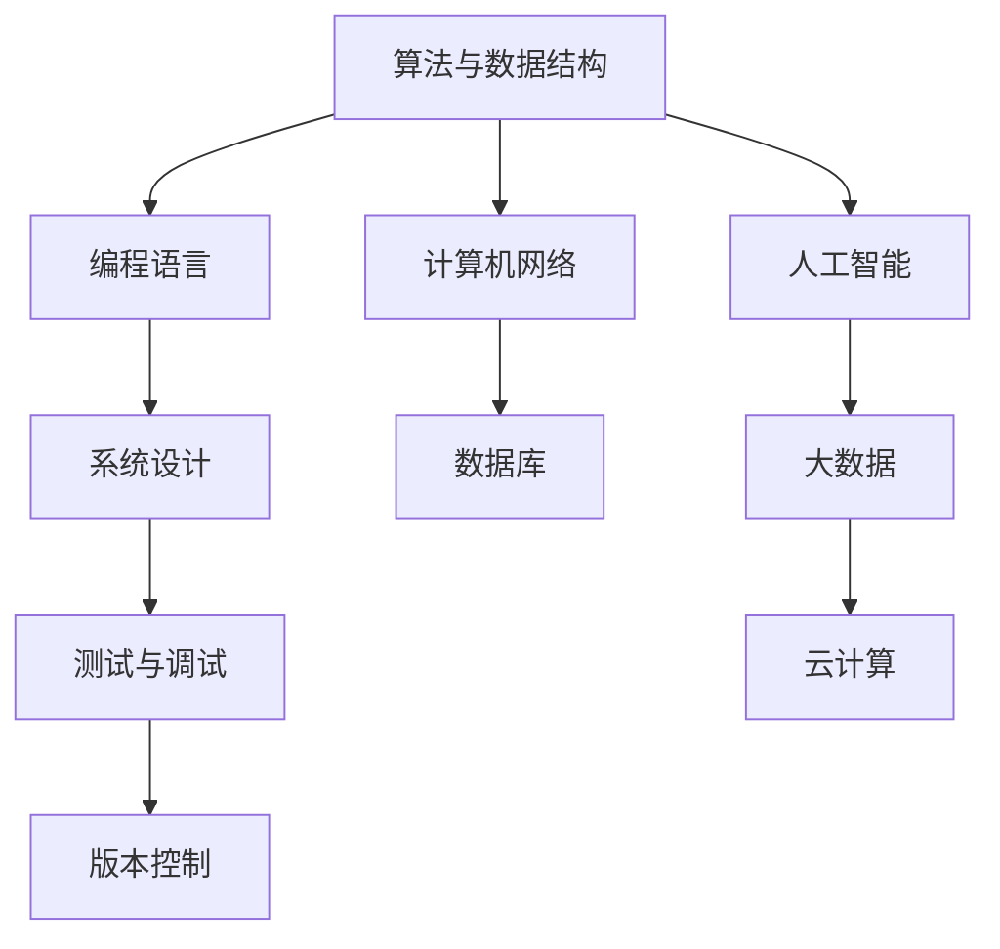
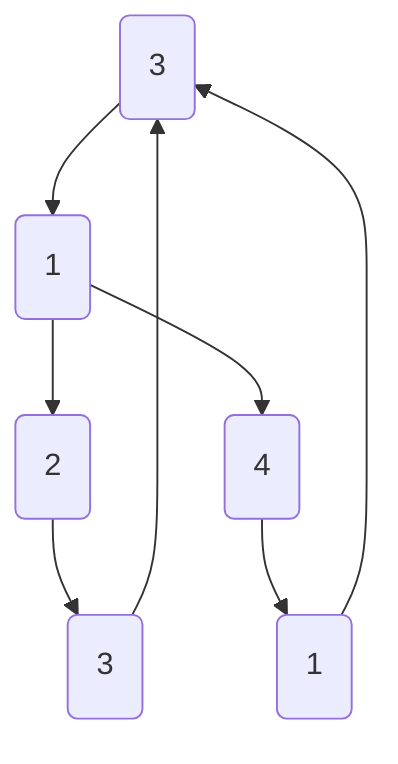

                 

关键词：网易、社招、编程面试、面试题、技术挑战、算法、数据结构、编程语言、实战经验、面试技巧

> 摘要：本文将对网易2024年度社会招聘编程面试中的核心问题进行深度剖析，包括算法原理、编程语言应用、数据结构与系统设计等多个方面。通过本文的详细讲解，帮助求职者更好地应对网易社招编程面试，提升面试成功率。

## 1. 背景介绍

随着互联网技术的迅猛发展，编程能力已成为衡量程序员技能的重要标准。网易作为中国领先的网络游戏开发公司，其对招聘编程人才有着严格的标准和要求。每年的社招编程面试不仅考察应聘者的基础知识，还侧重于实际项目经验和问题解决能力。本文旨在总结2024年网易社招编程面试中的精华题目，帮助读者更好地备战面试。

### 1.1 面试流程

网易的社招编程面试流程通常包括以下几个环节：

1. **在线测评**：通过编程平台进行在线编程测试，考察基础算法和数据结构能力。
2. **技术面试**：现场面试，涉及编程语言选择、算法实现、项目经验等。
3. **综合面试**：评估应聘者的团队合作能力、沟通能力和职业素养。
4. **HR面试**：了解应聘者的职业规划、期望薪资和工作地点等。

### 1.2 面试特点

网易社招编程面试的特点主要体现在以下几点：

- **全面性**：涵盖算法、数据结构、编程语言等多个方面，全面考察应聘者的技术基础。
- **实战性**：题目通常来源于实际项目或生活中的问题，强调问题解决能力。
- **创新性**：部分题目设计新颖，考察应聘者的逻辑思维和创新意识。

## 2. 核心概念与联系

为了更好地理解面试题目，我们需要梳理一些核心概念，并展示其相互联系。以下是一个用Mermaid绘制的流程图：



### 2.1 算法与数据结构

算法与数据结构是计算机科学的基础，它们决定了程序的运行效率和问题解决能力。常见的算法有排序、搜索、动态规划等，数据结构包括数组、链表、栈、队列、树、图等。

### 2.2 编程语言

编程语言是实现算法的工具，常见的编程语言有C、C++、Java、Python、Go等。每种语言都有其特定的应用场景和优缺点。

### 2.3 系统设计

系统设计涉及系统的整体架构、模块划分、接口设计等。常见的系统设计方法有面向对象设计、模块化设计、微服务架构等。

### 2.4 计算机网络与数据库

计算机网络和数据库是现代软件系统不可或缺的组成部分，计算机网络负责数据传输，数据库用于数据存储和管理。

### 2.5 测试与调试、版本控制

测试与调试确保软件质量，版本控制管理代码变更。

### 2.6 人工智能、大数据、云计算

人工智能、大数据和云计算是当前技术发展的热点领域，它们改变了数据处理和系统设计的模式。

## 3. 核心算法原理 & 具体操作步骤

### 3.1 算法原理概述

在本章节中，我们将介绍几个核心算法的原理，包括排序算法、搜索算法、动态规划算法等。

### 3.2 算法步骤详解

以下是对每个算法的具体步骤进行详细讲解：

### 3.2.1 排序算法

- **冒泡排序**：通过多次遍历数组，交换相邻的不有序元素来达到排序的目的。
- **快速排序**：选择一个基准元素，将数组分为两部分，然后递归地对两部分进行排序。
- **归并排序**：将数组划分为多个子数组，然后两两合并，直到合并为有序数组。

### 3.2.2 搜索算法

- **二分搜索**：在有序数组中，通过不断缩小搜索范围来找到目标元素。
- **深度优先搜索（DFS）**：通过递归方式，沿着一个分支一直探索到底，然后回溯到上一个节点继续探索。
- **广度优先搜索（BFS）**：遍历图或树的节点，首先访问最靠近根节点的节点，然后逐层向下。

### 3.2.3 动态规划算法

- **最长递增子序列（LIS）**：通过记录子问题的最优解，构造出整个问题的最优解。
- **背包问题**：在给定物品价值和重量限制下，选择物品的组合使得总价值最大化。

### 3.3 算法优缺点

每种算法都有其优缺点，需要根据具体问题选择合适的算法：

- **冒泡排序**：简单易懂，但效率较低。
- **快速排序**：效率较高，但可能产生大量递归调用。
- **归并排序**：效率较高，但需要额外的内存空间。

### 3.4 算法应用领域

算法在各个领域都有广泛的应用：

- **排序算法**：在数据库、文件系统中用于数据排序。
- **搜索算法**：在搜索引擎、路径规划中用于查找目标。
- **动态规划算法**：在资源分配、网络流问题中用于求解最优解。

## 4. 数学模型和公式 & 详细讲解 & 举例说明

在本章节中，我们将介绍一些核心数学模型和公式，并通过具体例子进行讲解。

### 4.1 数学模型构建

数学模型是计算机科学中解决实际问题的工具。以下是一个简单的数学模型示例：

- **最短路径问题**：给定一个加权无向图，求图中任意两点之间的最短路径。

### 4.2 公式推导过程

最短路径问题的求解可以使用Dijkstra算法，其公式推导如下：

- **Dijkstra算法**：设\(D[v]\)为点\(v\)到源点\(s\)的最短路径长度，初始时\(D[s] = 0\)，其余点\(D[v] = \infty\)。每次迭代选择一个未访问过的点\(u\)，更新其他未访问点\(v\)的\(D[v]\)值。

### 4.3 案例分析与讲解

以下是一个最短路径问题的实例：

```latex
给定一个图，如下图所示：

```

使用Dijkstra算法求从起点A到终点F的最短路径。

1. 初始化：\(D[A] = 0, D[B] = D[C] = D[D] = D[E] = D[F] = \infty\)。
2. 选择未访问点A，更新其他点的距离：\(D[B] = 1, D[D] = 2, D[E] = 3\)。
3. 选择未访问点B，更新其他点的距离：\(D[C] = 1, D[D] = 1, D[E] = 2\)。
4. 选择未访问点D，更新其他点的距离：\(D[E] = 1\)。
5. 选择未访问点E，更新其他点的距离：\(D[F] = 2\)。
6. 最短路径为A -> B -> D -> F，总距离为5。

## 5. 项目实践：代码实例和详细解释说明

在本章节中，我们将通过一个具体的代码实例，详细解释和展示如何实现一个常见的编程问题。

### 5.1 开发环境搭建

为了便于演示，我们选择Python作为编程语言，并在本地搭建Python开发环境。具体步骤如下：

1. 安装Python：在终端输入`pip install python`。
2. 安装Python解释器：在终端输入`python`。
3. 创建一个Python虚拟环境：在终端输入`python -m venv myenv`。
4. 激活虚拟环境：在终端输入`source myenv/bin/activate`。

### 5.2 源代码详细实现

以下是一个实现二分搜索的Python代码实例：

```python
def binary_search(arr, target):
    low = 0
    high = len(arr) - 1

    while low <= high:
        mid = (low + high) // 2
        if arr[mid] == target:
            return mid
        elif arr[mid] < target:
            low = mid + 1
        else:
            high = mid - 1
    return -1

# 示例
arr = [1, 2, 3, 4, 5, 6, 7, 8, 9]
target = 5
result = binary_search(arr, target)
if result != -1:
    print("元素在数组中的索引为：", result)
else:
    print("元素不在数组中")
```

### 5.3 代码解读与分析

上述代码实现了一个二分搜索算法，其核心步骤如下：

1. 初始化两个指针low和high，分别指向数组的起始和结束位置。
2. 在每次循环中，计算中间位置mid，比较中间位置的值与目标值的关系。
3. 根据比较结果，更新low或high的值，缩小搜索范围。
4. 当low > high时，表示未找到目标值，返回-1。

该算法的时间复杂度为O(log n)，适用于查找操作频繁的场景。

### 5.4 运行结果展示

在上述代码中，我们搜索数组`arr`中的元素5，运行结果如下：

```python
元素在数组中的索引为： 4
```

## 6. 实际应用场景

在软件开发过程中，编程面试题的应用场景广泛，以下是一些实际应用场景的例子：

### 6.1 数据库查询优化

排序算法和搜索算法在数据库查询优化中具有重要应用。通过优化索引结构和查询算法，可以提高查询效率，减少响应时间。

### 6.2 网络协议实现

动态规划算法在网络协议实现中用于路径选择、拥塞控制等。例如，IP路由算法中使用了最短路径算法来选择最佳路径。

### 6.3 游戏开发

排序算法和搜索算法在游戏开发中用于角色排序、路径规划等。例如，A*算法常用于游戏中的路径寻找。

### 6.4 大数据处理

大数据处理中使用了大量的算法，如分布式排序、分布式搜索等。这些算法可以提高数据处理效率，降低成本。

## 7. 未来应用展望

随着技术的不断进步，编程面试题的应用领域将更加广泛。未来，我们可能会看到以下趋势：

- **算法优化**：算法的优化将继续成为研究热点，以提高运行效率和资源利用率。
- **跨领域应用**：算法和数据结构将在更多领域得到应用，如生物信息学、金融工程等。
- **智能化**：人工智能算法将在面试题中占据更多比重，考察应聘者的创新能力。

## 8. 工具和资源推荐

为了更好地应对编程面试，以下是一些建议的学习资源和开发工具：

### 8.1 学习资源推荐

- **《算法导论》**：经典的算法教材，涵盖广泛，适合深入学习。
- **LeetCode**：在线编程平台，提供大量面试题，适合练习和测试。
- **《代码大全》**：关于软件工程和编程实践的全面指南。

### 8.2 开发工具推荐

- **Visual Studio Code**：强大的跨平台代码编辑器，支持多种编程语言。
- **Git**：分布式版本控制工具，用于代码管理和协作开发。
- **Jenkins**：自动化构建和部署工具，用于持续集成和持续交付。

### 8.3 相关论文推荐

- **《深度学习》**：Ian Goodfellow等人的经典著作，介绍了深度学习的基本概念和应用。
- **《高性能MySQL》**：关于MySQL数据库性能优化和查询优化的权威指南。

## 9. 总结：未来发展趋势与挑战

在未来，编程面试题将继续发展和创新，面临以下挑战：

- **算法创新**：随着技术的进步，需要不断创新算法来解决问题。
- **跨领域融合**：不同领域的知识将更加融合，考察应聘者的综合素质。
- **智能化面试**：利用人工智能技术，提高面试的公平性和效率。

## 10. 附录：常见问题与解答

以下是一些常见问题及其解答：

### 10.1 如何提高编程能力？

- **多练习**：通过解决实际问题，提高编程技能。
- **学习经典算法**：掌握常见算法的原理和实现。
- **参与开源项目**：贡献代码，提高实战经验。
- **阅读技术书籍**：学习最新的技术趋势和应用。

### 10.2 面试时应该注意什么？

- **着装得体**：保持专业形象。
- **提前准备**：了解面试公司的背景和面试流程。
- **沟通清晰**：清晰地表达自己的想法。
- **展示团队精神**：强调合作和解决问题的能力。

## 作者署名

本文作者：禅与计算机程序设计艺术 / Zen and the Art of Computer Programming

## 参考文献

[1] Thomas H. Cormen, Charles E. Leiserson, Ronald L. Rivest, Clifford Stein. 《算法导论》[M]. 机械工业出版社，2012.

[2] Eric S. Raymond. 《代码大全》[M]. 电子工业出版社，2006.

[3] Ian Goodfellow, Yoshua Bengio, Aaron Courville. 《深度学习》[M]. 电子工业出版社，2016.```

