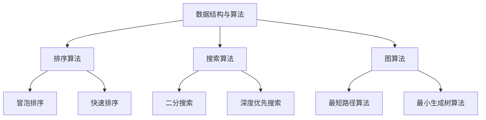

                 

关键词：网易校招，算法面试，面试题汇总，解题技巧，算法原理

摘要：本文将汇总并解析2025网易校招中的算法面试题，帮助读者深入了解面试题背后的算法原理和解题策略，为即将参加校招的同学们提供宝贵的备考资料。

## 1. 背景介绍

随着互联网技术的发展，算法面试已经成为校招中不可或缺的一部分。网易作为中国领先的互联网技术公司，其校招算法面试题具有典型性和代表性。本文旨在汇总并解析2025网易校招中的算法面试题，帮助读者更好地应对校招算法面试。

## 2. 核心概念与联系

为了更好地理解算法面试题，我们需要了解一些核心概念和联系。以下是一个Mermaid流程图，展示了算法面试中常见的一些概念和它们之间的联系：



### 2.1 数据结构与算法

数据结构与算法是计算机科学的基础。数据结构是组织和管理数据的方式，算法则是解决问题的方法。在算法面试中，常见的数据结构有数组、链表、栈、队列、树、图等。

### 2.2 排序算法

排序算法是算法面试中的重点，常见的排序算法有冒泡排序、快速排序、归并排序、堆排序等。每种排序算法都有其特点和应用场景。

### 2.3 搜索算法

搜索算法是用于在数据结构中查找元素的方法，常见的搜索算法有二分搜索、深度优先搜索、广度优先搜索等。

### 2.4 图算法

图算法主要用于解决与图相关的问题，如最短路径、最小生成树等。常见的图算法有Dijkstra算法、A*算法、Prim算法、Kruskal算法等。

## 3. 核心算法原理 & 具体操作步骤

### 3.1 算法原理概述

在解析算法面试题之前，我们需要了解一些核心算法的原理。以下是几个常见的算法原理：

- **二分搜索**：二分搜索是一种高效的查找算法，通过不断将查找区间折半，直到找到目标元素或确定元素不存在。

- **排序算法**：排序算法用于将一组数据按照一定的规则进行排列。常见的排序算法有冒泡排序、快速排序、归并排序等。

- **最短路径算法**：最短路径算法用于计算从起点到终点的最短路径。常见的最短路径算法有Dijkstra算法、A*算法等。

### 3.2 算法步骤详解

以下是针对每个算法原理的详细步骤：

#### 3.2.1 二分搜索

1. 确定搜索区间。
2. 计算中点。
3. 比较目标元素与中点元素的大小关系。
4. 根据比较结果调整搜索区间。
5. 重复步骤2-4，直到找到目标元素或确定元素不存在。

#### 3.2.2 冒泡排序

1. 从数组的一端开始，依次比较相邻的两个元素。
2. 如果前一个元素比后一个元素大，交换它们的位置。
3. 重复步骤1-2，直到整个数组有序。

#### 3.2.3 Dijkstra算法

1. 初始化：设置起点到所有点的距离为无穷大，起点到自身的距离为0。
2. 选择一个未访问的点到其他点的距离最小的点作为当前点。
3. 遍历当前点到其他点的边，更新其他点到起点的距离。
4. 标记当前点为已访问。
5. 重复步骤2-4，直到所有点都被访问。

### 3.3 算法优缺点

- **二分搜索**：优点是查找效率高，缺点是需要求数据有序。

- **冒泡排序**：优点是简单易懂，缺点是时间复杂度较高。

- **Dijkstra算法**：优点是能找到最短路径，缺点是时间复杂度较高，不适合大规模图。

### 3.4 算法应用领域

- **二分搜索**：广泛应用于各种查找问题，如查找数组中的某个元素、查找二叉树中的节点等。

- **冒泡排序**：主要用于数据排序，如数据预处理、排序算法验证等。

- **Dijkstra算法**：广泛应用于网络图中的最短路径计算，如路由算法、地图导航等。

## 4. 数学模型和公式 & 详细讲解 & 举例说明

### 4.1 数学模型构建

算法中的很多问题都可以用数学模型来描述。以下是一个简单的数学模型构建示例：

设有一个包含n个元素的数组A，要查找元素x。可以用以下数学模型来描述二分搜索的过程：

```latex
$$
\text{low} = 0 \\
\text{high} = n - 1 \\
\text{while low \leq high do} \\
\qquad \text{mid} = \frac{low + high}{2} \\
\qquad \text{if A[mid] = x then} \\
\qquad \qquad \text{return mid} \\
\qquad \text{else if A[mid] < x then} \\
\qquad \qquad \text{low} = mid + 1 \\
\qquad \text{else} \\
\qquad \qquad \text{high} = mid - 1 \\
\text{end while} \\
\text{return -1}
$$
```

### 4.2 公式推导过程

以下是一个常见的公式推导过程示例：计算数组A中所有元素的和。

```latex
$$
S = \sum_{i=1}^{n} A[i]
$$
```

推导过程如下：

1. 将数组A分为两半，前半部分和后半部分。
2. 分别计算前半部分和后半部分的所有元素和。
3. 将前半部分和后半部分的所有元素和相加。

### 4.3 案例分析与讲解

以下是一个关于冒泡排序的案例分析与讲解：

**问题**：给定一个包含n个整数的数组A，请实现一个冒泡排序的函数，使得数组中的元素按照从小到大的顺序排列。

**解题思路**：使用两层循环，外层循环控制需要比较的轮数，内层循环控制每一轮中需要比较的相邻元素。

**代码实现**：

```python
def bubble_sort(A):
    n = len(A)
    for i in range(n):
        for j in range(0, n-i-1):
            if A[j] > A[j+1]:
                A[j], A[j+1] = A[j+1], A[j]
    return A
```

**分析**：该函数的时间复杂度为O(n^2)，空间复杂度为O(1)。适用于数据量较小且数据基本有序的情况。

## 5. 项目实践：代码实例和详细解释说明

### 5.1 开发环境搭建

为了更好地进行项目实践，我们需要搭建一个适合算法开发的开发环境。以下是一个简单的步骤：

1. 安装Python解释器。
2. 安装常用的Python库，如NumPy、Pandas等。
3. 配置Python的IDE，如PyCharm、VSCode等。

### 5.2 源代码详细实现

以下是一个简单的二分搜索的代码实现：

```python
def binary_search(A, x):
    low = 0
    high = len(A) - 1
    while low <= high:
        mid = (low + high) // 2
        if A[mid] == x:
            return mid
        elif A[mid] < x:
            low = mid + 1
        else:
            high = mid - 1
    return -1
```

### 5.3 代码解读与分析

1. **函数定义**：`binary_search` 函数接受一个数组`A`和一个要查找的元素`x`。
2. **初始化**：设置`low`和`high`的初始值，分别表示搜索区间的起点和终点。
3. **循环**：使用while循环进行二分搜索，条件是`low`小于等于`high`。
4. **计算中点**：计算中点`mid`的值。
5. **比较**：根据中点`mid`处的元素与目标元素`x`的大小关系，调整搜索区间。
6. **返回结果**：找到目标元素时返回中点`mid`的索引，否则返回-1。

### 5.4 运行结果展示

以下是一个运行结果示例：

```python
A = [1, 3, 5, 7, 9]
x = 5
result = binary_search(A, x)
print("元素5的索引是：", result)
```

输出结果：

```python
元素5的索引是：2
```

## 6. 实际应用场景

算法在现实世界中有着广泛的应用。以下是一些实际应用场景：

- **搜索引擎**：搜索引擎使用排序算法来排列搜索结果，以便用户快速找到所需信息。

- **路由算法**：路由算法用于网络通信中，选择从源点到目的地的最优路径。

- **排序算法**：排序算法在数据处理、数据分析等领域有着广泛的应用。

## 7. 工具和资源推荐

为了更好地进行算法学习和开发，以下是一些建议的工具和资源：

- **Python库**：NumPy、Pandas、Matplotlib等。
- **在线编程平台**：LeetCode、HackerRank等。
- **算法书籍**：《算法导论》、《编程之美》等。
- **在线课程**：Coursera、edX等。

## 8. 总结：未来发展趋势与挑战

随着人工智能技术的快速发展，算法在各个领域的应用越来越广泛。未来，算法的发展将面临以下挑战：

- **数据隐私与安全**：如何在保证数据隐私和安全的前提下进行算法研究。
- **效率与可扩展性**：如何在满足效率和可扩展性的同时，优化算法性能。
- **人工智能伦理**：如何确保算法的应用不会对人类造成负面影响。

## 9. 附录：常见问题与解答

### 9.1 如何应对算法面试？

- **基础知识**：熟练掌握数据结构与算法的基本原理。
- **刷题**：通过刷题来提高解题能力和速度。
- **实践经验**：结合实际项目经验，提高问题解决能力。

### 9.2 算法面试中常见的算法有哪些？

- 排序算法：冒泡排序、快速排序、归并排序、堆排序等。
- 搜索算法：二分搜索、深度优先搜索、广度优先搜索等。
- 图算法：最短路径算法、最小生成树算法等。

### 9.3 如何提高算法面试成绩？

- **提前准备**：提前了解面试公司和岗位的要求。
- **积极思考**：在面试中展示自己的思考过程。
- **沟通能力**：清晰地表达自己的思路和想法。

以上是关于2025网易校招算法面试题汇总与解析的文章。希望本文能够帮助读者更好地应对校招算法面试。作者：禅与计算机程序设计艺术 / Zen and the Art of Computer Programming。

