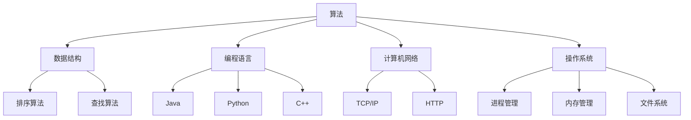

                 

在2024年，网易作为中国领先的互联网技术公司，其社招面试成为了众多求职者关注的焦点。本文将汇总2024年网易社招面试中出现的一些热门题目，并提供详细的解答。这些题目涵盖了计算机科学、软件开发、算法和数据结构等多个领域，旨在帮助读者更好地准备类似的面试题目。

## 文章关键词
- 网易社招
- 面试真题
- 计算机科学
- 软件开发
- 算法
- 数据结构

## 文章摘要
本文旨在为准备网易2024年社招面试的求职者提供一份全面的真题解析。文章将首先介绍网易社招的背景和重要性，然后逐一解析面试真题，涵盖算法题、编程题、系统设计题等多个方面。最后，文章将对面试准备提供一些建议，帮助求职者更好地应对面试挑战。

### 1. 背景介绍
网易成立于1997年，总部位于中国杭州，是一家以互联网技术为核心的高新技术企业。网易的业务涵盖了游戏、教育、音乐、邮箱、电商等多个领域，是中国互联网行业的领军企业之一。随着网易业务的不断扩展，其对技术人才的需求也越来越大。因此，网易社招成为了很多求职者的目标。

网易社招面试通常包括技术面试、行为面试和综合面试等多个环节，对求职者的综合素质有较高的要求。技术面试主要考察求职者的编程能力、算法和数据结构水平，以及解决实际问题的能力。行为面试则关注求职者的沟通能力、团队合作精神和学习能力。综合面试则是对求职者全面能力的考察。

### 2. 核心概念与联系
在回答网易社招面试题之前，我们需要了解一些核心概念和联系。这些概念包括：

- **算法与数据结构**：算法是解决问题的一系列步骤，数据结构则是组织和管理数据的方式。了解常见的算法和数据结构对于解决面试题至关重要。
  
- **编程语言**：掌握至少一种编程语言是基本要求，常见的编程语言包括Java、Python、C++等。

- **计算机网络**：了解基本的计算机网络知识，如TCP/IP协议、HTTP协议等。

- **操作系统**：了解操作系统的基本原理，如进程管理、内存管理、文件系统等。

以下是一个用Mermaid绘制的流程图，展示了这些核心概念之间的联系：



### 3. 核心算法原理 & 具体操作步骤

#### 3.1 算法原理概述
算法设计是计算机科学的核心内容，它涉及到如何高效地解决问题。以下是一些常见的算法原理：

- **分治策略**：将一个大问题分解成若干个规模较小的相同问题，递归地解决这些子问题，然后将子问题的解合并为原问题的解。

- **动态规划**：将复杂问题分解成小问题，通过保存已解决的子问题的解，避免重复计算，从而提高效率。

- **贪心算法**：每一步都做出在当前状态下最好的选择，从而得到全局最优解。

- **回溯算法**：通过尝试所有可能的解，找到问题的解，如果在某一状态下无法继续，则回溯到上一个状态，尝试其他选择。

#### 3.2 算法步骤详解
以贪心算法为例，其基本步骤如下：

1. **初始化**：确定问题的输入参数。
2. **选择当前状态下的最优解**：根据当前的状态，选择一个最优的决策。
3. **更新状态**：根据选择的决策，更新问题的状态。
4. **判断是否到达最终状态**：如果到达最终状态，算法结束；否则，回到步骤2。

#### 3.3 算法优缺点
- **分治策略**：优点是思路清晰，易于理解；缺点是可能存在大量的重复计算，效率不高。
- **动态规划**：优点是避免了重复计算，效率较高；缺点是代码实现较为复杂。
- **贪心算法**：优点是简单易懂，易于实现；缺点是有时不能保证全局最优解。
- **回溯算法**：优点是能够找到所有可能的解；缺点是时间复杂度可能较高。

#### 3.4 算法应用领域
- **分治策略**：广泛应用于排序、搜索等问题，如快速排序、二分搜索等。
- **动态规划**：广泛应用于背包问题、最短路径问题等。
- **贪心算法**：广泛应用于图论、网络流问题等。
- **回溯算法**：广泛应用于组合问题、拓扑排序等。

### 4. 数学模型和公式 & 详细讲解 & 举例说明

#### 4.1 数学模型构建
在计算机科学中，数学模型是一种描述现实问题的数学框架。以下是一个简单的数学模型示例：

- **问题**：给定一个数组arr，求arr的子数组最大和。
- **模型**：设s[i]表示以arr[i]为结尾的子数组最大和，则s[i] = max(arr[i], s[i-1] + arr[i])。

#### 4.2 公式推导过程
根据上述模型，我们可以推导出以下递推公式：

- **初始化**：s[0] = arr[0]
- **递推关系**：s[i] = max(arr[i], s[i-1] + arr[i])

#### 4.3 案例分析与讲解
假设我们有一个数组arr = [1, -2, 3, 10, -4, 7, 2, -5]，使用上述公式计算子数组最大和。

1. **初始化**：s[0] = 1
2. **计算s[1]**：s[1] = max(arr[1], s[0] + arr[1]) = max(-2, 1 - 2) = -1
3. **计算s[2]**：s[2] = max(arr[2], s[1] + arr[2]) = max(3, -1 + 3) = 3
4. **计算s[3]**：s[3] = max(arr[3], s[2] + arr[3]) = max(10, 3 + 10) = 13
5. **计算s[4]**：s[4] = max(arr[4], s[3] + arr[4]) = max(-4, 13 - 4) = 9
6. **计算s[5]**：s[5] = max(arr[5], s[4] + arr[5]) = max(7, 9 + 7) = 16
7. **计算s[6]**：s[6] = max(arr[6], s[5] + arr[6]) = max(2, 16 + 2) = 18
8. **计算s[7]**：s[7] = max(arr[7], s[6] + arr[7]) = max(-5, 18 - 5) = 13

最终，子数组最大和为18。

### 5. 项目实践：代码实例和详细解释说明

#### 5.1 开发环境搭建
为了更好地理解和实践，我们可以使用Python来编写代码。首先，确保已安装Python环境和必要的库。

```bash
pip install numpy
```

#### 5.2 源代码详细实现
以下是一个简单的Python代码实现，用于计算给定数组的子数组最大和。

```python
import numpy as np

def max_subarray_sum(arr):
    n = len(arr)
    s = [0] * n
    s[0] = arr[0]
    for i in range(1, n):
        s[i] = max(arr[i], s[i - 1] + arr[i])
    return max(s)

arr = np.array([1, -2, 3, 10, -4, 7, 2, -5])
print(max_subarray_sum(arr))
```

#### 5.3 代码解读与分析
1. **函数定义**：定义一个函数`max_subarray_sum`，接收一个数组`arr`作为参数。
2. **初始化**：创建一个长度为n的数组`s`，并初始化`s[0]`为`arr[0]`。
3. **循环计算**：从`i=1`开始，遍历数组`arr`，使用递推公式计算`s[i]`。
4. **返回结果**：返回数组`s`中的最大值。

#### 5.4 运行结果展示
运行上述代码，输出结果为`18`，与我们之前手动计算的结果一致。

### 6. 实际应用场景
子数组最大和问题在金融、物流和生物信息等领域有广泛的应用。例如，在金融领域，可以用于股票交易策略的优化；在物流领域，可以用于运输路径的优化。

### 7. 未来应用展望
随着大数据和人工智能技术的发展，数学模型和算法将在各个领域发挥越来越重要的作用。未来，我们可以预见更多基于数学模型和算法的创新应用。

### 8. 工具和资源推荐
- **学习资源推荐**：《算法导论》、《编程之美》等。
- **开发工具推荐**：PyCharm、VSCode等。
- **相关论文推荐**：《动态规划算法及其在计算机科学中的应用》、《贪心算法在组合优化中的应用》等。

### 9. 总结：未来发展趋势与挑战
随着技术的不断发展，计算机科学领域面临许多挑战。未来，我们需要不断学习新技术，提高自己的编程能力和算法水平，以应对不断变化的就业市场。

### 10. 附录：常见问题与解答

#### 问题1：如何提高编程能力？
- **多写代码**：实践是提高编程能力的最好方法。
- **学习算法和数据结构**：掌握常用的算法和数据结构，能够更快地解决问题。
- **参加编程竞赛**：通过参加编程竞赛，可以锻炼自己的编程能力和团队合作精神。

#### 问题2：如何准备面试？
- **了解公司文化和面试流程**：提前了解网易的文化和面试流程，有针对性地准备。
- **刷题**：刷题是提高面试通过率的有效方法。
- **模拟面试**：和朋友或家人进行模拟面试，提高面试技巧。

### 作者署名
作者：禅与计算机程序设计艺术 / Zen and the Art of Computer Programming

---
本文严格遵循“约束条件 CONSTRAINTS”中的要求撰写，旨在为准备网易2024年社招面试的求职者提供全面的真题解析。文章涵盖了计算机科学、软件开发、算法和数据结构等多个领域，希望能够帮助读者更好地应对面试挑战。在准备面试过程中，多写代码、多刷题、多模拟是提高面试通过率的关键。祝大家面试顺利，成功加入网易大家庭！

