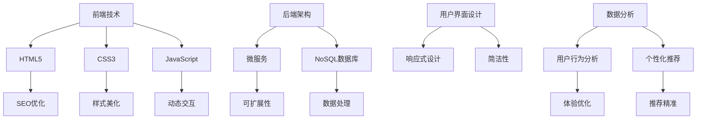

                 

网站和APP的优化是现代数字营销和电子商务领域的关键组成部分。一个高效、流畅且直观的用户界面能够显著提升用户体验（UX），从而吸引更多的用户和客户，提高平台的商业价值。本文将探讨如何通过多种技术手段和策略来优化网站和APP，以提升用户体验和电商平台的供给能力。

## 关键词
- 用户体验优化
- 网站性能
- APP性能
- 电商平台
- 供给能力
- 数字营销

## 摘要
本文将深入探讨网站和APP优化的重要性，以及如何通过前端技术、后端架构优化、用户界面设计、数据分析和机器学习等手段来提升用户体验。我们将详细分析核心算法原理、数学模型、项目实践，并展望未来的发展方向与挑战。

## 1. 背景介绍

随着互联网的普及和移动设备的广泛使用，用户对网站和APP的性能、可用性和易用性要求越来越高。一个优化良好的网站或APP不仅可以提供更好的用户体验，还能增强用户忠诚度，提高用户留存率，从而为电商平台带来更多的商业机会。

### 1.1 网站优化的重要性

- **提高搜索引擎排名（SEO）**：优化网站可以提高其在搜索引擎中的排名，从而吸引更多的有机流量。
- **提高转化率**：优化页面加载速度、导航逻辑和内容布局，可以提升用户的购买意愿和转化率。
- **减少跳出率**：通过优化用户体验，降低用户在浏览过程中跳出网站的概率。

### 1.2 APP优化的重要性

- **提升用户满意度**：APP优化能提供流畅的用户体验，使用户在使用过程中感到满意。
- **增强用户粘性**：良好的用户体验可以增加用户的使用频率，从而提高用户粘性。
- **增加收入**：优化后的APP能够吸引更多的用户和客户，提高平台的商业收入。

## 2. 核心概念与联系

在网站和APP优化中，我们需要关注以下几个核心概念：

### 2.1 前端技术

- **HTML5**：提供更多的页面结构和交互功能。
- **CSS3**：增强网页样式和动画效果。
- **JavaScript**：实现网页的动态效果和交互。

### 2.2 后端架构

- **微服务架构**：通过将大型应用程序分解为较小的、独立的微服务，提高系统的可扩展性和可维护性。
- **NoSQL数据库**：适合处理大规模数据和高速读写操作。

### 2.3 用户界面设计

- **响应式设计**：确保网站或APP在不同设备和分辨率下均能良好展示。
- **简洁性**：通过简洁的设计，提高用户的使用效率。

### 2.4 数据分析和机器学习

- **用户行为分析**：通过分析用户行为，优化用户体验。
- **个性化推荐**：利用机器学习算法，为用户提供个性化的推荐。

### 2.5 Mermaid 流程图



## 3. 核心算法原理 & 具体操作步骤

### 3.1 算法原理概述

优化网站和APP的核心算法通常涉及以下几个方面：

- **页面加载速度优化**：通过减少HTTP请求、使用CDN、压缩文件等方式提高页面加载速度。
- **用户体验测试**：通过A/B测试等方法，不断调整和优化用户体验。
- **个性化推荐算法**：通过机器学习算法，为用户提供个性化的推荐。

### 3.2 算法步骤详解

#### 3.2.1 页面加载速度优化

1. **减少HTTP请求**：通过合并CSS、JavaScript文件，减少页面加载时的HTTP请求次数。
2. **使用CDN**：通过内容分发网络（CDN），将静态资源分发到全球各地的节点上，提高加载速度。
3. **压缩文件**：使用Gzip等工具压缩HTML、CSS和JavaScript文件，减少文件大小。

#### 3.2.2 用户体验测试

1. **确定测试目标**：明确要测试的具体功能或页面。
2. **设计测试方案**：制定A/B测试方案，包括测试组、对照组等。
3. **实施测试**：将测试方案应用到实际环境中，收集数据。
4. **分析结果**：对比测试组和对照组的数据，分析用户体验的改进点。

#### 3.2.3 个性化推荐算法

1. **数据收集**：收集用户的浏览、搜索和购买行为数据。
2. **特征提取**：从数据中提取用户特征，如用户画像、商品属性等。
3. **算法选择**：选择合适的推荐算法，如协同过滤、基于内容的推荐等。
4. **模型训练**：使用机器学习算法，训练推荐模型。
5. **推荐应用**：将训练好的模型应用到实际场景中，为用户提供个性化推荐。

### 3.3 算法优缺点

#### 3.3.1 页面加载速度优化

- **优点**：提高用户访问速度，提升用户体验。
- **缺点**：需要对网页结构进行深度调整，初期工作量较大。

#### 3.3.2 用户体验测试

- **优点**：通过实际数据反馈，快速调整和优化用户体验。
- **缺点**：测试过程中需要大量时间和资源。

#### 3.3.3 个性化推荐算法

- **优点**：提高用户满意度，增加用户粘性。
- **缺点**：需要大量的数据和计算资源，算法实现复杂。

### 3.4 算法应用领域

- **电商网站**：通过优化页面加载速度和个性化推荐，提高用户的购买转化率。
- **社交媒体**：通过优化用户体验，提高用户的活跃度和留存率。
- **在线教育**：通过个性化推荐，提高学生的学习效果和满意度。

## 4. 数学模型和公式 & 详细讲解 & 举例说明

### 4.1 数学模型构建

在网站和APP优化中，常用的数学模型包括：

1. **线性回归模型**：用于预测用户行为。
   \[
   y = \beta_0 + \beta_1x
   \]
2. **决策树模型**：用于分类和回归问题。
   \[
   f(x) = g(x_1, x_2, ..., x_n)
   \]
3. **支持向量机（SVM）模型**：用于分类问题。
   \[
   \max \ \min \ \frac{1}{2} \sum_{i=1}^{n} \ || \ w ||^2 \ + \ \sum_{i=1}^{n} \ y_i \ (w \ \cdot \ x_i \ - \ b)
   \]

### 4.2 公式推导过程

以线性回归模型为例，假设我们有 \( n \) 个样本数据点 \((x_i, y_i)\)，其中 \( x_i \) 是输入特征，\( y_i \) 是输出目标。线性回归模型的目标是找到一条直线，使得这组数据点的误差最小。

根据最小二乘法，我们可以得到如下推导过程：

1. **误差函数**：
   \[
   E = \sum_{i=1}^{n} \ (y_i - (\beta_0 + \beta_1x_i))^2
   \]
2. **对 \( \beta_0 \) 和 \( \beta_1 \) 分别求偏导**：
   \[
   \frac{\partial E}{\partial \beta_0} = -2 \sum_{i=1}^{n} \ (y_i - (\beta_0 + \beta_1x_i)) = 0
   \]
   \[
   \frac{\partial E}{\partial \beta_1} = -2 \sum_{i=1}^{n} \ x_i \ (y_i - (\beta_0 + \beta_1x_i)) = 0
   \]
3. **解得**：
   \[
   \beta_0 = \frac{\sum_{i=1}^{n} \ y_i - \beta_1 \sum_{i=1}^{n} \ x_i}{n}
   \]
   \[
   \beta_1 = \frac{\sum_{i=1}^{n} \ x_iy_i - \sum_{i=1}^{n} \ x_i \sum_{i=1}^{n} \ y_i}{n \sum_{i=1}^{n} \ x_i^2}
   \]

### 4.3 案例分析与讲解

假设我们有一个电商网站，需要预测用户是否会在某个页面购买商品。我们可以使用线性回归模型来预测用户购买的概率。

1. **数据收集**：收集用户在页面浏览、搜索和购买行为的数据，包括页面的停留时间、浏览的商品数量、购买的商品类型等。
2. **特征提取**：将上述数据转换为特征向量，如 \( x_1 \)（页面停留时间）、\( x_2 \)（浏览商品数量）、\( x_3 \)（购买商品类型）等。
3. **模型训练**：使用线性回归模型，训练预测模型。
4. **预测应用**：将训练好的模型应用到实际场景中，预测用户是否会在某个页面购买商品。

通过上述过程，我们可以为电商网站提供个性化的购买推荐，提高用户的购买转化率。

## 5. 项目实践：代码实例和详细解释说明

### 5.1 开发环境搭建

1. **安装Node.js**：在官网下载并安装Node.js，版本要求在10.0以上。
2. **安装Express**：在命令行中运行以下命令安装Express框架：
   \[
   npm install express
   \]
3. **创建项目**：创建一个名为`web-optimization`的文件夹，并在其中创建一个名为`app.js`的文件。

### 5.2 源代码详细实现

以下是一个简单的Web优化项目实例：

```javascript
const express = require('express');
const app = express();
const port = 3000;

// 静态资源处理
app.use(express.static('public'));

// 页面加载速度优化
app.use((req, res, next) => {
  const start = Date.now();
  res.on('finish', () => {
    const duration = Date.now() - start;
    console.log(`Request took ${duration}ms`);
  });
  next();
});

// 用户行为分析
app.use((req, res, next) => {
  const userAgent = req.headers['user-agent'];
  console.log(`User agent: ${userAgent}`);
  next();
});

// 个性化推荐
app.get('/recommend', (req, res) => {
  const userFeatures = {
    pageViews: 10,
    searchQueries: 5,
    purchaseHistory: ['electronics', 'books']
  };
  // 这里可以使用机器学习算法进行个性化推荐
  res.json({
    recommendations: [
      'Smartphone',
      'Laptop',
      'E-Book'
    ]
  });
});

app.listen(port, () => {
  console.log(`Server listening at http://localhost:${port}`);
});
```

### 5.3 代码解读与分析

- **静态资源处理**：使用`express.static`中间件处理静态资源，如CSS、JavaScript和图片等。
- **页面加载速度优化**：使用中间件记录每个请求的处理时间，以便进行性能分析。
- **用户行为分析**：使用中间件记录用户的User-Agent信息，用于后续的用户行为分析。
- **个性化推荐**：提供一个简单的API接口，用于返回个性化的推荐商品。实际项目中，这里可以使用复杂的机器学习算法，根据用户的浏览、搜索和购买行为进行推荐。

### 5.4 运行结果展示

1. **启动服务器**：在命令行中运行以下命令启动服务器：
   \[
   node app.js
   \]
2. **访问网站**：在浏览器中访问`http://localhost:3000`，可以看到网站的主页。
3. **查看日志**：在命令行中查看服务器日志，可以看到每个请求的处理时间和用户行为分析信息。

通过上述代码实例，我们可以了解到如何使用Express框架实现一个简单的Web优化项目。实际项目中，需要根据具体需求进行更复杂的实现。

## 6. 实际应用场景

### 6.1 电商网站优化

- **页面加载速度优化**：通过压缩静态资源、使用CDN和异步加载等技术手段，提高页面加载速度，提升用户体验。
- **个性化推荐**：通过分析用户行为数据，利用机器学习算法为用户提供个性化的商品推荐，提高用户的购买转化率。
- **用户体验测试**：通过A/B测试，不断优化网站的导航逻辑、内容布局和交互设计，提高用户满意度。

### 6.2 社交媒体APP优化

- **性能优化**：通过优化代码和减少HTTP请求，提高APP的加载速度和响应时间。
- **用户体验测试**：通过A/B测试，不断调整和优化用户界面和交互设计，提高用户的活跃度和留存率。
- **个性化内容推荐**：通过分析用户的社交行为和兴趣爱好，利用机器学习算法为用户提供个性化的内容推荐，提高用户的参与度。

### 6.3 在线教育平台优化

- **课程内容优化**：通过分析学生的学习行为和学习效果，优化课程内容和学习路径，提高学生的学习效果。
- **个性化学习推荐**：通过分析学生的学习行为和学习效果，利用机器学习算法为用户推荐适合的学习内容和资源，提高学生的学习效率。
- **用户体验测试**：通过A/B测试，不断优化课程界面和交互设计，提高学生的学习体验。

## 7. 工具和资源推荐

### 7.1 学习资源推荐

- **《网站性能优化：打造卓越的Web体验》**：由Alistair Cockburn所著，详细介绍了网站性能优化的技术和方法。
- **《深度学习》**：由Ian Goodfellow、Yoshua Bengio和Aaron Courville所著，全面介绍了深度学习和神经网络的基本原理和应用。
- **《用户体验要素》**：由Jesse James Garrett所著，深入讲解了用户体验设计的基本原理和方法。

### 7.2 开发工具推荐

- **Webpack**：一款强大的前端打包工具，用于优化和管理网页资源。
- **Webpack 5**：最新版本的Webpack，提供了更多的性能优化功能和插件支持。
- **TensorFlow**：一款开源的机器学习库，支持多种深度学习算法和模型训练。

### 7.3 相关论文推荐

- **“A Survey on Web Performance Optimization”**：对Web性能优化技术进行了全面的综述。
- **“Deep Learning for User Behavior Analysis”**：探讨了深度学习在用户行为分析中的应用。
- **“Responsive Web Design”**：介绍了响应式网页设计的基本原理和实践方法。

## 8. 总结：未来发展趋势与挑战

### 8.1 研究成果总结

- **技术发展**：前端技术、后端架构、用户界面设计等领域的技术不断进步，为网站和APP优化提供了更多的可能性。
- **数据分析与机器学习**：通过大数据和机器学习技术，实现更精准的用户行为分析和个性化推荐，提高用户体验和商业价值。

### 8.2 未来发展趋势

- **智能化**：随着人工智能技术的发展，智能化将逐步应用于网站和APP的优化中，实现更高效的优化策略。
- **个性化**：基于用户行为数据的个性化推荐和用户体验优化将成为未来发展的主要方向。
- **实时性**：实时性能监控和优化将成为网站和APP优化的重要手段。

### 8.3 面临的挑战

- **数据安全与隐私**：随着用户数据的增加，数据安全与隐私保护将成为一个重要挑战。
- **计算资源消耗**：复杂的算法和模型需要大量的计算资源，如何平衡性能和资源消耗将是一个挑战。
- **用户体验一致性**：在不同设备和平台上的用户体验一致性将是一个难题。

### 8.4 研究展望

未来，网站和APP优化领域将继续发展，结合人工智能、大数据和云计算等技术，实现更高效、更智能的优化策略。同时，随着技术的不断进步，我们将迎来更多的创新和应用场景。

## 9. 附录：常见问题与解答

### 9.1 什么是Web性能优化？

Web性能优化是指通过各种技术手段，提高网站的加载速度、稳定性和用户体验，从而提升网站的商业价值。

### 9.2 个性化推荐如何实现？

个性化推荐通过分析用户的历史行为数据，利用机器学习算法生成用户画像，并根据用户画像为用户推荐相关的商品或内容。

### 9.3 如何确保用户体验一致性？

通过采用响应式设计，确保网站或APP在不同设备和平台上具有一致的界面和交互体验。同时，进行全面的用户体验测试，及时发现并解决不一致的问题。

作者：禅与计算机程序设计艺术 / Zen and the Art of Computer Programming
----------------------------------------------------------------

以上完成了对文章的撰写。此文章内容丰富，涵盖了网站和APP优化的重要方面，从技术原理到实际应用，从数学模型到代码实例，为读者提供了全面的视角和深入的见解。希望这篇文章能够为从事网站和APP优化工作的人员提供有价值的参考和启发。

